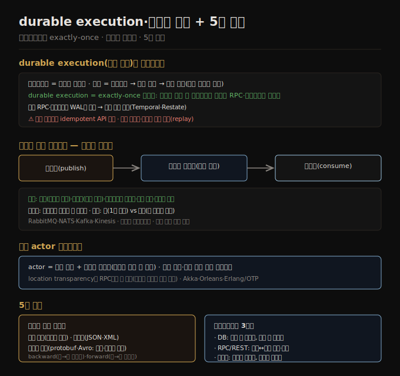

# durable execution과 이벤트 기반 아키텍처
> durable execution은 워크플로우에 exactly-once 의미론을 주고, 이벤트 기반 아키텍처는 메시지 브로커를 거쳐 송신자와 수신자를 비동기로 분리합니다.

이 노트를 읽고 나면 durable execution이 워크플로우의 exactly-once를 어떻게 구현하는지 설명하고, 메시지 브로커가 직접 RPC보다 나은 점을 말하며, 5장 전체의 인코딩·데이터플로우를 종합할 수 있습니다.

이 노트는 5장의 마지막으로, 서비스 기반 아키텍처의 워크플로우·durable execution, 그리고 비동기 메시지로 데이터가 흐르는 이벤트 기반 아키텍처를 다루고 5장을 종합합니다.

## 1. durable execution과 워크플로우
> 워크플로우는 여러 서비스 호출의 태스크 그래프이고, durable execution은 실패한 태스크를 재실행하되 성공한 RPC·상태변경은 건너뛰어 exactly-once를 제공합니다.

서비스 기반 아키텍처는 여러 서비스가 애플리케이션의 각기 다른 부분을 담당합니다. 신용카드를 청구하고 은행 계좌에 입금하는 결제 처리 애플리케이션은 사기 탐지·카드 통합·은행 통합 서비스를 가질 것입니다. 결제 하나 처리에 여러 서비스 호출이 필요합니다 — 사기 탐지 호출, 카드 차감, 은행 입금입니다. 이 단계 시퀀스를 **워크플로우(workflow)**, 각 단계를 **태스크(task)** 라 하며, 워크플로우는 보통 태스크 그래프로 정의됩니다(범용 언어·DSL·BPEL 같은 마크업). 워크플로우는 **워크플로우 엔진** 이 실행하는데, 언제·어느 머신에서 각 태스크를 돌릴지, 실패 시 무엇을 할지, 몇 개를 병렬 실행할지를 정합니다. 엔진은 보통 **오케스트레이터**(태스크 스케줄링)와 **executor**(태스크 실행)로 구성됩니다.

워크플로우 엔진은 다양합니다 — Airflow·Dagster·Prefect는 데이터 시스템과 통합해 ETL을 오케스트레이션하고, Camunda·Orkes는 그래픽 표기(BPMN)를 제공하며, Temporal·Restate는 **durable execution(지속 실행)** 을 제공합니다.

durable execution은 트랜잭션성이 필요한 서비스 기반 아키텍처를 만드는 인기 방법이 됐습니다. 결제 예에서 각 결제를 정확히 한 번 처리하고 싶은데, 실행 중 실패가 카드 청구는 됐는데 은행 입금은 안 된 상태를 낳을 수 있습니다. 서비스 기반에선 두 태스크를 DB 트랜잭션으로 감쌀 수 없고, 제어가 제한된 서드파티 게이트웨이와 상호작용하기도 합니다. **durable execution 프레임워크는 워크플로우에 exactly-once 의미론을 제공합니다** — 태스크가 실패하면 재실행하되, 실패 전 성공한 RPC 호출·상태 변경은 건너뜁니다. 호출하는 척하고 대신 이전 호출 결과를 반환합니다. 모든 RPC·상태 변경을 WAL 같은 지속 저장소에 로깅하기에 가능합니다.

다만 도전이 있습니다 — 외부 서비스(서드파티 게이트웨이)는 여전히 **idempotent API** 를 제공해야 하고, 개발자가 고유 ID를 써 중복 실행을 막아야 합니다. 또 durable execution은 각 RPC 호출을 순서대로 로깅해 후속 실행이 같은 RPC를 같은 순서로 하기를 기대합니다 — 함수 호출을 재정렬하면 정의되지 않은 동작이 생겨 코드 변경이 brittle합니다. 기존 워크플로우 코드를 수정하기보다 새 버전을 따로 배포해, 기존 호출의 재실행은 옛 버전을, 새 호출만 새 코드를 쓰는 게 안전합니다. 비슷하게 난수·시스템 시계 같은 비결정 코드는 replay에 문제가 되어, 프레임워크가 결정적 구현을 제공하지만 그것을 써야 함을 기억해야 합니다.

## 2. 이벤트 기반 아키텍처 — 메시지 브로커
> 이벤트 기반에서 요청은 메시지 브로커를 거쳐 비동기로 전달되어, 버퍼·재전달·다중 수신·송수신 분리 같은 이점을 줍니다.

이벤트 기반 아키텍처는 인코딩 데이터가 한 프로세스에서 다른 프로세스로 흐르는 또 다른 방식입니다. 여기서 요청을 **이벤트(event)·메시지(message)** 라 합니다. RPC와 달리 송신자는 보통 수신자가 이벤트를 처리하기를 기다리지 않습니다. 또 이벤트는 직접 네트워크 연결이 아니라 **메시지 브로커(message broker, 이벤트 브로커·메시지 큐)** 라는 중개자를 거쳐, 메시지를 임시 저장합니다.

메시지 브로커를 쓰는 이점은 직접 RPC에 비해 여럿입니다.

1. 수신자가 불가용·과부하면 **버퍼** 역할을 해 신뢰성을 높입니다.
2. 크래시한 프로세스에 메시지를 **자동 재전달** 해 손실을 막습니다.
3. 송신자가 수신자 IP에 직접 연결할 필요가 없어 **서비스 디스커버리가 불필요** 합니다.
4. 같은 메시지를 여러 수신자에게 보낼 수 있습니다.
5. 송신자를 수신자와 **논리적으로 분리** 합니다(송신자는 발행만 하고 누가 소비하는지 신경 안 씀).

메시지 브로커 통신은 비동기입니다 — 송신자는 전달을 기다리지 않고 보내고 잊습니다(별도 채널로 응답을 기다려 동기 RPC 같은 모델을 구현할 수도 있음). 과거엔 TIBCO·IBM WebSphere 같은 상용이 지배했으나 RabbitMQ·ActiveMQ·NATS·Redpanda·Kafka 같은 오픈소스가, 최근엔 Kinesis·Azure Service Bus·Google Cloud Pub/Sub 같은 클라우드 서비스가 인기를 얻었습니다. 두 메시지 분배 패턴이 흔합니다 — **큐(queue)**(한 메시지를 한 소비자가 수신)와 **토픽(topic)**(한 메시지를 모든 구독자가 수신)입니다.

메시지 브로커는 보통 특정 데이터 모델을 강제하지 않습니다 — 메시지는 메타데이터를 가진 바이트 시퀀스라 어떤 인코딩이든 쓸 수 있습니다. 흔히 Protocol Buffers·Avro·JSON을 쓰고 스키마 레지스트리를 브로커 옆에 둬 호환성을 검사합니다(AsyncAPI가 메시지용 OpenAPI 대응). 많은 브로커가 메시지를 디스크에 써 크래시에 견디고, DB와 달리 소비 후 자동 삭제하지만 무기한 저장하게 설정할 수도 있습니다(이벤트 소싱에 필요 — [03-06](./03-06.이벤트%20소싱·CQRS·DataFrame.md)). 소비자가 메시지를 다른 토픽으로 다시 발행하면 미지 필드를 보존하도록 주의해야 합니다(DB와 같은 문제).

## 3. 분산 actor 프레임워크
> actor는 로컬 상태와 비동기 메시지로 동시성을 다루며, location transparency가 RPC보다 잘 맞아 같은·다른 노드를 동일 메커니즘으로 처리합니다.

**actor 모델** 은 단일 프로세스의 동시성 프로그래밍 모델입니다. 스레드를 직접 다루는(경쟁 조건·락·교착의 문제) 대신 로직을 **actor** 에 캡슐화합니다. 각 actor는 보통 한 클라이언트·엔티티를 나타내고, 로컬 상태(다른 actor와 공유 안 함)를 가지며, 비동기 메시지를 주고받아 다른 actor와 통신합니다. 메시지 전달은 보장되지 않고(특정 오류 시 손실), 각 actor가 한 번에 메시지 하나만 처리해 스레드를 걱정할 필요가 없습니다.

**분산 actor 프레임워크**(Akka·Orleans·Erlang/OTP)는 이 모델로 애플리케이션을 여러 노드에 확장합니다. 송신자·수신자가 같은 노드든 다른 노드든 같은 메시지 전달 메커니즘을 쓰고, 다른 노드면 메시지를 투명하게 바이트로 인코딩해 보내고 디코드합니다. **location transparency가 actor 모델에서 RPC보다 잘 작동** 합니다 — actor 모델은 이미 단일 프로세스 안에서도 메시지가 손실될 수 있다고 가정하기 때문입니다. 분산 actor 프레임워크는 본질적으로 메시지 브로커와 actor 프로그래밍 모델을 한 프레임워크에 통합한 것입니다. 다만 롤링 업그레이드를 하려면 새 버전 노드에서 옛 버전 노드로 메시지가 갈 수 있어 forward·backward 호환성을 여전히 걱정해야 합니다.

## 4. 5장 종합
> 5장은 데이터 구조를 바이트로 바꾸는 인코딩과 그 호환성, 그리고 DB·RPC·이벤트라는 세 데이터플로우를 다뤘습니다.

5장은 데이터 구조를 네트워크·디스크의 바이트로 바꾸는 여러 방법을 봤습니다. 인코딩 세부가 효율뿐 아니라 애플리케이션 아키텍처와 진화 옵션에도 영향을 줍니다. 많은 서비스가 **롤링 업그레이드**(새 버전을 한 번에 몇 노드씩 점진 배포)를 지원해야 하는데, 이는 다운타임 없는 릴리스와 덜 위험한 배포(faulty 릴리스 조기 감지·롤백)를 가능하게 해 발전성에 크게 이롭습니다. 롤링 업그레이드 중 다른 노드가 다른 버전 코드를 돌리므로, 모든 데이터가 **backward 호환성**(새 코드가 옛 데이터를 읽음)과 **forward 호환성**(옛 코드가 새 데이터를 읽음)을 제공하게 인코딩돼야 합니다.

인코딩 형식과 호환성을 정리하면 다음과 같습니다.

1. **언어 특정 인코딩** — 단일 언어에 제한되고 forward·backward 호환성을 흔히 제공 못 합니다.
2. **텍스트 형식(JSON·XML·CSV)** — 널리 퍼졌고 호환성은 쓰임에 달렸습니다. 선택적 스키마 언어가 있고, 숫자·이진 문자열에 주의가 필요합니다.
3. **스키마 기반 이진 형식(Protocol Buffers·Avro)** — 압축적이고 명확한 forward·backward 호환성 의미론을 가지며, 스키마가 문서·코드 생성에 유용합니다. 다만 사람이 읽으려면 디코드가 필요합니다.

데이터플로우 모드도 정리하면 — **DB**(쓰는 프로세스가 인코딩, 읽는 프로세스가 디코딩), **RPC·REST API**(클라이언트가 요청 인코딩, 서버가 디코드·응답 인코딩, 클라이언트가 응답 디코드), **이벤트 기반**(메시지 브로커·actor: 송신자가 인코딩, 수신자가 디코딩)입니다. 결론적으로 약간의 주의로 backward/forward 호환성과 롤링 업그레이드는 충분히 달성할 수 있습니다.

## 자주 받는 오해

1. **"durable execution은 DB 트랜잭션으로 exactly-once를 보장한다"** — 서비스 기반에선 여러 태스크를 DB 트랜잭션으로 감쌀 수 없습니다. durable execution은 모든 RPC·상태변경을 WAL에 로깅해, 재실행 시 성공한 호출은 이전 결과를 반환하는 방식으로 exactly-once를 제공합니다. 외부 서비스는 여전히 idempotent API가 필요합니다.
2. **"durable execution 워크플로우 코드는 자유롭게 수정해도 된다"** — 아닙니다. 프레임워크가 같은 RPC를 같은 순서로 replay하기를 기대해, 함수 재정렬·비결정 코드(난수·시계)가 정의되지 않은 동작을 낳습니다. 수정 대신 새 버전을 따로 배포해야 합니다.
3. **"메시지 브로커는 RPC보다 항상 느리고 복잡하다"** — 비동기지만 버퍼(과부하 완충)·재전달(손실 방지)·디스커버리 불필요·다중 수신·송수신 분리라는 이점이 있습니다. 신뢰성과 결합도 면에서 유리한 경우가 많습니다.
4. **"actor 모델의 location transparency는 RPC처럼 문제가 있다"** — actor 모델은 단일 프로세스에서도 메시지 손실을 이미 가정해, location transparency가 RPC보다 잘 맞습니다. 다만 롤링 업그레이드 시 forward·backward 호환성은 여전히 필요합니다.

## 면접에서 받을 만한 질문

1. **"durable execution이 워크플로우의 exactly-once를 어떻게 구현하나?"** — 모든 RPC 호출·상태 변경을 WAL 같은 지속 저장소에 로깅합니다. 태스크가 실패하면 재실행하되, 실패 전 성공한 RPC·상태변경은 다시 하지 않고 이전 결과를 반환합니다(호출하는 척). 외부 서비스는 여전히 idempotent API와 고유 ID가 필요합니다.
2. **"메시지 브로커가 직접 RPC보다 나은 점은?"** — 수신자가 불가용·과부하면 버퍼 역할을 하고, 크래시한 프로세스에 자동 재전달하며, 서비스 디스커버리가 불필요하고, 같은 메시지를 여러 수신자에게 보낼 수 있으며, 송신자를 수신자와 논리적으로 분리합니다. 통신은 비동기입니다.
3. **"큐와 토픽 패턴의 차이는?"** — 큐는 한 메시지를 한 소비자가 받고(여러 소비자면 그중 하나), 토픽은 한 메시지를 모든 구독자가 받습니다. 둘 다 메시지는 바이트 시퀀스라 어떤 인코딩이든 쓰고 스키마 레지스트리로 호환성을 검사할 수 있습니다.
4. **"actor 모델의 location transparency가 RPC보다 잘 맞는 이유는?"** — actor 모델은 단일 프로세스 안에서도 메시지가 손실될 수 있다고 이미 가정합니다. 그래서 로컬·원격 통신 사이 근본적 불일치가 적어, 같은 메시지 전달 메커니즘으로 같은·다른 노드를 다룰 수 있습니다.

## 관련 문서

> 이 노트는 5장의 마지막 축이자 5장 전체의 종합이며, 데이터플로우·이벤트 소싱과 흐름을 닫습니다.

- [05-04 데이터플로우 — DB·REST·RPC](./05-04.데이터플로우%20—%20DB·REST·RPC.md) § "RPC의 문제" — 동기 RPC에서 비동기 메시지로 가는 흐름
- [03-06 이벤트 소싱·CQRS·DataFrame](./03-06.이벤트%20소싱·CQRS·DataFrame.md) § "이벤트 소싱" — 메시지 브로커를 이벤트 로그로 쓰는 연결
- [ddia2 README — 2판 정독 인덱스](./README.md)
