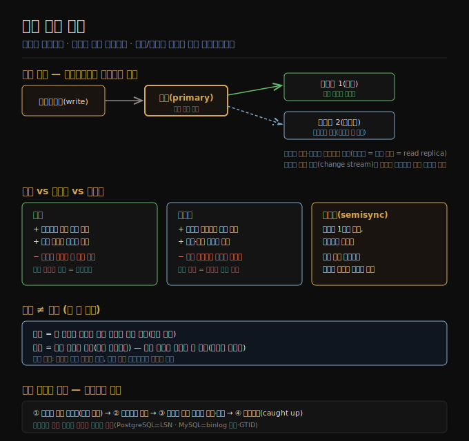

# 복제 개요와 단일 리더
> 같은 데이터를 여러 노드에 두는 것이 복제이며, 가장 흔한 방식은 한 리더가 쓰기를 받아 복제 로그로 팔로워에 흘려보내는 단일 리더 복제입니다.

이 노트를 읽고 나면 복제를 하는 세 가지 이유를 설명하고, 단일 리더 복제의 쓰기·읽기 경로를 그리며, 동기·비동기·반동기의 트레이드오프와 복제가 백업을 대체하지 못하는 이유를 말할 수 있습니다.

6장은 복제를 다룹니다. 복제란 네트워크로 연결된 여러 머신에 같은 데이터의 사본을 두는 것입니다. 1장에서 본 분산의 동기([01-04](./01-04.분산%20vs%20단일%20노드.md))대로, 데이터를 사용자 가까이 둬 접근 지연을 줄이고, 일부가 고장 나도 시스템이 계속 돌게 해 가용성·내구성을 높이며, 읽기 질의를 처리하는 머신 수를 늘려 읽기 처리량을 키우려고 복제합니다.

복제가 어려운 까닭은 변하지 않는 데이터가 아니라 **변하는 데이터를 다뤄야** 하기 때문입니다. 데이터가 안 변하면 한 번 복사하고 끝이지만, 변경을 노드 사이에 전파하는 데서 모든 난점이 나옵니다. 이 장은 변경을 복제하는 세 알고리즘 계열 — 단일 리더·다중 리더·리더리스 — 을 다루며, 거의 모든 분산 데이터베이스가 이 셋 중 하나를 씁니다. 이 노트는 이 폴더가 다루는 6장의 첫 축인 단일 리더를 정리합니다.

## 1. 단일 리더 복제의 구조
> 한 레플리카를 리더로 정해 쓰기를 전담시키고, 팔로워는 리더의 복제 로그를 같은 순서로 적용해 읽기를 분담합니다.

데이터베이스 사본을 저장하는 노드를 각각 **레플리카(replica)** 라 합니다. 레플리카가 여럿이면 "모든 데이터가 모든 레플리카에 들어가게 어떻게 보장하나"라는 질문이 따라옵니다. 모든 쓰기가 모든 레플리카에서 처리돼야 사본이 어긋나지 않습니다. 가장 흔한 해법이 리더 기반(leader-based, primary-backup, active/passive) 복제입니다.

1. 레플리카 하나를 **리더(leader, primary, source)** 로 지정합니다. 클라이언트는 쓰기를 리더로 보내고, 리더는 새 데이터를 먼저 자기 로컬 저장소에 씁니다.
2. 나머지는 **팔로워(follower, read replica, secondary, hot standby)** 입니다. 리더는 로컬에 쓸 때마다 그 변경을 **복제 로그(replication log, change stream)** 로 모든 팔로워에 보냅니다. 팔로워는 리더가 처리한 것과 같은 순서로 그 로그를 적용합니다.
3. 읽기는 리더든 팔로워든 어디서나 가능하지만, 쓰기는 리더만 받습니다(클라이언트 관점에서 팔로워는 읽기 전용).

샤딩되면([7장 예고]) 샤드마다 리더가 하나씩 있고, 서로 다른 샤드의 리더는 다른 노드에 있을 수 있습니다. 단일 리더 복제는 PostgreSQL·MySQL·Oracle Data Guard·SQL Server Always On 같은 관계형 DB에 내장돼 널리 쓰이고, MongoDB·DynamoDB 같은 문서 DB, Kafka 같은 메시지 브로커, 그리고 Raft 기반 합의(CockroachDB·TiDB·etcd 등 — 리더가 죽으면 새 리더 자동 선출)에도 깔려 있습니다.

> 📌 옛 문서의 master–slave는 leader-based와 같은 뜻이지만, 차별적 표현으로 널리 여겨져 피해야 합니다.

## 2. 동기 vs 비동기 vs 반동기
> 동기 복제는 팔로워의 최신성을 보장하지만 무응답 시 쓰기를 막고, 비동기는 빠르고 견고하나 내구성을 약화하며, 현실은 보통 반동기로 절충합니다.

복제가 동기냐 비동기냐는 장애가 났을 때 시스템 거동을 좌우합니다. 사용자가 프로필 이미지를 갱신하는 상황을 생각해 봅시다. 리더가 변경을 받아 팔로워에 전달하고 클라이언트에 성공을 알리는데, 팔로워마다 타이밍이 다를 수 있습니다.

1. **동기(synchronous)** — 리더가 팔로워의 수신 확인을 받은 뒤에야 사용자에게 성공을 알리고 다른 클라이언트에 그 쓰기를 노출합니다. 장점은 팔로워가 리더와 일치하는 최신 사본을 가짐을 보장해, 리더가 갑자기 죽어도 데이터가 팔로워에 살아 있다는 것입니다. 단점은 동기 팔로워가 응답하지 않으면(크래시·네트워크 결함 등) 쓰기를 처리할 수 없어, 리더가 모든 쓰기를 막고 그 레플리카가 복구될 때까지 기다려야 한다는 것입니다.
2. **비동기(asynchronous)** — 리더가 메시지를 보내되 응답을 기다리지 않습니다. 보통 1초 미만으로 빠르지만 보장은 없어, 팔로워가 복구 중이거나 시스템이 최대 용량 근처이거나 네트워크 문제가 있으면 수 분까지 뒤처질 수 있습니다. 리더가 복구 불능 상태로 죽으면 아직 복제 안 된 쓰기는 소실돼, 클라이언트에 확정 통보된 쓰기조차 내구성이 보장되지 않습니다. 그럼에도 팔로워가 모두 뒤처져도 리더가 쓰기를 계속 처리할 수 있다는 장점 때문에 널리 쓰입니다.

모든 팔로워를 동기로 두는 것은 비현실적입니다 — 노드 하나만 고장 나도 시스템 전체가 멈추기 때문입니다. 그래서 동기 복제를 제공하는 DB는 보통 **반동기(semisynchronous)** 로, 팔로워 하나만 동기이고 나머지는 비동기입니다. 동기 팔로워가 느려지거나 불가용해지면 비동기 중 하나를 동기로 승격해, 리더와 동기 팔로워 둘 이상에 최신 사본이 있도록 보장합니다. 일부 시스템은 과반(예: 5개 중 3개)을 동기로 갱신하는데, 이것이 **쿼럼(quorum)** 의 예로 리더리스([06-06](./06-06.리더리스%20복제와%206장%20종합.md))에서 다시 봅니다.

## 3. 백업은 복제로 대체되지 않습니다
> 복제는 쓰기를 즉시 다른 노드에 반영하는 것이고 백업은 과거 스냅샷을 보존하는 것이라, 실수로 지운 데이터는 백업으로만 살릴 수 있습니다.

복제가 있으면 백업이 필요 없을까요? 둘은 목적이 다릅니다. 복제는 한 노드의 쓰기를 다른 노드에 빠르게 반영하지만, 백업은 과거 스냅샷을 저장해 시간을 되돌리게 합니다. 실수로 데이터를 지우면 삭제도 레플리카로 전파되므로 복제는 도움이 안 되고, 지운 데이터를 복원하려면 백업이 필요합니다.

실제로 둘은 상호 보완적입니다. 백업은 복제 셋업 과정의 일부이기도 하고(아래 §4), 거꾸로 복제 로그 아카이빙은 백업 과정의 일부가 됩니다. 일부 DB는 과거 상태의 불변 스냅샷을 내부 백업처럼 유지하는데, 이는 현재 상태와 같은 저장 매체에 옛 버전을 두는 셈입니다. 데이터가 많으면 옛 데이터 백업은 자주 접근 안 하는 데이터에 최적화된 오브젝트 스토어에 두고, 현재 상태만 주 저장소에 두는 편이 더 쌉니다.

## 4. 신규 팔로워 셋업
> 클라이언트가 끊임없이 쓰는 동안 단순 파일 복사는 일관성을 깨므로, 잠금 없는 스냅샷 + 그 이후 변경분 적용으로 다운타임 없이 팔로워를 따라잡힙니다.

레플리카 수를 늘리거나 고장 난 노드를 대체하려면 때때로 새 팔로워를 띄워야 합니다. 단순히 데이터 파일을 복사하는 것으로는 부족합니다 — 클라이언트가 계속 쓰는 동안 데이터가 변하므로, 표준 파일 복사는 DB의 서로 다른 부분을 서로 다른 시점에 보게 됩니다. DB를 잠그면 일관성은 맞지만 고가용성 목표에 어긋납니다. 다행히 보통 다운타임 없이 다음처럼 할 수 있습니다.

1. 가능하면 전체 잠금 없이 리더 DB의 **일관 스냅샷**을 어느 시점에 찍습니다. 백업에도 필요한 기능이라 대부분의 DB가 지원합니다.
2. 스냅샷을 새 팔로워 노드로 복사합니다.
3. 팔로워가 리더에 접속해 스냅샷 이후 일어난 모든 변경을 요청합니다. 이를 위해 스냅샷은 리더 복제 로그의 정확한 위치와 연결돼야 합니다(PostgreSQL은 LSN(log sequence number), MySQL은 binlog 좌표·GTID).
4. 팔로워가 밀린 변경을 다 처리하면 **따라잡았다(caught up)** 고 하고, 이후 변경을 실시간으로 받습니다.

복제 로그를 주기적 스냅샷과 함께 오브젝트 스토어에 아카이빙하면 백업·재해 복구 수단이 되고, 새 팔로워 셋업의 1·2단계를 그 파일을 내려받아 수행할 수 있습니다(PostgreSQL·MySQL·SQL Server용 WAL-G, SQLite용 Litestream).

## 자주 받는 오해

1. **"복제가 있으면 백업은 필요 없다"** — 목적이 다릅니다. 복제는 쓰기를 즉시 반영(삭제도 전파)하고, 백업은 과거 스냅샷을 보존해 시간을 되돌립니다. 실수 삭제·손상 복원은 백업만 할 수 있어 둘 다 필요합니다.
2. **"동기 복제가 안전하니 모든 팔로워를 동기로 두면 된다"** — 비현실적입니다. 동기 팔로워 하나만 무응답이어도 리더가 모든 쓰기를 막아 시스템이 멈춥니다. 그래서 보통 하나만 동기인 반동기를 씁니다.
3. **"비동기 복제는 확정 통보됐으니 내구성이 보장된다"** — 아닙니다. 리더가 복구 불능으로 죽으면 아직 복제 안 된 쓰기는 소실돼, 클라이언트에 성공을 알린 쓰기조차 잃을 수 있습니다.
4. **"새 팔로워는 데이터 파일을 그대로 복사하면 된다"** — 클라이언트가 계속 쓰는 동안 복사하면 부분마다 시점이 달라 일관성이 깨집니다. 잠금 없는 스냅샷 + 복제 로그 위치 연결 + 이후 변경분 적용이 필요합니다.

## 면접에서 받을 만한 질문

1. **"복제를 하는 이유는?"** — 데이터를 사용자 가까이 둬 지연을 줄이고(latency), 일부 고장에도 시스템을 돌려 가용성·내구성을 높이며(availability), 읽기 질의를 여러 머신에 분산해 읽기 처리량을 키우기(scalability) 위해서입니다. 어려움은 변하는 데이터의 변경 전파에 있습니다.
2. **"동기와 비동기 복제의 트레이드오프는?"** — 동기는 팔로워의 최신성을 보장해 리더가 죽어도 데이터가 안전하지만, 팔로워 무응답 시 쓰기가 막힙니다. 비동기는 팔로워가 뒤처져도 리더가 진행해 빠르고 견고하나, 리더 소실 시 미복제 쓰기를 잃어 내구성이 약합니다. 현실은 하나만 동기인 반동기로 절충합니다.
3. **"다운타임 없이 새 팔로워를 어떻게 띄우나?"** — 리더의 잠금 없는 일관 스냅샷을 찍어 복제 로그의 정확한 위치(LSN·GTID)와 연결하고, 팔로워에 복사한 뒤 그 위치 이후의 변경을 리더에서 받아 적용합니다. 밀린 변경을 다 적용하면 따라잡아 실시간 스트림으로 전환합니다.

## 관련 문서

> 이 노트는 6장의 출발점이며, 단일 리더의 장애 처리·로그 구현으로 이어집니다.

- [06-02 노드 장애 처리와 복제 로그](./06-02.노드%20장애%20처리와%20복제%20로그.md) § "리더 장애·failover" — 리더가 죽으면 일어나는 일
- [01-04 분산 vs 단일 노드](./01-04.분산%20vs%20단일%20노드.md) § "분산을 쓰는 이유" — 복제가 분산의 한 동기인 배경
- [ddia2 README — 2판 정독 인덱스](./README.md)
