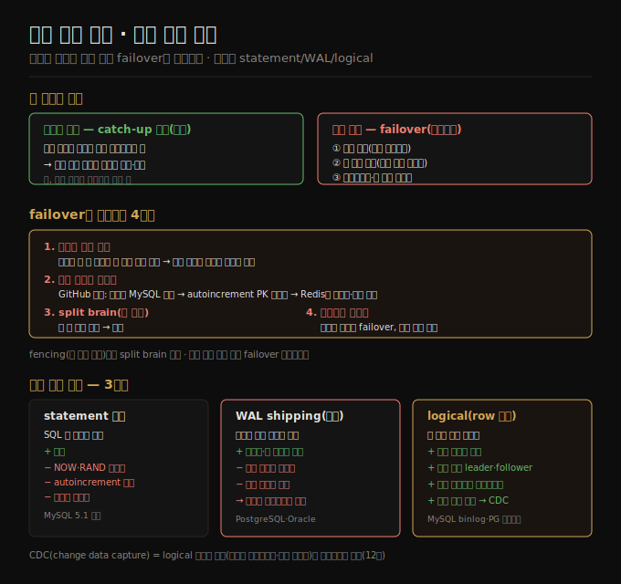

# 노드 장애 처리와 복제 로그
> 팔로워 장애는 로컬 로그로 따라잡으면 되지만 리더 장애의 failover는 미복제 쓰기 폐기·split brain 같은 함정투성이이고, 복제 로그는 statement·WAL·logical 세 방식으로 구현됩니다.

이 노트를 읽고 나면 팔로워 복구와 리더 failover의 난이도 차이를 설명하고, failover가 어긋나는 네 가지를 들며, 복제 로그 세 방식의 트레이드오프와 logical 로그가 무중단 업그레이드·CDC를 가능케 하는 이유를 말할 수 있습니다.

이 노트는 6장에서 단일 리더([06-01](./06-01.복제%20개요와%20단일%20리더.md))를 이어, 노드가 죽었을 때의 처리와 복제 로그가 내부적으로 어떻게 동작하는지를 다룹니다. 어떤 노드든 결함이나 계획된 유지보수(커널 패치 재부팅 등)로 내려갈 수 있고, 목표는 개별 노드 장애에도 시스템 전체를 돌리면서 영향을 최소화하는 것입니다.

## 1. 팔로워 장애 — catch-up 복구
> 팔로워는 로컬 로그로 마지막 처리 지점을 알아, 끊긴 동안의 변경을 리더에 요청해 적용하면 다시 따라잡습니다.

각 팔로워는 리더에서 받은 변경의 로그를 로컬 디스크에 둡니다. 팔로워가 크래시 후 재시작하거나 리더-팔로워 네트워크가 잠시 끊겨도 복구는 꽤 쉽습니다 — 로그에서 결함 전 마지막으로 처리한 트랜잭션을 알기 때문입니다. 팔로워는 리더에 접속해 끊긴 동안의 변경을 요청·적용하면 따라잡아, 이전처럼 변경 스트림을 계속 받습니다.

개념은 단순하지만 성능 면에서 까다로울 수 있습니다. 쓰기 처리량이 높거나 팔로워가 오래 오프라인이었으면 따라잡을 쓰기가 많아, 복구 중 팔로워와 (밀린 쓰기를 보내야 하는) 리더 양쪽에 높은 부하가 걸립니다. 리더는 모든 팔로워가 처리를 확인한 뒤 로그를 지울 수 있는데, 팔로워가 오래 불가용하면 선택에 부딪힙니다 — 복구·따라잡기까지 로그를 보관할지(리더 디스크 고갈 위험), 아직 확인 안 된 로그를 지울지(그 팔로워는 로그로 복구 못 하고 백업에서 복원해야 함)입니다.

## 2. 리더 장애 — failover와 그 함정
> 리더가 죽으면 팔로워 하나를 새 리더로 승격하고 재구성하는 failover가 필요한데, 미복제 쓰기 폐기·외부 시스템 불일치·split brain·타임아웃 결정이라는 함정이 따릅니다.

리더 장애 처리는 더 까다롭습니다. 팔로워 하나를 새 리더로 **승격**하고, 클라이언트가 새 리더로 쓰도록 재구성하며, 다른 팔로워가 새 리더에서 변경을 받게 해야 합니다. 이 과정이 **failover** 입니다. 수동(관리자 개입)일 수도, 자동일 수도 있고, 자동 failover는 보통 세 단계입니다.

1. **리더 장애 판정** — 무엇이 잘못됐는지 확실히 알 방법이 없어, 대부분 타임아웃을 씁니다(예: 30초 무응답이면 죽은 것으로 간주).
2. **새 리더 선택** — 선거(과반이 선출)나 미리 정한 컨트롤러 노드가 임명합니다. 최선은 옛 리더의 변경을 가장 최신까지 받은 레플리카(데이터 손실 최소화)이며, 모두를 한 리더에 합의시키는 것이 합의(consensus) 문제입니다(10장).
3. **새 리더로 재구성** — 클라이언트가 새 리더로 쓰게 하고, 옛 리더가 돌아오면 자신이 더는 리더가 아님을 인식해 팔로워가 되게 해야 합니다.

failover는 어긋날 거리가 많습니다.

1. **미복제 쓰기 폐기** — 비동기 복제 시 새 리더가 옛 리더의 모든 쓰기를 못 받았을 수 있습니다. 옛 리더가 돌아오면 그 미복제 쓰기는 보통 폐기되는데, 이는 확정 통보된 쓰기가 내구성이 없었다는 뜻입니다.
2. **외부 시스템 불일치** — 쓰기 폐기는 DB 밖 시스템과 맞춰야 할 때 위험합니다. GitHub의 한 사고에서 뒤처진 MySQL 팔로워가 리더로 승격됐는데, autoincrement 카운터가 옛 리더보다 뒤처져 이미 할당된 기본 키를 재사용했고, 이 키가 Redis에도 쓰여 MySQL-Redis 불일치로 사적 데이터가 엉뚱한 사용자에게 노출됐습니다.
3. **split brain** — 특정 결함에서 두 노드가 모두 자신을 리더로 믿을 수 있습니다(9장). 둘 다 쓰기를 받고 충돌 해소가 없으면 데이터가 손실·손상됩니다. 안전장치로 두 리더 감지 시 하나를 끄기도 하나, 설계가 허술하면 둘 다 꺼질 수 있습니다.
4. **타임아웃 결정** — 길면 복구가 늦고, 짧으면 일시적 부하 급증·네트워크 글리치로 불필요한 failover가 일어나 (이미 힘든 상황을) 악화시킬 수 있습니다.

옛 리더를 제한·차단해 split brain을 막는 것을 **fencing(펜싱)** 이라 합니다(상세는 분산 락·리스 — 별도). 쉬운 해법이 없어, 자동 failover를 지원해도 수동을 선호하는 운영 팀이 있습니다. 가장 중요한 것은 최신 팔로워를 새 리더로 고르는 것입니다 — 반동기면 옛 리더가 기다리던 그 팔로워, 비동기면 로그 시퀀스 번호가 가장 높은 팔로워를 골라 손실을 최소화합니다.

## 3. 복제 로그 구현 — statement vs WAL vs logical
> 복제 로그는 SQL 문을 보내는 statement, 디스크 바이트를 보내는 WAL shipping, 행 단위 변경을 보내는 logical 세 방식이 있고, logical이 결합도가 낮아 무중단 업그레이드·CDC를 가능케 합니다.

리더 기반 복제는 내부적으로 어떻게 동작할까요? 실무에서 쓰이는 방식은 셋입니다.

1. **statement 기반** — 리더가 실행한 모든 쓰기 문(INSERT·UPDATE·DELETE)을 로그로 보내고, 팔로워가 그 SQL을 파싱·실행합니다. 간결하지만 깨지기 쉽습니다 — `NOW`·`RAND` 같은 비결정 함수는 레플리카마다 다른 값을 내고, autoincrement나 기존 데이터 의존 문은 정확히 같은 순서로 실행돼야 하며, 트리거·저장 프로시저의 부작용이 레플리카마다 다를 수 있습니다. 우회는 가능하나(리더가 비결정 함수를 고정값으로 치환), 결정성 보장이 어려워 MySQL은 5.1부터 비결정성이 있으면 기본적으로 row 기반으로 전환합니다. VoltDB는 트랜잭션을 결정적으로 요구해 statement 복제를 안전하게 씁니다.
2. **WAL shipping(물리)** — B-tree를 견고하게 하려 모든 수정을 먼저 WAL에 쓰므로([04-03](./04-03.B-tree와%20LSM%20비교.md)), 같은 로그를 네트워크로 보내 팔로워가 동일한 파일을 만들게 합니다. 단점은 로그가 어느 디스크 블록의 어느 바이트가 바뀌었는지 같은 저수준이라 **저장 엔진과 강결합**된다는 것입니다. 저장 포맷이 버전 간 바뀌면 leader·follower에서 다른 버전을 돌릴 수 없어, 보통 무중단 업그레이드가 막힙니다(PostgreSQL·Oracle).
3. **logical(row 기반) 로그** — 복제용과 저장 엔진용 로그 포맷을 분리해, 저장 엔진 내부와 **분리(decouple)** 된 행 단위 변경 레코드를 씁니다(삽입=새 값 전부, 삭제=식별 정보, 갱신=식별 정보+변경 값). MySQL은 WAL과 별도로 binlog를 두고, PostgreSQL은 물리 WAL을 행 이벤트로 디코딩해 논리 복제를 구현합니다. 결합도가 낮아 backward 호환을 쉽게 유지해 leader·follower가 다른 버전을 돌릴 수 있고(최소 다운타임 업그레이드), 외부 애플리케이션이 파싱하기 쉬워 데이터 웨어하우스·커스텀 인덱스로 보내는 데 유용합니다. 이 기법이 **CDC(change data capture)** 로, 12장에서 다시 봅니다.

## 자주 받는 오해

1. **"팔로워 복구와 리더 failover는 비슷하게 어렵다"** — 난이도가 크게 다릅니다. 팔로워는 로컬 로그로 마지막 지점을 알아 변경만 받아 적용하면 되지만, 리더 failover는 승격·재구성에 더해 미복제 쓰기 폐기·split brain 같은 함정이 따릅니다.
2. **"자동 failover가 항상 낫다"** — 타임아웃이 짧으면 부하 급증·네트워크 글리치로 불필요한 failover가 일어나 상황을 악화시킵니다. 쉬운 해법이 없어 수동 failover를 선호하는 팀도 있습니다.
3. **"WAL shipping이 효율적이니 기본으로 쓰면 된다"** — 저장 엔진과 강결합돼 버전이 다른 leader·follower를 못 돌립니다. 무중단 업그레이드가 막혀, 분리된 logical 로그가 운영상 유리할 때가 많습니다.
4. **"복제 로그는 DB 내부용일 뿐이다"** — logical 로그는 외부 파싱이 쉬워 CDC로 데이터 웨어하우스·검색 인덱스에 변경을 흘려보낼 수 있습니다. 복제 로그가 데이터 통합의 입구가 됩니다.

## 면접에서 받을 만한 질문

1. **"리더 failover에서 어떤 일이 잘못될 수 있나?"** — 비동기 시 새 리더가 못 받은 쓰기가 폐기돼 확정 통보된 쓰기를 잃고, DB 밖 시스템(예: Redis)과 PK가 어긋나 데이터가 유출될 수 있으며(GitHub 사고), 두 노드가 모두 리더로 행동하는 split brain이 데이터를 손상시키고, 타임아웃을 짧게 잡으면 불필요한 failover가 일어납니다.
2. **"statement·WAL·logical 복제 로그의 차이는?"** — statement는 SQL 문을 보내 간결하나 비결정 함수·순서·부작용에 취약합니다. WAL shipping은 디스크 바이트를 보내 정확하나 저장 엔진과 강결합돼 버전 불일치를 못 견딥니다. logical은 행 단위 변경을 보내 저장 엔진과 분리돼, 무중단 업그레이드와 외부 파싱(CDC)을 가능케 합니다.
3. **"logical 복제가 무중단 업그레이드를 어떻게 가능케 하나?"** — 로그가 저장 엔진 내부 포맷과 분리돼 backward 호환을 유지하므로, 팔로워를 먼저 새 버전으로 올리고 failover로 그중 하나를 리더로 만들 수 있습니다. WAL shipping은 포맷이 강결합돼 이 버전 혼재가 불가능합니다.

## 관련 문서

> 이 노트는 단일 리더의 운영 측면을 다루며, 다음은 복제 자체가 일으키는 일관성 문제로 넘어갑니다.

- [06-01 복제 개요와 단일 리더](./06-01.복제%20개요와%20단일%20리더.md) § "동기 vs 비동기" — failover 위험이 비동기에서 커지는 배경
- [06-03 복제 지연 문제와 일관성 보장](./06-03.복제%20지연%20문제와%20일관성%20보장.md) § "eventual consistency" — 비동기 복제가 낳는 읽기 이상
- [04-03 B-tree와 LSM 비교](./04-03.B-tree와%20LSM%20비교.md) § "WAL" — WAL shipping이 재사용하는 그 WAL
- [ddia2 README — 2판 정독 인덱스](./README.md)
