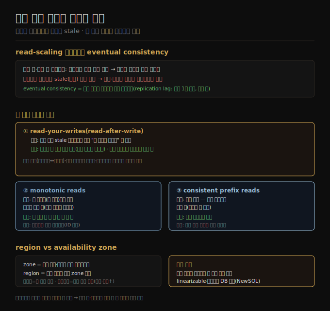

# 복제 지연 문제와 일관성 보장
> 비동기 팔로워에서 읽으면 낡은 값이 나오는 eventual consistency가 생기고, read-your-writes·monotonic reads·consistent prefix reads 세 보장으로 그 이상 현상을 완화합니다.

이 노트를 읽고 나면 read-scaling이 왜 비동기를 요구하는지, eventual consistency가 무엇인지 설명하고, 복제 지연이 낳는 세 가지 읽기 이상과 각각을 막는 일관성 보장을 짝지어 말할 수 있습니다.

이 노트는 6장에서 단일 리더의 운영 측면([06-02](./06-02.노드%20장애%20처리와%20복제%20로그.md))을 이어, 복제 자체가 낳는 일관성 문제를 다룹니다. 노드 장애 내성만이 복제의 이유가 아니라, 확장성(한 머신보다 많은 요청 처리)과 지연(사용자 가까이 레플리카 배치)도 동기였습니다. 그 이점을 누리는 read-scaling이 어떤 함정을 부르는지가 이 노트의 주제입니다.

## 1. read-scaling과 eventual consistency
> 읽기를 팔로워에 분산하면 읽기 처리량이 늘지만 비동기 복제가 필수이고, 뒤처진 팔로워에서 낡은 값을 읽는 eventual consistency가 따라옵니다.

리더 기반 복제는 쓰기를 한 노드로 모으지만 읽기는 아무 레플리카나 갈 수 있습니다. 온라인 서비스처럼 읽기가 대부분이고 쓰기가 소수인 워크로드에는 매력적인 선택이 있습니다 — 팔로워를 많이 만들어 읽기를 분산하는 것입니다. 이 **read-scaling** 아키텍처는 팔로워를 더해 읽기 용량을 늘립니다. 다만 현실적으로 비동기 복제에서만 동작합니다 — 모든 팔로워에 동기 복제하면 노드 하나·네트워크 장애로 쓰기 전체가 막히고, 노드가 많을수록 하나가 내려갈 확률이 높아 완전 동기는 너무 불안정합니다.

문제는 비동기 팔로워에서 읽으면 그 팔로워가 뒤처졌을 때 낡은 정보를 본다는 것입니다. 같은 질의를 리더와 팔로워에 동시에 던지면 다른 결과가 나옵니다(아직 일부 쓰기가 팔로워에 반영 안 됨). 이는 일시적 상태로, 쓰기를 멈추고 기다리면 팔로워가 결국 따라잡아 일치합니다. 그래서 이 효과를 **eventual consistency(최종 일관성)** 라 합니다.

"eventually(결국)"는 일부러 모호합니다 — 레플리카가 얼마나 뒤처질지 상한이 없습니다. 정상에서는 **복제 지연(replication lag)** 이 1초 미만으로 눈에 안 띄지만, 용량 근처이거나 네트워크 문제가 있으면 수 초·수 분으로 쉽게 커집니다. 이 노트는 지연이 클 때 생기는 세 가지 문제와 그 해법을 정리합니다.

> 📌 eventual consistency는 NoSQL의 구호로 유명해졌지만, 비동기 복제 관계형 DB의 팔로워도 같은 성질을 가집니다.

## 2. read-your-writes 일관성
> 자기가 방금 쓴 것을 stale 팔로워에서 읽으면 사라진 듯 보이므로, 자기가 쓴 것은 항상 보이게 하는 read-your-writes를 보장해야 합니다.

많은 앱은 사용자가 데이터를 제출하고 곧바로 자기가 낸 것을 봅니다(댓글·프로필 등). 제출은 리더로 가지만 조회는 팔로워에서 읽을 수 있는데, 비동기 복제 시 쓰기 직후 새 데이터가 아직 그 팔로워에 도달 못 했을 수 있습니다. 사용자에겐 자기 입력이 사라진 것처럼 보입니다. 여기서 필요한 것이 **read-after-write 일관성(=read-your-writes)** 으로, 사용자가 페이지를 새로고침하면 자기가 제출한 갱신은 항상 본다는 보장입니다(타인 갱신은 미보장).

리더 기반에서 구현하는 기법은 여럿입니다.

1. 사용자가 수정했을 만한 것은 리더(또는 동기 팔로워)에서 읽고 나머지는 비동기 팔로워에서 읽습니다 — 예: 소셜 네트워크 프로필은 본인만 편집 가능하므로, 자기 프로필은 리더에서·남의 프로필은 팔로워에서 읽습니다.
2. 대부분이 사용자 편집 대상이면 위 방법이 안 통합니다(대부분 리더 읽기가 됨). 이때는 다른 기준을 씁니다 — 마지막 갱신 시각을 추적해 갱신 후 1분간 모든 읽기를 리더로 보내거나, 1분 이상 뒤처진 팔로워의 질의를 막습니다.
3. 클라이언트가 자기 최근 쓰기의 타임스탬프(논리 타임스탬프 또는 시스템 시계)를 기억하고, 그 시점까지 반영한 레플리카만 읽기를 처리하게 합니다.

레플리카가 여러 리전에 분산되면 복잡도가 늘어, 리더가 처리해야 할 요청은 리더가 있는 리전으로 라우팅해야 합니다. 또 같은 사용자가 여러 기기로 접근하면 **교차 기기 read-your-writes** 가 필요한데, 한 기기는 다른 기기의 갱신을 몰라 메타데이터를 중앙화해야 하고, 기기마다 네트워크 경로가 달라 리더 읽기가 필요하면 한 리전으로 모아야 합니다.

## 3. monotonic reads
> 랙이 다른 두 팔로워에서 읽으면 시간이 뒤로 가 봤던 데이터가 사라질 수 있으므로, 한 사용자가 항상 같은 레플리카에서 읽게 해 단조성을 보장합니다.

두 번째 이상은 사용자가 **시간이 뒤로 가는** 것을 보는 것입니다. 한 사용자가 서로 다른 레플리카에서 여러 번 읽으면 생깁니다 — 첫 질의는 랙 적은 팔로워로 가 최근 추가된 댓글을 반환하고, 두 번째는 랙 큰 팔로워로 가 그 댓글을 못 봅니다(아직 그 쓰기를 못 받음). 두 번째 질의가 첫 번째보다 이른 시점의 상태를 본 셈입니다. 댓글을 봤다가 사라지는 것은 사용자에게 사뭇 혼란스럽습니다.

**monotonic reads(단조 읽기)** 가 이 이상을 막습니다. 강한 일관성보다는 약하고 eventual consistency보다는 강한 보장으로, 읽을 때 옛 값을 볼 수는 있어도 한 사용자가 순차로 읽으면 시간이 뒤로 가지 않음(새 데이터를 본 뒤 옛 데이터를 안 봄)만 보장합니다. 한 방법은 각 사용자가 항상 같은 레플리카에서 읽게 하는 것입니다(사용자 ID 해시로 레플리카 선택). 그 레플리카가 죽으면 다른 레플리카로 재라우팅해야 합니다.

## 4. consistent prefix reads
> 샤드별 랙 차이로 답이 질문보다 먼저 보이는 인과 위반이 생기므로, 쓰기 순서대로 보이는 consistent prefix reads를 보장합니다.

세 번째 이상은 인과율 위반입니다. 질문과 그 답 사이에는 인과 의존이 있는데, 답이 랙 적은 팔로워로·질문이 랙 큰 팔로워로 가면 관찰자는 답을 질문보다 먼저 듣습니다. 마치 질문하기도 전에 답하는 것처럼 보입니다.

이 이상을 막는 것이 **consistent prefix reads** 로, 쓰기가 어떤 순서로 일어나면 그것을 읽는 누구든 같은 순서로 본다는 보장입니다. 샤딩된 DB에서 특히 문제인데(7장), 많은 분산 DB는 샤드가 독립 동작해 쓰기의 전역 순서가 없어 일부는 옛 상태·일부는 새 상태로 보입니다. 한 해법은 인과 관련 쓰기를 같은 샤드에 쓰는 것이지만 항상 효율적이진 않습니다. 인과 의존을 명시 추적하는 알고리즘도 있는데, happens-before 관계로 [06-06](./06-06.리더리스%20복제와%206장%20종합.md)에서 다시 봅니다.

근본 해법은 앱 코드로 우회하는 대신(복잡하고 틀리기 쉬움) 강한 보장을 주는 DB를 고르는 것입니다 — linearizable(10장)·ACID 트랜잭션(8장)을 지원하면 복제 난점을 대부분 무시하고 단일 노드처럼 다룰 수 있습니다. 2010년대 초 NoSQL은 이 기능들이 확장성을 막는다고 봤지만, 이후 강한 일관성·트랜잭션을 내결함성·고가용성·확장성과 함께 제공하는 DB가 나왔고 이 흐름을 **NewSQL** 이라 부릅니다.

## 자주 받는 오해

1. **"eventual consistency는 NoSQL만의 특성이다"** — 비동기 복제 관계형 DB의 팔로워도 같은 성질을 가집니다. eventual consistency는 복제 방식의 결과이지 특정 제품 분류가 아닙니다.
2. **"read-your-writes면 다른 사람 글도 최신으로 보인다"** — 자기가 쓴 것만 보장합니다. 타인의 갱신은 나중에야 보일 수 있습니다. 본인 입력이 저장됐다는 안심을 주는 것이 목적입니다.
3. **"monotonic reads는 항상 최신을 본다는 뜻이다"** — 아닙니다. 옛 값을 볼 수는 있고, 다만 새 값을 본 뒤 더 옛 값으로 시간이 뒤로 가지 않음만 보장합니다. 강한 일관성과 eventual consistency의 중간입니다.
4. **"복제 지연은 1초 미만이라 무시해도 된다"** — 정상에선 그렇지만 용량 근처·네트워크 문제 시 수 분으로 커집니다. 랙이 클 때 앱이 어떻게 거동할지 미리 설계해야 하고, 비동기인데 동기인 척하면 나중에 탈이 납니다.

## 면접에서 받을 만한 질문

1. **"eventual consistency란?"** — 비동기 복제에서 팔로워가 뒤처져 낡은 값을 읽을 수 있지만, 쓰기를 멈추고 기다리면 팔로워가 결국 리더를 따라잡아 일치하는 일시적 비일관 상태입니다. "결국"의 시점에는 상한이 없어, 복제 지연이 분 단위로 커질 수 있습니다.
2. **"복제 지연이 낳는 세 이상과 각 해법은?"** — ① read-your-writes 위반(쓰기 직후 stale 읽기 → 자기 데이터는 리더에서 읽기), ② monotonic reads 위반(시간이 뒤로 감 → 사용자별 같은 레플리카에서 읽기), ③ consistent prefix reads 위반(답이 질문보다 먼저 → 인과 관련 쓰기를 같은 샤드로)입니다.
3. **"복제 지연 문제의 근본 해법은?"** — 앱 코드로 일일이 우회하기보다 강한 일관성(linearizable)과 트랜잭션을 주는 DB를 고르는 것입니다. NewSQL은 이를 분산 DB의 내결함성·확장성과 함께 제공해, 복제 난점을 대부분 단일 노드처럼 다루게 합니다.

## 관련 문서

> 이 노트는 단일 리더의 일관성 한계를 다루며, 다음은 리더를 여럿 두는 다중 리더로 넘어갑니다.

- [06-02 노드 장애 처리와 복제 로그](./06-02.노드%20장애%20처리와%20복제%20로그.md) § "복제 로그" — replication lag을 측정하는 로그 위치
- [06-04 다중 리더 복제](./06-04.다중%20리더%20복제.md) § "geo-distributed" — 리전 분산이 일관성을 더 약화시키는 다음 단계
- [06-06 리더리스 복제와 6장 종합](./06-06.리더리스%20복제와%206장%20종합.md) § "happens-before" — 인과 의존을 명시 추적하는 방법
- [ddia2 README — 2판 정독 인덱스](./README.md)
