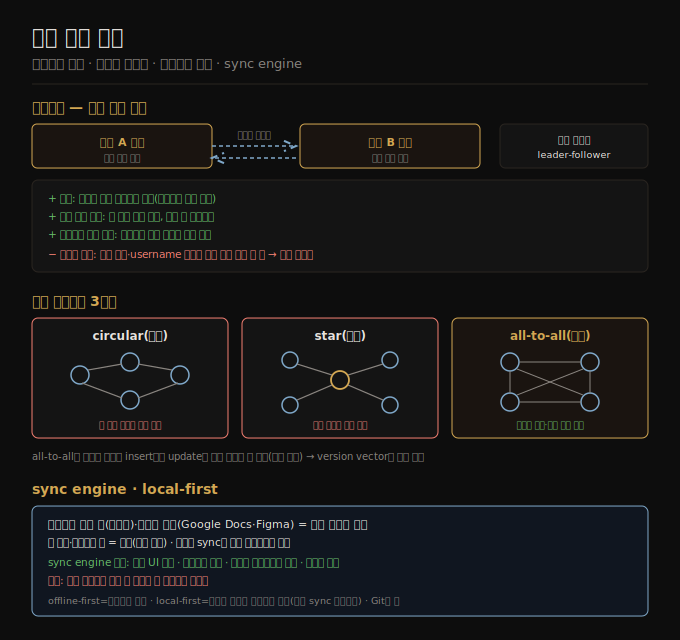

# 다중 리더 복제
> 리더를 여럿 둬 어느 리더든 쓰기를 받게 하면 멀티리전 성능·내성을 얻지만 일관성이 약해지고, 토폴로지 선택과 충돌 해소가 따라옵니다.

이 노트를 읽고 나면 다중 리더가 단일 리더보다 멀티리전에서 나은 점과 일관성 대가를 설명하고, 세 토폴로지의 트레이드오프를 들며, sync engine·local-first 소프트웨어가 왜 다중 리더의 극단인지 말할 수 있습니다.

이 노트는 6장에서 단일 리더의 일관성 한계([06-03](./06-03.복제%20지연%20문제와%20일관성%20보장.md))를 이어, 리더를 여럿 두는 대안을 다룹니다. 단일 리더의 큰 약점은 모든 쓰기가 한 리더를 거쳐야 한다는 것입니다 — 그 리더에 접속할 수 없으면 쓸 수 없습니다. 자연스러운 확장이 둘 이상의 노드가 쓰기를 받게 하는 **다중 리더(multi-leader, active/active, 양방향)** 구성으로, 각 리더는 동시에 다른 리더의 팔로워 역할을 합니다.

동기·비동기 선택은 여기서도 있지만, 동기 다중 리더는 단일 리더와 사실상 같아져(A→B 동기면 네트워크 끊길 때 A에 못 씀) 다루지 않고, 이 노트는 **비동기 다중 리더**(어느 리더든 다른 리더와 끊겨도 쓰기 처리)에 집중합니다.

## 1. 멀티리전에서의 다중 리더
> 리전마다 리더를 두면 로컬에서 쓰기를 처리해 인터리전 지연을 숨기고 리전·네트워크 장애를 견디지만, 일관성 제약을 보장하지 못합니다.

단일 리전 안에서 다중 리더를 쓸 이유는 드뭅니다(이점이 복잡도를 못 넘음). 그러나 레플리카가 여러 리전에 있는 **geo-distributed(지리 분산)** 설정에서는 합리적입니다. 단일 리더면 리더가 한 리전에 있어 모든 쓰기가 그 리전을 거치지만, 다중 리더면 리전마다 리더를 둘 수 있습니다. 리전 내부는 보통의 leader-follower 복제를, 리전 사이는 각 리전 리더가 다른 리전 리더에 변경을 복제합니다. 단일 리더와 비교하면 이렇습니다.

1. **성능** — 단일 리더는 모든 쓰기가 인터넷 너머 리더 리전으로 가 큰 지연이 붙지만, 다중 리더는 쓰기를 로컬 리전에서 처리하고 비동기로 다른 리전에 복제해 인터리전 지연이 사용자에게 숨겨집니다.
2. **리전 장애 내성** — 단일 리더는 리더 리전이 죽으면 failover로 다른 리전 팔로워를 승격하지만, 다중 리더는 각 리전이 독립 동작하고 복귀 시 따라잡습니다.
3. **네트워크 문제 내성** — 인터리전 트래픽은 리전 내부보다 덜 안정적입니다. 단일 리더는 이 링크에 민감하지만(다른 리전 리더로 쓰려면 그 링크를 거쳐 응답을 기다림), 비동기 다중 리더는 일시 단절 중에도 각 리전이 독립 진행합니다.
4. **일관성** — 가장 큰 단점입니다. 단일 리더는 직렬성 같은 강한 보장을 줄 수 있지만, 다중 리더가 줄 수 있는 일관성은 훨씬 약합니다. 잔액이 음수가 안 되게 하거나 username 유일성을 보장할 수 없습니다 — 서로 다른 리더가 각자는 괜찮은 쓰기를 처리해도 합쳐서 제약을 깰 수 있기 때문입니다. 이는 분산 시스템의 근본 한계로, 그런 제약이 필요하면 단일 리더가 낫습니다.

다중 리더는 단일 리더보다 덜 흔하지만 MySQL·Oracle·SQL Server·YugabyteDB 등이 지원하고, 외부 애드온인 경우도 있습니다(Redis Enterprise·EDB Postgres Distributed·pglogical). 여러 DB에 나중에 덧붙은 기능이라 autoincrement 키·트리거·무결성 제약과 미묘하게 충돌하는 함정이 흔해, 가능하면 피해야 할 위험 지대로 여겨지기도 합니다.

## 2. 복제 토폴로지
> 리더가 셋 이상이면 circular·star·all-to-all 토폴로지를 고를 수 있고, 밀집된 all-to-all이 내고장성은 낫지만 메시지 추월로 인과 순서가 깨질 위험이 있습니다.

**복제 토폴로지(replication topology)** 는 쓰기가 노드 사이로 전파되는 통신 경로입니다. 리더가 둘이면 경로가 하나뿐이지만, 셋 이상이면 여러 토폴로지가 가능합니다.

1. **all-to-all(전체)** — 모든 리더가 다른 모든 리더에 자기 쓰기를 보냅니다. 가장 일반적입니다.
2. **circular(원형)** — 각 노드가 한 노드에서 쓰기를 받아 (자기 쓰기와 함께) 다른 한 노드로 전달합니다.
3. **star(성형)** — 지정된 루트 노드가 모든 다른 노드에 쓰기를 전달합니다(트리로 일반화 가능).

circular·star에서는 쓰기가 여러 노드를 거쳐야 모든 레플리카에 닿아, 무한 복제 루프를 막으려 각 노드에 고유 식별자를 주고 쓰기에 거쳐 온 노드 식별자를 태깅합니다(자기 식별자가 붙은 변경은 무시). 문제는 한 노드만 죽어도 다른 노드 사이 흐름이 끊긴다는 것입니다. 더 밀집된 all-to-all은 메시지가 여러 경로로 갈 수 있어 단일 실패점이 없어 내고장성이 낫습니다.

다만 all-to-all에도 문제가 있습니다. 일부 링크가 더 빨라 메시지가 서로 **추월**할 수 있습니다 — 리더 1에 insert, 리더 3에 그 행 update가 일어나면, 리더 2가 update를 먼저(존재하지 않는 행에 대한 갱신) 받고 insert를 나중에 받을 수 있습니다. consistent prefix reads([06-03](./06-03.복제%20지연%20문제와%20일관성%20보장.md))에서 본 인과 문제와 같습니다. 타임스탬프만으로는 시계를 신뢰할 수 없어(9장) 부족하고, **version vector**([06-06](./06-06.리더리스%20복제와%206장%20종합.md))로 순서를 바로잡습니다. 많은 다중 리더 시스템이 좋은 순서 기법을 안 써 이 문제에 취약하므로, 문서를 꼼꼼히 읽고 실제로 보장이 성립하는지 시험해야 합니다.

> 📌 성형 네트워크 토폴로지는 star schema([03-03](./03-03.분석용%20스키마%20—%20별·눈송이·OBT.md))와 무관합니다 — 후자는 데이터 모델 구조를 가리킵니다.

## 3. sync engine과 local-first 소프트웨어
> 오프라인 작동 앱과 실시간 협업은 각 기기·탭이 리더인 다중 리더의 극단이며, sync engine이 로컬 상태로 즉각 응답·오프라인 작동·단순한 프로그래밍 모델을 줍니다.

다중 리더는 인터넷 단절 중에도 작동해야 하는 앱에도 맞습니다. 캘린더 앱을 생각해 봅시다 — 연결 여부와 무관하게 일정을 보고(읽기) 새로 넣어야(쓰기) 하고, 오프라인 변경은 다음에 온라인일 때 동기화돼야 합니다. 각 기기가 리더 역할을 하는 로컬 DB 레플리카를 가지고 비동기 다중 리더 sync가 도는 셈입니다. 복제 지연이 시간·날일 수 있다는 점만 빼면 리전 간 다중 리더를 극단으로 민 것과 구조가 같습니다(각 기기가 "리전", 연결이 극히 불안정).

Google Docs·Figma·Linear 같은 실시간 협업 앱이 반응적인 까닭은 사용자 입력이 네트워크 왕복을 기다리지 않고 즉시 UI에 반영되고, 한 사용자의 편집이 낮은 지연으로 협업자에게 보이기 때문입니다. 이 또한 다중 리더입니다 — 공유 파일을 연 각 브라우저 탭이 레플리카이고 갱신이 비동기로 다른 사용자 기기에 복제됩니다. 이 과정을 돕는 라이브러리를 **sync engine** 이라 합니다. sync engine 접근의 장점은 이렇습니다.

1. 데이터가 로컬에 있어 UI가 서비스 호출을 기다리지 않고 빠르게 응답합니다(다음 프레임, 16ms 목표).
2. 오프라인에서 계속 작업할 수 있습니다 — 별도 오프라인 모드 없이, 오프라인이 곧 아주 큰 네트워크 지연과 같습니다.
3. 프로그래밍 모델이 단순해집니다 — 명시적 서비스 호출의 오류 처리 대신 로컬 데이터에 읽기·쓰기를 하고, 이 연산은 거의 실패하지 않아 선언적 스타일이 됩니다.
4. 반응형 프로그래밍과 결합해 타인 편집을 실시간 반영하기 좋습니다.

sync engine은 사용자가 필요할 데이터를 미리 다 받아 로컬에 저장할 때 가장 잘 동작하므로, 사용자가 아주 많은 데이터에 접근하는 경우엔 부적합합니다(자기 파일 다운로드는 괜찮으나 전체 상품 카탈로그는 무리). **offline-first** 는 오프라인 편집을 허용하는 앱이고, **local-first** 는 개발사가 온라인 서비스를 모두 종료해도 계속 작동하게 설계된 협업 앱입니다(개방 sync 프로토콜로 복수 제공자 가능). Git이 그 예로, GitHub·GitLab 등으로 동기화할 수 있는 local-first 협업 시스템입니다(실시간 협업은 미지원).

## 자주 받는 오해

1. **"다중 리더는 단일 리더보다 항상 낫다"** — 일관성이 훨씬 약합니다. 잔액 음수 방지·username 유일성 같은 제약을 보장하지 못해, 그런 제약이 필요하면 단일 리더가 낫습니다. 다중 리더는 멀티리전 성능·내성이 필요하고 강한 제약이 불필요한 앱에 맞습니다.
2. **"단일 리전에서도 다중 리더를 쓰면 좋다"** — 단일 리전에서는 이점이 복잡도를 못 넘어 드뭅니다. 다중 리더의 값어치는 주로 geo-distributed·오프라인·실시간 협업에서 나옵니다.
3. **"토폴로지는 아무거나 골라도 된다"** — circular·star는 한 노드만 죽어도 흐름이 끊깁니다. all-to-all은 내고장성이 낫지만 메시지 추월로 insert보다 update가 먼저 도착하는 인과 문제가 있어, version vector 같은 순서 기법이 필요합니다.
4. **"실시간 협업 앱은 다중 리더가 아니다"** — 각 브라우저 탭이 로컬 쓰기를 받아 비동기로 전파하므로 다중 리더입니다. 오프라인 편집을 막아도 여러 사용자가 서버 응답을 안 기다리고 편집하는 순간 이미 다중 리더입니다.

## 면접에서 받을 만한 질문

1. **"다중 리더가 멀티리전에서 단일 리더보다 나은 점은?"** — 쓰기를 로컬 리전에서 처리해 인터리전 지연을 숨기고(성능), 각 리전이 독립 동작해 리전 장애를 견디며(리전 내성), 인터리전 링크가 끊겨도 로컬로 진행합니다(네트워크 내성). 대가는 약한 일관성으로, 교차 리더 제약을 보장하지 못합니다.
2. **"all-to-all 토폴로지의 위험은?"** — 링크 속도 차로 메시지가 추월해, insert보다 그 행의 update가 먼저 도착하는 인과 순서 위반이 생깁니다. 시계를 신뢰할 수 없어 타임스탬프만으로는 부족하고, version vector로 순서를 바로잡아야 합니다.
3. **"sync engine은 왜 다중 리더인가, 어떤 장단점이 있나?"** — 각 기기·탭이 로컬 쓰기를 받는 리더이고 비동기로 동기화하기 때문입니다. 즉각 UI 응답·오프라인 작동·단순한 프로그래밍 모델이 장점이고, 필요 데이터를 미리 다 받아야 해 대용량에는 부적합한 것이 한계입니다.

## 관련 문서

> 이 노트는 리더를 여럿 두는 구조를 다루며, 다음은 그 구조가 낳는 쓰기 충돌을 어떻게 푸는지로 넘어갑니다.

- [06-03 복제 지연 문제와 일관성 보장](./06-03.복제%20지연%20문제와%20일관성%20보장.md) § "consistent prefix reads" — all-to-all 추월이 같은 인과 문제인 배경
- [06-05 쓰기 충돌 해소](./06-05.쓰기%20충돌%20해소.md) § "충돌 회피·LWW" — 다중 리더가 부르는 충돌의 해법
- [03-03 분석용 스키마 — 별·눈송이·OBT](./03-03.분석용%20스키마%20—%20별·눈송이·OBT.md) § "star schema" — 이름만 같고 무관한 개념 구분
- [ddia2 README — 2판 정독 인덱스](./README.md)
