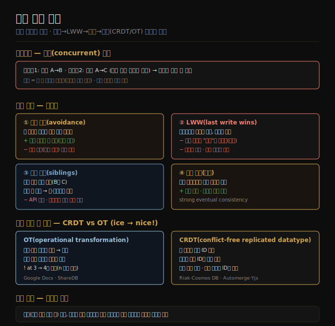

# 쓰기 충돌 해소
> 다중 리더에서 같은 레코드를 동시에 쓰면 충돌이 나며, 회피·LWW·수동·자동(CRDT/OT) 순으로 해소하되 자동 해소만이 데이터 손실 없이 수렴합니다.

이 노트를 읽고 나면 동시 쓰기 충돌이 왜 단일 리더엔 없는지 설명하고, 네 가지 해소 전략의 트레이드오프를 들며, CRDT와 OT가 동시 편집을 어떻게 다르게 병합하는지 말할 수 있습니다.

이 노트는 6장에서 다중 리더([06-04](./06-04.다중%20리더%20복제.md))를 이어, 그 구조가 부르는 가장 큰 문제인 쓰기 충돌을 다룹니다. 위키 페이지를 두 사용자가 동시에 편집해 사용자 1은 제목을 A→B로, 사용자 2는 A→C로 바꾸면, 각자 로컬 리더엔 성공하지만 비동기 복제 시 충돌이 감지됩니다. 단일 리더 DB엔 없는 문제입니다.

> 📌 두 쓰기를 **동시(concurrent)** 라 부르는 것은 쓸 때 서로를 몰랐기 때문이지 물리적으로 같은 시각이라서가 아닙니다. 오프라인이면 시간 차가 나도 동시일 수 있습니다 — 한 쓰기가 다른 쓰기가 이미 반영된 상태에서 일어났는지가 기준입니다.

## 1. 충돌 회피와 LWW
> 가장 단순한 회피는 한 레코드 쓰기를 항상 같은 리더로 보내는 것이고, 회피가 안 되면 타임스탬프 최대값만 남기는 LWW가 가장 간단하나 데이터를 잃습니다.

**충돌 회피(avoidance)** 는 충돌을 애초에 막는 전략입니다. 특정 레코드의 모든 쓰기가 같은 리더를 거치게 하면, DB 전체가 다중 리더여도 충돌이 안 생깁니다. 예컨대 사용자가 자기 데이터만 편집하는 앱은 특정 사용자 요청을 항상 같은 리전으로 라우팅하면 그 사용자 관점에선 단일 리더입니다. 다만 지정 리더를 바꿔야 할 때(리전 불가용·사용자 이동) 변경 중에 쓰기가 들어오면 충돌이 생겨, 회피는 리더 변경을 허용하는 순간 깨집니다. 또 다른 회피 예는 ID 생성으로, 두 리더에 홀수·짝수만 할당하게 해 같은 ID 충돌을 막는 것입니다.

회피가 안 되면 가장 간단한 해소가 **LWW(last write wins)** 입니다. 각 쓰기에 타임스탬프를 붙여 항상 가장 큰(최근) 값을 씁니다. 이름은 오해를 부르는데, 두 쓰기가 동시이면 어느 것이 최근인지 무정의라 타임스탬프 순서가 사실상 랜덤이기 때문입니다. LWW의 진짜 의미는 같은 레코드를 다른 리더에 동시에 쓰면 하나를 랜덤으로 골라 이기게 하고 나머지를 조용히 버린다는 것입니다 — 모든 레플리카가 일관 상태로 수렴하지만 **데이터 손실**이라는 대가를 치릅니다. 또 실시간 시계(Unix 타임스탬프)를 쓰면 시계 동기화에 사뭇 민감해져, 한 노드 시계가 앞서면 나중에 일어난 쓰기가 무시될 수 있습니다(논리 시계로 완화 — [06-06](./06-06.리더리스%20복제와%206장%20종합.md)). 충돌을 피할 수 있다면(유일 키 삽입만·갱신 안 함) LWW도 문제없지만, 갱신·중복 키 삽입이 있으면 손실 업데이트가 허용 가능한지 판단해야 합니다.

## 2. 수동 해소와 자동 해소
> 수동 해소는 동시 값(siblings)을 모두 보존해 앱·사용자가 병합하게 하나 장바구니 부활 같은 함정이 있고, 자동 해소는 모든 레플리카를 같은 상태로 수렴시켜 데이터 손실을 최소화합니다.

쓰기를 랜덤으로 버리는 것이 싫으면 **수동 해소**가 다음 선택입니다. Git의 머지 충돌처럼, DB는 보통 동시에 쓰인 값을 모두 저장합니다(B와 C — 이를 **siblings(형제)** 라 함). 다음에 그 레코드를 읽으면 최신 하나가 아니라 그 값들을 모두 반환해, 앱 코드(예: B/C로 연결)나 사용자에게 병합을 맡깁니다(CouchDB 등). 그러나 문제가 따릅니다.

1. DB API가 바뀝니다 — 제목이 문자열이었다가 보통 한 원소지만 충돌 시 여러 원소인 문자열 집합이 돼, 앱에서 다루기 어색합니다.
2. 사용자에게 수동 병합을 시키는 것은 앱 개발자(UI 구축)·사용자(혼란) 모두에게 부담입니다.
3. 자동 병합도 부주의하면 예상 밖 거동을 냅니다 — Amazon 장바구니가 siblings를 합집합으로 병합하던 때, 한 쪽에서 지운 항목이 다른 쪽에 남아 있어 삭제 항목이 되살아났습니다.

많은 앱에 가장 나은 길은 동시 쓰기를 일관 상태로 자동 병합하는 **자동 해소**입니다. 자동 충돌 해소는 같은 쓰기 집합을 처리한 모든 레플리카가 도착 순서와 무관하게 같은 상태를 갖게 보장합니다(수렴). eventual consistency에 수렴 보장을 더한 것을 **strong eventual consistency** 라 합니다. LWW도 단순한 자동 해소의 한 예이고, 더 정교한 병합은 데이터 타입별로 의도를 최대한 보존하게 개발됐습니다 — 텍스트는 삽입·삭제를 추적해 모두 보존하고, 컬렉션(장바구니)은 삭제 사실을 추적해 부활을 막으며, 카운터(좋아요 수)는 증감을 더해 이중 계산·누락을 막고, 키-값 맵은 키별로 다른 해소 알고리즘을 적용합니다. 한계는 있습니다 — "리스트는 5개 이하" 같은 제약은 동시에 5개를 넘게 추가하면 일부를 버릴 수밖에 없습니다.

## 3. CRDT와 OT
> 자동 해소는 CRDT와 OT 두 계열로 구현하며, OT는 인덱스를 변환해 병합하고 CRDT는 글자마다 불변 ID를 줘 변환 없이 수렴합니다.

자동 충돌 해소를 구현하는 두 알고리즘 계열이 **CRDT(conflict-free replicated datatypes)** 와 **OT(operational transformation)** 입니다. 설계 철학과 성능 특성이 다르지만 둘 다 위의 데이터 타입을 자동 병합할 수 있습니다. 두 레플리카가 모두 `ice`로 시작해 한 쪽은 앞에 `n`을 붙여 `nice`, 다른 쪽은 뒤에 `!`를 붙여 `ice!`를 만들 때, 병합 결과 `nice!`를 두 계열이 다르게 만듭니다.

1. **OT** — 문자가 삽입·삭제된 인덱스를 기록합니다(`n`은 0, `!`는 3). 레플리카가 연산을 교환하는데, `n`을 0에 삽입은 그대로 적용되지만 `!`를 인덱스 3에 적용하면 `nic!e`가 돼 틀립니다. 그래서 이미 적용된 동시 연산을 반영해 각 연산의 인덱스를 변환합니다 — `!`는 `n`이 앞서 삽입된 것을 반영해 인덱스 4로 변환됩니다.
2. **CRDT** — 대부분 각 문자에 고유·불변 ID를 줘, 인덱스 대신 그 ID로 삽입·삭제 위치를 정합니다. `!`를 삽입할 때 새 문자 ID와 그 뒤에 올 기존 문자 ID를 담은 연산을 만들고, 동시 삽입은 문자 ID로 정렬합니다. 덕분에 변환 없이 레플리카가 수렴합니다.

OT는 Google Docs 같은 실시간 텍스트 협업에 흔히 쓰이고, CRDT는 Redis Enterprise·Riak·Azure Cosmos DB 같은 분산 DB에서 보입니다. JSON용 sync engine은 CRDT(Automerge·Yjs)로도 OT(ShareDB)로도 구현됩니다.

충돌 유형도 짚어야 합니다. 같은 필드를 다른 값으로 동시에 쓰는 것은 명백한 충돌이지만, 미묘한 것도 있습니다 — 회의실 예약 시스템에서 같은 방·시간에 두 예약이 만들어지면, 앱이 예약 전에 가용성을 확인해도 두 예약이 충분히 가깝게 일어나면 둘 다 빈 방으로 보고 삽입할 수 있습니다(8장·13장에서 더 다룸).

## 자주 받는 오해

1. **"LWW는 충돌을 안전하게 해결한다"** — 동시 쓰기는 어느 것이 "최신"인지 무정의라 사실상 랜덤으로 하나를 골라 나머지를 조용히 버립니다. 수렴은 하지만 데이터 손실이 대가이고, 실시간 시계를 쓰면 시계 동기화에도 민감합니다.
2. **"siblings를 합집합으로 병합하면 안전하다"** — Amazon 장바구니 사례처럼 한 쪽에서 지운 항목이 다른 쪽에 남아 되살아납니다. 삭제 사실을 추적하는 알고리즘이라야 부활을 막습니다.
3. **"충돌 회피만 하면 충돌은 절대 안 생긴다"** — 지정 리더를 바꾸는 순간(리전 불가용·사용자 이동) 변경 중 쓰기로 충돌이 생겨 회피가 깨집니다. 리더 변경을 허용하면 다른 해소법이 필요합니다.
4. **"CRDT와 OT는 같은 방식이다"** — OT는 인덱스를 동시 연산에 맞춰 변환해 병합하고, CRDT는 문자마다 불변 ID를 줘 변환 없이 수렴합니다. 철학과 성능 특성이 달라, OT는 텍스트 협업·CRDT는 분산 DB에 흔합니다.

## 면접에서 받을 만한 질문

1. **"LWW의 문제는 무엇인가?"** — 동시 쓰기는 어느 것이 최근인지 무정의라 하나를 랜덤으로 골라 나머지를 버려 데이터를 잃습니다. 또 실시간 시계를 타임스탬프로 쓰면 시계가 앞선 노드의 값이 이기고 나중 쓰기가 무시될 수 있어, 논리 시계로 완화합니다.
2. **"자동 충돌 해소가 보장하는 것은?"** — 같은 쓰기 집합을 처리한 모든 레플리카가 도착 순서와 무관하게 같은 상태로 수렴함을 보장합니다(strong eventual consistency). 데이터 타입별 병합(텍스트 삽입·삭제 보존, 카운터 증감 합산)으로 의도를 최대한 살려 손실을 최소화합니다.
3. **"CRDT와 OT가 동시 편집을 어떻게 다르게 병합하나?"** — OT는 삽입·삭제 인덱스를 기록하고, 이미 적용된 동시 연산을 반영해 인덱스를 변환합니다(`!`를 3→4로). CRDT는 각 문자에 불변 ID를 줘 인덱스 대신 ID로 위치를 정하고 동시 삽입을 ID로 정렬해, 변환 없이 수렴합니다.

## 관련 문서

> 이 노트는 다중 리더의 충돌 해소를 다루며, 다음은 리더가 아예 없는 리더리스 복제로 넘어갑니다.

- [06-04 다중 리더 복제](./06-04.다중%20리더%20복제.md) § "복제 토폴로지" — 충돌을 부르는 다중 리더 구조
- [06-06 리더리스 복제와 6장 종합](./06-06.리더리스%20복제와%206장%20종합.md) § "version vector" — 동시 쓰기를 감지하는 방법
- [ddia2 README — 2판 정독 인덱스](./README.md)
