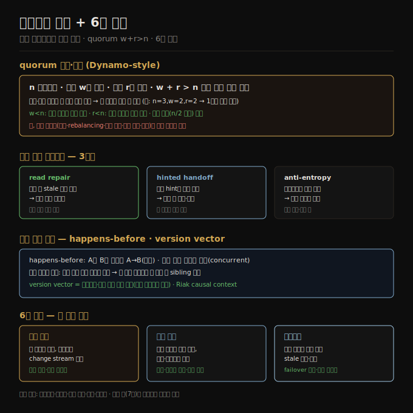

# 리더리스 복제와 6장 종합
> 리더리스는 아무 레플리카나 쓰기를 받고 여러 노드에서 읽어 stale을 보정하며, quorum(w+r>n)과 version vector로 일관성·동시성을 다룹니다.

이 노트를 읽고 나면 리더리스 복제가 failover를 왜 없애는지 설명하고, quorum 조건 w+r>n의 의미와 한계를 들며, happens-before와 version vector로 동시 쓰기를 어떻게 감지하는지 말할 수 있습니다. 마지막으로 6장 전체(세 복제 방식)를 종합합니다.

이 노트는 6장의 마지막 축인 리더리스 복제를 다루고 6장을 마무리합니다. 단일 리더·다중 리더([06-01](./06-01.복제%20개요와%20단일%20리더.md)~[06-05](./06-05.쓰기%20충돌%20해소.md))는 클라이언트가 리더에 쓰고 시스템이 다른 레플리카로 복사하는 발상이었습니다. 리더리스는 리더 개념을 버리고 아무 레플리카나 클라이언트의 쓰기를 직접 받게 합니다. 초기 복제 시스템이 리더리스였다가 관계형 DB 시대에 잊혔는데, 2007년 Amazon의 Dynamo가 쓰면서 다시 유행해 Riak·Cassandra·ScyllaDB가 **Dynamo-style** 로 불립니다.

> 📌 원조 Dynamo와 이름이 비슷한 DynamoDB는 완전히 다른 구조입니다 — 후자는 Multi-Paxos 기반 단일 리더 복제를 씁니다.

## 1. 노드가 죽었을 때의 쓰기와 따라잡기
> 리더리스는 failover가 없어 클라이언트가 여러 레플리카에 병렬로 쓰고, 복귀한 노드는 read repair·hinted handoff·anti-entropy로 놓친 쓰기를 따라잡습니다.

레플리카 셋 중 하나가 불가용한 상황을 생각해 봅시다. 단일 리더면 계속 쓰려고 failover가 필요할 수 있지만, 리더리스엔 모든 레플리카가 동등해 리더가 없으니 **failover라는 것이 없습니다**. 클라이언트가 쓰기를 세 레플리카에 병렬로 보내고 둘이 수락하면(불가용 노드 하나는 놓침) 성공으로 칩니다. 불가용 노드가 복귀해 클라이언트가 그 노드에서 읽으면 놓친 쓰기가 빠져 있어 stale 값을 받을 수 있습니다. 그래서 읽기도 한 레플리카가 아니라 여러 노드에 병렬로 보내, 모든 값에 붙은 버전 번호로 어느 응답이 최신인지 판단하고 가장 큰 버전을 씁니다.

복귀한 노드는 어떻게 놓친 쓰기를 따라잡을까요? Dynamo-style은 세 기법을 씁니다.

1. **read repair(읽기 복구)** — 클라이언트가 여러 노드에서 병렬로 읽다 stale 응답을 감지하면 최신 값을 그 노드에 되써 줍니다. 자주 읽는 값에 잘 맞습니다.
2. **hinted handoff(힌트 전달)** — 한 레플리카가 불가용이면 다른 레플리카가 그를 대신해 쓰기를 hint로 보관하다, 복귀하면 전달하고 hint를 지웁니다. 읽히지 않아 read repair가 못 다루는 값도 따라잡힙니다.
3. **anti-entropy(반엔트로피)** — 백그라운드 프로세스가 레플리카 간 차이를 주기적으로 찾아 누락 데이터를 복사합니다. 복제 로그와 달리 순서가 없고 복사까지 큰 지연이 있을 수 있습니다.

## 2. quorum 읽기·쓰기와 그 한계
> n 레플리카에서 쓰기 w개·읽기 r개를 요구하고 w+r>n이면 읽기·쓰기 집합이 겹쳐 최신을 보장하나, 여러 엣지 케이스로 절대 보장은 아닙니다.

n개 레플리카에서 모든 쓰기가 w개 노드의 확인을, 모든 읽기가 r개 노드의 질의를 요구할 때, **w + r > n** 이면 읽을 때 최신 값을 기대할 수 있습니다 — 읽는 r개 중 적어도 하나는 최신이기 때문입니다(읽기·쓰기 집합이 한 노드 이상 겹침). 이를 따르는 읽기·쓰기를 **quorum(쿼럼)** 읽기·쓰기라 합니다. n은 보통 홀수(3·5)로 하고 w=r=(n+1)/2로 둡니다. quorum 조건은 불가용 노드를 견디게 합니다 — w<n이면 노드가 죽어도 쓸 수 있고, r<n이면 노드가 죽어도 읽을 수 있습니다(n=3,w=2,r=2면 1노드, n=5,w=3,r=3이면 2노드 장애 견딤).

보통 r·w를 과반(n/2 초과)으로 골라 w+r>n을 만족시키면서 n/2 노드 장애까지 견디지만, 쿼럼이 꼭 과반일 필요는 없습니다 — 읽기·쓰기 집합이 한 노드에서만 겹치면 됩니다. w+r≤n으로 낮추면 stale을 읽을 확률이 오르는 대신 지연이 낮고 가용성이 높아집니다.

다만 w+r>n이어도 일관성이 절대 보장은 아닙니다. 엣지 케이스가 있습니다 — 새 값 노드가 죽어 옛 값에서 복원되면 새 값 사본이 w 아래로 떨어지고, rebalancing 중엔 어느 노드가 n개 레플리카인지 견해가 엇갈려 쿼럼이 안 겹칠 수 있으며, 읽기가 쓰기와 동시면 새 값을 볼 수도 못 볼 수도 있고, 실시간 시계로 최신을 정하면 시계 빠른 노드가 다른 쓰기를 조용히 덮을 수 있습니다(LWW 문제). 따라서 Dynamo-style은 eventual consistency를 견딜 수 있는 용도에 맞고, w·r은 stale 확률을 조절하는 손잡이일 뿐 절대 보장으로 여기지 않는 것이 현명합니다.

리더리스는 failover가 없고 요청이 여러 레플리카로 병렬로 가, 한 레플리카가 느려도 영향이 작아 멀티리전·gray failure(완전 다운은 아니나 느린 상태)에 견고합니다. 가장 빠른 응답을 쓰는 **request hedging** 으로 꼬리 지연을 줄일 수 있습니다.

## 3. happens-before와 version vector
> 두 연산은 한쪽이 다른 쪽의 토대이면 인과(happens-before), 어느 쪽도 아니면 동시이며, 레플리카·키별 버전 번호 모음인 version vector로 이를 감지합니다.

리더리스도 동시 쓰기 충돌이 생기고, 쓰기 발생 시점뿐 아니라 read repair·hinted handoff·anti-entropy 중에 뒤늦게 감지될 수도 있습니다. 노드마다 이벤트 도착 순서가 달라(가변 지연·부분 실패), 받는 대로 덮어쓰면 노드들이 영구히 어긋납니다. 수렴하려면 충돌 해소([06-05](./06-05.쓰기%20충돌%20해소.md))가 필요합니다.

두 연산이 동시인지는 **happens-before(인과 선행)** 로 정합니다. 연산 A가 B의 토대이거나 B가 A를 알거나 의존하면 A가 B에 happens-before(A→B)이고, 어느 쪽도 아니면 **동시(concurrent)** 입니다. 한쪽이 다른 쪽에 선행하면 나중 것이 먼저 것을 덮어야 하고, 동시이면 충돌을 해소해야 합니다. 물리적 동시인지는 중요하지 않습니다 — 서로를 몰랐는지가 기준이고, 분산 시스템의 시계 문제(9장)로 정확한 시각 비교는 어렵습니다.

단일 레플리카에서는 서버가 키마다 버전 번호를 두고, 쓸 때마다 올려 값과 함께 저장합니다. 클라이언트는 읽을 때 덮이지 않은 모든 값(siblings)과 최신 버전 번호를 받고, 쓸 때 이전 읽기의 버전 번호를 포함하며 받은 값들을 병합합니다. 서버는 그 버전 이하의 값을 덮고 더 높은 버전은 보존합니다(동시이므로). 장바구니 예에서 두 클라이언트가 동시에 항목을 더해도 버전 번호로 인과를 추적해 옛 값은 결국 덮이되 쓰기는 손실되지 않습니다.

레플리카가 여러 개면 단일 버전 번호로는 부족해, **레플리카별·키별 버전 번호**가 필요합니다. 각 레플리카는 쓰기 처리 시 자기 버전을 올리고 다른 레플리카에서 본 버전도 추적합니다. 이 버전 번호 모음이 **version vector(버전 벡터)** 입니다(Riak 2.0의 dotted version vector). 읽을 때 클라이언트에 보내고 쓸 때 되돌려받아(Riak은 causal context 문자열로 인코딩) 덮어쓰기와 동시 쓰기를 구분하며, 한 레플리카에서 읽고 다른 레플리카에 되써도 siblings만 생길 뿐 데이터가 손실되지 않게 합니다.

> 📌 version vector는 vector clock과 종종 혼용되나 같지 않습니다 — 레플리카 상태를 비교할 때 쓸 올바른 자료 구조는 version vector입니다.

## 4. 6장 종합 — 세 복제 방식
> 복제는 고가용성·내구성·단절 작동·지연·확장성을 위해 같은 데이터를 여러 머신에 두는 것이며, 단일 리더·다중 리더·리더리스가 일관성과 견고함을 두고 다르게 절충합니다.

복제는 여러 목적에 쓰입니다 — 한 머신(나아가 존·리전)이 죽어도 시스템을 돌리는 **고가용성**, 영구 장애에도 데이터를 안 잃는 **내구성**, 네트워크 단절 중에도 앱을 돌리는 **단절 작동**, 데이터를 사용자 가까이 둬 빠르게 하는 **지연**, 한 머신보다 많은 읽기를 처리하는 **확장성**입니다. 개념은 단순하나 동시성·장애·그 결과 처리를 세심히 따져야 하는 까다로운 문제입니다. 이 장은 세 방식을 다뤘습니다.

1. **단일 리더** — 클라이언트가 모든 쓰기를 한 리더로 보내고 리더가 변경 이벤트 스트림을 팔로워에 보냅니다. 읽기는 아무 레플리카나 가능하나 팔로워 읽기는 stale일 수 있습니다. 이해하기 쉽고 강한 일관성을 제공해 인기가 많습니다.
2. **다중 리더** — 클라이언트가 여러 리더 중 하나로 쓰고, 리더들이 서로·팔로워에 변경 스트림을 보냅니다. 장애·단절·지연 급증에 더 견고하나 충돌 해소가 필요하고 일관성이 약합니다.
3. **리더리스** — 클라이언트가 여러 노드에 쓰고 여러 노드에서 병렬로 읽어 stale 노드를 감지·보정합니다. failover가 없어 견고하나 일관성이 약합니다.

복제는 동기·비동기일 수 있고, 이 선택이 장애 시 거동을 좌우합니다 — 비동기는 평소 빠르지만 리더 소실 시 미복제 쓰기를 잃을 수 있습니다. 복제 지연이 낳는 이상에는 read-after-write·monotonic reads·consistent prefix reads 같은 일관성 모델로 대응합니다. 다중 리더·리더리스는 version vector로 동시 쓰기를 감지하고 CRDT 같은 알고리즘으로 병합해 모든 레플리카가 결국 수렴하게 합니다. 이 장은 레플리카마다 전체 사본을 둔다고 가정했는데, 다음 장(7장)은 각 머신이 데이터의 일부만 두는 **샤딩(sharding)** 을 다룹니다.

## 자주 받는 오해

1. **"원조 Dynamo와 DynamoDB는 같은 구조다"** — 다릅니다. 원조 Dynamo는 리더리스(quorum)이고, 이름이 비슷한 DynamoDB는 Multi-Paxos 기반 단일 리더 복제를 씁니다.
2. **"w+r>n이면 항상 최신을 읽는다"** — 집합이 겹쳐 보통은 최신을 읽지만 절대 보장은 아닙니다. 옛 값 복원, rebalancing, 동시 읽기·쓰기, 실시간 시계 같은 엣지 케이스에서 stale을 읽을 수 있어, w·r은 stale 확률을 조절하는 손잡이로 봐야 합니다.
3. **"리더리스는 failover가 필요하다"** — 모든 레플리카가 동등해 리더가 없으니 failover라는 것이 없습니다. 노드가 죽어도 남은 레플리카로 병렬 쓰기·읽기를 계속하고, 복귀 노드는 read repair·hinted handoff·anti-entropy로 따라잡습니다.
4. **"동시 쓰기는 같은 시각에 일어난 쓰기다"** — 물리적 시각이 아니라 서로를 몰랐는지가 기준입니다. 오프라인이면 시간 차가 나도 동시일 수 있고, happens-before로 인과 여부를 판별합니다.

## 면접에서 받을 만한 질문

1. **"quorum 조건 w+r>n이 보장하는 것과 한계는?"** — n개 레플리카에서 쓰기 w·읽기 r을 요구할 때 w+r>n이면 읽기·쓰기 집합이 한 노드 이상 겹쳐, 읽는 노드 중 하나가 최신 값을 가짐을 기대할 수 있습니다. 다만 옛 값 복원·rebalancing·동시 읽쓰·시계 문제 같은 엣지 케이스로 절대 보장은 아닙니다.
2. **"리더리스에서 놓친 쓰기를 어떻게 따라잡나?"** — read repair는 읽기 중 stale을 감지해 최신을 되써 주고(자주 읽는 값), hinted handoff는 불가용 노드 대신 hint로 보관하다 복귀 시 전달하며(안 읽히는 값도), anti-entropy는 백그라운드로 레플리카 차이를 찾아 복사합니다(순서 없음).
3. **"동시 쓰기를 어떻게 감지하나?"** — happens-before로 한 연산이 다른 연산의 토대이면 인과(나중 것이 덮음), 어느 쪽도 아니면 동시(충돌)로 봅니다. 단일 레플리카는 키별 버전 번호로, 다중 레플리카는 레플리카·키별 버전 번호 모음인 version vector로 덮어쓰기와 동시 쓰기를 구분합니다.

## 관련 문서

> 이 노트는 6장의 마지막 축이자 종합입니다. 다음 장은 복제의 전체 사본 가정을 풀어 데이터를 분할합니다.

- [06-05 쓰기 충돌 해소](./06-05.쓰기%20충돌%20해소.md) § "CRDT와 OT" — 리더리스가 재사용하는 충돌 해소
- [06-01 복제 개요와 단일 리더](./06-01.복제%20개요와%20단일%20리더.md) § "구조" — 종합에서 대비하는 첫 방식
- [04-05 분석용 컬럼 지향 저장](./04-05.분석용%20컬럼%20지향%20저장.md) — 다음 장 샤딩과 함께 보는 대용량 저장
- [ddia2 README — 2판 정독 인덱스](./README.md)
