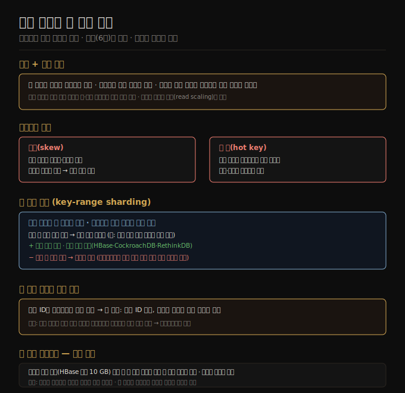

# 07-01. 샤딩 개요와 키 범위 샤딩
> 단일 노드가 처리할 수 없는 데이터량·쓰기 처리량을 여러 노드에 분산하는 방법입니다. 키 범위 샤딩은 정렬 순서를 유지해 범위 쿼리에 유리하지만, 인접 키에 쓰기가 집중되면 핫스팟이 생깁니다.

7장은 6장 복제에 이어 분산 데이터베이스의 두 번째 축인 샤딩(sharding)을 다룹니다. 복제가 같은 데이터를 여러 노드에 복사하는 것이라면, 샤딩은 데이터 자체를 여러 조각으로 나눠 서로 다른 노드에 배치합니다. 각 레코드는 정확히 하나의 샤드에 속하고, 각 샤드는 독립적인 작은 데이터베이스처럼 동작합니다.

용어 주의: 샤드는 시스템마다 다르게 불립니다. Kafka는 파티션(partition), CockroachDB는 레인지(range), HBase·TiDB는 리전(region), Cassandra는 토큰 레인지(token-range), Bigtable·YugabyteDB는 태블릿(tablet)이라고 부릅니다. 이 장에서는 '샤드'로 통일합니다.

## 1. 샤딩을 쓰는 이유와 복제와의 관계
> 단일 노드의 한계를 넘기 위한 수평 확장 수단이며, 복제와 결합해 내결함성도 확보합니다.

샤딩의 주목적은 확장성입니다. 데이터 양이나 쓰기 처리량이 단일 노드의 한계를 넘어설 때 데이터와 쓰기를 여러 노드에 분산시킵니다. 읽기 처리량만 문제라면 샤딩 없이 복제(read scaling)로도 충분합니다.

샤딩은 보통 복제와 함께 쓰입니다. 각 샤드의 복제본을 여러 노드에 두어 노드 장애에도 데이터를 잃지 않습니다. 단일 리더 복제를 결합하면, 노드 하나가 어떤 샤드의 리더이면서 동시에 다른 샤드의 팔로워 역할을 합니다.

샤딩이 효과를 발휘하려면 부하가 고르게 분산돼야 합니다. 이론적으로 10개 노드에 균등하게 나누면 처리량도 10배가 됩니다. 그러나 현실에서는 부하 쏠림(skew)이 자주 발생합니다.

## 2. 핫스팟과 스큐
> 샤딩이 불균등하면 일부 샤드에만 부하가 집중돼 수평 확장의 이점이 사라집니다.

스큐(skew)란 일부 샤드가 다른 것보다 훨씬 많은 데이터나 요청을 처리하는 상태입니다. 극단적으로는 전체 부하가 노드 하나에 몰려 나머지 9개가 유휴 상태가 되기도 합니다. 이렇게 부하가 집중된 샤드를 핫 샤드(hot shard), 특정 키에 부하가 몰리는 상황을 핫 키(hot key)라고 합니다.

소셜 미디어에서 수백만 팔로워를 가진 유명인이 포스팅하면, 그 유저 ID나 포스팅 ID가 핫 키가 됩니다. 이 경우 해당 키를 담은 샤드 하나에 쓰기·읽기가 폭주합니다. 핫 키 문제는 해시 샤딩(07-02)만으로는 해결되지 않으며, 키에 랜덤 접두어를 붙여 여러 샤드로 분산하는 애플리케이션 수준 대처가 필요합니다(07-02 §4 참고).

## 3. 키 범위 샤딩
> 연속된 키 범위를 샤드에 할당하면 범위 쿼리가 효율적이지만, 쓰기 집중 패턴에는 취약합니다.

키 범위 샤딩은 각 샤드에 최소~최대 범위를 할당하는 방식입니다. 종이 백과사전을 알파벳 구간별로 나눈 것과 같습니다. 어떤 레코드가 어느 샤드에 있는지 키만 알면 바로 찾을 수 있습니다.

범위 경계는 데이터가 균등하게 분포되도록 정합니다. 알파벳 두 글자씩 나누면 'A–B'와 'T–Z'의 데이터 밀도가 크게 달라지므로, 경계를 데이터 분포에 맞춰 조정해야 합니다. 경계는 관리자가 수동 설정하거나(Vitess·MySQL), 시스템이 자동으로 관리합니다(HBase·CockroachDB·RethinkDB).

샤드 내부에서는 키가 정렬 저장됩니다(B-tree 또는 SSTable). 덕분에 범위 스캔이 빠릅니다. 예를 들어 센서 네트워크에서 특정 달의 측정값 전체를 조회할 때, 타임스탬프를 키로 쓰면 범위 쿼리 한 번으로 해결됩니다.

## 4. 키 범위 샤딩의 핫스팟 문제와 우회
> 쓰기가 항상 최신 키 범위(현재 시간)로 몰리는 패턴은 타임스탬프 단독 키를 쓸 때 특히 심각합니다.

타임스탬프를 유일한 파티션 키로 쓰면 '이달의 샤드'에 모든 쓰기가 집중되고, 과거 샤드는 조회만 들어옵니다. 이를 피하려면 타임스탬프 앞에 센서 ID를 붙여 복합 키로 구성합니다. 키 순서는 센서 ID 우선이고, 동일 ID 내에서 타임스탬프로 정렬됩니다. 많은 센서가 동시에 쓰면 쓰기가 고르게 분산됩니다.

대신 여러 센서를 묶어 특정 시간 구간 데이터를 조회하려면 센서별로 따로 범위 쿼리를 보내고 클라이언트에서 결과를 합쳐야 합니다. 범위 쿼리 편의성과 쓰기 분산 사이의 트레이드오프입니다.

## 5. 키 범위 리밸런싱 — 샤드 분할
> 샤드가 너무 커지면 분할하고, 너무 작아지면 병합합니다. 분할 자체가 고비용 작업임을 주의해야 합니다.

키 범위 샤딩은 샤드가 설정한 크기(HBase 기본 10 GB)를 초과하거나, 쓰기 처리량이 임계치를 넘으면 두 개의 하위 범위로 분할합니다. 반대로 대량 삭제 후 샤드가 소형화되면 인접 샤드와 병합합니다. 이 과정은 B-tree 상위 수준에서 일어나는 것과 유사합니다.

분할 비용이 문제입니다. 샤드 내 모든 데이터를 새 파일에 다시 써야 하는데, 이는 로그 구조 저장 엔진의 컴팩션과 비슷합니다. 핫 샤드일수록 분할이 필요하면서 동시에 부하가 높기 때문에, 분할 작업 자체가 과부하를 악화시킬 위험이 있습니다.

초기 빈 데이터베이스에서 시작할 때는 미리 분할(pre-splitting)로 초기 샤드를 설정할 수 있습니다. 예상 키 분포를 알고 있어야 적절한 경계를 정할 수 있습니다.

## 자주 받는 오해
1. **"샤딩하면 읽기도 빨라진다"** — 쓰기 분산이 목적입니다. 읽기 처리량은 복제(read scaling)로 해결하는 것이 먼저입니다. 샤딩은 데이터 크기나 쓰기 처리량이 단일 노드 한계를 넘을 때 도입합니다.
2. **"키 범위 샤딩은 항상 안전하다"** — 타임스탬프나 순증가 ID처럼 인접 키에 쓰기가 집중되는 패턴에서는 핫스팟이 생깁니다. 파티션 키 설계가 핵심입니다.
3. **"PostgreSQL의 파티셔닝과 샤딩은 같다"** — PostgreSQL 파티셔닝은 한 머신 내에서 테이블을 여러 파일로 나누는 것이고, 샤딩은 여러 머신에 걸쳐 나누는 것입니다. 개념이 다릅니다.

## 면접에서 받을 만한 질문
1. **"샤딩과 복제의 차이는 무엇인가요?"** — 복제는 같은 데이터의 복사본을 여러 노드에 두어 내결함성과 읽기 확장을 제공합니다. 샤딩은 데이터를 나눠 각 노드가 서로 다른 부분을 담당하게 해 쓰기 처리량과 저장 용량을 수평 확장합니다. 실제 시스템은 두 가지를 함께 씁니다.
2. **"키 범위 샤딩의 핫스팟을 어떻게 피하나요?"** — 파티션 키 설계를 바꿉니다. 타임스탬프 단독 대신 센서 ID와 타임스탬프를 결합한 복합 키를 씁니다. 높은 카디널리티의 식별자를 앞에 두면 쓰기가 고르게 분산됩니다.
3. **"샤드 분할 시 서비스 중단이 발생하나요?"** — 분할 중에도 기존 샤드 할당으로 읽기·쓰기가 계속됩니다. 다만 분할은 고비용 작업이므로 핫 샤드 분할 시 일시적인 성능 저하가 발생할 수 있습니다. 이를 완화하려면 미리 분할(pre-splitting) 또는 더 많은 초기 샤드 설정을 고려합니다.

## 관련 문서
- [06-06. 리더리스 복제와 6장 종합](06-06.리더리스%20복제와%206장%20종합.md) — 복제와 샤딩의 결합 개요
- [07-02. 해시 샤딩과 일관 해싱](07-02.해시%20샤딩과%20일관%20해싱.md) — 키 범위의 핫스팟을 해시로 해소하는 방법
