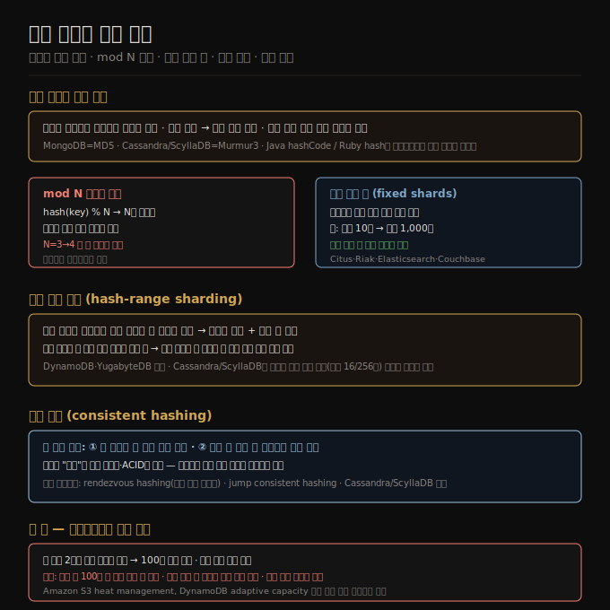

# 07-02. 해시 샤딩과 일관 해싱
> 파티션 키를 해시해 분산하면 키 범위 샤딩의 핫스팟 문제를 줄일 수 있습니다. mod N 방식은 노드 수가 바뀔 때 키 대이동이 발생하므로, 실무에서는 고정 샤드 수·해시 범위·일관 해싱 중 하나를 선택합니다.

키 범위 샤딩(07-01)은 범위 쿼리에 강하지만 인접 키에 쓰기가 집중되면 핫스팟이 생깁니다. 해시 샤딩은 비슷한 키도 전혀 다른 위치에 흩뿌려 이 문제를 완화합니다. 다만 정렬 순서가 깨지므로 범위 쿼리는 불가능합니다. 두 접근을 어떻게 결합하느냐에 따라 여러 변형이 등장합니다.

## 1. 해시 함수로 균등 분산
> 좋은 해시 함수는 입력이 편향돼 있어도 출력을 균등하게 분포시킵니다.

해시 함수는 어떤 문자열을 입력해도 그 결과를 0부터 2³²−1 사이의 수로 균등하게 분포시킵니다. 입력이 아주 비슷해도 출력은 전혀 다른 위치에 떨어집니다.

샤딩에 쓰는 해시 함수는 암호학적 강도가 필요 없습니다. MongoDB는 MD5, Cassandra와 ScyllaDB는 Murmur3를 씁니다. 반면 Java의 `Object.hashCode()`나 Ruby의 `Object#hash`는 같은 키라도 프로세스마다 값이 달라 샤딩에는 쓸 수 없습니다.

## 2. mod N 방식의 문제
> 노드 수를 나머지로 쓰면 간단하지만, 노드를 추가·제거할 때마다 대부분 키가 이동해야 합니다.

가장 직관적인 방법은 `hash(key) % N`으로 샤드를 결정하는 것입니다. 노드 10개라면 해시값을 10으로 나눈 나머지가 노드 번호가 됩니다.

문제는 N이 바뀌는 순간입니다. 노드가 3개에서 4개로 늘면, 해시값 3은 노드 3으로, 해시값 6은 노드 2로, 해시값 9는 노드 1로 이동하는 식으로 대부분 키의 위치가 바뀝니다. 불필요한 데이터 이동이 너무 많아 실용적이지 않습니다.

## 3. 고정 샤드 수
> 노드보다 훨씬 많은 샤드를 처음부터 만들어두고, 노드 추가·제거 시 샤드를 통째로 옮깁니다.

Citus(PostgreSQL), Riak, Elasticsearch, Couchbase 등에서 쓰는 방법입니다. 노드 10개짜리 클러스터라면 샤드 1,000개를 미리 만들어 노드당 100개씩 배정합니다. 레코드는 `hash(key) % 1000`으로 샤드 번호를 결정하고, 어느 노드에 있는지는 별도 매핑 테이블로 관리합니다.

노드가 추가되면 기존 노드들에서 샤드 일부를 새 노드로 옮기면 됩니다. 키-샤드 매핑은 바뀌지 않고, 샤드-노드 매핑만 바뀝니다. 이전 중에는 기존 매핑으로 읽기·쓰기를 처리합니다.

단, 초기 샤드 수를 잘못 잡으면 나중에 샤딩 수를 바꾸는 리샤딩(resharding)이 필요하고, 이 작업은 비용이 큽니다. 데이터 전체를 새 파일로 다시 써야 하며, 일부 시스템에서는 이 과정에서 쓰기를 중단해야 다운타임이 발생합니다.

## 4. 해시 범위 샤딩
> 해시값의 연속 범위를 각 샤드에 할당하면 핫스팟을 피하면서도 샤드 수를 유연하게 늘릴 수 있습니다.

고정 샤드 수 방식의 한계는 데이터 규모를 미리 예측해야 한다는 점입니다. 해시 범위 샤딩은 키를 해시한 뒤 그 해시값의 연속 범위를 샤드에 할당합니다. 예를 들어 16비트 해시(0~65,535)라면 0~16,383을 샤드 0에, 16,384~32,767을 샤드 1에 할당하는 식입니다. 샤드가 너무 커지면 범위를 분할해 새 샤드를 만들 수 있어 샤드 수가 데이터 규모에 맞게 조정됩니다.

DynamoDB와 YugabyteDB가 이 방식을 씁니다. Cassandra와 ScyllaDB는 변형된 방식으로, 노드당 여러 해시 범위(Cassandra 기본 16개, ScyllaDB 256개)를 할당해 불균형을 분산시킵니다.

복합 키를 쓰면 범위 쿼리도 일부 가능합니다. 파티션 키(첫 번째 열)는 해시로 샤드를 결정하고, 나머지 열은 샤드 내부 정렬 기준으로 씁니다. 동일 파티션 키를 가진 레코드들은 한 샤드에 모여 있으므로, 그 키 내부에서 두 번째 열 기준 범위 쿼리는 효율적으로 동작합니다.

## 5. 일관 해싱
> 일관 해싱은 샤드 수가 바뀔 때 최소한의 키만 이동하도록 설계된 알고리즘 군입니다.

일관 해싱(consistent hashing)은 두 가지 성질을 만족시키는 해시 함수 계열입니다. 첫째, 각 샤드에 대략 균등한 수의 키가 배정됩니다. 둘째, 샤드 수가 바뀔 때 최소한의 키만 다른 샤드로 이동합니다.

이름의 '일관'은 복제 일관성(6장)이나 ACID 일관성(8장)과 무관합니다. 가능하면 키가 같은 샤드에 머문다는 경향을 가리킵니다.

Cassandra·ScyllaDB 방식이 원래 정의에 가깝습니다. 이 외에도 rendezvous hashing(최고 랜덤 가중치), jump consistent hashing 같은 변형이 있습니다. 각 변형은 새 샤드 추가 시 기존 샤드를 하위 범위로 쪼개는 대신, 새 노드에 기존 노드들에 흩어진 키를 개별적으로 할당합니다.

## 6. 핫 키 — 애플리케이션 수준 우회
> 해시 샤딩으로도 핫 키는 해결되지 않습니다. 키 자체를 분해하는 애플리케이션 로직이 필요합니다.

유명인의 소셜 미디어 포스팅처럼 특정 키에 요청이 폭주하는 경우, 해시가 아무리 균등해도 그 키 하나가 담긴 샤드에만 부하가 집중됩니다.

한 가지 대처는 핫 키 앞뒤에 2자리 랜덤 숫자를 붙여 100개의 서로 다른 키로 분산시키는 것입니다. 쓰기는 100개 키에 고르게 들어갑니다. 읽기 시에는 100개 키를 모두 조회해 합산해야 하고, 어떤 키가 핫 키인지 별도로 추적해야 합니다. 또한 부하가 잦아들면 다시 단일 키로 전환하는 관리 로직도 필요합니다.

Amazon S3의 heat management, DynamoDB의 adaptive capacity처럼 자동으로 핫 샤드를 감지하고 재분배하는 클라우드 서비스도 있습니다.

## 자주 받는 오해
1. **"해시 샤딩이면 핫스팟이 없다"** — 키 분포는 균등해지지만 특정 키에 요청이 집중되는 핫 키 문제는 해결되지 않습니다. 해시로 키를 다른 샤드로 보내도 그 한 키에 요청이 몰리면 샤드 하나가 뜨거워집니다.
2. **"일관 해싱은 일관성(consistency)과 관련 있다"** — 이름만 비슷할 뿐 6장의 복제 일관성이나 ACID 일관성과는 전혀 다른 개념입니다. 키가 가능하면 같은 샤드에 머문다는 안정성 성질을 뜻합니다.
3. **"해시 샤딩에서는 범위 쿼리가 불가능하다"** — 파티션 키 단일 컬럼에 대한 범위 쿼리는 불가능합니다. 그러나 복합 키에서 파티션 키가 동일한 레코드들 사이의 범위 쿼리(두 번째 열 기준)는 같은 샤드 내에서 효율적으로 처리됩니다.

## 면접에서 받을 만한 질문
1. **"키 범위 샤딩과 해시 샤딩의 트레이드오프를 설명해 주세요."** — 키 범위 샤딩은 정렬 순서를 유지해 범위 쿼리가 빠르지만 인접 키 집중 쓰기로 핫스팟이 생깁니다. 해시 샤딩은 분산이 균등하고 핫스팟이 줄지만 키 순서가 깨져 범위 쿼리를 지원하지 않습니다. DynamoDB처럼 복합 키(파티션 키+정렬 키)를 써서 두 장점을 절충하는 설계도 있습니다.
2. **"mod N 방식을 쓰면 안 되는 이유는 무엇인가요?"** — 노드 수 N이 변하면 대부분 키가 다른 노드로 이동해야 합니다. 리밸런싱 중 대규모 데이터 이전이 발생해 네트워크와 노드에 큰 부담을 줍니다. 고정 샤드 수·해시 범위·일관 해싱은 모두 이 문제를 피하기 위해 설계됐습니다.
3. **"Cassandra에서 핫 파티션을 어떻게 처리하나요?"** — Cassandra 자체는 파티션 설계를 개발자에게 맡깁니다. 핫 파티션을 피하려면 높은 카디널리티 컬럼을 파티션 키로 선택하거나, 핫 키에 버킷 접두어를 붙여 여러 파티션으로 나눕니다. ScyllaDB는 256개 토큰 범위로 세분화해 단일 파티션 집중을 추가로 줄입니다.

## 관련 문서
- [07-01. 샤딩 개요와 키 범위 샤딩](07-01.샤딩%20개요와%20키%20범위%20샤딩.md) — 키 범위 방식과 핫스팟 문제
- [07-03. 요청 라우팅과 리밸런싱](07-03.요청%20라우팅과%20리밸런싱.md) — 어떤 노드로 요청을 보낼지 결정하는 방법
