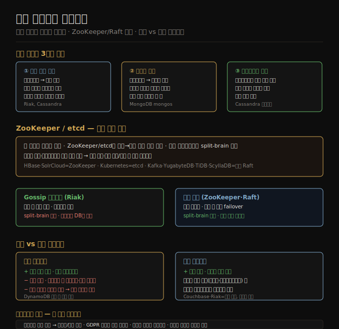

# 07-03. 요청 라우팅과 리밸런싱
> 샤드가 어느 노드에 있는지를 클라이언트나 라우팅 계층이 알아야 합니다. ZooKeeper·etcd 같은 조율 서비스가 이 매핑을 관리하고, 리밸런싱은 자동과 수동 중 어느 쪽을 택하느냐에 따라 운영 복잡도와 안정성이 달라집니다.

샤드를 설계하고 데이터를 분산했어도, 특정 키를 읽거나 쓸 때 어느 노드에 접속해야 하는지를 알지 못하면 시스템이 동작하지 않습니다. 이 문제를 요청 라우팅(request routing)이라고 합니다. 서비스 디스커버리(service discovery)와 비슷하지만, 샤딩 데이터베이스에서는 어느 인스턴스로든 요청을 보낼 수 있는 스테이트리스 서비스와 달리 특정 키는 해당 샤드를 가진 노드로만 보내야 한다는 차이가 있습니다.

## 1. 요청 라우팅 세 가지 방식
> 클라이언트·라우팅 티어·임의 노드 중 어디서 라우팅 정보를 갖느냐에 따라 구조가 달라집니다.

**① 임의 노드 접속**: 클라이언트는 어느 노드에 접속해도 됩니다. 요청을 받은 노드가 해당 샤드를 담당하면 직접 처리하고, 그렇지 않으면 올바른 노드로 포워드해 응답을 받아 클라이언트에게 전달합니다. Cassandra와 Riak이 이 방식을 씁니다.

**② 라우팅 티어**: 모든 요청이 라우팅 티어를 먼저 거칩니다. 티어는 샤드 매핑을 알고 있어 올바른 노드로 포워드하지만, 요청을 직접 처리하지는 않습니다. MongoDB의 mongos 데몬이 대표적입니다.

**③ 클라이언트 인지**: 클라이언트 자체가 샤드→노드 매핑을 알고 있어 중간 단계 없이 직접 접속합니다. Cassandra 드라이버가 이 방식으로 동작합니다.

어느 방식이든 공통 문제가 있습니다. 샤드 이전이나 노드 추가·제거가 일어날 때 라우팅 정보를 갖는 컴포넌트(티어, 클라이언트, 혹은 각 노드)가 변경을 어떻게 알아채느냐입니다.

## 2. ZooKeeper·etcd — 샤드 매핑 조율
> 별도 조율 서비스가 샤드→노드 매핑의 단일 진실 원천이 되면 split-brain을 방지할 수 있습니다.

많은 분산 데이터 시스템이 ZooKeeper나 etcd 같은 별도 조율 서비스에 샤드 매핑을 위임합니다. 각 노드는 자신을 ZooKeeper에 등록하고, ZooKeeper는 합의 알고리즘으로 권위 있는 샤드→노드 매핑을 유지합니다. 라우팅 티어나 샤딩 인지 클라이언트는 이 정보를 구독하고, 변경이 발생하면 즉시 업데이트합니다.

구체적으로 HBase와 SolrCloud는 ZooKeeper를, Kubernetes는 etcd를 씁니다. Kafka, YugabyteDB, TiDB, ScyllaDB는 ZooKeeper에 외부 의존하지 않고 내장 Raft 구현체로 동일한 역할을 수행합니다. MongoDB는 자체 config server와 mongos 데몬을 조합합니다.

Riak은 방식이 다릅니다. 노드 간 gossip 프로토콜로 클러스터 상태를 전파합니다. 합의 프로토콜보다 일관성이 약해 split-brain이 발생할 수 있지만, 리더리스 데이터베이스는 본래 약한 일관성을 전제하므로 이를 허용합니다.

샤드 이전이 진행 중인 컷오버 기간에는 새 노드가 인계를 받았지만 기존 노드로 오는 요청이 아직 진행 중인 경우가 생깁니다. 이 전환 기간의 요청 처리도 조율 서비스가 관리해야 할 과제입니다.

## 3. 자동 vs 수동 리밸런싱
> 자동 리밸런싱은 편리하지만 예측이 어렵고, 수동은 느리지만 운영 사고를 막습니다.

**자동 리밸런싱**은 시스템이 스스로 샤드 분할·이전을 결정합니다. 운영 부담이 줄고 트래픽 변화에 자동으로 적응합니다. DynamoDB는 분 단위로 샤드를 추가·제거해 급격한 부하 변화에 대응한다고 알려져 있습니다.

위험도 있습니다. 리밸런싱은 대량 데이터 이전이므로 네트워크와 노드에 큰 부담을 줍니다. 쓰기 처리량이 최대치에 가까운 상태에서 샤드 분할이 시작되면 쓰기 처리 속도를 따라잡지 못할 수 있습니다. 더 위험한 시나리오는 자동 장애 감지와 결합될 때입니다. 부하로 느려진 노드를 장애로 판단해 리밸런싱을 시작하면, 리밸런싱 부하가 다른 노드에도 전파돼 연쇄 과부하로 이어질 수 있습니다.

**수동 리밸런싱**은 관리자가 언제 샤드를 이전할지 결정합니다. 느리지만 예측 가능하고, 알려진 트래픽 급증 이벤트(월드컵·블랙프라이데이·사이버먼데이)를 앞두고 선제적으로 샤드를 재배치할 수 있습니다. Couchbase와 Riak은 중간 방식으로, 시스템이 최적 샤드 배치를 제안하지만 실제 이전은 관리자가 승인해야 합니다.

## 4. 멀티테넌시와 샤딩
> SaaS 제품에서 테넌트별로 샤드를 분리하면 격리·규정 준수·점진적 배포 같은 이점을 얻습니다.

멀티테넌트 시스템에서 샤딩을 활용하면 여러 이점이 생깁니다.

**리소스 격리**: 한 테넌트가 무거운 연산을 수행해도 다른 샤드의 테넌트에는 영향이 적습니다.

**권한 격리**: 접근 제어 버그가 있어도 물리적으로 다른 샤드에 있는 테넌트의 데이터로 번질 가능성이 줄어듭니다.

**셀 기반 아키텍처(cell-based architecture)**: 스토리지뿐 아니라 애플리케이션 서비스까지 테넌트 묶음별로 독립된 셀로 구성합니다. 한 셀의 장애가 다른 셀에 전파되지 않습니다.

**규정 준수**: GDPR·CCPA에서 요구하는 개인 데이터 삭제를 테넌트 샤드 단위로 간단히 처리할 수 있습니다. 데이터 레지던시 법률이 있는 테넌트는 해당 리전의 노드에 샤드를 배정합니다.

**점진적 스키마 마이그레이션**: 스키마 변경을 테넌트 하나씩 순차 적용할 수 있어 전체 적용 전에 문제를 조기에 발견합니다.

단점도 있습니다. 테넌트가 단일 노드에 담기지 않을 만큼 커지면 테넌트 내부에도 추가 샤딩이 필요합니다. 소형 테넌트가 많으면 테넌트마다 샤드를 하나씩 만드는 오버헤드가 커집니다. 또한 여러 테넌트를 넘나드는 기능(크로스 테넌트 조인 등)은 여러 샤드를 걸쳐야 해 구현이 복잡해집니다.

## 자주 받는 오해
1. **"ZooKeeper 없이는 샤드 라우팅이 불가능하다"** — ZooKeeper는 외부 조율 서비스의 대표 사례일 뿐입니다. Kafka·YugabyteDB·ScyllaDB처럼 내장 Raft를 쓰거나, Riak처럼 gossip 프로토콜로도 동작합니다. 어떤 메커니즘을 쓰든 핵심은 샤드→노드 매핑의 권위 있는 출처가 존재해야 한다는 점입니다.
2. **"자동 리밸런싱은 항상 안전하다"** — 리밸런싱은 대규모 데이터 이전이라 네트워크·노드 부하를 키웁니다. 부하로 느린 노드를 장애로 오판해 리밸런싱을 시작하면 연쇄 과부하가 발생할 수 있습니다. 예측 가능한 운영이 중요한 환경에서는 수동 또는 반자동 방식이 낫습니다.
3. **"멀티테넌시에는 샤딩이 필수다"** — 테넌트가 모두 소규모라면 단일 데이터베이스에서 스키마나 행 수준 접근 제어로 충분합니다. 샤딩은 격리·규정 준수·규모가 요구될 때 도입하는 추가 선택지입니다.

## 면접에서 받을 만한 질문
1. **"분산 DB에서 클라이언트가 올바른 노드를 어떻게 찾나요?"** — 세 가지 방식이 있습니다. 클라이언트가 임의 노드에 접속하고 노드 간 포워딩을 하거나, 라우팅 티어를 두거나, 클라이언트 드라이버가 직접 매핑을 갖습니다. 어느 경우든 ZooKeeper·etcd·내장 Raft 같은 조율 서비스가 샤드→노드 매핑의 신뢰할 수 있는 출처 역할을 합니다.
2. **"ZooKeeper를 쓰는 이유가 무엇인가요?"** — 분산 환경에서 여러 노드가 동시에 샤드 매핑을 변경하면 split-brain이 발생합니다. ZooKeeper는 합의 알고리즘으로 단일 리더를 선출해 이 문제를 막습니다. 각 노드는 ZooKeeper에 등록하고, 변경이 발생하면 구독자(라우팅 티어·클라이언트)에게 즉시 통지합니다.
3. **"멀티테넌트 SaaS에서 GDPR 삭제 요청을 어떻게 처리하나요?"** — 테넌트별 샤드가 분리돼 있으면 해당 샤드의 데이터를 삭제하거나 익명화하면 됩니다. 모든 테넌트가 한 테이블에 섞여 있으면 특정 사용자의 데이터를 찾아 삭제하는 작업이 훨씬 복잡하고 실수 가능성도 높습니다.

## 관련 문서
- [07-02. 해시 샤딩과 일관 해싱](07-02.해시%20샤딩과%20일관%20해싱.md) — 샤드 배치 알고리즘
- [07-04. 보조 인덱스와 7장 종합](07-04.보조%20인덱스와%207장%20종합.md) — 보조 인덱스의 샤딩 방법과 7장 마무리
