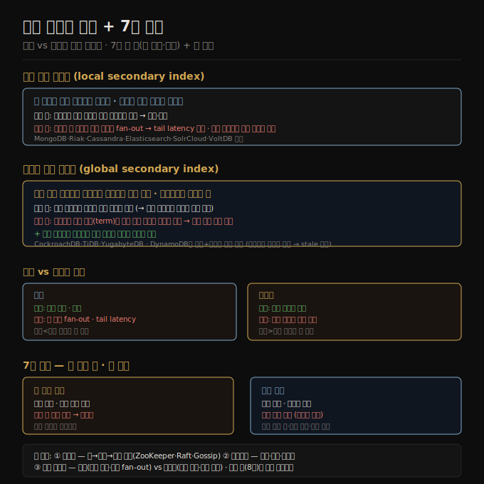

# 07-04. 보조 인덱스와 7장 종합
> 보조 인덱스는 파티션 키로 정리된 샤드 경계를 따르지 않아 별도 샤딩 전략이 필요합니다. 로컬 인덱스는 쓰기가 단순하지만 읽기에서 전 샤드 fan-out이 발생하고, 글로벌 인덱스는 읽기가 효율적이지만 쓰기가 복잡합니다.

샤딩을 결정하면 파티션 키 기반의 조회는 빠릅니다. 어느 샤드에 있는지 알면 직접 찾아가면 되기 때문입니다. 문제는 보조 인덱스입니다. "색이 빨간 차를 모두 보여줘"처럼 파티션 키가 아닌 다른 컬럼을 기준으로 검색하면, 어느 샤드를 봐야 할지 바로 알 수 없습니다. 이 절에서는 보조 인덱스를 어떻게 샤딩할지와, 7장 전체를 마무리합니다.

## 1. 로컬 보조 인덱스
> 각 샤드가 자기 레코드에 대한 인덱스만 관리합니다. 쓰기는 단순하지만, 보조 인덱스 조회는 모든 샤드에 질의해야 합니다.

로컬 인덱스(local secondary index)는 각 샤드가 독립적으로 자기 샤드의 레코드만 인덱싱합니다. 중고차 판매 사이트를 예로 들면, 차 ID를 파티션 키로 샤딩했을 때 빨간색 차 목록은 모든 샤드에 흩어집니다. 각 샤드는 자기 샤드에 있는 빨간 차 ID 목록만 가집니다.

쓰기는 간단합니다. 빨간 차를 추가하면 해당 레코드가 속한 샤드의 로컬 인덱스(`color:red` 포스팅 목록)에만 ID를 추가하면 됩니다. 분산 트랜잭션 없이 단일 샤드 내 쓰기로 해결됩니다.

읽기는 비쌉니다. 빨간 차를 모두 찾으려면 파티션 키를 모르는 상태에서 모든 샤드에 질의를 날리고(scatter/gather, fan-out) 결과를 합쳐야 합니다. 샤드 수가 늘어도 쿼리 처리량은 늘지 않습니다. 모든 샤드가 모든 쿼리를 처리해야 하기 때문입니다. 꼬리 지연(tail latency) 증폭도 문제입니다. 가장 느린 샤드의 응답을 기다려야 전체 결과가 완성됩니다.

MongoDB, Riak, Cassandra, Elasticsearch, SolrCloud, VoltDB가 로컬 보조 인덱스를 씁니다.

## 2. 글로벌 보조 인덱스
> 모든 샤드의 데이터를 커버하는 인덱스를 별도로 샤딩합니다. 읽기는 효율적이지만 쓰기 시 여러 인덱스 샤드를 갱신해야 합니다.

글로벌 인덱스(global secondary index)는 모든 샤드에 걸친 인덱스를 따로 샤딩합니다. 중고차 예시라면 빨간 차 ID 전체가 하나의 인덱스 항목 `color:red`에 모이고, 이 인덱스 자체를 인덱스값(term)을 파티션 키로 샤딩합니다. 'a~r'로 시작하는 색은 인덱스 샤드 0에, 's~z'로 시작하는 색은 인덱스 샤드 1에 배치하는 식입니다. 이런 방식을 용어 분할 인덱스(term-partitioned index)라고도 합니다.

읽기는 효율적입니다. `color = red` 조건 하나라면 인덱스 샤드 하나에만 질의해 빨간 차 ID 목록을 가져옵니다. 실제 레코드를 읽으려면 여러 샤드를 또 찾아가야 하지만, 인덱스 단계에서는 fan-out이 없습니다.

쓰기는 복잡합니다. 차 한 대를 추가하면 그 레코드가 속한 기본 키 샤드와, 그 차의 색·제조사 등 모든 속성에 해당하는 인덱스 샤드를 동시에 갱신해야 합니다. 각 속성의 인덱스가 다른 샤드에 있을 수 있으므로, 원자적 갱신을 보장하려면 분산 트랜잭션이 필요합니다(8장). 이 때문에 구현이 무겁습니다.

일부 시스템은 이 비용을 피하려고 글로벌 인덱스를 비동기로 갱신합니다. DynamoDB의 글로벌 보조 인덱스가 그 예입니다. 인덱스가 약간 stale할 수 있어 방금 쓴 레코드가 즉시 인덱스에 반영되지 않을 수 있습니다. 6장에서 다룬 복제 지연 문제와 성격이 같습니다.

글로벌 인덱스는 CockroachDB, TiDB, YugabyteDB에서 씁니다.

## 3. 로컬 vs 글로벌 선택 기준
> 읽기와 쓰기 비율, 포스팅 목록 길이, 일관성 요구에 따라 선택이 달라집니다.

읽기 처리량이 쓰기보다 높고 포스팅 목록이 짧으면 글로벌 인덱스가 유리합니다. 읽기마다 모든 샤드를 뒤지지 않아도 되기 때문입니다.

반대로 쓰기가 빈번하고 일관성 보장이 중요하다면 로컬 인덱스가 단순합니다. 분산 트랜잭션 없이 단일 샤드 쓰기로 인덱스를 최신 상태로 유지합니다.

두 조건(색깔 AND 제조사)을 동시에 검색하면 글로벌 인덱스라도 두 조건의 포스팅 목록이 서로 다른 인덱스 샤드에 있어 교집합을 구해야 합니다. 목록이 길면 네트워크로 전달하고 교집합을 계산하는 비용이 커집니다.

## 4. 7장 종합 — 두 샤딩 축과 세 과제
> 7장은 키 범위·해시 두 축으로 샤딩을 나누고, 라우팅·리밸런싱·보조 인덱스라는 세 운영 과제를 다뤘습니다.

**두 샤딩 축**

키 범위 샤딩은 정렬을 유지해 범위 쿼리에 강합니다. 인접 키에 쓰기가 집중되면 핫스팟이 생기고, 이를 해소하려면 파티션 키 설계(복합 키 순서 조정)나 샤드 분할이 필요합니다.

해시 샤딩은 균등 분산으로 핫스팟을 줄입니다. 범위 쿼리가 불가능하지만, 복합 키의 두 번째 열 이후에는 여전히 범위 쿼리가 가능합니다. mod N 방식은 리밸런싱 비용이 크므로, 고정 샤드 수·해시 범위·일관 해싱 중 하나를 씁니다.

**세 운영 과제**

라우팅: 어느 노드에 접속할지를 클라이언트·라우팅 티어·임의 노드 포워딩 방식으로 해결합니다. ZooKeeper·etcd·내장 Raft가 샤드→노드 매핑의 권위 있는 출처가 됩니다.

리밸런싱: 자동은 편리하지만 연쇄 과부하 위험이 있고, 수동은 예측 가능하지만 느립니다. 예측 가능한 트래픽 급증에는 선제적 수동 리밸런싱이 효과적입니다.

보조 인덱스: 로컬은 쓰기 단순·읽기 fan-out, 글로벌은 읽기 효율·쓰기 복잡입니다. 일관성 보장 수준과 읽기/쓰기 비율로 선택합니다.

샤드는 설계상 독립적으로 동작합니다. 그것이 수평 확장을 가능하게 하는 핵심 원리입니다. 그러나 여러 샤드를 동시에 변경해야 할 때—한 샤드 쓰기는 성공하고 다른 샤드 쓰기는 실패한다면—어떻게 처리해야 할까요? 8장에서는 이 문제를 분산 트랜잭션과 트랜잭션 모델로 다룹니다.

## 자주 받는 오해
1. **"보조 인덱스가 있으면 어떤 컬럼으로도 빠르게 조회된다"** — 로컬 보조 인덱스는 조회 시 모든 샤드에 fan-out이 발생합니다. 샤드가 많을수록 조회 비용이 선형으로 늘어납니다. 글로벌 인덱스는 읽기를 줄이지만 쓰기 복잡도가 높아집니다.
2. **"DynamoDB 글로벌 보조 인덱스는 항상 최신이다"** — DynamoDB의 글로벌 보조 인덱스는 비동기로 갱신됩니다. 방금 쓴 데이터가 인덱스에 즉시 반영되지 않을 수 있어, 읽기 일관성이 중요한 워크로드에서는 주의가 필요합니다.
3. **"샤딩과 인덱싱은 독립적인 문제다"** — 어떤 샤딩 방식을 쓰느냐가 보조 인덱스 설계에 직접 영향을 줍니다. 파티션 키가 무엇인지에 따라 어떤 조회는 단일 샤드로 처리되고 어떤 조회는 fan-out이 됩니다. 샤드 설계와 인덱스 전략은 함께 고려해야 합니다.

## 면접에서 받을 만한 질문
1. **"로컬 보조 인덱스와 글로벌 보조 인덱스의 차이를 설명해 주세요."** — 로컬은 각 샤드가 자기 레코드만 인덱싱합니다. 쓰기는 단일 샤드에서 완결되지만, 보조 인덱스로 조회하면 모든 샤드에 fan-out이 발생합니다. 글로벌은 모든 샤드 데이터를 커버하는 인덱스를 별도 샤딩합니다. 읽기는 단일 인덱스 샤드로 효율적이지만, 쓰기마다 여러 인덱스 샤드를 갱신해야 합니다.
2. **"Elasticsearch에서 검색 성능이 샤드 수와 어떤 관계인가요?"** — 로컬 보조 인덱스를 쓰는 Elasticsearch는 모든 샤드에 질의를 fan-out합니다. 샤드가 많아지면 저장 용량은 늘지만, 쿼리는 샤드 수만큼의 병렬 처리를 요구합니다. 샤드당 레코드 수가 너무 적으면 오버헤드가 크고, 너무 많으면 단일 샤드가 병목이 됩니다. 적절한 샤드 크기 설정이 중요합니다.
3. **"분산 데이터베이스에서 여러 샤드에 걸친 트랜잭션은 어떻게 처리하나요?"** — 글로벌 보조 인덱스 갱신처럼 여러 샤드를 원자적으로 갱신하려면 분산 트랜잭션이 필요합니다. 2PC(two-phase commit) 같은 프로토콜이 사용되지만 단일 노드 트랜잭션보다 느리고 복잡합니다. 이 주제는 8장 트랜잭션에서 깊이 다룹니다.

## 관련 문서
- [07-03. 요청 라우팅과 리밸런싱](07-03.요청%20라우팅과%20리밸런싱.md) — ZooKeeper·etcd로 라우팅 조율
- [04-04. 보조 인덱스와 인메모리 저장](04-04.보조%20인덱스와%20인메모리%20저장.md) — 단일 노드에서 보조 인덱스의 구조
