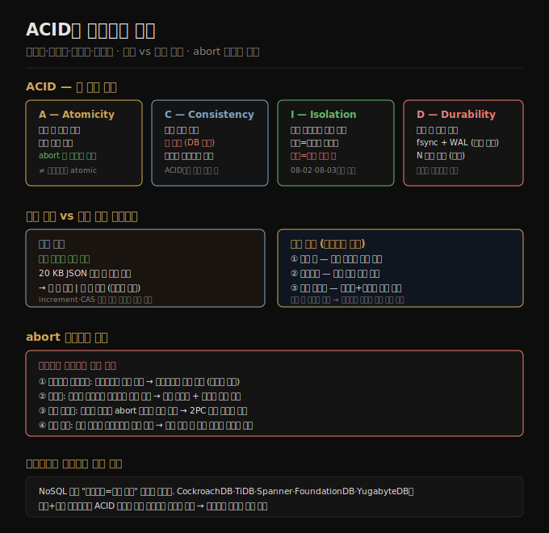

# 08-01. ACID와 트랜잭션 개요
> 트랜잭션은 여러 읽기·쓰기를 하나의 논리 단위로 묶어, 부분 실패·동시성 문제를 애플리케이션에서 감추는 추상 계층입니다. ACID는 그 안전 보장을 네 글자로 요약하지만, 실제 구현은 데이터베이스마다 의미가 크게 다릅니다.

하드웨어 결함, 애플리케이션 크래시, 네트워크 단절, 동시 쓰기 충돌, 부분 갱신 읽기—이 중 어느 하나라도 발생하면 데이터는 예상치 못한 상태에 놓입니다. 트랜잭션은 이 문제를 애플리케이션이 직접 다루지 않아도 되도록 데이터베이스가 대신 처리해 주는 메커니즘입니다. 트랜잭션 안에서 발생한 오류는 전체 롤백으로 처리되므로, 애플리케이션은 "전부 성공 또는 전부 실패"라는 단순한 모델만 상정하면 됩니다.

이 노트는 ACID 네 속성의 정확한 의미와 단일 객체·다중 객체 연산의 차이를 다룹니다. 트랜잭션이 어떤 문제를 해결하고 어떤 비용을 요구하는지 이해하는 것이 8장 전체의 출발점입니다.

## 1. 트랜잭션이 필요한 이유
> 다중 쓰기 중 장애가 발생하면 부분 갱신 상태가 남습니다. 트랜잭션은 이 위험을 "abort 후 재시도"로 단순화합니다.

데이터베이스에 여러 레코드를 쓰는 중간에 프로세스가 죽으면 일부는 새 값, 나머지는 옛 값으로 남습니다. 두 클라이언트가 같은 행을 동시에 수정하면 서로의 변경을 덮어씁니다. 트랜잭션이 없으면 애플리케이션은 이 모든 경우를 직접 감지하고 수습해야 하는데, 그 복잡도는 애플리케이션 규모가 커질수록 기하급수적으로 늘어납니다.

트랜잭션은 이 복잡도를 오류 처리 한 지점으로 집약합니다. 트랜잭션이 중단되면 그 안에서 이루어진 모든 쓰기가 취소되므로, 애플리케이션은 안전하게 재시도할 수 있습니다. 다만 트랜잭션이 "자연 법칙"은 아닙니다. 어떤 안전 보장을 제공할지, 그 대가로 성능·가용성을 얼마나 희생할지는 설계 선택의 문제입니다.

## 2. ACID — 원자성(Atomicity)
> 원자성은 동시성과 무관합니다. 장애 발생 시 부분 완료 상태를 남기지 않는다는 "abort 가능성"을 뜻합니다.

ACID의 A는 멀티스레드 프로그래밍의 "원자 명령"(다른 스레드가 중간 상태를 볼 수 없음)과 이름이 같지만 의미가 다릅니다. 트랜잭션 맥락에서 원자성은 **여러 쓰기 중 장애가 생겼을 때 이미 완료된 쓰기를 되돌릴 수 있다**는 보장입니다. 커밋 전에 오류가 나면 트랜잭션 전체가 중단(abort)되고, 그 안의 모든 쓰기는 폐기됩니다.

"abortability(중단 가능성)"라는 이름이 더 정확하겠지만, 관행상 원자성이라 부릅니다. 핵심은 애플리케이션이 재시도를 안전하게 할 수 있다는 점입니다. 트랜잭션이 중단됐다면 아무것도 바꾸지 않은 것이 보장되므로, 동일 트랜잭션을 그대로 다시 시도해도 중복이나 오염이 생기지 않습니다.

## 3. ACID — 일관성(Consistency)
> 일관성은 데이터베이스의 속성이 아니라 애플리케이션 책임입니다. C는 ACID에서 다소 억지로 끼워 맞춘 글자입니다.

ACID의 C는 복제 일관성, 일관된 스냅샷, 일관 해싱, CAP 정리의 일관성과 이름이 겹쳐 혼란을 줍니다. ACID 맥락에서는 **애플리케이션이 정의한 불변 조건(invariant)을 트랜잭션 커밋 이후에도 항상 만족**한다는 의미입니다. 예컨대 복식 장부에서 모든 계좌의 차변 합계와 대변 합계는 항상 같아야 합니다.

그러나 이 불변 조건을 데이터베이스가 강제하려면 스키마 제약(외래 키, 유니크, 체크 제약)으로 선언해야 합니다. 복잡한 불변 조건은 스키마 제약으로 표현하기 어렵고, 그 경우 올바른 트랜잭션을 작성할 책임은 애플리케이션에 있습니다. C는 결국 A·I·D가 올바른 데이터를 다룬다는 전제 위에서만 성립합니다.

## 4. ACID — 격리성(Isolation)과 지속성(Durability)
> 격리성은 동시 실행 트랜잭션이 서로 간섭하지 않는다는 보장이고, 지속성은 커밋 후 데이터가 영구 저장된다는 약속입니다.

**격리성**: 이론상 직렬화 가능성(serializability)을 의미합니다. 트랜잭션들이 실제로는 동시에 실행됐더라도 결과는 순차 실행과 같아야 합니다. 그림 8-1의 카운터 증분 경쟁 조건—두 클라이언트가 각각 42를 읽고 43을 썼지만 기대 결과는 44—은 격리성 부재가 낳는 전형적인 버그입니다. 실제 구현에서는 직렬화 비용을 피하기 위해 더 약한 격리 수준을 씁니다. 이 주제는 08-02와 08-03에서 깊이 다룹니다.

**지속성**: 커밋된 트랜잭션의 데이터는 하드웨어 결함이나 크래시 뒤에도 사라지지 않는다는 약속입니다. 단일 노드에서는 fsync로 디스크에 기록하고, WAL(write-ahead log)로 크래시 복구를 지원합니다. 복제 환경에서는 충분한 수의 노드에 쓰기가 완료된 뒤에야 커밋 성공을 알립니다. 하지만 완벽한 지속성은 없습니다. SSD 펌웨어 버그, fsync 오동작, 디스크 묵음 손상, 복제본 동시 장애 같은 현실적 실패 경로가 있으며, 이를 이유로 이론적 "보장"을 맹신하지 말아야 합니다.

## 5. 단일 객체 vs 다중 객체 트랜잭션
> 대부분의 실용적인 문제는 여러 객체를 동시에 일관되게 변경해야 할 때 발생합니다.

저장 엔진은 단일 객체(키-값 쌍 한 개) 수준에서 원자성과 격리성을 거의 항상 제공합니다. 20 KB JSON 문서를 쓰다가 전원이 끊기면 구 값이 온전히 남거나 신 값이 온전히 써지지, 두 값이 뒤섞인 상태는 생기지 않습니다.

문제는 여러 객체를 한꺼번에 변경해야 할 때입니다. 이메일 수신함의 미읽은 메시지 수(카운터)와 실제 메시지 레코드는 별개 테이블에 있습니다. 새 메시지가 오면 둘 다 갱신해야 합니다. 이 두 쓰기가 한 트랜잭션에 묶이지 않으면 카운터는 0인데 메시지 목록에는 읽지 않은 메일이 보이는 상황이 생깁니다(그림 8-2). 다중 객체 트랜잭션이 필요한 전형적인 패턴입니다.

다중 객체 트랜잭션이 필요한 상황:
1. 외래 키 참조 — 여러 테이블 행을 동시에 삽입할 때 참조 무결성 유지
2. 문서 DB 비정규화 — 동일 사실이 여러 문서에 복제된 경우, 모두 함께 갱신해야 일관성 유지
3. 보조 인덱스 — 레코드 변경 시 인덱스도 함께 갱신되지 않으면 한 인덱스엔 있고 다른 인덱스엔 없는 상태 발생

트랜잭션 없이도 이런 애플리케이션을 구현할 수는 있지만, 에러 처리가 복잡해지고 동시성 버그가 쉽게 숨어듭니다.

## 6. abort와 재시도의 함정
> abort 후 재시도는 단순해 보이지만, 멱등성이 보장되지 않는 부작용이 있으면 재시도가 더 큰 문제를 일으킵니다.

abort 재시도가 완벽한 해법이 아닌 경우:
- **네트워크 타임아웃**: 트랜잭션이 실제로 성공했지만 응답이 유실된 경우, 재시도하면 같은 작업이 두 번 실행됩니다. 중복 방지를 위한 애플리케이션 레벨 중복 제거 로직이 필요합니다.
- **과부하 재시도**: 부하 급증이 원인이라면 재시도가 상황을 악화시킵니다. 지수 백오프와 재시도 횟수 제한이 필요합니다.
- **영구 오류**: 제약 위반처럼 재시도해도 해결되지 않는 오류에는 재시도가 의미 없습니다.
- **외부 부작용**: 이메일 발송처럼 DB 트랜잭션 밖의 부작용은 abort 후에도 이미 일어났을 수 있습니다. 이런 경우 2PC(분산 커밋)나 멱등성 설계가 필요합니다.
- **클라이언트 크래시**: 재시도 중 클라이언트가 죽으면 쓰려던 데이터 자체가 유실됩니다.

## 자주 받는 오해
1. **"ACID를 지원한다고 쓰인 데이터베이스라면 같은 보장을 제공한다"** — ACID는 마케팅 용어로 전락한 측면이 있습니다. 특히 I(격리성)의 구현 수준은 데이터베이스마다 크게 다릅니다. Oracle의 "Serializable"은 실제로는 스냅샷 격리(더 약한 수준)를 구현합니다. 어느 데이터베이스를 쓰든 실제 격리 수준이 무엇인지 직접 확인해야 합니다.
2. **"단일 객체 쓰기는 항상 안전하다"** — 저장 엔진이 단일 객체 원자성을 보장하더라도, 비즈니스 로직이 여러 객체를 조율해야 한다면 그것만으로는 부족합니다. 카운터와 실제 레코드처럼 두 객체를 동시에 일관되게 변경하려면 다중 객체 트랜잭션이 필요합니다.
3. **"트랜잭션은 성능 병목이므로 가능하면 쓰지 않는 것이 낫다"** — NoSQL 붐 시절의 오해입니다. CockroachDB, TiDB, Spanner, FoundationDB, YugabyteDB 같은 NewSQL 시스템은 트랜잭션과 높은 처리량이 양립할 수 있음을 보여줬습니다. 트랜잭션이 필요한지 여부는 워크로드 특성에 달려 있으며, 무조건 회피하는 것은 더 복잡한 애플리케이션 오류 처리를 초래합니다.

## 면접에서 받을 만한 질문
1. **"ACID의 네 속성을 설명해 주세요."** — 원자성은 트랜잭션 내 모든 쓰기가 전부 커밋되거나 전부 롤백되는 보장입니다. 일관성은 애플리케이션이 정의한 불변 조건을 트랜잭션 커밋 후에도 유지하는 것으로, 데이터베이스보다 애플리케이션 책임에 가깝습니다. 격리성은 동시 실행 트랜잭션이 서로 간섭하지 않는다는 보장이며, 이론상 직렬화 가능성을 의미합니다. 지속성은 커밋된 데이터가 하드웨어 결함 후에도 살아남는다는 약속입니다.
2. **"트랜잭션 없이 여러 레코드를 일관되게 갱신할 수 있나요?"** — 가능하지만 복잡합니다. 갱신 중 크래시가 나면 부분 갱신 상태를 직접 감지하고 수습해야 합니다. 보조 인덱스나 비정규화 데이터를 유지하는 경우 트랜잭션 없이는 일관성 보장이 어렵습니다. 구현은 가능하지만, 그 복잡도를 감당할 수 있는지 따져봐야 합니다.
3. **"abort 후 재시도가 위험한 경우는 어떤 때인가요?"** — 이메일 발송처럼 DB 외부에 부작용이 있는 경우 abort가 부작용을 되돌리지 못합니다. 성공 응답이 네트워크에서 유실된 경우 재시도하면 같은 작업이 중복 실행됩니다. 이런 경우 멱등성 설계나 2PC가 필요합니다.

## 관련 문서
- [08-02. 약한 격리 수준과 스냅샷 격리](08-02.약한%20격리%20수준과%20스냅샷%20격리.md) — Read committed, MVCC, 스냅샷 격리, 갱신 손실
- [07-04. 보조 인덱스와 7장 종합](07-04.보조%20인덱스와%207장%20종합.md) — 샤딩 환경에서 보조 인덱스를 다중 쓰기로 갱신해야 하는 이유
