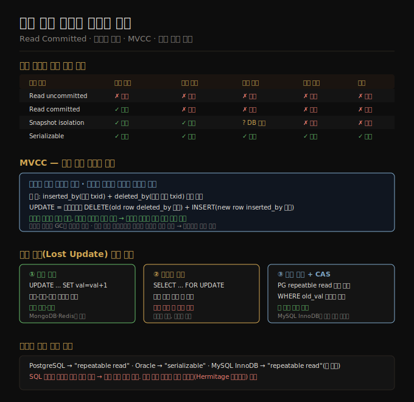

# 08-02. 약한 격리 수준과 스냅샷 격리
> 직렬화 격리는 모든 경쟁 조건을 막지만 성능 비용이 큽니다. 실제 데이터베이스는 일부 경쟁 조건을 허용하는 대신 더 빠른 약한 격리 수준을 씁니다. 어느 수준이 어떤 버그를 허용하는지 알아야 올바른 선택을 할 수 있습니다.

동시성 버그는 테스트로 잡기 어렵습니다. 타이밍이 정확히 맞아야 발생하고, 재현이 어렵습니다. 데이터베이스는 트랜잭션 격리를 제공함으로써 이 문제를 애플리케이션에서 감춥니다. 그러나 완벽한 격리(직렬화)는 비쌉니다. 그래서 대부분의 데이터베이스는 직렬화보다 약하지만 충분히 유용한 수준을 기본값으로 씁니다.

이 노트는 가장 널리 쓰이는 두 격리 수준—read committed와 스냅샷 격리—의 동작 원리와 한계를 다룹니다. 스냅샷 격리를 구현하는 핵심 기법인 MVCC(다중 버전 동시성 제어)도 함께 살펴봅니다.

## 1. Read Committed — 더티 읽기·더티 쓰기 방지
> Read committed는 커밋된 데이터만 읽고, 커밋된 데이터만 덮어씁니다. Oracle·PostgreSQL·SQL Server의 기본 격리 수준입니다.

**더티 읽기(dirty read)**: 아직 커밋되지 않은 트랜잭션의 쓰기를 다른 트랜잭션이 읽는 현상입니다. Read committed는 이를 막습니다. 트랜잭션의 쓰기는 커밋된 뒤에야 다른 트랜잭션에 보입니다. 이 덕분에 "트랜잭션이 중단됐다가 롤백된 데이터를 읽었는데, 그 데이터가 사라지는" 연쇄 중단(cascading abort) 문제도 방지됩니다.

**더티 쓰기(dirty write)**: 아직 커밋되지 않은 트랜잭션의 데이터를 다른 트랜잭션이 덮어쓰는 현상입니다. 예컨대 중고차 판매 사이트에서 두 구매자가 동시에 같은 차를 사려 할 때, 더티 쓰기가 허용되면 구매자 A는 판매 기록에, 구매자 B는 청구서에 적히는 불일치가 생깁니다. Read committed는 행 수준 잠금으로 이를 막습니다.

**구현**: 더티 쓰기 방지는 행 수준 잠금으로 직관적입니다. 더티 읽기 방지는 읽기 잠금 대신 두 버전 유지로 구현합니다. 트랜잭션이 쓰는 동안 데이터베이스는 커밋된 구 값과 진행 중인 신 값을 모두 기억합니다. 다른 트랜잭션은 커밋이 완료되기 전까지 구 값을 읽습니다.

그러나 read committed는 읽기 스큐(read skew)를 막지 못합니다. 두 쿼리가 각각 커밋된 데이터를 읽어도 두 쿼리 사이에 다른 트랜잭션이 커밋되면 두 읽기가 서로 다른 시점의 상태를 반영합니다.

## 2. 스냅샷 격리와 반복 읽기
> 스냅샷 격리는 트랜잭션이 시작한 시점의 일관된 데이터베이스 스냅샷을 읽도록 보장합니다. 긴 읽기 트랜잭션(백업·분석 쿼리)에 특히 유용합니다.

은행 계좌 예시로 읽기 스큐를 이해할 수 있습니다. Aaliyah는 두 계좌에 각 500달러를 가지고 있습니다. 한 계좌에서 다른 계좌로 100달러를 이체하는 트랜잭션이 진행 중입니다. 이 이체가 딱 절반쯤 진행된 순간에 Aaliyah가 잔액을 조회하면 500달러(이체 전)와 400달러(이체 후)를 보게 됩니다. 합계가 900달러로, 100달러가 증발한 것처럼 보입니다.

이 이상 현상은 일시적이고 곧 바로잡히지만, 백업이나 분석 쿼리에서는 치명적입니다. 몇 시간 동안 실행되는 백업이 절반은 이체 전 데이터를, 절반은 이체 후 데이터를 담는다면 복구할 때 불일치가 영구화됩니다.

스냅샷 격리는 각 트랜잭션이 시작 시점의 일관된 스냅샷에서 읽도록 함으로써 이 문제를 해결합니다. 트랜잭션 중간에 다른 트랜잭션이 커밋되더라도 현재 트랜잭션은 시작 시점의 데이터를 봅니다.

스냅샷 격리는 PostgreSQL, MySQL(InnoDB), Oracle, SQL Server에서 지원합니다. PostgreSQL은 이를 "repeatable read"로, Oracle은 "serializable"로 부릅니다. 명칭 혼란이 있으므로 실제 동작을 확인해야 합니다.

## 3. MVCC — 다중 버전 동시성 제어
> MVCC는 행의 여러 버전을 동시에 보존해, 읽기 트랜잭션이 자신의 스냅샷에 맞는 버전을 선택하게 합니다. 읽기가 쓰기를 막지 않고, 쓰기도 읽기를 막지 않습니다.

PostgreSQL의 MVCC 구현:

1. 각 트랜잭션은 고유하게 증가하는 트랜잭션 ID(txid)를 받습니다.
2. 각 행에는 `inserted_by`(삽입한 txid)와 `deleted_by`(삭제 요청한 txid) 필드가 있습니다.
3. 갱신(UPDATE)은 내부적으로 삭제+삽입으로 처리됩니다. 기존 행의 `deleted_by`에 갱신 txid를 기록하고, 새 행을 삽입합니다.
4. 읽기 트랜잭션은 자신의 txid보다 먼저 커밋된 행 버전만 봅니다. 자신보다 늦게 시작된 트랜잭션의 쓰기는 무시합니다.

**가시성 규칙**: 행이 보이려면 두 조건을 모두 만족해야 합니다.
- 행을 삽입한 트랜잭션이 현재 트랜잭션 시작 전에 이미 커밋되었을 것
- 행이 삭제 표시됐다면, 삭제 요청한 트랜잭션이 현재 트랜잭션 시작 시점에 아직 커밋되지 않았을 것

오래된 버전은 가비지 컬렉션(GC) 프로세스가 나중에 정리합니다. 어떤 트랜잭션도 더 이상 그 버전에 접근할 수 없을 때 삭제됩니다. 장기 실행 트랜잭션은 오래된 버전을 오래 참조하므로, 해당 버전들이 GC되지 못해 저장 공간을 많이 차지하는 문제가 생깁니다.

## 4. 갱신 손실(Lost Update) 방지
> 두 트랜잭션이 읽기-수정-쓰기 사이클을 동시에 수행하면 한쪽 변경이 사라집니다. 이를 막는 방법이 여러 가지 있습니다.

갱신 손실의 전형적인 패턴: 두 클라이언트가 카운터를 읽어 각각 1을 더하고 씁니다. 둘 다 42를 읽었다면 결과는 44가 아닌 43이 됩니다.

**방지 방법:**

**원자적 쓰기 연산**: `UPDATE counters SET value = value + 1 WHERE key = 'foo'` 같은 DB 내장 원자 연산을 쓰면 읽기-수정-쓰기 사이클이 필요 없습니다. 가능하면 이 방법이 가장 단순합니다.

**명시적 잠금**: `SELECT ... FOR UPDATE`로 읽은 행을 잠근 뒤 수정합니다. 멀티플레이어 게임에서 체스 말의 이동처럼, DB 쿼리만으로 표현할 수 없는 검증 로직이 있을 때 씁니다.

**자동 갱신 손실 감지**: PostgreSQL의 repeatable read, Oracle의 serializable, SQL Server의 snapshot isolation은 갱신 손실을 자동으로 감지해 트랜잭션을 중단시킵니다. 애플리케이션이 특별한 코드를 쓸 필요가 없습니다. MySQL/InnoDB의 repeatable read는 이 자동 감지를 지원하지 않습니다.

**조건부 쓰기(CAS, compare-and-set)**: `WHERE content = '옛 내용'`처럼 조건을 붙여 쓰기가 여전히 자신이 읽은 값을 대상으로 하는지 확인합니다. 조건이 맞지 않으면 재시도합니다. MVCC 가시성 규칙 예외에 주의해야 합니다—WHERE 조건 평가 시 다른 트랜잭션의 미커밋 쓰기가 보일 수 있습니다.

**다중 리더·리더리스 복제**: 잠금이나 CAS는 "단일 최신 복사본" 가정 위에서만 동작합니다. 여러 노드에서 동시에 쓰기가 가능한 환경에서는 CRDT처럼 교환 법칙이 성립하는 연산이나 버전 병합이 필요합니다.

## 자주 받는 오해
1. **"Read committed만 써도 동시성 문제는 대부분 해결된다"** — Read committed는 더티 읽기와 더티 쓰기를 막지만, 읽기 스큐, 갱신 손실, 쓰기 스큐, 팬텀은 여전히 허용합니다. 이 문제들이 실제 운영에서 버그로 나타납니다. Oracle이 "ACID 준수"라고 광고하면서 기본값으로 read committed를 쓰는 이유는 성능 때문이지, 그것으로 충분하기 때문이 아닙니다.
2. **"MVCC는 쓰기 잠금이 없으니 충돌이 없다"** — MVCC는 읽기가 쓰기를 막지 않는다는 의미입니다. 쓰기끼리의 충돌(더티 쓰기, 갱신 손실)은 여전히 발생합니다. 스냅샷 격리에서도 두 트랜잭션이 같은 행을 동시에 수정하면 행 수준 잠금이 필요합니다.
3. **"스냅샷 격리=직렬화"** — Oracle은 스냅샷 격리를 "Serializable"이라고 부르지만 실제 직렬화 가능성보다 약합니다. 쓰기 스큐(write skew)와 팬텀을 막지 못합니다. 스냅샷 격리를 쓰더라도 특정 패턴의 버그가 여전히 발생할 수 있습니다.

## 면접에서 받을 만한 질문
1. **"Read committed와 스냅샷 격리의 차이를 설명해 주세요."** — Read committed는 쿼리마다 최신 커밋 값을 읽습니다. 따라서 같은 트랜잭션 안에서 같은 쿼리를 두 번 실행하면 다른 결과가 나올 수 있습니다(읽기 스큐). 스냅샷 격리는 트랜잭션 시작 시점의 스냅샷을 일관되게 읽습니다. 백업이나 분석 쿼리처럼 오래 실행되는 읽기에서 일관성이 중요할 때 스냅샷 격리가 필요합니다.
2. **"MVCC가 무엇인지, 왜 쓰는지 설명해 주세요."** — 행의 여러 버전을 동시에 유지하는 기법입니다. 읽기 트랜잭션이 자신의 스냅샷에 맞는 버전을 선택하므로, 읽기와 쓰기가 서로를 막지 않습니다. 이 덕분에 읽기 전용 쿼리가 쓰기 트랜잭션을 지연시키지 않아 처리량이 높습니다. 대신 오래된 버전을 GC로 정리해야 하고, 장기 실행 트랜잭션은 많은 버전을 살려 두므로 스토리지를 많이 씁니다.
3. **"갱신 손실을 어떻게 방지하나요?"** — 세 가지 접근이 있습니다. 첫째, DB 내장 원자 연산(`UPDATE ... SET value = value + 1`)을 쓰면 읽기-수정-쓰기 사이클 자체가 없어집니다. 둘째, `SELECT FOR UPDATE`로 명시적 잠금을 걸고 수정합니다. 셋째, PostgreSQL처럼 자동 갱신 손실 감지를 지원하는 DB를 씁니다. 복제 환경에서는 잠금이 통하지 않으므로 CRDT나 버전 병합이 필요합니다.

## 관련 문서
- [08-01. ACID와 트랜잭션 개요](08-01.ACID와%20트랜잭션%20개요.md) — 트랜잭션이 해결하는 문제와 ACID 네 속성
- [08-03. Write Skew와 직렬화 가능성](08-03.Write%20Skew와%20직렬화%20가능성.md) — 스냅샷 격리에서도 발생하는 쓰기 스큐와 직렬화 구현 방법
