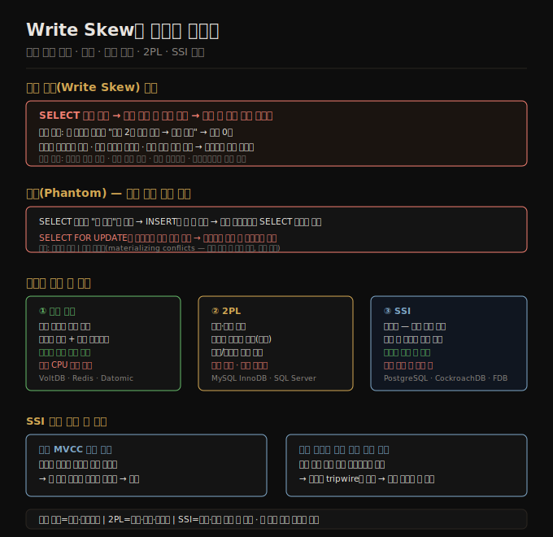

# 08-03. Write Skew와 직렬화 가능성
> 쓰기 스큐는 스냅샷 격리에서도 발생하는 미묘한 경쟁 조건입니다. 이를 포함한 모든 경쟁 조건을 막으려면 직렬화 격리가 필요합니다. 직렬화를 구현하는 세 가지 방법—단일 스레드 직렬 실행, 2PL, SSI—은 각각 다른 성능·확장성 트레이드오프를 가집니다.

스냅샷 격리는 갱신 손실과 읽기 스큐를 막지만, 쓰기 스큐와 팬텀은 막지 못합니다. 이 두 이상 현상은 "읽은 값에 기반해 쓰기를 결정하는" 패턴에서 발생합니다. 직렬화 격리는 이 패턴을 포함한 모든 경쟁 조건을 막는 유일한 수단입니다.

이 노트는 쓰기 스큐의 구조를 분석하고, 직렬화를 달성하는 세 접근법을 비교합니다. PostgreSQL의 SSI(직렬화 가능 스냅샷 격리)는 최신 방법으로, 스냅샷 격리 수준의 성능에 직렬화 보장을 더합니다.

## 1. 쓰기 스큐(Write Skew)와 팬텀
> 쓰기 스큐는 두 트랜잭션이 서로 다른 객체를 수정하지만, 각자가 읽은 전제 조건이 상대방의 쓰기로 인해 무너지는 현상입니다.

병원 당직 예시: Aaliyah와 Bryce 두 의사가 동시에 당직을 취소하려 합니다. 각 트랜잭션은 먼저 "현재 당직 의사가 2명 이상인지" 확인하고, 그렇다면 자신을 당직에서 뺍니다. 스냅샷 격리에서는 두 트랜잭션이 모두 2명을 읽고, 모두 자신을 제거합니다. 결과는 당직 의사 0명—요구 사항 위반입니다.

**쓰기 스큐의 구조**:
1. SELECT로 어떤 조건을 확인
2. 그 결과에 기반해 쓰기 여부를 결정
3. 쓰기를 수행해 커밋
4. 커밋 후에는 SELECT의 전제 조건이 더 이상 참이 아님

쓰기 스큐는 갱신 손실의 일반화입니다. 갱신 손실은 두 트랜잭션이 같은 객체를 수정하는 경우이고, 쓰기 스큐는 서로 다른 객체를 수정하지만 읽은 조건이 얽혀 있는 경우입니다.

**팬텀(Phantom)**: 한 트랜잭션의 쓰기가 다른 트랜잭션의 검색 조건과 일치하는 새 행을 추가하거나 제거하는 현상입니다. 회의실 예약 충돌, 중복 사용자명, 잔액 초과 지출이 모두 팬텀 패턴입니다. SELECT FOR UPDATE로 잠글 행이 아직 존재하지 않기 때문에(없는 행에 잠금을 걸 수 없음) 일반 잠금으로는 막을 수 없습니다.

쓰기 스큐 방지 옵션:
- **직렬화 격리** 사용 (권장)
- `SELECT FOR UPDATE`로 의존 행 잠금 (팬텀에는 불완전)
- 충돌 구체화(materializing conflicts): 팬텀이 잠글 수 있는 실제 행으로 바꾸는 기법. 예컨대 회의실 예약 가능 시간대를 미리 행으로 삽입해 두고 그 행을 잠급니다. 복잡하고 데이터 모델이 오염되므로 최후 수단입니다.

## 2. 직렬 실행(Serial Execution)
> 단일 스레드로 트랜잭션을 순차 실행하면 동시성 문제가 없지만, 처리량이 단일 CPU 코어에 제한됩니다.

2000년대 이전에는 단일 스레드 실행이 비효율적이라 여겨졌습니다. 두 가지 변화가 이를 실용적으로 만들었습니다.

첫째, RAM 가격이 충분히 낮아져 활성 데이터셋을 메모리에 올릴 수 있게 됐습니다. 디스크 I/O 대기가 없으면 트랜잭션을 빠르게 처리합니다.

둘째, OLTP 트랜잭션은 짧고 몇 개의 읽기·쓰기만 수행합니다. 반면 긴 분석 쿼리는 읽기 전용이므로 직렬 실행 루프 밖에서 스냅샷으로 처리할 수 있습니다.

VoltDB, Redis, Datomic이 이 접근을 씁니다.

**저장 프로시저**: 단일 스레드 시스템에서 인터랙티브 다단계 트랜잭션("읽기 → 사용자 입력 → 쓰기")은 사용 불가입니다. 하나의 느린 트랜잭션이 전체 시스템을 막기 때문입니다. 대신 트랜잭션 전체 로직을 저장 프로시저로 미리 작성해 제출합니다. 데이터가 메모리에 있고 I/O 대기가 없으면 저장 프로시저는 빠르게 실행됩니다. VoltDB는 Java·Groovy, Redis는 Lua, Datomic은 Java·Clojure로 저장 프로시저를 작성합니다.

**샤딩과 직렬 실행**: 데이터를 샤딩해 각 샤드가 자체 스레드를 가지면 처리량을 CPU 코어 수에 비례해 늘릴 수 있습니다. 단, 여러 샤드에 걸친 트랜잭션은 모든 샤드를 동기화해야 하므로 단일 샤드 트랜잭션보다 수십~수백 배 느립니다.

## 3. 2PL — 2단계 잠금
> 2PL은 읽기도 쓰기를 막고, 쓰기도 읽기를 막습니다. 직렬화를 강력하게 보장하지만 성능이 나쁩니다.

스냅샷 격리의 "읽기가 쓰기를 막지 않는다" 원칙과 달리, 2PL(two-phase locking)은 훨씬 강합니다.

- 트랜잭션 A가 객체를 읽었고, B가 그 객체를 쓰려 한다면 → B는 A가 커밋·중단될 때까지 대기
- 트랜잭션 A가 객체를 썼고, B가 그 객체를 읽으려 한다면 → B는 A가 커밋·중단될 때까지 대기

잠금은 공유 모드(읽기)와 독점 모드(쓰기)로 나뉩니다. 트랜잭션이 끝날 때까지 잠금을 유지합니다(2단계: 취득 후 유지 → 커밋 시 일괄 해제).

**팬텀 방지 — 서술 잠금과 인덱스 범위 잠금**: 2PL이 팬텀을 막으려면 특정 검색 조건에 해당하는 모든 행에 잠금을 걸어야 합니다. 아직 존재하지 않는 행에도 적용되어야 하므로 "서술 잠금(predicate lock)"이 필요합니다. 실제 구현에서는 성능 때문에 인덱스 범위 잠금(index-range locking, 또는 next-key locking)을 씁니다. 서술보다 더 넓은 범위를 잠그지만, 빠르게 확인할 수 있습니다.

**성능**: 잠금 경합이 많으면 지연이 크게 늘어납니다. 하나의 느린 트랜잭션이 전체 시스템을 늦출 수 있습니다. 데드락도 자주 발생합니다—데이터베이스가 자동으로 감지해 한쪽을 중단시키지만, 재시도 비용이 발생합니다.

## 4. SSI — 직렬화 가능 스냅샷 격리
> SSI는 스냅샷 격리 위에 직렬화 위반 감지 알고리즘을 더합니다. 낙관적 접근으로 잠금 없이 진행하다가 커밋 시점에 충돌을 검사합니다.

2008년에 처음 기술된 SSI(serializable snapshot isolation)는 오늘날 PostgreSQL, CockroachDB, FoundationDB 등에서 쓰입니다.

**핵심 아이디어**: 트랜잭션은 잠금 없이 진행합니다. 커밋 시점에 "내가 읽은 데이터가 그 사이에 변경됐는가?"를 검사합니다. 변경됐다면 나의 쓰기가 낡은 전제에 기반했을 수 있으므로 중단합니다.

SSI는 두 종류의 충돌을 감지합니다.
1. **낡은 MVCC 읽기**: 커밋 전 다른 트랜잭션의 쓰기를 무시하고 읽었는데, 그 쓰기가 이미 커밋된 경우
2. **이전 읽기에 영향을 주는 쓰기**: 내가 읽은 행을 다른 트랜잭션이 수정한 경우

이 정보를 트랙킹하다가, 커밋 시 "낡은 전제에 기반한 쓰기"로 판단되면 중단합니다.

**2PL 대비 장점**: 읽기가 쓰기를 막지 않고, 쓰기도 읽기를 막지 않습니다. 읽기 전용 쿼리는 잠금 없이 일관된 스냅샷을 봅니다. FoundationDB는 직렬화 충돌 감지를 여러 머신에 분산해 높은 처리량을 달성합니다.

**단점**: 경합이 높으면 중단률이 높아집니다. 읽기와 쓰기를 오래 하는 트랜잭션은 충돌 가능성이 높습니다. SSI는 2PL보다 느린 트랜잭션에 덜 민감하지만, 충돌이 잦으면 재시도 비용이 누적됩니다.

## 자주 받는 오해
1. **"SELECT FOR UPDATE를 쓰면 쓰기 스큐도 막을 수 있다"** — 쓰기 스큐가 '없는 행의 부재'에 의존하는 팬텀 패턴이면 SELECT FOR UPDATE로 잠글 행이 없습니다. 당직 의사 예시에서 각자 다른 행(자기 자신의 레코드)을 수정하므로 서로의 읽기에 SELECT FOR UPDATE를 걸어도 충돌이 감지되지 않습니다. 완전한 방지는 직렬화 격리만 가능합니다.
2. **"2PL이 느리니 SSI가 항상 더 낫다"** — SSI는 경합이 낮을 때 유리합니다. 충돌이 잦은 워크로드에서는 중단 후 재시도가 많아져 오히려 2PL보다 성능이 나쁠 수 있습니다. 워크로드 특성에 맞는 선택이 필요합니다.
3. **"직렬 실행은 단순하니 항상 쓸 수 있다"** — 처리량이 단일 CPU 코어에 제한됩니다. 여러 샤드에 걸친 트랜잭션은 처리가 느립니다. 활성 데이터셋이 메모리에 들어가야 합니다. 쓰기 처리량이 높은 시스템에서는 직렬 실행이 병목이 됩니다.

## 면접에서 받을 만한 질문
1. **"쓰기 스큐가 무엇이고 갱신 손실과 어떻게 다른가요?"** — 갱신 손실은 두 트랜잭션이 같은 객체를 읽고 수정해 한쪽이 사라지는 것입니다. 쓰기 스큐는 두 트랜잭션이 서로 다른 객체를 수정하지만, 각자가 읽은 전제 조건이 상대방의 쓰기로 인해 무너지는 현상입니다. 병원 당직 예시처럼 두 트랜잭션이 공유된 조건(최소 1명 이상 당직)을 검사하고 각자 다른 행을 수정합니다. 스냅샷 격리는 갱신 손실을 어느 정도 막지만 쓰기 스큐는 막지 못합니다.
2. **"SSI는 어떻게 직렬화를 보장하면서 2PL보다 빠를 수 있나요?"** — 2PL은 잠금으로 대기를 강제해 충돌을 사전에 막습니다. SSI는 낙관적 접근으로 트랜잭션을 잠금 없이 진행하고, 커밋 시점에 "내가 읽은 데이터가 변경됐는가"를 검사합니다. 충돌이 없으면 대기가 없으므로 지연이 낮고 처리량이 높습니다. 충돌 시 중단하므로 재시도 비용이 있지만, 경합이 낮은 워크로드에서는 전체 처리량이 2PL보다 좋습니다.
3. **"직렬 실행이 적합한 경우는 언제인가요?"** — 활성 데이터셋이 메모리에 들어가고, 트랜잭션이 짧으며, 쓰기 처리량이 단일 CPU 코어로 처리 가능한 경우입니다. VoltDB·Redis·Datomic이 이 방식입니다. 단일 샤드 처리로 충분하다면 높은 처리량을 낮은 복잡도로 달성합니다. 크로스 샤드 트랜잭션이 많아지면 이 이점이 사라집니다.

## 관련 문서
- [08-02. 약한 격리 수준과 스냅샷 격리](08-02.약한%20격리%20수준과%20스냅샷%20격리.md) — 스냅샷 격리의 원리와 갱신 손실 방지
- [08-04. 분산 트랜잭션과 2PC](08-04.분산%20트랜잭션과%202PC.md) — 여러 노드에 걸친 원자 커밋과 2PC 문제
