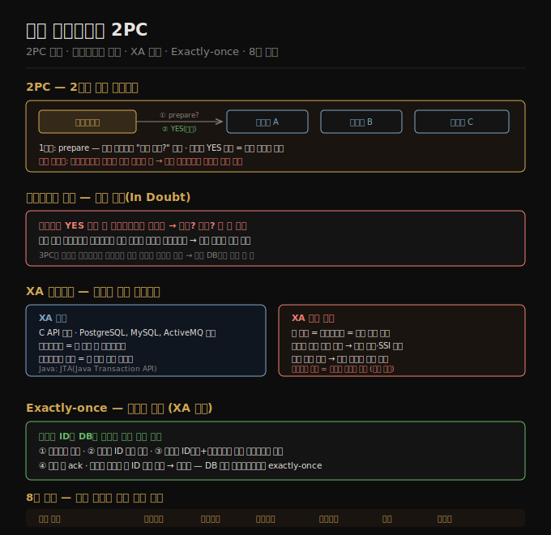

# 08-04. 분산 트랜잭션과 2PC
> 여러 노드에 걸친 트랜잭션은 단일 노드의 원자성 보장과 다른 도전을 안고 있습니다. 2PC(2단계 커밋)는 이 문제의 고전적 해법이지만, 코디네이터 장애 시 트랜잭션이 무기한 블록되는 심각한 한계가 있습니다. 내부 분산 트랜잭션(NewSQL)은 이 문제를 합의 알고리즘으로 해결합니다.

단일 노드 트랜잭션에서 원자성은 WAL(write-ahead log)이 보장합니다. 커밋 레코드가 디스크에 쓰이는 그 순간이 "점 of no return"입니다. 그런데 트랜잭션이 여러 노드에 걸쳐 있으면 어느 노드는 커밋, 어느 노드는 중단될 수 있습니다. 그 결과 노드 간 불일치가 영구화됩니다.

이 노트는 분산 원자 커밋 문제와 2PC 프로토콜, XA 트랜잭션의 한계, 그리고 멱등성 기반 정확히-한-번(exactly-once) 처리를 다룹니다. 8장 전체 종합도 이 편에서 마무리합니다.

## 1. 분산 트랜잭션의 원자 커밋 문제
> 여러 노드에 분산된 트랜잭션이 일부는 커밋하고 일부는 중단하면 시스템은 영구적으로 불일치 상태가 됩니다.

한 노드에서 커밋 레코드가 디스크에 쓰인 순간, 그 트랜잭션은 되돌릴 수 없이 커밋됩니다. 커밋된 데이터는 read committed 이상의 격리 수준에서 다른 트랜잭션에게 보이기 시작합니다. 만약 두 번째 노드가 나중에 그 트랜잭션을 중단하면, 첫 번째 노드에서 커밋된 데이터를 이미 읽은 트랜잭션도 소급해서 롤백해야 하는 문제가 생깁니다.

따라서 분산 트랜잭션에서는 모든 노드가 함께 커밋하거나 함께 중단해야 합니다. 이것이 원자 커밋 문제(atomic commitment problem)입니다.

## 2. 2PC — 2단계 커밋 프로토콜
> 2PC는 코디네이터를 두어 모든 참여자가 준비 완료를 확인한 뒤에만 커밋을 지시합니다.

2PC는 코디네이터(coordinator)와 참여자(participants) 구조입니다. 코디네이터는 보통 트랜잭션을 시작한 애플리케이션 프로세스 안에 라이브러리로 내장됩니다.

**1단계 — 준비(prepare)**: 코디네이터가 모든 참여자에게 "커밋할 수 있는가?"를 묻습니다. 참여자는 이 시점에 모든 데이터를 디스크에 쓰고, 제약 위반 등을 확인합니다. "예"라고 답하면 코디네이터가 어떤 결정을 내리든 반드시 커밋할 것을 약속합니다.

**2단계 — 커밋/중단(commit/abort)**: 모든 참여자가 "예"를 보내면 코디네이터는 커밋 결정을 자신의 트랜잭션 로그에 씁니다(커밋 포인트). 이후 모든 참여자에게 커밋을 지시합니다. 하나라도 "아니오"를 보내면 전체를 중단시킵니다.

**두 가지 돌아올 수 없는 지점**: 참여자가 "예"라고 답하는 순간(커밋 능력 약속)과, 코디네이터가 결정을 로그에 기록하는 순간(커밋 포인트)입니다. 이 두 지점이 2PC 원자성의 핵심입니다.

**코디네이터 장애**: 참여자가 "예"를 보낸 뒤 코디네이터가 죽으면, 참여자는 커밋해야 할지 중단해야 할지 알 수 없습니다. 이 상태를 의심 상태(in doubt)라고 합니다. 코디네이터가 복구될 때까지 해당 트랜잭션의 잠금이 유지됩니다. 잠금이 수십 분, 심하면 무기한 유지될 수 있습니다. 이것이 2PC가 블로킹 프로토콜인 이유입니다.

## 3. XA 트랜잭션과 이기종 분산 트랜잭션
> XA는 서로 다른 기술 간 2PC를 위한 표준 C API입니다. 여러 데이터베이스·메시지 브로커를 하나의 트랜잭션으로 묶을 수 있지만, 코디네이터 장애에 취약합니다.

XA(eXtended Architecture)는 1991년에 표준화된 이기종 분산 트랜잭션 프로토콜입니다. PostgreSQL, MySQL, Oracle, SQL Server와 ActiveMQ, IBM MQ 등 메시지 브로커가 지원합니다. Java에서는 JTA(Java Transaction API)로 노출됩니다.

XA의 코디네이터는 애플리케이션 서버 내 라이브러리로 구현됩니다. 코디네이터의 로그는 애플리케이션 서버 로컬 디스크에 저장됩니다. 따라서 애플리케이션 서버가 죽으면 코디네이터도 함께 죽고, 의심 상태 트랜잭션이 발생합니다.

**XA의 근본적 문제**:
- 코디네이터가 단일 장애 지점입니다. 코디네이터가 고가용성으로 복제되더라도, 애플리케이션 코드 자체가 단일 장애 지점으로 남습니다.
- 코디네이터와 참여자 간 직접 통신이 불가합니다. 모든 통신이 애플리케이션 코드를 경유해야 합니다.
- 이기종 시스템 간 최소 공통 분모 프로토콜이므로 교착 감지나 SSI 같은 고급 기능을 지원하지 못합니다.
- 의심 상태 트랜잭션의 잠금이 전체 시스템을 멈출 수 있습니다. 수동으로 관리자가 해결해야 할 수도 있습니다.

**휴리스틱 결정(heuristic decisions)**: 코디네이터와 연락이 끊긴 상태에서 참여자가 스스로 커밋 또는 중단을 결정하는 비상 탈출구입니다. "원자성을 아마도 깨는" 것을 의미하므로 재앙적 상황에서만 씁니다.

## 4. 내부 분산 트랜잭션 (NewSQL)
> 같은 소프트웨어를 실행하는 노드 사이의 분산 트랜잭션은 XA 한계를 피하고 합의 알고리즘으로 안전하게 구현됩니다.

CockroachDB, TiDB, Spanner, FoundationDB, YugabyteDB 같은 NewSQL 시스템은 이기종 기술과 인터페이스할 필요가 없습니다. 이 덕분에 XA의 최소 공통 분모 함정을 피하고 더 나은 프로토콜을 씁니다.

XA 문제를 고치는 방법:
- 코디네이터를 합의 알고리즘으로 복제해 자동 장애 조치
- 코디네이터와 데이터 샤드 간 애플리케이션 코드 없이 직접 통신
- 참여자 샤드도 복제해 단일 샤드 결함으로 인한 중단 위험 감소
- 원자 커밋 프로토콜과 분산 동시성 제어 프로토콜(교착 감지, 일관된 읽기)을 결합

Kafka도 내부 분산 트랜잭션을 지원합니다. 스트림 처리에서 정확히-한-번(exactly-once) 시맨틱스를 제공합니다.

## 5. 정확히-한-번 처리와 멱등성
> 분산 트랜잭션 없이도 메시지 ID를 DB에 기록하는 패턴으로 정확히-한-번 처리를 달성할 수 있습니다.

메시지 브로커와 데이터베이스를 XA로 묶지 않고도 exactly-once를 구현하는 방법:

1. 메시지마다 고유 ID를 부여합니다.
2. 메시지 처리를 시작할 때 DB 트랜잭션을 열고, 메시지 ID가 이미 처리 테이블에 있는지 확인합니다.
3. 없다면 ID를 테이블에 삽입하고, 처리 결과를 같은 트랜잭션에 씁니다.
4. 트랜잭션 커밋 후 메시지 브로커에 확인(ack)을 보냅니다.

크래시 후 재시도:
- 커밋 전 크래시: 트랜잭션이 중단됩니다. 브로커가 메시지를 다시 보냅니다. 재시도 시 메시지 ID가 없으므로 정상 처리합니다.
- 커밋 후 ack 전 크래시: 브로커가 다시 보냅니다. 재시도 시 메시지 ID가 이미 있으므로 중복 처리를 건너뜁니다.

이 패턴은 DB 내부 트랜잭션만으로 exactly-once를 달성합니다. 메시지 처리를 멱등(idempotent)하게 만들어 안전하게 재시도할 수 있습니다. Kafka Streams가 이 접근법을 씁니다.

## 6. 8장 종합 — 트랜잭션의 보장과 한계
> 트랜잭션은 에러 처리를 단순화하지만 성능·가용성 비용을 요구합니다. 어떤 격리 수준이 어떤 버그를 막는지 알고 선택해야 합니다.

**8장이 다룬 이상 현상**:

| 이상 현상 | 설명 | 방지 격리 수준 |
|-----------|------|--------------|
| 더티 읽기 | 미커밋 데이터 읽기 | Read committed 이상 |
| 더티 쓰기 | 미커밋 데이터 덮어쓰기 | Read committed 이상 |
| 읽기 스큐 | 트랜잭션 중 다른 시점 읽기 | 스냅샷 격리 이상 |
| 갱신 손실 | 읽기-수정-쓰기 사이클 충돌 | 스냅샷 격리(DB 따라) 또는 직렬화 |
| 쓰기 스큐 | 전제 조건 기반 충돌 | 직렬화만 |
| 팬텀 | 없는 행에 대한 쓰기 스큐 | 직렬화만 |

**직렬화 세 방법 요약**:
- **직렬 실행**: 단순하지만 단일 CPU 코어에 제한. 메모리 상주 + 저장 프로시저 필요.
- **2PL**: 강력하지만 잠금 경합으로 느리고 데드락 잦음.
- **SSI**: 낙관적 접근으로 경합 낮을 때 빠름. PostgreSQL·CockroachDB·FoundationDB.

**분산 원자 커밋**:
- 2PC는 블로킹 프로토콜—코디네이터 장애 시 의심 상태 트랜잭션이 잠금을 유지하며 시스템을 멈춥니다.
- XA는 이기종 기술 통합에 쓰이지만 취약합니다. 멱등성 패턴으로 대체하는 것이 나을 때가 많습니다.
- NewSQL 내부 분산 트랜잭션은 합의 알고리즘으로 XA 한계를 극복합니다.

9장에서는 분산 시스템에서 발생하는 더 근본적인 문제—시계, 프로세스 일시 정지, 네트워크 비신뢰성—를 다룹니다.

## 자주 받는 오해
1. **"2PC를 쓰면 분산 트랜잭션이 안전하다"** — 2PC는 코디네이터 장애 시 의심 상태 트랜잭션이 발생해 잠금을 무기한 유지합니다. XA 구현에서는 코디네이터 로그 손실 시 수동 복구가 필요합니다. 2PC는 이기종 시스템 통합에서 최악의 경우 전체 시스템을 멈출 수 있는 위험을 가집니다.
2. **"exactly-once 처리는 분산 트랜잭션 없이는 불가능하다"** — 메시지 ID를 DB에 기록하는 멱등성 패턴으로 DB 내부 트랜잭션만으로 exactly-once를 달성할 수 있습니다. 메시지 브로커와 DB 사이의 XA가 없어도 됩니다. Kafka Streams가 이 방식을 씁니다.
3. **"분산 트랜잭션은 성능이 나쁘니 쓰지 말아야 한다"** — 이기종 XA 트랜잭션은 성능이 나쁘고 문제가 많습니다. 그러나 같은 DB 소프트웨어를 쓰는 노드 간 내부 분산 트랜잭션(CockroachDB·Spanner·TiDB)은 합의 알고리즘을 최적화해 실용적인 성능을 냅니다. "분산 트랜잭션 = 느림"이라는 일반화는 XA 한정 이야기입니다.

## 면접에서 받을 만한 질문
1. **"2PC의 동작 원리와 한계를 설명해 주세요."** — 코디네이터가 모든 참여자에게 준비 가능 여부를 묻고(1단계), 전원이 동의하면 커밋을 지시합니다(2단계). 코디네이터가 커밋 포인트(결정을 로그에 쓰는 순간)를 넘긴 뒤 죽으면, 참여자들은 의심 상태에 빠져 코디네이터가 복구될 때까지 잠금을 유지합니다. 이 블로킹 특성이 2PC의 핵심 한계입니다.
2. **"XA 트랜잭션의 문제점은 무엇인가요?"** — 코디네이터가 애플리케이션 라이브러리이므로 애플리케이션 서버가 단일 장애 지점입니다. 코디네이터 로그가 로컬 디스크에 있어 서버 장애 시 의심 상태 트랜잭션이 잠금을 유지합니다. 이기종 최소 공통 분모 프로토콜이라 교착 감지나 SSI 같은 고급 기능을 지원하지 못합니다.
3. **"분산 환경에서 exactly-once 메시지 처리를 어떻게 구현하나요?"** — 메시지마다 고유 ID를 DB에 기록합니다. 처리 시작 시 ID 존재 여부를 확인하고, 없으면 ID 삽입과 처리 결과를 같은 트랜잭션에 씁니다. 커밋 후 ack를 보냅니다. 재시도 시 ID가 이미 있으면 건너뜁니다. DB 내부 트랜잭션만으로 충분하며 XA가 필요 없습니다.

## 관련 문서
- [08-03. Write Skew와 직렬화 가능성](08-03.Write%20Skew와%20직렬화%20가능성.md) — 직렬화 격리의 세 구현 방법
- [08-01. ACID와 트랜잭션 개요](08-01.ACID와%20트랜잭션%20개요.md) — 트랜잭션이 해결하는 문제와 ACID 속성
