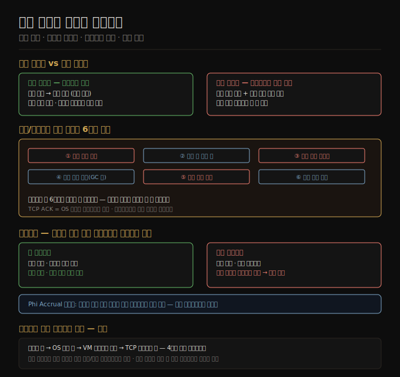

# 09-01. 부분 실패와 비신뢰 네트워크
> 분산 시스템의 근본적 특수성은 부분 실패입니다. 단일 컴퓨터는 전부 동작하거나 전부 멈추지만, 분산 시스템은 일부만 고장난 채로 계속 실행됩니다. 이 비결정론을 직시하는 것이 9장의 출발점입니다.

단일 컴퓨터 위에서 프로그램을 작성할 때 하드웨어는 수학적 완벽함을 흉내 냅니다. CPU 명령은 항상 같은 결과를 냅니다. 디스크에 쓴 데이터는 그대로 남습니다. 잘못되면 커널 패닉이나 블루스크린처럼 전체가 완전히 멈춥니다. 부분적으로만 망가진 상태는 설계 목표가 아닙니다.

분산 시스템은 반대입니다. 일부 노드가 고장나도 나머지는 계속 실행됩니다. 네트워크 패킷은 지연되거나 유실됩니다. 이 *부분 실패(partial failure)*는 비결정론적으로 발생합니다. 어떤 요청이 성공했는지조차 확신할 수 없습니다. 이 불확실성을 애플리케이션이 어떻게 다루느냐가 분산 시스템 신뢰성의 핵심입니다.

이 노트는 비신뢰 네트워크의 동작 방식, 타임아웃 한계, 실제 장애 탐지 패턴을 다룹니다.

## 1. 단일 컴퓨터 vs 분산 시스템의 근본 차이
> 단일 노드는 결정론적 장애로 설계됩니다. 분산 시스템은 비결정론적 부분 실패를 받아들여야 합니다.

단일 컴퓨터가 결정론적으로 작동하는 것은 설계 선택입니다. 내부 결함이 생기면 잘못된 결과를 내는 대신 완전히 멈추도록 만들었습니다. 잘못된 결과는 발견하기 어렵고 혼란스럽지만, 멈춤은 즉시 보입니다. 그래서 CPU는 물리적 실리콘의 지저분한 현실 위에 이상화된 추상 계층을 얹어, 소프트웨어가 수학적 완벽함에 기댈 수 있게 합니다.

분산 시스템에서는 이 이상화가 깨집니다. 두 노드가 네트워크로 연결되면, 그 순간부터 패킷 손실·지연·노드 크래시·프로세스 중단·클럭 오차 같은 현실의 물리적 불완전함이 소프트웨어로 직접 흘러 들어옵니다.

핵심 차이는 *부분 실패(partial failure)*입니다. 시스템 일부는 멀쩡히 동작하는데 다른 일부는 예측 불가능한 방식으로 망가진 상태가 공존합니다. 그리고 이것이 비결정론적입니다. 같은 요청을 반복해도 어떤 경우엔 성공하고 어떤 경우엔 실패합니다. 이 비결정론이 분산 시스템을 어렵게 만드는 본질입니다.

부분 실패를 다룰 수 있으면 강력한 가능성이 열립니다. 롤링 업그레이드처럼 한 번에 한 노드씩 재시작하면서 전체 서비스는 계속 제공하는 일이 가능해집니다. 이는 단일 노드로는 할 수 없는 일입니다.

## 2. 비신뢰 네트워크와 비동기 패킷망
> 인터넷과 데이터센터 네트워크는 비동기 패킷망입니다. 패킷은 언제 도착할지, 도착하기는 할지 보장이 없습니다.

분산 시스템이 사용하는 shared-nothing 아키텍처에서 노드 간 통신 수단은 네트워크뿐입니다. 이더넷으로 연결된 데이터센터 내부망이든 인터넷이든, 모두 *비동기 패킷망*입니다.

요청을 보내고 응답을 기다릴 때 무엇이든 잘못될 수 있습니다.

- 요청 패킷이 유실될 수 있습니다(케이블 뽑힘 등).
- 요청이 큐에 대기 중일 수 있습니다(네트워크 또는 수신자 과부하).
- 원격 노드가 크래시했을 수 있습니다.
- 원격 노드가 일시 중단 상태(GC 포즈 등)일 수 있습니다.
- 원격 노드가 요청을 처리했지만 응답 패킷이 유실됐을 수 있습니다.
- 원격 노드가 응답을 보냈지만 네트워크나 내 머신이 과부하라 아직 미도착일 수 있습니다.

이 여섯 가지 경우를 *송신자는 구분할 수 없습니다*. 응답이 없다는 사실만 알 수 있을 뿐, 왜 없는지는 알 수 없습니다.

일반적인 대처는 타임아웃입니다. 일정 시간 내에 응답이 없으면 포기하고 노드가 죽었다고 가정합니다. 하지만 타임아웃이 만료돼도 요청이 처리됐는지 여부는 여전히 알 수 없습니다. 요청이 큐에 남아 뒤늦게 수신자에게 도달할 수도 있습니다.

**TCP의 한계**: TCP는 재전송·순서 재조립·체크섬 등으로 신뢰성을 제공하지만 이것은 단일 연결 내 보장입니다. 원격 OS가 패킷을 수신했다는 ACK는 *커널이 받았다*는 의미일 뿐, 애플리케이션이 처리했다는 의미가 아닙니다. 연결이 에러로 닫혔을 때 원격 노드가 데이터를 얼마나 처리했는지는 알 수 없습니다. 요청 성공을 보장하려면 애플리케이션 레벨의 긍정 응답이 필요합니다.

## 3. 실제 네트워크 장애 사례와 교훈
> 네트워크 장애는 통제된 데이터센터에서도 월 평균 수십 건 발생합니다. 소프트웨어는 이를 다룰 수 있어야 합니다.

다양한 연구가 네트워크 장애의 빈도를 측정했습니다. 중간 규모 데이터센터에서 월 약 12건의 네트워크 장애가 관측됐으며, 절반은 단일 머신을 끊었고 절반은 랙 전체를 끊었습니다. 중복 네트워크 장비를 추가해도 장애가 극적으로 줄어들지 않았습니다. 인간 오류(스위치 설정 실수)가 주요 원인이기 때문입니다.

광역 링크는 소·비버·상어가 끊기도 하고 인간이 파거나 절단하기도 합니다. 클라우드 리전 간 패킷 지연은 높은 백분위수에서 수 분에 달한 사례도 있습니다. 단일 데이터센터 내에서도 스위치 업그레이드 중 1분 이상의 패킷 지연이 관측됩니다.

중요한 교훈은 두 가지입니다. 첫째, 장애는 드물지 않습니다. 대규모 시스템에서 100만분의 1 확률의 사건은 매일 일어납니다. 둘째, 오류 처리가 정의되고 테스트되지 않으면 임의로 나쁜 일이 생깁니다. 클러스터가 교착 상태에 빠지거나 데이터를 삭제할 수 있습니다. 네트워크 장애를 *허용*할 의무는 없지만, 소프트웨어가 어떻게 반응하는지 *알아야* 하고, 장애 후 복구 가능해야 합니다.

## 4. 장애 탐지와 타임아웃의 한계
> 타임아웃은 장애 탐지의 유일한 수단이지만, 적절한 값은 존재하지 않습니다.

많은 시스템이 고장 노드를 자동으로 탐지해야 합니다. 로드밸런서는 죽은 노드에 요청을 보내지 말아야 하고, 단일 리더 복제에서 리더가 죽으면 팔로워가 승격해야 합니다.

특정 조건에서 즉각적인 피드백을 얻을 수 있습니다. 머신은 살아있지만 프로세스가 크래시했다면 OS가 RST/FIN 패킷으로 TCP 연결을 닫아줍니다. 일부 시스템은 크래시 직후 다른 노드에 알림 스크립트를 실행합니다(HBase 등). 데이터센터 스위치의 관리 인터페이스에 접근 가능하면 하드웨어 수준 링크 장애를 감지할 수 있습니다. 라우터가 목적지에 도달 불가임을 알면 ICMP Destination Unreachable을 반환합니다.

하지만 일반적으로는 응답이 없다는 것 외에 아무것도 모릅니다. 타임아웃 후 노드를 죽었다고 선언하는 것이 최선입니다.

타임아웃 길이는 트레이드오프입니다. 긴 타임아웃은 장애 탐지가 느리고 그동안 사용자가 기다립니다. 짧은 타임아웃은 빠르게 탐지하지만 일시적 부하 급증을 죽음으로 오탐할 위험이 있습니다.

노드를 죽었다고 잘못 선언하면 그 책임이 다른 노드로 이전돼 추가 부하가 생깁니다. 이미 과부하 상태에서 노드를 잘못 죽었다고 선언하면 연쇄 장애가 발생할 수 있습니다. 극단적으로는 모든 노드가 서로를 죽었다고 선언하고 전체가 멈출 수 있습니다.

이상적인 타임아웃은 `2d + r`(최대 왕복 지연 + 최대 처리 시간)이지만, 비동기 네트워크에는 이런 상한이 존재하지 않습니다. 타임아웃은 실험적으로 결정해야 하며, Phi Accrual 실패 탐지기처럼 관측된 응답 시간 분포에 따라 동적으로 조정하는 방법이 더 낫습니다.

## 5. 네트워크 지연의 원인 — 큐잉과 혼잡
> 네트워크 지연의 변동성은 주로 큐잉에서 옵니다. 시스템이 최대 용량에 가까울수록 큐가 길어지고 변동성이 커집니다.

패킷 지연이 변동하는 이유는 여러 계층의 큐잉입니다. 여러 노드가 동시에 같은 목적지로 패킷을 보내면 스위치가 순서대로 큐에 넣어 처리합니다. 큐가 가득 차면 패킷이 드롭됩니다. 목적지 머신의 모든 CPU 코어가 바쁘면 OS가 들어온 요청을 큐에 넣습니다. 가상화 환경에서는 다른 VM이 CPU를 쓰는 동안 수십 밀리초씩 멈춥니다. TCP는 혼잡 제어를 위해 전송 전에 송신자 측에서도 큐잉합니다.

여유 용량이 충분한 시스템은 큐를 즉시 비우므로 지연이 낮고 안정적입니다. 반면 최대 용량에 근접한 시스템은 큐가 빠르게 쌓이고 지연이 급격히 증가합니다.

퍼블릭 클라우드와 멀티테넌트 데이터센터에서는 네트워크 링크·스위치·네트워크 인터페이스·CPU까지 여러 고객이 공유합니다. 인접 고객(noisy neighbor)이 대용량 데이터를 전송하면 내 패킷 지연이 급증합니다. 이 환경에서 타임아웃은 확장된 기간과 많은 머신을 대상으로 라운드트립 시간 분포를 측정해 결정해야 합니다.

**동기 vs 비동기 네트워크**: 전화망은 회선 교환(circuit switching) 방식입니다. 통화마다 고정 대역폭이 예약되므로 큐잉 지연이 없고 종단 간 최대 지연이 보장됩니다. 데이터센터와 인터넷은 패킷 교환(packet switching)입니다. 이더넷과 IP는 대역폭을 동적으로 공유하므로 높은 활용률을 달성하지만 큐잉과 무한 지연이 생깁니다. 지연 변동성은 자연 법칙이 아니라 비용/편익 트레이드오프의 결과입니다. 전용 하드웨어와 정적 대역폭 할당을 쓰면 지연을 보장할 수 있지만, 하드웨어 활용률이 낮아져 비용이 높아집니다.

## 자주 받는 오해

1. **"TCP를 쓰면 네트워크 신뢰성은 걱정 안 해도 된다"** — TCP는 단일 연결 내에서 패킷 재전송·순서·중복 제거를 처리하지만, 연결 자체가 끊기거나 노드가 죽는 상황에는 무력합니다. 요청 성공은 애플리케이션 레벨 응답으로만 확인할 수 있습니다.

2. **"타임아웃을 짧게 설정하면 장애를 빠르게 복구한다"** — 짧은 타임아웃은 일시적 부하 급증을 장애로 오탐해 오히려 연쇄 장애를 유발할 수 있습니다. 타임아웃은 실측 지연 분포를 기반으로 조정해야 합니다.

3. **"우리 데이터센터 네트워크는 신뢰할 수 있다"** — 연구 결과 통제된 단일 기업 데이터센터에서도 월 수십 건의 네트워크 장애가 관측됩니다. 인간 오류(설정 실수)가 주요 원인이므로 중복 장비만으로는 충분하지 않습니다.

## 면접에서 받을 만한 질문

1. **"분산 시스템에서 부분 실패란 무엇이며, 단일 컴퓨터 장애와 어떻게 다른가?"** — 부분 실패란 시스템 일부는 정상 동작하고 다른 일부는 고장난 상태가 동시에 공존하는 것입니다. 단일 컴퓨터는 결함이 생기면 전체가 멈추도록 설계돼 있어 결과가 이분법적이지만, 분산 시스템에서는 어떤 노드는 살아 있고 어떤 노드는 응답하지 않으며 어떤 요청은 처리됐는지조차 알 수 없습니다. 이 비결정론이 분산 시스템을 본질적으로 다루기 어렵게 만듭니다.

2. **"네트워크 타임아웃 값을 어떻게 결정하는가?"** — 비동기 네트워크에는 이론적 상한이 없으므로 완벽한 타임아웃 값은 존재하지 않습니다. 실제로는 장시간 다수 머신을 대상으로 라운드트립 시간 분포를 측정하고, 허용 가능한 오탐율과 탐지 지연 사이의 트레이드오프를 고려해 결정합니다. Phi Accrual 탐지기처럼 관측 분포에 따라 동적으로 조정하는 방법이 고정 타임아웃보다 낫습니다.

3. **"요청을 재시도해도 안전한가?"** — 타임아웃이 만료됐을 때 요청이 처리됐는지 여부를 알 수 없으므로 재시도는 중복 처리 위험이 있습니다. 안전한 재시도를 위해서는 연산의 멱등성(idempotency)을 보장하거나, 유니크 요청 ID를 사용해 서버가 중복을 감지하고 무시하도록 해야 합니다.

## 관련 문서
- [09-02. 불신뢰 시계](09-02.불신뢰%20시계.md) — 네트워크와 함께 분산 시스템을 어렵게 만드는 또 다른 축: 시계 오차와 물리적 시간의 신뢰 불가 문제
- [09-03. 진실·거짓·시스템 모델](09-03.진실·거짓·시스템%20모델.md) — 부분 실패 환경에서 노드가 알 수 있는 것과 알 수 없는 것, 쿼럼과 펜싱
- [08-04. 분산 트랜잭션과 2PC](08-04.분산%20트랜잭션과%202PC.md) — 네트워크 비신뢰성이 분산 트랜잭션 설계에 미치는 영향
