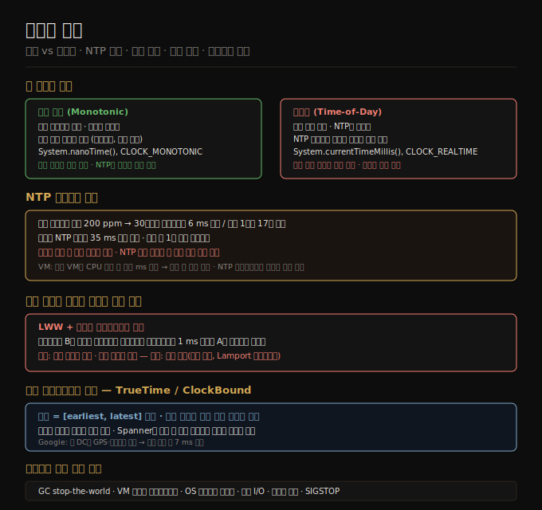

# 09-02. 불신뢰 시계
> 분산 시스템에서 시계는 두 가지 문제를 일으킵니다. 각 노드의 시계가 서로 다르게 흐르고, 시계가 이따금 앞뒤로 뜁니다. "지금 몇 시인가"라는 단순한 질문에 분산 시스템은 정직하게 답할 수 없습니다.

애플리케이션은 시간에 의존합니다. 타임아웃 만료 여부, 서비스 응답 시간 백분위수, 캐시 만료 시각, 이벤트 순서 판단까지 모두 시계 읽기에 기댑니다. 단일 컴퓨터에서는 이것이 자명하지만, 분산 시스템에서는 근본적으로 다릅니다. 메시지가 네트워크를 가로지르는 데 걸리는 시간이 가변적이고, 각 머신은 자신만의 쿼츠 발진기를 가집니다.

이 노트는 두 종류의 시계, NTP 동기화의 한계, 시계 의존 코드의 위험, 프로세스 일시 중단 문제를 다룹니다.

## 1. 두 종류의 시계 — 단조 시계와 벽시계
> 단조 시계는 경과 시간 측정에, 벽시계는 달력 시각 표현에 씁니다. 둘을 혼동하면 미묘한 버그가 생깁니다.

현대 컴퓨터에는 두 종류의 시계가 있습니다.

**벽시계(time-of-day clock)**는 직관적인 시각을 반환합니다. 리눅스의 `clock_gettime(CLOCK_REALTIME)`, 자바의 `System.currentTimeMillis()`가 이에 해당합니다. 1970년 1월 1일 UTC 자정을 기점으로 한 초·밀리초 단위 값입니다. NTP와 동기화됩니다. 문제는 NTP 서버보다 시계가 많이 앞서 있으면 강제로 뒤로 돌려지는 점입니다. 일광 절약 시간, 윤초도 불연속 점프를 만듭니다. 이 때문에 경과 시간 측정에는 적합하지 않습니다.

**단조 시계(monotonic clock)**는 항상 앞으로만 갑니다. 리눅스의 `clock_gettime(CLOCK_MONOTONIC)`, 자바의 `System.nanoTime()`이 이에 해당합니다. 절댓값은 의미 없습니다(부팅 후 나노초 수 등). 두 시점의 차이가 경과 시간입니다. 다른 컴퓨터와 비교할 수 없습니다. NTP는 단조 시계가 나아가는 속도(주파수)를 미세 조정(slewing)할 수 있지만 뒤로 돌리지는 않습니다. 타임아웃이나 응답 시간 측정에는 단조 시계가 올바른 선택입니다.

실수하기 쉬운 패턴은 이벤트 순서 결정에 벽시계 타임스탬프를 쓰는 경우입니다. 서로 다른 노드의 벽시계는 클럭 스큐(skew) 때문에 수 밀리초에서 수 초까지 차이 날 수 있습니다. 이 오차는 이벤트의 인과 순서를 뒤집기에 충분합니다.

## 2. NTP 동기화의 한계
> NTP는 최선의 동기화 도구이지만, 수 밀리초에서 수 초까지 오차가 남습니다. 정확도에 의존하는 설계는 위험합니다.

쿼츠 발진기의 드리프트는 온도에 따라 달라지며, Google은 서버당 최대 200 ppm(parts per million)을 가정합니다. 30초마다 NTP와 동기화해도 6 ms 드리프트가 쌓이고, 하루 한 번 동기화하면 17초 오차가 생깁니다.

NTP 동기화의 정확도는 네트워크 왕복 지연에 의해 제한됩니다. 인터넷 NTP 실험에서 최솟값 35 ms 오차가 측정됐고, 네트워크 혼잡 시 1초를 넘는 스파이크가 발생했습니다. NTP 클라이언트가 방화벽에 막혀 서버에 도달하지 못하면 오차가 조용히 누적됩니다. 일부 NTP 서버 자체가 수 시간씩 틀린 시각을 보고한 사례도 있습니다.

윤초는 분당 59초 또는 61초를 만들어 윤초를 고려하지 않은 시스템에서 대규모 장애를 일으킨 사례가 있습니다. 2035년 이후로는 더 이상 윤초를 사용하지 않기로 결정돼 이 문제는 사라질 예정입니다.

가상 환경에서 시계는 더 불안정합니다. VM이 다른 VM에 CPU를 양보하며 수십 밀리초 정지하면, 재개 시 시계가 갑자기 앞으로 뜁니다. VM 안의 NTP 클라이언트는 이 정지를 인지하지 못해 부정확한 정확도를 보고합니다.

고정밀이 필요하다면 GPS 수신기와 원자시계를 각 데이터센터에 배치하고 PTP(Precision Time Protocol)를 운용하면 수 마이크로초 정확도를 얻을 수 있습니다. 금융 규제(MiFID II)는 고빈도 매매 시스템에 UTC 기준 100 마이크로초 이내 동기화를 요구합니다.

## 3. 시계 의존의 위험 — 이벤트 순서
> 벽시계 타임스탬프로 이벤트 순서를 결정하면 클럭 스큐로 인해 인과 관계를 위반합니다.

다중 리더 복제 환경에서 LWW(last write wins) 충돌 해소를 벽시계 타임스탬프로 구현하면 문제가 생깁니다. 클라이언트 A가 노드 1에 x=1을 씁니다. 이것이 노드 3으로 복제됩니다. 클라이언트 B가 노드 3에서 x=2로 증분합니다. 두 쓰기가 노드 2에 복제됩니다. B의 쓰기는 인과적으로 나중이지만, 노드 간 클럭 스큐가 3 ms 이하인 경우에도 B의 타임스탬프가 A보다 1 ms 작을 수 있습니다. LWW는 x=1을 최신으로 선택하고 x=2를 버립니다. 증분이 조용히 유실됩니다.

이 문제의 위험성은 "조용한 데이터 유실"입니다. 오류 메시지 없이 쓰기가 사라집니다. Cassandra와 ScyllaDB가 이 방식을 사용하며, Jepsen 분석을 통해 실제로 데이터 유실이 관측된 바 있습니다.

NTP를 아무리 정밀하게 맞춰도 근본 해결이 안 됩니다. NTP 정확도 자체가 네트워크 왕복 지연에 의해 제한되기 때문입니다. 논리 시계(logical clocks)가 올바른 해법입니다. 쿼츠 발진기가 아닌 단조 증가 카운터를 기반으로 이벤트의 상대적 순서만 추적합니다. 자세한 내용은 10장(합의)에서 다룹니다.

## 4. 신뢰 구간으로서의 시계 읽기
> 시계는 점이 아닌 구간입니다. 현재 시각은 "10.3~10.5초 사이 어딘가"로 표현해야 정직합니다.

마이크로초 해상도로 시계를 읽을 수 있어도 그 값의 정확도가 마이크로초라는 의미는 아닙니다. 드리프트만으로도 수 밀리초 오차가 생깁니다. 인터넷 NTP를 쓰면 수십 밀리초가 최선이고, 혼잡 시 100 ms를 훌쩍 넘습니다. 타임스탬프의 마이크로초 자리는 사실상 무의미합니다.

Google Spanner의 TrueTime API와 Amazon의 ClockBound는 신뢰 구간을 명시적으로 반환합니다. 현재 시각을 `[earliest, latest]` 구간으로 표현해, 실제 시각이 이 구간 안에 있음을 보장합니다. 구간 너비는 마지막 시계 동기화 이후 경과 시간에 따라 달라집니다. 두 구간 A와 B가 겹치지 않으면 선후 관계가 확실합니다. 겹치면 어느 쪽이 먼저인지 알 수 없습니다.

Spanner는 이 구간을 이용해 글로벌 스냅샷 격리를 구현합니다. 읽기/쓰기 트랜잭션 커밋 전에 신뢰 구간 길이만큼 의도적으로 대기합니다. 이렇게 하면 이후 트랜잭션의 구간이 겹치지 않음이 보장되므로 타임스탬프가 인과성을 반영합니다. 대기 시간을 짧게 유지하기 위해 Google은 각 데이터센터에 GPS 수신기 또는 원자시계를 배치해 구간 너비를 약 7 ms로 유지합니다.

## 5. 프로세스 일시 중단
> 스레드는 코드 어느 지점에서든 수십 초씩 멈출 수 있습니다. 분산 시스템 노드는 자신이 얼마나 멈췄는지 알 수 없습니다.

리스(lease)로 리더십을 구현하는 코드를 생각합니다. 리스 만료 시각과 현재 시각을 비교해 처리를 계속할지 결정합니다. 시각 확인과 실제 처리 사이에 15초 멈춤이 생기면 리스는 이미 만료됐고 다른 노드가 리더가 됐지만, 이 코드는 여전히 자신이 리더라고 믿고 쓰기를 수행합니다.

이 멈춤의 원인은 다양합니다.

- JVM 같은 런타임의 GC "stop-the-world" 포즈. 과거에는 수 분에 달했고 현대 GC 알고리즘 이후에도 수십 밀리초가 발생합니다.
- VM 일시 중단. 라이브 마이그레이션 시 VM 전체가 수십 초에서 수 분 멈춥니다.
- OS 컨텍스트 스위치와 스케줄링 지연. 특히 CPU 스틸 타임(다른 VM이 코어를 사용하는 시간)이 있는 가상 환경에서 심합니다.
- 동기 디스크 I/O, 네트워크 파일시스템, EBS 같은 원격 블록 디바이스 대기.
- 페이지 폴트와 스왑. 메모리 압박 시 스레드가 디스크 I/O를 기다립니다.
- SIGSTOP 신호. 운영자가 실수로 프로세스를 일시 정지시킬 수 있습니다.

멀티스레드 코드에서는 뮤텍스, 세마포어, 원자 카운터로 타이밍 문제를 다룹니다. 분산 시스템에는 공유 메모리가 없으므로 이 도구가 작동하지 않습니다. 노드는 언제든 임의 지점에서 오랫동안 멈출 수 있고 자신이 얼마나 멈췄는지 알 수 없다는 전제 아래 설계해야 합니다.

리얼타임 시스템(RTOS)은 이 문제를 소프트웨어 스택 전체를 재설계해 해결합니다. GC 포즈 없이, 동적 메모리 할당을 제한하고, 라이브러리의 최악 실행 시간을 명시하고, CPU 시간을 지정된 인터벌로 보장하는 스케줄러를 씁니다. 구축 비용이 높아 대부분의 서버 시스템에는 경제적이지 않습니다.

GC 영향을 줄이는 실용적 방법도 있습니다. 짧게 생존하는 객체에만 GC를 쓰고 프로세스를 주기적으로 재시작하면 풀 GC를 피할 수 있습니다. 또는 런타임이 GC가 곧 필요하다고 알려주면 애플리케이션이 해당 노드로의 요청을 잠시 멈추고 GC가 끝나길 기다리는 방식으로 클라이언트에게 GC 포즈를 숨길 수 있습니다.

## 자주 받는 오해

1. **"단조 시계는 타임스탬프 비교에도 쓸 수 있다"** — 단조 시계의 절댓값은 의미가 없습니다. 다른 머신의 단조 시계 값과 비교하면 무의미한 숫자를 비교하는 것입니다. 단조 시계는 같은 머신에서 두 시점 *사이의 경과 시간* 측정에만 씁니다.

2. **"NTP로 동기화하면 클럭 스큐 문제가 해결된다"** — NTP는 클럭 스큐를 줄이지만 제거하지 못합니다. 최선의 경우에도 수 밀리초 오차가 남고, 네트워크 혼잡이나 방화벽 차단 시 수 초에서 수 분까지 벌어질 수 있습니다.

3. **"GC는 현대 JVM에서 문제가 아니다"** — G1·ZGC·Shenandoah 같은 현대 GC도 수 밀리초의 포즈가 발생합니다. 정밀한 리스 구현에서 수 밀리초는 리스 만료를 일으키기에 충분합니다.

## 면접에서 받을 만한 질문

1. **"분산 시스템에서 이벤트 순서를 어떻게 결정해야 하는가?"** — 벽시계 타임스탬프는 클럭 스큐로 인해 인과 순서를 보장하지 못합니다. 논리 시계(Lamport 타임스탬프, 벡터 시계)가 올바른 접근입니다. 논리 시계는 쿼츠 발진기 대신 단조 증가 카운터를 사용해 이벤트의 상대 순서만 추적하므로 클럭 동기화에 의존하지 않습니다.

2. **"Google Spanner가 분산 데이터베이스에서 스냅샷 격리를 어떻게 구현하는가?"** — Spanner는 TrueTime API로 시계 값을 신뢰 구간 `[earliest, latest]`으로 표현합니다. 두 구간이 겹치지 않으면 선후가 확실합니다. 트랜잭션 커밋 전에 구간 길이만큼 대기해 이후 트랜잭션의 구간이 겹치지 않음을 보장합니다. 각 데이터센터의 GPS·원자시계로 구간 너비를 약 7 ms로 유지해 대기 시간을 최소화합니다.

3. **"분산 리더 선출에서 리스(lease)의 위험은 무엇인가?"** — 리스를 보유한 노드가 GC 포즈, VM 일시 중단, 과부하 등으로 리스 만료 시간보다 길게 멈출 수 있습니다. 이 경우 다른 노드가 새 리더가 된 상태에서 원래 리더가 깨어나 여전히 자신이 리더라 믿고 쓰기를 수행하면 스플릿 브레인이 발생합니다. 펜싱 토큰(09-03 참조)으로 이 문제를 방어해야 합니다.

## 관련 문서
- [09-01. 부분 실패와 비신뢰 네트워크](09-01.부분%20실패와%20비신뢰%20네트워크.md) — 비동기 네트워크의 기본 성질과 타임아웃 문제
- [09-03. 진실·거짓·시스템 모델](09-03.진실·거짓·시스템%20모델.md) — 불확실한 환경에서 노드가 알 수 있는 것과 알 수 없는 것
- [09-04. 분산 시스템 검증](09-04.분산%20시스템%20검증과%209장%20종합.md) — 시스템 모델과 결정론적 시뮬레이션 테스트
