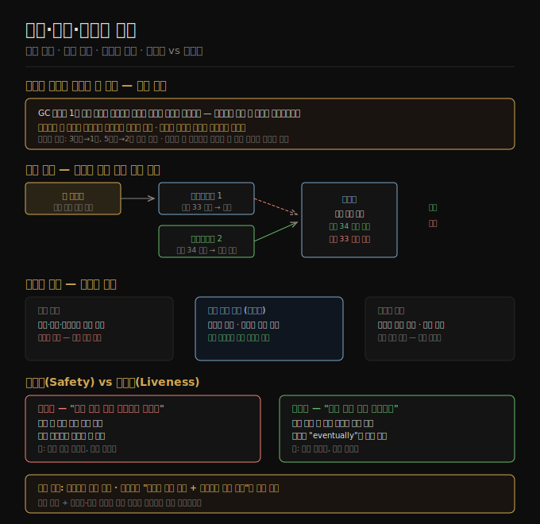

# 09-03. 진실·거짓·시스템 모델
> 분산 시스템에서 노드는 자신의 상황을 스스로 판단할 수 없습니다. 결정은 쿼럼이 내립니다. 그 결정을 어길 수 있는 "좀비" 노드를 막는 메커니즘이 펜싱 토큰입니다.

네트워크는 비신뢰적이고 시계는 부정확합니다. 이 환경에서 노드는 다른 노드의 상태를 메시지로만 알 수 있습니다. 메시지가 없다면 노드가 죽었는지, 응답이 지연됐는지, 네트워크가 끊겼는지 구분할 수 없습니다. 이 불확실성은 철학적 질문을 낳습니다. 분산 시스템에서 무엇을 진실로 알 수 있는가?

이 노트는 다수결 원칙, 분산 락과 리스의 위험, 펜싱 토큰, 비잔틴 장애, 시스템 모델과 안전성·활동성 속성을 다룹니다.

## 1. 노드는 자신을 신뢰할 수 없다 — 다수결 원칙
> 네트워크 단방향 장애나 긴 멈춤 후 재개된 노드는 자신이 리더라고 믿지만 나머지 세계는 그를 죽었다고 선언했을 수 있습니다.

비대칭 네트워크 장애를 상상합니다. 노드가 들어오는 메시지는 모두 받지만 나가는 메시지가 드롭됩니다. 이 노드는 완벽히 동작하며 요청을 받습니다. 하지만 다른 노드들은 응답을 받지 못해 타임아웃 후 이 노드를 죽었다고 선언합니다. 당사자는 기념식장으로 끌려가면서 "나 안 죽었어!"라고 소리치지만 아무도 듣지 못합니다.

또 다른 시나리오: 노드가 1분간 GC 포즈로 멈춥니다. 그동안 다른 노드들이 이 노드를 죽었다고 선언하고 새 리더를 선출합니다. 포즈가 끝나면 이 노드는 시간이 얼마나 지났는지 모르고 자신이 여전히 리더라 믿습니다.

핵심 교훈은 노드가 자신의 상황에 대한 자체 판단을 독립적으로 신뢰할 수 없다는 점입니다. 분산 시스템은 단일 노드에 의존할 수 없습니다. 대신 *쿼럼*(quorum), 즉 노드들의 투표로 결정합니다. 노드 다수결이 한 노드를 죽었다고 선언하면, 그 노드 자신이 살아 있다고 생각하더라도 그것이 죽었다는 진실입니다. 당사자 노드는 이 결정에 따라 스스로 물러나야 합니다.

쿼럼은 보통 과반수(절반 초과)입니다. 세 노드 중 하나, 다섯 노드 중 둘까지 장애를 허용합니다. 동시에 두 개의 과반수가 존재할 수 없으므로 상충하는 결정이 동시에 내려지는 스플릿 브레인을 방지합니다.

## 2. 분산 락과 리스의 함정 — 좀비 방지
> 리스 만료를 인지하지 못한 채 동작을 계속하는 노드("좀비")는 데이터를 오염시킵니다. 락 서비스만으로는 충분하지 않습니다.

리스(lease)는 타임아웃이 있는 락입니다. 리스를 보유한 노드만 특정 자원에 접근할 수 있습니다. 노드가 응답하지 않으면 리스가 만료되고 다른 노드가 획득합니다. 단일 리더 보장, 단일 처리 보장 등에 씁니다.

리스를 보유한 노드가 GC 포즈로 15초 멈춥니다. 그동안 리스가 만료되고 다른 노드가 리스를 획득해 파일을 씁니다. 첫 번째 노드가 깨어납니다. 여전히 리스가 유효하다고 믿습니다(리스 만료 전에 확인했으므로). 파일을 씁니다. 두 번째 노드도 파일을 씁니다. 파일이 오염됩니다. 이것이 *스플릿 브레인* 상황입니다.

좀비를 강제로 종료하는 접근(STONITH — 상대 노드의 전원을 끄는 방식)도 있지만 효과적이지 않습니다. 늦게 도달하는 네트워크 패킷(그림 9-5에서 보듯 패킷이 1분 지연될 수 있음)을 막지 못합니다. 모든 노드가 서로를 종료하는 상황이 생길 수 있습니다.

## 3. 펜싱 토큰
> 펜싱 토큰은 좀비 노드와 지연된 요청을 모두 방어하는 견고한 해법입니다. 저장소가 오래된 토큰 쓰기를 거부합니다.

락 서비스가 락이나 리스를 부여할 때 단조 증가하는 *펜싱 토큰(fencing token)*을 함께 반환합니다. 클라이언트는 저장소에 쓰기를 요청할 때 현재 펜싱 토큰을 포함합니다. 저장소는 이미 처리한 토큰보다 낮은 번호의 요청을 거부합니다.

예시: 클라이언트 1이 토큰 33으로 리스를 획득합니다. 길게 멈춥니다. 리스가 만료됩니다. 클라이언트 2가 토큰 34로 리스를 획득하고 쓰기를 완료합니다. 클라이언트 1이 깨어나 토큰 33으로 쓰기를 시도합니다. 저장소는 이미 34를 처리했으므로 33 요청을 거부합니다. 좀비가 차단됩니다.

펜싱 토큰은 지연된 네트워크 패킷도 방어합니다. 오래된 리스홀더가 보낸 쓰기 요청이 새 리스홀더의 쓰기 이후 뒤늦게 도달해도 저장소가 거부합니다.

ZooKeeper는 트랜잭션 ID `zxid`나 노드 버전 `cversion`을 펜싱 토큰으로 쓸 수 있습니다. etcd는 리비전 번호와 리스 ID를 씁니다. Hazelcast는 `FencedLock` API로 명시적인 펜싱 토큰을 제공합니다.

저장소가 조건부 쓰기(conditional write)를 지원한다면 락 서비스 없이도 같은 효과를 얻을 수 있습니다. Amazon S3 조건부 쓰기, Azure Blob 조건부 헤더, Google Cloud Storage 요청 전제조건이 이에 해당합니다. 오브젝트가 마지막으로 읽은 이후 다른 클라이언트가 쓰지 않은 경우에만 성공하는 CAS 연산과 유사합니다.

## 4. 비잔틴 장애
> 펜싱 토큰은 실수하는 노드를 막지만, 의도적으로 속이는 노드는 막지 못합니다. 비잔틴 내결함성은 훨씬 비쌉니다.

지금까지는 노드가 느리거나 응답하지 않을 수 있지만 *정직*하다고 가정했습니다. 응답한다면 알고 있는 진실을 말한다고 가정했습니다. 비잔틴 장애는 이 가정을 깨는 노드입니다. 임의의 잘못되거나 조작된 응답을 보내고, 같은 선거에서 모순된 투표를 할 수 있습니다.

우주·항공 환경에서는 방사선이 메모리 값을 오염시켜 비잔틴 거동을 유발합니다. 여러 참여자가 관여하는 시스템에서는 참여자가 프로토콜을 속여 이득을 얻으려 할 수 있습니다. 비트코인 같은 블록체인 합의 메커니즘은 서로를 신뢰하지 않는 주체들 사이에서 합의를 이루는 방법입니다.

대부분의 서버 데이터 시스템에서는 비잔틴 내결함성이 필요하지 않습니다. 데이터센터의 모든 노드는 같은 조직이 관리하며 방사선 수준이 낮습니다. 비잔틴 내결함성 프로토콜은 구현 비용이 높고 전형적으로 2/3 초과 정상 노드가 필요합니다. 구현 비용이 실질적인 위협을 넘습니다.

그러나 *약한 형태의 거짓말*에는 방어가 가능하고 유용합니다. 하드웨어 문제나 버그로 인한 패킷 오염은 TCP/UDP 체크섬이 잡지 못하는 경우도 있으므로 애플리케이션 수준 체크섬으로 보완합니다. 공개 인터넷에 노출된 서비스는 임의적이고 악의적인 클라이언트 입력을 예상해 입력 검증·이스케이프·출력 인코딩을 합니다. NTP 클라이언트는 여러 서버를 조회해 이상값을 제외하는 방식으로 잘못 설정된 NTP 서버 한 대를 걸러냅니다.

## 5. 시스템 모델과 안전성·활동성
> 알고리즘이 올바름을 주장하려면 가정을 시스템 모델로 형식화해야 합니다. 안전성과 활동성은 서로 다른 종류의 보장입니다.

**타이밍 모델** 세 가지가 주로 쓰입니다.

- *동기 모델*: 네트워크 지연·프로세스 포즈·클럭 오차 모두 상한이 있습니다. 현실을 과도하게 단순화합니다.
- *부분 동기 모델*: 대부분의 시간은 동기처럼 동작하지만 때때로 상한을 초과합니다. 대부분의 실제 시스템에 가장 가까운 모델입니다.
- *비동기 모델*: 타이밍 가정이 전혀 없습니다. 시계도 없습니다. 적용 범위가 좁지만 일부 알고리즘이 이 모델에서 작동합니다.

**노드 장애 모델** 세 가지가 주로 쓰입니다.

- *크래시-스톱*: 노드가 크래시하면 영원히 사라집니다.
- *크래시-복구*: 노드가 크래시 후 재시작될 수 있습니다. 비휘발성 디스크는 유지되고 메모리는 유실됩니다. 실제 시스템에 가장 적합합니다.
- *비잔틴*: 노드가 임의의 거동을 합니다.

실제 시스템 모델링에는 *부분 동기 + 크래시-복구*가 가장 유용합니다.

**안전성(Safety)과 활동성(Liveness)** 구분도 중요합니다.

안전성은 "나쁜 일이 일어나지 않는다"는 속성입니다. 위반 시 특정 시점을 지목할 수 있고 위반은 되돌릴 수 없습니다. 펜싱 토큰 유일성, 단조 시퀀스가 예시입니다.

활동성은 "좋은 일이 결국 일어난다"는 속성입니다. 정의에 "eventually(결국)"라는 단어가 자주 등장합니다. 특정 시점에 성립하지 않아도 미래에 성립할 희망이 있습니다. 요청의 응답 가용성, 최종 일관성이 예시입니다.

분산 알고리즘 설계에서 안전성은 모든 상황에서 항상 보장합니다. 활동성은 부분 실패와 네트워크 분단을 허용합니다. 예컨대 "과반수 노드가 크래시하지 않았고 네트워크가 결국 복구되는 한 요청은 응답을 받는다"처럼 조건을 붙입니다.

## 자주 받는 오해

1. **"쿼럼 기반 시스템은 소수 노드가 잘못돼도 항상 정확하게 동작한다"** — 쿼럼이 올바른 결정을 내려도, 오래된 리스를 보유한 좀비 노드가 그 결정을 무시하고 쓰기를 수행하면 데이터가 오염됩니다. 쿼럼은 결정을 올바르게 내릴 뿐이고, 그 결정을 강제하려면 펜싱 같은 추가 메커니즘이 필요합니다.

2. **"비잔틴 내결함성을 추가하면 시스템이 더 안전해진다"** — 비잔틴 내결함성은 구현 비용이 높고 일반 데이터센터에서는 실질적인 위협에 비해 과도합니다. 대신 입력 검증, 체크섬, NTP 다중 서버 같은 가벼운 방어가 실용적입니다.

3. **"안전성과 활동성을 동시에 100% 보장할 수 있다"** — CAP 정리가 보여주듯, 네트워크 분단 시 일관성(안전성)과 가용성(활동성)을 동시에 보장할 수 없습니다. 활동성에 조건("결국 네트워크가 복구된다면")을 붙이는 것이 현실적 설계입니다.

## 면접에서 받을 만한 질문

1. **"분산 락에서 스플릿 브레인을 어떻게 방지하는가?"** — 리스 만료와 노드 재개 사이의 간격에서 스플릿 브레인이 발생합니다. 펜싱 토큰이 핵심 해법입니다. 락 서비스가 락 부여 시 단조 증가 토큰을 반환하고, 저장소가 오래된 토큰을 가진 쓰기를 거부합니다. 이렇게 하면 좀비 노드와 지연된 요청 모두 차단됩니다.

2. **"시스템 모델에서 부분 동기 모델이 왜 가장 현실적인가?"** — 완전 동기 모델은 무한 지연이 없다고 가정하므로 현실과 다릅니다. 완전 비동기 모델은 타임아웃을 아예 사용하지 않아 장애 탐지 자체가 불가능합니다. 부분 동기 모델은 대부분의 시간은 동기처럼 동작하되 때때로 상한을 초과한다는 현실을 정확히 반영합니다.

3. **"안전성과 활동성 속성의 차이는 무엇인가?"** — 안전성은 "잘못된 일이 절대 일어나지 않는다"는 속성으로, 위반 시 특정 순간을 지목할 수 있습니다. 활동성은 "좋은 일이 결국 일어난다"는 속성으로, 지금 성립하지 않아도 미래에 성립할 수 있습니다. 분산 알고리즘은 안전성을 항상 보장하고, 활동성은 조건("과반수가 살아있고 네트워크가 결국 복구된다면")을 붙여 보장합니다.

## 관련 문서
- [09-02. 불신뢰 시계](09-02.불신뢰%20시계.md) — 프로세스 일시 중단과 시계 오차가 리스 기반 리더십에 미치는 영향
- [09-04. 분산 시스템 검증](09-04.분산%20시스템%20검증과%209장%20종합.md) — 시스템 모델 위에서 알고리즘 올바름을 검증하는 방법들
- [09-01. 부분 실패와 비신뢰 네트워크](09-01.부분%20실패와%20비신뢰%20네트워크.md) — 쿼럼 결정이 필요한 근본 이유인 부분 실패의 본질
