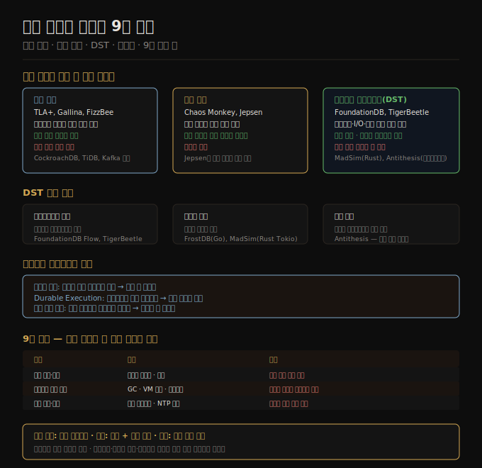

# 09-04. 분산 시스템 검증과 9장 종합
> 분산 시스템의 올바름은 증명하기도, 테스트하기도 어렵습니다. 모델 체커, 결함 주입, 결정론적 시뮬레이션이라는 세 가지 검증 접근법은 서로 보완하며 숨은 버그를 드러냅니다.

분산 시스템의 버그는 오래 잠복합니다. 동시성, 네트워크 분단, 시계 점프, 프로세스 일시 중단이 뒤섞인 특수한 타이밍에서만 드러납니다. 평상시 테스트가 수백만 번 통과해도 실제 장애 시나리오에서 데이터가 유실되거나 시스템이 교착 상태에 빠질 수 있습니다. 이 노트는 알고리즘 올바름 검증, 결함 주입, 결정론적 시뮬레이션, 결정론의 힘, 그리고 9장 전체 종합을 다룹니다.

## 1. 알고리즘 올바름 정의와 형식 검증
> 알고리즘이 올바르다는 것은 시스템 모델이 허용하는 모든 상황에서 정의된 속성을 항상 만족한다는 의미입니다.

알고리즘의 올바름을 주장하려면 먼저 무엇이 "올바름"인지 속성으로 정의해야 합니다. 예를 들어 펜싱 토큰 생성 알고리즘이라면 세 속성이 필요합니다. 유일성: 두 요청이 같은 토큰을 반환하지 않습니다. 단조성: x가 y 전에 완료됐다면 토큰 tx < ty입니다. 가용성: 요청 노드가 크래시하지 않으면 결국 응답을 받습니다.

형식 검증은 알고리즘을 수학적으로 기술하고 증명 기법으로 모든 시나리오에서 속성이 성립함을 보입니다. 실제 시스템 구현이 항상 올바르다는 의미가 아니지만, 이론 분석이 실제 시스템에서 오래 숨어있다가 특수한 상황에서만 드러날 버그를 미리 발견합니다.

**모델 체커**는 TLA+, Gallina, FizzBee 같은 목적 특화 언어로 알고리즘 명세를 작성하면, 시스템 모델이 허용하는 모든 상태를 탐색해 불변 조건이 깨지는 경우를 찾습니다. CockroachDB, TiDB, Kafka 등이 모델 명세로 실제 버그를 발견한 사례가 있습니다. TLA+ 분석으로 Viewstamped Replication 알고리즘의 산문 설명 모호성이 데이터 유실로 이어질 수 있음이 밝혀지기도 했습니다.

한계도 있습니다. 모델 체커는 실제 코드가 아닌 단순화된 모델을 검사합니다. 명세와 구현이 어긋날 수 있습니다. 대부분의 실제 알고리즘은 상태 공간이 무한하므로 완전한 검증보다는 상한을 설정해 탐색합니다. 그럼에도 사용 편의성과 버그 발견 능력 사이의 균형이 좋아 실용적입니다.

## 2. 결함 주입 — 실제 코드를 실제 장애로 테스트
> 코드가 장애 시 어떻게 동작하는지는 장애를 직접 주입해봐야 알 수 있습니다.

결함 주입(fault injection)은 실행 중인 시스템의 환경에 장애를 심어 어떻게 반응하는지 관찰합니다. 네트워크 분단, 머신 크래시, 디스크 오염, 프로세스 일시 정지 등 실제로 일어날 수 있는 모든 것이 대상입니다.

테스트는 프로덕션 환경과 유사한 스테이징 환경에서 실행합니다. Netflix는 Chaos Monkey로 프로덕션 환경에 직접 결함을 주입하는 *카오스 엔지니어링*을 대중화했습니다. Jepsen 프레임워크는 분산 시스템의 결함 주입 테스트를 위한 도구와 프리셋을 제공합니다. Jepsen은 널리 사용되는 많은 시스템(Cassandra, Redis, Elasticsearch, etcd 등)에서 심각한 버그를 발견했습니다.

결함 주입의 장점은 실제 코드를 테스트한다는 것입니다. 모델과 구현이 어긋나는 문제가 없습니다. 단점은 재현성이 낮다는 점입니다. 비결정론적인 타이밍과 네트워크 거동 때문에 같은 장애를 정확히 재현하기 어렵습니다.

## 3. 결정론적 시뮬레이션 테스트
> 실제 코드를 완전히 제어 가능한 가상 환경에서 실행하면 수백만 가지 시나리오를 빠르게 탐색하고 버그를 재현할 수 있습니다.

결정론적 시뮬레이션 테스트(DST)는 모델 체커(실제 코드를 검사하지 않음)와 결함 주입(재현이 어려움)의 약점을 보완합니다. 시뮬레이터가 네트워크 통신, I/O, 시계를 모두 모의(mock)로 교체해 실행 순서를 완전히 제어합니다. 버그가 발견되면 같은 실행 시퀀스를 재현해 디버깅합니다.

세 가지 접근 방식이 있습니다.

**애플리케이션 수준**: 처음부터 결정론적 실행이 가능하게 설계합니다. FoundationDB는 비동기 통신 라이브러리 Flow를 써서 결정론적 네트워크 시뮬레이션을 주입할 수 있게 만들었습니다. TigerBeetle은 상태 머신 + 단일 이벤트 루프 + 결정론적 모의 클럭으로 완전한 DST를 지원합니다.

**런타임 수준**: 기존 언어의 비동기 런타임에 결정론을 주입합니다. FrostDB는 Go 런타임을 패치해 고루틴을 순차 실행합니다. Rust의 MadSim은 Tokio 비동기 런타임과 AWS S3, Kafka 등 주요 라이브러리의 결정론적 구현을 제공합니다. 코드 수정 없이 결정론적 테스트 실행이 가능합니다.

**머신 수준**: 전체 머신을 결정론적으로 만듭니다. Antithesis는 시계·네트워크·스토리지를 포함한 모든 비결정론적 연산을 결정론으로 대체하는 커스텀 하이퍼바이저를 구축했습니다. 애플리케이션 코드를 전혀 수정하지 않아도 됩니다.

DST의 추가 장점은 속도입니다. 모의 클럭과 네트워크를 쓰므로 실제 타임아웃을 기다리지 않아도 됩니다. 타임아웃과 네트워크 지연이 포함된 시나리오를 벽시계 시간보다 훨씬 빠르게 시뮬레이션합니다. Antithesis처럼 테스트 분기를 탐색해 드문 코드 경로를 체계적으로 커버하는 도구도 있습니다.

## 4. 결정론의 힘
> 결정론은 분산 시스템 설계에서 반복해 등장하는 단순하지만 강력한 원칙입니다.

분산 시스템의 모든 도전—동시성, 네트워크 지연, 프로세스 일시 중단, 시계 점프, 크래시—의 공통 원인은 비결정론입니다. 역설적으로, 시스템을 결정론적으로 만들면 많은 것이 단순해집니다.

9장 이전에 이미 여러 곳에서 결정론 활용을 봤습니다.

- 이벤트 소싱(03-06)은 이벤트 로그를 결정론적으로 재생해 파생 뷰를 재구성합니다. 같은 이벤트 시퀀스는 항상 같은 결과를 냅니다.
- Durable Execution(05-05)은 워크플로우 정의가 결정론적임을 전제로 실행 내구성을 보장합니다.
- 상태 머신 복제는 각 복제본에서 같은 결정론적 트랜잭션 시퀀스를 독립적으로 실행해 데이터를 복제합니다. 저장 프로시저 기반 직렬 실행(08-03)이 이 원리입니다.

결정론적 코드를 작성하려면 주의가 필요합니다. 모든 비결정론 소스를 제거해야 합니다. 해시 테이블 순회 순서가 비결정론적인 언어들이 있습니다. 메모리 할당 실패, 스택 오버플로우 같은 자원 한계 도달 여부도 비결정론적입니다.

## 5. 9장 종합 — 분산 시스템의 현실
> 분산 시스템은 네트워크, 시계, 프로세스라는 세 가지 불신뢰 요소를 안고 작동합니다. 부분 실패를 수용하는 설계만이 신뢰성을 달성합니다.

9장이 다룬 문제들을 종합합니다.

| 문제 | 원인 | 결과 |
|------|------|------|
| 패킷 유실·지연 | 비동기 패킷망, 큐잉 | 요청 성공 여부 불명 |
| 타임아웃 부정확 | 무한 지연 가능, 변동성 | 산 노드를 죽었다고 오탐 |
| 프로세스 일시 중단 | GC, VM 중단, OS 스케줄링 | 노드가 자신이 얼마나 멈췄는지 모름 |
| 클럭 스큐 | 쿼츠 드리프트, NTP 한계 | 이벤트 순서 판단 오류 |
| 클럭 점프 | NTP 강제 조정, 윤초 | 경과 시간 측정 오류 |
| 부분 실패 | 위 모든 요소의 복합 | 비결정론적 시스템 거동 |

이 문제들을 처리하기 위한 원칙은 다음과 같습니다.

**장애 탐지**: 정확한 탐지 수단이 없습니다. 타임아웃이 최선이며, 관측 분포에 따라 동적 조정이 낫습니다. 짧은 타임아웃의 오탐 비용과 긴 타임아웃의 탐지 지연 사이에서 균형을 잡습니다.

**결정 방식**: 단일 노드를 신뢰하지 않습니다. 쿼럼 투표로 결정하고, 소수 노드 장애에도 전체 시스템이 동작합니다. 결정 실행은 펜싱 토큰으로 보강합니다.

**시간 다루기**: 경과 시간엔 단조 시계를, 이벤트 순서엔 논리 시계를 씁니다. 벽시계 타임스탬프로 분산 이벤트 순서를 결정하지 않습니다.

**검증**: 시스템 모델을 명시하고, 모델 체커·결함 주입·DST를 결합해 실제 장애 시나리오를 테스트합니다.

단일 컴퓨터의 이상화된 수학적 완벽함에 익숙하다면 분산 시스템의 지저분한 현실은 충격적일 수 있습니다. 반대로 분산 시스템 엔지니어 입장에서는 단일 컴퓨터로 해결할 수 있는 문제는 단순한 문제입니다. 실제로 현대 단일 노드는 상당히 넓은 범위를 처리할 수 있어, 불필요하게 분산의 판도라 상자를 여는 것은 피하는 편이 좋습니다.

그러나 내결함성, 낮은 지연(지리적 분산), 지속적 무중단 서비스는 단일 노드로 달성할 수 없습니다. 분산 시스템의 목표는 모든 장애와 유지보수를 노드 수준에서 처리하면서 서비스 수준에서는 무중단을 유지하는 것입니다. 10장에서는 이 목표를 달성하기 위한 구체적인 분산 알고리즘—합의, 원자 브로드캐스트, 분산 트랜잭션—을 살펴봅니다.

## 자주 받는 오해

1. **"충분히 테스트했으면 분산 시스템 버그가 없을 것이다"** — 분산 시스템 버그는 동시성, 네트워크 지연, 타이밍이 특수하게 조합될 때만 드러납니다. 일반 통합 테스트로는 발견하기 어렵고 결함 주입이나 DST가 필요합니다. Jepsen은 충분히 테스트됐다고 여겨지던 많은 시스템에서 심각한 버그를 발견했습니다.

2. **"모델 체커가 통과하면 구현이 올바르다"** — 모델 체커는 명세(specification)의 올바름을 검증하지 구현(implementation)의 올바름을 검증하지 않습니다. 명세와 구현이 어긋날 수 있고, 명세의 단순화가 실제 버그를 놓칠 수 있습니다. 모델 체커는 결함 주입, DST와 결합해야 합니다.

3. **"결정론적 시뮬레이션은 코드를 대폭 수정해야 해서 현실적이지 않다"** — MadSim(Rust), Antithesis 같은 도구는 런타임이나 하이퍼바이저 수준에서 결정론을 주입해 애플리케이션 코드 수정이 최소화됩니다. 런타임 수준 및 머신 수준 접근법은 기존 코드베이스에도 적용할 수 있습니다.

## 면접에서 받을 만한 질문

1. **"TLA+ 같은 형식 명세 언어의 한계는 무엇인가?"** — TLA+ 모델 체커는 무한 상태 공간을 완전 탐색할 수 없어 상한을 설정해 탐색합니다. 상한 이후에만 드러나는 버그는 놓칩니다. 더 근본적으로 명세와 구현이 어긋날 수 있습니다. 명세에서 안전한 알고리즘도 구현에서 버그가 생길 수 있습니다. 형식 검증은 실험적 테스트(결함 주입, DST)와 반드시 결합해야 합니다.

2. **"카오스 엔지니어링과 결정론적 시뮬레이션 테스트의 차이는 무엇인가?"** — 카오스 엔지니어링(결함 주입)은 실제 환경에서 실제 장애를 주입해 시스템이 복구하는지 관찰합니다. 재현성이 낮고 탐색할 수 있는 시나리오가 제한됩니다. DST는 실행을 완전히 제어해 수백만 가지 시나리오를 탐색하고 버그를 정확히 재현합니다. 둘은 서로 보완합니다. DST가 엣지 케이스를 발견하고, 카오스 엔지니어링이 실제 환경 복원력을 검증합니다.

3. **"분산 시스템에서 결정론이 왜 중요한가?"** — 분산 시스템의 모든 어려움—비결정론적 네트워크 지연, 시계 오차, 프로세스 일시 중단—이 결국 비결정론에서 옵니다. 시스템을 결정론적으로 만들면 같은 입력에 항상 같은 결과가 나와 재현·테스트·검증이 가능해집니다. 이벤트 소싱, durable execution, 상태 머신 복제 모두 결정론에 기반합니다. DST도 실행 비결정론을 제거해 체계적 버그 탐색을 가능하게 합니다.

## 관련 문서
- [09-01. 부분 실패와 비신뢰 네트워크](09-01.부분%20실패와%20비신뢰%20네트워크.md) — 분산 시스템 어려움의 출발점
- [09-02. 불신뢰 시계](09-02.불신뢰%20시계.md) — 시계 문제와 프로세스 일시 중단
- [09-03. 진실·거짓·시스템 모델](09-03.진실·거짓·시스템%20모델.md) — 시스템 모델 형식화, 안전성·활동성 속성
