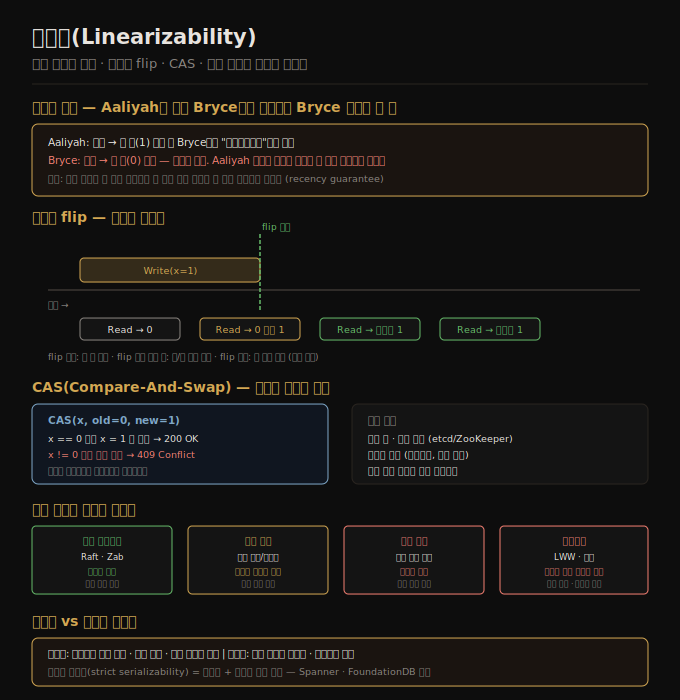

# 10-01. 선형성
> 선형성은 분산 시스템이 단일 복사본처럼 동작한다는 착각을 만들어 냅니다. 어떤 읽기가 새 값을 반환하면 그 이후 모든 읽기도 반드시 새 값을 반환해야 합니다.

복제를 쓰는 시스템에는 물리적으로 여러 개의 데이터 복사본이 있습니다. 그런데 애플리케이션이 그 복잡성을 알아야 할까요? 이상적으로는 데이터 저장소가 하나의 레플리카만 존재하는 것처럼 동작한다면, 개발자는 복제 지연이나 비일관적 읽기를 고민하지 않아도 됩니다. 이 "단일 복사본 착각(illusion of a single copy)"을 보장하는 속성이 바로 선형성(linearizability)입니다.

선형성은 *최신성 보장(recency guarantee)*이라고도 표현합니다. 쓰기가 완료된 이후 어떤 읽기든 새 값을 볼 수 있어야 한다는 의미입니다. 이 노트는 선형성의 정의와 구성 규칙, 직렬화 가능성과의 차이, 선형성이 필요한 실제 상황, 그리고 복제 방법별 선형화 가능성을 다룹니다.

## 1. 선형성이란 무엇인가
> 선형성은 분산 저장소가 단일 복사본처럼 동작하는 속성으로, 어떤 읽기가 새 값을 반환한 뒤에는 모든 클라이언트의 읽기가 예외 없이 새 값을 반환해야 합니다.

Aaliyah와 Bryce가 같은 값을 읽는 시나리오를 생각합니다. 쓰기 연산이 진행되는 동안 Aaliyah가 먼저 읽기를 수행해 새 값 1을 받습니다. Aaliyah는 기쁜 마음에 Bryce에게 "업데이트됐어"라고 알립니다. Bryce가 읽기를 수행했는데 여전히 구 값 0이 반환됩니다. 이 시나리오는 선형성 위반입니다.

왜 위반일까요? Aaliyah의 읽기가 새 값을 반환한 시점 이후에 Bryce의 읽기가 수행됐기 때문입니다. 선형성 시스템에서는 어떤 클라이언트가 새 값을 한 번이라도 읽으면, 그 이후 어떤 클라이언트도 구 값을 읽어서는 안 됩니다. 시간이 앞으로만 흐르듯, 관찰 가능한 값도 앞으로만 진행해야 합니다.

이 속성이 왜 유용한가요? 개발자가 "이 읽기가 최신 값을 반환할까?"를 걱정하지 않아도 됩니다. 선형화 가능한 시스템에서는 가장 최근 쓰기의 결과가 즉시 모든 읽기에 반영됩니다. 데이터베이스가 마치 단일 서버 위에 있는 것처럼 동작합니다.

선형성은 *외부 일관성(external consistency)*이라고도 불립니다. 시스템 내부가 아니라, 시스템 외부에서 관찰했을 때 일관성이 보장된다는 뜻입니다. Google Spanner 문서에서 이 용어를 자주 사용합니다.

## 2. 선형성을 구성하는 규칙
> 선형화 가능한 시스템에서 x가 0에서 1로 바뀌는 원자적 flip 시점이 존재하며, 그 이전과 이후가 명확하게 구분됩니다.

선형성을 형식적으로 이해하려면 세 가지 연산을 정의합니다.

- **read(x)**: 레지스터 x의 값을 반환합니다.
- **write(x, v)**: 레지스터 x에 값 v를 씁니다.
- **cas(x, v_old, v_new)**: x == v_old 이면 x = v_new 로 변경하고 OK를 반환합니다. 그렇지 않으면 변경 없이 Error를 반환합니다.

**동시 쓰기 중 읽기 규칙**: 쓰기 연산이 진행되는 도중에 읽기가 수행되면 구 값 또는 새 값 중 어느 쪽을 반환해도 됩니다. 그러나 "역전 없음" 규칙이 적용됩니다. 새 값을 반환한 읽기가 한 번 관찰되면, 이후 어떤 읽기도 구 값을 반환할 수 없습니다.

**원자적 flip 시점**: x가 0에서 1로 바뀌는 정확한 시점이 존재합니다. 이를 *선형화 포인트(linearization point)*라고 합니다. 쓰기 연산의 시작과 완료 사이 어딘가에 이 포인트가 있습니다. 이 포인트 이전의 읽기는 0을 반환할 수 있고, 이후의 읽기는 반드시 1을 반환해야 합니다.

**CAS 예시**: `cas(x, 0, 1)`이 진행됩니다. 클라이언트 A가 0을 읽고 CAS를 시도합니다. 클라이언트 B도 동시에 0을 읽고 CAS를 시도합니다. 선형화 포인트에서 둘 중 하나만 성공합니다. 성공한 클라이언트는 OK를 받고, 실패한 클라이언트는 Error를 받습니다. 이후 어떤 읽기도 0을 반환하지 않습니다.

CAS는 분산 환경에서 여러 클라이언트가 같은 자원을 경쟁할 때 정확히 하나만 성공하도록 보장하는 핵심 연산입니다. 선형성이 없으면 CAS의 보장도 성립하지 않습니다.

## 3. 선형성 vs 직렬화 가능성
> 선형성과 직렬화 가능성은 자주 혼동되지만 서로 다른 차원의 속성입니다. 선형성은 단일 객체의 최신성을 보장하고, 직렬화 가능성은 여러 객체에 걸친 트랜잭션 격리를 보장합니다.

**직렬화 가능성(serializability)**은 트랜잭션 격리 수준입니다. 여러 객체에 걸친 여러 연산을 하나의 트랜잭션으로 묶어, 마치 트랜잭션들이 어떤 직렬 순서로 하나씩 실행된 것처럼 동작한다는 보장입니다. 그 직렬 순서가 실제 시간 순서와 일치할 필요는 없습니다. 트랜잭션 A가 B보다 먼저 시작됐더라도, 직렬 순서에서 B가 A보다 먼저 실행된 것으로 취급될 수 있습니다.

**선형성(linearizability)**은 단일 객체의 최신성 보장입니다. 트랜잭션 개념이 없습니다. 하나의 레지스터(또는 키)에 대한 읽기·쓰기·CAS 연산이 실제 시간 순서와 일치하는 선형화 포인트를 가져야 한다는 요구입니다.

두 속성을 비교하면 다음과 같습니다.

| | 직렬화 가능성 | 선형성 |
|---|---|---|
| 대상 | 여러 객체에 걸친 트랜잭션 | 단일 객체의 개별 연산 |
| 시간 순서 | 임의의 직렬 순서 허용 | 실제 시간 순서 준수 |
| 트랜잭션 | 있음 | 없음 |
| 최신성 보장 | 보장하지 않음 | 보장함 |

**엄격한 직렬화(strict serializability)**는 두 속성을 동시에 만족합니다. 트랜잭션들이 실제 시간 순서와 일치하는 방식으로 직렬화됩니다. Google Spanner와 FoundationDB가 엄격한 직렬화를 구현합니다. CockroachDB는 직렬화 가능성만 보장하고 선형성은 별도 설정이 필요합니다.

두 속성 모두 없는 시스템도 있습니다. 많은 분산 데이터베이스는 성능을 위해 둘 다 포기하고 최종 일관성만 제공합니다.

## 4. 선형성이 필요한 상황
> 분산 락, 유일성 제약, 교차 채널 타이밍 의존성은 선형성 없이는 정확하게 구현할 수 없는 시나리오입니다.

**리더 선출과 분산 락**: 분산 시스템에서 단 하나의 노드만 리더여야 하거나, 단 하나의 프로세스만 특정 작업을 수행해야 할 때 분산 락을 씁니다. ZooKeeper와 etcd가 이 용도로 선형화 가능한 저장소를 제공합니다. 만약 락 서비스가 선형화 가능하지 않다면, 두 노드가 동시에 락을 획득했다고 판단하는 상황이 생깁니다. 09-03에서 다룬 펜싱 토큰도 선형화 가능한 락 서비스를 전제로 작동합니다.

**유일성 제약**: 사용자명은 중복될 수 없습니다. 파일 시스템 경로도 중복될 수 없습니다. 항공편 좌석 예약에서 같은 좌석에 두 명이 배정될 수 없습니다. 이런 유일성 제약을 분산 환경에서 강제하려면 "이 값이 이미 존재하는가?"를 확인하는 읽기와 새 값을 쓰는 쓰기가 원자적으로 수행돼야 합니다. 이것이 CAS 연산이고, CAS는 선형성을 요구합니다.

**교차 채널 타이밍 의존성**: 비디오 업로드 서비스를 예로 듭니다. 사용자가 영상을 업로드하면 저장소에 저장됩니다. 동시에 메시지 큐로 "인코딩 작업 필요" 메시지가 전송됩니다. 트랜스코더 워커가 메시지를 받아 저장소에서 영상을 읽으려 합니다. 만약 저장소가 선형화 가능하지 않다면, 트랜스코더가 영상을 읽으려 할 때 아직 반영되지 않은 레플리카에서 읽어 "파일 없음" 오류가 발생할 수 있습니다. 저장소 쓰기가 완료된 이후 큐 메시지가 전송됐음에도, 비동기 복제 지연으로 인해 이런 경쟁 조건이 생깁니다.

이 세 가지 상황의 공통점은 "여러 채널(저장소, 큐, 사용자 알림)을 통해 진행되는 연산들의 순서가 실제 시간과 일치해야 한다"는 점입니다. 선형성이 이 요구를 만족시킵니다.

## 5. 선형성을 제공하는 복제 방법
> 복제 방법에 따라 선형화 가능성이 달라집니다. 합의 알고리즘이 가장 안정적으로 선형성을 보장하고, 다중 리더와 리더리스는 원리상 선형성을 보장하기 어렵습니다.

**단일 리더 복제 (잠재적으로 가능)**: 모든 읽기와 쓰기를 리더에서만 처리하면 선형화 가능합니다. 그러나 두 가지 함정이 있습니다. 첫째, 비동기 복제를 쓰는 경우 리더 장애 시 팔로워가 리더로 승격하면서 아직 복제되지 않은 쓰기가 유실될 수 있습니다. 이는 선형성 위반입니다. 둘째, 네트워크 분단이나 GC 포즈 등으로 이전 리더가 물러나지 않은 채 새 리더가 선출되면 좀비 리더가 구 값으로 응답합니다. 이를 막으려면 리더 자신이 실제로 리더인지 확인하는 메커니즘이 필요합니다.

**합의 알고리즘 (선형화 가능)**: Raft, Zab 같은 합의 알고리즘은 리더 선출과 쓰기 커밋을 쿼럼 투표로 처리합니다. 리더가 쓰기를 처리하기 전에 과반수 노드의 확인을 받으므로, 좀비 리더 문제가 발생하지 않습니다. etcd와 ZooKeeper가 이 방식으로 선형화 가능한 저장소를 제공합니다. 읽기 시에도 리더 확인(lease 또는 선형 읽기 연산)을 수행해야 완전한 선형성이 보장됩니다.

**다중 리더 복제 (선형화 불가)**: 여러 노드가 동시에 쓰기를 받아들이면 같은 객체에 대한 충돌 쓰기가 발생합니다. 두 리더가 서로 다른 값을 동시에 쓸 수 있으므로 단일 선형화 포인트가 존재하지 않습니다. 충돌 해소 방식(LWW, 병합 등)이 필요한 시점에 선형성은 이미 포기된 상태입니다.

**리더리스 복제 (선형화 불가 가능성 높음)**: Dynamo 스타일의 리더리스 복제는 쿼럼 읽기·쓰기(w + r > n)를 씁니다. 직관적으로는 "쿼럼 읽기가 최신 값을 반환할 것"으로 기대하지만, 실제로는 그렇지 않습니다. LWW(last-write-wins) 방식에서는 클럭 스큐로 인해 더 최근의 쓰기가 더 낮은 타임스탬프를 가질 수 있습니다. 또한 쿼럼 읽기 중에 쓰기가 일부 노드에만 반영된 상태라면 구 값과 새 값이 섞인 응답이 올 수 있습니다. 다음 절에서 구체적인 비선형화 사례를 다룹니다.

## 자주 받는 오해

1. **"쿼럼(w + r > n)을 쓰면 강한 일관성이 보장된다"** — 보장되지 않습니다. 쿼럼 조건은 읽기와 쓰기 집합이 겹치도록 강제할 뿐, 선형성은 별개입니다. 쓰기가 진행 중인 동안 읽기가 일부 노드는 새 값을, 일부 노드는 구 값을 반환하면, 쿼럼 읽기는 여러 응답을 모아 판단하는데 이 과정에서 구 값이 "다수결"로 선택될 수 있습니다. 또한 LWW 충돌 해소를 쓰는 경우 클럭 스큐로 인해 더 최근 쓰기가 버려질 수 있습니다.

2. **"직렬화와 선형성은 같은 개념이다"** — 다릅니다. 직렬화 가능성은 여러 객체에 걸친 트랜잭션 격리를 보장하되, 실제 시간 순서와 일치할 필요가 없습니다. 선형성은 단일 객체의 연산이 실제 시간 순서와 일치하는 선형화 포인트를 가져야 한다는 요구입니다. 직렬화 가능한 시스템이 선형화 가능하지 않을 수 있고, 그 반대도 마찬가지입니다. 둘을 동시에 만족하는 엄격한 직렬화가 가장 강한 보장입니다.

3. **"단일 리더 복제는 항상 선형화 가능하다"** — 그렇지 않습니다. 비동기 페일오버 시 커밋된 쓰기가 유실될 수 있습니다. 팔로워가 리더로 승격되면 이전 리더에서 커밋됐지만 아직 복제되지 않은 쓰기가 사라지고, 이전에 그 새 값을 읽은 클라이언트는 다음 읽기에서 구 값을 돌려받습니다. 또한 팔로워에서 읽기를 허용하는 경우, 복제 지연 때문에 리더에서 쓰기가 완료된 직후 팔로워에서 읽으면 구 값이 반환됩니다.

## 면접에서 받을 만한 질문

1. **"선형성이란 무엇이며 직렬화와 어떻게 다른가?"** — 선형성은 단일 객체의 읽기·쓰기·CAS 연산이 실제 시간 순서와 일치하는 선형화 포인트를 가져야 한다는 속성입니다. 어떤 읽기가 새 값을 반환하면 그 이후 모든 읽기도 새 값을 반환합니다. 직렬화 가능성은 여러 객체에 걸친 트랜잭션이 어떤 직렬 순서로 하나씩 실행된 것처럼 동작한다는 격리 속성입니다. 실제 시간 순서와 일치할 필요가 없습니다. 둘을 동시에 만족하면 엄격한 직렬화이고, Spanner와 FoundationDB가 이를 구현합니다.

2. **"분산 락에서 선형성이 왜 필요한가?"** — 분산 락은 "단 하나의 클라이언트만 락을 보유한다"는 보장을 전제로 합니다. 락 서비스가 선형화 가능하지 않으면 두 클라이언트가 동시에 락을 획득했다고 판단할 수 있습니다. CAS 연산으로 락을 구현할 때, CAS의 "현재 값 확인 후 쓰기"가 원자적으로 수행되려면 선형화 포인트가 존재해야 합니다. ZooKeeper와 etcd가 선형화 가능한 CAS를 제공하기 때문에 분산 락 구현에 표준적으로 사용됩니다.

3. **"Dynamo 스타일 쿼럼이 선형화 가능하지 않은 이유는?"** — 쿼럼 조건(w + r > n)은 읽기와 쓰기 노드 집합이 겹치도록 강제하지만, 이것이 선형성을 보장하지는 않습니다. 쓰기가 일부 노드에만 반영된 상태에서 읽기가 수행되면, 읽기 집합 안에 구 값과 새 값을 가진 노드가 섞입니다. LWW 해소를 쓰는 경우 클럭 스큐로 인해 더 최근 쓰기가 낮은 타임스탬프를 가져 버려질 수 있습니다. 또한 동시 쓰기 중에 수행된 읽기가 새 값을 반환했다가 이후 읽기가 구 값을 반환하는 역전이 발생할 수 있어 선형화 포인트가 성립하지 않습니다.

## 관련 문서
- [09-03. 진실·거짓·시스템 모델](09-03.진실·거짓·시스템%20모델.md) — 펜싱 토큰과 좀비 리더 문제, 선형성이 필요한 분산 락의 맥락
- [10-02. 선형성의 비용과 CAP](10-02.선형성의%20비용과%20CAP.md) — 선형성을 포기하는 트레이드오프와 CAP 정리의 실질적 의미
- [08-03. Write Skew와 직렬화 가능성](08-03.Write%20Skew와%20직렬화%20가능성.md) — 직렬화 가능성의 구현 방법과 선형성과의 관계
