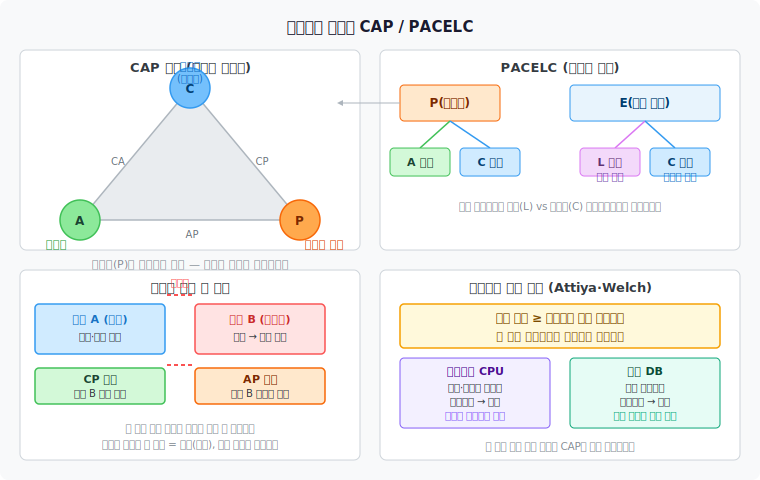

# 선형성의 비용과 CAP 정리
> 선형성은 안전하지만 공짜가 아닙니다. 네트워크 파티션 앞에서 가용성과 충돌하고, 정상 상황에서도 지연을 대가로 요구합니다.

이 노트를 읽고 나면 네트워크 파티션이 선형성과 가용성을 어떻게 충돌시키는지 두 리전 예시로 설명하고, CAP 정리의 역사적 의의와 실용적 한계를 구분하며, PACELC가 CAP을 어떻게 확장하는지 말할 수 있습니다. 나아가 멀티코어 CPU가 선형성을 포기한 이유와 Attiya·Welch 증명이 선형성 시스템에 어떤 성능 하한을 부과하는지도 설명할 수 있습니다.

10-01에서 선형성이 무엇인지 — 시스템이 단 하나의 데이터 복사본만 갖는 것처럼 동작하는 보장 — 를 살펴봤습니다. 이 노트는 그 보장이 실제로 얼마나 비싼지를 파고듭니다. 비용의 원천은 두 곳입니다. 하나는 네트워크 파티션이라는 불가피한 장애 상황이고, 다른 하나는 가변적인 네트워크 지연이라는 일상적인 현실입니다.

## 1. 네트워크 파티션 시 선형성과 가용성의 충돌
> 파티션이 발생하면 선형성과 가용성을 동시에 지킬 방법은 없습니다.

두 리전에 걸쳐 단일 리더 데이터베이스를 운영하는 상황을 생각해 봅시다. 리더는 리전 A에 있고, 리전 B의 팔로워는 리더 복제본을 유지합니다. 평시에는 두 리전 모두 읽기를 처리할 수 있고, 쓰기는 리전 A의 리더를 통해 이뤄집니다.

이제 두 리전 사이의 네트워크 링크가 끊어졌다고 가정해 봅시다. 리전 A의 리더는 여전히 동작 중이지만 리전 B의 팔로워는 리더와 연결이 끊겼습니다. 리전 B에 있는 사용자가 읽기 요청을 보내면 어떻게 해야 할까요?

선택지는 두 가지입니다.

**CP 선택 — 선형성 유지, 가용성 희생.** 리전 B는 자신의 복제본이 최신인지 보장할 수 없으므로 요청을 거부합니다. 사용자는 파티션이 복구될 때까지 서비스를 이용하지 못합니다. 선형성은 보장되지만 리전 B는 사실상 다운된 것과 같습니다.

**AP 선택 — 가용성 유지, 선형성 희생.** 각 리전이 독립적으로 읽기와 쓰기를 처리합니다. 다중 리더 구성이 여기에 해당합니다. 두 리전의 데이터는 파티션 동안 달라질 수 있고, 선형성은 보장되지 않습니다.

어느 선택이 옳은지는 애플리케이션의 요구사항에 달려 있습니다. 그러나 한 가지는 분명합니다. 파티션은 선택지가 아닙니다. 충분히 긴 시간 동안 충분히 많은 노드를 운영하면 네트워크 링크 장애, 라우터 오작동, 패킷 손실은 반드시 발생합니다. 파티션을 회피하는 설계란 존재하지 않습니다. 설계자는 파티션이 왔을 때 선형성과 가용성 사이에서 어느 쪽을 택할지를 미리 결정해야 합니다.

## 2. CAP 정리 — 역사적 의의와 한계
> CAP은 분산 시스템 설계의 대화를 열었지만, 실제 설계 결정에는 너무 조악한 도구입니다.

에릭 브루어(Eric Brewer)는 2000년 PODC 기조연설에서 일관성(Consistency), 가용성(Availability), 파티션 내성(Partition tolerance) 중 세 가지를 동시에 만족하는 분산 시스템은 없다는 직관을 제시했습니다. 2002년 길버트(Gilbert)와 린치(Lynch)가 이를 수학적으로 증명하면서 CAP 정리로 정립됐습니다.

CAP 정리는 당시 관계형 데이터베이스의 강한 일관성 요구에 의문을 제기하는 데 크게 기여했습니다. "확장성을 위해 일관성을 완화할 수 있다"는 아이디어가 NoSQL 운동의 이론적 근거 중 하나로 쓰였고, 분산 시스템 설계에서 트레이드오프를 명시적으로 논의하는 문화를 만드는 데 역할을 했습니다.

그러나 실용적 도구로서 CAP의 가치는 제한적입니다. 그 이유는 여러 층위에서 발견됩니다.

첫째, CAP의 일관성은 선형성만을 가리킵니다. 직렬화 가능성, 인과 일관성, 최종 일관성 등 실제 시스템에서 의미 있는 다른 일관성 모델은 CAP의 논의 범위 밖입니다. "C를 포기한다"는 말이 어느 일관성 모델을 포기하는지 CAP은 말해 주지 않습니다.

둘째, CAP은 파티션이라는 장애 상황만 다룹니다. 데이터센터 장애 원인 가운데 네트워크 파티션이 차지하는 비율은 8% 미만이라는 연구가 있습니다. 나머지 90% 이상의 장애에서 CAP은 아무것도 말하지 않습니다.

셋째, CAP은 네트워크 지연을 완전히 무시합니다. 실제 시스템에서 성능 저하의 주된 원인은 장애가 아니라 지연입니다. 파티션이 없는 정상 상황에서도 선형성을 구현하려면 노드 간 동기화가 필요하고, 이는 지연을 증가시킵니다.

넷째, CA 시스템이라는 범주는 실제로 존재하기 어렵습니다. 파티션이 발생했을 때 가용성과 일관성을 모두 지키는 시스템은 파티션 자체가 발생하지 않는 환경, 즉 단일 노드 환경에서만 의미 있습니다.

CP와 AP라는 이분법도 문제입니다. 실제 시스템 대부분은 어느 쪽으로도 명확하게 분류되지 않습니다. ZooKeeper는 보통 CP로 분류되지만, 특정 작업에서는 선형성을 보장하지 않습니다. Cassandra는 AP로 분류되지만, 쿼럼 일관성 설정에 따라 선형성에 가까운 보장을 제공하기도 합니다.

브루어 자신도 2012년 논문에서 CAP의 실용적 의의는 제한적이며, 파티션이 발생하는 드문 상황에서의 선택보다 지연과 일관성 사이의 일상적 트레이드오프가 더 중요하다고 인정했습니다. 오늘날 CAP은 분산 시스템 설계의 역사적 이정표이지만, 실제 설계 결정을 안내하는 도구로는 더 정밀한 결과들로 대체됐습니다.

## 3. PACELC — CAP의 확장
> 파티션 상황뿐 아니라 정상 상황의 지연 대 일관성 트레이드오프까지 포괄해야 실용적입니다.

다니엘 아바디(Daniel Abadi)가 2012년 제안한 PACELC는 CAP이 놓친 일상적 트레이드오프를 포착합니다. 이름 자체가 두 상황을 명시합니다.

- **P(Partition)가 발생했을 때**: A(Availability)와 C(Consistency) 사이에서 선택합니다. CAP과 같은 상황입니다.
- **E(Else), 정상 운영 시**: L(Latency)과 C(Consistency) 사이에서 선택합니다. CAP이 무시한 상황입니다.

PACELC에서 정상 상황의 선택이 중요한 이유는 간단합니다. 선형성을 보장하려면 쓰기가 복수의 복제본에 반영됐음을 확인한 뒤에야 클라이언트에게 응답을 돌려줄 수 있습니다. 이 동기화 과정에서 네트워크 왕복 시간(RTT)이 더해집니다. 데이터센터 간 RTT가 수십 밀리초라면, 선형성 쓰기는 그만큼 느려집니다.

일부 시스템은 정상 상황에서 지연을 줄이기 위해 의도적으로 일관성을 완화합니다. 예를 들어 DynamoDB의 최종 일관성 읽기는 복제본 하나에서 즉시 응답을 돌려줍니다. 강한 일관성 읽기를 요청하면 쿼럼을 기다려야 하므로 더 느립니다. 이 차이가 PACELC의 ELC 부분에 해당합니다.

PACELC는 몇 가지 대표 시스템을 다음처럼 분류합니다.

| 시스템 | P 상황 | E 상황 | 설명 |
|--------|--------|--------|------|
| DynamoDB | PA | EL | 파티션 시 가용성, 정상 시 지연 우선 |
| Cassandra | PA | EL | 기본 설정 기준 |
| ZooKeeper | PC | EC | 파티션 시 일관성, 정상 시 일관성 |
| PostgreSQL (동기 복제) | PC | EC | 단일 리더, 동기 대기 복제본 |
| MySQL (비동기 복제) | PA | EL | 기본 비동기 복제 기준 |

PACELC의 진정한 기여는 "정상 상황에서 성능을 얼마나 양보해야 일관성을 지킬 수 있는가"라는 질문을 설계 결정의 전면에 올린 점입니다. 대부분의 실제 서비스에서 파티션은 드문 사건이지만, 지연은 매 요청마다 발생합니다.

## 4. CPU 메모리 캐시 — 선형성을 포기한 이유
> 멀티코어 CPU도 성능을 위해 선형성을 포기합니다. 분산 데이터베이스의 선택과 같은 논리입니다.

선형성 포기가 분산 시스템만의 현상이 아님을 보여 주는 사례가 가까이 있습니다. 현대 멀티코어 프로세서는 코어마다 L1·L2 캐시와 스토어 버퍼(store buffer)를 갖습니다. 한 코어가 메모리에 값을 쓰면 그 변경은 즉시 다른 코어의 캐시에 반영되지 않습니다. 코어 간 캐시 동기화(cache coherence)가 일어나기 전까지 다른 코어는 오래된 값을 볼 수 있습니다.

이는 명백한 비선형화입니다. 코어 1이 x = 1을 썼더라도, 메모리 배리어(memory barrier, fence) 없이는 코어 2가 x를 읽을 때 여전히 0을 볼 수 있습니다. 멀티스레드 프로그래밍에서 volatile, atomic, mutex가 필요한 이유가 바로 여기에 있습니다. 이 도구들은 내부적으로 메모리 배리어를 삽입해 선형성에 가까운 보장을 제공합니다.

CPU 설계자들이 이런 복잡성을 감수한 이유는 CAP 때문이 아닙니다. 네트워크 파티션과 무관하게 캐시 없이 모든 코어가 메인 메모리를 직접 읽고 쓰면 성능이 수십 배 떨어집니다. 이유는 순전히 **성능**입니다.

분산 데이터베이스도 동일한 논리를 따릅니다. 모든 읽기가 최신 복제본에서 이뤄지도록 보장하면 선형성을 얻을 수 있지만, 그러려면 읽기마다 리더에 확인해야 하거나 쿼럼 응답을 기다려야 합니다. 그 비용을 피하기 위해 스테일 읽기를 허용하는 것이 약한 일관성의 핵심입니다.

실제로 선형성을 포기하는 시스템이 많은 이유는 두 가지입니다. 첫째는 분명히 파티션 내성, 즉 장애 상황에서도 계속 동작해야 하는 요구입니다. 그러나 이것이 전부는 아닙니다. 둘째는, 그리고 많은 경우 더 중요한 이유는, **성능**입니다. 선형성이 없어도 충분한 애플리케이션에서 그 비용을 지불할 이유가 없습니다.

## 5. 선형성의 성능 하한
> 선형성 시스템이 느린 것은 구현이 나빠서가 아닙니다. 증명된 하한이 있습니다.

해게이 아타이야(Hagit Attiya)와 제니퍼 웰치(Jennifer Welch)는 1994년 중요한 정리를 증명했습니다. 가변적인 네트워크 지연 환경에서 선형성 레지스터의 읽기와 쓰기 응답 시간은 최악 네트워크 지연 불확실성에 비례하는 하한을 갖는다는 것입니다.

직관적으로 설명하면 이렇습니다. 선형성 쓰기가 완료됐음을 보장하려면, 쓰기 결과가 다른 노드에 전달됐음을 확인해야 합니다. 그런데 메시지 전달 시간이 가변적이라면 — 어떤 메시지는 1ms 안에 도착하고 어떤 메시지는 100ms가 걸린다면 — 응답을 돌려주기 전에 최악의 경우를 기다려야 할 가능성이 생깁니다. 더 빠른 알고리즘으로 이 하한을 돌파할 방법은 없습니다.

이 증명의 실용적 의미는 명확합니다. 네트워크 지연이 가변적인 환경, 즉 현실의 모든 네트워크에서, 선형성 시스템의 지연은 그 가변성을 반영합니다. 데이터센터 안에서도 이따금 수백 밀리초에 달하는 패킷 지연이 발생하고, 선형성 시스템은 그 이상치를 응답 시간에 흡수해야 합니다.

약한 일관성 모델은 이 제약을 우회합니다. 모든 복제본에 쓰기가 전달됐음을 확인하지 않고 응답을 돌려주므로, 최악 네트워크 지연에 묶이지 않습니다. 지연에 민감한 시스템 — 대규모 e-commerce의 장바구니, 소셜 미디어의 좋아요 수, 게임의 점수판 — 에서 최종 일관성이나 인과 일관성이 선택받는 이유가 여기에 있습니다.

선형성이 꼭 필요한 곳은 여전히 있습니다. 분산 잠금, 유일한 사용자명 등록, 은행 잔액의 원자적 갱신처럼 여러 노드가 어떤 값에 대해 완벽하게 합의해야 하는 경우입니다. 그런 곳에서는 지연 비용을 인식하면서 선형성을 선택해야 합니다. 그렇지 않은 대부분의 경우에는 약한 일관성이 합리적인 선택입니다.

## 자주 받는 오해

**1. "CAP은 세 가지 중 두 가지를 고를 수 있다."**

엄밀히 말하면 이 표현은 오해를 낳습니다. 파티션 내성(P)은 선택지가 아닙니다. 분산 시스템을 운영하는 한 네트워크 파티션은 언젠가 반드시 발생합니다. 따라서 실질적 선택은 "파티션이 발생했을 때 일관성(C)과 가용성(A) 중 어느 쪽을 희생할 것인가"입니다. CA 시스템이란 파티션이 발생하지 않는 환경, 즉 단일 노드에서만 의미 있는 개념입니다.

**2. "선형성을 포기하는 주된 이유는 장애 내성이다."**

네트워크 파티션에서 가용성을 지키기 위해 선형성을 포기하는 경우도 있습니다. 그러나 실제로 더 자주 마주치는 이유는 성능입니다. 파티션이 없는 정상 운영 중에도 선형성은 동기화 오버헤드를 요구합니다. Attiya·Welch 하한이 증명하듯, 네트워크 지연이 있는 한 선형성 응답 시간은 그 지연에 묶입니다. 대규모 서비스들이 약한 일관성을 선택하는 주된 동기는 지연 감소이지, 장애 대응이 아닌 경우가 많습니다.

**3. "CP 시스템은 항상 일관성을 완전히 제공한다."**

CAP의 C는 선형성만을 의미합니다. CP로 분류된 시스템이 직렬화 가능성이나 인과 일관성 같은 다른 일관성 모델을 자동으로 보장하지는 않습니다. 예를 들어 ZooKeeper는 자체 API에 대해서는 선형성을 보장하지만, 파티션 복구 직후 일시적으로 오래된 데이터를 반환할 수 있는 엣지 케이스가 있습니다. 또한 CP 시스템도 네트워크 파티션 이외의 장애, 예를 들어 노드 크래시나 디스크 오류에서는 가용성을 잃을 수 있습니다.

## 면접에서 받을 만한 질문

**1. CAP 정리의 한계는 무엇인가요? 왜 실용적 가치가 제한적인가요?**

CAP은 일관성을 선형성으로만 한정하고, 파티션 상황만 다루며, 네트워크 지연을 무시합니다. 데이터센터 장애의 90% 이상이 파티션 외 원인이며, 성능 문제의 주범은 지연입니다. 실제 시스템 대부분은 CP나 AP 어느 쪽으로도 명확히 분류되지 않습니다. PACELC처럼 지연과 일관성 트레이드오프를 정상 운영 상황에서도 표현하는 모델이 더 실용적입니다.

**2. PACELC는 CAP과 어떻게 다른가요?**

CAP은 네트워크 파티션이라는 장애 상황에서의 선택만 다룹니다. PACELC는 파티션 상황(PA 또는 PC)에 더해 정상 운영 상황에서의 선택(EL 또는 EC), 즉 지연 대 일관성 트레이드오프를 명시합니다. 이를 통해 파티션이 드문 시스템에서도 설계 결정을 설명할 언어를 제공합니다. 예를 들어 DynamoDB의 기본 설정은 PA/EL, ZooKeeper는 PC/EC로 표현됩니다.

**3. 선형성 시스템이 필연적으로 느린 이유는 무엇인가요?**

Attiya·Welch(1994)는 가변적인 네트워크 지연 환경에서 선형성 읽기·쓰기의 응답 시간이 네트워크 지연 불확실성에 비례하는 하한을 가짐을 증명했습니다. 더 나은 알고리즘으로 이 하한을 돌파할 방법은 없습니다. 선형성을 보장하려면 쓰기가 복수 노드에 전달됐음을 확인해야 하고, 그 확인 과정에서 네트워크 왕복 시간이 더해집니다. 이는 약한 일관성 모델이 복제본 하나에서 즉시 응답을 돌려줄 수 있는 것과 대비됩니다.

## 관련 문서

- `10-01.선형성.md` — 선형성의 정의, 등가성, 응용 사례를 다룹니다. 이 노트의 전제가 되는 개념입니다.
- `09-01.부분 실패와 비신뢰 네트워크.md` — 네트워크 파티션이 왜 불가피한지, 패킷 지연과 손실의 실태를 다룹니다.
- `06-04.다중 리더 복제.md` — AP 선택의 구체적 구현입니다. 다중 리더가 선형성을 어떻게 포기하는지 살펴볼 수 있습니다.
