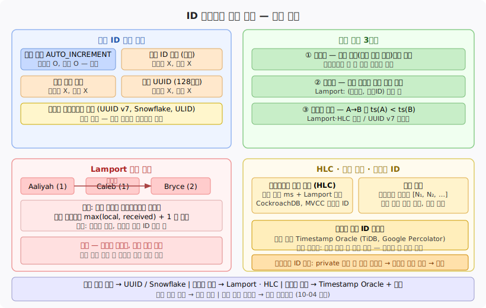

# 10-03. ID 생성기와 논리 시계
> 분산 시스템에서 "모든 노드가 동의하는 유일한 순서"를 만드는 일은 생각보다 어렵습니다. ID 생성 문제를 통해 물리 시계의 한계를 확인하고, 논리 시계가 인과 순서를 어떻게 보장하는지 살펴봅니다.

관계형 데이터베이스의 `AUTO_INCREMENT`는 단순합니다. 쓰기가 들어올 때마다 하나씩 올라가는 정수가 기본 키가 됩니다. 단일 노드에서는 이 방식이 선형화 가능하고 순서도 보장됩니다. 문제는 노드가 여럿으로 늘어나는 순간 시작됩니다. 어느 노드가 어느 번호를 발급해야 하는지, 서로 다른 노드의 ID가 전체적으로 올바른 순서를 반영하는지 보장하기가 어렵습니다.

이 노트는 분산 ID 생성의 네 가지 접근 방식, 논리 시계의 세 요건, Lamport 클럭의 동작과 한계, 하이브리드 논리 시계(HLC)·벡터 클럭, 그리고 선형화 가능 ID 생성기의 설계까지 다룹니다.

## 1. 분산 ID 생성의 문제
> 단일 노드 ID는 순서와 선형성을 모두 주지만 병목이 됩니다. 분산 ID 방식들은 병목을 없애는 대신 순서 보장을 일부 포기합니다.

단일 노드 자동 증가 ID는 매력적인 속성을 갖습니다. 선형화 가능하고, 삽입 순서와 ID 순서가 일치하며, 범위 쿼리에도 유리합니다. 하지만 모든 쓰기 요청이 하나의 노드를 통과해야 하므로 단일 장애점이 되고 지연이 쌓이며 처리량이 제한됩니다. 분산 시스템에서는 이 비용을 받아들이기 어렵습니다.

분산 환경에서 ID를 생성하는 방법은 크게 네 가지입니다.

**샤딩 ID 할당**은 노드마다 서로 겹치지 않는 범위를 미리 배정하는 방식입니다. 가장 단순한 예는 짝수/홀수 분리입니다. 노드 1은 1, 3, 5, …를, 노드 2는 2, 4, 6, …을 발급합니다. 증분 폭을 노드 수로 설정하면 더 일반화됩니다. 두 노드의 ID가 서로 겹치지 않으므로 유일성은 보장되지만, 전체 삽입 순서를 반영하는 전역 순서는 보장되지 않습니다.

**블록 사전 할당**은 중앙 조율자에게 한 번에 ID 블록(예: 1~1000)을 받아 로컬에서 순차 발급하는 방식입니다. 중앙 조율자 접근 횟수를 크게 줄이지만, 블록 내 순서와 블록 간 순서가 삽입 시점과 일치하지 않을 수 있습니다. 노드가 크래시하면 할당받은 블록의 일부가 사용되지 않아 번호가 듬성듬성 빠집니다.

**랜덤 UUID**는 128비트 난수를 ID로 씁니다. UUID v4가 이에 해당합니다. 중앙 조율자 없이 각 노드가 독립적으로 생성할 수 있고, 충돌 확률은 천문학적으로 낮습니다. 단점은 크기(16바이트), 인덱스 단편화, 그리고 순서가 전혀 없다는 점입니다. 삽입 순서와 ID의 정렬 순서 사이에 어떠한 관계도 없습니다.

**벽시계 타임스탬프 기반** 방식은 밀리초·마이크로초 단위 현재 시각을 ID 앞부분에 박아 넣습니다. UUID v7, Twitter Snowflake, ULID가 이 계열입니다. 시간 순으로 대략 정렬되기 때문에 인덱스 단편화가 줄고 범위 조회에 유리합니다. 그러나 클럭 스큐(clock skew) 때문에 서로 다른 노드에서 동시에 발급된 ID의 타임스탬프 선후 관계가 실제 삽입 순서를 뒤집을 수 있습니다. "대략 정렬"이지 "정확히 정렬"은 아닙니다.

## 2. 논리 시계 개념
> 논리 시계는 쿼츠 발진기 대신 카운터를 쓰는 시계입니다. 물리 시각을 버리는 대신 인과성을 정확히 추적합니다.

물리 시계에는 두 종류가 있습니다. **벽시계**는 1970년 1월 1일 자정을 기점으로 한 절대 시각을 반환합니다. NTP로 동기화되며 윤초나 수동 조정으로 뒤로 뛸 수 있습니다. **단조 시계**는 항상 앞으로만 흐르며 경과 시간 측정에 적합하지만, 다른 노드와 값을 비교하는 데 의미가 없습니다. 두 물리 시계 모두 분산 시스템에서 이벤트의 인과 순서를 정확히 표현하지 못합니다.

논리 시계는 물리 시각을 전혀 참조하지 않고 이벤트의 인과 관계만 추적합니다. 유용한 논리 시계가 되려면 세 요건을 충족해야 합니다.

첫째, **컴팩트**해야 합니다. 타임스탬프를 작은 공간, 이상적으로는 정수 하나 또는 작은 정수 배열로 표현할 수 있어야 합니다. 크기가 크면 모든 메시지와 저장소 레코드에 붙이는 오버헤드가 커집니다.

둘째, **전순서(total order)**를 제공해야 합니다. 임의의 두 이벤트를 비교했을 때 어느 쪽이 앞서는지 항상 판별할 수 있어야 합니다.

셋째, **인과성 일관(causally consistent)**해야 합니다. 이벤트 A가 이벤트 B를 인과적으로 선행한다면, A의 타임스탬프는 반드시 B의 타임스탬프보다 작아야 합니다. 이 방향 관계가 깨지면 논리 시계로서 쓸모가 없습니다.

단일 노드 자동 증가 ID는 세 요건을 모두 충족합니다. 앞서 살펴본 분산 ID 방식들 중 샤딩 할당·블록 할당·랜덤 UUID는 인과 순서를 보장하지 않습니다. 벽시계 타임스탬프 기반 방식은 인과성 일관을 완전히 보장하지 못합니다.

## 3. Lamport 클럭
> Lamport 클럭은 통신으로 연결된 노드들 사이에서 인과적으로 일관된 전순서를 만드는 가장 단순한 메커니즘입니다.

1978년 Leslie Lamport가 제안한 Lamport 클럭은 분산 시스템 이론의 기초입니다. 각 노드는 정수 카운터 하나를 유지합니다. 타임스탬프는 `(카운터, 노드ID)` 쌍으로 표현합니다.

동작 규칙은 두 가지입니다. **로컬 이벤트**가 발생하면 카운터를 1 올립니다. **메시지를 수신**하면 `max(로컬 카운터, 수신된 카운터) + 1`로 로컬 카운터를 갱신합니다. 메시지를 보낼 때는 현재 카운터 값을 메시지에 포함합니다.

예를 들어 Aaliyah, Caleb, Bryce 세 노드가 있다고 합니다. Aaliyah와 Caleb이 각각 독립적으로 이벤트를 발생시켜 카운터가 1이 됩니다. Aaliyah가 Bryce에게 메시지를 보내면, Bryce는 `max(로컬, 1) + 1 = 2`로 카운터를 갱신합니다. 결과적으로 Bryce의 타임스탬프는 Aaliyah보다 큰 값을 가집니다.

두 타임스탬프를 비교할 때는 카운터 값을 먼저 봅니다. 카운터가 같으면 노드 ID를 사전 순으로 비교합니다. 이 규칙으로 임의의 두 이벤트를 항상 비교할 수 있으므로 전순서가 성립합니다.

Lamport 클럭은 인과성 방향을 보장합니다. A가 B를 인과적으로 선행하면(A → B) `ts(A) < ts(B)`가 항상 성립합니다. 그러나 역방향은 보장하지 않습니다. `ts(A) < ts(B)`라고 해서 A가 B의 원인이라는 뜻은 아닙니다. 서로 통신한 적 없는 두 노드의 이벤트는 인과 관계가 없어도 비교 결과가 나옵니다.

한계도 분명합니다. Lamport 클럭은 **선형성(linearizability)을 보장하지 않습니다.** 어느 노드가 아직 다른 노드와 통신하지 않았다면 그 노드는 세상에 더 큰 타임스탬프가 이미 존재한다는 사실을 알 수 없습니다. 타임스탬프가 작다고 해서 현재 시스템 전체에서 가장 작은 타임스탬프라는 보장이 없습니다. 이 미지(未知)의 타임스탬프 문제를 해결하려면 다른 도구가 필요합니다.

## 4. 하이브리드 논리 시계(HLC)와 벡터 클럭
> HLC는 Lamport 클럭의 인과성 보장에 물리 시각을 접목해 사람이 읽을 수 있는 타임스탬프를 만듭니다. 벡터 클럭은 동시(concurrent) 이벤트를 명확히 탐지합니다.

**하이브리드 논리 시계(HLC)**는 밀리초 또는 마이크로초 단위 물리 시각과 Lamport 클럭의 단조 보장을 결합합니다. CockroachDB가 이 방식을 트랜잭션 타임스탬프에 사용합니다.

HLC의 동작 원리는 이렇습니다. 물리 시계가 앞으로 나아가면 그 값을 타임스탬프로 씁니다. 다른 노드로부터 더 큰 타임스탬프를 받으면 로컬 타임스탬프도 그만큼 앞으로 끌어올립니다. 물리 시계가 거꾸로 가려 할 때는 단조성을 유지하기 위해 이전 값을 유지합니다. 결과적으로 타임스탬프는 벽시계처럼 읽을 수 있으면서도 happens-before 순서가 일관됩니다. MVCC(Multi-Version Concurrency Control) 트랜잭션 ID로 적합한 이유가 여기에 있습니다. 인과적으로 일관된 스냅샷을 타임스탬프 하나로 표현할 수 있습니다.

**벡터 클럭(vector clock)**은 Lamport 클럭의 한계인 동시성 탐지 문제를 해결합니다. 각 노드는 시스템 내 모든 노드의 카운터를 원소로 하는 벡터를 유지합니다. 이벤트 A와 B의 벡터를 비교할 때, A의 모든 원소가 B보다 크거나 같으면 A가 B를 인과적으로 선행합니다. 반대로 어느 원소는 A가 크고 다른 원소는 B가 크다면 두 이벤트는 동시(concurrent)입니다. 인과 관계 없이 서로 독립적으로 발생했다는 뜻입니다.

동시 기록을 탐지할 수 있다는 점에서 벡터 클럭은 Lamport 클럭보다 표현력이 강합니다. 다중 리더 복제에서 쓰기 충돌을 감지할 때 활용할 수 있습니다(06-05 참조). 단점은 크기입니다. 노드가 N개이면 벡터 크기도 N개의 정수입니다. 노드 수가 많아질수록 타임스탬프를 모든 메시지와 레코드에 붙이는 오버헤드가 무시하기 어려워집니다.

## 5. 선형화 가능 ID 생성기
> Lamport·HLC는 인과성을 보장하지만 선형성은 보장하지 않습니다. 선형화 가능 ID가 필요하다면 단일 노드 Timestamp Oracle을 거쳐야 하며, 이는 합의와 연결됩니다.

Lamport 클럭과 HLC는 분산 환경에서 인과 순서를 정확히 추적합니다. 하지만 둘 다 **선형화 가능한 ID 생성기**는 아닙니다. 선형화 가능하려면 ID 발급 시점에 시스템 전체에서 더 큰 ID가 이미 발급됐는지 알 수 있어야 합니다. Lamport 클럭은 이를 보장하지 않습니다. 아직 메시지를 교환하지 않은 노드가 더 큰 카운터를 보유하고 있을 수 있기 때문입니다.

비선형화 ID의 위험은 미묘하지만 실질적입니다. 사용자 A가 계정을 private로 전환하고 곧바로 사진을 업로드합니다. 사진에 부여된 ID의 타임스탬프가 클럭 스큐 때문에 private 설정 변경보다 작은 값을 가질 수 있습니다. 다른 서버가 ID 순서로 스냅샷을 구성하면 private 설정 이전의 상태로 사진을 노출합니다. 보안 설정이 조용히 우회됩니다.

이를 해결하는 방법은 **단일 노드 Timestamp Oracle**입니다. TiDB는 PD(Placement Driver)라는 별도 서비스가 단조 증가 타임스탬프를 발급합니다. Google Percolator도 같은 방식입니다. 단 하나의 노드가 모든 ID를 순서대로 발급하므로 선형화가 보장됩니다.

이 구조에서 성능 최적화는 배치 처리로 합니다. Timestamp Oracle이 `[1, 1000]` 범위를 디스크에 기록한 뒤 클라이언트에게 1, 2, 3, …을 순차 발급합니다. 1000까지 소진되면 `[1001, 2000]`을 기록하고 이어서 발급합니다. 노드가 크래시해도 중복 ID는 발생하지 않습니다. 재시작 후 디스크에 기록된 다음 범위부터 발급하면 되므로 일부 번호가 건너뛰어질 뿐입니다.

한계는 분명합니다. 단일 노드가 병목이 되므로 샤딩이나 다중 리전 배포에서 처리량 확장이 어렵습니다. 이 한계를 넘으려면 합의 알고리즘을 통해 여러 노드가 동일한 순서에 동의하는 메커니즘이 필요합니다. 이는 10-04에서 다룰 내용입니다.

## 자주 받는 오해

1. **"UUID v7은 Lamport 클럭과 같다"** — 다릅니다. UUID v7은 밀리초 타임스탬프를 앞에 붙여 대략 정렬되도록 설계됐지만, 인과성을 추적하거나 다른 노드의 타임스탬프를 보고 자신을 앞으로 끌어올리는 메커니즘이 없습니다. HLC는 메시지 교환마다 타임스탬프를 갱신해 happens-before 관계를 보장하지만, UUID v7은 단순히 물리 시각을 ID에 포함할 뿐입니다.

2. **"Lamport 클럭이면 분산 시스템에서 이벤트 순서를 정확히 알 수 있다"** — 부분적으로만 맞습니다. Lamport 클럭은 인과적으로 연결된 이벤트들 사이의 순서를 정확히 추적합니다. 그러나 서로 통신한 적 없는 노드의 이벤트들은 동시(concurrent)인지 아닌지 판별할 수 없습니다. 전순서는 만들어지지만 그 순서가 인과 관계를 반드시 반영하지는 않습니다. 동시 이벤트를 구별하려면 벡터 클럭이 필요합니다.

3. **"선형화 가능 ID는 합의 없이 구현할 수 있다"** — 실용적으로는 불가능합니다. 선형화 가능한 ID 생성은 단일 노드에 의존하거나, 다중 노드라면 어느 노드가 ID를 발급할 권한을 갖는지 합의로 결정해야 합니다. 단일 노드 자체도 고가용성을 위해 장애 조치가 필요하고, 장애 조치는 리더 선출 즉 합의를 요구합니다.

## 면접에서 받을 만한 질문

1. **Lamport 클럭과 벡터 클럭의 차이점은 무엇인가요?**
Lamport 클럭은 정수 하나로 전순서를 만들지만 동시 이벤트와 인과 선행 이벤트를 구별하지 못합니다. `ts(A) < ts(B)`가 A → B를 의미하지 않을 수 있습니다. 벡터 클럭은 노드마다 카운터를 유지해, 두 이벤트의 벡터를 비교함으로써 인과 선행·동시·인과 후행을 명확히 구분합니다. 표현력이 높은 대신 크기가 노드 수에 비례해 커집니다.

2. **하이브리드 논리 시계(HLC)가 Lamport 클럭보다 유용한 이유는 무엇인가요?**
Lamport 클럭의 타임스탬프는 카운터이므로 물리 시각과 무관합니다. HLC는 밀리초 단위 물리 시각을 타임스탬프의 주성분으로 쓰되, 다른 노드로부터 더 큰 값을 받으면 단조 증가를 보장합니다. 덕분에 타임스탬프가 사람이 읽을 수 있는 시각 형태를 유지하면서도 인과성 일관이 깨지지 않습니다. CockroachDB가 MVCC 스냅샷 ID에 HLC를 쓰는 이유가 여기에 있습니다.

3. **분산 ID 생성 방식 네 가지와 각각의 순서 보장 수준은 무엇인가요?**
샤딩 ID 할당은 유일성을 보장하지만 전역 순서를 보장하지 않습니다. 블록 사전 할당은 블록 내 순서는 있지만 블록 간 삽입 순서와 일치하지 않습니다. 랜덤 UUID는 순서를 전혀 보장하지 않습니다. 벽시계 타임스탬프 기반 방식은 대략 정렬되지만 클럭 스큐로 인해 선형화를 보장하지 않습니다. 선형화 가능한 순서가 필요하다면 단일 노드 Timestamp Oracle이 유일한 실용적 선택이며, 다중 노드 확장에는 합의 알고리즘이 필요합니다.

## 관련 문서

- [09-02.불신뢰 시계](../09-02.불신뢰 시계.md) — 벽시계와 단조 시계의 차이, 클럭 스큐와 NTP 동기화 한계. 물리 시계를 신뢰하기 어려운 이유를 먼저 파악하면 논리 시계의 필요성이 더 명확해집니다.
- [10-04.합의와 코디네이션 서비스](./10-04.합의와 코디네이션 서비스.md) — 선형화 가능 ID 생성기가 왜 합의 알고리즘으로 이어지는지 설명합니다. 다중 노드에서 선형화 보장은 분산 합의의 특수한 형태입니다.
- [10-02.선형성의 비용과 CAP](./10-02.선형성의 비용과 CAP.md) — 선형화 가능 ID 발급이 가용성과 어떤 트레이드오프를 만드는지 CAP 정리 맥락에서 이해할 수 있습니다.
