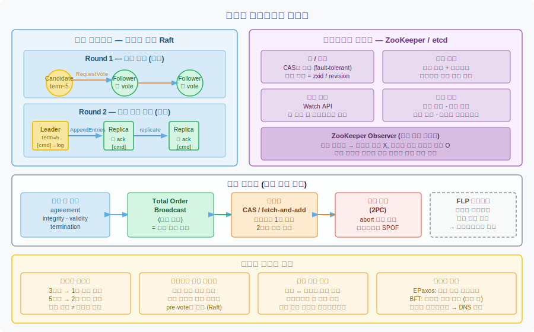

# 10-04. 합의와 코디네이션 서비스
> 분산 시스템에서 여러 노드가 하나의 값에 동의하는 것은 단순해 보이지만, 노드 장애와 네트워크 불확실성 앞에서 수십 년간 연구된 난제입니다. Raft와 ZooKeeper는 그 해답의 실용적 구현입니다.

분산 시스템에서 합의(consensus)는 "모든 노드가 동일한 결정에 동의하게 만드는 것"입니다. 리더 선출, 원자 커밋, 공유 락, 설정 관리—이 모든 문제는 결국 합의로 귀결됩니다. 합의가 어려운 이유는 노드가 죽을 수 있고, 메시지가 유실되거나 지연될 수 있으며, 각자가 세계의 현재 상태를 독립적으로 알 수 없기 때문입니다.

이 노트는 합의 문제의 정의, 핵심 알고리즘인 Raft, 합의와 동치인 문제들, 합의의 비용과 한계, 그리고 ZooKeeper·etcd 같은 코디네이션 서비스를 다룹니다.

## 1. 합의 문제 — 정의와 동치 문제들
> 합의는 네 가지 속성으로 정의되며, 선형화 CAS·공유 로그·원자 커밋과 상호 변환 가능한 동치 관계에 있습니다.

합의 알고리즘이 만족해야 할 속성은 네 가지입니다. **균일 합의(uniform agreement)** 는 모든 노드가 같은 값을 결정한다는 것입니다. 둘 이상의 노드가 서로 다른 값을 결정하는 상황을 금지합니다. **무결성(integrity)** 은 한 번 결정된 값은 변경되지 않는다는 것입니다. 노드가 마음을 바꾸거나 두 번 다른 결정을 내리는 일이 없어야 합니다. **유효성(validity)** 은 결정된 값이 반드시 어떤 노드가 제안한 값이어야 한다는 것입니다. 아무도 제안하지 않은 값을 임의로 결정하는 행위를 막습니다. **종료(termination)** 는 장애가 없는 노드라면 반드시 언젠가 값을 결정한다는 것입니다.

앞의 세 속성—균일 합의, 무결성, 유효성—은 안전성(safety) 속성입니다. "나쁜 일이 일어나지 않는다"는 보장입니다. 종료는 활동성(liveness) 속성입니다. "언젠가 좋은 일이 일어난다"는 보장입니다. 안전성은 절대 위반할 수 없지만, 활동성은 특정 조건(충분한 수의 노드가 동작 중)에서만 보장됩니다.

합의와 동치인 문제들이 있습니다. 이들은 합의를 구현하면 함께 구현되고, 반대로 이들 중 하나를 구현하면 합의를 구현할 수 있습니다.

- **선형화 CAS(Compare-and-Set)**: 레지스터에서 값을 읽고, 예상값과 같을 때만 새 값으로 바꾸는 원자 연산입니다. 여러 노드가 동시에 CAS를 시도할 때 정확히 하나만 성공해야 하므로 합의가 필요합니다.
- **공유 로그(total order broadcast)**: 모든 노드에 동일한 순서로 메시지를 전달하는 것입니다. 메시지 순서 자체가 합의의 결과입니다. 공유 로그와 합의는 상호 변환 가능합니다.
- **선형화 fetch-and-add**: 카운터를 원자적으로 읽고 증가시킵니다. 단 두 노드 한정으로 합의와 동치입니다.
- **원자 커밋(2PC)**: 분산 트랜잭션에서 모든 참여자가 커밋하거나 모두 롤백하도록 강제합니다. 합의와 비슷하지만 abort 규칙이 다릅니다. 합의에서는 어떤 노드가 제안한 값도 결정될 수 있지만, 원자 커밋에서는 단 하나의 참여자라도 abort를 원하면 전체가 abort되어야 합니다.

**FLP 불가능성**은 합의 연구의 이정표입니다. Fischer, Lynch, Paterson이 1985년에 증명한 이 결과는 "결정론적 비동기 모델에서 노드 하나가 크래시할 가능성이 있으면 합의를 항상 보장할 수 없다"는 것입니다. 이것이 종료(활동성)가 위협받는 이유입니다. 실용적 해법은 타임아웃입니다. 알고리즘 자체는 비동기이지만, 타임아웃으로 리더 장애를 감지하고 새 리더를 선출함으로써 활동성을 현실적으로 확보합니다.

## 2. 합의 알고리즘 — 에포크와 쿼럼
> Raft, Paxos 등 모든 실용적 합의 알고리즘은 에포크 번호로 리더 유일성을 보장하고, 두 번의 쿼럼 투표로 안전성을 확보합니다.

주요 합의 알고리즘으로는 Raft, Multi-Paxos, Viewstamped Replication(VR), Zab이 있습니다. 이들은 세부 구현은 다르지만 핵심 구조를 공유합니다.

각 알고리즘은 **에포크 번호**를 사용합니다. Raft에서는 term, Paxos에서는 ballot number, VR에서는 view라고 부릅니다. 에포크 번호는 단조 증가합니다. 같은 에포크 안에서 리더는 최대 한 명뿐입니다. 리더가 죽었다고 의심될 때 새로운 에포크가 시작되고 새 리더 선출 투표가 진행됩니다. 노드가 두 에포크에서 동시에 메시지를 받는다면 번호가 높은 에포크를 우선합니다. 에포크 번호가 높다는 것은 더 최근의 결정이라는 의미입니다.

합의 알고리즘은 두 라운드 투표로 이루어집니다. 첫 번째 라운드는 리더 선출입니다. 후보 노드가 투표를 요청하고, 과반수(쿼럼)의 지지를 얻으면 리더가 됩니다. 두 번째 라운드는 로그 항목 추가입니다. 리더가 클라이언트로부터 명령을 받으면 팔로워에게 AppendEntries 메시지를 보내고, 과반수가 응답하면 해당 항목이 커밋됩니다.

중요한 점은 두 쿼럼이 반드시 겹친다는 것입니다. 리더 선출 쿼럼과 로그 복제 쿼럼이 겹치므로, 새 리더는 이전 리더가 커밋한 항목을 반드시 알고 있는 노드 중에서 선출됩니다. 이것이 안전성의 핵심입니다.

이전 리더 실패 후 로그 정합은 알고리즘마다 다릅니다. Raft에서는 투표 단계에서 로그가 더 최신인 노드만 리더가 될 수 있습니다. 팔로워는 후보의 로그가 자신의 것보다 오래됐다면 투표를 거부합니다. Paxos에서는 어떤 노드도 리더가 될 수 있지만, 리더가 된 후 이전 에포크에서 미완성된 제안을 반드시 먼저 처리(동기화)해야 합니다.

선형화 읽기도 쿼럼 확인이 필요합니다. etcd는 읽기 요청이 현재 리더에서 처리되더라도, 리더가 과반수에게 확인을 받은 후 응답합니다. 이렇게 하지 않으면 네트워크 파티션 상황에서 오래된 리더가 구식 데이터를 반환할 수 있습니다.

## 3. 공유 로그와 상태 머신 복제
> 공유 로그는 합의와 동치이며, 같은 로그를 같은 순서로 결정론적으로 실행하면 모든 복제본이 동일한 상태에 도달합니다.

**공유 로그(total order broadcast)** 는 모든 노드에 동일한 메시지를 동일한 순서로 전달하는 프로토콜입니다. 두 가지 속성이 요구됩니다. 하나는 신뢰 가능한 전달로, 한 노드에 전달된 메시지는 장애 없는 모든 노드에 전달됩니다. 다른 하나는 전체 순서로, 모든 노드에서 동일한 순서로 메시지가 전달됩니다. 공유 로그와 합의는 상호 변환 가능합니다. 공유 로그가 있으면 합의를 구현할 수 있고, 합의 알고리즘이 있으면 공유 로그를 구현할 수 있습니다.

**상태 머신 복제(State Machine Replication, SMR)** 는 공유 로그를 기반으로 합니다. 시작 상태가 동일하고, 같은 로그 항목을 같은 순서로 결정론적으로 실행한다면 모든 복제본은 동일한 상태에 도달합니다. 이것이 데이터베이스의 단일 리더 복제, 분산 KV 스토어, 분산 트랜잭션 처리의 이론적 기반입니다.

상태 머신 복제는 여러 곳에서 응용됩니다. 이벤트 소싱에서는 상태 변경을 이벤트 로그로 기록하고 재실행해 상태를 재구성합니다. 직렬화 트랜잭션에서는 모든 트랜잭션을 저장 프로시저 형태로 로그에 기록하고 결정론적으로 실행합니다. 스트림 처리에서는 입력 스트림을 공유 로그로 보고 연산자를 상태 머신으로 모델링합니다.

공유 로그로 단일 값 합의를 구현하는 방법은 단순합니다. 값을 제안하는 노드들이 각자의 값을 공유 로그에 추가하려 합니다. 첫 번째로 로그에 기록된 항목이 결정된 값입니다. 나중에 추가된 항목들은 결정을 바꾸지 않습니다. 이미 첫 번째 항목을 보았다면 그것이 합의된 값임을 알 수 있습니다.

## 4. 합의의 비용과 한계
> 합의는 강력한 보장을 제공하지만, 과반수 요건과 쿼럼 통신이 처리량과 지연 시간에 구조적 한계를 만듭니다.

합의 알고리즘은 엄격한 과반수를 요구합니다. 3노드 클러스터는 1개 장애를, 5노드 클러스터는 2개 장애를 허용합니다. 일반식은 노드 n개에서 (n-1)/2개까지 장애를 허용하며, 이를 위해 최소 (n+1)/2개의 노드가 응답해야 합니다. 이 요건은 타협이 없습니다.

노드를 추가해도 처리량이 늘지 않습니다. 오히려 줄어들 수 있습니다. 모든 쓰기가 리더를 거쳐 쿼럼에 복제되어야 하므로, 노드가 많아질수록 쿼럼 크기도 커지고 통신 오버헤드가 증가합니다. 다중 리더 복제나 리더 없는 복제는 합의 없이 더 높은 처리량을 달성하지만, 그 대가로 충돌 해소와 인과적 일관성의 복잡도를 감수해야 합니다.

타임아웃 튜닝은 실용적으로 어렵습니다. 타임아웃이 너무 크면 리더 장애 후 복구 시간이 길어집니다. 너무 작으면 일시적 네트워크 지연을 리더 장애로 오인해 불필요한 리더 교체가 일어납니다. 빈번한 리더 교체는 로그 정합 비용과 성능 저하를 유발합니다. Raft에서는 pre-vote 단계를 추가해 이를 완화합니다. 후보가 실제 선거를 시작하기 전에 자신이 선출될 가능성이 있는지 먼저 확인합니다. 이렇게 하면 특정 링크가 불안정할 때 벌어지는 term 번호 무한 증가와 리더십 불안을 줄일 수 있습니다.

지리 분산 배포에서 합의의 비용은 더 두드러집니다. 리더와 팔로워 사이의 왕복 지연이 모든 쓰기 지연에 더해집니다. 데이터센터를 가로지르는 쿼럼 통신은 수십~수백 밀리초를 추가합니다. 다중 리더 복제는 이 지연을 피하지만 충돌 가능성을 감수해야 합니다.

대안적 접근도 연구되어 있습니다. **Egalitarian Paxos(EPaxos)** 는 리더 없는 프로토콜로, 의존 관계가 없는 명령은 어떤 노드에서도 제안하고 커밋할 수 있습니다. 리더 집중 현상을 분산시켜 지역 지연을 줄입니다. **비잔틴 장애 허용(BFT)** 알고리즘은 악의적으로 잘못된 메시지를 보내는 노드를 허용합니다. 블록체인에서 쓰이지만, 노드 3분의 2 이상의 동의가 필요하고 연산 비용이 훨씬 높습니다. 일반적인 데이터 시스템에서는 잘못된 하드웨어나 소프트웨어 버그를 비잔틴 장애가 아닌 크래시 장애로 모델링합니다.

## 5. 코디네이션 서비스 — ZooKeeper와 etcd
> ZooKeeper와 etcd는 합의 알고리즘으로 복제되는 소량 데이터 저장소로, 락·리스·장애 탐지·변경 알림을 통해 분산 시스템의 코디네이션 인프라를 담당합니다.

ZooKeeper와 etcd는 범용 데이터베이스가 아닙니다. 소량의 중요한 메타데이터를 합의 알고리즘으로 복제하여 저장하는 특수 목적 서비스입니다. 전체 데이터를 인메모리에 올려두기 때문에 읽기 지연이 낮습니다. 쓰기는 합의를 거쳐 복제되므로 고쓰기 처리량에는 적합하지 않습니다.

이 서비스들이 제공하는 핵심 기능은 네 가지입니다.

**락과 리스**: 분산 락을 fault-tolerant하게 구현합니다. 클라이언트가 락을 획득하면 리스 시간이 설정됩니다. 클라이언트가 죽으면 리스가 만료되고 락이 자동으로 해제됩니다. 락 획득에는 CAS 연산이 사용되며, 이것이 합의를 통해 구현됩니다.

**펜싱 지원**: 락 또는 리스를 부여할 때 단조 증가하는 ID를 함께 반환합니다. ZooKeeper에서는 zxid, etcd에서는 revision입니다. 이 값이 펜싱 토큰 역할을 합니다. 저장소는 이미 처리한 것보다 낮은 토큰 값의 요청을 거부함으로써, 리스가 만료된 후 뒤늦게 동작하는 좀비 클라이언트를 차단합니다.

**장애 탐지**: 클라이언트는 ZooKeeper와 장기 세션을 유지하며 주기적으로 하트비트를 보냅니다. 세션 내에서 **에페머럴 노드**를 생성할 수 있습니다. 에페머럴 노드는 클라이언트가 죽거나 세션이 만료되면 자동으로 삭제됩니다. 다른 클라이언트들은 이 삭제를 감지해 해당 노드가 사라졌음을 알 수 있습니다.

**변경 알림**: 클라이언트는 특정 키나 디렉토리에 Watch를 등록할 수 있습니다. 해당 키의 값이 변경되거나 에페머럴 노드가 삭제되면 ZooKeeper가 등록된 클라이언트들에게 알림을 보냅니다. 폴링 없이 변경을 감지하는 효율적인 방법입니다.

이 기능들이 결합되어 여러 사용 사례를 지원합니다. **리더 선출**에서는 여러 노드가 동일한 에페머럴 노드를 생성하려 경쟁하고, 성공한 하나가 리더가 됩니다. 리더가 죽으면 에페머럴 노드가 삭제되고 다른 노드들이 알림을 받아 새 선거를 시작합니다. **샤드 할당**에서는 어떤 파티션이 어떤 노드에 할당됐는지를 ZooKeeper에 기록하고, 노드들은 이 정보를 구독합니다. **설정 관리**에서는 클러스터의 공유 설정을 ZooKeeper에 저장하고 변경 시 모든 노드에 자동으로 전파합니다.

**서비스 디스커버리**는 흥미로운 경우입니다. 어떤 서비스가 어느 IP에서 동작하는지를 ZooKeeper에 등록하고 클라이언트가 조회하는 방식으로 쓸 수 있습니다. 하지만 합의가 반드시 필요한지는 의문입니다. DNS는 일관성은 약하지만 캐싱을 통해 훨씬 낮은 지연과 높은 가용성을 제공합니다. 서비스 주소가 자주 바뀌지 않는다면 DNS가 더 적합할 수 있습니다.

**ZooKeeper Observer**는 합의 프로토콜에 투표하지 않는 읽기 전용 복제본입니다. 쿼럼 크기를 늘리지 않고도 읽기 요청을 분산할 수 있습니다. 단, 선형화 읽기를 보장하지 않으므로 약간 오래된 데이터를 반환할 수 있습니다. 지리적으로 분산된 데이터센터에서 읽기 지연을 줄이는 데 유용합니다.

## 자주 받는 오해

**"합의 알고리즘은 항상 종료된다"**: FLP 불가능성이 보여주듯, 결정론적 비동기 모델에서는 노드 하나가 크래시할 가능성만 있어도 종료를 보장할 수 없습니다. Raft와 Paxos가 실용적으로 동작하는 이유는 타임아웃을 도입해 비동기 모델의 한계를 우회하기 때문입니다. 타임아웃 기반 장애 탐지는 확률적으로 작동하며 이론적 보장이 아닙니다.

**"ZooKeeper는 범용 데이터베이스로 쓸 수 있다"**: ZooKeeper와 etcd는 소량의 메타데이터 전용으로 설계되었습니다. 전체 데이터를 인메모리에 올리고, 모든 쓰기가 합의를 거치므로 처리량이 제한됩니다. 수백 MB 이상의 데이터나 높은 쓰기 처리량이 필요하다면 전용 데이터베이스가 적합합니다. ZooKeeper는 "데이터베이스 옆에 있는 코디네이터"입니다.

**"Raft와 Paxos는 거의 같다"**: 두 알고리즘은 에포크 기반 리더십이라는 큰 구조를 공유하지만, 세부에서 중요한 차이가 있습니다. Raft는 리더 선출 시 로그가 더 최신인 노드만 리더가 될 수 있어 복구가 단순합니다. Paxos는 어떤 노드도 리더가 될 수 있지만 로그 동기화 단계가 복잡합니다. Raft는 이해하기 쉽도록 설계됐고 Paxos보다 구현이 직관적이라는 것이 설계 목표였습니다.

## 면접에서 받을 만한 질문

**합의 알고리즘의 4가지 속성(agreement, integrity, validity, termination)을 설명하라**: agreement는 모든 노드가 같은 값을 결정하는 것, integrity는 한 번 결정된 값은 변하지 않는 것, validity는 결정된 값이 반드시 어떤 노드가 제안한 것이어야 하는 것, termination은 장애 없는 노드는 언젠가 반드시 결정한다는 것입니다. 앞 셋은 안전성, termination은 활동성 속성입니다. FLP 불가능성은 비동기 모델에서 termination을 보장할 수 없음을 증명했고, 실용적 알고리즘은 타임아웃으로 이를 우회합니다.

**Raft에서 리더 선출이 두 라운드 투표로 이루어지는 이유는**: 하나의 투표만으로는 이미 커밋된 로그 항목을 새 리더가 모를 수 있습니다. 첫 번째 라운드(리더 선출)의 쿼럼과 두 번째 라운드(로그 복제)의 쿼럼이 반드시 겹치도록 설계했기 때문에, 새 리더는 이전 리더가 커밋한 모든 항목을 알고 있는 노드 집합에서 선출됩니다. 이것이 안전성(이미 커밋된 결정이 사라지지 않는다)의 핵심 메커니즘입니다.

**ZooKeeper가 범용 데이터베이스 대신 코디네이션 서비스로 설계된 이유는**: 합의를 거치는 쓰기는 처리량이 본질적으로 제한됩니다. ZooKeeper는 소량의 중요한 메타데이터(리더 정보, 샤드 할당, 설정, 락)를 신뢰할 수 있게 저장하는 것에 집중하고, 대용량 데이터는 별도의 저장소에 맡깁니다. 모든 데이터를 인메모리에 올리는 설계도 소량 메타데이터를 전제로 합니다. 코디네이션 서비스는 데이터베이스의 "두뇌" 역할을 하고, 데이터베이스는 "몸통"을 담당하는 분업 구조입니다.

## 관련 문서

- [10-01.선형성](./10-01.선형성.md) — 선형화 CAS와 합의의 관계, 선형성이 합의를 암시하는 이유
- [08-04.분산 트랜잭션과 2PC](../../../08-04.분산 트랜잭션과 2PC.md) — 원자 커밋과 합의의 동치 관계, 2PC의 코디네이터 SPOF 문제
- [09-03.진실·거짓·시스템 모델](./09-03.진실·거짓·시스템 모델.md) — 안전성·활동성 구분, 펜싱 토큰, 시스템 모델 정의
