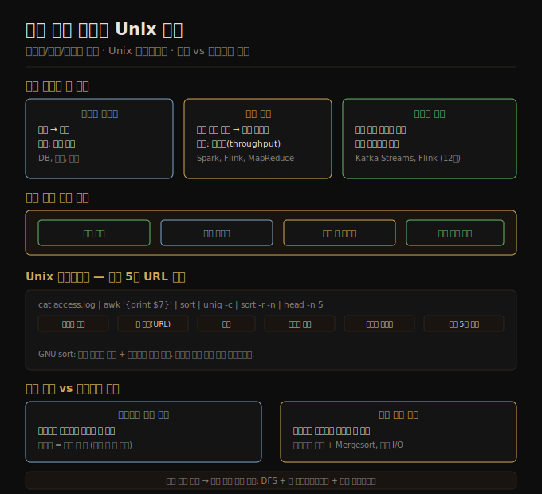

# 배치 처리 개요와 Unix 도구
> 불변 입력을 읽어 새 출력을 만드는 배치 잡은 Unix 파이프라인에서 핵심 원리를 이미 갖추고 있습니다.

이 노트를 읽고 나면 온라인·배치·스트림 처리의 차이를 말하고, Unix 파이프라인이 대용량 로그를 처리하는 원리를 설명하며, 인메모리 집계와 정렬 기반 집계를 어떤 기준으로 고르는지 대답할 수 있습니다.

11장은 배치 처리를 다루며, 이 노트는 그 첫 편입니다. 단일 머신의 Unix 파이프라인에서 배치 처리의 본질을 살피고, 분산 시스템으로 확장할 때 어떤 요소가 필요한지 짚습니다.




## 1. 온라인·배치·스트림 처리 구분
> 처리 방식은 응답을 기다리는 주체와 성능 지표에 따라 세 가지로 나뉩니다.

데이터 처리 시스템은 크게 세 가지로 구분됩니다. 첫째는 **온라인(online) 시스템**입니다. 사람이나 다른 서비스가 요청을 보내면 최대한 빨리 응답을 돌려주는 구조로, 응답 시간(response time)이 핵심 성능 지표입니다. 웹 서버, 데이터베이스 쿼리, REST API가 여기에 해당합니다.

둘째는 **배치 처리(batch processing) 잡**입니다. 읽기 전용 입력 데이터 집합을 받아 새로운 출력 데이터를 생성하는 구조로, 처리가 끝날 때까지 사람이 기다리지 않습니다. 핵심 성능 지표는 처리량(throughput), 즉 단위 시간당 처리한 데이터 양입니다. 로그 집계, 검색 인덱스 빌드, 추천 시스템의 오프라인 특징 계산이 대표적인 예입니다.

셋째는 **스트림 처리(stream processing)**입니다. 이 방식은 배치와 온라인의 경계에 걸쳐 있으며, 끝없이 흘러오는 이벤트를 짧은 지연으로 처리합니다. 12장에서 별도로 다룹니다.

배치 잡에는 중요한 특성이 있습니다. **입력을 불변으로 취급하고 부작용을 만들지 않습니다.** 잡이 실패하더라도 입력 데이터는 그대로이므로 코드를 고친 뒤 재실행하면 됩니다. 이런 구조는 인간 결함 내성(human fault tolerance)을 높여, 버그가 있는 코드가 돌아도 데이터가 영구적으로 망가지지 않습니다. 또한 잡 전체를 모니터링하거나 데이터 품질을 검사하는 별도 잡을 덧붙이기도 쉽습니다.


## 2. Unix 파이프라인으로 배우는 배치 처리 원리
> Unix 파이프라인은 단일 책임 명령을 표준 인터페이스로 연결해, GB 규모 로그를 수초 안에 처리하는 배치 처리 원리를 단일 머신에서 구현합니다.

NGINX 액세스 로그에서 가장 많이 요청된 URL 상위 5개를 뽑는다고 합시다. Unix 파이프라인으로 이렇게 쓸 수 있습니다.

```bash
cat access.log | awk '{print $7}' | sort | uniq -c | sort -r -n | head -n 5
```

각 단계의 역할은 명확합니다.

- `cat access.log` — 로그 파일을 레코드(행) 단위로 읽어 스트림으로 냅니다.
- `awk '{print $7}'` — 각 행의 7번째 필드, 즉 요청 URL만 추출합니다.
- `sort` — URL을 사전순으로 정렬합니다. 같은 URL이 모이도록 하는 핵심 단계입니다.
- `uniq -c` — 연속으로 같은 행의 개수를 세어 `횟수 URL` 형태로 출력합니다.
- `sort -r -n` — 숫자 기준 내림차순으로 재정렬해 가장 많이 등장한 URL이 위로 올라오게 합니다.
- `head -n 5` — 상위 5개만 남깁니다.

GB 단위 로그도 이 파이프라인으로 수초 안에 처리할 수 있습니다. Unix 파이프라인이 이처럼 빠른 이유는 각 명령이 단일 책임(single responsibility)을 가지고, 연결은 표준 인터페이스인 `stdin`과 `stdout`으로만 이뤄지기 때문입니다. 각 명령은 다른 명령의 내부를 모릅니다. 이 조합 가능성(composability)이 Unix 철학의 핵심이고, 분산 배치 처리 프레임워크도 같은 원리를 대규모로 확장한 것입니다.


## 3. 명령 파이프라인 vs 커스텀 프로그램
> Unix 파이프라인은 정렬로 디스크를 활용하고, 커스텀 프로그램은 인메모리 해시로 속도를 올리되 워킹셋이 메모리에 들어와야 합니다.

같은 작업을 Python으로 구현하면 다음과 같습니다.

```python
from collections import defaultdict

counts = defaultdict(int)
with open("access.log") as f:
    for line in f:
        url = line.split()[6]
        counts[url] += 1

top5 = sorted(counts.items(), key=lambda x: x[1], reverse=True)[:5]
for url, count in top5:
    print(count, url)
```

두 방식의 차이는 집계 구조에 있습니다. Python 코드는 모든 URL과 카운터를 **인메모리 해시 테이블(defaultdict)**에 저장합니다. 메모리에 들어오는 워킹셋이라면 빠르지만, 워킹셋이 메모리를 초과하는 순간 OOM이 발생하거나 심각하게 느려집니다.

Unix 파이프라인은 `sort` 명령을 중심으로 **정렬 기반** 접근을 취합니다. 정렬은 중간 결과를 디스크로 스필(spill)할 수 있어, 메모리보다 훨씬 큰 데이터도 처리합니다. 여기서 중요한 사실이 있습니다. **워킹셋은 로그 파일의 총 행 수가 아니라 고유 URL의 수 × 카운터 크기입니다.** URL 분포가 균일하면 고유 URL 수가 많아 워킹셋이 크고, 소수의 URL이 대부분의 요청을 차지하면 워킹셋은 작아집니다. 워킹셋이 메모리에 충분히 들어오는 상황이라면 Python 방식이 더 빠르고, 그렇지 않으면 파이프라인이 안정적입니다.


## 4. 정렬 vs 인메모리 집계
> 워킹셋이 메모리 안에 들어오면 인메모리 해시가 유리하고, 초과하면 세그먼트 파일과 병합 정렬을 활용하는 정렬 기반이 유리합니다.

인메모리 집계와 정렬 기반 집계의 선택 기준을 정리하면 다음과 같습니다.

**인메모리 해시 집계**는 고유 키(URL, 사용자 ID 등)의 수가 적어 워킹셋이 메모리에 들어올 때 유리합니다. 임의 접근이 가능해 각 키의 카운터를 O(1)로 갱신하고, 정렬 오버헤드가 없습니다. 반면 워킹셋이 메모리를 초과하면 디스크 스왑이 발생해 성능이 급락합니다.

**정렬 기반 집계**는 먼저 데이터를 정렬해 같은 키가 연속으로 모이게 한 뒤, 연속 구간을 한 번 스캔해 집계합니다. GNU sort 같은 현대 구현은 메모리 임계를 넘으면 자동으로 세그먼트 파일을 디스크에 쓰고(스필), 마지막에 **병합 정렬(merge sort)**로 합칩니다. 멀티코어 병렬 정렬도 지원합니다. 덕분에 메모리보다 훨씬 큰 데이터도 안정적으로 처리합니다.

성능의 실제 병목은 대부분 정렬 연산이 아니라 **입력 파일 읽기 속도**입니다. 순차 I/O는 SSD에서도 빠르기 때문에, 로그 파일을 한 번 순차적으로 읽는 파이프라인은 디스크 대역폭을 거의 다 활용합니다.

단일 머신의 한계는 명확합니다. 입력이 한 머신의 디스크와 메모리 용량을 초과하거나, 처리 시간이 요구사항을 충족하지 못하면 분산 배치 처리가 필요합니다. 이것이 MapReduce와 그 후계자들이 등장한 맥락입니다.


## 5. 배치 처리의 구성 요소 — 분산 운영체제 유추
> 단일 머신의 파일시스템·커널·프로세스 세 요소는 분산 배치에서 분산 파일시스템·잡 오케스트레이터·처리 프레임워크로 대응됩니다.

Unix 파이프라인은 세 가지 요소로 돌아갑니다. 저장 장치(파일시스템), 프로세스 스케줄러(커널), 그리고 파이프로 연결된 프로세스들입니다. 분산 배치 처리도 동일한 세 역할이 필요합니다.

**분산 파일시스템**은 단일 머신 파일시스템의 자리를 맡습니다. 초기에는 HDFS(Hadoop Distributed File System)가 지배적이었고, 지금은 클라우드 오브젝트 스토리지(S3, GCS, Azure Blob)로 무게중심이 이동했습니다. 오브젝트 스토리지는 컴퓨트와 스토리지를 분리해 각각 독립적으로 확장할 수 있게 합니다.

**잡 오케스트레이터**는 커널의 역할, 즉 언제 어떤 잡을 실행하고 의존성을 어떻게 다루는지를 맡습니다. Hadoop 생태계의 Oozie, Azkaban이 초기 대표 주자였으며, 현재는 Airflow, Dagster, Prefect가 널리 쓰입니다.

**처리 프레임워크**는 실제 데이터를 읽고 변환하고 쓰는 프로세스 역할을 합니다. Hadoop MapReduce가 이 역할의 선구자였으나, 중간 데이터를 매번 디스크에 쓰는 방식의 한계가 드러났습니다. Apache Spark는 중간 결과를 메모리에 유지하는 DAG 실행 모델로 MapReduce보다 훨씬 빠른 처리를 가능하게 했고, Apache Flink는 배치와 스트림을 통합된 모델로 처리합니다.

클라우드로의 전환에서 핵심 변화는 **컴퓨트와 스토리지의 분리**입니다. HDFS는 데이터를 여러 노드에 분산 저장해 컴퓨트와 스토리지를 같은 노드에 두는 데이터 지역성(data locality)을 강조했지만, 오브젝트 스토리지 환경에서는 네트워크 대역폭이 충분히 빨라져 굳이 같은 노드에 둘 필요가 없어졌습니다. 이 변화는 잡 단위로 컴퓨트 자원을 켜고 끄는 비용 최적화를 가능하게 했습니다.


## 자주 받는 오해

1. **"배치 처리는 하루에 한 번 실행하는 야간 잡이다"** — 배치 잡은 실행 주기가 본질이 아닙니다. 분 단위, 시간 단위로도 배치 잡을 돌릴 수 있으며, 핵심은 처리량 최적화와 불변 입력 구조입니다. 실행 주기보다 "입력을 불변으로 읽어 새 출력을 만드는가"가 배치 처리의 정의에 가깝습니다.
2. **"정렬 기반 파이프라인은 인메모리 해시보다 항상 느리다"** — 워킹셋(고유 키 수 × 카운터 크기)이 메모리를 초과하면 정렬이 더 유리합니다. GNU sort는 자동 디스크 스필과 병합 정렬을 지원해, 메모리보다 큰 데이터도 안정적으로 처리합니다. 실제 병목은 대부분 정렬 연산이 아니라 입력 파일 읽기 속도입니다.
3. **"배치 잡에서 버그가 나면 데이터가 망가진다"** — 배치 잡은 입력을 불변으로 취급하고 새 출력만 생성합니다. 버그가 있는 잡이 돌아도 입력 데이터는 그대로이므로, 코드를 수정한 뒤 잡을 재실행하면 올바른 출력을 얻을 수 있습니다. 이것이 배치 처리의 인간 결함 내성(human fault tolerance)입니다.


## 면접에서 받을 만한 질문

1. **배치 처리와 온라인 처리의 핵심 차이는 무엇이며, 각각의 성능 지표는?** — 온라인 처리는 요청이 오면 응답을 최대한 빨리 돌려주는 구조로 응답 시간이 핵심 지표입니다. 배치 처리는 불변 입력 전체를 읽어 새 출력을 만드는 구조로 처리량이 핵심 지표입니다. 온라인은 사람 또는 서비스가 결과를 기다리지만, 배치는 잡이 완료되기까지 사람이 기다리지 않으며 재실행이 자유롭습니다.
2. **Unix 파이프라인이 대용량 로그를 효율적으로 처리할 수 있는 이유는?** — 각 명령이 단일 책임을 가지고 `stdin`/`stdout`이라는 표준 인터페이스로만 연결되기 때문입니다. 특히 `sort`는 메모리 임계를 넘으면 자동으로 디스크에 세그먼트를 스필하고 병합 정렬로 합쳐, 메모리보다 큰 데이터도 안정적으로 처리합니다. 실제 병목은 대부분 입력 파일의 순차 읽기 속도입니다.
3. **인메모리 집계와 정렬 기반 집계를 어떤 기준으로 선택해야 하는가?** — 워킹셋(고유 키 수 × 카운터 크기)이 메모리에 들어오면 인메모리 해시가 O(1) 갱신으로 빠릅니다. 워킹셋이 메모리를 초과하면 정렬 기반이 안정적입니다. 데이터 규모뿐 아니라 키 분포도 고려해야 합니다. 소수의 URL이 대부분의 트래픽을 차지하는 분포라면 고유 키가 적어 인메모리가 유리하고, 키가 균일하게 분산되면 워킹셋이 커져 정렬 기반이 낫습니다.


## 관련 문서

> 이 노트는 11장 배치 처리의 첫 편으로, 분산 파일시스템과 MapReduce 노트로 이어집니다.

- [11-02 분산 파일시스템과 오브젝트 스토어](./11-02.분산%20파일시스템과%20오브젝트%20스토어.md) — 분산 환경으로의 확장
- [04-02 LSM 저장 엔진](./04-02.LSM%20저장%20엔진.md) § "SSTable 구성과 병합" — 세그먼트 파일과 병합 정렬 원리
- [01-01 운영 시스템 vs 분석 시스템](./01-01.운영%20시스템%20vs%20분석%20시스템.md) § "OLTP vs OLAP" — 배치 처리가 주로 쓰이는 분석 워크로드 맥락
- [ddia2 README — 2판 정독 인덱스](./README.md)
