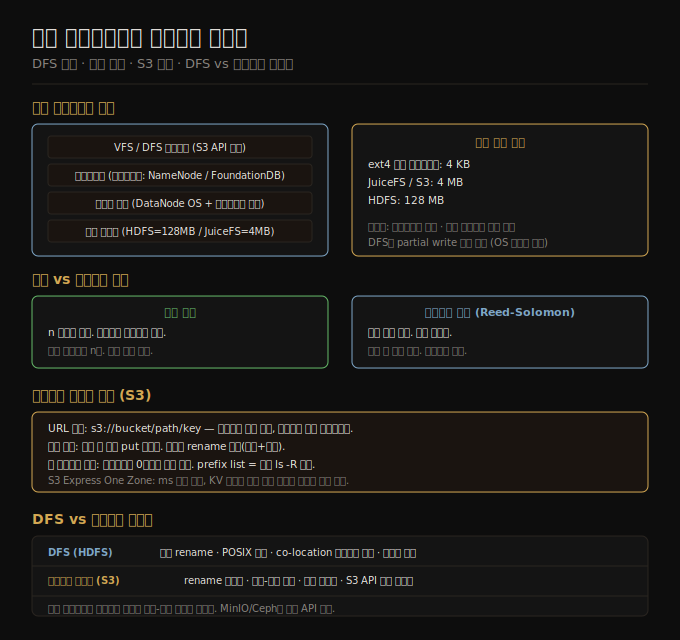

# 분산 파일시스템과 오브젝트 스토어
> 배치 처리가 대량의 데이터를 다루려면 그 데이터를 어디에 어떤 방식으로 쌓아 둘지가 먼저입니다.

이 노트를 읽고 나면 분산 파일시스템의 계층 구조와 오브젝트 스토어의 불변 객체 모델을 각각 설명하고, 두 저장소가 복제·이레이저 코딩·원자적 rename·디렉토리 유무에서 어떻게 다른지 구분하며, 계산-저장 분리 아키텍처가 왜 현대 클라우드 환경에서 선호되는지 말할 수 있습니다.

배치 처리 시스템은 항상 두 가지를 묶어서 생각해야 합니다 — 어떻게 연산할 것인가, 그리고 그 연산의 입출력 데이터를 어디에 담을 것인가. Unix 파이프라인이 로컬 디스크와 파이프를 전제하듯, 분산 배치 처리는 클러스터 전체에 걸친 저장 계층을 전제합니다. 이 저장 계층을 구현하는 두 접근이 **분산 파일시스템(DFS)** 과 **오브젝트 스토어**입니다.

## 1. 분산 파일시스템 구조
> 단일 머신 파일시스템의 계층 구조가 클러스터 전체로 그대로 펼쳐집니다.

단일 머신에서 파일 하나를 읽으면 다음 계층을 순서대로 거칩니다. 블록 디바이스 드라이버가 실제 디스크에서 블록을 읽어 오면, OS 페이지 캐시가 그 블록을 메모리에 캐시하고, ext4나 XFS 같은 파일시스템이 블록 위에 파일·디렉토리·권한 개념을 올립니다. VFS(Virtual Filesystem Switch)는 이 파일시스템들 위에 단일 인터페이스를 씌워 애플리케이션이 어떤 파일시스템이든 동일한 syscall로 다룰 수 있게 합니다.

분산 파일시스템도 이 계층 구조를 그대로 따릅니다. 차이는 각 계층이 여러 머신에 걸쳐 구현된다는 점입니다.

**블록 크기와 메타데이터 오버헤드.** 단일 머신의 ext4는 기본 블록 크기가 4KB입니다. HDFS는 128MB, JuiceFS와 S3 내부는 4MB를 씁니다. 블록이 클수록 같은 파일을 저장할 때 블록 수가 줄어들어 메타데이터(블록 위치 정보)가 적게 필요하고, NameNode처럼 메타데이터를 메모리에 올려 두는 서비스의 부담이 줄어듭니다. 탐색(seek) 오버헤드도 비례해서 줄어듭니다 — 블록 하나를 찾는 데 드는 네트워크 왕복이 적어지기 때문입니다.

**DataNode와 메타데이터 서비스.** HDFS의 경우 각 클러스터 머신에서 DataNode 데몬이 실행되며 로컬 디스크에 블록을 저장하고 읽기·쓰기 요청을 처리합니다. GlusterFS는 같은 역할을 glusterfsd가 담당합니다. 메타데이터 — 어떤 파일이 어느 DataNode의 어느 블록에 있는지 — 는 HDFS의 경우 NameNode 하나가 메모리에서 관리하고, DeepMind가 개발한 3FS는 FoundationDB를 메타데이터 백엔드로 씁니다. NameNode가 단일 장애점인 것은 HDFS의 오랜 약점이었고, 이를 해결하기 위해 HA NameNode 구성이 도입됐습니다.

**분산 페이지 캐시.** 단일 머신의 OS 페이지 캐시에 대응하는 계층도 분산 파일시스템에 존재합니다. DataNode가 돌아가는 OS의 페이지 캐시가 블록을 캐시하고, JuiceFS 같은 클라이언트 사이드 캐시 계층은 로컬 디스크까지 써서 원격 스토리지 왕복을 줄입니다. 이 캐시 계층의 유무와 크기는 반복 읽기가 많은 배치 잡의 성능을 좌우합니다.

## 2. 복제와 이레이저 코딩
> 단순 복제는 읽기 로컬리티를 얻고, 이레이저 코딩은 저장 효율을 얻는 대신 복구 연산을 감수합니다.

클러스터에 퍼진 디스크 중 하나가 고장 나면 그 위의 데이터도 사라집니다. 분산 파일시스템은 이 내결함성 문제를 두 방식으로 해결합니다.

**단순 복제(replication).** 가장 직관적인 방법은 동일한 블록을 여러 DataNode에 n개 복사해 두는 것입니다. HDFS 기본값은 복제 인수 3입니다. 내결함성 이외에 읽기 로컬리티(read locality)라는 부가 이점이 있습니다 — MapReduce나 Spark 같은 배치 프레임워크가 데이터가 있는 DataNode에 연산 태스크를 우선 배치하면 네트워크 전송 없이 로컬 디스크에서 읽을 수 있습니다. 단점은 저장 오버헤드입니다. 복제 인수 n이면 원본 데이터의 n배 디스크가 필요합니다.

**이레이저 코딩(erasure coding).** Reed-Solomon 같은 알고리즘을 쓰면 k개 데이터 샤드와 m개 패리티 샤드를 만들어, 어느 m개 샤드가 사라져도 나머지 k개로 복구할 수 있습니다. 예를 들어 k=6, m=3이면 총 9개 샤드로 원본의 1.5배 저장 공간만 씁니다 — 복제 인수 3의 3배 대비 절반입니다. HDFS도 Erasure Coding 정책을 지원합니다. 트레이드오프는 복구 시 계산 비용입니다. 단순 복제는 잃어버린 블록의 다른 복사본을 바이트 그대로 복사하면 되지만, 이레이저 코딩은 남은 샤드들로 XOR·갈루아 체 연산을 해서 원본을 재구성해야 합니다. 또한 데이터를 읽을 때 다수의 샤드를 모아야 하므로 읽기 로컬리티를 얻기 어렵습니다.

**RAID와의 유사성.** 이레이저 코딩은 RAID-5나 RAID-6와 원리가 같습니다. 차이는 RAID가 한 머신의 여러 디스크를 묶는 반면, 분산 파일시스템의 이레이저 코딩은 샤드를 여러 머신의 디스크에 분산한다는 점입니다. 머신 한 대가 통째로 내려가도 복구할 수 있습니다.

## 3. 오브젝트 스토어 특성
> 오브젝트 스토어는 URL로 접근하는 불변 데이터 덩어리를 저장합니다 — 파일시스템의 계층 구조나 부분 수정은 없습니다.

오브젝트 스토어에서 데이터의 주소는 `s3://bucket/prefix/key` 형태의 URL입니다. 슬래시는 네이밍 관례일 뿐 실제 디렉토리 계층이 아닙니다. 이 단순한 사실에서 파일시스템과의 핵심 차이가 대부분 파생됩니다.

**불변 객체.** S3에 올린 객체는 수정할 수 없습니다. 특정 바이트만 바꾸는 in-place 수정이 없습니다. 파일을 "수정"하려면 새 버전을 전체 PUT으로 재작성해야 합니다. Azure Data Lake Storage Gen2와 S3 Express One Zone은 append 연산을 지원하지만, 범용 S3는 그렇지 않습니다.

**디렉토리 없음.** 오브젝트 스토어에는 디렉토리 개념이 없습니다. `ls /data/2024/` 같은 접근은 `prefix=data/2024/`로 시작하는 키를 나열하는 접두사 목록(prefix list) API로 구현됩니다. 빈 디렉토리를 만들 수 없고, 디렉토리 삭제는 해당 접두사를 가진 모든 키를 개별적으로 삭제하는 것입니다.

**원자적 rename 없음.** 파일시스템에서 rename은 메타데이터만 바꾸는 원자적 연산입니다. 오브젝트 스토어에서 "rename"은 원본을 새 키에 복사한 뒤 원본을 삭제하는 두 단계입니다. 두 단계 사이에 실패하면 원본과 사본이 둘 다 남습니다. 이것은 MapReduce나 Spark 같은 배치 프레임워크가 출력 커밋(output commit) 패턴을 신중하게 구현해야 하는 이유입니다 — 잡이 성공했을 때만 임시 경로의 결과를 최종 경로로 옮겨야 하는데, 원자적 rename이 없으면 이 과정이 복잡해집니다.

**저지연 방향.** S3 Express One Zone은 표준 S3 대비 밀리초 단위 지연을 목표로 설계됐습니다. 단일 가용 영역(AZ)에만 저장해 지리적 분산을 포기하는 대신 응답 속도를 높였습니다. 가격 모델도 KV 스토어에 가깝게 요청 단위 과금이 줄어들었습니다.

## 4. DFS vs 오브젝트 스토어 비교
> 계산-저장 co-location이 필요하면 DFS, 탄력적 스케일과 저비용 저장이 우선이면 오브젝트 스토어입니다.

| 항목 | DFS (HDFS 등) | 오브젝트 스토어 (S3 등) |
|------|--------------|------------------------|
| 기본 블록 크기 | 128MB | 4MB |
| 원자적 rename | 가능 | 불가 (복사+삭제) |
| 디렉토리 | 있음 | 없음 (접두사 관례) |
| 계산-저장 배치 | co-location 가능 | 분리 (별도 과금) |
| POSIX 호환 | 가능 (FUSE 마운트) | 미지원 (FUSE 우회 가능) |
| 잠금 / 심볼릭 링크 | 지원 | 미지원 |
| 주요 용도 | Hadoop 생태계, 온프레미스 | 클라우드 배치, 저비용 저장 |

**저장·연산 분리.** 전통적인 Hadoop 설계는 데이터가 있는 DataNode에 연산 태스크를 붙이는 계산-저장 co-location으로 네트워크 전송을 줄였습니다. 오브젝트 스토어는 저장과 연산이 물리적으로 분리됩니다. 데이터를 읽으려면 반드시 네트워크를 건너야 합니다. 그러나 현대 데이터센터의 25Gbps 이상 NIC와 고속 스위치 패브릭은 이 대역폭 문제를 상당 부분 해결했습니다. AWS re:Invent 2022 기준 S3 Express One Zone은 300Gbps 이상의 집계 처리량을 제공합니다. 저장과 연산을 분리하면 CPU 집약적인 워크로드에 컴퓨팅만, 저장 집약적 워크로드에 스토리지만 독립적으로 스케일할 수 있습니다. 온프레미스 HDFS 클러스터처럼 저장이 모자라면 연산도 같이 늘려야 하는 제약이 사라집니다.

**S3 호환 API 확산.** 오브젝트 스토어의 사실상 표준은 S3 API입니다. 온프레미스 MinIO, Cloudflare R2, Backblaze B2, Tigris, Ceph의 Rados Gateway가 모두 S3 호환 API를 제공합니다. 배치 프레임워크가 S3를 지원하면 이 모든 저장소를 추가 코드 없이 사용할 수 있습니다. 심지어 기존 HDFS 클러스터도 S3 호환 인터페이스를 노출해 같은 클라이언트로 접근할 수 있도록 확산되고 있습니다.

## 5. VFS 유추 — 플러그어블 스토리지 인터페이스
> VFS가 파일시스템 구현을 애플리케이션에서 숨기듯, S3 API 표준화는 배치 프레임워크가 저장소 구현에 의존하지 않게 합니다.

Linux의 VFS는 ext4든 XFS든 tmpfs든 같은 `open()`, `read()`, `write()` syscall로 다룰 수 있게 합니다. 분산 배치 생태계에서 이 역할을 S3 API가 수행하고 있습니다. Spark, Trino, Flink가 S3 지원을 내장하면 MinIO부터 Cloudflare R2까지 S3 호환 저장소는 모두 동일한 코드 경로로 쓸 수 있습니다.

**FUSE와 NFS 기반 DFS.** Amazon EFS나 Archil 같은 서비스는 NFS 클라이언트 하나를 마운트 포인트로 제공하고 내부는 분산 저장으로 구현합니다. 클라이언트는 기존 파일시스템처럼 다루면서 내결함성과 확장성을 얻습니다. FUSE(Filesystem in Userspace)로 S3를 파일시스템처럼 마운트하는 도구(s3fs, mountpoint-s3)도 POSIX 의미론이 필요한 레거시 애플리케이션을 오브젝트 스토어 위에서 실행할 때 씁니다.

**shared-nothing vs shared-disk.** HDFS는 각 DataNode가 자신의 로컬 디스크만 소유하는 shared-nothing 아키텍처입니다. NAS(Network-Attached Storage)나 SAN(Storage Area Network)은 여러 서버가 같은 디스크 풀을 공유하는 shared-disk 아키텍처입니다. SAN은 전용 Fibre Channel 하드웨어와 스위치가 필요하고 가격이 높습니다. DFS는 범용 이더넷 네트워크로 shared-nothing의 이점을 얻는 방향을 택했습니다. 오브젝트 스토어는 엄밀히는 shared-disk에 가깝지만, 불변 객체 모델 덕분에 잠금 없이 다수 클라이언트가 동시에 접근할 수 있습니다.

## 자주 받는 오해

1. **"S3는 파일시스템이므로 rename도 원자적이다"** — S3에서 rename은 원본을 새 키에 복사한 뒤 원본을 삭제하는 두 단계이며, 두 단계 사이에 장애가 나면 데이터가 두 위치에 남습니다. 원자적 rename을 전제하는 배치 프레임워크 커밋 프로토콜은 S3 위에서 별도 처리가 필요합니다.

2. **"HDFS 블록이 크면 작은 파일도 128MB를 차지한다"** — 900MB 파일의 마지막 블록은 실제로 4MB만 사용합니다. 로컬 파일시스템의 블록 낭비(internal fragmentation)처럼 나머지 124MB 디스크가 비워진 채 점유되지는 않습니다. 다만 수백만 개의 작은 파일이 있으면 NameNode가 각 파일마다 블록 메타데이터를 메모리에 들고 있어야 해서 메타데이터 메모리가 병목이 될 수 있습니다.

3. **"클라우드에서는 DFS 대신 S3만 쓰면 된다"** — 계산-저장 co-location이 성능에 결정적인 워크로드, 원자적 rename이 필요한 커밋 패턴, POSIX 의미론(잠금·심볼릭 링크)을 요구하는 레거시 도구가 있으면 DFS가 여전히 유용합니다. 많은 클라우드 배치 시스템이 성능이 중요한 임시 셔플 데이터는 로컬 SSD나 HDFS에 두고 최종 결과만 S3에 쓰는 혼합 방식을 씁니다.

## 면접에서 받을 만한 질문

1. **HDFS와 S3의 핵심 차이 세 가지는?** — 원자적 rename 지원 여부(HDFS 가능, S3 불가), 디렉토리 계층 존재 여부(HDFS 있음, S3 없음), 계산-저장 co-location 가능 여부(HDFS 가능, S3 분리)입니다. 블록 크기(128MB vs 4MB)와 POSIX 호환 여부도 자주 언급됩니다.

2. **오브젝트 스토어에서 빈 디렉토리가 존재하지 않는 이유와 관례적 처리 방법은?** — 오브젝트 스토어는 버킷 내 평면 키-값 구조이고 슬래시는 키 이름의 일부에 불과합니다. 디렉토리 자체를 나타내는 메타데이터가 없으므로 빈 디렉토리는 표현할 방법이 없습니다. 관례적으로 `folder/` 접미사(길이 0 바이트 객체)를 만들거나, 일부 도구는 단순히 접두사 목록 API로 디렉토리 존재를 추론합니다.

3. **저장과 연산을 분리하는 아키텍처의 장단점은?** — 장점은 저장과 컴퓨팅을 독립적으로 스케일할 수 있고, 저장 비용이 범용 클라우드 스토리지 단가로 낮아지며, 클러스터를 내렸다 올려도 데이터가 유지된다는 점입니다. 단점은 데이터를 읽을 때 반드시 네트워크를 건너야 해서 네트워크 대역폭이 병목이 될 수 있고, 읽기 로컬리티 최적화가 불가능해 co-location 방식보다 지연이 높을 수 있다는 점입니다.

## 관련 문서

- [11-01.배치 처리 개요와 Unix 도구](./11-01.배치 처리 개요와 Unix 도구.md) — 배치 처리 기초와 Unix 파이프라인 모델
- [11-03.분산 잡 오케스트레이션과 MapReduce](./11-03.분산 잡 오케스트레이션과 MapReduce.md) — DFS 위에서 실행되는 잡 구조와 오케스트레이션
- [06-01.복제 개요와 단일 리더](../../../06_replication/06-01.복제 개요와 단일 리더.md) — 복제 원리 (분산 파일시스템 복제의 기반 개념)
