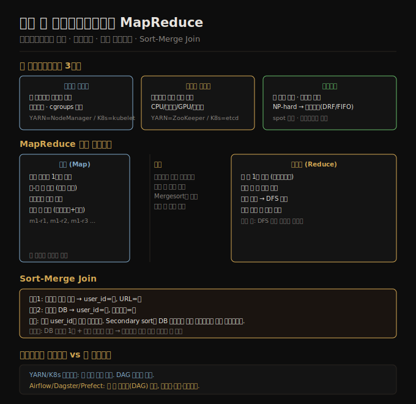

# 분산 잡 오케스트레이션과 MapReduce
> 잡 오케스트레이터는 분산 운영체제처럼 자원을 배분하고, MapReduce는 그 위에서 정렬·셔플로 대규모 조인과 집계를 네트워크 요청 없이 처리합니다.

이 노트를 읽고 나면 YARN과 Kubernetes가 배치 잡을 어떻게 스케줄링하는지 설명하고, MapReduce의 4단계(입력 읽기·매핑·셔플·리듀싱)를 순서대로 서술하며, Sort-Merge Join에서 Secondary Sort가 왜 필요한지 말할 수 있습니다.

배치 처리는 단순히 "큰 파일을 처리하는 것"이 아닙니다. 수천 대 노드에서 잡을 실행하려면 자원 할당, 실패 복구, 잡 간 의존성 관리라는 세 가지 문제를 동시에 풀어야 합니다. 11장은 그 구조를 잡 오케스트레이터 수준에서 먼저 설명하고, 그 위에서 동작하는 MapReduce 알고리즘으로 내려갑니다.

## 1. 잡 오케스트레이터 구조
> 잡 오케스트레이터는 스케줄러·파일시스템·프로세스 실행기로 구성된 분산 운영체제이며, 태스크 실행·자원 추적·스케줄링을 세 컴포넌트가 분담합니다.

배치 처리 시스템을 분산 운영체제로 보면 구조가 명확해집니다. 단일 노드 OS가 스케줄러·파일시스템·프로세스 관리자를 갖듯, 분산 잡 오케스트레이터도 동일한 세 역할을 클러스터 전체에 걸쳐 수행합니다.

잡을 실행하려면 요청 메타데이터가 필요합니다. 태스크 수, 태스크당 메모리·CPU·디스크 요구량, 잡 ID, 자격증명, 입출력 경로, 실행 코드 위치가 여기에 해당합니다. 이 메타데이터를 바탕으로 세 컴포넌트가 협력합니다.

**태스크 실행기**는 노드 수준의 에이전트입니다. YARN에서는 NodeManager, Kubernetes에서는 kubelet이 이 역할을 맡습니다. 실행 코드를 가져와 실행하고, 주기적으로 하트비트를 상위 컴포넌트에 전송하며, cgroups로 CPU·메모리 사용량을 격리합니다.

**리소스 매니저**는 클러스터 전역 상태를 추적합니다. YARN의 ResourceManager, Kubernetes의 etcd가 여기에 해당합니다. 각 노드의 CPU·GPU·메모리·디스크·네트워크 위치를 파악하고, 태스크 실행기의 하트비트로 상태를 갱신합니다.

**스케줄러**는 잡 요청을 수신해 태스크를 어느 노드에 배치할지 결정하고, 태스크 실행기에 지시를 보냅니다. 잡 단위 스케줄링만으로는 복잡한 애플리케이션을 다루기 어려워서, 애플리케이션별 서브스케줄러가 추가됩니다. YARN에서는 ApplicationMaster, Kubernetes에서는 operator가 이 역할을 합니다. 서브스케줄러는 특정 프레임워크(Spark, Flink 등)의 실행 특성을 이해하고, 리소스 매니저와 협력해 태스크를 세밀하게 배치합니다.

## 2. 스케줄러 자원 할당 문제
> 스케줄링은 NP-hard 문제이므로 FIFO·DRF·선점 등 휴리스틱을 사용하며, gang scheduling·스타베이션·선점 각각이 활용률과 공정성 사이에서 서로 다른 트레이드오프를 만듭니다.

160코어 클러스터에 각각 100코어를 요구하는 잡 A와 잡 B가 동시에 제출된다고 가정합니다. 둘을 동시에 실행할 수 없으므로 스케줄러는 선택을 해야 합니다.

**Gang scheduling**은 잡이 필요한 모든 자원을 한 번에 확보할 때까지 실행을 미루는 방식입니다. 잡 A가 100코어를 모두 확보하면 잡 B는 기다립니다. 단순하지만 자원이 부분적으로 할당된 채 idle 상태가 발생해 클러스터 활용률이 낮아집니다. 두 잡이 서로 상대방의 자원을 기다리면 데드락이 발생할 수도 있습니다.

**선점(preemption)**은 실행 중인 낮은 우선순위 태스크를 중단시키고 자원을 빼앗는 방식입니다. 중단된 태스크는 나중에 재시작해야 하므로, 태스크가 재시작 가능하도록 설계되어 있어야 합니다. 클라우드의 spot 인스턴스(EC2 Spot, Azure Spot VM, GCP Preemptible)가 이 원리를 활용합니다. 저렴한 가격에 자원을 빌리되, 다른 워크로드가 자원을 요구하면 언제든 중단될 수 있습니다.

**스타베이션(starvation)**은 선점 없이 FIFO나 우선순위 큐를 쓸 때 발생합니다. 높은 우선순위의 잡이 계속 제출되면, 낮은 우선순위의 잡은 자원을 영원히 얻지 못합니다.

스케줄링은 근본적으로 NP-hard 문제입니다. 최적 해를 구하는 것이 현실적으로 불가능하기 때문에, 실제 시스템은 FIFO, Dominant Resource Fairness(DRF), 용량 기반 스케줄링, bin packing 등 휴리스틱을 조합해 사용합니다. 어떤 휴리스틱을 선택하느냐는 클러스터 활용률, 공정성, 지연 시간 보장이라는 목표 사이의 트레이드오프 결정입니다.

## 3. 워크플로우 스케줄러
> 잡 오케스트레이터는 잡 단위를 담당하고, 잡 간 DAG 의존성은 Airflow·Dagster·Prefect 같은 워크플로우 스케줄러가 별도로 관리합니다.

대규모 데이터 파이프라인은 단일 잡으로 끝나지 않습니다. 이전 잡의 출력이 다음 잡의 입력이 되는 방향성 비순환 그래프(DAG)로 구성됩니다. 예를 들어 로그 정제 잡 → 집계 잡 → 보고서 생성 잡이 순서대로 실행되어야 할 때, 각 잡은 앞 잡이 성공적으로 완료된 뒤에야 시작할 수 있습니다.

워크플로우가 필요한 이유는 세 가지로 정리할 수 있습니다. 여러 팀의 잡이 같은 클러스터를 공유하기 때문에 의존성을 명시적으로 관리해야 합니다. 서로 다른 도구(Spark 잡과 Python 스크립트 등) 사이에 데이터를 이전할 때 순서가 중요합니다. 파티셔닝 방식을 바꾸는 다단계 마이그레이션처럼, 잡 수십 개가 순서를 지켜야 완성되는 작업도 있습니다.

YARN ResourceManager나 Spark 스케줄러는 잡 단위 실행을 담당합니다. 잡 간 의존성, 실패 시 재시도 정책, 스케줄(매일 자정 실행 등)은 이들의 관심 밖입니다. Apache Airflow, Dagster, Prefect 같은 워크플로우 스케줄러가 이 역할을 맡아 DAG를 정의하고, 업스트림 잡이 완료될 때까지 다운스트림 잡 실행을 보류합니다.

한 가지 주의할 점이 있습니다. 여기서 말하는 배치 워크플로우(데이터 처리 DAG)는 Temporal이나 AWS Step Functions 같은 durable execution 워크플로우(RPC 기반 장기 실행 프로세스)와 이름은 비슷하지만 목적과 구조가 다릅니다.

## 4. 결함 처리와 MapReduce
> MapReduce는 중간 데이터를 DFS에 기록해 태스크 단위 재실행을 가능하게 하며, 매퍼는 독립적 레코드 처리, 리듀서는 동일 키 집계를 담당합니다.

배치 처리가 스트림 처리보다 결함 처리가 쉬운 이유는 재실행 의미론에 있습니다. 스트림 처리에서 실패한 태스크를 재실행하면 이미 처리한 레코드를 중복 처리할 위험이 있지만, 배치 처리에서는 출력 파일을 지우고 태스크 전체를 다시 실행하면 됩니다.

태스크 실패 원인은 하드웨어 결함, 네트워크 중단, spot 인스턴스 선점 등 다양합니다. MapReduce는 각 단계의 출력을 DFS에 기록해 이 문제를 해결합니다. 특정 태스크가 실패하면 해당 태스크만 재실행하면 되고, 다른 태스크의 진행에 영향을 주지 않습니다.

MapReduce는 네 단계로 실행됩니다.

**① 입력 레코드 읽기**: DFS에서 입력 파일을 샤드 단위로 읽어 각 매퍼에 분배합니다.

**② 매핑(Map)**: 매퍼는 입력 레코드를 독립적으로 처리해 키-값 쌍을 출력합니다. 상태를 갖지 않으므로 병렬 실행이 가능하고, 재실행해도 결과가 동일합니다.

**③ 정렬(셔플)**: 매퍼 출력을 키 기준으로 정렬하고, 동일 키를 같은 리듀서로 모읍니다. 이것이 MapReduce에서 가장 비용이 높은 단계입니다.

**④ 리듀싱(Reduce)**: 리듀서는 동일 키의 모든 값을 이터레이터로 받아 집계 결과를 출력합니다. 출력은 DFS에 저장됩니다.

DFS에 중간 데이터를 기록하는 방식은 비효율적이지만 안전합니다. Spark 같은 후속 엔진은 이 비효율을 메모리 파이프라인으로 개선했는데, 그 내용은 [11-04](./11-04.데이터플로우%20엔진과%20배치%20활용.md)에서 다룹니다.

## 5. 셔플 알고리즘과 Sort-Merge Join
> 셔플은 키 해시 기반으로 매퍼 출력을 리듀서로 분배하고 MergeSort로 정렬하며, Sort-Merge Join은 Secondary Sort로 DB 레코드를 이벤트보다 먼저 리듀서에 도착시켜 네트워크 요청 없이 조인합니다.

셔플은 "분산 정렬"입니다. 수천 개 매퍼의 출력을 수백 개 리듀서로 키 기반으로 재분배하는 과정입니다.

셔플은 다음 다섯 단계로 진행됩니다.

**1단계**: 각 매퍼가 자신의 출력을 리듀서 수만큼 파티션합니다. 키의 해시값을 리듀서 수로 나눈 나머지로 파티션을 결정합니다. 각 파티션 내부는 키 기준으로 정렬합니다.

**2단계**: 리듀서가 모든 매퍼에서 자신 몫의 파티션 파일을 복사합니다. 이 과정에서 클러스터 전체에 대규모 네트워크 트래픽이 발생합니다.

**3단계**: 리듀서가 복사한 파일들을 MergeSort로 병합합니다. 동일 키가 연속해서 나타나도록 정렬됩니다.

**4단계**: 리듀서 함수를 키마다 한 번씩 호출합니다. 동일 키의 모든 값이 이터레이터로 전달됩니다.

**5단계**: 리듀서 출력을 DFS에 저장합니다.

**Sort-Merge Join**은 이 셔플 메커니즘을 조인에 활용합니다. 사용자 활동 로그와 사용자 DB 레코드를 `user_id`로 조인한다고 가정합니다. 두 데이터셋 모두 `user_id`를 키로 매핑하면, 셔플이 동일 `user_id`를 같은 리듀서로 모아줍니다. 리듀서는 한 사용자의 DB 레코드와 모든 활동 이벤트를 이미 한자리에 갖게 되므로, 외부 DB에 네트워크 요청을 보낼 필요가 없습니다.

여기서 **Secondary Sort**가 필요해집니다. 리듀서가 사용자 이벤트를 처리하려면 사용자 프로필(DB 레코드)을 먼저 읽어야 합니다. 그런데 이벤트와 DB 레코드가 섞여 도착하면, 리듀서가 이벤트를 만날 때마다 DB 레코드가 아직 처리됐는지 알 수 없습니다. Secondary Sort는 정렬 키를 합성해서 DB 레코드가 이벤트보다 항상 먼저 오도록 순서를 보장합니다. `(user_id, 레코드_타입)` 형태로 키를 구성하고, DB 레코드 타입이 이벤트 타입보다 정렬 순서상 앞에 오도록 설계합니다. 덕분에 리듀서는 DB 레코드를 메모리에 올린 뒤 이벤트 이터레이터를 처리하는 단순한 구조로 조인을 완성합니다.

## 자주 받는 오해

1. **"YARN이나 Kubernetes가 전체 워크플로우를 관리한다"** — YARN ResourceManager와 Kubernetes 스케줄러는 잡 단위 자원 배분을 담당합니다. 잡 간 DAG 의존성, 재시도 정책, 크론 스케줄 같은 워크플로우 수준의 관심사는 Airflow·Dagster·Prefect 같은 별도 워크플로우 스케줄러가 담당합니다.

2. **"MapReduce는 정렬을 개발자가 직접 구현해야 한다"** — 셔플(분산 정렬)은 MapReduce 프레임워크가 자동으로 수행합니다. 개발자는 매퍼와 리듀서 함수만 구현하면 됩니다. 키를 어떻게 정의하느냐가 데이터가 어떻게 그룹화될지를 결정합니다.

3. **"Sort-Merge Join은 외부 DB 조회가 필요하다"** — 셔플이 동일 `user_id`를 같은 리듀서로 모아주므로, 리듀서는 외부 DB에 네트워크 요청을 보내지 않고 메모리 내에서 조인을 완성합니다. 네트워크 왕복 비용이 없기 때문에 수십억 건의 레코드도 효율적으로 처리할 수 있습니다.

## 면접에서 받을 만한 질문

1. **MapReduce의 셔플 알고리즘을 단계별로 설명하라.** — 매퍼가 키 해시 기반으로 파티션을 나누고 파티션 내부를 정렬합니다. 리듀서가 모든 매퍼에서 자신 몫 파티션을 복사한 뒤 MergeSort로 병합합니다. 동일 키가 연속 배치되면 리듀서 함수가 키마다 한 번씩 호출됩니다. 출력은 DFS에 저장됩니다.

2. **잡 오케스트레이터(YARN/K8s)와 워크플로우 스케줄러(Airflow)의 역할 차이는?** — 잡 오케스트레이터는 클러스터 자원을 추적하고 태스크를 노드에 배치해 실행합니다. 워크플로우 스케줄러는 여러 잡 간의 DAG 의존성을 관리하고, 업스트림 잡 완료 여부를 확인한 뒤 다운스트림 잡을 트리거합니다.

3. **Sort-Merge Join에서 Secondary Sort가 필요한 이유는?** — 동일 `user_id`를 가진 DB 레코드와 이벤트 레코드가 같은 리듀서에 도착하지만, 도착 순서가 보장되지 않으면 리듀서가 이벤트를 처리할 때 DB 레코드가 아직 없을 수 있습니다. Secondary Sort는 DB 레코드가 이벤트보다 정렬 순서상 앞에 오도록 합성 키를 설계해, 리듀서가 항상 DB 레코드를 먼저 읽고 이벤트를 이터레이션할 수 있게 보장합니다.

## 관련 문서

- [11-02.분산 파일시스템과 오브젝트 스토어](./11-02.분산%20파일시스템과%20오브젝트%20스토어.md) — MapReduce가 중간 데이터를 기록하는 DFS의 구조와 내결함성 원리를 다룹니다.
- [11-04.데이터플로우 엔진과 배치 활용](./11-04.데이터플로우%20엔진과%20배치%20활용.md) — MapReduce가 DFS에 중간 데이터를 기록하는 비효율을 Spark·Flink가 메모리 파이프라인으로 개선한 방식을 설명합니다.
- [10-04.합의와 코디네이션 서비스](./10-04.합의와%20코디네이션%20서비스.md) — YARN이 ZooKeeper에, Kubernetes가 etcd에 클러스터 상태를 저장하는 배경이 되는 합의 알고리즘을 다룹니다.
