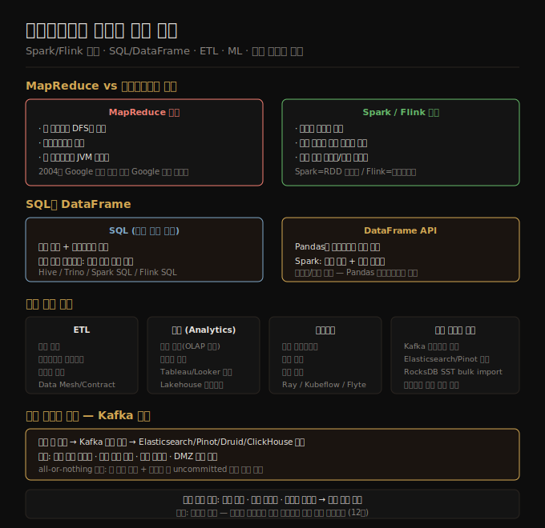

# 데이터플로우 엔진과 배치 활용
> MapReduce의 단계별 DFS 기록 한계를 데이터플로우 엔진이 파이프라이닝과 메모리 중간 상태로 극복하고, SQL·DataFrame·ML·파생 데이터 서빙으로 배치 활용이 넓어졌습니다.

이 노트를 읽고 나면 Spark/Flink가 MapReduce보다 빠른 구조적 이유를 설명하고, SQL과 DataFrame의 실행 방식 차이를 구분하며, 배치 잡 결과를 프로덕션 시스템에 반영할 때 어떤 패턴을 써야 하는지 대답할 수 있습니다.

11장 배치 처리의 네 번째 편입니다. 앞선 편이 MapReduce의 동작 원리를 다뤘다면, 이 편은 그 한계를 극복한 데이터플로우 엔진의 내부 구조와, 배치 처리가 ETL·분석·머신러닝·파생 데이터 서빙으로 실제 어떻게 쓰이는지를 살핍니다.

## 1. 데이터플로우 엔진 — MapReduce의 한계 극복
> MapReduce는 매 단계마다 DFS에 중간 결과를 기록해 파이프라이닝이 불가능했고, Spark·Flink는 전체 워크플로우를 한 잡으로 처리해 이 병목을 제거했습니다.

MapReduce는 분산 배치 처리의 첫 번째 실용적 프레임워크였지만, 구조적 한계가 분명합니다. 맵 단계가 끝나면 중간 결과를 반드시 분산 파일시스템(HDFS 등)에 기록하고, 다음 리듀스 단계는 그 기록을 다시 읽어 시작합니다. 이 방식은 세 가지 문제를 낳습니다. 첫째, 매 단계마다 디스크 I/O가 발생해 처리 속도를 크게 떨어뜨립니다. 둘째, 앞 단계가 완전히 끝나야 다음 단계가 시작되므로 파이프라이닝이 불가능합니다. 셋째, 각 태스크가 새 JVM 프로세스로 실행되어 JVM 기동 오버헤드가 반복적으로 발생합니다.

Apache Spark와 Apache Flink로 대표되는 **데이터플로우 엔진**은 전체 워크플로우를 단일 잡으로 처리합니다. MapReduce와 다른 핵심 특성은 여섯 가지입니다.

첫째, **필요한 곳에만 정렬을 수행합니다.** MapReduce는 맵과 리듀스 사이에 항상 정렬과 셔플이 들어가지만, 데이터플로우 엔진은 정렬이 실제로 필요한 연산(조인, 그룹화)에서만 정렬을 수행합니다. 단순한 필터나 변환에는 정렬 비용이 전혀 발생하지 않습니다.

둘째, **연속 연산자를 하나의 태스크로 결합합니다.** `map` 다음에 `filter`, 그 다음에 또 다른 `map`이 이어진다면, 세 연산을 하나의 태스크 파이프라인으로 묶어 중간 데이터를 복사하지 않고 처리합니다. 불필요한 직렬화·역직렬화 비용이 사라집니다.

셋째, **스케줄러가 태스크 간 의존성을 파악해 로컬리티를 최적화합니다.** 이전 태스크와 다음 태스크가 같은 머신에서 실행될 수 있다면, 공유 메모리 버퍼를 통해 데이터를 전달합니다. 네트워크 전송이 없어지므로 처리량이 크게 오릅니다.

넷째, **중간 상태를 메모리나 로컬 디스크에만 저장합니다.** MapReduce처럼 HDFS에 복제하며 기록하지 않으므로 I/O 비용이 대폭 줄어듭니다. 물론 복제가 없으니 노드 장애 시 해당 데이터는 잃지만, 이에 대한 대응은 프레임워크마다 다릅니다(후술).

다섯째, **이전 스테이지가 완전히 끝나기 전에 다음 스테이지를 시작할 수 있습니다.** 충분한 데이터가 생산되는 시점부터 소비 태스크가 바로 시작되어 파이프라인이 겹쳐 흐릅니다.

여섯째, **기존 JVM 프로세스를 재사용합니다.** MapReduce는 태스크마다 새 JVM을 기동하지만, Spark와 Flink는 워커 프로세스가 상주하며 태스크를 순서대로 실행합니다. JVM 기동 시간이 처리 시간에서 빠집니다.

결함 처리 방식은 두 프레임워크가 다릅니다. **Spark**는 RDD(Resilient Distributed Dataset) 리니지를 기록합니다. RDD는 불변 데이터셋으로, 각 RDD가 어떤 연산으로 만들어졌는지를 DAG로 저장합니다. 노드 장애로 RDD의 파티션이 유실되면, 리니지를 따라 소스 데이터부터 해당 파티션만 재계산합니다. 재계산 비용을 줄이기 위해 메모리에 올려 놓거나 로컬 디스크에 스필할 수 있습니다. **Flink**는 분산 스냅샷(Chandy-Lamport 알고리즘 기반)을 주기적으로 찍습니다. 장애가 나면 가장 최근 체크포인트로 돌아가 처리를 재개합니다. 스트림 처리와 배치 처리 모두를 동일한 결함 처리 메커니즘으로 다룰 수 있어, Flink에서는 배치와 스트림이 통합된 모델로 표현됩니다.

## 2. 쿼리 언어 — SQL과 DataFrame
> SQL은 비용 기반 옵티마이저와 레거시 DW 호환성을 앞세워 배치 처리의 공통 언어가 됐고, DataFrame은 데이터 과학자에게 친숙한 인터페이스로 분산 처리를 노출합니다.

배치 처리 프레임워크 위에는 저수준 API(RDD, DataStream)만 있지 않습니다. 실무에서는 더 높은 추상화 계층인 SQL과 DataFrame이 훨씬 많이 쓰입니다.

**SQL이 배치 처리의 공통 언어가 된 이유**는 세 가지입니다. 첫째, 수십 년간 쌓인 레거시 데이터 웨어하우스 쿼리를 그대로 재활용할 수 있습니다. Hive가 처음 MapReduce 위에서 SQL을 지원하기 시작한 이후, SQL은 배치 생태계의 사실상 표준으로 자리잡았습니다. 둘째, Pentaho, dbt 같은 ETL 도구들이 SQL을 기본 변환 언어로 지원하므로 도구 생태계와의 호환성이 높습니다. 셋째, SQL은 개발자와 데이터 분석가 모두에게 친숙하여 협업 비용을 줄입니다.

SQL의 기술적 장점도 큽니다. Hive, Trino(구 Presto), Spark SQL, Flink SQL은 모두 **비용 기반 쿼리 옵티마이저(cost-based optimizer)**를 내장합니다. 옵티마이저는 테이블 통계(카디널리티, 데이터 분포)를 바탕으로 조인 순서를 자동으로 바꾸고, 집계 방식을 선택합니다. 개발자가 직접 조인 순서를 튜닝하지 않아도 상당한 수준의 최적화가 자동으로 이뤄집니다.

SQL 외에도 특정 도메인에 최적화된 쿼리 언어가 쓰입니다. Apache Pig는 관계형 파이프라인 표현에 특화돼 있으며, jq와 JMESPath는 JSON 데이터의 선택적 추출에 간결합니다. Gremlin은 그래프 순회를 표현하는 언어로 대용량 그래프 분석에 쓰입니다.

**DataFrame API**는 R과 Pandas에 익숙한 데이터 과학자를 분산 처리 세계로 끌어들이기 위해 등장했습니다. 그러나 Pandas DataFrame과 Spark DataFrame은 겉모습이 비슷해도 동작 방식이 근본적으로 다릅니다.

Pandas는 **즉시 실행(eager execution)**입니다. 연산을 호출하면 그 자리에서 바로 결과를 냅니다. 행에 인덱스가 있고, 행 순서가 보장됩니다. Spark DataFrame은 **지연 실행(lazy execution)**입니다. 여러 연산을 쌓아두고 최종적으로 `collect()`나 `write()`를 호출할 때 쿼리 플랜을 최적화한 뒤 실행합니다. 인덱스가 없고, 행 순서도 보장되지 않습니다. 따라서 Pandas 코드를 Spark로 마이그레이션할 때 인덱스나 순서에 의존하는 로직이 있으면 성능이 예상과 크게 다를 수 있습니다.

**Daft**는 이 간극을 좁히려는 최근 프레임워크입니다. 작은 데이터는 클라이언트 인메모리로, 큰 데이터는 서버 분산 실행으로 자동 전환합니다. **Apache Arrow**는 프레임워크 간 데이터 교환을 위한 컬럼 지향 메모리 포맷으로, Pandas·Spark·DuckDB·Daft가 Arrow를 공유 인터페이스로 사용하면 직렬화 비용 없이 데이터를 주고받을 수 있습니다.

## 3. 배치 사용 사례 — ETL과 분석
> 배치 처리는 ETL 변환과 분석 쿼리 모두에서 같은 SQL 엔진을 쓰는 방향으로 수렴했고, Data Lakehouse 구조가 DW와 배치 처리의 경계를 지우고 있습니다.

**ETL(Extract-Transform-Load)**은 배치 처리의 가장 오래된 사용 사례입니다. 소스 시스템에서 데이터를 추출하고, 형식을 변환하며, 목적지 시스템에 적재하는 일련의 과정입니다. ETL 배치의 특성은 세 가지입니다. 첫째, 각 레코드를 독립적으로 변환할 수 있어 태스크를 여러 노드에 고르게 분배하기 쉽습니다(embarrassingly parallel). 둘째, 워크플로우 스케줄러(Airflow, Dagster, Prefect)가 DAG로 의존성을 관리하며 재실행과 백필을 지원합니다. 셋째, 입력이 불변이므로 변환 로직에 버그가 발견되면 데이터 손상 없이 잡을 재실행할 수 있습니다.

조직이 커지면서 ETL 파이프라인 관리가 중앙화된 데이터 엔지니어링 팀의 병목이 되는 문제가 생겼습니다. 이를 해결하려는 패턴이 **데이터 메시(Data Mesh)**입니다. 팀이 각자 자신의 도메인 데이터 파이프라인을 소유하고 운영하는 분산 자율 구조로, 데이터를 제품처럼 관리합니다. 데이터 계약(data contract)은 생산자와 소비자 사이의 스키마와 SLA를 명문화해 파이프라인 변경이 하위 소비자에 미치는 영향을 미리 통제합니다.

분석 쿼리는 두 패턴으로 나뉩니다. **사전 집계** 방식은 결과를 미리 계산해 Druid, Apache Pinot 같은 OLAP 엔진에 적재합니다. 대시보드나 고정된 집계 질문처럼 쿼리 패턴이 예측 가능한 경우에 적합합니다. **애드혹 쿼리** 방식은 탐색 분석처럼 질문이 매번 달라지는 경우에 쓰입니다. Tableau, Power BI, Looker 같은 BI 도구가 Trino나 Spark SQL과 연동해 원본 데이터에 직접 쿼리를 던지고 빠른 응답을 기다립니다.

최근의 중요한 흐름은 **Data Lakehouse**입니다. Spark + Apache Iceberg + Databricks Unity Catalog 조합이 대표적입니다. 기존 Data Lake는 파일 저장은 저렴하지만 트랜잭션·스키마 변경·타임트래블 같은 DW 기능이 없었습니다. Iceberg 같은 오픈 테이블 포맷이 이 기능들을 오브젝트 스토리지 위에 더하면서, 동일한 Parquet 파일에 배치 ETL 잡과 SQL 분석 쿼리가 함께 접근할 수 있게 됐습니다. DW와 배치 처리 파이프라인의 경계가 실질적으로 사라지고 있습니다.

## 4. 배치 사용 사례 — 머신러닝과 파생 데이터 서빙
> 배치 잡은 머신러닝 파이프라인의 전 단계(피처·학습·추론)를 담당하며, 결과를 서빙 시스템에 반영할 때는 레코드별 직접 쓰기 대신 Kafka 경유나 bulk import 패턴을 씁니다.

**머신러닝**에서 배치 처리는 세 단계에 걸쳐 활용됩니다. 피처 엔지니어링 단계에서는 원시 데이터를 모델 입력으로 쓸 수 있는 숫자형 피처로 변환합니다. 정규화, 원핫 인코딩, 시계열 집계, 결측값 처리 모두 대용량 데이터셋을 대상으로 하므로 배치 잡으로 처리합니다. 모델 학습 단계에서는 전처리된 피처 데이터를 읽어 모델 파라미터를 갱신합니다. 배치 추론 단계에서는 학습된 모델로 대규모 데이터를 일괄 예측해 결과를 저장합니다. Apache Spark MLlib와 Flink의 FlinkML이 피처 변환 함수, 통계 집계, 분류기를 내장해 이 과정을 지원합니다.

**그래프 처리**도 배치 프레임워크 위에 올라갑니다. 소셜 네트워크의 커뮤니티 탐지, 사기 탐지를 위한 연결 패턴 분석, 추천 시스템의 협업 필터링이 대표 사례입니다. 그래프 처리는 BSP(Bulk Synchronous Parallel) 모델로 구현되며, Google Pregel이 이 모델의 원형입니다. 슈퍼스텝마다 각 정점이 이웃에서 메시지를 받고, 상태를 갱신하며, 다음 이웃에 메시지를 보냅니다. 수렴할 때까지 반복합니다. Apache Giraph, Spark GraphX, Flink Gelly가 이 모델을 구현합니다.

**LLM 데이터 준비**는 최근 배치 처리의 새 사용 사례로 부상했습니다. 인터넷에서 수집한 HTML에서 의미 있는 텍스트만 추출하고, 저품질 문서와 중복 문서를 걸러내고, 남은 텍스트를 토크나이즈하고, 임베딩으로 변환하는 일련의 과정 모두가 대규모 배치 잡입니다. Kubeflow, Flyte, Ray가 이 파이프라인 오케스트레이션에 쓰이며, Ray는 OpenAI의 ChatGPT 학습 파이프라인에 활용된 것으로 알려져 있습니다.

배치 잡의 결과를 프로덕션 서빙 시스템에 반영하는 방식은 신중하게 선택해야 합니다. **레코드별 DB 직접 쓰기는 피해야 합니다.** 배치 잡의 수천 개 병렬 태스크가 각각 DB에 개별 INSERT/UPDATE를 보내면 처리량이 극히 낮고 DB에 과부하가 걸립니다. 레코드 수가 많으면 실행이 끝나기도 전에 DB가 포화됩니다.

실무에서 쓰는 패턴은 두 가지입니다.

**패턴 1: Kafka 토픽에 푸시 후 소비자가 수집.** 배치 잡이 Kafka 토픽에 레코드를 쓰면, Elasticsearch, Apache Pinot, Druid, ClickHouse 같은 서빙 시스템이 각자의 속도로 소비합니다. 이 방식에는 네 가지 장점이 있습니다. 서빙 시스템이 순차 쓰기에 최적화된 배치 수집 경로를 활용할 수 있습니다. Kafka가 버퍼 역할을 해 서빙 시스템이 일시적으로 느려져도 데이터가 유실되지 않습니다. 동일한 Kafka 토픽을 여러 서빙 시스템이 독립적으로 소비할 수 있어 하나의 배치 잡으로 복수의 파생 데이터를 만들 수 있습니다. 마지막으로, 배치 잡 클러스터와 서빙 DB 클러스터 사이에 Kafka가 DMZ 역할을 해 보안 경계를 분리합니다.

**패턴 2: 배치 잡 내부에서 DB 빌드 후 bulk import.** 배치 잡이 실행 중에 서빙 DB의 파일 포맷(SST 파일, 세그먼트 파일 등)을 직접 생성하고, 완성된 파일을 서빙 시스템에 한 번에 넘깁니다. TiDB Lightning, Apache Pinot의 Hadoop import, RocksDB SST bulk import가 이 방식을 지원합니다. 잡 실행이 끝나면 버전을 원자적으로 전환할 수 있어, 이전 버전과 새 버전이 뒤섞이는 상황 없이 교체됩니다. 다만 마지막 배치 실행 이후의 변경을 반영하는 증분 업데이트가 어렵다는 단점이 있습니다. 전체 데이터를 주기적으로 새로 빌드하는 방식이 적합한 서빙 시스템(검색 인덱스, OLAP 세그먼트)에 잘 맞습니다.

## 5. 11장 종합
> 배치 처리는 저장·오케스트레이션·처리 세 계층 위에서 진화했고, 불변 입력과 재실행 가능성이 인간 결함 내성의 근원입니다.

11장 전체를 돌아보면, 분산 배치 처리는 세 계층의 조합으로 이뤄집니다. 저장 계층은 DFS(HDFS)에서 오브젝트 스토리지(S3, GCS)로 무게중심이 이동했습니다. 오케스트레이션 계층은 Oozie, Azkaban에서 Airflow, Dagster, Prefect로 발전했고, 의존성 DAG 관리와 모니터링, 재실행 기능이 정교해졌습니다. 처리 계층은 MapReduce에서 Spark와 Flink로 넘어와, 파이프라이닝·메모리 중간 상태·JVM 재사용이 가능해졌습니다.

처리 계층의 변화를 다시 정리하면, MapReduce에서 데이터플로우 엔진으로의 전환은 세 가지 핵심 개선을 가져왔습니다. 파이프라이닝으로 연속 연산이 겹쳐 실행되고, 중간 상태를 메모리나 로컬 디스크에만 저장해 DFS 복제 I/O가 사라지며, JVM 프로세스를 재사용해 기동 비용이 제거됐습니다.

SQL과 DataFrame은 처리 계층 위에서 사용성을 높였습니다. 비용 기반 옵티마이저가 조인 순서와 집계 방식을 자동으로 최적화하고, 개발자와 데이터 과학자 모두가 익숙한 인터페이스로 분산 처리에 접근할 수 있게 됐습니다.

배치 처리의 황금 규칙은 변하지 않습니다. **입력을 불변으로 취급하고, 출력을 재생성 가능하게 만들며, 외부 부작용을 최소화합니다.** 이 규칙이 지켜지면 버그가 있는 코드가 돌아도 데이터가 영구적으로 손상되지 않고, 코드를 고친 뒤 잡을 재실행해 올바른 결과를 얻을 수 있습니다. 인간의 실수로 인한 데이터 손상을 막는 가장 근본적인 방어선입니다.

클라우드 전환이 배치 처리 스택에 가져온 변화도 짚어둘 만합니다. HDFS는 S3로, Oozie는 Airflow로, 온프레미스 Hadoop 클러스터는 Spark on K8s, BigQuery, Snowflake로 대체되는 흐름입니다. 컴퓨트와 스토리지의 분리는 잡 단위로 컴퓨트 자원을 켜고 끄는 비용 최적화를 가능하게 했습니다.

12장에서는 입력이 무한한 **스트림 처리**로 넘어갑니다. 배치와 스트림은 데이터 변환·조인·집계·파생 데이터 서빙 등 많은 문제를 공유하지만, 스트림에는 '완료'가 없다는 근본적 차이가 있습니다. 이 차이가 어떤 새로운 설계 문제를 만들어내는지가 12장의 핵심입니다.

## 자주 받는 오해

1. **"Spark DataFrame은 Pandas와 같다"** — Pandas는 즉시 실행·인덱스 있음·행 순서 보장으로 동작합니다. Spark DataFrame은 지연 실행·쿼리 플랜 최적화 후 실행·인덱스 없음·행 순서 미보장으로 동작합니다. 두 API의 모습이 비슷해 Pandas 코드를 Spark로 그대로 옮기면 인덱스나 순서에 의존하는 로직에서 성능이 예상과 크게 달라질 수 있습니다.

2. **"배치 잡에서 바로 DB에 쓰는 것이 가장 간단하다"** — 수천 개의 병렬 태스크가 레코드별로 DB에 직접 쓰면 처리량이 극히 낮고 DB에 과부하가 걸립니다. Kafka 토픽을 경유하거나 DB 파일 포맷으로 bulk import하는 방식이 훨씬 효율적입니다. 직접 쓰기는 단순해 보이지만 규모가 커지면 시스템 전체의 병목이 됩니다.

3. **"SQL 쿼리 엔진과 배치 처리 프레임워크는 별개다"** — Spark SQL, Trino, DuckDB는 SQL 인터페이스와 배치 실행 엔진을 함께 제공합니다. ETL 변환 잡과 분석 쿼리가 같은 엔진 위에서 돌아가는 방향으로 수렴하고 있으며, Data Lakehouse 구조가 이 경계를 더욱 흐리고 있습니다.

## 면접에서 받을 만한 질문

1. **MapReduce 대비 Spark/Flink 데이터플로우 엔진의 성능 우위 이유 세 가지는?** — 첫째, 이전 스테이지 완료 전 다음 스테이지를 시작하는 파이프라이닝이 가능합니다. 둘째, 중간 상태를 DFS가 아닌 메모리나 로컬 디스크에만 저장해 복제 I/O가 없습니다. 셋째, JVM 프로세스를 재사용해 태스크마다 새 JVM을 기동하는 비용이 사라집니다. 여기에 더해 정렬이 필요한 곳에만 수행하고, 연속 연산자를 하나의 태스크로 결합해 복사 오버헤드를 줄이며, 스케줄러가 로컬리티를 최적화해 공유 메모리 버퍼를 활용할 수 있습니다.

2. **배치 잡의 출력을 프로덕션 DB에 반영할 때 레코드별 직접 쓰기를 피해야 하는 이유는?** — 배치 잡은 수천 개의 병렬 태스크가 동시에 실행됩니다. 각 태스크가 레코드별로 DB에 개별 쓰기 요청을 보내면 처리량이 낮고 DB 연결과 I/O가 포화됩니다. 대신 Kafka 토픽을 버퍼로 경유해 서빙 시스템이 배치 수집 경로로 소비하거나, 배치 잡 내부에서 DB 파일 포맷을 직접 빌드한 뒤 bulk import로 원자적으로 교체하는 방식이 효율적입니다.

3. **배치 처리와 스트림 처리의 핵심 차이는 무엇인가?** — 배치 처리는 유한한 입력 데이터셋 전체를 읽어 새 출력을 만드는 구조로, 잡이 완료되는 시점이 존재합니다. 스트림 처리는 끝없이 흘러오는 이벤트를 대상으로 하여 '완료'가 없습니다. 이 차이가 설계에 파급됩니다. 배치에서는 '완료된 입력 전체'를 기준으로 집계나 조인을 할 수 있지만, 스트림에서는 무한 데이터를 시간 윈도우로 잘라 처리해야 합니다. 워터마크, 이벤트 시간과 처리 시간의 차이, 늦게 도착하는 이벤트 처리가 스트림 고유의 설계 문제입니다.

## 관련 문서

> 이 노트는 11장 배치 처리의 네 번째이자 마지막 편으로, 12장 스트림 처리로 이어집니다.

- [11-03 분산 잡 오케스트레이션과 MapReduce](./11-03.분산%20잡%20오케스트레이션과%20MapReduce.md) — MapReduce 기초와 셔플·정렬 메커니즘
- [05-05 durable execution과 이벤트 기반 아키텍처](./05-05.durable%20execution과%20이벤트%20기반%20아키텍처.md) — 배치 워크플로우 vs durable execution 구분
- [04-05 분석용 컬럼 지향 저장](./04-05.분석용%20컬럼%20지향%20저장.md) — Parquet/Arrow 컬럼 포맷 상세
- [ddia2 README — 2판 정독 인덱스](./README.md)
