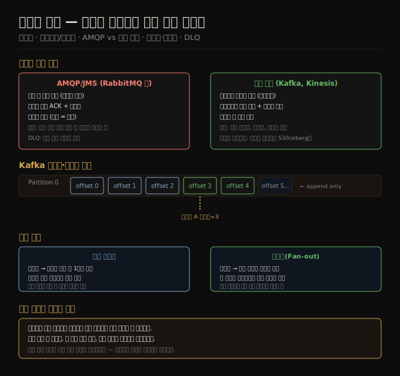

# 스트림 전송 — 메시지 브로커와 로그 기반 브로커
> 스트림은 시간에 따라 점진적으로 도착하는 이벤트의 연속이며, 어떤 브로커를 쓰느냐가 내구성·순서·재처리 가능성을 결정합니다.

이 노트를 읽고 나면 이벤트 스트림이 무엇인지, AMQP/JMS 방식과 로그 기반 방식 브로커의 차이를 설명하고, Kafka의 파티션·오프셋 구조가 내구성과 재처리를 어떻게 동시에 보장하는지 대답할 수 있습니다.

12장은 스트림 처리를 다루며, 이 노트는 그 첫 편입니다. 배치 처리(11장)가 유한한 입력을 가정했다면, 스트림 처리는 끝이 없는 데이터를 다룹니다. 스트림이 어떻게 표현되고 전달되는지부터 살핍니다.

## 1. 이벤트 스트림의 정의
> 이벤트는 특정 시점에 발생한 일을 담은 작고 불변인 객체이며, 스트림은 그 이벤트들의 끊임없는 흐름입니다.

배치 처리 세계에서 입출력 단위는 파일입니다. 스트림 처리 세계에서 그 역할은 **이벤트(event)** 가 맡습니다. 이벤트는 일정 시점에 발생한 사건을 담은 작고 불변인 객체로, 타임스탬프와 함께 인코딩되어 네트워크로 전송되거나 파일에 기록됩니다. 사용자가 페이지를 조회한 행위, 온도 센서가 측정한 수치, 웹 서버의 접속 로그 한 줄이 모두 이벤트입니다.

이벤트를 생성하는 쪽을 **프로듀서(producer)**, 소비하는 쪽을 **컨슈머(consumer)** 라고 합니다. 관련 이벤트들은 **토픽(topic)** 또는 **스트림** 으로 묶입니다. 프로듀서가 이벤트를 쓰고 컨슈머가 주기적으로 폴링하는 구조도 가능하지만, 이는 폴링 횟수가 늘수록 빈 응답 비율이 높아져 효율이 낮습니다. 새 이벤트 발생 시 컨슈머에게 능동적으로 통보하는 구조가 더 적합하며, 이를 위한 전문 도구가 **메시징 시스템**입니다.

## 2. 메시지 브로커와 AMQP/JMS 방식
> 브로커는 프로듀서와 컨슈머 사이에서 메시지를 버퍼링하고 전달하는 중간 서버입니다.

**메시지 브로커(message broker)** 는 메시지 스트림을 처리하도록 최적화된 일종의 데이터베이스입니다. 프로듀서가 브로커에 메시지를 쓰면 브로커가 컨슈머에게 전달합니다. 이 구조 덕분에 컨슈머가 일시 오프라인이 되거나 처리 속도가 느려도 내구성을 보장할 수 있습니다.

**AMQP/JMS 방식** 브로커(RabbitMQ, ActiveMQ, Azure Service Bus 등)의 핵심 특성은 다음과 같습니다.

- **소비 후 삭제**: 컨슈머가 메시지를 수신·처리하고 **acknowledgment(ACK)** 를 보내면 브로커는 해당 메시지를 제거합니다. 재처리가 불가능합니다.
- **단기 보관**: 작업 집합이 작고 큐가 짧다는 전제하에 동작합니다. 컨슈머가 느릴 경우 큐가 커지고 처리량이 저하됩니다.
- **유연한 라우팅**: 패턴 매칭으로 토픽 구독이 가능합니다.

메시지 브로커는 두 가지 소비 패턴을 지원합니다.

| 패턴 | 동작 | 활용 |
|------|------|------|
| 로드 밸런싱 | 컨슈머 중 하나에만 전달 | 처리 비용이 높고 병렬화가 필요한 작업 |
| 팬아웃(fan-out) | 모든 컨슈머에 전달 | 여러 독립 서비스가 동일 이벤트를 필요로 할 때 |

**ACK와 재전달** 구조는 안전망이지만 부작용이 있습니다. 컨슈머 2가 메시지 m3을 처리하다 크래시하면, 브로커는 m3을 다른 컨슈머에게 재전달합니다. 이 때 로드 밸런싱과 재전달이 겹치면 메시지 순서가 뒤바뀝니다. 순서 의존성이 있는 메시지 처리에서는 이 점을 주의해야 합니다.

**Dead Letter Queue(DLQ)** 는 반복적으로 처리 실패하는 메시지를 별도 큐로 격리하는 패턴입니다. 잘못 직렬화된 메시지가 컨슈머를 반복 크래시시키는 루프를 차단하며, 운영자가 원인을 분석·수정할 시간을 벌어줍니다.

## 3. 로그 기반 메시지 브로커
> 로그에 메시지를 추가(append)만 하고 삭제하지 않으면, 컨슈머는 언제든 과거 메시지를 다시 읽을 수 있습니다.

AMQP/JMS 방식의 가장 큰 제약은 소비가 파괴적(destructive)이라는 점입니다. 메시지를 한 번 소비하면 사라지므로 새 컨슈머를 추가할 때 과거 메시지를 볼 수 없습니다. **로그 기반 메시지 브로커** 는 데이터베이스의 영속성 아이디어와 메시지 시스템의 저지연 알림을 결합해 이 문제를 해결합니다.

Apache Kafka, Amazon Kinesis Streams가 이 방식을 채택합니다. 핵심 구조는 다음과 같습니다.

**파티션과 오프셋**: 토픽은 여러 **파티션(shard)** 으로 나뉘며, 각 파티션 내 메시지에는 단조 증가하는 **오프셋(offset)** 이 부여됩니다. 파티션 내에서는 완전한 순서가 보장되지만 파티션 간 순서는 보장되지 않습니다. 프로듀서는 파티션 끝에 메시지를 추가(append)하고, 컨슈머는 파티션을 순차적으로 읽습니다.

**소비자 오프셋**: 브로커는 개별 메시지마다 ACK를 추적하지 않고 컨슈머의 현재 오프셋만 주기적으로 기록합니다. 오프셋 이하는 처리됨, 초과는 미처리입니다. 이 단순한 설계가 로그 기반 시스템의 높은 처리량을 가능하게 합니다.

**팬아웃과 로드 밸런싱 동시 지원**: 로그는 읽기 전용이므로 여러 컨슈머 그룹이 독립적으로 읽어 팬아웃을 구현합니다. 하나의 컨슈머 그룹 안에서는 파티션 단위로 컨슈머에게 할당하여 로드 밸런싱을 구현합니다.

**디스크 공간**: 로그는 세그먼트로 나뉘어 오래된 세그먼트는 삭제되거나 아카이브 스토리지로 이동합니다. 이 순환 버퍼 구조 덕분에 최소 수 시간에서 수 주간의 메시지를 보관할 수 있습니다. 최근에는 Kafka, Redpanda 같은 브로커가 오래된 메시지를 오브젝트 스토리지(S3, Iceberg)에 저장하는 **계층화 스토리지(tiered storage)** 를 지원합니다.

## 4. AMQP/JMS vs 로그 기반 비교
> 메시지 처리 비용이 높고 순서가 덜 중요하면 AMQP/JMS, 처리량이 높고 순서가 중요하면 로그 기반이 적합합니다.

두 방식은 근본적으로 다른 트레이드오프를 가집니다.

| 항목 | AMQP/JMS | 로그 기반(Kafka 등) |
|------|----------|-------------------|
| 메시지 삭제 시점 | ACK 후 즉시 | 보존 기간 만료 후 |
| 재처리 | 불가 | 오프셋 되감기로 가능 |
| 메시지 단위 병렬화 | 가능 | 파티션 단위 병렬화 |
| 순서 보장 | 재전달 시 깨질 수 있음 | 파티션 내 보장 |
| 컨슈머 낙오 영향 | 다른 컨슈머에 영향 없음 | 오프셋 격차만 커질 뿐 다른 컨슈머 무영향 |
| 적합 사례 | 메시지별 처리 비용이 크고 순서 불필요 | 높은 처리량, 재처리 필요, 순서 중요 |

로그 기반 방식에서 컨슈머가 처리 속도를 따라가지 못하면 오프셋 격차가 늘어나다가 보존 기간을 초과한 메시지를 놓치게 됩니다. 이 상황은 모니터링 가능하고 다른 컨슈머에는 영향이 없으므로 운영 대응이 훨씬 쉽습니다.

**오래된 메시지 재처리**: 로그 기반 방식에서 메시지 소비는 파일 읽기와 같습니다. 오프셋을 어제 시점으로 되돌리면 어제부터 다시 처리할 수 있습니다. 이는 배치 처리의 불변 입력과 동일한 원칙으로, 버그 수정 후 데이터를 다시 처리하거나 새 처리 로직을 실험하기에 적합합니다.

## 자주 받는 오해

1. **"Kafka는 메시지 큐와 동일하다"** — Kafka는 로그 기반 브로커로, 메시지를 소비해도 삭제하지 않습니다. AMQP/JMS 방식 큐와는 소비 의미론이 근본적으로 다릅니다. 최근 Kafka는 JMS 스타일 컨슈머 그룹도 지원하지만, 기본 추상화는 여전히 오프셋 기반 로그입니다.
2. **"로그 기반 브로커는 순서를 완전히 보장한다"** — 파티션 내 순서는 보장되지만 파티션 간 순서는 보장되지 않습니다. 특정 사용자나 엔티티와 관련된 이벤트를 순서대로 처리하려면 동일 파티션 키를 사용해 같은 파티션으로 라우팅해야 합니다.
3. **"컨슈머가 느리면 프로듀서를 막아야 한다"** — 로그 기반 방식은 대형 버퍼(디스크)를 활용하므로 컨슈머가 느려도 프로듀서를 차단하지 않습니다. 단, 보존 기간을 초과하면 메시지가 유실됩니다.
4. **"DLQ는 Kafka에 없다"** — 과거에는 그랬지만, Apache Pulsar와 Kafka Streams가 DLQ를 지원하기 시작했습니다.

## 면접에서 받을 만한 질문

1. **"Kafka의 파티션과 오프셋이 내구성과 재처리를 동시에 보장하는 원리를 설명하세요"** — 파티션은 append-only 로그 파일로 구현되며, 브로커는 메시지를 디스크에 유지합니다. 컨슈머는 각자의 오프셋을 추적하고, 장애 발생 시 마지막 기록된 오프셋부터 재개합니다. 메시지를 삭제하지 않으므로 오프셋을 과거 시점으로 되돌려 재처리할 수 있습니다. 이것이 배치 처리의 불변 입력 원칙을 스트림에 적용한 결과입니다.
2. **"AMQP/JMS와 로그 기반 브로커 중 어느 것을 선택하겠습니까?"** — 메시지별 처리 비용이 높고 순서가 중요하지 않은 작업 큐라면 AMQP/JMS가 적합합니다. 높은 처리량이 필요하고 여러 컨슈머가 동일 데이터를 독립적으로 처리하거나 재처리 가능성이 있다면 로그 기반이 더 적합합니다. 두 방식의 근본 차이는 소비가 파괴적인가(AMQP)냐 비파괴적인가(로그 기반)냐에 있습니다.
3. **"로드 밸런싱과 메시지 재전달을 함께 쓸 때 발생하는 문제는 무엇인가요?"** — 처리 중 크래시가 발생하면 메시지가 다른 컨슈머에게 재전달되는데, 이 과정에서 메시지 순서가 달라집니다. 인과 의존성이 있는 메시지 처리에서 순서 역전은 잘못된 결과를 냅니다. 해결책은 컨슈머별 별도 큐를 사용하거나, 로그 기반 방식에서 단일 파티션을 단일 컨슈머에 할당하는 것입니다.
4. **"Dead Letter Queue가 왜 필요한가요?"** — 잘못된 메시지(예: 필수 필드 누락)가 컨슈머를 반복 크래시시키면 그 메시지는 영구적으로 재전달됩니다. 강한 순서 보장 브로커에서는 이후 메시지 처리도 차단됩니다. DLQ는 문제 메시지를 격리해 스트림 처리를 계속 진행할 수 있게 하고, 운영자가 원인을 분석·수정할 기회를 줍니다.

## 관련 문서

- [11-04.데이터플로우 엔진과 배치 활용](./11-04.%EB%8D%B0%EC%9D%B4%ED%84%B0%ED%94%8C%EB%A1%9C%EC%9A%B0%20%EC%97%94%EC%A7%84%EA%B3%BC%20%EB%B0%B0%EC%B9%98%20%ED%99%9C%EC%9A%A9.md) — 배치 처리의 파생 데이터 서빙이 스트림 전송으로 이어지는 맥락
- [12-02.데이터베이스와 스트림](./12-02.%EB%8D%B0%EC%9D%B4%ED%84%B0%EB%B2%A0%EC%9D%B4%EC%8A%A4%EC%99%80%20%EC%8A%A4%ED%8A%B8%EB%A6%BC.md) — CDC와 이벤트 소싱으로 스트림과 DB를 연결하는 방법
- [06-02.노드 장애 처리와 복제 로그](./06-02.%EB%85%B8%EB%93%9C%20%EC%9E%A5%EC%95%A0%20%EC%B2%98%EB%A6%AC%EC%99%80%20%EB%B3%B5%EC%A0%9C%20%EB%A1%9C%EA%B7%B8.md) — 복제 로그와 Kafka 오프셋의 구조적 유사성
