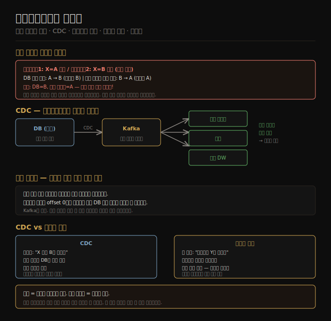

# 데이터베이스와 스트림
> 데이터베이스 쓰기는 그 자체로 이벤트 스트림이며, CDC를 통해 파생 시스템을 일관되게 동기화할 수 있습니다.

이 노트를 읽고 나면 듀얼 라이트(dual write)의 레이스 컨디션 문제를 설명하고, CDC가 이를 어떻게 해결하는지, 이벤트 소싱과 CDC의 차이가 무엇인지, 불변 이벤트 로그의 장단점을 대답할 수 있습니다.

이 노트는 12장의 두 번째 편입니다. 스트림이 외부 메시지 브로커에만 존재하는 것이 아니라 데이터베이스 자체의 변경 이력에도 내재함을 살핍니다. 이를 통해 검색 인덱스·캐시·분석 시스템 같은 파생 데이터 시스템을 실시간으로 동기화하는 방법을 이해합니다.

## 1. 시스템 동기화 문제와 듀얼 라이트의 한계
> 여러 저장소에 동일 데이터를 쓰는 듀얼 라이트는 레이스 컨디션과 부분 실패를 피할 수 없습니다.

현실의 애플리케이션은 단일 저장소로 모든 요구를 충족하기 어렵습니다. OLTP 데이터베이스로 사용자 요청을 처리하고, 캐시로 자주 쓰는 읽기를 가속하며, 전문 검색 인덱스로 텍스트 검색을 지원하고, 분석 데이터 웨어하우스로 집계 쿼리를 처리합니다. 이 모든 시스템이 동일한 데이터의 사본을 각자의 포맷으로 보관하므로, 데이터가 변경될 때마다 모든 사본을 동기화해야 합니다.

가장 단순한 접근은 **듀얼 라이트(dual write)** 입니다. 애플리케이션 코드가 변경 발생 시 데이터베이스와 검색 인덱스 모두에 직접 씁니다. 그러나 이 방식에는 두 가지 근본 문제가 있습니다.

첫째는 **레이스 컨디션**입니다. 클라이언트 1이 X를 A로, 클라이언트 2가 X를 B로 동시에 설정할 때, 데이터베이스에는 먼저 A가 쓰이고 그 다음 B가 쓰여 최종값이 B가 됩니다. 반면 검색 인덱스에는 B가 먼저 도착하고 A가 나중에 도착해 최종값이 A가 됩니다. 두 시스템이 오류 없이 영구적으로 불일치 상태에 빠집니다.

둘째는 **부분 실패**입니다. 데이터베이스 쓰기는 성공했지만 검색 인덱스 쓰기가 실패하면 두 시스템이 불일치됩니다. 두 쓰기를 동시에 성공하거나 실패하게 만들려면 분산 원자적 커밋이 필요한데, 이는 비용이 큽니다.

## 2. CDC — 변경 데이터 캡처
> CDC는 데이터베이스를 유일한 리더로 삼고 파생 시스템을 팔로워로 만들어 순서 문제를 근본적으로 해결합니다.

**변경 데이터 캡처(Change Data Capture, CDC)** 는 데이터베이스에 기록되는 모든 변경을 관찰하고, 그 변경을 스트림으로 추출해 다른 시스템에 복제하는 프로세스입니다. 데이터베이스의 복제 로그(MySQL binlog, PostgreSQL logical replication slot 등)를 파싱해 변경 이벤트를 생성합니다.

CDC의 핵심 통찰은 **데이터베이스를 유일한 리더로** 만드는 것입니다. 레이스 컨디션이 발생하더라도 데이터베이스가 쓰기 순서를 결정하고 복제 로그에 그 순서를 기록합니다. 검색 인덱스, 캐시, 분석 시스템은 그 로그를 동일한 순서로 소비하므로 항상 데이터베이스와 일관된 상태를 유지합니다.

CDC는 대체로 **비동기**입니다. 변경이 파생 시스템에 즉시 반영되지 않으므로 복제 지연(6장)이 적용됩니다. 그러나 파생 시스템 업데이트 지연이 원본 데이터베이스 커밋을 막지 않으므로 원본 시스템 성능에 미치는 영향이 작습니다.

**구현 도구**: Debezium은 MySQL, PostgreSQL, Oracle, SQL Server 등 다양한 데이터베이스의 복제 로그를 파싱해 표준 이벤트 스키마로 변환하는 오픈소스 CDC 프레임워크입니다. Kafka Connect는 다양한 데이터베이스용 CDC 커넥터를 제공합니다.

**초기 스냅샷**: 변경 이력만으로는 전체 데이터베이스 상태를 재구성할 수 없으므로, 새 파생 시스템을 추가할 때는 먼저 일관된 스냅샷을 만들고 그 이후의 CDC 스트림을 적용해야 합니다. Debezium은 Netflix DBLog 워터마크 알고리즘을 사용해 증분 스냅샷을 지원합니다.

**로그 컴팩션**: 같은 키의 변경 이벤트가 누적되면 최신 이벤트만 남기고 이전 이벤트를 삭제합니다. 이를 통해 파생 시스템은 별도 스냅샷 없이 컴팩션된 로그를 처음부터 재생해 현재 상태를 복구할 수 있습니다. Kafka가 이 기능을 지원합니다.

## 3. CDC와 스키마 변경 관리
> CDC는 데이터베이스 스키마를 공개 API로 만들어, 내부 스키마 변경이 하위 소비자를 깨뜨릴 수 있습니다.

마이크로서비스 아키텍처에서 데이터베이스는 서비스의 내부 구현 세부사항입니다. 다른 서비스는 공개 API를 통해서만 접근하므로 데이터베이스 스키마를 자유롭게 변경할 수 있습니다. 그런데 CDC를 도입하면 데이터베이스 스키마가 CDC 소비자에게 노출됩니다. 컬럼 이름 변경이나 삭제가 CDC 소비자를 깨뜨려 장애를 일으킬 수 있습니다.

이 문제를 해결하는 패턴이 **아웃박스 패턴(Outbox Pattern)** 입니다. 내부 도메인 모델 테이블 대신, CDC 시스템에 노출할 전용 아웃박스 테이블을 별도로 정의합니다. 개발자는 내부 스키마를 자유롭게 수정하되 아웃박스 테이블은 안정적으로 유지합니다. 내부 테이블과 아웃박스 테이블을 동시에 쓰는 것은 듀얼 라이트처럼 보이지만, 두 쓰기가 같은 데이터베이스 트랜잭션 안에 있으므로 원자성이 보장됩니다.

## 4. 이벤트 소싱과 CDC 비교
> CDC는 저수준 스토리지 변경을 캡처하고, 이벤트 소싱은 애플리케이션 수준에서 불변 이벤트를 설계합니다.

**이벤트 소싱(Event Sourcing)** 은 모든 상태 변경을 불변 이벤트로 표현하고 append-only 이벤트 로그에 기록합니다. 현재 상태는 이벤트 로그를 재생해 파생됩니다. CQRS와 함께 3장에서 다뤘습니다.

CDC와 이벤트 소싱의 추상화 수준이 다릅니다.

| 항목 | CDC | 이벤트 소싱 |
|------|-----|------------|
| 레벨 | 저수준(DB 쓰기 반영) | 애플리케이션 수준(사용자 의도 반영) |
| 이벤트 의미 | "X 행이 B로 변경됨" | "사용자가 Y를 주문함" |
| 기존 시스템 도입 | 변경 최소화로 추가 가능 | 애플리케이션 로직 대규모 변경 필요 |
| 로그 컴팩션 | 키별 최신값으로 가능 | 전체 이력 필요, 컴팩션 어려움 |
| 업데이트/삭제 | 허용 | 권장하지 않음 |

CDC는 이미 뮤터블 DB를 사용 중인 시스템에 최소 침습적으로 적용할 수 있습니다. 이벤트 소싱은 더 풍부한 이력 정보를 제공하지만 초기 설계부터 적용해야 합니다.

## 5. 불변성의 장점과 한계
> 불변 이벤트 로그는 감사·복구·다중 뷰 파생에 강력하지만, 삭제 요구사항과 충돌합니다.

**상태와 이벤트의 이중성**: 변경 가능한 상태와 append-only 이벤트 로그는 모순되지 않습니다. 이벤트 로그를 시간축으로 적분하면 현재 상태가 되고, 현재 상태를 미분하면 변경 스트림이 됩니다. 로그는 진화의 역사이고 상태는 그 역사의 현재 위치입니다.

**불변 이벤트의 장점**:
- 배포된 버그가 잘못된 데이터를 썼을 때 로그 재생으로 복구가 쉽습니다.
- 장바구니 추가 후 삭제 이벤트처럼, 데이터베이스에는 지워진 정보도 이벤트 로그에는 남아 분석에 활용됩니다.
- 동일 이벤트 로그에서 여러 읽기 최적화 뷰를 파생할 수 있습니다. 새 기능을 위한 새 뷰를 기존 시스템과 병렬로 만든 후, 준비가 되면 트래픽을 전환하고 구 시스템을 종료할 수 있습니다.

**불변성의 한계**:
- GDPR 같은 개인정보 보호 규정은 데이터 삭제를 요구합니다. 이벤트 로그에서 특정 데이터를 완전히 제거하기 어렵습니다.
- **크립토 슈레딩(crypto-shredding)**: 삭제 가능성 있는 데이터를 암호화하고, 삭제 요청 시 키만 폐기합니다. 암호화된 데이터는 남지만 해독 불가능해집니다. 키 관리 부담이 따르며, 같은 키로 암호화된 데이터 전체를 한꺼번에만 삭제할 수 있습니다.
- 업데이트가 잦고 데이터셋이 크면 이벤트 이력이 방대해져 컴팩션과 가비지 컬렉션 성능이 중요해집니다.

## 자주 받는 오해

1. **"CDC를 쓰면 모든 시스템이 실시간으로 동기화된다"** — CDC는 기본적으로 비동기입니다. 복제 지연이 존재하며, 애플리케이션이 방금 쓴 내용을 바로 파생 시스템에서 읽을 수 있다는 보장이 없습니다. 이는 6장의 복제 지연 문제와 동일합니다.
2. **"이벤트 소싱은 CDC의 업그레이드 버전이다"** — 둘은 목적이 다릅니다. CDC는 기존 뮤터블 데이터베이스에 최소한의 변경으로 파생 시스템 동기화를 추가합니다. 이벤트 소싱은 애플리케이션 로직 자체를 이벤트 중심으로 재설계합니다. 어느 쪽이 낫다고 일반화하기 어렵습니다.
3. **"아웃박스 패턴은 듀얼 라이트라 레이스 컨디션이 있다"** — 아웃박스 패턴에서 두 쓰기는 단일 데이터베이스 트랜잭션 안에 있으므로 원자성이 보장됩니다. 레이스 컨디션 문제는 서로 다른 저장 시스템에 분산된 쓰기에서 발생하는 것입니다.

## 면접에서 받을 만한 질문

1. **"검색 인덱스와 데이터베이스를 항상 동기화하는 방법은 무엇인가요?"** — 가장 신뢰할 수 있는 방법은 CDC입니다. 데이터베이스를 유일한 리더로 만들고, 복제 로그에서 변경 이벤트를 추출해 Kafka 같은 로그 기반 브로커를 통해 검색 인덱스에 적용합니다. 듀얼 라이트보다 복잡하지만 레이스 컨디션과 부분 실패 문제를 근본적으로 해결합니다.
2. **"CDC가 마이크로서비스 아키텍처에서 문제가 되는 이유와 해결책은?"** — CDC는 데이터베이스 스키마를 공개 API로 만들어 하위 소비자와 결합됩니다. 컬럼 변경이 소비자 장애로 이어질 수 있습니다. 해결책은 아웃박스 패턴입니다. 내부 스키마는 자유롭게 변경하되, CDC에 노출하는 아웃박스 테이블은 공개 계약처럼 안정적으로 유지합니다.
3. **"불변 이벤트 로그에서 개인정보를 삭제하는 방법은?"** — 크립토 슈레딩을 사용합니다. 개인정보를 전용 암호화 키로 암호화한 후 로그에 저장하고, 삭제 요청 시 그 키를 폐기합니다. 데이터는 물리적으로 남지만 복호화가 불가능해집니다. 단, 키 관리 복잡성과 같은 키로 암호화된 데이터를 선택적으로 삭제할 수 없다는 한계가 있습니다.

## 관련 문서

- [12-01.스트림 전송 — 메시지 브로커와 로그 기반 브로커](./12-01.%EC%8A%A4%ED%8A%B8%EB%A6%BC%20%EC%A0%84%EC%86%A1%20%E2%80%94%20%EB%A9%94%EC%8B%9C%EC%A7%80%20%EB%B8%8C%EB%A1%9C%EC%BB%A4%EC%99%80%20%EB%A1%9C%EA%B7%B8%20%EA%B8%B0%EB%B0%98%20%EB%B8%8C%EB%A1%9C%EC%BB%A4.md) — 로그 기반 브로커가 CDC 스트림 전송에 적합한 이유
- [03-06.이벤트 소싱·CQRS·DataFrame](./03-06.%EC%9D%B4%EB%B2%A4%ED%8A%B8%20%EC%86%8C%EC%8B%B1%C2%B7CQRS%C2%B7DataFrame.md) — 이벤트 소싱 상세 설계 패턴
- [12-03.스트림 처리](./12-03.%EC%8A%A4%ED%8A%B8%EB%A6%BC%20%EC%B2%98%EB%A6%AC.md) — CDC 스트림을 소비하는 스트림 프로세서 구현
- [06-03.복제 지연 문제와 일관성 보장](./06-03.%EB%B3%B5%EC%A0%9C%20%EC%A7%80%EC%97%B0%20%EB%AC%B8%EC%A0%9C%EC%99%80%20%EC%9D%BC%EA%B4%80%EC%84%B1%20%EB%B3%B4%EC%9E%A5.md) — CDC 비동기 특성에서 발생하는 지연 문제
