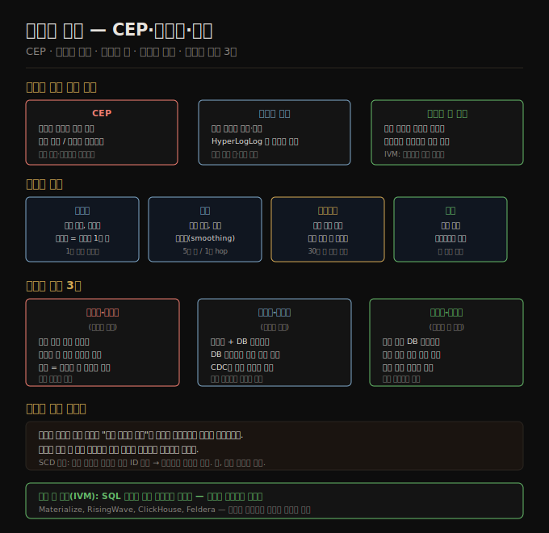

# 스트림 처리 — CEP·윈도우·조인
> 스트림 프로세서는 끝없는 이벤트 흐름에서 패턴을 찾고, 시간 창으로 집계하며, 여러 스트림을 조인해 새로운 파생 스트림을 만듭니다.

이 노트를 읽고 나면 CEP·스트림 분석·구체화 뷰 유지의 차이를 설명하고, 텀블링·호핑·슬라이딩·세션 윈도우를 구분하며, 스트림-스트림·스트림-테이블·테이블-테이블 조인 각각의 동작 원리를 대답할 수 있습니다.

이 노트는 12장의 세 번째 편입니다. 스트림이 어떻게 전달되는지(12-01), 데이터베이스와 어떻게 연결되는지(12-02)를 알았으니, 이제 스트림을 실제로 처리하는 방법을 살핍니다.

## 1. 스트림 처리의 세 가지 출력 유형
> 스트림 프로세서의 출력은 저장소 쓰기, 사람에 대한 알림, 새 스트림 생성 중 하나입니다.

스트림에서 할 수 있는 일은 크게 세 가지입니다. 첫째, 이벤트 데이터를 데이터베이스·캐시·검색 인덱스에 씁니다. 12-02에서 살핀 CDC 소비자가 이 방식입니다. 둘째, 이메일 알림·푸시 알림·대시보드 시각화 등으로 사람에게 이벤트를 전달합니다. 셋째, 하나 이상의 입력 스트림을 처리해 하나 이상의 출력 스트림을 생성합니다.

이 노트에서 집중할 것은 세 번째입니다. 입력 스트림을 읽기 전용으로 소비하고, 새로운 파생 스트림을 append-only로 출력합니다. 이는 11장의 배치 잡이 입력 파일을 읽어 출력 파일을 만드는 것과 동일한 패턴입니다. 결정적인 차이는 스트림이 끝나지 않는다는 것입니다.

## 2. 스트림 처리의 활용 유형
> CEP는 이벤트 패턴 탐지, 스트림 분석은 통계 집계, 구체화 뷰 유지는 파생 상태 갱신에 각각 초점을 맞춥니다.

**복합 이벤트 처리(CEP)**: 스트림에서 특정 이벤트 시퀀스를 탐지합니다. SQL이나 GUI로 이벤트 패턴 규칙을 정의하면 처리 엔진이 상태 머신을 유지하면서 매칭 여부를 검사합니다. 패턴이 매칭되면 "복합 이벤트"를 방출합니다. 사기 탐지(신용카드 이상 패턴), 알고리즘 트레이딩, 공장 기계 이상 감지에 사용됩니다. 일반 데이터베이스와 역할이 뒤바뀐다는 점이 흥미롭습니다. 데이터베이스는 데이터를 저장하고 쿼리를 잊지만, CEP 엔진은 쿼리(규칙)를 저장하고 데이터(이벤트)를 처리합니다.

**스트림 분석**: 이벤트 패턴보다는 대량 이벤트에 대한 집계와 통계에 집중합니다. 서비스별 초당 요청 수, 5분 롤링 평균 응답 시간, 지난 주 대비 트래픽 이상 탐지가 대표적입니다. 확률적 알고리즘(HyperLogLog로 카디널리티 추정, Bloom 필터로 멤버십 검사)을 써서 메모리를 절약하기도 합니다. Apache Storm, Spark Streaming, Flink, Samza, Kafka Streams 등이 스트림 분석에 사용됩니다.

**구체화 뷰 유지(Materialized View Maintenance)**: CDC 이벤트를 소비해 검색 인덱스·캐시·분석 시스템을 최신 상태로 유지합니다. 이는 특정 시간 창에 한정되지 않고 처음부터 현재까지 전체 이벤트가 필요하므로 "무한 길이 윈도우"가 필요합니다. Kafka Streams와 ksqlDB가 이 용도를 지원합니다.

**증분 뷰 유지(IVM)**: 기존 데이터베이스의 REFRESH MATERIALIZED VIEW는 전체 데이터를 주기적으로 재처리해 비효율적입니다. IVM은 변경된 데이터만 증분 계산해 훨씬 자주 갱신합니다. Materialize, RisingWave, ClickHouse, Feldera 같은 시스템이 SQL 쿼리를 증분 연산자로 변환해 스트림 이벤트를 실시간으로 구체화합니다.

## 3. 윈도우 유형
> 윈도우는 무한 스트림을 유한한 집계 단위로 나누는 방법이며, 유형마다 시간 경계의 정의가 다릅니다.

스트림 분석은 보통 시간 윈도우 단위로 집계합니다. 윈도우를 어떻게 정의하느냐에 따라 네 가지 유형이 있습니다.

| 윈도우 유형 | 설명 | 예시 |
|------------|------|------|
| 텀블링(Tumbling) | 고정 길이, 비중첩. 각 이벤트는 정확히 하나의 윈도우에 속함 | 1분 단위 요청 수 카운트 |
| 호핑(Hopping) | 고정 길이, 중첩 허용. 인접 윈도우가 겹쳐 평활화 효과 | 5분 윈도우 / 1분 hop — 슬라이딩 평균 |
| 슬라이딩(Sliding) | 특정 시간 간격 이내 이벤트 묶음. 고정 경계 없음 | 30분 이내 같은 세션 클릭 묶기 |
| 세션(Session) | 고정 기간 없음. 특정 사용자가 일정 시간 비활동이면 윈도우 종료 | 웹 세션 분석 |

텀블링 윈도우는 타임스탬프를 가장 가까운 분 단위로 내림해서 구현합니다. 호핑 윈도우는 먼저 1분 텀블링 윈도우를 만든 후 인접 윈도우를 묶어 집계합니다. 슬라이딩 윈도우는 시간 순으로 정렬된 이벤트 버퍼를 유지하면서 만료된 이벤트를 제거합니다.

윈도우 연산은 대부분 임시 상태를 유지합니다. 카운터처럼 윈도우 크기나 이벤트 수와 무관하게 크기가 고정된 상태도 있지만, 슬라이딩 윈도우나 스트림 조인처럼 이벤트를 버퍼에 쌓아야 하는 경우는 처리량이 많거나 윈도우가 클수록 메모리 압박이 커집니다.

## 4. 스트림 조인의 세 가지 유형
> 스트림 조인은 새 이벤트가 언제든 도착할 수 있어 배치 조인보다 상태 관리가 복잡합니다.

배치 잡에서 조인은 스냅샷 파일 두 개를 대조합니다. 스트림에서 조인은 끝없이 도착하는 두 스트림을 지속적으로 대조해야 합니다.

**스트림-스트림 조인(윈도우 조인)**: 두 입력 스트림 모두 활동 이벤트로 구성됩니다. 같은 세션 ID를 가진 검색 이벤트와 클릭 이벤트를 1시간 이내에서 매칭해 클릭률을 계산하는 경우가 대표적입니다. 프로세서는 지난 1시간의 이벤트를 세션 ID로 인덱싱해 상태로 유지합니다. 새 이벤트가 도착하면 상태에서 매칭 이벤트를 조회합니다. 윈도우가 만료되면 매칭 없이 만료된 이벤트를 "클릭 없음" 이벤트로 방출합니다.

**스트림-테이블 조인(스트림 강화)**: 하나는 활동 이벤트 스트림, 다른 하나는 데이터베이스 변경로그입니다. 사용자 활동 이벤트에 사용자 프로필 정보를 붙이는 스트림 강화(enrichment)가 대표적입니다. 매 이벤트마다 원격 데이터베이스를 조회하면 느리므로, 데이터베이스의 복사본을 스트림 프로세서 로컬에 로드해 해시 조인합니다. 데이터베이스 변경로그(CDC)를 구독해 로컬 복사본을 최신 상태로 유지합니다.

**테이블-테이블 조인(구체화 뷰 유지)**: 두 입력 모두 데이터베이스 변경로그입니다. 소셜 네트워크 타임라인을 예로 들면, 게시물 스트림과 팔로우 관계 스트림을 조인해 각 사용자의 타임라인 캐시를 유지합니다. 이는 두 테이블을 조인하는 SQL 쿼리의 결과를 지속적으로 갱신하는 구체화 뷰와 같습니다.

**조인의 시간 의존성**: 세 조인 유형 모두 하나의 입력에서 파생된 상태를 유지하고, 다른 입력의 레코드를 처리할 때 그 상태를 조회합니다. 상태가 시간에 따라 변하므로, "어느 시점의 상태"를 조인에 사용할지가 중요합니다. 예를 들어 세금율 테이블과 판매 이벤트를 조인할 때, 판매 시점의 세금율을 적용해야 합니다. 이를 결정론적으로 만들기 위해 조인된 레코드의 특정 버전에 고유 식별자를 부여하는 방법(데이터 웨어하우스의 SCD 패턴)을 씁니다.

## 자주 받는 오해

1. **"스트림 처리는 항상 근사치(approximate)다"** — HyperLogLog 같은 확률적 알고리즘이 있어 그렇게 오해하기 쉽지만, 스트림 처리 자체가 근사치를 요구하지는 않습니다. 확률적 알고리즘은 메모리 최적화 선택입니다. 정확한 집계도 스트림에서 완전히 가능합니다.
2. **"스트림-테이블 조인은 항상 최신 상태를 반환한다"** — 로컬 테이블 복사본은 CDC 스트림으로 갱신되지만 비동기이므로 약간의 지연이 있습니다. 프로파일이 업데이트된 직후 발생한 이벤트가 이전 프로파일로 강화될 수 있습니다.
3. **"세션 윈도우는 고정 길이가 없으므로 구현이 단순하다"** — 오히려 복잡합니다. 활동이 없는 시간을 기준으로 윈도우를 닫아야 하므로 비활동 감지 로직이 필요하며, 늦게 도착하는 이벤트가 이미 닫힌 윈도우를 다시 열 수 있는 문제도 있습니다.

## 면접에서 받을 만한 질문

1. **"스트림-스트림 조인이 배치 조인보다 어려운 이유는 무엇인가요?"** — 배치 조인은 스냅샷 파일 두 개를 한꺼번에 처리합니다. 스트림 조인은 양쪽 스트림이 계속 흘러오므로, 프로세서가 한쪽 이벤트가 도착했을 때 다른 쪽 이벤트가 아직 안 왔을 수 있습니다. 윈도우를 정해서 그 안에 도착한 이벤트만 대조하고, 만료된 이벤트는 상태에서 제거해야 합니다. 이 상태 관리가 배치에는 없는 복잡성입니다.
2. **"텀블링 윈도우, 호핑 윈도우, 슬라이딩 윈도우의 차이를 설명하세요"** — 텀블링 윈도우는 이벤트가 정확히 하나의 윈도우에만 속하는 비중첩 고정 구간입니다. 호핑 윈도우는 겹치는 고정 구간으로, hop 크기보다 큰 윈도우를 사용해 평활화 효과를 냅니다. 슬라이딩 윈도우는 특정 시간 범위 내의 이벤트를 모두 묶으며 고정 경계가 없습니다. 세션 윈도우는 사용자 비활동으로 경계를 결정하는 가변 길이 윈도우입니다.
3. **"구체화 뷰를 스트림 처리로 유지하는 것이 데이터베이스 트리거보다 나은 이유는?"** — 데이터베이스 트리거는 쉽게 증분 계산으로 변환되는 간단한 쿼리에만 실용적입니다. 복잡한 SQL 조인이나 집계는 트리거로 효율적으로 유지하기 어렵습니다. 스트림 처리 기반 IVM은 임의의 SQL 쿼리를 증분 연산자로 컴파일해 변경된 데이터만 재계산합니다. 또한 데이터베이스 외부 시스템(검색 인덱스, 캐시)도 같은 스트림으로 동기화할 수 있습니다.

## 관련 문서

- [12-02.데이터베이스와 스트림](./12-02.%EB%8D%B0%EC%9D%B4%ED%84%B0%EB%B2%A0%EC%9D%B4%EC%8A%A4%EC%99%80%20%EC%8A%A4%ED%8A%B8%EB%A6%BC.md) — 스트림 처리의 입력이 되는 CDC 이벤트 소스
- [12-04.시간 추론과 내결함성](./12-04.%EC%8B%9C%EA%B0%84%20%EC%B6%94%EB%A1%A0%EA%B3%BC%20%EB%82%B4%EA%B2%B0%ED%95%A8%EC%84%B1.md) — 윈도우 집계에서 발생하는 지각 이벤트와 장애 복구
- [11-03.분산 잡 오케스트레이션과 MapReduce](./11-03.%EB%B6%84%EC%82%B0%20%EC%9E%A1%20%EC%98%A4%EC%BC%80%EC%8A%A4%ED%8A%B8%EB%A0%88%EC%9D%B4%EC%85%98%EA%B3%BC%20MapReduce.md) — 배치 Sort-Merge 조인과 스트림 조인의 비교
