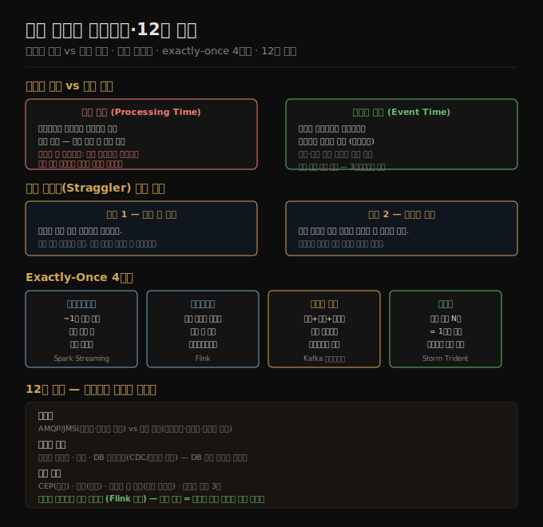

# 시간 추론과 내결함성·12장 종합
> 이벤트 시간과 처리 시간을 혼동하면 데이터가 왜곡되고, 장애 복구 없이는 exactly-once 의미론을 보장할 수 없습니다.

이 노트를 읽고 나면 이벤트 시간과 처리 시간의 차이를 설명하고, 지각 이벤트를 다루는 두 전략을 말하며, 마이크로배치·체크포인트·멱등성·원자적 커밋이 각각 어떤 방식으로 exactly-once를 달성하는지 대답할 수 있습니다.

이 노트는 12장의 네 번째이자 마지막 편입니다. 스트림 처리에서 가장 까다로운 두 문제—시간과 장애—를 다루고, 12장 전체를 종합합니다.

## 1. 이벤트 시간 vs 처리 시간
> 이벤트가 발생한 시각과 프로세서가 이벤트를 본 시각은 다르며, 처리 시간 기준 윈도우는 재처리 시 결과가 달라집니다.

배치 처리는 처리 시점이 분석 대상 시간 축과 무관합니다. 1년치 이력을 5분 만에 처리할 수 있고, 동일 입력을 재처리하면 동일 결과가 나옵니다. 스트림 처리에서는 시간 개념이 훨씬 복잡합니다.

**처리 시간(processing time)**: 스트림 프로세서가 이벤트를 실제로 처리하는 시각입니다. 구현이 단순하지만, 처리 지연이 발생하면 집계 결과가 왜곡됩니다. 예를 들어 프로세서를 1분간 재시작하면 누적된 이벤트가 한꺼번에 처리되어 그 순간의 초당 요청 수가 비정상적으로 높게 나타납니다. 실제 요청량은 일정했는데 처리 시간 기준 윈도우가 스파이크를 만들어냅니다.

**이벤트 시간(event time)**: 이벤트가 실제로 발생한 시각으로, 이벤트 페이로드에 담긴 타임스탬프입니다. 이벤트 시간을 쓰면 배치 처리처럼 결정론적 재처리가 가능합니다. 그러나 이벤트가 순서대로 도착한다는 보장이 없습니다.

**메시지 지연·순서 역전**: 네트워크 지연, 큐 백로그, 소비자 재시작, 오프라인 모바일 장치 등 다양한 원인으로 이벤트가 늦게 도착하거나 순서가 뒤바뀝니다. 오프라인 앱이 수 시간 또는 수 일 후에 이벤트를 전송하는 경우도 있습니다.

**디바이스 클럭 신뢰 문제**: 모바일 기기의 시각은 사용자가 임의로 설정하거나 잘못 동기화될 수 있습니다. 더 신뢰할 수 있는 타임스탬프를 위해 세 가지 시각을 기록합니다. 이벤트 발생 시각(기기 클럭), 서버 전송 시각(기기 클럭), 서버 수신 시각(서버 클럭). 두 번째와 세 번째의 차이로 기기-서버 클럭 오프셋을 추정하고, 이를 첫 번째에 보정해 "실제" 발생 시각을 추정합니다.

## 2. 지각 이벤트 처리
> 이벤트 시간 기준 윈도우는 "모든 이벤트가 도착했는지" 알 수 없어, 윈도우 마감 기준이 필요합니다.

이벤트 시간 기준 윈도우를 닫으려면 언제 해당 시간 구간의 모든 이벤트가 도착했는지 판단해야 합니다. 이를 정확히 아는 방법은 없습니다. 실용적인 두 가지 전략이 있습니다.

**전략 1 — 지각 이벤트 무시**: 일정 시간 이후 도착하는 이벤트는 드롭합니다. 유실된 이벤트 수를 메트릭으로 추적하고, 비율이 높아지면 경보를 보냅니다. 이벤트 지각이 드물고 일부 손실이 허용되는 분석 워크로드에 적합합니다.

**전략 2 — 수정값 발행**: 지각 이벤트를 포함한 수정 집계값을 발행합니다. 이전에 발행한 값을 철회(retract)하고 새 값을 발행합니다. 구독자가 수정값을 처리하는 로직을 갖춰야 하므로 구현이 복잡해집니다.

**워터마크(Watermark)**: 특수 마커 메시지로 "이 시각 이전의 모든 이벤트가 도달했다"고 컨슈머에게 알립니다. Flink와 Google Dataflow가 이 방식을 사용합니다. 여러 파티션에서 이벤트를 받는 소비자는 각 파티션의 워터마크를 개별 추적해야 합니다.

## 3. 내결함성과 Exactly-Once 의미론
> 스트림은 무한하므로 배치처럼 재시작 후 출력을 버릴 수 없습니다. 더 세밀한 복구 메커니즘이 필요합니다.

배치 처리는 장애 시 태스크를 재시작하고 부분 출력을 버립니다. 태스크 완료 후에만 출력이 가시화되므로, 재시작 후 동일 결과가 보장됩니다. 스트림은 끝나지 않으므로 이 방법을 그대로 쓸 수 없습니다.

**Exactly-once 의미론**: 이벤트마다 정확히 한 번만 처리된 것처럼 출력이 나타나는 속성입니다. "effectively-once"라는 표현이 더 정확합니다. 실제로는 at-least-once 처리 후 멱등성이나 트랜잭션으로 중복을 제거합니다.

### 마이크로배치(Microbatching)
스트림을 약 1초 단위 소블록으로 나눠 각 블록을 소형 배치로 처리합니다. Spark Streaming이 이 방식입니다. 각 블록 처리 후에만 출력이 가시화되므로 블록 단위 exactly-once가 성립합니다. 단, 텀블링 윈도우 크기가 배치 크기와 같아져 더 큰 윈도우는 상태를 이월해야 합니다.

### 체크포인트(Checkpointing)
주기적으로 연산자 상태를 내구성 있는 저장소에 스냅샷으로 저장합니다. Apache Flink가 이 방식입니다. 장애 발생 시 가장 최근 체크포인트부터 재처리합니다. 체크포인트와 크래시 사이의 이벤트는 중복 처리될 수 있으므로 멱등성이나 트랜잭션으로 보완합니다.

### 원자적 커밋
모든 출력(DB 쓰기, 메시지 발행, 상태 변경, 오프셋 커밋)을 단일 원자적 트랜잭션으로 묶습니다. Google Cloud Dataflow, VoltDB, Kafka(트랜잭셔널 프로듀서)가 이 방식을 지원합니다. XA 같은 이기종 분산 트랜잭션과 달리, 단일 프레임워크 내부에서 상태 변경과 메시징을 함께 관리해 오버헤드를 줄입니다.

### 멱등성(Idempotence)
동일 연산을 여러 번 수행해도 한 번 수행한 것과 같은 결과가 나오는 속성입니다. 예를 들어 Kafka 메시지 오프셋을 함께 저장해두면 이미 처리한 메시지를 재처리할 때 중복 업데이트를 방지할 수 있습니다. 재시작 후 동일 순서로 동일 메시지를 재생하고 처리가 결정론적이며 다른 노드가 동시에 같은 값을 업데이트하지 않는다는 전제가 필요합니다.

**장애 후 상태 복구**: 조인·집계에 필요한 상태도 장애 후 복구해야 합니다. Flink는 상태 스냅샷을 분산 파일시스템에 저장합니다. Kafka Streams는 상태 변경을 로그 컴팩션 Kafka 토픽에 복제합니다. 짧은 윈도우 집계는 입력 이벤트를 재생해 상태를 재구성할 수도 있습니다.

## 4. 12장 종합 — 스트림 처리 전체 그림

12장은 배치 처리(11장)의 "유한 입력" 가정을 걷어내고 끝없는 데이터 흐름을 다루는 방법을 설명합니다.

**브로커 두 유형**: AMQP/JMS 방식은 소비가 파괴적이어서 재처리가 불가능하고 메시지 단위 병렬화가 가능합니다. 로그 기반 방식(Kafka)은 소비가 비파괴적이어서 오프셋으로 재처리가 가능하고 파티션 단위 병렬화를 합니다. 로그 기반 방식은 복제 로그 및 로그 구조 저장 엔진과 같은 append-only 구조를 공유합니다.

**스트림 출처**: 사용자 활동 이벤트, 센서 측정값, 데이터베이스 변경로그(CDC/이벤트 소싱). 데이터베이스 쓰기를 스트림으로 보는 시각이 CDC와 이벤트 소싱의 토대입니다.

**스트림 처리 활용**: CEP(패턴 탐지), 스트림 분석(통계 집계), 구체화 뷰 유지(파생 시스템 동기화). 스트림 조인은 스트림-스트림·스트림-테이블·테이블-테이블 세 유형이 있으며, 각각 윈도우 크기와 상태 관리 방식이 다릅니다.

**시간 추론**: 이벤트 시간 기준 집계는 결정론적 재처리를 보장하지만 지각 이벤트 처리가 복잡합니다. 처리 시간 기준 집계는 단순하지만 처리 지연이 결과를 왜곡합니다.

**내결함성**: 마이크로배치·체크포인트·원자적 커밋·멱등성이 각각 다른 방식으로 exactly-once를 달성합니다. 어떤 방식이 적합한지는 시스템 아키텍처와 성능 요구사항에 따라 달라집니다.

**11장과의 연속성**: 배치와 스트림은 별개 패러다임이 아닙니다. 배치는 스트림의 특수한 경우입니다. 유한한 입력은 스트림이 끝났다는 신호를 받은 경우이며, 스트림에서 마이크로배치 윈도우를 무한히 작게 하면 연속 처리가 됩니다. Flink는 "배치는 스트림의 특수 케이스"라는 철학 위에 설계됐습니다.

## 자주 받는 오해

1. **"이벤트 시간 기준 윈도우는 항상 정확하다"** — 이벤트 시간 기준이 결정론적 재처리를 가능하게 하지만, 지각 이벤트를 어떻게 처리하느냐에 따라 결과가 달라집니다. 지각 이벤트를 무시하거나 수정값을 발행하는 선택이 필요하며, 어느 쪽이든 일정한 트레이드오프가 있습니다.
2. **"Kafka는 exactly-once를 기본으로 보장한다"** — Kafka는 트랜잭셔널 프로듀서를 통해 정확히 한 번 전달을 지원하지만, 스트림 처리 전체에서의 exactly-once는 컨슈머 로직, 상태 관리, 외부 시스템 출력까지 포함합니다. Kafka만으로는 충분하지 않으며 Kafka Streams 같은 프레임워크와 함께 사용해야 합니다.
3. **"마이크로배치와 진정한 스트림 처리는 근본적으로 다르다"** — 실용적 차이보다 과장된 경우가 많습니다. 마이크로배치의 지연이 수백 밀리초 수준이면 대부분의 사용 사례에서 "실시간"으로 충분합니다. 진정한 이벤트 단위 처리가 필요한 경우는 수 밀리초 이하의 지연이 요구될 때입니다.
4. **"스트림 처리는 데이터 웨어하우스를 대체한다"** — 스트림 처리와 배치 분석은 상호 보완적입니다. 스트림은 최신 데이터의 실시간 뷰를, 데이터 웨어하우스는 대규모 역사적 데이터의 복잡한 분석을 제공합니다. 많은 시스템이 둘을 함께 운영합니다.

## 면접에서 받을 만한 질문

1. **"이벤트 시간과 처리 시간의 차이를 예시로 설명하세요"** — 초당 요청 수를 측정하는 스트림 프로세서를 예로 들겠습니다. 프로세서를 1분 재시작하면 1분 치 이벤트가 한꺼번에 처리됩니다. 처리 시간 기준이면 재시작 직후 초당 요청 수가 비정상적으로 높게 나타납니다. 이벤트 시간 기준이면 이벤트에 담긴 타임스탬프를 써서 원래 발생 시각의 버킷에 집계하므로 재시작 전과 동일한 분포를 유지합니다.
2. **"스트림 처리에서 exactly-once를 어떻게 달성하나요?"** — 네 가지 방법이 있습니다. 마이크로배치는 스트림을 소블록으로 나눠 블록 완료 후에만 출력을 가시화합니다. 체크포인트는 주기적으로 상태를 저장하고 장애 시 그 지점부터 재처리합니다. 원자적 커밋은 상태 변경과 메시지 발행을 단일 트랜잭션으로 묶습니다. 멱등성은 동일 메시지를 여러 번 처리해도 같은 결과가 나오도록 설계해 중복 처리를 무해하게 만듭니다.
3. **"지각 이벤트(straggler events)를 어떻게 처리하겠습니까?"** — 두 전략 중에서 선택합니다. 첫째, 임계값 이후 도착하는 이벤트를 무시하고 드롭된 이벤트 수를 메트릭으로 모니터링합니다. 비율이 낮고 약간의 손실이 허용되는 분석 워크로드에 적합합니다. 둘째, 지각 이벤트를 포함해 윈도우를 재계산하고 수정값을 발행합니다. 정확성이 중요하지만 구독자가 수정값 처리 로직을 갖춰야 합니다.
4. **"Kafka와 RabbitMQ의 차이를 설명하세요"** — RabbitMQ는 AMQP 기반으로 소비 후 메시지를 삭제합니다. 메시지 단위 ACK와 재전달, DLQ를 지원하며 복잡한 라우팅이 가능합니다. 메시지별 처리 비용이 높고 순서가 덜 중요한 태스크 큐에 적합합니다. Kafka는 로그 기반으로 메시지를 삭제하지 않습니다. 파티션·오프셋으로 재처리가 가능하고 처리량이 높습니다. 순서 보장과 재처리 가능성이 중요한 이벤트 스트리밍에 적합합니다.

## 관련 문서

- [12-01.스트림 전송 — 메시지 브로커와 로그 기반 브로커](./12-01.%EC%8A%A4%ED%8A%B8%EB%A6%BC%20%EC%A0%84%EC%86%A1%20%E2%80%94%20%EB%A9%94%EC%8B%9C%EC%A7%80%20%EB%B8%8C%EB%A1%9C%EC%BB%A4%EC%99%80%20%EB%A1%9C%EA%B7%B8%20%EA%B8%B0%EB%B0%98%20%EB%B8%8C%EB%A1%9C%EC%BB%A4.md) — 스트림 전달 인프라 기초
- [12-02.데이터베이스와 스트림](./12-02.%EB%8D%B0%EC%9D%B4%ED%84%B0%EB%B2%A0%EC%9D%B4%EC%8A%A4%EC%99%80%20%EC%8A%A4%ED%8A%B8%EB%A6%BC.md) — CDC와 불변 이벤트 로그
- [12-03.스트림 처리 — CEP·윈도우·조인](./12-03.%EC%8A%A4%ED%8A%B8%EB%A6%BC%20%EC%B2%98%EB%A6%AC%20%E2%80%94%20CEP%C2%B7%EC%9C%88%EB%8F%84%EC%9A%B0%C2%B7%EC%A1%B0%EC%9D%B8.md) — 스트림 처리 패턴
- [09-02.불신뢰 시계](./09-02.%EB%B6%88%EC%8B%A0%EB%A2%B0%20%EC%8B%9C%EA%B3%84.md) — 클럭 오프셋과 이벤트 시간 신뢰 문제
- [11-04.데이터플로우 엔진과 배치 활용](./11-04.%EB%8D%B0%EC%9D%B4%ED%84%B0%ED%94%8C%EB%A1%9C%EC%9A%B0%20%EC%97%94%EC%A7%84%EA%B3%BC%20%EB%B0%B0%EC%B9%98%20%ED%99%9C%EC%9A%A9.md) — 배치 처리와 스트림 처리의 연속성
