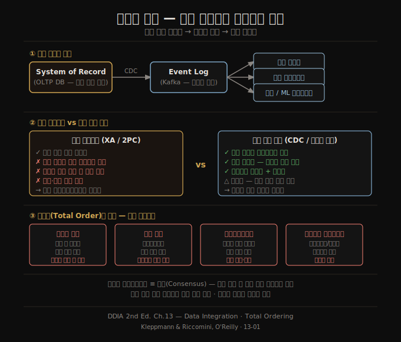

# 데이터 통합 — 파생 데이터와 전순서의 한계
> 단일 도구가 모든 접근 패턴을 만족할 수 없으므로, 데이터는 여러 시스템을 거쳐 변환·파생됩니다. 그 흐름을 올바르게 추론하는 것이 13장의 출발점입니다.

이 노트를 읽고 나면 왜 하나의 저장 시스템으로 모든 요구를 충족할 수 없는지, 파생 데이터 시스템을 이벤트 로그로 동기화할 때 분산 트랜잭션보다 무엇이 유리한지, 그리고 전순서(total ordering)를 강제하는 것이 규모에서 왜 어려워지는지 설명할 수 있습니다.

13장은 12장의 스트리밍 아이디어를 확장해 애플리케이션 설계 철학 전체로 이어 붙입니다. 신뢰성·확장성·유지보수성이라는 2장의 주제가 여기서 수렴됩니다.

## 1. 전문 도구 조합의 불가피성
> 어떤 문제든 적합한 도구는 하나가 아니라 여럿이며, 복잡한 애플리케이션은 여러 저장·처리 시스템을 이어 붙여야 합니다.

책 전반에서 반복된 결론이 하나 있습니다. 저장 엔진(4장)은 로그 구조·B-트리·컬럼 지향 중 어느 하나도 모든 워크로드에 최선이 아닙니다. 복제(6장)는 단일·다중·리더리스 방식을 제각각 선택합니다. 이는 소프트웨어가 특정 사용 패턴에 최적화되도록 설계되기 때문입니다. 그 결과 복잡한 애플리케이션은 단일 도구로 해결되지 않고, 여러 조각을 이어 붙여야 합니다.

대표적인 예가 **OLTP 데이터베이스와 전문 검색 인덱스의 통합**입니다. PostgreSQL도 내장 전문 검색을 제공하지만, 정교한 검색 요구사항은 Elasticsearch 같은 특화 도구를 필요로 합니다. 검색 인덱스는 내구적 시스템의 레코드로 삼기에는 부적합하므로, 데이터베이스와 검색 인덱스를 **모두** 유지해야 합니다. 여기에 분석 웨어하우스, 캐시, 기계학습 파이프라인, 알림 시스템까지 더해지면 통합 문제는 기하급수적으로 복잡해집니다.

## 2. 데이터플로우 추론 — 어디서 쓰고 어디서 파생하는가
> 어느 시스템이 먼저 쓰고 어느 시스템이 파생하는지를 명확히 정의하면, 복수의 저장소를 일관되게 유지할 수 있습니다.

복수의 저장 시스템을 유지할 때 가장 중요한 질문은 "데이터가 처음 쓰이는 곳은 어디이고, 나머지는 어디에서 파생되는가?"입니다. 명확한 답이 없으면 두 클라이언트가 데이터베이스와 검색 인덱스에 서로 다른 순서로 쓰게 되고(12장 Figure 12-4 참조), 두 시스템은 영구적으로 불일치 상태에 빠집니다.

해결의 핵심 원칙은 **단일 시스템이 쓰기 순서를 결정**하도록 하는 것입니다. 예를 들어 데이터베이스에 CDC(Change Data Capture)를 적용하면, 데이터베이스만이 쓰기 순서를 결정하고, 검색 인덱스는 동일 순서로 변경을 적용하는 파생 시스템이 됩니다. 이는 6장에서 다룬 **상태 기계 복제(state machine replication)** 의 응용이기도 합니다. CDC를 쓰든 이벤트 소싱 로그를 쓰든, 핵심은 쓰기의 전순서를 한 곳에서 정하는 것입니다.

파생 시스템에 대한 업데이트는 **결정론적이고 멱등성**을 갖도록 만들 수 있으므로, 장애 복구도 단순해집니다. 같은 이벤트 로그를 같은 코드로 다시 실행하면 동일한 결과가 나옵니다.

## 3. 파생 데이터 vs 분산 트랜잭션
> 분산 트랜잭션은 강한 일관성을 보장하지만 성능·운영 비용이 높습니다. 로그 기반 파생은 비동기적으로 일관성을 달성하면서 더 견고합니다.

여러 저장 시스템을 동기화하는 고전적 방법은 **분산 트랜잭션**입니다. 원자적 커밋 프로토콜로 모든 변경이 함께 적용되거나 함께 롤백되게 합니다. 그러나 XA 트랜잭션은 내결함성과 성능 모두 취약해서(9장 참조) 실용적 한계가 뚜렷합니다.

로그 기반 파생 데이터와 분산 트랜잭션을 추상적으로 비교하면 다음과 같습니다.

| 항목 | 분산 트랜잭션 | 로그 기반 파생 |
|------|-------------|--------------|
| 일관성 달성 방식 | 원자적 커밋 프로토콜 | 결정론적 재처리 + 멱등성 |
| 읽기 최신성 | 커밋 즉시 읽기 가능 | 비동기 — 지연 가능 |
| 이종 시스템 통합 | 표준 프로토콜 없어 어려움 | 이벤트 로그로 자연스럽게 연결 |
| 장애 전파 | 참여자 하나 실패 시 전체 중단 | 장애 국소화, 소비자 독립 복구 |
| 운영 복잡도 | 높음 (2PC 코디네이터 관리) | 낮음 (브로커·토픽 운영) |

결론적으로 **로그 기반 파생 데이터**가 이종 시스템 통합에 가장 현실적인 접근법입니다. "결국 일관성(eventual consistency)은 피할 수 없으니 참아라"는 말은 충분한 지침이 아닙니다. 이 장의 나머지 부분이 어떻게 비동기 파생 시스템 위에서도 강한 보장을 만들지 설명합니다.

## 4. 전순서의 한계
> 모든 이벤트를 하나의 순서로 정렬하는 전순서(total order)는 단일 노드에서는 쉽지만, 분산 환경에서는 구조적으로 어렵습니다.

단일 리더 복제를 사용하는 시스템은 리더가 이벤트 순서를 결정하므로 전순서 로그가 자연스럽게 만들어집니다. 그러나 시스템이 커질수록 이 방식의 한계가 드러납니다.

- **샤딩된 로그**: 처리량이 단일 머신을 초과하면 로그를 여러 샤드로 나눠야 합니다. 두 샤드 간의 이벤트 순서는 정의되지 않습니다.
- **지리적 분산**: 지역 간 네트워크 지연 때문에 각 데이터센터가 독립 리더를 가집니다. 서로 다른 데이터센터에서 발생한 이벤트의 전역 순서는 불분명합니다.
- **마이크로서비스**: 각 서비스와 그 영속 상태가 독립 단위로 배포됩니다. 서로 다른 서비스에서 발생한 이벤트 사이에는 정의된 순서가 없습니다.
- **오프라인 클라이언트**: 클라이언트와 서버가 이벤트를 서로 다른 순서로 볼 가능성이 높습니다.

형식적으로, 이벤트 전순서를 결정하는 문제는 **전순서 브로드캐스트(total order broadcast)**이며 이는 합의(consensus)와 동등합니다(10장 참조). 대부분의 합의 알고리즘은 단일 노드 처리량이 충분한 상황을 가정하므로, 여러 노드가 순서 결정 작업을 나눠 하는 메커니즘을 제공하지 않습니다.

## 5. 인과성 포착과 순서
> 인과 관계가 있는 이벤트끼리는 순서가 의미를 가지지만, 전순서 없이도 인과성만 포착하면 충분한 경우가 많습니다.

인과 관계가 없는 이벤트는 임의의 순서로 처리해도 문제없습니다. 같은 객체의 여러 업데이트처럼 인과 관계가 명확한 경우는 특정 객체 ID로 같은 로그 샤드에 라우팅하면 전순서를 쉽게 확보할 수 있습니다. 어려운 경우는 인과 관계가 미묘하게 얽힌 상황입니다.

책의 예시를 들면, 사용자 A가 사용자 B를 친구 목록에서 삭제한 뒤 나머지 친구들에게 B에 대한 불평 메시지를 보냅니다. 의도는 B가 그 메시지를 볼 수 없어야 한다는 것입니다. 그러나 친구 관계 삭제와 메시지 전송이 서로 다른 샤드에 저장된다면, 알림 서비스가 친구 삭제 이벤트보다 메시지 전송 이벤트를 먼저 처리해서 B에게 알림을 보낼 수 있습니다.

이 문제에 대한 현재 시작점들은 다음과 같습니다.

1. **논리적 타임스탬프(logical timestamp)**: 코디네이션 없이 전순서에 가까운 정렬을 제공합니다. 다만 수신자가 순서 바깥의 이벤트를 처리해야 하고, 추가 메타데이터가 필요합니다.
2. **원인 이벤트 ID 참조**: 사용자가 결정을 내리기 전에 본 시스템 상태를 이벤트로 기록해 고유 ID를 부여하고, 이후 이벤트들이 그 ID를 참조하는 방식입니다.
3. **충돌 해소 알고리즘**: 예상치 못한 순서로 전달된 이벤트를 처리하는 데 도움이 됩니다. 상태 유지에는 유용하지만, 알림 전송 같은 외부 부수 효과에는 적용하기 어렵습니다.

인과성 포착을 효율적으로 하면서 파생 상태를 올바르게 유지하는 패턴은 앞으로 더 발전할 여지가 있습니다.

## 자주 받는 오해
1. **"CDC를 쓰면 분산 트랜잭션이 필요 없다"** — CDC 자체는 쓰기 순서를 단일화하는 수단이지, 모든 일관성 보장을 대체하지는 않습니다. 검색 인덱스가 최신 상태가 아닐 수 있다는 비동기성을 인정한 위에서 작동합니다.
2. **"마이크로서비스는 이벤트로 통신하면 순서가 보장된다"** — 서로 다른 서비스의 이벤트 사이에는 정의된 전순서가 없습니다. 단일 서비스 내부에서는 가능하지만, 서비스 경계를 넘는 인과 관계는 별도로 포착해야 합니다.
3. **"전순서 브로드캐스트는 합의와 다르다"** — 둘은 형식적으로 동등합니다(10장). 전순서 브로드캐스트를 구현하면 합의를 구현할 수 있고, 반대도 성립합니다.

## 면접에서 받을 만한 질문
1. **"동일한 데이터를 여러 저장 시스템에 유지할 때 일관성을 어떻게 보장하나요?"** — 핵심은 쓰기 순서를 결정하는 단일 진실 공급원(system of record)을 지정하고, 나머지 시스템을 CDC나 이벤트 로그를 통해 파생 시스템으로 만드는 것입니다. 두 시스템에 직접 쓰면 순서 불일치로 영구 불일치가 발생합니다.
2. **"분산 트랜잭션 대신 이벤트 로그를 쓰면 어떤 트레이드오프가 생기나요?"** — 로그 기반 방식은 성능·운영 비용이 낮고 이종 시스템 통합이 쉽습니다. 반면 커밋 즉시 읽기 일관성을 제공하지 않습니다. 비동기성에 따른 지연을 애플리케이션 수준에서 허용할 수 있어야 합니다.
3. **"전순서 로그를 대규모 분산 시스템에서 유지하기 어려운 이유가 무엇인가요?"** — 전순서를 결정하는 것은 합의 문제와 동등하며, 합의는 본질적으로 단일 리더 또는 단일 노드 처리량에 의존합니다. 샤딩, 지리 분산, 마이크로서비스 경계를 넘으면 단일 전역 순서를 정의하기 어려워집니다.

## 관련 문서
- [12-02.데이터베이스와 스트림](12-02.%EB%8D%B0%EC%9D%B4%ED%84%B0%EB%B2%A0%EC%9D%B4%EC%8A%A4%EC%99%80%20%EC%8A%A4%ED%8A%B8%EB%A6%BC.md) — CDC·이벤트 소싱 등 데이터베이스와 스트림의 연결 방법
- [13-02.배치·스트림 통합과 DB 언번들링](13-02.%EB%B0%B0%EC%B9%98%C2%B7%EC%8A%A4%ED%8A%B8%EB%A6%BC%20%ED%86%B5%ED%95%A9%EA%B3%BC%20DB%20%EC%96%B8%EB%B2%88%EB%93%A4%EB%A7%81.md) — 배치와 스트림을 하나의 시스템으로 통합하는 방법
- [README](README.md) — 전체 학습 지도
