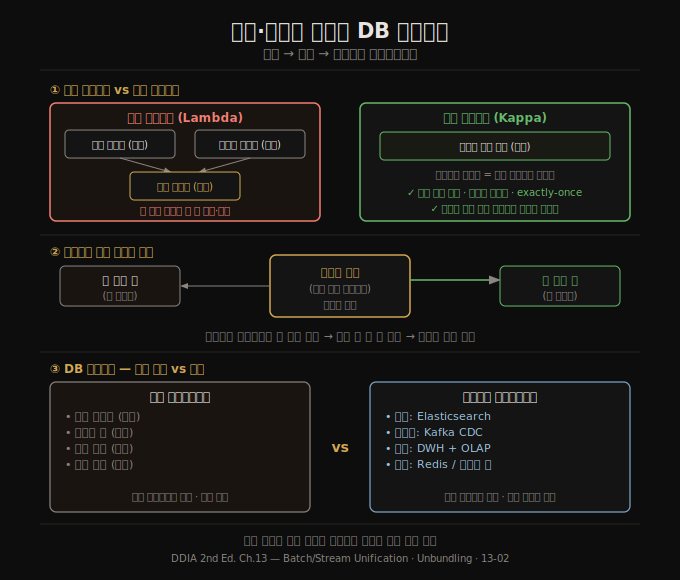

# 배치·스트림 통합과 DB 언번들링
> 배치와 스트림을 하나의 엔진으로 통합하고, 데이터베이스 내부 기능을 외부로 꺼내 조합하면 더 유연하고 유지보수하기 쉬운 시스템이 만들어집니다.

이 노트를 읽고 나면 람다 아키텍처의 문제점과 카파 아키텍처가 이를 어떻게 개선했는지, 데이터베이스를 '언번들링(unbundling)'한다는 개념이 무엇인지, 그리고 연합 데이터베이스와 언번들드 데이터베이스의 차이를 설명할 수 있습니다.

이 편은 13-01에서 확립한 "파생 데이터를 이벤트 로그로 관리한다"는 원칙을 확장합니다. 배치·스트림 처리를 어떻게 하나로 묶는지, 그리고 그 결과가 데이터베이스라는 통합 제품과 어떻게 다른지 살핍니다.

## 1. 파생 상태 유지와 비동기성의 가치
> 파생 시스템을 동기적으로 유지하는 것은 가능하지만, 비동기성이 시스템을 더 견고하게 만듭니다.

파생 데이터(검색 인덱스, 집계 캐시, 추천 모델)는 원칙적으로 동기적으로 유지할 수 있습니다. 관계형 데이터베이스가 트랜잭션 안에서 보조 인덱스를 동기 갱신하는 것이 그 예입니다.

그러나 이벤트 로그 기반 시스템이 **비동기성**을 채택하는 이유는 내결함성 때문입니다. 파생 소비자 하나가 느려지거나 실패해도 이벤트 로그가 메시지를 버퍼링하므로, 프로듀서와 나머지 소비자는 영향받지 않습니다. 분산 트랜잭션은 참여자 하나의 실패가 전체 중단으로 이어지지만, 비동기 이벤트 로그는 장애를 국소화합니다.

또한 보조 인덱스가 샤드 경계를 넘는 경우를 생각해 보면, 샤딩된 시스템에서 보조 인덱스를 동기적으로 유지하려면 여러 샤드에 동시에 쓰거나 모든 샤드를 읽어야 합니다(3장 참조). 이런 교차 샤드 통신도 비동기 유지 시 가장 신뢰성이 높습니다.

## 2. 재처리를 통한 시스템 진화
> 기존 데이터를 새 변환 코드로 재처리하면 스키마 변경이나 기능 추가를 점진적으로 안전하게 할 수 있습니다.

배치와 스트림 처리 모두 **파생 상태를 유지하는 데 유용**하지만 역할이 다릅니다. 스트림 처리는 입력 변경을 낮은 지연으로 파생 뷰에 반영하고, 배치 처리는 누적된 대용량 히스토리 데이터를 재처리해서 새로운 뷰를 만듭니다.

재처리는 애플리케이션을 진화시키는 강력한 도구입니다. 단순히 새 옵셔널 필드를 추가하는 수준을 넘어, 데이터 구조 전체를 완전히 다른 모델로 재구성할 수 있습니다. 철도 궤간 표준화의 비유가 이를 잘 설명합니다. 19세기 영국에서 표준 궤간이 정해졌을 때, 기존 선로를 즉시 교체하는 대신 **3선식(dual gauge)** 을 임시 도입해 두 규격의 열차가 공존하게 했습니다. 이처럼 **새 스키마와 구 스키마를 동시에 파생 뷰로 유지**하면 점진적 전환이 가능합니다. 일부 사용자만 새 뷰로 라우팅해 검증하고, 문제가 없으면 비율을 높이고, 구 뷰는 나중에 제거합니다.

이 방식의 가장 큰 이점은 **모든 단계가 되돌릴 수 있다**는 점입니다. 잘못됐을 때 돌아갈 수 있는 시스템이 있으므로, 변경에 더 자신 있게 나아갈 수 있습니다.

## 3. 람다 아키텍처의 문제와 카파 아키텍처
> 람다는 배치와 스트림을 병렬 운영해 복잡도를 높였습니다. 카파는 스트림 하나로 통합합니다.

**람다 아키텍처(lambda architecture)** 는 배치 처리(정확하지만 느림)와 스트림 처리(빠르지만 근사치)를 병렬로 운영하고 읽기 시점에 결과를 합치는 방식입니다. 처음에는 좋아 보였지만 실제로는 두 코드 경로를 동시에 개발·유지·테스트해야 하는 부담이 컸습니다. 같은 비즈니스 로직을 서로 다른 프레임워크로 두 번 구현하는 셈입니다.

**카파 아키텍처(kappa architecture)** 는 배치 처리를 없애고 스트림 하나로 통합합니다. 핵심 통찰은 "배치 처리는 단지 스트림 처리의 특수한 경우"라는 것입니다. 배치 재처리가 필요하면 히스토리 이벤트를 스트림 엔진에 다시 주입하면 됩니다. 이를 가능하게 하는 조건은 세 가지입니다.

1. **이벤트 재재생**: 로그 기반 브로커(Kafka 등)가 히스토리 이벤트를 재생할 수 있어야 합니다.
2. **정확히 한 번(exactly-once) 의미론**: 재처리 시에도 장애가 없었던 것과 같은 결과를 보장해야 합니다.
3. **이벤트 시간 기반 윈도우**: 처리 시간이 아닌 이벤트 발생 시간으로 윈도우를 잡아야, 히스토리 재처리 결과가 실시간 처리 결과와 일치합니다.

## 4. 데이터베이스 언번들링
> 데이터베이스가 내부에서 제공하는 기능(인덱스, 구체화 뷰, 복제 로그)을 외부로 꺼내 조합하면 더 넓은 워크로드를 처리할 수 있습니다.

데이터베이스, 배치/스트림 프로세서, 운영체제는 추상적으로 보면 모두 같은 일을 합니다. 데이터를 저장하고 처리·조회할 수 있게 합니다. 데이터베이스가 내부에서 제공하는 기능들을 나열해보면 흥미로운 패턴이 보입니다.

- **보조 인덱스**: 특정 필드 기준으로 효율적 검색
- **구체화 뷰**: 쿼리 결과를 미리 계산해 캐싱
- **복제 로그**: 다른 노드에 데이터 변경 사항 전파
- **전문 검색 인덱스**: 키워드 검색

배치/스트림 프로세서로 파생 데이터를 유지하는 것은 이 기능들과 정확히 같은 일입니다. `CREATE INDEX`를 실행하면 데이터베이스는 기존 데이터를 스캔해 인덱스를 만들고 이후 변경을 반영합니다. 이는 CDC를 이용해 스트리밍 시스템에서 새 소비자를 붙이는 과정과 동일합니다. 둘 다 기존 데이터를 재처리해서 파생 뷰를 만들고 이후 업데이트를 유지합니다.

이 관점에서 보면, 조직 전체의 데이터플로우는 하나의 거대한 데이터베이스와 같습니다. 배치·스트림 프로세서는 트리거, 저장 프로시저, 구체화 뷰 유지 알고리즘의 정교한 구현이고, 파생 데이터 시스템은 다양한 인덱스 타입입니다.

## 5. 연합 DB vs 언번들드 DB
> 읽기를 통합하는 방법이 연합 데이터베이스이고, 쓰기를 통합하는 방법이 언번들드 데이터베이스입니다.

이질적인 저장·처리 시스템을 어떻게 통합할지에 대한 두 가지 관점이 있습니다.

**연합 데이터베이스(federated database / polystore)** 는 다양한 저장 엔진 위에 통합 쿼리 인터페이스를 제공합니다. PostgreSQL의 외부 데이터 래퍼(FDW), Trino, Hoptimator 같은 연합 쿼리 엔진이 이 패턴입니다. 관계형 전통의 고수준 쿼리 언어와 우아한 의미론을 따르지만 구현이 복잡합니다. 단, 읽기 통합에는 좋지만 여러 시스템 간 쓰기 동기화에는 답이 없습니다.

**언번들드 데이터베이스(unbundled database)** 는 CDC와 이벤트 로그로 쓰기 동기화를 해결합니다. Unix 철학—한 가지를 잘 하는 작은 도구들이 파이프로 연결되는—을 분산 데이터 시스템에 적용한 것입니다. 구현 복잡도는 있지만, 넓은 범위의 워크로드를 단일 통합 제품보다 더 잘 처리할 수 있습니다.

언번들링을 작동시키는 핵심은 **느슨한 결합(loose coupling)** 입니다. 시스템 수준에서는 소비자가 느려지거나 실패해도 이벤트 로그가 버퍼링하므로 다른 컴포넌트가 영향받지 않습니다. 인간 수준에서는 각 팀이 명확한 인터페이스(이벤트 로그)를 통해 독립적으로 개발·배포할 수 있습니다.

단, 언번들링이 항상 정답은 아닙니다. 단일 기술이 모든 요구를 충족한다면 그것을 쓰는 편이 낫습니다. 언번들링의 이점은 단일 도구로 모든 요구를 만족시킬 수 없을 때 비로소 나타납니다.

## 자주 받는 오해
1. **"람다 아키텍처는 낡은 개념이므로 지금도 쓴다면 잘못된 것이다"** — 람다의 문제는 개념이 아니라 두 코드 경로를 동시에 유지해야 하는 비용입니다. 최신 스트림 프로세서가 배치 재처리까지 지원하면서 카파가 더 현실적 선택이 됐지만, 기존 람다 시스템이 있다면 점진적 전환이 올바른 접근입니다.
2. **"언번들드 DB는 데이터베이스를 대체한다"** — 언번들드 방식도 스트림 프로세서의 상태 저장, 배치/스트림 출력 서빙에 데이터베이스가 필요합니다. 언번들링은 데이터베이스를 없애는 것이 아니라 더 넓은 워크로드를 다루기 위해 여러 전문 도구를 조합하는 방식입니다.
3. **"재처리는 비용이 크므로 꼭 필요할 때만 써야 한다"** — 재처리는 진화의 핵심 도구입니다. 히스토리 이벤트를 다시 처리해 새 파생 뷰를 만드는 비용은 스키마 마이그레이션을 단번에 수행하는 위험보다 대개 훨씬 낮습니다.

## 면접에서 받을 만한 질문
1. **"람다 아키텍처와 카파 아키텍처의 차이는 무엇인가요?"** — 람다는 배치와 스트림을 병렬 운영해 두 코드 경로를 유지해야 합니다. 카파는 스트림 하나로 통합하고, 배치 재처리가 필요하면 히스토리 이벤트를 스트림 엔진에 재주입합니다. 카파의 전제 조건은 이벤트 재재생, exactly-once 의미론, 이벤트 시간 기반 윈도우입니다.
2. **"데이터베이스 언번들링이란 무엇인가요?"** — 데이터베이스가 내부에서 제공하는 인덱스, 구체화 뷰, 복제 로그 같은 기능을 외부 시스템(CDC, 스트림 프로세서, 검색 엔진 등)으로 꺼내 조합하는 아키텍처입니다. Unix 파이프 철학을 분산 데이터 시스템에 적용한 것으로, 단일 통합 제품보다 넓은 워크로드를 처리할 수 있지만 운영 복잡도가 높아집니다.
3. **"재처리를 통한 점진적 마이그레이션이란 어떤 방식인가요?"** — 새 스키마와 구 스키마를 동시에 파생 뷰로 유지하면서, 점차 새 뷰로 트래픽을 이동시킵니다. 문제 발생 시 구 뷰로 되돌릴 수 있으므로 마이그레이션 위험이 크게 낮아집니다.

## 관련 문서
- [13-01.데이터 통합 — 파생 데이터와 전순서의 한계](13-01.%EB%8D%B0%EC%9D%B4%ED%84%B0%20%ED%86%B5%ED%95%A9%20%E2%80%94%20%ED%8C%8C%EC%83%9D%20%EB%8D%B0%EC%9D%B4%ED%84%B0%EC%99%80%20%EC%A0%84%EC%88%9C%EC%84%9C%EC%9D%98%20%ED%95%9C%EA%B3%84.md) — 파생 데이터 흐름과 전순서 한계
- [13-03.데이터플로우 중심 애플리케이션 설계](13-03.%EB%8D%B0%EC%9D%B4%ED%84%B0%ED%94%8C%EB%A1%9C%EC%9A%B0%20%EC%A4%91%EC%8B%AC%20%EC%95%A0%ED%94%8C%EB%A6%AC%EC%BC%80%EC%9D%B4%EC%85%98%20%EC%84%A4%EA%B3%84.md) — 앱 코드와 상태 분리, stateful 클라이언트
- [README](README.md) — 전체 학습 지도
