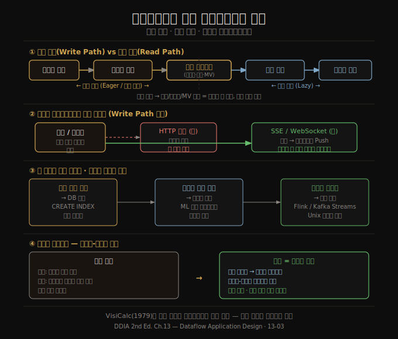

# 데이터플로우 중심 애플리케이션 설계
> 데이터베이스를 수동적 변수가 아닌 상태 변경의 흐름으로 바라보면, 애플리케이션 코드와 UI까지 스트림의 일부가 됩니다.

이 노트를 읽고 나면 쓰기 경로(write path)와 읽기 경로(read path)의 분리가 무엇인지, 상태를 클라이언트까지 밀어 내보내는 방식이 어떤 이점을 주는지, 그리고 읽기 요청 자체를 이벤트로 모델링할 때 무엇이 달라지는지 설명할 수 있습니다.

이 편은 13-02에서 다룬 "DB 언번들링"을 애플리케이션 설계 수준으로 내려받습니다. 추상적인 시스템 아키텍처에서 실제 코드와 UI가 상태 변경에 어떻게 반응해야 하는지로 논의를 확장합니다.

## 1. 앱 코드를 파생 함수로 보기
> 파생 데이터셋을 만드는 함수가 표준화된 경우(보조 인덱스)는 DB에 내장되지만, 애플리케이션 특화 함수는 커스텀 코드로 처리해야 합니다.

보조 인덱스를 만드는 변환 함수는 너무 흔해서 데이터베이스가 `CREATE INDEX`라는 내장 기능으로 제공합니다. 전문 검색 인덱스는 언어 감지, 어간 분석, 동의어 처리 등 도메인 특화 튜닝이 필요하므로 DB가 일부만 지원합니다. 기계학습 모델은 특성 엔지니어링이 애플리케이션 전반에 걸쳐 있어 DB 내부에 넣기가 사실상 불가능합니다.

결국 **파생 데이터셋을 만드는 함수가 표준이면 DB가 처리하고, 비표준이면 커스텀 코드가 처리**합니다. 스트림 프로세서가 이 커스텀 코드를 실행하는 환경이 됩니다. Unix 파이프처럼, 각 스트림 연산자는 상태 변경 스트림을 입력받아 다른 상태 변경 스트림을 출력합니다.

## 2. 애플리케이션 코드와 상태의 분리
> 현대 웹 애플리케이션은 상태를 데이터베이스에, 로직을 스테이트리스 서비스에 분리했습니다. 데이터플로우는 이 분리를 더 적극적으로 밀어붙입니다.

오늘날 대부분의 웹 애플리케이션은 스테이트리스 서비스로 배포됩니다. 요청이 어느 서버에도 라우팅될 수 있고, 서버는 응답 후 상태를 잊습니다. 상태는 데이터베이스에 있습니다. 이 구조 덕분에 서버를 자유롭게 추가·제거할 수 있습니다.

전통적 모델에서 데이터베이스는 **수동적인 공유 변수**처럼 동작합니다. 애플리케이션이 네트워크로 동기 접근해 읽고 씁니다. 이 모델의 문제는 변수 값이 바뀌어도 독자에게 알림이 가지 않는다는 점입니다. 스프레드시트처럼 입력 셀이 바뀌면 수식 셀이 자동 갱신되는 동작이 없습니다. 데이터베이스 내용이 바뀌었는지 알려면 주기적으로 폴링해야 합니다.

**데이터플로우 관점**은 이 관계를 재정립합니다. 데이터베이스를 수동적 변수가 아니라 상태 변경의 흐름으로 바라보고, 코드가 그 변경에 반응해 다른 곳의 상태를 업데이트하게 합니다. CDC, 액터 모델, 트리거, 증분 뷰 유지가 모두 이 아이디어의 사례입니다.

## 3. 쓰기 경로와 읽기 경로
> 파생 데이터셋은 쓰기 경로와 읽기 경로가 만나는 지점입니다. 그 경계를 어디에 그리느냐가 시스템의 성능 특성을 결정합니다.

데이터의 여정은 두 가지 경로로 구성됩니다.

- **쓰기 경로(write path)**: 데이터가 수집되는 순간부터 모든 파생 처리가 완료될 때까지. 누가 읽을지 모르는 상태에서 미리 계산합니다. 즉시 평가(eager evaluation)와 유사합니다.
- **읽기 경로(read path)**: 사용자 요청이 들어왔을 때만 실행됩니다. 지연 평가(lazy evaluation)와 유사합니다.

전문 검색 인덱스를 예로 들면, 쓰기 경로는 문서 변경 시 인덱스를 갱신하고, 읽기 경로는 쿼리가 들어올 때 인덱스를 검색합니다. 인덱스가 없다면 쓰기 경로의 작업은 없어지지만 읽기 경로에서 전체 문서를 스캔해야 합니다. 반대로 가능한 모든 쿼리의 결과를 미리 계산하면 읽기는 빠르지만 쓰기 비용이 무한히 커집니다.

**캐시, 인덱스, 구체화 뷰의 역할은 쓰기 경로와 읽기 경로의 경계를 이동**시키는 것입니다. 쓰기 시점에 더 많은 일을 해서 읽기 시점의 부담을 줄입니다. 소셜 네트워크 타임라인 사례연구(2장)에서 팬아웃 경계를 어디에 그리는지도 이 관점에서 이해할 수 있습니다.

## 4. 상태를 클라이언트까지 밀어 보내기
> 서버가 상태 변경을 클라이언트까지 능동적으로 전달하면 쓰기 경로가 최종 사용자 장치까지 연장됩니다.

과거 웹 브라우저는 완전한 스테이트리스였습니다. 오프라인에서는 아무것도 할 수 없었습니다. 그러나 싱글 페이지 앱과 모바일 앱은 로컬 상태를 대량으로 저장하고, 서버와의 동기화는 백그라운드에서 비동기로 처리합니다. 이 **로컬 상태는 서버 상태의 캐시**입니다. 화면의 픽셀은 클라이언트 앱의 모델 객체를 구체화한 뷰이고, 모델 객체는 원격 데이터센터 상태의 로컬 복제본입니다.

HTTP의 요청-응답 모델에서는 서버가 먼저 클라이언트에게 변경을 알릴 수 없습니다. RSS 구독도 결국 주기적 폴링입니다. **Server-Sent Events(EventSource API)** 와 **WebSocket**은 TCP 연결을 열어두고 서버가 능동적으로 클라이언트에 메시지를 푸시합니다.

상태 변경을 클라이언트 장치까지 밀어 보내면 쓰기 경로가 최종 사용자까지 연장됩니다. 클라이언트가 처음 초기화될 때는 읽기 경로로 초기 상태를 가져오고, 이후에는 서버가 보내는 상태 변경 스트림을 구독해 최신 상태를 유지합니다. 로그 기반 브로커에서 소비자가 재접속 후 놓친 메시지를 따라잡는 방식과 같습니다.

React, Elm 같은 프론트엔드 도구는 이미 상태 변경에 반응해 UI를 자동 갱신하는 모델을 갖고 있습니다. 이 프로그래밍 모델을 서버가 보내는 상태 변경 이벤트까지 자연스럽게 확장할 수 있습니다.

## 5. 읽기도 이벤트로 — 멀티 샤드 처리
> 읽기 요청을 이벤트 스트림으로 모델링하면, 쓰기 이벤트와 동일한 스트림 처리 인프라를 재사용해 복잡한 멀티 샤드 쿼리를 처리할 수 있습니다.

현재까지의 모델에서 저장소에 대한 쓰기는 이벤트 로그를 통하지만, 읽기는 스토리지 노드에 직접 전송되는 일시적 네트워크 요청입니다. 이 비대칭성을 깨는 아이디어가 **읽기도 이벤트로 표현**하는 것입니다.

읽기 요청을 이벤트로 보내고, 쓰기 이벤트와 동일한 스트림 프로세서로 라우팅하면, **스트림-테이블 조인**이 됩니다. 읽기 이벤트 스트림과 데이터베이스 사이의 조인입니다. 일회성 읽기 요청은 조인 연산자를 통과해 즉시 잊히고, 구독(subscribe) 요청은 반대편의 과거·미래 이벤트와의 영구 조인입니다.

이 방식의 추가 이점은 **인과 추적성**입니다. 읽기 요청 로그가 있으면 사용자가 어떤 정보를 본 후에 어떤 결정을 내렸는지 재구성할 수 있습니다. 예를 들어 온라인 쇼핑에서 예상 배송일 정보가 구매 결정에 영향을 미쳤는지 분석할 수 있습니다.

**멀티 샤드 데이터 처리**에도 이 패턴이 유용합니다. 단일 샤드 쿼리라면 스트림 경유가 과할 수 있지만, 여러 샤드의 데이터를 조합해야 하는 복잡한 쿼리(예: 부정 거래 방지를 위한 IP·이메일·주소별 평판 점수 조합)는 이미 스트림 프로세서가 제공하는 메시지 라우팅·샤딩·조인 인프라를 재사용할 수 있습니다.

## 자주 받는 오해
1. **"쓰기 경로를 클라이언트까지 연장하면 실시간 시스템만 해당한다"** — 여기서 '실시간'은 응답 시간 보장이 아니라 낮은 지연 상호작용을 의미합니다. 인스턴트 메시징과 온라인 게임 외에도 일반 웹 앱이 이 아이디어를 채택할 수 있습니다. 장벽은 요청-응답 상호작용이 깊게 박힌 기존 프레임워크와 프로토콜입니다.
2. **"읽기를 이벤트로 만들면 오버헤드가 너무 크다"** — 단일 샤드 단순 조회라면 맞습니다. 그러나 멀티 샤드 조인이나 인과 추적이 필요한 경우에는 이 방식이 기존 요청-응답보다 오히려 깔끔합니다. 이미 운영 목적으로 읽기 로그를 남긴다면 추가 비용이 크지 않습니다.
3. **"데이터플로우 관점은 이상론이고 실용적이지 않다"** — VisiCalc가 1979년에 이미 스프레드시트 수식 자동 갱신을 구현했습니다. 오늘날 데이터 시스템이 이 아이디어를 전사 인프라 수준에서 실현하는 것은 기술적으로 가능하며, Kafka Streams, Flink, Materialize 같은 도구들이 이미 이 방향으로 움직이고 있습니다.

## 면접에서 받을 만한 질문
1. **"쓰기 경로와 읽기 경로의 분리가 왜 중요한가요?"** — 캐시, 인덱스, 구체화 뷰가 이 경계를 이동시키는 도구입니다. 쓰기 시점에 미리 계산을 더 하면 읽기가 빨라지고, 반대로 쓰기를 단순하게 유지하면 읽기 비용이 높아집니다. 시스템 설계는 이 경계를 어디에 그을지 결정하는 작업입니다.
2. **"서버가 상태 변경을 클라이언트에 능동적으로 밀어 보내는 것(push)의 장점은 무엇인가요?"** — 클라이언트가 항상 최신 상태를 갖게 되어 UI 응답성이 높아집니다. 오프라인 지원도 자연스럽게 됩니다. 재접속 시 놓친 이벤트를 로그 기반 브로커에서 따라잡는 방식으로 구현할 수 있습니다.
3. **"읽기 요청을 이벤트로 모델링하면 어떤 이점이 있나요?"** — 쓰기 이벤트와 동일한 스트림 처리 인프라를 재사용해 멀티 샤드 조인을 처리할 수 있습니다. 또한 읽기 로그가 생겨 사용자가 어떤 정보를 본 뒤 어떤 결정을 내렸는지 인과 추적이 가능해집니다.

## 관련 문서
- [13-02.배치·스트림 통합과 DB 언번들링](13-02.%EB%B0%B0%EC%B9%98%C2%B7%EC%8A%A4%ED%8A%B8%EB%A6%BC%20%ED%86%B5%ED%95%A9%EA%B3%BC%20DB%20%EC%96%B8%EB%B2%88%EB%93%A4%EB%A7%81.md) — 배치·스트림 통합과 언번들링 기반
- [13-04.정확성과 신뢰·13장 종합](13-04.%EC%A0%95%ED%99%95%EC%84%B1%EA%B3%BC%20%EC%8B%A0%EB%A2%B0%C2%B713%EC%9E%A5%20%EC%A2%85%ED%95%A9.md) — 정확성·end-to-end 인수·trust-but-verify
- [README](README.md) — 전체 학습 지도
