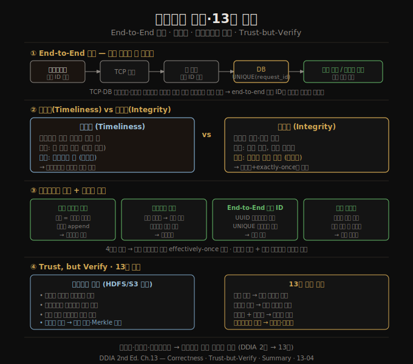

# 정확성과 신뢰·13장 종합
> 강한 일관성 보장 없이도 데이터 무결성을 달성할 수 있습니다. 핵심은 end-to-end 관점, 멱등성, 비동기 제약 검사, 그리고 신뢰하되 검증하는 태도입니다.

이 노트를 읽고 나면 end-to-end 인수가 데이터 시스템에 어떻게 적용되는지, 적시성(timeliness)과 무결성(integrity)이 왜 별개의 요구사항인지, 그리고 이벤트 기반 시스템이 분산 트랜잭션 없이 어떻게 강한 무결성 보장을 달성하는지 설명할 수 있습니다. 13장 전체를 종합합니다.

## 1. End-to-End 인수와 데이터베이스
> 직렬화 트랜잭션을 사용하더라도 애플리케이션 버그나 중복 요청은 막지 못합니다. 정확성은 end-to-end 관점에서 다뤄야 합니다.

**end-to-end 인수**는 1984년 Saltzer, Reed, Clark이 정리한 원칙입니다. 어떤 기능을 완전하고 올바르게 구현하려면 그 기능을 사용하는 애플리케이션 양 끝의 지식과 도움이 반드시 필요합니다. 통신 시스템 자체가 그 기능을 제공하는 것은 불완전합니다.

예를 들어 TCP는 패킷 중복을 연결 수준에서 제거합니다. 그러나 사용자가 네트워크 문제로 HTTP POST 요청을 재시도하면, 두 번째 POST는 별개의 TCP 연결이므로 TCP 중복 제거가 작동하지 않습니다. 데이터베이스 트랜잭션을 쓰더라도 같은 이체가 두 번 실행될 수 있습니다. **TCP, 데이터베이스 트랜잭션, 스트림 프로세서 각각은 자기 범위 안에서만 중복을 제거**합니다. 시스템 전체를 아우르는 end-to-end 해결책이 없으면 중복이 새어 들어올 여지가 항상 있습니다.

실용적 해결책은 **클라이언트 생성 요청 ID(UUID)** 를 end-to-end로 전달해 데이터베이스에서 유니크 제약으로 중복을 차단하는 것입니다. 이 요청 ID는 동시에 감사 로그 역할을 하며 이벤트 소싱이나 CDC에 활용할 수 있습니다.

## 2. 적시성 vs 무결성 — 두 가지 별개의 요구
> 적시성 위반은 일시적 불편이고, 무결성 위반은 영구적 손상입니다. 둘을 혼동하면 설계 판단이 흐려집니다.

"일관성(consistency)"이라는 단어가 두 가지 요구를 뒤섞어 쓰이는 경우가 많습니다.

**적시성(timeliness)**: 사용자가 최신 상태를 봐야 한다는 요구입니다. 복제 지연으로 구 버전을 읽는 것이 적시성 위반입니다. 기다리면 해결됩니다. CAP 정리에서 말하는 선형성(linearizability)은 강한 적시성 보장입니다.

**무결성(integrity)**: 데이터 손실이나 모순 없음을 요구합니다. 인덱스가 기반 테이블과 불일치하거나, 이중 청구가 발생하거나, 돈이 사라지는 것이 무결성 위반입니다. 기다린다고 해결되지 않으며 명시적 수리가 필요합니다.

대부분의 애플리케이션에서 **무결성이 적시성보다 훨씬 중요**합니다. 신용카드 명세서에 24시간 전 거래가 아직 안 보이는 것은 허용 가능하지만, 잔액 합산이 틀리거나 거래가 사라지면 심각한 문제입니다. 이벤트 기반 비동기 시스템은 적시성을 포기하는 대신 무결성을 더 유연하게 달성할 수 있습니다.

## 3. 분산 트랜잭션 없이 무결성 달성하기
> 이벤트 기반 시스템은 exactly-once 의미론, 멱등성, end-to-end 요청 ID를 조합해 분산 트랜잭션 없이도 무결성을 보장합니다.

이벤트 기반 데이터플로우 시스템은 다음 네 가지 메커니즘을 조합해 강한 무결성 보장을 달성합니다.

1. **쓰기 연산을 단일 메시지로 표현**: 쓰기의 내용을 하나의 원자적 메시지에 담아 이벤트 로그에 씁니다. 이 하나의 이벤트 기록이 원자적 액션입니다.
2. **결정론적 파생 함수**: 모든 파생 상태 업데이트는 이 단일 메시지에서 결정론적으로 도출됩니다. 저장 프로시저와 유사합니다.
3. **클라이언트 생성 요청 ID**: 모든 처리 수준을 end-to-end로 통과하는 요청 ID로 중복을 제거하고 멱등성을 확보합니다.
4. **불변 메시지 + 재처리**: 메시지가 불변이므로 버그 수정 후 데이터를 재처리해 파생 상태를 복구할 수 있습니다.

멀티 샤드 거래 처리를 예로 들면, 원천 계좌 로그 샤드에 요청을 원자적으로 기록하면 이후 모든 다운스트림 이벤트(출금·입금·수수료)는 크래시와 중복에도 불구하고 결국 나타납니다. 원자성은 트랜잭션이 아닌 "최초 이벤트 기록"에서 나옵니다.

## 4. 느슨한 제약과 사후 보정
> 비즈니스 요구에 따라 제약을 사전에 강제하지 않고 사후에 보정하는 방식이 더 높은 가용성과 성능을 제공합니다.

유니크 제약을 강제하려면 합의가 필요하고, 합의는 동기 코디네이션을 수반합니다. 그러나 많은 비즈니스 컨텍스트에서 제약 위반 후 보정하는 비용이 사전 방지 비용보다 낮습니다.

- **재고 초과 판매**: 재고보다 많이 팔리면 사과하고 할인을 제공합니다. 어차피 창고 사고에도 동일한 사후 프로세스가 필요합니다.
- **항공권 오버부킹**: "1인 1좌석" 제약을 의도적으로 어기고 업그레이드·환불로 보정합니다.
- **ATM 초과 인출**: 일일 인출 한도로 위험을 제한하고 연체료로 대응합니다.

이런 경우 데이터를 먼저 쓰고 사후에 제약을 비동기로 검사하는 방식이 타당합니다. 무결성은 필요하지만 적시성 있는 제약 강제는 필요 없습니다. **사후 보정 거래(compensating transaction)** 가 비즈니스 프로세스의 일부로 이미 존재해야 하는 경우라면, 낙관적 쓰기 후 검사가 더 현실적입니다.

## 5. 코디네이션 회피 데이터 시스템
> 비동기 이벤트 처리와 느슨한 제약을 결합하면 동기 코디네이션 없이도 강한 무결성을 가진 고성능·고가용 시스템을 만들 수 있습니다.

두 가지 관찰을 합치면 중요한 결론이 나옵니다.

1. 데이터플로우 시스템은 원자적 커밋, 선형성, 동기 크로스 샤드 코디네이션 없이도 파생 데이터의 무결성을 유지할 수 있습니다.
2. 많은 애플리케이션이 일시적 제약 위반 후 사후 보정을 허용합니다.

이 두 가지를 합치면 **코디네이션 회피 데이터 시스템(coordination-avoiding data systems)** 이 됩니다. 이런 시스템은 여러 데이터센터에 걸친 멀티 리더 구성으로도 작동할 수 있습니다. 각 데이터센터가 독립적으로 운영되고 비동기로 복제합니다. 적시성 보장은 약하지만(선형성 불가) 무결성 보장은 강합니다.

직렬화 트랜잭션도 사라지지 않습니다. 파생 상태 유지나 소규모 범위에서는 여전히 유용합니다. 단, XA 같은 이종 분산 트랜잭션은 필요하지 않습니다. 코디네이션이 꼭 필요한 곳(되돌리기 어려운 액션 이전의 엄격한 제약 강제)에만 비용을 지불합니다.

## 6. 신뢰하되 검증하기
> 하드웨어와 소프트웨어는 예상치 못하게 실패합니다. 지속적 무결성 검사가 문제를 조기에 발견하는 유일한 방법입니다.

우리는 시스템 모델에서 특정 가정을 세웁니다. 프로세스는 크래시할 수 있고 네트워크는 지연될 수 있다고 가정하면서, 디스크에 fsync된 데이터는 사라지지 않고 CPU 곱셈은 올바르다고 가정합니다.

그러나 현실은 확률의 문제입니다. 대규모에서는 극히 드문 일도 실제로 발생합니다. 디스크는 조용히 데이터를 손상시키고, 메모리는 소프트 에러를 일으키며, 네트워크는 비트를 뒤집습니다. 잘 사용되는 데이터베이스 소프트웨어에도 버그가 있습니다(MySQL 유니크 제약 버그, PostgreSQL 직렬화 수준 이상 사례 등).

HDFS와 Amazon S3가 채택한 접근법이 **신뢰하되 검증(trust, but verify)** 입니다. 디스크가 대부분의 경우 올바르다고 가정하면서도, 백그라운드 프로세스가 파일을 지속적으로 읽어 다른 복제본과 비교하고 손상을 찾아냅니다. **백업을 가끔 복원해 보는 것도 같은 원칙**입니다. 실제로 복원해보기 전까지는 백업이 작동하는지 알 수 없습니다.

이벤트 소싱 방식은 감사(audit) 가능성을 높입니다. 사용자 입력이 불변 이벤트로 기록되고 모든 파생 상태가 그로부터 결정론적으로 나오므로, 이벤트 로그를 같은 코드로 재실행해 파생 상태를 검증할 수 있습니다. 이벤트 저장소의 해시 체인이나 Merkle 트리로 변조를 감지하는 것도 가능합니다. 블록체인의 암호학적 도구들이 훨씬 가벼운 형태로 일반 데이터 시스템에 적용될 수 있습니다.

## 7. 13장 종합 — 스트리밍 시스템의 철학
> 13장의 핵심: 단일 도구 대신 이벤트 로그로 묶인 전문 시스템의 조합, 그 위에서 end-to-end 무결성을 달성하는 것.

13장이 전개한 논지를 한 줄로 요약하면 이렇습니다. **어떤 단일 도구도 모든 접근 패턴을 만족할 수 없으므로, 이벤트 로그를 통해 전문 시스템을 조합하고, 파생 데이터의 정확성을 end-to-end로 보장한다.**

각 편을 연결하면 다음과 같습니다.

| 편 | 핵심 질문 | 답 |
|----|----------|-----|
| 13-01 | 여러 시스템을 어떻게 일관되게 유지하는가? | CDC·이벤트 로그로 단일 쓰기 순서 확립 |
| 13-02 | 배치와 스트림을 어떻게 통합하는가? | 카파 아키텍처·재처리·DB 언번들링 |
| 13-03 | 앱 코드를 어떻게 설계하는가? | 데이터플로우 중심·상태 푸시·읽기도 이벤트 |
| 13-04 | 정확성을 어떻게 보장하는가? | End-to-end 인수·멱등성·느슨한 제약·감사 |

책 전반의 신뢰성·확장성·유지보수성이라는 목표는 스트리밍 철학 안에서 이렇게 수렴됩니다. 신뢰성은 비동기 이벤트 로그의 내결함성으로, 확장성은 코디네이션 회피로, 유지보수성은 재처리를 통한 점진적 진화로 달성됩니다.

## 자주 받는 오해
1. **"End-to-end 인수는 하위 레이어 신뢰성이 필요 없다는 뜻이다"** — 그렇지 않습니다. TCP 패킷 재정렬 같은 하위 레이어 기능은 상위 레이어 오류 확률을 낮추는 데 유용합니다. 단지 그것만으로 end-to-end 정확성을 보장하기는 충분하지 않다는 뜻입니다.
2. **"적시성이 낮아도 되면 무결성은 자동으로 따라온다"** — 둘은 독립적입니다. 비동기 시스템이 적시성을 포기하지만 무결성을 보장하려면 exactly-once 의미론, 멱등성, 중복 억제 같은 명시적 메커니즘이 필요합니다.
3. **"느슨한 제약은 데이터 품질 포기다"** — 아닙니다. 제약 위반을 허용하되 사후 보정으로 무결성을 회복하는 것입니다. 어차피 외부 사건(창고 사고, 항공기 결항)으로 제약이 깨지는 경우가 있으므로 보정 프로세스는 필수입니다. 낙관적 쓰기는 그 필수 프로세스를 더 넓게 적용하는 것입니다.

## 면접에서 받을 만한 질문
1. **"이벤트 기반 시스템에서 exactly-once를 어떻게 달성하나요?"** — 네 가지 메커니즘을 조합합니다. ① 쓰기를 단일 이벤트로 표현해 로그에 원자적으로 기록, ② 파생 상태를 결정론적으로 도출, ③ 클라이언트 생성 요청 ID로 end-to-end 중복 억제, ④ 불변 이벤트와 재처리로 버그 후 복구. 이를 통해 분산 트랜잭션 없이 유효 exactly-once를 달성합니다.
2. **"적시성과 무결성의 차이가 왜 중요한가요?"** — 설계 결정이 달라지기 때문입니다. 적시성은 선형성·동기 복제 같은 비용 높은 수단으로만 보장됩니다. 무결성은 비동기 이벤트 처리 위에서 멱등성과 중복 억제로 달성할 수 있습니다. 둘을 구분하면 꼭 필요한 곳에만 코디네이션 비용을 지불할 수 있습니다.
3. **"코디네이션 회피 데이터 시스템이란 무엇이고, 언제 적합한가요?"** — 동기 크로스 노드 코디네이션 없이 이벤트 로그와 멱등성으로 무결성을 유지하는 시스템입니다. 지리 분산·고가용성이 필요하고 일시적 제약 위반을 사후 보정으로 처리할 수 있는 비즈니스 맥락에 적합합니다. 선형성이 필수이거나 되돌리기 어려운 액션(결제 확정 등) 직전에는 여전히 동기 코디네이션이 필요합니다.

## 관련 문서
- [13-03.데이터플로우 중심 애플리케이션 설계](13-03.%EB%8D%B0%EC%9D%B4%ED%84%B0%ED%94%8C%EB%A1%9C%EC%9A%B0%20%EC%A4%91%EC%8B%AC%20%EC%95%A0%ED%94%8C%EB%A6%AC%EC%BC%80%EC%9D%B4%EC%85%98%20%EC%84%A4%EA%B3%84.md) — 쓰기·읽기 경로, 상태 푸시, 읽기도 이벤트
- [12-04.시간 추론과 내결함성·12장 종합](12-04.%EC%8B%9C%EA%B0%84%20%EC%B6%94%EB%A1%A0%EA%B3%BC%20%EB%82%B4%EA%B2%B0%ED%95%A8%EC%84%B1%C2%B712%EC%9E%A5%20%EC%A2%85%ED%95%A9.md) — 이벤트 시간·exactly-once 기법
- [README](README.md) — 전체 학습 지도
