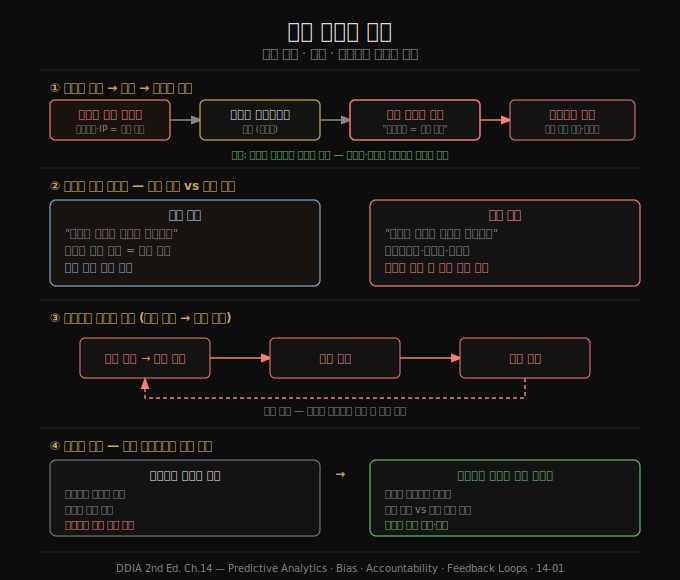

# 예측 분석의 윤리 — 편향·책임·피드백 루프
> 데이터로 사람에 대한 자동 결정을 내릴 때, 과거의 차별을 학습해 증폭하지 않으려면 엔지니어가 결과에 책임을 져야 합니다.

이 노트를 읽고 나면 예측 분석이 왜 윤리적 딜레마를 안고 있는지, 편향된 입력이 어떻게 편향된 출력을 만드는지, 자동 결정의 책임은 누구에게 있는지, 그리고 자기강화 피드백 루프를 어떻게 시스템 사고로 예측하는지 설명할 수 있습니다. 14장은 이 책의 마지막 장으로, 기술 자체가 아니라 그 기술이 사람에게 미치는 영향을 다룹니다.

기술은 그 자체로 선하거나 악하지 않습니다. 검색 엔진이든 총이든, 중요한 것은 어떻게 쓰이고 사람에게 어떤 영향을 주는가입니다. 윤리적 책임은 우리 엔지니어가 짊어집니다. 기술에만 집중하고 그 결과를 외면하는 것으로는 충분하지 않습니다.

## 1. 예측 분석과 알고리즘 감옥
> 날씨나 질병 확산을 예측하는 것과, 한 개인의 재범·채무불이행을 예측하는 것은 다른 차원의 문제입니다. 후자는 개인의 삶을 직접 좌우합니다.

예측 분석은 빅데이터와 AI에 대한 기대의 핵심이지만 동시에 윤리적 딜레마로 가득합니다. 사람에 대한 예측, 즉 재범 가능성·대출 채무불이행·보험 청구 가능성 같은 예측은 개인의 삶에 직접 영향을 미칩니다.

조직 입장에서는 신중함이 합리적입니다. 결제 네트워크는 사기 거래를, 은행은 부실 대출을 피하고 싶어 합니다. 놓친 기회의 비용은 낮지만 나쁜 대출이나 문제 직원의 비용은 높으므로, 의심스러우면 "아니오"라고 답하는 편이 안전합니다.

문제는 알고리즘 결정이 광범위해질 때 발생합니다. (정확하게든 잘못이든) 위험하다고 분류된 사람은 수많은 "아니오" 결정을 누적해 받습니다. 일자리·항공 여행·보험·임대·금융 서비스에서 체계적으로 배제되는 것은 개인의 자유에 대한 큰 제약이며, 이것을 **알고리즘 감옥(algorithmic prison)** 이라 부릅니다. 한 시스템이 누군가를 위험하다고 표시하면, 그 라벨은 여러 서비스로 전파되어 배제가 누적됩니다. 인권을 존중하는 형사 사법은 유죄 입증 전까지 무죄로 추정합니다. 그러나 자동 시스템은 증거도 항소 기회도 없이 한 사람을 사회 참여에서 배제할 수 있습니다.

## 2. 편향과 차별 — 입력의 편향은 출력으로 증폭된다
> 알고리즘에 규칙을 명시하는 대신 데이터에서 규칙을 추론하게 두면, 입력의 체계적 편향이 출력에서 학습·증폭됩니다.

알고리즘의 결정이 사람의 결정보다 반드시 낫거나 못한 것은 아닙니다. 사람은 누구나 편향을 가지며 차별적 관행은 문화적으로 제도화될 수 있습니다. 데이터에 근거한 결정이 주관적·본능적 판단보다 공정할 수 있다는 희망도 있습니다.

그러나 예측 분석과 AI 시스템을 만들 때 우리는 단순히 사람의 결정을 소프트웨어로 자동화하는 것이 아니라, **규칙 자체를 데이터에서 추론하도록 맡깁니다**. 학습된 패턴은 불투명합니다. 데이터가 상관관계를 보여도 그 이유를 알 수 없습니다. 입력에 체계적 편향이 있으면 시스템은 그 편향을 출력에서 학습하고 증폭합니다.

많은 나라의 차별금지법은 인종·나이·성별·장애·신념 같은 보호 특성에 따른 차등 대우를 금지합니다. 그런데 다른 특성이 보호 특성과 상관되면 어떻게 될까요? 인종 분리가 심한 지역에서는 우편번호나 IP 주소조차 인종의 강력한 예측 변수입니다. 편향된 데이터를 입력해 공정한 출력을 얻을 수 있다는 믿음은 "머신러닝은 편향을 위한 자금 세탁"이라는 풍자로 비판받습니다.

예측 분석은 과거를 외삽할 뿐입니다. 과거가 차별적이면 그 차별을 코드화하고 증폭합니다. 미래가 과거보다 나아지길 원한다면 도덕적 상상력이 필요하며, 그것은 오직 사람만이 제공할 수 있습니다. 데이터와 모델은 우리의 도구여야지 주인이 되어서는 안 됩니다.

## 3. 책임과 설명 가능성
> 사람이 실수하면 책임을 묻고 항소할 수 있습니다. 알고리즘도 실수하는데, 잘못되면 누가 책임지는가가 핵심 질문입니다.

자동 결정은 책임과 설명 가능성의 문제를 제기합니다. 자율주행차가 사고를 내면 누가 책임지는가, 신용 평가 알고리즘이 특정 인종·종교를 체계적으로 차별하면 구제 수단이 있는가, ML 시스템의 결정이 사법 심사를 받을 때 판사에게 알고리즘이 어떻게 결정했는지 설명할 수 있는가 — 사람은 알고리즘을 핑계로 책임을 회피할 수 없어야 합니다.

신용 평가는 고전적 예시입니다. 전통적 신용 점수는 개인의 실제 대출 이력이라는 관련 사실에 근거하며 기록 오류를 정정할 수 있습니다. 그러나 머신러닝 기반 점수는 훨씬 넓은 입력을 쓰고 훨씬 불투명해, 특정 결정이 어떻게 나왔는지, 누군가가 불공정하게 대우받는지 이해하기 어렵습니다.

차이를 한 문장으로 정리하면 이렇습니다. 신용 점수는 "당신이 과거에 어떻게 행동했는가"를 요약하지만, 예측 분석은 "당신과 비슷한 사람이 과거에 어떻게 행동했는가"로 작동합니다. 타인의 행동에 빗대는 것은 사람을 거주지 같은 대리 변수(인종·계층의 근사치)로 고정관념화하는 셈입니다. 잘못된 버킷에 분류된 사람의 사정은 반영되지 않으며, 잘못된 데이터로 결정이 틀려도 구제는 거의 불가능합니다.

데이터의 상당 부분은 통계적입니다. 전체 확률 분포가 맞아도 개별 사례는 틀릴 수 있습니다. 평균 기대 수명이 80세라고 해서 누군가가 80번째 생일에 죽을 것이라 말할 수 없듯이, 예측 시스템의 출력도 확률적이라 개별 사례에서 충분히 틀릴 수 있습니다. 데이터의 우월성에 대한 맹목적 믿음은 망상일 뿐 아니라 위험합니다.

## 4. 피드백 루프와 시스템 사고
> 예측이 사람의 행동을 바꾸고, 바뀐 행동이 다시 예측의 입력이 되는 자기강화 루프는 수학적 엄밀함의 위장 뒤에서 차별을 악순환시킵니다.

영향이 덜 즉각적인 추천 시스템에도 어려운 문제가 있습니다. 사용자가 보고 싶어 하는 콘텐츠를 잘 예측할수록, 이미 동의하는 의견만 보여주는 **에코 챔버**가 형성되어 고정관념·허위정보·양극화가 자랍니다. 소셜 미디어 에코 챔버가 선거에 미친 영향을 우리는 이미 목격하고 있습니다.

특히 위험한 것은 **자기강화 피드백 루프**입니다. 고용주가 신용 점수로 채용 후보를 평가하는 경우를 보겠습니다. 통제 밖의 불운으로 재정 곤란에 빠지면 신용 점수가 떨어지고, 그러면 일자리를 찾기 어려워지며, 실직은 빈곤으로, 빈곤은 다시 점수 하락으로 이어집니다. 수학적 엄밀함의 위장 뒤에 숨은 독성 가정이 만드는 하향 나선입니다.

또 다른 예로, 독일 주유소가 알고리즘 가격을 도입하자 알고리즘이 담합을 학습해 경쟁이 줄고 소비자 가격이 올랐다는 경제학자들의 발견이 있습니다. 사람이 의도하지 않아도 알고리즘끼리 상호작용하며 사용자에게 불리한 균형으로 수렴할 수 있습니다.

이런 루프를 항상 예측할 수는 없지만, **시스템 사고(systems thinking)** 로 많은 결과를 미리 내다볼 수 있습니다. 전산화된 부분만이 아니라 상호작용하는 사람까지 시스템 전체로 보는 접근입니다. 시스템이 사람 사이의 기존 격차를 강화·증폭하는지(부자를 더 부자로, 빈자를 더 빈자로), 아니면 불의에 맞서는지 이해하려 시도합니다. 최선의 의도로도 의도하지 않은 결과가 생길 수 있으므로 그 가능성을 늘 경계해야 합니다.

## 자주 받는 오해
1. **"데이터 기반 결정은 사람보다 객관적이고 공정하다"** — 편향된 데이터로 학습한 모델은 그 편향을 출력에서 증폭합니다. 보호 특성(인종 등)과 상관된 대리 변수(우편번호·IP)를 통해 차별이 우회 학습됩니다. 데이터 기반이라는 사실 자체가 공정성을 보장하지 않습니다.
2. **"알고리즘이 틀렸으니 사람 책임은 없다"** — 사람은 알고리즘을 핑계로 책임을 회피할 수 없습니다. 자동 결정에도 책임 주체와 항소 경로, 설명 가능성이 있어야 합니다.
3. **"피드백 루프는 우연이라 막을 수 없다"** — 시스템 사고로 많은 루프를 사전에 예측할 수 있습니다. 사람의 행동까지 포함한 전체 시스템이 격차를 강화하는 방향인지 점검하면 됩니다.

## 면접에서 받을 만한 질문
1. **"머신러닝 모델이 차별금지법을 우회해 차별할 수 있는 이유는 무엇인가요?"** — 보호 특성을 직접 입력하지 않아도, 그와 상관된 대리 변수(우편번호·IP 주소·소비 패턴)가 모델에 남기 때문입니다. 모델은 이 상관을 학습해 보호 특성을 간접적으로 재구성하므로, 입력에서 보호 특성을 제거하는 것만으로는 차별을 막지 못합니다.
2. **"신용 점수와 예측 분석의 윤리적 차이는 무엇인가요?"** — 신용 점수는 "당신이 과거에 어떻게 행동했는가"라는 개인 사실에 근거하고 정정 가능합니다. 예측 분석은 "당신과 비슷한 사람이 어떻게 행동했는가"로 작동해 고정관념화하며, 잘못된 분류의 구제가 거의 불가능합니다. 후자가 더 불투명하고 책임 추적이 어렵습니다.
3. **"자기강화 피드백 루프를 설계 단계에서 어떻게 다루나요?"** — 시스템 사고로 사람의 반응까지 포함해 전체 루프를 모델링합니다. 예측이 사람의 행동을 바꾸고 그 행동이 다시 입력이 되는 경로를 추적해, 시스템이 기존 격차를 강화하는지 평가하고 의도하지 않은 결과를 사전에 차단합니다.

## 관련 문서
- [14-02.프라이버시와 감시·동의의 한계](14-02.%ED%94%84%EB%9D%BC%EC%9D%B4%EB%B2%84%EC%8B%9C%EC%99%80%20%EA%B0%90%EC%8B%9C%C2%B7%EB%8F%99%EC%9D%98%EC%9D%98%20%ED%95%9C%EA%B3%84.md) — 데이터 수집 자체의 윤리, 감시와 동의
- [13-04.정확성과 신뢰·13장 종합](13-04.%EC%A0%95%ED%99%95%EC%84%B1%EA%B3%BC%20%EC%8B%A0%EB%A2%B0%C2%B713%EC%9E%A5%20%EC%A2%85%ED%95%A9.md) — 데이터 시스템의 정확성·감사 가능성
- [README](README.md) — 전체 학습 지도
