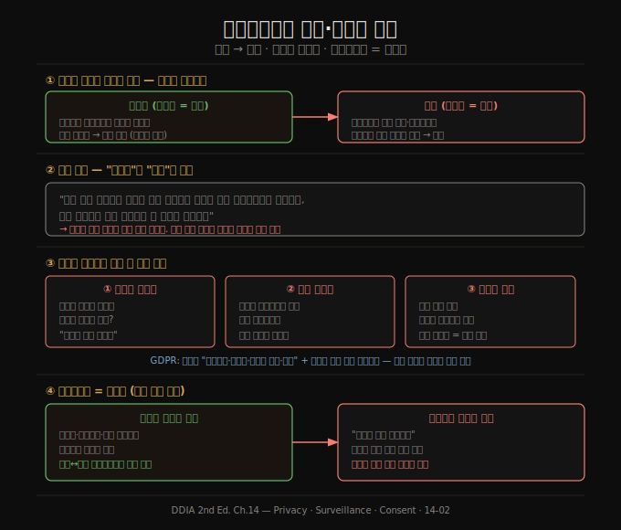

# 프라이버시와 감시·동의의 한계
> 부수효과로 사용자를 추적하는 순간 서비스는 사용자가 아니라 광고주의 이해를 따르게 됩니다. 이것을 직시하려면 "데이터"를 "감시"로 바꿔 읽어 보면 됩니다.

이 노트를 읽고 나면 행동 데이터 추적이 어느 지점에서 감시로 바뀌는지, 동의가 왜 자유로운 선택이 되기 어려운지, 그리고 프라이버시가 비밀 유지가 아니라 무엇을 누구에게 드러낼지 결정하는 권리라는 점을 설명할 수 있습니다. 14장의 두 번째 축으로, 예측 분석을 넘어 데이터 수집 자체의 윤리를 다룹니다.

데이터를 추상적인 것으로 말하지만, 많은 데이터셋은 사람에 관한 것입니다. 그들의 행동·관심사·정체성입니다. 사용자도 사람이며 인간의 존엄은 무엇보다 중요합니다.

## 1. 추적이 감시로 바뀌는 지점
> 사용자가 직접 입력한 데이터를 처리하면 서비스가 사용자를 위한 것입니다. 그러나 부수효과로 행동을 추적하면 서비스는 자기 이해를 갖기 시작합니다.

데이터 수집 자체에 윤리 문제가 있습니다. 핵심은 데이터를 수집하는 조직과 데이터가 수집되는 사람 사이의 관계입니다.

사용자가 명시적으로 입력한 데이터만 저장한다면, 그 사용자가 그렇게 처리되길 원했으므로 서비스는 사용자를 위한 것입니다. 사용자가 고객입니다. 그러나 사용자가 다른 일을 하는 동안 그 활동이 부수효과로 추적·기록되면 관계가 모호해집니다. 서비스는 더 이상 사용자가 시킨 일만 하지 않고, 사용자의 이해와 충돌할 수 있는 자기 이해를 갖게 됩니다.

행동 데이터 추적이 사용자 기능에 도움이 되는 경우도 있습니다. 검색 결과 클릭 추적은 랭킹을 개선하고, "X를 좋아한 사람은 Y도 좋아함" 추천은 유용한 발견을 돕습니다. 그러나 비즈니스 모델에 따라 추적은 거기서 멈추지 않습니다. 서비스가 광고로 자금을 조달하면 **실제 고객은 광고주**이고 사용자의 이해는 뒷전이 됩니다. 마케팅을 위해 각 개인의 상세 프로필을 구축하려고 추적 데이터는 더 세밀해지고 더 오래 보관됩니다.

이 관계를 더 어두운 함의를 가진 단어로 적절히 묘사할 수 있습니다. **감시(surveillance)** 입니다.

## 2. 감시 — "데이터"를 "감시"로 바꿔 읽기
> "감시 기반 조직에서 실시간 감시 스트림을 수집해 감시 웨어하우스에 저장한다" — 흔한 빅데이터 문장을 이렇게 바꿔 읽으면 관계의 본질이 드러납니다.

사고 실험으로 "데이터"를 "감시"로 바꿔 흔한 문장이 여전히 좋게 들리는지 보면 됩니다. "감시 기반 조직에서 실시간 감시 스트림을 수집해 감시 웨어하우스에 저장하고, 감시 과학자가 고급 분석으로 새 통찰을 도출한다" — 이 책의 제목을 《감시 집약 애플리케이션 설계》로 바꾸는 셈입니다.

소프트웨어가 세상을 집어삼키게 만드는 과정에서 우리는 역사상 가장 거대한 대중 감시 인프라를 구축했습니다. 거의 모든 거주 공간에 인터넷 연결 마이크가 하나 이상 있는 세상에 빠르게 다가가고 있습니다. 스마트폰·스마트 TV·음성 비서·베이비 모니터, 심지어 클라우드 음성 인식을 쓰는 장난감까지 — 다수가 끔찍한 보안 기록을 가졌습니다.

과거와 다른 점은 디지털화가 사람에 대한 대량 데이터 수집을 쉽게 만들었다는 것입니다. 위치·이동·사회관계·통신·구매·결제·건강 데이터에 대한 감시가 거의 불가피해졌습니다. 감시 조직은 한 사람이 자신에 대해 아는 것보다 더 많이 알게 될 수 있습니다. 본인이 자각하기 전에 질병이나 경제적 문제를 식별하는 식입니다.

과거의 가장 전체주의적 정권조차 모든 방에 마이크를 두고 모든 사람에게 위치 추적 장치를 들고 다니게 하는 것은 꿈만 꿀 수 있었습니다. 그런데 디지털 기술의 혜택이 너무 커서 우리는 이 전면 감시 상태를 자발적으로 받아들입니다. 차이는 데이터를 통제를 추구하는 정부가 아니라 서비스를 제공하는 기업이 수집한다는 점뿐입니다.

## 3. 동의와 선택의 자유 — 왜 "자유로운" 선택이 아닌가
> "사용자가 자발적으로 동의했다"는 주장에는 문제가 있습니다. 추적의 필요성이 불분명하고, 사용자가 데이터의 운명을 이해하지 못하며, 관계가 일방적입니다.

사용자가 추적 서비스를 자발적으로 선택하고 약관에 동의했다고 주장할 수 있습니다. 그러나 이 논리에는 문제가 있습니다.

첫째, 추적이 왜 필요한지 물어야 합니다. 검색 결과 클릭률 추적처럼 사용자 기능을 직접 개선하는 추적도 있습니다. 그러나 광고 목적의 사용자 프로필 구축이 진짜 사용자의 이해에 부합하는지는 불분명합니다. 광고가 서비스 비용을 댄다는 이유만으로 필요한 것은 아닌가요?

둘째, 대부분의 사용자는 어떤 데이터를 넣는지, 어떻게 보관·처리되는지 거의 모릅니다. 프라이버시 정책은 밝히기보다 가립니다. 무슨 일이 일어나는지 이해하지 못하면 의미 있는 동의를 할 수 없습니다. 게다가 한 사용자의 데이터가 서비스를 쓰지 않고 동의하지도 않은 다른 사람에 대해 말해주는 경우도 많습니다.

셋째, 데이터는 진정한 상호성이나 공정한 가치 교환 없이 일방향으로 추출됩니다. 협상의 여지가 없고 약관은 서비스가 정합니다. 관계가 비대칭적이고 일방적입니다.

EU의 **GDPR**은 동의가 "자유롭게 주어지고, 구체적이며, 정보에 입각하고, 명확해야" 하며, 사용자가 "불이익 없이 동의를 거부하거나 철회할 수 있어야" 한다고 요구합니다. 동의 요청은 "명료하고 쉬운 언어로" 작성되어야 하고, "침묵·미리 체크된 박스·무행동은 동의를 구성하지 않습니다". (동의가 유일한 처리 근거는 아닙니다. 법적 의무 이행, 생명 보호, 사기 방지 같은 정당한 이익 근거도 있습니다.)

동의하지 않으면 안 쓰면 된다고 할 수 있지만, 이 선택도 자유롭지 않습니다. 서비스가 "기본적 사회 참여에 필수"로 여겨질 만큼 보편화되면 옵트아웃을 기대하기 어렵습니다. 네트워크 효과가 있을 때는 안 쓰는 데 사회적 비용이 따릅니다. 시간과 지식이 있고 사회적 기회를 놓칠 여유가 있는 소수 특권층에게만 거부가 선택지입니다. 덜 특권적인 위치의 사람에게 감시는 벗어날 수 없습니다.

## 4. 프라이버시 = 무엇을 드러낼지 결정하는 권리
> 프라이버시는 모든 것을 비밀로 하는 것이 아니라, 무엇을 누구에게 드러내고 무엇을 비밀로 할지 스스로 선택하는 결정권입니다.

"프라이버시는 죽었다"는 주장은 거짓이며 단어를 오해한 것입니다. 일부 사용자가 소셜 미디어에 온갖 것을 올린다고 프라이버시가 사라진 것은 아닙니다.

프라이버시를 갖는다는 것은 모든 것을 비밀로 하는 것이 아니라, 무엇을 누구에게 드러내고 무엇을 공개하고 무엇을 비밀로 할지 선택할 자유를 갖는 것입니다. 프라이버시권은 **결정권(decision right)** 입니다. 각자가 비밀과 투명성 사이 스펙트럼에서 상황마다 어디에 설지 결정하게 합니다. 자유와 자율의 중요한 측면입니다.

희귀 질환을 앓는 사람은 치료법 개발에 도움이 된다면 의료 데이터를 연구자에게 기꺼이 제공할 수 있습니다. 그러나 누가 어떤 목적으로 접근하는지 선택할 수 있어야 합니다. 그 정보가 보험·고용 접근을 방해할 수 있다면 훨씬 신중해질 것입니다.

감시 인프라로 데이터가 추출되면 프라이버시권은 사라지는 것이 아니라 **데이터 수집자에게 이전**됩니다. 기업은 "데이터를 가지고 옳은 일을 하리라 믿으세요"라고 말하는 셈이고, 무엇을 드러내고 감출지 결정하는 권리가 개인에서 기업으로 옮겨집니다. 기업은 이 결과를 대체로 비밀로 유지합니다. 드러내면 섬뜩하게 여겨져 비즈니스 모델(남들보다 사람을 더 잘 아는 것에 의존)에 해롭기 때문입니다. 사용자가 자기 선호에 따라 결정하는 것이 아니라, 기업이 이윤 극대화를 목표로 프라이버시권을 행사합니다.

프라이버시 설정은 통제권을 일부 돌려주는 출발점이지만, 설정과 무관하게 서비스 자체는 데이터에 무제한 접근하며 정책이 허용하는 한 자유롭게 씁니다. 개인에서 기업으로의 이런 대규모 프라이버시권 이전은 역사상 전례가 없습니다.

## 자주 받는 오해
1. **"사용자가 약관에 동의했으니 추적은 정당하다"** — 동의가 자유롭고 정보에 입각해야 유효합니다. 정책이 이해 불가능하고, 거부 시 사회 참여를 못 하며, 협상 여지가 없는 일방적 관계라면 GDPR 기준의 "자유롭게 주어진" 동의가 아닙니다.
2. **"프라이버시는 숨길 게 있는 사람의 문제다"** — 프라이버시는 비밀 유지가 아니라 무엇을 누구에게 드러낼지 정하는 결정권입니다. 숨길 게 없어도, 그 결정권을 기업에 빼앗기는 것이 문제입니다.
3. **"행동 추적은 다 사용자 기능 개선용이다"** — 클릭률 추적처럼 기능을 직접 개선하는 추적과, 광고용 프로필 구축은 다릅니다. 후자는 광고주의 이해를 위한 것이며 사용자 이해와 충돌할 수 있습니다.

## 면접에서 받을 만한 질문
1. **"행동 데이터 추적이 감시로 바뀌는 기준은 무엇인가요?"** — 데이터가 누구의 이해를 위해 쓰이는가가 기준입니다. 사용자가 명시적으로 입력하고 그 처리를 원한 데이터는 서비스를 사용자를 위한 것으로 만듭니다. 그러나 광고주를 위해 부수효과로 행동을 추적·프로파일링하면, 서비스가 사용자와 충돌하는 자기 이해를 갖게 되어 감시가 됩니다.
2. **"GDPR이 말하는 '자유롭게 주어진 동의'의 조건은 무엇인가요?"** — 구체적이고, 정보에 입각하고, 명확해야 하며, 불이익 없이 거부·철회할 수 있어야 합니다. 명료한 언어로 작성되어야 하고, 침묵·미리 체크된 박스·무행동은 동의가 아닙니다. 거부 시 필수 서비스에서 배제된다면 자유로운 동의로 보기 어렵습니다.
3. **"프라이버시를 '비밀 유지'가 아니라 '결정권'으로 정의하면 무엇이 달라지나요?"** — 데이터를 공유하는 행위가 프라이버시 포기를 뜻하지 않게 됩니다. 핵심은 무엇을 누구에게 어떤 목적으로 드러낼지 개인이 통제하는가입니다. 감시 인프라의 문제는 이 결정권이 개인에서 기업으로 이전되어, 기업이 이윤을 위해 대신 행사한다는 데 있습니다.

## 관련 문서
- [14-01.예측 분석의 윤리 — 편향·책임·피드백 루프](14-01.%EC%98%88%EC%B8%A1%20%EB%B6%84%EC%84%9D%EC%9D%98%20%EC%9C%A4%EB%A6%AC%20%E2%80%94%20%ED%8E%B8%ED%96%A5%C2%B7%EC%B1%85%EC%9E%84%C2%B7%ED%94%BC%EB%93%9C%EB%B0%B1%20%EB%A3%A8%ED%94%84.md) — 데이터로 사람을 판단하는 결정의 윤리
- [14-03.데이터의 권력·산업혁명의 교훈·책 종합](14-03.%EB%8D%B0%EC%9D%B4%ED%84%B0%EC%9D%98%20%EA%B6%8C%EB%A0%A5%C2%B7%EC%82%B0%EC%97%85%ED%98%81%EB%AA%85%EC%9D%98%20%EA%B5%90%ED%9B%88%C2%B7%EC%B1%85%20%EC%A2%85%ED%95%A9.md) — 데이터=자산·권력, 데이터 최소화, 책 전체 종합
- [README](README.md) — 전체 학습 지도
