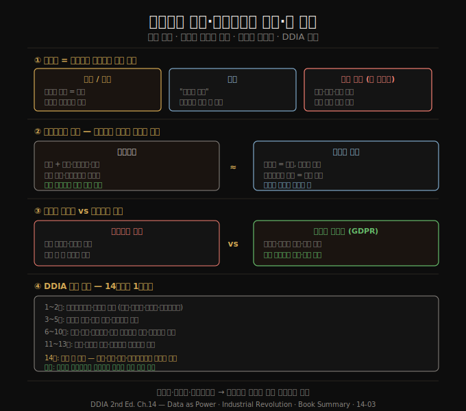

# 데이터의 권력·산업혁명의 교훈·책 종합
> 데이터는 자산이자 권력이며 동시에 독성 물질입니다. 산업혁명이 규제로 부작용을 길들였듯, 정보화 시대는 데이터 최소화로 그 부작용에 맞서야 합니다.

이 노트를 읽고 나면 행동 데이터가 왜 노동이자 권력이고 동시에 "독성 자산"인지, 산업혁명의 환경 오염 비유가 데이터 수집에 어떻게 적용되는지, 데이터 최소화 원칙이 빅데이터 철학과 왜 충돌하는지 설명할 수 있습니다. 14장과 책 전체를 종합하는 마지막 편입니다.

## 1. 데이터는 자산이자 권력
> "데이터 배기가스"라는 표현은 데이터를 버려질 폐기물로 봅니다. 오히려 반대로, 사용자 활동은 노동이고 데이터는 권력입니다.

행동 데이터가 서비스 상호작용의 부산물이라는 이유로 **"데이터 배기가스(data exhaust)"** 라 불리곤 합니다. 무가치한 폐기물이라는 함의이고, 분석을 버려질 데이터에서 가치를 뽑는 재활용으로 봅니다.

반대로 보는 편이 정확합니다. 경제적 관점에서 타깃 광고가 서비스 비용을 댄다면, 행동 데이터를 생성하는 사용자 활동은 **노동(labor)** 의 한 형태로 볼 수 있습니다. 더 나아가 사용자가 상호작용하는 애플리케이션은 더 많은 개인 정보를 감시 인프라에 먹이도록 유인하는 미끼라고 주장할 수도 있습니다. 온라인 서비스에서 표현되는 인간의 창의성과 사회관계가 데이터 추출 기계에 냉소적으로 착취됩니다.

개인 데이터는 가치 있는 자산입니다. 비밀리에 사람들의 개인 데이터를 사고·집계·분석·재판매하는 데이터 브로커의 존재가 이를 증명합니다. 스타트업은 사용자 수, 즉 감시 능력으로 평가받습니다.

데이터가 가치 있기에 많은 이가 원합니다. 기업은 물론이고 정부도 원하며, 비밀 거래·강압·법적 강제·절도로 얻으려 합니다. 회사가 파산하면 수집한 개인 데이터가 매각 자산이 되고, 데이터는 보안이 어려워 유출이 자주 일어납니다.

이런 관찰에서 데이터는 단순한 자산이 아니라 **"독성 자산(toxic asset)"** 또는 "위험 물질"이라는 비판이 나옵니다. 데이터는 새로운 금이나 석유가 아니라 새로운 우라늄일지 모릅니다. 수집할 때마다 혜택과 잘못된 손에 들어갈 위험을 저울질해야 합니다. 시스템은 범죄자나 적대적 정보기관에 침해될 수 있고, 내부자가 유출할 수 있으며, 회사가 가치관이 다른 경영진의 손에 넘어가거나 국가가 인권을 무시하는 정권에 장악될 수 있습니다.

그래서 데이터를 수집할 때는 오늘의 정치 환경만이 아니라 모든 미래 정부를 고려해야 합니다. Bruce Schneier의 말대로, "언젠가 경찰국가를 가능하게 할 기술을 설치하는 것은 빈약한 시민 위생"입니다. "지식은 권력"이며, "남을 감시하면서 자신은 감시를 피하는 것은 가장 중요한 권력의 형태"입니다.

## 2. 산업혁명의 교훈 — 데이터는 정보화 시대의 공해
> 산업혁명은 성장과 함께 오염·아동노동을 가져왔고 규제로 길들여졌습니다. 정보화 시대의 공해는 데이터이고, 프라이버시 보호가 그 환경 과제입니다.

데이터는 정보화 시대의 정의적 특징입니다. 인터넷·데이터 저장과 처리·소프트웨어 자동화가 경제와 사회에 큰 영향을 미치는 모습은 **산업혁명**을 떠올리게 합니다.

산업혁명은 기술·농업 발전으로 장기적 성장과 생활 수준 향상을 가져왔지만 큰 문제도 동반했습니다. 매연과 화학 공정으로 공기가, 산업·인간 폐기물로 물이 끔찍하게 오염됐습니다. 공장주는 호화롭게 살았지만 도시 노동자는 비좁고 비위생적인 주거에서 장시간 가혹하게 일했고, 광산의 위험하고 박봉인 노동을 포함해 아동노동이 흔했습니다.

환경 보호 규제, 작업장 안전 규약, 아동노동 금지법, 식품 위생 검사 같은 안전장치가 마련되기까지 오랜 시간이 걸렸습니다. 공장이 폐기물을 강에 버리거나 오염된 식품을 팔거나 노동자를 착취하지 못하게 되면서 사업 비용은 올랐지만, 사회 전체는 이 규제로 크게 이득을 봤고 그 이전으로 돌아가고 싶은 사람은 거의 없습니다.

산업혁명의 어두운 면을 관리해야 했듯, 정보화 시대로의 전환에도 직면해 풀어야 할 큰 문제가 있습니다. 데이터의 수집과 사용이 그중 하나입니다. Schneier의 말로 정리하면 이렇습니다.

> 데이터는 정보화 시대의 공해 문제이고, 프라이버시 보호는 그 환경 과제입니다. 거의 모든 컴퓨터가 정보를 생산하고, 그것은 곪으며 남습니다. 우리가 그것을 어떻게 다루는가가 정보 경제의 건강에 핵심입니다. 후손들은 우리가 데이터 수집과 오용의 도전에 어떻게 대처했는지로 우리를 평가할 것입니다.

후손이 우리를 자랑스러워하도록 노력해야 합니다.

## 3. 입법과 자율 규제 — 데이터 최소화
> 데이터 최소화는 "수집을 최대화하라"는 빅데이터 철학과 정면충돌합니다. 가지지 않은 데이터는 유출되거나 강제로 넘겨질 수 없습니다.

데이터 보호법이 개인의 권리를 지키는 데 도움이 될 수 있습니다. GDPR은 개인 데이터가 "구체적·명시적·정당한 목적으로 수집되고 그와 양립 불가능한 방식으로 추가 처리되지 않아야" 하며, "처리 목적에 필요한 범위로 적절하고 관련되며 제한되어야" 한다고 규정합니다.

그러나 이 **데이터 최소화(data minimization)** 원칙은 빅데이터 철학과 정면충돌합니다. 빅데이터는 수집을 최대화하고, 다른 데이터셋과 결합하며, 탐색해 새 통찰을 내려 합니다. 탐색은 예견되지 않은 목적의 사용을 뜻하는데, 이는 GDPR이 요구하는 "구체적·명시적" 목적의 반대입니다. 이 규제는 온라인 광고 산업에 일부 영향을 줬지만 약하게 집행됐고, 업계 전반의 문화와 관행을 크게 바꾸지는 못했습니다.

대량 데이터를 수집하는 기업은 규제를 부담이자 혁신 방해로 보고 대체로 반대합니다. 일부는 정당합니다. 의료 데이터 공유는 프라이버시 위험과 동시에 더 나은 진단·치료라는 기회를 줍니다. 과잉 규제가 그런 돌파구를 막을 수 있어, 기회와 위험의 균형은 어렵습니다.

근본적으로는 개인 데이터에 대한 기술 업계의 문화 전환이 필요합니다. 사용자를 최적화할 지표가 아니라 존중·존엄·주체성을 받을 자격이 있는 사람으로 기억해야 합니다. 신뢰를 확립·유지하기 위해 데이터 수집·처리 관행을 스스로 규제하고, 사용자를 어둠 속에 두는 대신 데이터가 어떻게 쓰이는지 교육해야 합니다.

우리의 데이터 통제권은 국립공원의 자연환경과 같습니다. 명시적으로 보호하지 않으면 파괴됩니다. 공유지의 비극이 되어 모두가 더 나빠집니다. 첫걸음으로, 데이터를 영원히 보관하지 말고 필요 없어지는 즉시 폐기하며 애초에 수집을 최소화해야 합니다. **가지지 않은 데이터는 유출되거나 도난당하거나 정부가 강제로 넘기게 할 수 없습니다.**

## 4. 책 전체 종합 — 14장에서 1장까지
> 14개 장은 신뢰성·확장성·유지보수성이라는 목표를 향했고, 마지막에 그 시스템이 사람에게 미치는 책임으로 돌아왔습니다.

이 책은 많은 영역을 다뤘습니다. 각 장을 한 줄로 종합하면 다음과 같습니다.

| 장 | 주제 | 핵심 |
|----|------|------|
| 1 | 데이터 시스템 아키텍처 트레이드오프 | 운영/분석 · 클라우드/셀프 · 분산/단일 · 비즈니스/사용자 권리 |
| 2 | 비기능 요구사항 | 성능 · 신뢰성 · 확장성 · 유지보수성 정의 |
| 3 | 데이터 모델과 질의 언어 | 관계형·문서·그래프·이벤트 소싱·DataFrame |
| 4 | 저장 엔진과 인덱싱 | LSM·B-tree·컬럼 지향·전문/벡터 검색 |
| 5 | 인코딩과 진화 | 직렬화·호환성·DB/서비스/워크플로/이벤트 데이터플로우 |
| 6 | 복제 | 단일/다중 리더·리더리스·일관성 모델·동기화 엔진 |
| 7 | 샤딩 | 리밸런싱·요청 라우팅·보조 인덱싱 |
| 8 | 트랜잭션 | 격리 수준·직렬화 가능성·분산 원자 커밋 |
| 9 | 분산 시스템의 문제 | 네트워크 결함·시계 오차·프로세스 포즈·크래시 |
| 10 | 일관성과 합의 | 선형성·합의가 가능케 하는 일관성 모델 |
| 11 | 배치 처리 | Unix 도구에서 분산 배치 프로세서로 |
| 12 | 스트림 처리 | 메시지 브로커·CDC·내결함성·스트리밍 조인 |
| 13 | 스트리밍 시스템의 철학 | 이종 시스템 통합·진화·확장 |
| 14 | 옳은 일 하기 | 차별·착취·감시·프라이버시의 윤리적 책임 |

마지막 장은 한 걸음 물러나 윤리를 살폈습니다. 데이터는 선을 행할 수 있지만 큰 해도 끼칠 수 있습니다. 삶을 좌우하면서 항소가 어려운 결정을 내리고, 차별과 착취로 이어지며, 감시를 정상화하고, 내밀한 정보를 노출합니다. 데이터 유출 위험도 있고, 선의의 사용이 의도하지 않은 결과를 낳기도 합니다.

소프트웨어와 데이터가 세상에 미치는 큰 영향을 생각하면, 엔지니어인 우리는 우리가 살고 싶은 세상을 향해 일할 책임을 집니다. 사람을 인간으로서 존중하며 대하는 세상입니다. 그 목표를 향해 함께 일해야 합니다.

## 자주 받는 오해
1. **"행동 데이터는 어차피 버려질 부산물이라 활용은 이득이다"** — 반대 관점이 더 정확합니다. 광고가 서비스 비용을 댄다면 사용자 활동은 노동이고 데이터는 권력입니다. "데이터 배기가스"라는 표현은 추출의 본질을 가립니다.
2. **"데이터는 많을수록 좋은 자산이다"** — 데이터는 독성 자산이기도 합니다. 유출·도난·정부 강제·악의적 경영진·정권 교체의 위험을 동반합니다. 가지지 않은 데이터는 이런 위험에서 자유롭습니다.
3. **"데이터 최소화는 빅데이터 시대에 비현실적이다"** — GDPR의 데이터 최소화는 법적 요구이며, 필요 없어진 데이터의 폐기와 수집 범위 제한은 위험을 직접 줄입니다. 빅데이터 철학과 충돌하지만, 그 충돌을 직시하는 것이 책임의 출발점입니다.

## 면접에서 받을 만한 질문
1. **"데이터를 '독성 자산'으로 보는 관점은 무엇을 의미하나요?"** — 데이터가 가치 있는 동시에 보유 자체가 위험을 만든다는 뜻입니다. 유출·도난·내부자 누출·정부의 강제 제출·정권 교체 등 통제 밖 시나리오에서 피해로 전환됩니다. 따라서 수집할 때마다 혜택과 위험을 저울질하고, 필요 없는 데이터는 애초에 수집하거나 보관하지 않는 것이 합리적입니다.
2. **"데이터 최소화 원칙이 빅데이터 철학과 충돌하는 지점은 어디인가요?"** — 빅데이터는 수집 최대화·데이터 결합·예견되지 않은 목적의 탐색을 추구합니다. GDPR의 데이터 최소화는 구체적·명시적 목적과 필요 최소 범위를 요구하므로, "탐색을 통한 새 통찰"이라는 빅데이터의 핵심 동기와 정면으로 부딪칩니다.
3. **"엔지니어가 데이터 수집 설계에서 미래 정부까지 고려해야 하는 이유는 무엇인가요?"** — 오늘 인권을 존중하는 정부가 수집을 허용해도, 데이터는 오래 남아 미래의 다른 정권에 넘어갈 수 있기 때문입니다. "언젠가 경찰국가를 가능하게 할 기술을 설치하는 것은 빈약한 시민 위생"이라는 경고대로, 수집 단계에서 모든 가능한 미래 사용을 위험으로 평가해야 합니다.

## 관련 문서
- [14-02.프라이버시와 감시·동의의 한계](14-02.%ED%94%84%EB%9D%BC%EC%9D%B4%EB%B2%84%EC%8B%9C%EC%99%80%20%EA%B0%90%EC%8B%9C%C2%B7%EB%8F%99%EC%9D%98%EC%9D%98%20%ED%95%9C%EA%B3%84.md) — 감시와 동의, 프라이버시=결정권
- [14-01.예측 분석의 윤리 — 편향·책임·피드백 루프](14-01.%EC%98%88%EC%B8%A1%20%EB%B6%84%EC%84%9D%EC%9D%98%20%EC%9C%A4%EB%A6%AC%20%E2%80%94%20%ED%8E%B8%ED%96%A5%C2%B7%EC%B1%85%EC%9E%84%C2%B7%ED%94%BC%EB%93%9C%EB%B0%B1%20%EB%A3%A8%ED%94%84.md) — 예측 분석·편향·책임
- [README](README.md) — 전체 학습 지도 (책 전체 종합)
