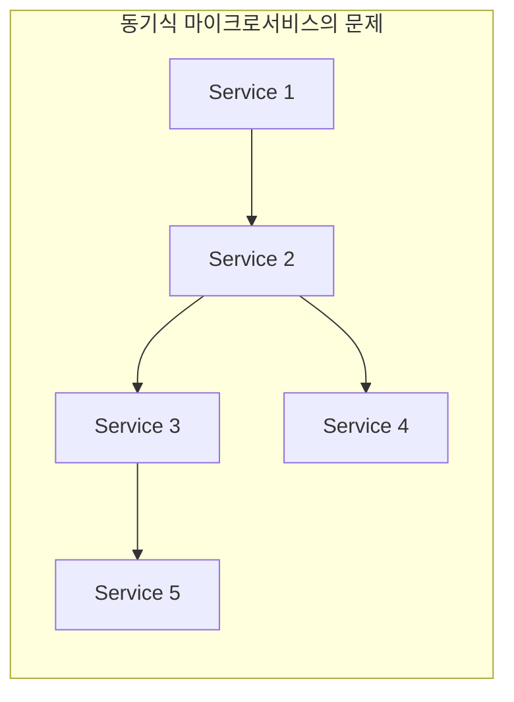
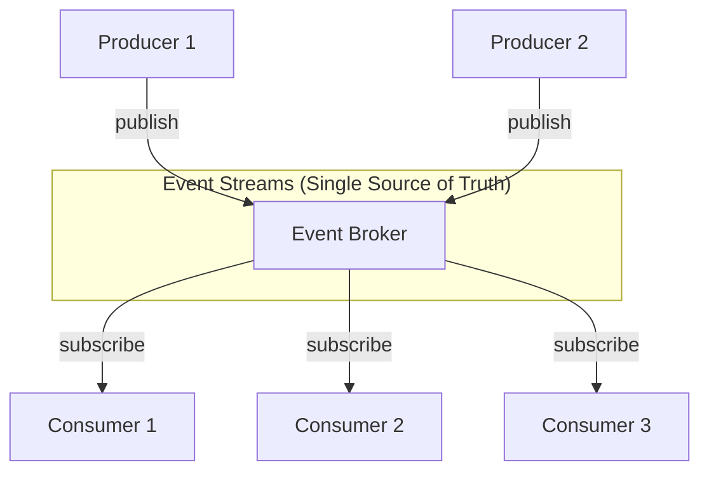
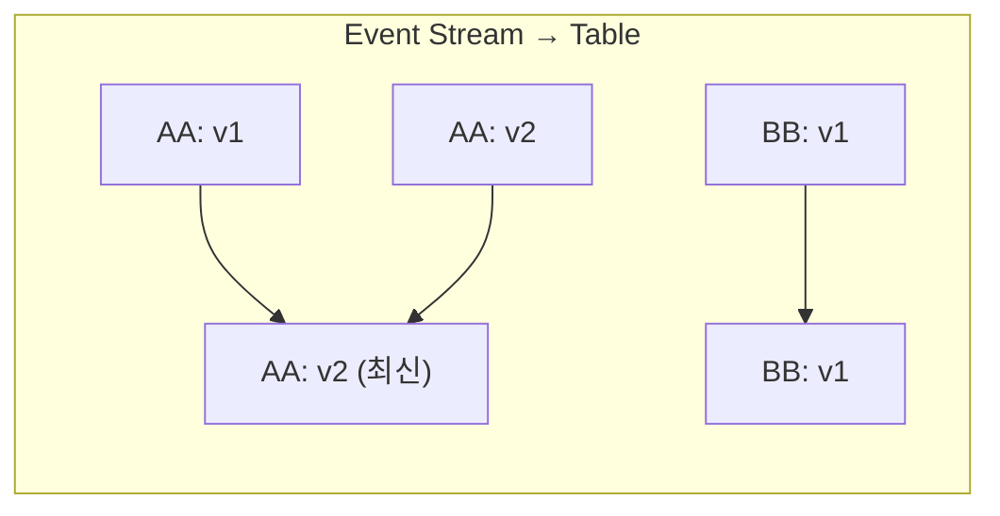
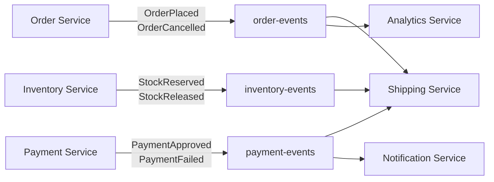
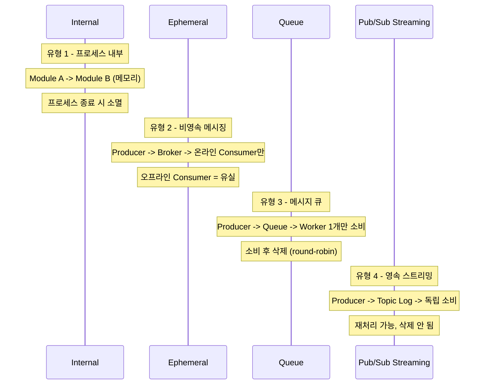
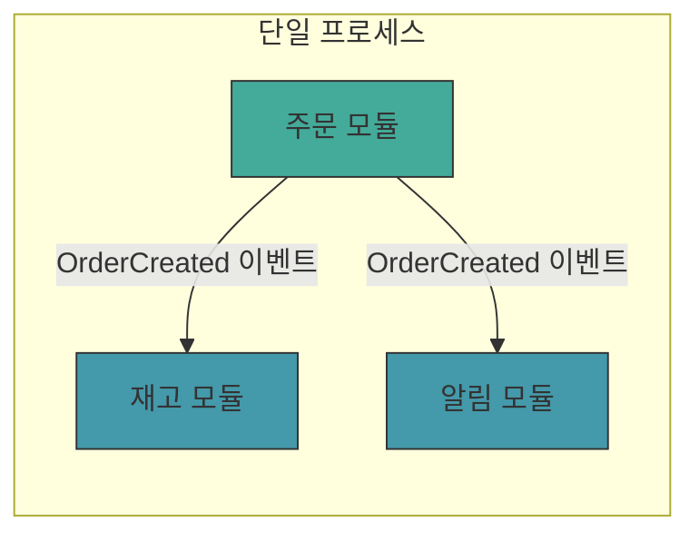
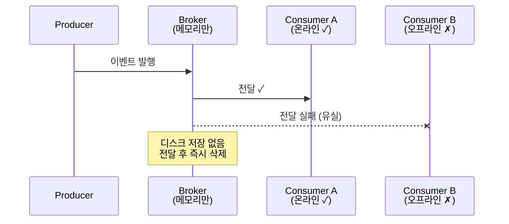
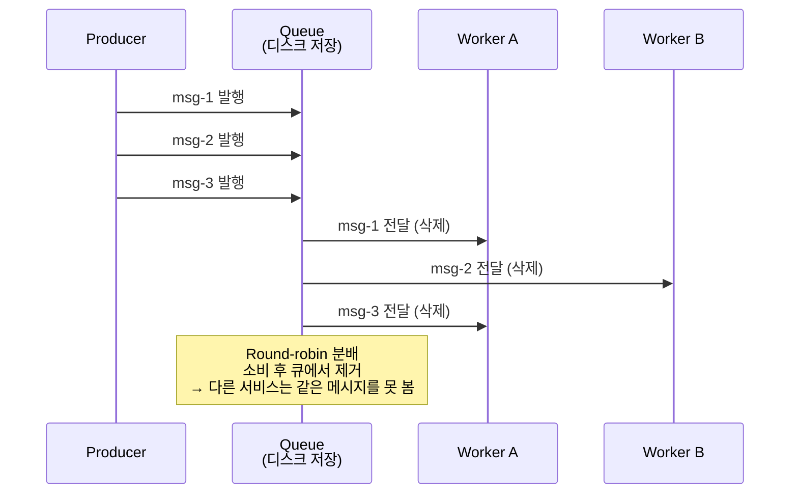
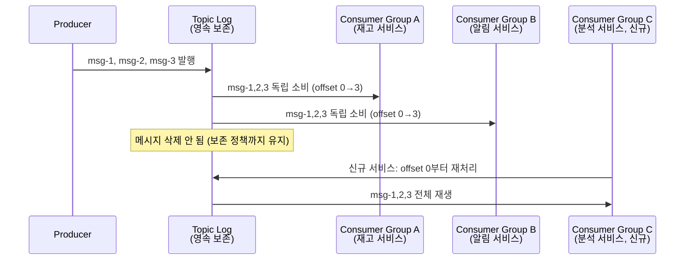

# Why Event-Driven Architecture

---

## 전통적인 아키텍쳐의 문제

모놀리스 또는 동기식 마이크로 서비스에서 발생하는 근본적인 문제는 서비스 간 직접 호출 중심의 통신 구조로 인해 결합도가 높아지는 점입니다. 각 서비스가 다른 서비스를 직접 호출하는 방식은 서비스 간 강한 결합을 만들고, 이는 마이크로서비스 아키텍쳐의 핵심 가치인 독립성과 확장성을 훼손합니다.



- Point-to-Point 결합: 서비스 A가 서비스 B를 직접 호출하면, B의 API 변경이 A에 즉시 영향을 주기때문에, 독립적인 배포와 버전 관리가 불가능 해집니다.
- **장애 전파**: 결제 서비스가 다운되면, 결제를 호출하는 주문 서비스도 타임아웃이나 에러로 멈추고, 주문을 호출하는 프론트엔드도 응답하지 못하게 됩니다.

## 이벤트 기반 접근의 해결

이벤트 기반 아키텍쳐는 서비스 간 직접 호출을 제거하고, 이벤트 브로커라는 중앙 허브를 통해 통신합니다. 서비스들은 서로를 몰라도 되며, 이벤트 발행/구독만 생각하면 됩니다.



- 이벤트 = 데이터: 이벤트는 단순한 알람이 아니라 비즈니스 데이터 자체를 포함합니다. 이벤트는 가능한 한 컨슈머가 추가 동기 호출 없이 처리할 수 있을 만큼의 맥락을 담는 것이 좋습니다.
- 비동기 통신: 프로듀서는 이벤트를 발행한 후 즉시 다음 작업을 진행할 수 있습니다. 컨슈머가 언제 이벤트를 처리하는지, 심지어 컨슈머가 몇 개인지도 알 필요가 없기 때문에 진정한 느슨한 결합이 달성됩니다.

## 핵심 개념

### 1. Bounded Context와 DDD

이벤트 기반 마이크로 서비스는 DDD의 Bounded Context 개념과 자연스럽게 매핑됩니다. Bounded Context는 특정 도메인 모델이 유효한 범위를 정의하는데, 이는 마이크로서비스의 경계를 결정하는 핵심 기준이 됩니다.

| 개념                | 영역        | 왜 중요한가?                                                 |
| ------------------- | ----------- | ------------------------------------------------------------ |
| **Domain**          | 문제 공간   | 비즈니스가 해결하려는 전체 문제 영역입니다. 예를 들어 이커머스라면 '온라인 쇼핑 경험 제공'이 도메인이 됩니다. 도메인을 이해해야 어떤 서브도메인으로 나눌지 판단할 수 있습니다. |
| **Subdomain**       | 문제 공간   | 도메인을 구성하는 개별 비즈니스 영역입니다. 주문, 재고, 배송, 결제는 각각 독립적인 비즈니스 로직과 규칙을 가지기 때문에, 서브도메인으로 분리하면 팀이 각자의 영역에 집중할 수 있습니다. |
| **Bounded Context** | 솔루션 공간 | 입력, 출력, 이벤트, 데이터 모델이 일관된 의미를 갖는 논리적 경계입니다. '상품'이란 단어가 재고 컨텍스트에서는 '재고 수량'을 의미하고, 카탈로그 컨텍스트에서는 '상품 설명과 이미지'를 의미할 수 있습니다. 이 경계가 명확해야 서비스 간 오해 없이 통신할 수 있습니다. |

- 높은 응집도: 서로 관련된 기능은 한 곳에 모아야 합니다. 주문 생성/취소/조회는 모두 주문 서비스에 있어야 편리합니다.
- 느슨한 결합: 한 컨텍스트 내부 변경이 다른 컨텍스트에 영향을 주지 않아야 합니다. 이벤트 기반 통신을 사용하면, 주문 서비스가 내부 데이터베이스 스키마를 바꿔도 발행하는 이벤트 형식만 유지되면 영향을 받지 않습니다.
- 비즈니스 정렬: 기술이 아닌 비즈니스 요구사항으로 경계를 결정해야 합니다.

### 2. 이벤트 유형

**Key 파티셔닝 기준 분류**

| 유형              | Key         | 왜 이렇게 설계하는가?                                        | 예시                                                         |
| ----------------- | ----------- | ------------------------------------------------------------ | ------------------------------------------------------------ |
| **Unkeyed Event** | 없음        | 순서가 중요하지 않거나, 각 이벤트가 독립적인 사실을 기록할 때 사용합니다. 키가 없으면 파티션에 라운드로빈으로 분배되어 처리량이 높아지지만, 이벤트 간 순서는 보장되지 않습니다. | 사용자가 특정 페이지를 조회한 로그 (조회 순서가 비즈니스 로직에 영향 없음) |
| **Entity Event**  | 엔티티 ID   | 같은 엔티티에 대한 이벤트들이 순서대로 처리되어야 할 때 사용합니다. 주문 ID를 키로 사용하면, 같은 주문의 '생성→승인→배송' 이벤트가 같은 파티션에 들어가서 순서가 보장됩니다. 또한 이벤트 스트림을 테이블로 구체화(materialize)할 때, 키별로 최신 상태만 유지됩니다. | 주문 ID를 키로 하는 주문 생성/수정 이벤트 (주문 123의 상태 변화 순서 보장 필요) |
| **Keyed Event**   | 비엔티티 키 | 집계나 그룹화를 위해 사용합니다. 사용자 ID를 키로 하면, 같은 사용자의 모든 주문이 같은 파티션에 들어가서, 사용자별 총 구매액 같은 통계를 효율적으로 계산할 수 있습니다. 엔티티 상태 전이가 아닌 분석/집계 목적으로 이벤트를 그룹화할 때 비엔티티 키를 사용합니다. | 사용자 ID를 키로 하는 주문 이벤트 (사용자별 주문 패턴 분석 시 유용) |

**이벤트 의도(Command) 분류**

| 구분                | Event                         | Command                       | Query                   |
| ------------------- | ----------------------------- | ----------------------------- | ----------------------- |
| **시제**            | 과거형 — OrderCreated         | 명령형 — CreateOrder          | 요청형 — GetOrderStatus |
| **의미**            | 이미 일어난 사실의 기록       | 특정 수신자에게 행동을 요청   | 데이터 조회 요청        |
| **거부 가능?**      | 불가 (사실이므로)             | 가능 (수신자가 검증 후 거부)  | 해당 없음               |
| **프로듀서:컨슈머** | 1:N (브로드캐스트)            | 1:1 (지정된 수신자)           | 1:1 (응답 필요)         |
| **결합도**          | 낮음 (발행자는 구독자를 모름) | 높음 (발행자가 수신자를 의식) | 높음                    |

- SAGA는 Command를 사용해서 오케스트레이터가 "배송을 시작(Command)"는 명령을 서비스에 직접 보내고, 성공/실패 응답을 기다립니다.

### 3. Table-Stream Duality

이벤트 스트림과 테이블은 동일한 데이터를 다른 관점에서 표현한 것입니다. 이 개념을 이해하면 상태 관리와 이벤트 처리를 통합된 시각으로 볼 수 있다.



- Materialization(구체화): 이벤트 스트림을 만들어 테이블로 만드는 과정입니다.
- CDC(Change Data Capture): 테이블의 변경 사항을 이벤트 스트림으로 변환하는 과정입니다. (Debezium 도구)
- Tombstone: Value가 null인 이벤트로 삭제를 표현합니다.

### 4. Message, Command, Event의 관계

**Message**는 시스템 간에 전달되는 모든 데이터의 총칭이다. Command와 Event는 모두 Message의 하위 유형이며, 의도와 시제가 다르다.

```
Message (시스템 간 전달되는 모든 데이터)
├── Command  — "이걸 해라" (명령, 미래형, 거부 가능)
├── Event    — "이게 일어났다" (사실 기록, 과거형, 거부 불가)
└── Query    — "이걸 알려달라" (조회 요청)
```

이 구분이 중요한 이유는 브로커의 설계 철학과 직결되기 때문이다. Message Broker는 Command 성격의 메시지를 1:1로 분배하는 데 최적화되어 있고, Event Broker는 Event 성격의 메시지를 1:N으로 공유하는 데 최적화되어 있다.

| 브로커 유형 | 주로 다루는 Message 유형 | 대표적 패턴 |
|-------------|------------------------|-------------|
| Message Broker (RabbitMQ) | Command — "이메일 보내라", "재고 차감해라" | 작업 분배, 1:1 소비 후 삭제 |
| Event Broker (Kafka/Redpanda) | Event — "주문이 생성됐다", "결제가 완료됐다" | 사실 공유, 1:N 독립 소비 |

즉 "Message Broker"의 "Message"는 모든 메시지를 뜻하는 게 아니라, 실질적으로 Command 성격의 작업 지시를 주로 처리하는 브로커라는 의미에 가깝다. 반대로 Event Broker는 이미 발생한 사실(Event)을 영속 로그로 보존하고 여러 서비스가 독립적으로 소비하는 구조다.

### 5. Event Broker vs Message Broker 상세 비교

Message Broker와 Event Broker는 비슷해 보이지만, 근본적으로 다른 철학을 가지고 있다.

| 특성          | Message Broker (RabbitMQ)                  | Event Broker (Kafka/Redpanda)                | 왜 이런 차이가 있는가?                                       |
| ------------- | ------------------------------------------ | -------------------------------------------- | ------------------------------------------------------------ |
| **소비 후**   | 메시지 삭제                                | 이벤트 보존                                  | Message Broker는 '작업 분배(task distribution)'를 위해 설계되었다. 작업이 한 번 처리되면 끝이므로 메시지를 삭제한다. Event Broker는 '상태 공유(state sharing)'를 위해 설계되어, 여러 컨슈머가 같은 데이터를 다른 시간에 읽을 수 있어야 하므로 보존한다. |
| **다중 소비** | 각 컨슈머가 일부만 받음 (경쟁 컨슈머 패턴) | 모든 컨슈머가 전체 접근 (각자 독립적 오프셋) | Message Broker는 메시지를 여러 워커에게 분배해서 병렬 처리한다. 메시지 1은 워커 A가, 메시지 2는 워커 B가 받는다. Event Broker는 각 컨슈머 그룹이 전체 스트림을 독립적으로 읽는다. 결제 서비스도, 재고 서비스도, 분석 서비스도 같은 주문 이벤트를 본다. |
| **재생**      | 기본 모델에서 제한적                       | 가능 (오프셋 리셋)                           | Message Broker는 기본 모델에서 제한적이고, Event Broker는 오프셋 기반 재처리가 기본 기능이다. Event Broker는 이벤트를 보존하므로, 새 서비스를 추가하거나 버그를 수정한 후 과거 데이터를 다시 읽어서 상태를 재구성할 수 있다. |
| **순서 보장** | 단일 큐/단일 컨슈머에서 유지               | 파티션 레벨에서 엄격                         | Message Broker도 단일 큐/단일 컨슈머 조건에서는 순서를 유지할 수 있지만, 병렬 소비 시 순서가 깨질 수 있다. Event Broker는 같은 키의 이벤트는 항상 같은 파티션에 들어가고, 파티션 내에서 순서가 보장되므로, 엔티티의 상태 변화 순서를 정확히 추적할 수 있다. |
| **상태 공유** | 부적합                                     | 적합                                         | Message Broker는 일회성 작업 처리에 적합하다 (이메일 전송, 알림). Event Broker는 여러 서비스가 같은 비즈니스 데이터를 공유하고 각자의 뷰를 유지해야 할 때 적합하다 (주문 상태를 주문 서비스, 배송 서비스, 분석 서비스가 각자의 방식으로 저장). |

### 6. Single Writer Principle

이벤트 스트림의 핵심 도메인 이벤트는 해당 애그리게잇을 소유한 서비스가 단독으로 발행하는 것이 바람직하다. 이는 이벤트 기반 아키텍쳐에서 데이터 소유권과 책임을 명확히 하는 핵심 원칙이다.

단일 Write를 권장하는 이유

- 권위 있는 진실의 원천 보장: 여러 서비스가 같은 토픽에 이벤트 쓰면 정보 충돌가능
- 데이터 계보 추적 가능: 이벤트를 보면 어떤 서비스가 생성했는지 알 수 있으니, 데이터 품질을 위해 단일 생성
- 소유권 경계 강제: ACL(Access Control List) 정책으로 토픽 쓰기 권한을 특정 서비스에만 부여하면, 다른 서비스가 변조하는걸 방지 가능

# 이벤트란 무엇인가?

---

> 소프트웨어에서 "이벤트"라는 단어는 UI 클릭, 네트워크 패킷, 로그 항목 등 다양한 의미로 쓰인다. 하지만 Kafka기반에서 말하는 이벤트는 이보다 훨씬 구체적인 정의를 가진다. 이벤트는 **"비즈니스 도메인에서 실제로 발생한 사실(fact) 기록이다."**
>
> - Ex) 주문이 접수되었다, 사용자가 구독을 해지했다.
> - 이벤트의 핵심 속성은 "불변성"이며 과거에 일어난일은 되돌릴 수 없으므로, 한번 기록되면 수정하지 않는다.

## Command vs Event

Command(명령)은 미래에 어떤 일이 일어나길 요청하는 메시지다. "주문을 처리해라", "재고를 차감해라" 같은 형태이다. Command는 수신자가 거부할 수 있다.

Event는 이미 일어난 일의 기록이다. "주문이 처리됐다", "재고가 차감됐다" 형태이며, 거부할 수 없다. 이미 발행한 사실이기 때문이다.

```bash
Command: PlaceOrder     → (처리 성공하면) → Event: OrderPlaced
Command: CancelOrder    → (처리 성공하면) → Event: OrderCancelled
Command: DeductStock    → (처리 성공하면) → Event: StockDeducted
```

이 구분이 중요한 이유는 토픽 설계 방향이 달라지기 때문이다.

- Command 토픽은 특정 서비스가 요청해야 할 요청을 담고, 소비자는 하나다.
- Event 토픽은 도메인에서 발생한 사실을 담고, 여러 소비자가 각자 관심사에 따라 구독한다.

## 이벤트 설계의 중요성

이벤트 설계는 단순히 "JSON에 어떤 데이터를 넣을까?"수준의 결정이 아닙니다. 이벤트 구조는 토픽 수, 소비자 결합도, 스키마 진화 비용, 시스템 전체 유연성에 직접적인 영향을 미칩니다.

- **나쁜 설계**: 이름이 바뀌면 UserNameChanged, 이메일이 바뀌면 UserEmailChanged, 등 각각 별도 토픽에 저장하면 깔끔해보이지만, 전체 상태를 알기위해 3가지 토픽을 모두 구독하고 조회해야 한다.
- **좋은 설계**: 어떤 필드가 바뀌든 user-profile-updated 단일 토픽에 발행하고, 이벤트 안에 변경된 내용을 담는다.

이러한 이벤트 설계를 위해서는 반드시 결정해야하는 4가지 차원을 Confluent 학습코스에서 제공한다. 

### 1. Facts vs Deltas(전체 상태 vs 변경 본)

- Fact 이벤트는 엔티티의 현재 전체 상태를 담습니다. 소비자는 이 이벤트 하나만 보면 해당 엔티티의 현재 상태를 알 수 있습니다.
- Delta 이벤트는 변경된 부분만 담습니다.

### 2. Normalized vs Denormalized(정규화 vs 비정규화)

- Normalized는 엔티티의 고유 정보만 포함한다. ex) 이벤트에 customerID만 있고, 고객 이름/이메일이 없음
- Denormalized는 소비자가 필요한 정보를 모두 포함한다. ex) 이벤트에 customerID 및 고객의 이름/이메일을 모두 포함한다.

### 3. Single vs Multiple Event Types per Stream(단일 vs 다중 이벤트 타입)

- Single Event Type은 토픽-이벤트가 1:1입니다.
- Multiple Event Type은 토픽-이벤트가 1:다입니다. 

### 4. Discrete vs Continuous(이산 vs 연속 이벤트 흐름)

- Discrete는 명확한 비즈니스 사건을 나타냅니다. (주문 접수, 배송 시작같은 뚜렷한 트리거가 있음)
- Continuous은 시간에 따라 지속적으로 생성되는 이벤트입니다. (센서 온도 데이터, 주식 가격 변동 등의 데이터)

## 도메인 매핑(DDD -> 이벤트 스트림)

좋은 이벤트를 설계하려면 도메인을 먼저 이해해야 합니다. DDD의 Bounded Context 개념이 출발점이 됩니다.

- 이커머스 주문 시스템이라면 주문, 재고, 결제, 배송이 각각 Bounded Context가 될 수 있습니다.

### 이벤트 스토밍 접근

이벤트 스토밍을 통해 도메인 전문가와 개발자가 함께 도메인 이벤트를 발견하는 기법입니다. 포스트잇을 통해 비즈니스에서 발생하는 모든 사건을 시간 순으로 나열합니다.

```bash
[주문 접수됨] → [재고 확인됨] → [결제 승인됨] → [포장됨] → [배송 시작됨] → [배송 완료됨]
```

이렇게 나열한 이벤트에서 Bounded Context의 경계가 드러나며 이를 Kafka 토픽으로 매핑합니다.



- Bounded Context당 하나 이상의 토픽
- 토픽 이름은 도메인 언어를 반영
- 같은 엔티티의 이벤트는 같은 토픽-파티션에 넣어서 순서 보장

# EDA의 4가지 유형

---

> 모든 EDA가 같은 방식으로 동작하지는 않습니다. 이벤트가 전달되는 범위, 영속성, 소비 모델에 따라 크게 4가지 유형으로 분리될 수 있습니다.

| 구분          | Internal                  | Ephemeral                | Queue                        | Pub/Sub Streaming          |
| ------------- | ------------------------- | ------------------------ | ---------------------------- | -------------------------- |
| **범위**      | 프로세스 내부             | 네트워크 (비영속)        | 네트워크 (영속)              | 네트워크 (영속 로그)       |
| **영속성**    | 없음 (메모리)             | 없음 (전달 후 삭제)      | 있음 (소비 시 삭제)          | 있음 (보존 정책까지 유지)  |
| **소비 모델** | Observer/Listener         | 현재 구독자만            | Point-to-point (round-robin) | Consumer Group (독립 소비) |
| **재처리**    | 불가                      | 불가                     | 불가 (소비 시 삭제)          | 가능 (오프셋 리셋)         |
| **대표 도구** | Go channel, Spring Events | Redis Pub/Sub, WebSocket | RabbitMQ, SQS, ActiveMQ      | Kafka, Redpanda, Pulsar    |
| **적합 사례** | 모듈 간 디커플링          | 실시간 알림, 채팅        | 작업 분배, 백그라운드 잡     | 이벤트 소싱, MSA, 분석     |




## 1. Application Internal(프로세스 내부 이벤트)

단일 애플리케이션 내부에서 컴포넌트 간 이벤트를 전달하는 패턴입니다. 네트워크를 거치지 않으므로 지연히 극히 낮고, 별도 인프라가 필요 없습니다.




- ex) Go의 채널, Java의 ApplicationEventPublisher가 이 유형에 해당합니다. 이벤트는 프로세스 메모리에만 존재하므로 종료되면 사라집니다.
- 단일 서비스 내부에서 모듈 간 결합도를 낮추고 싶을 때 사용합니다.
- 한계: 프로세스 경계를 넘지 못하고, 다른 서비스와 이벤트를 공유할 수 없습니다.

## 2. Ephemeral Messaging(비영속 메시징)

네트워크를 통해 이벤트를 전달하지만, 메시지를 디스크에 저장하지 않는 방식입니다. 수신자가 온라인이어야지만 메시지를 받을 수 있고, 연결이 끊긴 동안 발생한 메시지는 유실됩니다.




- ex) WebSocket 브로드캐스터, Redis의 Pub/Sub(영속 모드 비활성화)가 이 유형에 해당합니다. 발행자가 메시지를 보내면 브로커가 현재 연결된 구독자에게만 메시지 전달하고, 메시지를 버립니다.
- 한계: 메시지 유실 가능성을 감수해야 한다. 소비자가 잠시 다운되면 그 동안의 이벤트를 놓치게 됩니다.

## 3. Queue(메시지 큐)

메시지를 디스크에 영속 저장하고, 소비자가 메시지를 가져가면 큐에서 제거하는 방식입니다. 하나의 메시지는 하나의 소비자만 처리합니다.




- ex) RabbitMQ, ActiveMQ가 대표적인 유형이며, 여러 소비자가 같은 큐를 구독하면 Round-robin으로 분배되며 작업 부하를 분산할 수 있습니다.
- 한계: 메시지가 소비되면 사라지므로, 같은 이벤트를 여러 서비스가 독립적으로 소비할 수 없습니다.

## 4. Pub/Sub Streaming (영속 스트리밍)

메시지를 영속 로그에 저장하고, 소비자가 읽어도 삭제되지 않는 방식입니다. 여러 Consumer Group이 동일한 토픽을 독립적으로 읽을 수 있고 과거 메시지를 오프셋 리셋으로 재처리할 수 있습니다.




- ex) Kafka, Redpanda, Kinesis가 이 유형에 해당합니다. topic기반의 pub/sub 모델과 Consumer Group을 통한 병렬처리를 결합하여 유연한 소비패턴을 지원합니다.
- 한계: 운영 복잡성이 높으며, 파티셔닝/리밸런싱/스키마 관리 등을 설정하고 모니터링 요소가 큽니다.

# Simple vs Complex Event Processing

----

> 이벤트를 소비하는 방식은 크게 2가지로 나뉩니다. 이벤트에 즉각 반응하는 단순 이벤트 처리(SEP)와, 여러 이벤트를 시간 창(window)로 묶어 패턴을 감지하는 복잡 이벤트 처리(CEP)입니다.

| 구분       | SEP                          | CEP                                  |
| ---------- | ---------------------------- | ------------------------------------ |
| **입력**   | 단일 이벤트                  | 복수 이벤트 (시간 창)                |
| **처리**   | 1:1 반응                     | 패턴 감지, 집계                      |
| **지연**   | 낮음 (ms 단위)               | 상대적으로 높음 (윈도우 크기에 비례) |
| **복잡도** | 낮음                         | 높음 (상태 관리, 윈도우 전략)        |
| **도구**   | Kafka Consumer, Spring Kafka | Kafka Streams, Flink, Esper          |
| **사례**   | 주문→재고 차감               | 사기 탐지, surge pricing, 이상 감지  |

## SEP(Simple Event Processing)

단일 이벤트가 도착하면 단일 반응을 트리거하는 패턴입니다. 대부분 EDA 시스템이 이 방식으로 동작합니다.

- ex) 재고 차감(order.placed), 배송 시작(payment.completed)
- SEP는 구현이 간단하고 지연이 낮습니다. Kafka Consumer가 메시지를 읽고 비즈니스 로직을 실행하는 일반적인 패턴이 SEP에 해당합니다.

## CEP(Complex Event Processing)

여러 이벤트를 시간 기반 창으로 집계하여 패턴을 감지하여 처리하는 방식입니다. 개별 이벤트 하나하나는 의미 없지만, 조합하면 의미 있는 신호가 됩니다.

```bash
# 입력 이벤트
- driver.location (GPS 좌표, 수천 건/초)
- ride.requested (탑승 요청)
- traffic.update(교통 정보)

# CEP 처리(5분 윈도우)
- IF 특정 지역의 ride.request 수 > driver.available 수 * 1.5
- AND traffic.update가 "혼잡"
- THEN surge_pricing 이벤트 발행 (배율 개선)

# 출력 이벤트
- surge.activated { zone: "강남", multiplier: 2.3 }
```

