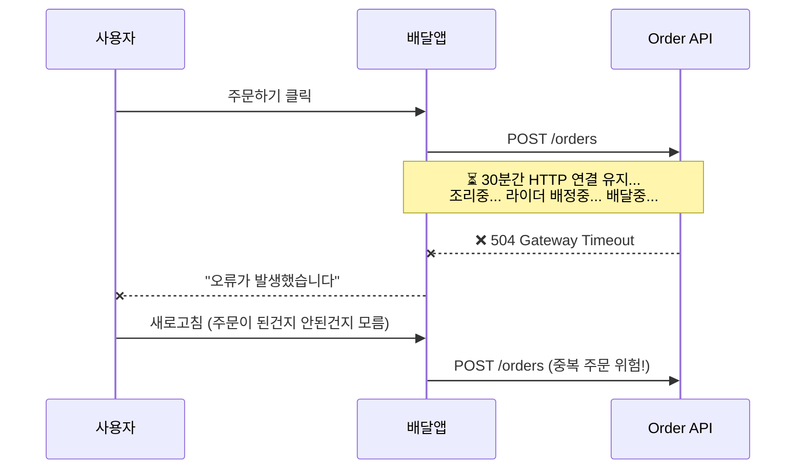
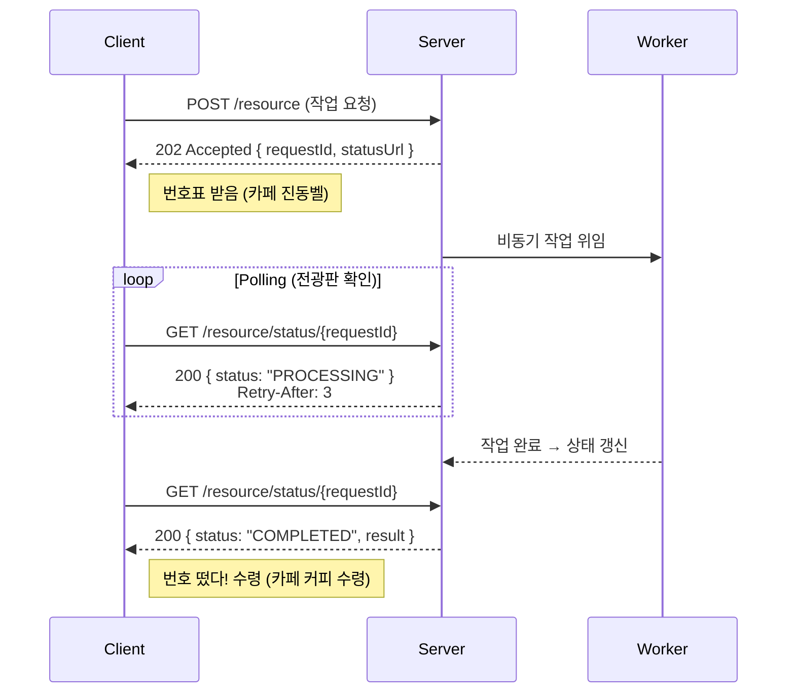
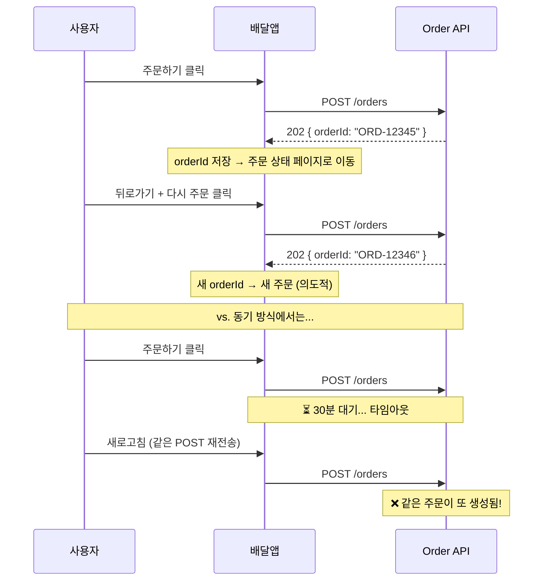
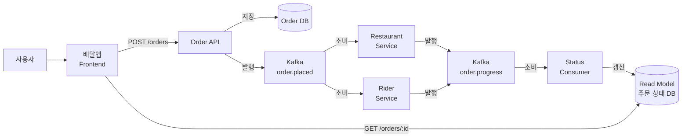
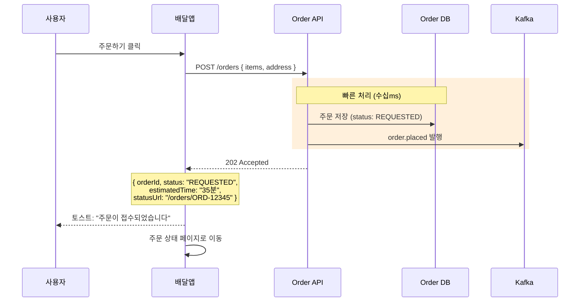
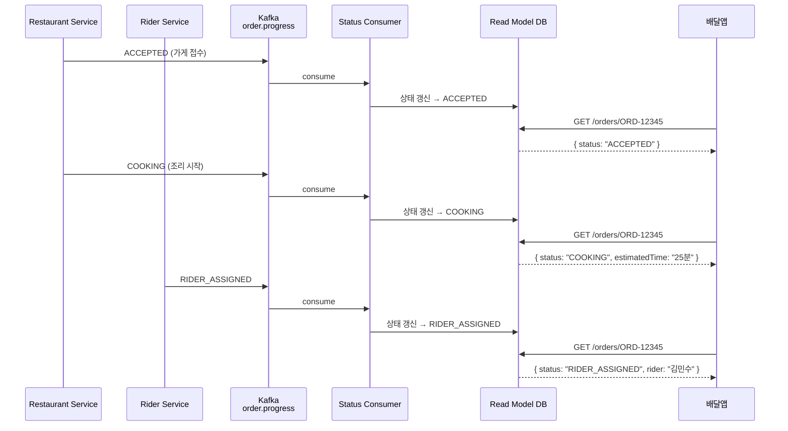
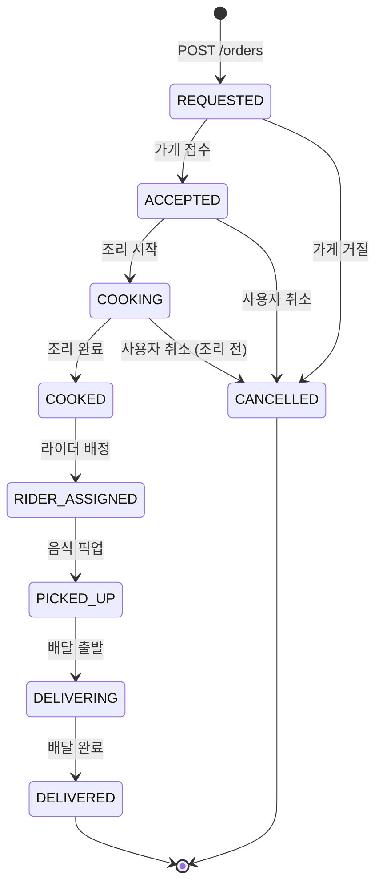

# 202 Accepted + Polling 패턴

---

> "주문 버튼 눌렀는데... 지금 어디쯤이지?"
>
> 비동기 시스템에서 클라이언트가 결과를 아는 방법은 무엇일까요?
> [01-2. EDA 기반 요청응답 통합](./01-2.%20EDA%20기반%20요청응답%20통합.md)에서 다룬 4가지 브릿지 패턴 중,
> 가장 범용적이고 인프라 요구사항이 적은 **Event-First(202 + Polling)** 패턴을 깊이 파고듭니다.

# 1. 문제: 동기 API로 오래 걸리는 작업을 처리한다면?

---

## 1.1 일상의 비유 — 카페 진동벨

카페에서 커피를 주문하는 과정을 떠올려봅시다.

1. 카운터에서 주문하고 번호표를 받는다 → **202 Accepted**
2. 자리에 앉아서 가끔 전광판을 확인한다 → **Polling**
3. 내 번호가 뜨면 카운터에서 수령한다 → **COMPLETED**

만약 진동벨 없이 카운터 앞에서 커피가 나올 때까지 서서 기다린다면? 뒷사람은 주문도 못 하고, 나는 아무것도 할 수 없습니다. 이것이 바로 동기 API의 문제입니다.

## 1.2 음식 배달을 동기로 처리한다면?

배달앱에서 주문 버튼을 누르면, 가게 접수 → 조리 → 라이더 배정 → 배달까지 30분~1시간이 걸립니다. 이 전체 과정을 동기 HTTP 요청 하나로 처리한다고 상상해봅시다.



```java
// ❌ Bad: 동기 블로킹 방식
@PostMapping("/orders")
public ResponseEntity<Order> createOrder(@RequestBody OrderRequest req) {
    Order order = orderService.placeAndWaitUntilDelivered(req); // ← 30분 블로킹
    return ResponseEntity.ok(order);
}
```

서버 스레드 하나가 주문 건당 30분을 점유합니다. 동시 주문 100건이면 100개 스레드가 아무 일도 못 하고 대기합니다.

## 1.3 문제 정리

| 문제 | 설명 |
| --- | --- |
| **Timeout** | 30분 조리+배달 동안 HTTP 연결 유지 불가 (대부분 30~60초 타임아웃) |
| **리소스 낭비** | 서버 스레드가 주문 건당 30분 점유 → 동시 처리량 급감 |
| **UX 악화** | 사용자가 진행 상태를 전혀 알 수 없음 (빈 화면에서 대기) |
| **중복 위험** | 타임아웃 후 새로고침하면 주문이 또 들어감 (멱등성 미보장) |

# 2. 패턴 소개: 202 Accepted + Polling

---

## 2.1 HTTP 202 Accepted란?

HTTP 상태 코드 중 202는 특별한 의미를 가집니다. 먼저 2xx 계열에서 자주 쓰이는 코드들을 비교해봅시다.

| 상태 코드 | 의미 | 서버 시점 | 예시 |
| --- | --- | --- | --- |
| **200 OK** | 요청 처리 **완료** | 결과가 이미 있음 | GET /users/1 → 사용자 정보 반환 |
| **201 Created** | 리소스 **생성 완료** | DB에 저장까지 끝남 | POST /users → 사용자 생성 완료 |
| **202 Accepted** | 요청 **접수됨**, 처리는 아직 안 끝남 | 큐에 넣었거나 비동기 처리 시작 | POST /orders → 주문 접수, 조리는 나중에 |

핵심 차이를 한 문장으로 정리하면:

- **200/201**: "다 했어, 여기 결과." — 과거 완료형
- **202**: "알겠어, 할게. 나중에 확인해." — 현재 진행형

### RFC 7231이 말하는 202

[RFC 7231 Section 6.3.3](https://tools.ietf.org/html/rfc7231#section-6.3.3)에서 202를 이렇게 정의합니다:

> *"The 202 (Accepted) status code indicates that the request has been accepted for processing, but the processing has not been completed. The request might or might not eventually be acted upon, as it might be disallowed when processing actually takes place."*

여기서 놓치기 쉬운 포인트가 2가지 있습니다.

**1) "processing has not been completed" — 아직 안 끝남**

202는 "성공"이 아닙니다. "접수"입니다. 배달앱에서 주문 버튼을 누르고 "주문이 접수되었습니다"라는 토스트를 보는 것이지, "배달이 완료되었습니다"가 아닙니다. 최종 결과는 나중에 별도로 확인해야 합니다.

**2) "might or might not eventually be acted upon" — 실패할 수도 있음**

202를 받았다고 해서 처리가 보장되는 것이 아닙니다. 배달 주문을 넣었지만 가게가 거절할 수 있고, Jenkins 빌드를 요청했지만 큐가 가득 차서 드롭될 수 있습니다. 그래서 Polling 응답에 FAILED/CANCELLED 같은 실패 상태가 반드시 있어야 합니다.

### 왜 200으로 하면 안 되는가?

"그냥 200 OK에 `{ status: 'PROCESSING' }` 넣으면 안 되나요?" 라는 질문이 나올 수 있습니다.

```java
// ❌ 의미가 모호한 방식
@PostMapping("/orders")
public ResponseEntity<OrderResponse> createOrder(@RequestBody OrderRequest req) {
    orderRepository.save(order);
    kafkaTemplate.send("order.placed", event);
    return ResponseEntity.ok(new OrderResponse("PROCESSING", orderId)); // ← 200 OK
}
```

기술적으로 동작은 합니다. 하지만 문제가 있습니다.

| 측면 | 200 OK + PROCESSING | 202 Accepted |
| --- | --- | --- |
| **의미 전달** | 모호 — 200은 "완료"를 의미하므로 PROCESSING과 모순 | 명확 — "접수됨, 아직 처리중" |
| **클라이언트 판단** | 상태 코드만으로 판단 불가, body를 파싱해야 함 | 상태 코드만으로 "아직 진행중"임을 앎 |
| **HTTP 캐시** | 200은 캐싱 가능 → 중간 상태가 캐시될 위험 | 202는 기본적으로 캐싱하지 않음 |
| **API 문서** | "200인데 사실은 아직 안 끝남" 설명 필요 | HTTP 표준에 의미가 내장됨 |
| **프록시/로드밸런서** | 200을 보고 "성공"으로 기록 | 202를 보고 "비동기 처리 중"으로 구분 가능 |

HTTP 상태 코드는 **기계가 읽는 API의 첫 번째 언어**입니다. 200은 "완료"라는 약속이고, 202는 "접수"라는 약속입니다. 약속을 정확히 지켜야 클라이언트(사람이든, 프록시든, 모니터링 시스템이든)가 올바르게 동작합니다.

## 2.2 202 응답 설계 — 무엇을 돌려줘야 하는가?

202를 반환할 때 body를 비워두면 클라이언트는 막막합니다. "접수됐다는 건 알겠는데, 그래서 어떻게 확인하지?" 202 응답에는 **클라이언트가 다음 행동을 할 수 있는 정보**가 있어야 합니다.

### 필수 요소

```json
{
  "orderId": "ORD-12345",
  "status": "REQUESTED",
  "statusUrl": "/orders/ORD-12345"
}
```

| 필드 | 역할 | 왜 필요한가? |
| --- | --- | --- |
| **orderId** (또는 requestId) | 작업 식별자 | Polling할 때 "어떤 작업?"을 특정하기 위해 |
| **status** | 현재 상태 | 클라이언트가 초기 상태를 즉시 표시하기 위해 |
| **statusUrl** | Polling 엔드포인트 | 클라이언트가 어디로 상태를 확인하러 가야 하는지 알려주기 위해 |

### 선택 요소 (도메인에 따라)

```json
{
  "orderId": "ORD-12345",
  "status": "REQUESTED",
  "statusUrl": "/orders/ORD-12345",
  "estimatedTime": "35분",
  "message": "주문이 접수되었습니다. 곧 가게에서 확인할 거예요.",
  "createdAt": "2024-01-15T14:00:00Z"
}
```

| 필드 | 역할 |
| --- | --- |
| **estimatedTime** | 사용자에게 예상 대기 시간 안내 (UX 개선) |
| **message** | 사람이 읽을 수 있는 상태 메시지 |
| **createdAt** | 작업 시작 시각 (디버깅, 타임아웃 계산용) |

### HTTP 헤더로 전달하는 정보

body 외에 HTTP 헤더도 중요한 역할을 합니다.

```
HTTP/1.1 202 Accepted
Location: /orders/ORD-12345          ← RFC 7231 권장: 상태 확인 URL
Retry-After: 5                       ← RFC 7231 권장: 재확인 간격(초)
Content-Type: application/json

{ "orderId": "ORD-12345", "status": "REQUESTED" }
```

- **Location 헤더**: RFC 7231에서는 202 응답에 Location 헤더로 "상태를 확인할 수 있는 URL"을 제공하도록 권장합니다. body의 statusUrl과 같은 역할이지만, 표준 헤더를 쓰면 HTTP 클라이언트 라이브러리가 자동으로 활용할 수 있습니다.
- **Retry-After 헤더**: "N초 후에 다시 확인해"라는 서버의 힌트입니다. 클라이언트가 이 값을 존중하면 불필요한 요청을 줄일 수 있습니다.

## 2.3 Polling 엔드포인트 설계 — 어떻게 물어보고, 어떻게 대답하는가?

202로 접수 응답을 보냈으면, 클라이언트가 상태를 확인할 **Polling 엔드포인트**가 필요합니다. 이 엔드포인트의 설계가 패턴의 품질을 결정합니다.

### URL 패턴

Polling 엔드포인트의 URL을 설계하는 방식은 크게 2가지입니다.

```
# 방식 A: 리소스 자체를 조회 (리소스 중심)
GET /orders/{orderId}

# 방식 B: 별도의 요청 상태 조회 (요청 추적 중심)
GET /orders/requests/{requestId}
```

| 방식 | 특징 | 적합한 경우 |
| --- | --- | --- |
| **리소스 중심** `/orders/{orderId}` | 리소스가 즉시 생성됨, 상태만 변함 | 배달 주문 (주문은 바로 생성, 상태가 변함) |
| **요청 추적 중심** `/requests/{requestId}` | 리소스 생성 자체가 비동기 | 게시판 글쓰기 (글이 아직 생성되지 않았을 수 있음) |

배달 주문의 경우, POST 시점에 이미 주문(Order)이 DB에 생성되므로 **방식 A**가 자연스럽습니다. 반면 01-2 문서의 게시판 예시처럼 글 자체가 비동기로 생성되는 경우, 아직 boardId가 없을 수 있으므로 **방식 B**로 requestId를 추적합니다.

### 상태별 응답 설계

Polling 엔드포인트는 **현재 상태에 따라 다른 응답**을 반환해야 합니다. 중요한 원칙은: 진행 중일 때와 완료됐을 때의 응답 구조가 달라야 한다는 것입니다.

**진행 중 (아직 안 끝남)**

```
HTTP/1.1 200 OK
Retry-After: 10
Content-Type: application/json

{
  "orderId": "ORD-12345",
  "status": "COOKING",
  "updatedAt": "2024-01-15T14:15:00Z",
  "estimatedTime": "25분",
  "message": "맛있게 조리 중이에요"
}
```

- `Retry-After`를 포함하여 클라이언트에게 "N초 후에 다시 물어봐"를 알려줌
- 현재 상태와 예상 시간을 함께 제공

**성공 완료**

```
HTTP/1.1 200 OK
Content-Type: application/json

{
  "orderId": "ORD-12345",
  "status": "DELIVERED",
  "completedAt": "2024-01-15T14:45:00Z",
  "message": "배달이 완료되었습니다!"
}
```

- `Retry-After` 없음 → 클라이언트는 Polling을 중단해야 함
- 최종 결과를 포함

**실패 완료**

```
HTTP/1.1 200 OK
Content-Type: application/json

{
  "orderId": "ORD-12345",
  "status": "CANCELLED",
  "failedAt": "2024-01-15T14:05:00Z",
  "reason": "가게 사정으로 주문이 취소되었습니다"
}
```

- 실패 사유를 반드시 포함 → 사용자가 "왜?"를 알 수 있어야 함

### Polling 응답의 상태 코드를 어떻게 쓸 것인가?

Polling 엔드포인트의 HTTP 상태 코드에 대해 두 가지 설계 방식이 있습니다.

```
# 방식 1: 항상 200 + body에 상태 (단순한 방식)
GET /orders/ORD-12345 → 200 OK { status: "COOKING" }
GET /orders/ORD-12345 → 200 OK { status: "DELIVERED" }

# 방식 2: 진행중이면 202, 완료되면 200 (HTTP 의미론 활용)
GET /orders/ORD-12345 → 202 Accepted { status: "COOKING" }     ← 아직 진행 중
GET /orders/ORD-12345 → 200 OK { status: "DELIVERED" }         ← 완료
```

| 방식 | 장점 | 단점 |
| --- | --- | --- |
| **항상 200** | 단순, body만 파싱하면 됨 | 상태 코드만으로 완료 여부 판단 불가 |
| **202/200 구분** | 상태 코드만으로 "아직 진행중/완료" 구분 가능 | 클라이언트가 상태 코드도 처리해야 함 |

실무에서는 **방식 1(항상 200)** 이 더 흔합니다. 프론트엔드 입장에서 body의 status 필드만 보면 되니까 더 직관적이고, axios 같은 HTTP 클라이언트에서 202를 별도로 처리하는 코드를 작성할 필요가 없습니다.

## 2.4 Polling의 라이프사이클

Polling은 무한히 계속되면 안 됩니다. 명확한 시작 조건, 반복 조건, 종료 조건이 있어야 합니다.



카페 비유와 1:1로 매핑됩니다.

| 카페 | 시스템 |
| --- | --- |
| 주문 + 번호표 받기 | POST → 202 + requestId |
| 자리에서 전광판 보기 | GET polling |
| 번호 뜸 → 수령 | status: COMPLETED → 결과 획득 |

### 시작, 반복, 종료

| 단계 | 조건 | 행동 |
| --- | --- | --- |
| **시작** | POST 응답이 202 + requestId를 반환 | Polling 타이머 시작 |
| **반복** | status가 종료 상태가 아님 (PROCESSING, COOKING 등) | Retry-After 간격으로 GET 반복 |
| **정상 종료** | status가 COMPLETED/DELIVERED 등 성공 상태 | Polling 중단, 결과 표시 |
| **실패 종료** | status가 FAILED/CANCELLED 등 실패 상태 | Polling 중단, 에러 표시 |
| **타임아웃 종료** | 최대 Polling 횟수/시간 초과 | Polling 중단, 타임아웃 안내 |

타임아웃은 반드시 설정해야 합니다. 서버 장애로 상태가 영원히 PROCESSING에 머물면, 클라이언트가 무한히 Polling하게 됩니다.

## 2.5 멱등성 — 202가 자연스럽게 해결하는 문제

동기 API에서 30분 대기 후 타임아웃이 나면, 사용자는 "주문이 된 건지 안 된 건지" 모릅니다. 새로고침하면 POST가 다시 실행되어 중복 주문이 발생할 수 있습니다.

202 패턴에서는 이 문제가 구조적으로 완화됩니다.



202 패턴이 멱등성을 돕는 이유:

1. **POST가 즉시 완료**되므로 타임아웃이 발생할 여지가 거의 없음 (수십ms)
2. **orderId를 즉시 반환**하므로 클라이언트가 "이미 주문이 접수됐다"는 것을 확실히 앎
3. 페이지가 **주문 상태 화면으로 전환**되어, 같은 POST를 다시 보낼 UI 자체가 사라짐

추가로 완전한 멱등성이 필요하면 **Idempotency Key** 패턴을 결합합니다.

```java
@PostMapping("/orders")
public ResponseEntity<OrderResponse> createOrder(
        @RequestHeader("Idempotency-Key") String idempotencyKey, // ← 클라이언트가 생성한 고유 키
        @RequestBody OrderRequest req) {

    // 같은 키로 이미 요청이 있으면 기존 결과 반환
    return orderRepository.findByIdempotencyKey(idempotencyKey)
            .map(existing -> ResponseEntity.status(HttpStatus.ACCEPTED)
                    .body(OrderResponse.from(existing)))           // ← 중복 요청 → 기존 결과
            .orElseGet(() -> {
                Order order = Order.create(req, idempotencyKey);
                orderRepository.save(order);
                kafkaTemplate.send("order.placed", OrderEvent.from(order));
                return ResponseEntity.status(HttpStatus.ACCEPTED)
                        .body(OrderResponse.from(order));          // ← 신규 요청 → 새로 생성
            });
}
```

## 2.6 흔한 실수 — 안티패턴

### 안티패턴 1: 202를 반환하면서 statusUrl을 주지 않는다

```java
// ❌ 클라이언트: "접수된 건 알겠는데... 어디서 확인하지?"
return ResponseEntity.accepted().build(); // ← body 없음
```

클라이언트가 다음 행동을 할 수 없습니다. 최소한 requestId와 statusUrl은 반드시 포함해야 합니다.

### 안티패턴 2: Polling 종료 조건이 없다

```typescript
// ❌ 서버 장애 시 무한 Polling
useQuery({
  queryKey: ['order-status', orderId],
  queryFn: () => api.get(`/orders/${orderId}`),
  refetchInterval: 3000, // ← 영원히 3초마다
});
```

DELIVERED/CANCELLED에서 Polling을 중단하는 로직이 없으면, 서버 장애로 상태가 갱신되지 않을 때 클라이언트가 영원히 요청을 보냅니다. 최대 Polling 횟수나 시간 제한을 반드시 걸어야 합니다.

### 안티패턴 3: 실패 상태에 사유를 주지 않는다

```json
// ❌ 왜 취소됐는지 알 수 없음
{ "status": "CANCELLED" }

// ✅ 사유 포함
{ "status": "CANCELLED", "reason": "가게 사정으로 주문이 취소되었습니다" }
```

사용자가 "왜 취소됐지?"를 알 수 없으면 같은 주문을 다시 시도할지, 포기할지 판단할 수 없습니다.

### 안티패턴 4: POST에서 이미 다 처리하고 202를 반환한다

```java
// ❌ 202의 의미를 위반 — 사실상 동기 처리인데 202를 반환
@PostMapping("/orders")
public ResponseEntity<OrderResponse> createOrder(@RequestBody OrderRequest req) {
    Order order = orderService.placeOrder(req);
    orderService.notifyRestaurant(order);      // ← 동기 호출
    orderService.assignRider(order);           // ← 동기 호출
    return ResponseEntity.accepted().body(...); // ← 다 끝났는데 왜 202?
}
```

202는 "아직 처리중"이라는 약속입니다. 이미 다 처리했으면 200이나 201을 반환해야 합니다. 상태 코드의 의미를 지키지 않으면 클라이언트가 불필요한 Polling을 시작합니다.

## 2.7 01-2 브릿지 패턴 중 위치

[01-2 문서](./01-2.%20EDA%20기반%20요청응답%20통합.md)에서 소개한 4가지 브릿지 패턴 비교표를 다시 보면:

| 측면 | ReplyingKafkaTemplate | CQRS + Materialized View | SSE | **Event-First + Outbox** |
| --- | --- | --- | --- | --- |
| **응답 방식** | 동기 (타임아웃 내) | 비동기 쓰기, 동기 읽기 | 단방향 스트림 | **202 Accepted + Polling** |
| **인프라 요구** | Kafka reply 토픽 | View 관리 인프라 | SSE 연결 유지 | **최소 (HTTP만)** |
| **클라이언트 주도** | ❌ 서버 대기 | ❌ 서버 측 View | ❌ 서버 푸시 | **✅ 클라이언트가 원할 때 조회** |
| **복잡도** | 낮음 | 높음 | 중간 | **중간** |

202+Polling의 특징은 **가장 범용적**이고, **인프라 요구사항이 최소**(추가 인프라 없이 HTTP만으로 동작)이며, **클라이언트 주도**라는 점입니다.

# 3. 실전 적용: 음식 배달 주문 시스템

---

## 3.1 시나리오

사용자가 배달앱에서 주문을 넣으면 다음 단계를 거칩니다.

> 주문 접수 → 가게 확인 → 조리중 → 조리완료 → 라이더 배정 → 픽업 → 배달중 → 배달완료

이 과정에서 데이터는 두 종류로 나뉩니다.

| 구분 | 데이터 | 시점 |
| --- | --- | --- |
| **즉시 필요** | 주문 접수 여부, 주문번호, 예상 시간 | POST 응답 시 |
| **계속 갱신** | 현재 상태, 라이더 정보, 예상 도착 시간 | Polling으로 반복 조회 |

핵심 설계 원칙: 즉시 필요한 것은 202 응답에 담고, 계속 갱신되는 것은 Polling으로 조회합니다.

## 3.2 전체 아키텍처



- **Order API**: 주문 접수 + 이벤트 발행 (빠르게 202 반환)
- **Restaurant/Rider Service**: 실제 비즈니스 처리 (조리, 배달) → 상태 이벤트 발행
- **Status Consumer**: 이벤트를 소비하여 Read Model(주문 상태 DB) 갱신
- **Frontend**: Read Model을 Polling하여 최신 상태 표시

## 3.3 즉시 응답 흐름 (POST)



응답 JSON:

```json
{
  "orderId": "ORD-12345",
  "status": "REQUESTED",
  "estimatedTime": "35분",
  "statusUrl": "/orders/ORD-12345"
}
```

POST는 DB 저장 + Kafka 발행만 하고 즉시 202를 반환합니다. 조리/배달은 별도 서비스가 비동기로 처리합니다.

## 3.4 상태 갱신 흐름 (이벤트 → Read Model → Polling)



### 토픽 역할 정리

| 토픽 | 발행자 | 역할 |
| --- | --- | --- |
| `order.placed` | Order API | 주문 접수 사실 전파 → 가게/라이더 서비스가 처리 시작 |
| `order.progress` | Restaurant/Rider Service | 중간 상태 전파 (ACCEPTED, COOKING, RIDER_ASSIGNED, DELIVERING) |
| `order.completed` | Restaurant/Rider Service | 최종 상태 (DELIVERED, CANCELLED) |

## 3.5 상태 전이 다이어그램



각 상태 전이마다 `order.progress` 또는 `order.completed` 이벤트가 발행되고, Status Consumer가 Read Model을 갱신합니다.

## 3.6 Backend 코드 — Spring Boot

### POST /orders: 주문 생성 + 202 반환

```java
@RestController
@RequiredArgsConstructor
public class OrderController {

    private final OrderRepository orderRepository;
    private final KafkaTemplate<String, OrderEvent> kafkaTemplate;

    @PostMapping("/orders")
    public ResponseEntity<OrderResponse> createOrder(@RequestBody OrderRequest req) {
        // 1. 주문 저장 (즉시 완료)
        Order order = Order.create(req.getItems(), req.getAddress()); // ← status: REQUESTED
        orderRepository.save(order);

        // 2. 이벤트 발행
        kafkaTemplate.send("order.placed", order.getId(), OrderEvent.from(order));

        // 3. 202 반환 (조리/배달은 비동기)
        return ResponseEntity.status(HttpStatus.ACCEPTED)
                .body(new OrderResponse(
                        order.getId(),
                        "REQUESTED",
                        order.getEstimatedTime(),
                        "/orders/" + order.getId()  // ← Polling URL
                ));
    }
}
```

### GET /orders/{orderId}: Read Model 조회 + Retry-After

```java
@GetMapping("/orders/{orderId}")
public ResponseEntity<?> getOrderStatus(@PathVariable String orderId) {
    OrderReadModel order = orderReadModelRepository.findById(orderId)
            .orElseThrow(() -> new NotFoundException("Order not found"));

    return switch (order.getStatus()) {
        case REQUESTED, ACCEPTED, COOKING, COOKED,
             RIDER_ASSIGNED, PICKED_UP, DELIVERING ->
                ResponseEntity.status(HttpStatus.OK)
                        .header("Retry-After", retryAfterFor(order.getStatus())) // ← 상태별 간격
                        .body(OrderStatusResponse.processing(order));

        case DELIVERED ->
                ResponseEntity.ok(OrderStatusResponse.completed(order));

        case CANCELLED ->
                ResponseEntity.ok(OrderStatusResponse.cancelled(order));
    };
}

// 상태별 Polling 간격 조절
private String retryAfterFor(OrderStatus status) {
    return switch (status) {
        case REQUESTED, ACCEPTED -> "5";   // ← 초반: 5초
        case COOKING, COOKED -> "15";      // ← 조리중: 15초 (변화 느림)
        case RIDER_ASSIGNED, PICKED_UP -> "10";
        case DELIVERING -> "10";           // ← 배달중: 10초
        default -> "5";
    };
}
```

### Consumer: 이벤트 소비 → Read Model 갱신

```java
@Component
@RequiredArgsConstructor
public class OrderStatusConsumer {

    private final OrderReadModelRepository readModelRepository;

    @KafkaListener(topics = {"order.progress", "order.completed"})
    public void onOrderEvent(OrderEvent event) {
        OrderReadModel model = readModelRepository.findById(event.getOrderId())
                .orElseGet(() -> OrderReadModel.create(event.getOrderId()));

        model.updateStatus(event.getStatus());         // ← COOKING, DELIVERING 등
        model.setRiderInfo(event.getRiderInfo());       // ← 라이더 정보 (있으면)
        model.setEstimatedArrival(event.getEta());      // ← 예상 도착 시간

        readModelRepository.save(model);
    }
}
```

## 3.7 Frontend 코드 — React Query

### useCreateOrder: 주문 생성 (POST → 202)

```typescript
function useCreateOrder() {
  return useMutation({
    mutationFn: (order: CreateOrderRequest) =>
      api.post<OrderResponse>('/orders', order),

    onSuccess: (data) => {
      toast.info('주문이 접수되었습니다!');
      // orderId를 상태로 저장 → Polling 시작 트리거
      navigate(`/orders/${data.orderId}`);
    },
  });
}
```

### useOrderStatus: 상태 Polling (GET → refetchInterval)

```typescript
function useOrderStatus(orderId: string | null) {
  return useQuery({
    queryKey: ['order-status', orderId],
    queryFn: () => api.get<OrderStatusResponse>(`/orders/${orderId}`),

    enabled: !!orderId,                 // ← orderId 있을 때만 실행
    refetchInterval: (query) => {
      const status = query.state.data?.status;
      if (status === 'DELIVERED' || status === 'CANCELLED') {
        return false;                   // ← 종료 상태면 Polling 중단
      }
      return 3000;                      // ← 3초마다 재조회
    },
    refetchIntervalInBackground: false, // ← 탭 비활성 시 중지
  });
}
```

### OrderStatusPage 컴포넌트

```tsx
function OrderStatusPage() {
  const { orderId } = useParams<{ orderId: string }>();
  const { data: order, isLoading } = useOrderStatus(orderId ?? null);

  if (isLoading) return <Skeleton />;
  if (!order) return <NotFound />;

  return (
    <div>
      <h1>주문 상태</h1>
      <StatusTimeline status={order.status} />   {/* ← 상태별 타임라인 UI */}
      <StatusDetail order={order} />              {/* ← 상태별 상세 정보 */}
    </div>
  );
}
```

## 3.8 프론트 상태별 UI 변화

배민앱에서 주문 후 보이는 화면을 떠올려보면, 각 상태에서 사용자가 보는 정보가 다릅니다.

| 상태 | 화면 | 사용자 경험 |
| --- | --- | --- |
| **REQUESTED** | "주문 접수 중..." | 대기 스피너, 곧 가게가 확인할 거라는 안내 |
| **ACCEPTED** | "가게에서 주문을 확인했어요" | 예상 조리 시간 표시 |
| **COOKING** | "맛있게 조리 중이에요" | 예상 완료 시간 카운트다운 |
| **COOKED** | "조리가 완료되었어요" | 라이더 배정 대기 중 안내 |
| **RIDER_ASSIGNED** | "라이더가 배정되었어요" | 라이더 이름, 연락처, 예상 픽업 시간 |
| **PICKED_UP** | "라이더가 음식을 픽업했어요" | 예상 도착 시간 |
| **DELIVERING** | "배달 중이에요" | 예상 도착 시간, (지도 위 라이더 위치) |
| **DELIVERED** | "배달 완료!" | Polling 중단, 리뷰 작성 유도 |
| **CANCELLED** | "주문이 취소되었어요" | Polling 중단, 취소 사유 표시 |

DELIVERED나 CANCELLED에 도달하면 더 이상 상태가 변하지 않으므로 **Polling을 중단**합니다. 불필요한 서버 요청을 방지하는 중요한 설계 포인트입니다.

# 4. 다른 사례로 확장 — 같은 패턴, 다른 도메인

---

202+Polling 패턴은 도메인이 달라도 구조가 동일합니다.

| 요소 | 음식 배달 | 게시판 글쓰기 (01-2) | 이커머스 주문 (01-2) | Jenkins 빌드 |
| --- | --- | --- | --- | --- |
| **POST endpoint** | /orders | /boards | /orders | /builds |
| **반환 ID** | orderId | requestId | correlationId | buildRequestId |
| **상태 흐름** | REQUESTED → COOKING → DELIVERING → DELIVERED | PROCESSING → COMPLETED | PROCESSING → COMPLETED | REQUESTED → QUEUED → RUNNING → SUCCEEDED |
| **소요 시간** | 30분~1시간 | 수백ms~수초 | 수초~수분 | 5~15분 |
| **Polling 간격** | 5~15초 (상태별 가변) | 1~2초 | 2~3초 | 5~10초 |
| **종료 조건** | DELIVERED / CANCELLED | COMPLETED / FAILED | COMPLETED / FAILED | SUCCEEDED / FAILED |

핵심 인사이트: **구조는 동일하고 도메인 용어만 다릅니다.** POST → 202 + ID 반환 → Polling → 종료 상태 감지라는 골격은 어디에나 적용됩니다.

# 5. 설계 시 고려사항

---

## 5.1 Polling 간격과 Retry-After

Polling 간격을 결정하는 3가지 전략이 있습니다.

| 전략 | 방식 | 적합한 경우 |
| --- | --- | --- |
| **고정 간격** | 항상 N초마다 | 단순한 상태, 변화 빈도가 일정 |
| **서버 주도 Retry-After** | 서버가 상태에 따라 간격 지정 | 상태별 변화 속도가 다를 때 (배달 주문) |
| **지수 백오프** | 1초 → 2초 → 4초 → 8초... | 장시간 작업, 서버 부하 방지 (Jenkins 빌드) |

음식 배달의 경우, 상태에 따라 변화 속도가 다르므로 **서버 주도 Retry-After**가 적합합니다.

```
REQUESTED/ACCEPTED: 5초  → 가게 응답은 보통 빠름
COOKING:           15초  → 조리는 수분~수십분, 자주 확인할 필요 없음
DELIVERING:        10초  → 배달은 수분, 적당한 간격
```

## 5.2 타임아웃과 실패 처리

Polling이 영원히 계속되면 안 됩니다.

```typescript
function useOrderStatus(orderId: string | null) {
  const [pollCount, setPollCount] = useState(0);
  const MAX_POLLS = 600; // ← 3초 간격 × 600회 = 30분 최대

  return useQuery({
    queryKey: ['order-status', orderId],
    queryFn: async () => {
      setPollCount((c) => c + 1);
      if (pollCount >= MAX_POLLS) {
        throw new Error('주문 상태 확인 시간이 초과되었습니다');
      }
      return api.get<OrderStatusResponse>(`/orders/${orderId}`);
    },
    // ...
  });
}
```

CANCELLED이나 FAILED 상태에는 사유를 함께 전달합니다.

```json
{
  "orderId": "ORD-12345",
  "status": "CANCELLED",
  "reason": "가게 사정으로 주문이 취소되었습니다",
  "cancelledAt": "2024-01-15T14:30:00Z"
}
```

## 5.3 SSE/WebSocket과 언제 비교되는가?

| 방식 | 연결 방식 | 적합한 경우 | 인프라 부담 |
| --- | --- | --- | --- |
| **Polling** | Stateless, 주기적 요청 | 분 단위 갱신 (배달 상태) | 낮음 |
| **SSE** | 단방향 스트림 (서버 → 클라이언트) | 실시간 스트림 (채팅, 주가) | 중간 |
| **WebSocket** | 양방향 (서버 ⇄ 클라이언트) | 양방향 실시간 (게임, 협업 편집) | 높음 |

배달 주문 상태는 수 초~수 분 간격으로 변합니다. SSE나 WebSocket의 실시간성이 반드시 필요하지 않고, Polling만으로 충분히 좋은 UX를 제공할 수 있습니다. 연결을 유지하지 않으므로 서버 리소스도 절약됩니다.

> SSE 방식이 궁금하다면 [01-2 문서의 Section 3 (Server-Sent Events)](./01-2.%20EDA%20기반%20요청응답%20통합.md)을 참고하세요.

# 6. 정리

---

> **202 Accepted + Polling = 배달앱 주문 추적.**
>
> 접수 확인은 즉시(202), 진행 상태는 주기적 확인(Polling).

| 문제 | 해결 |
| --- | --- |
| 30분 HTTP 블로킹 → Timeout | POST는 접수만 → 즉시 202 반환 |
| 서버 스레드 30분 점유 | 비동기 처리, 서버는 즉시 해방 |
| UX: 진행 상태 알 수 없음 | Polling으로 실시간에 가까운 상태 표시 |
| 새로고침 시 중복 주문 | orderId 기반 멱등성 보장 |

이 패턴은 인프라 요구사항이 최소이면서도 클라이언트-서버 간 비동기 처리를 깔끔하게 연결합니다. 카페 진동벨처럼, **접수 확인은 즉시 주고 결과는 나중에 확인**하는 — 우리가 일상에서 이미 쓰고 있는 패턴입니다.

---

← [01-2. EDA 기반 요청응답 통합](./01-2.%20EDA%20기반%20요청응답%20통합.md)으로 돌아가기
