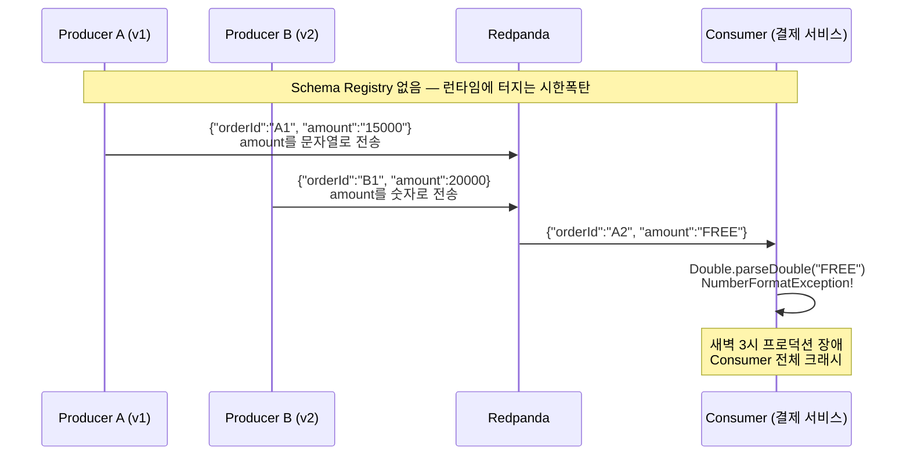
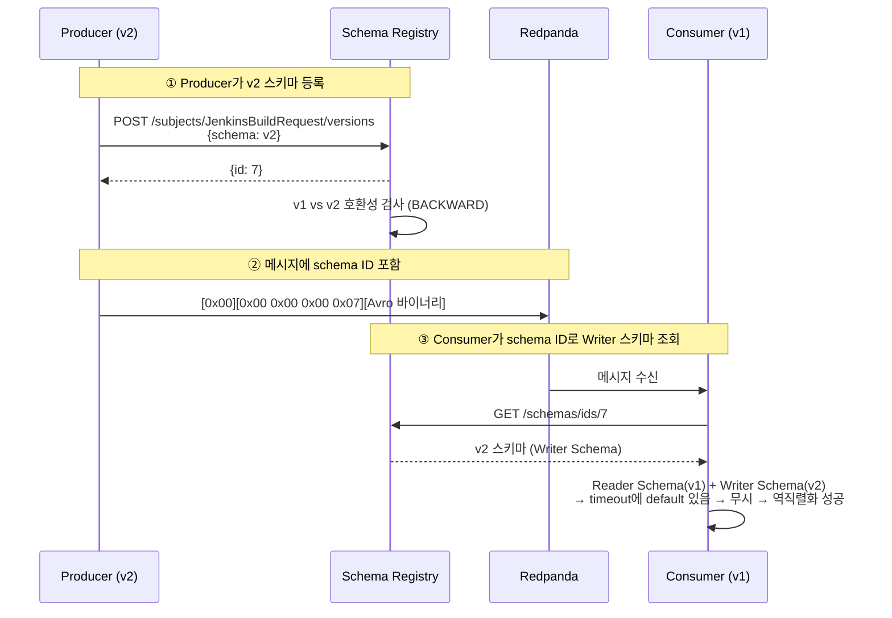
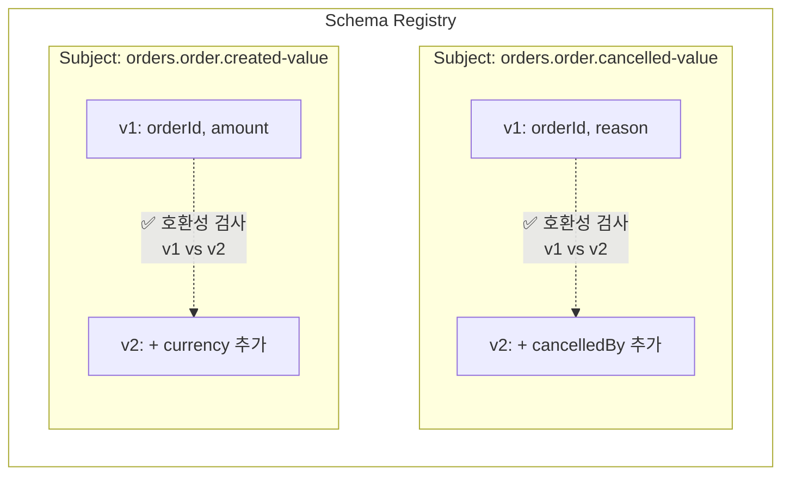
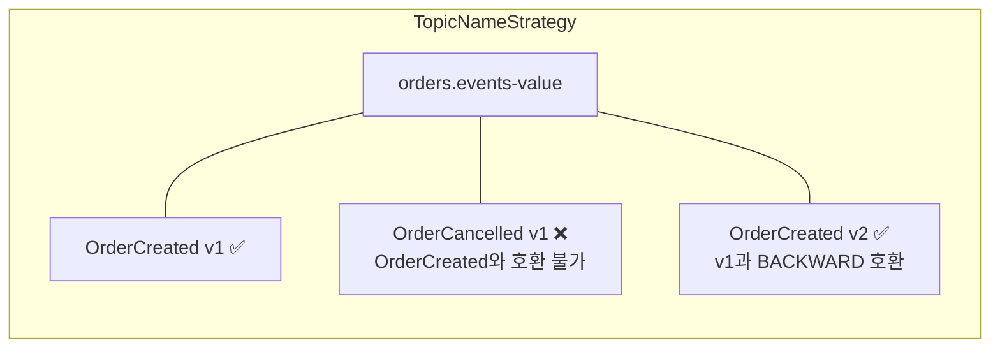
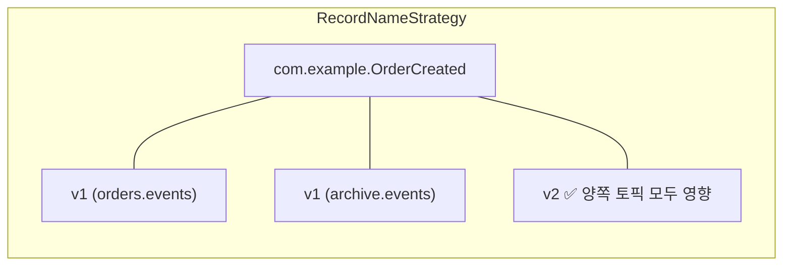
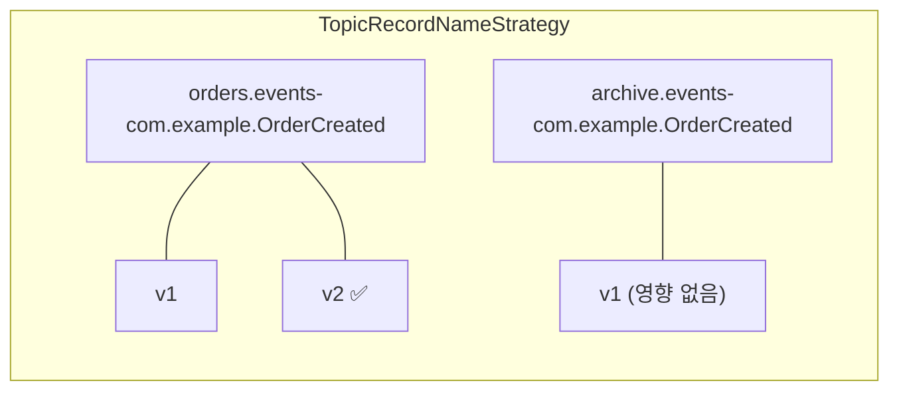

# Schema Registry가 왜 필요한가?

---

> 스키마는 "데이터의 구조를 정의하는 명세"다. DB 스키마는 강제되지만 메시지 큐에는 메시지 형태가 강제되지 않는다. Producer가 어떤 형태의 바이트 배열이라도 보내면 브로커는 그대로 저장한다. Schema Registry는 그 빈자리를 메우는 인프라 계층의 계약 강제 서버다.


## 학습 목표

> Schema Registry를 *메시지 큐 계약을 인프라 수준에서 강제하는 도구*로 이해한다.

이 장을 다 읽고 다음 다섯 가지에 자신 있게 답할 수 있으면 학습이 완료된다.

1. Schema Registry가 없을 때 발생하는 런타임 사고를 한 줄로 설명할 수 있다.
2. Confluent wire format(magic byte + schema ID + 페이로드)이 어떻게 Writer Schema와 Reader Schema를 분리하는지 설명할 수 있다.
3. BACKWARD / FORWARD / FULL 호환성 모드의 *배포 순서*가 어떻게 달라지는지 비교할 수 있다.
4. TopicNameStrategy / RecordNameStrategy / TopicRecordNameStrategy 세 전략을 *어떤 토픽 설계*에서 골라야 하는지 판단할 수 있다.
5. 공통 모듈에 Avro 스키마가 박힌 멀티 서비스 구조에서 "배포 시점 불일치" 사고를 어떻게 막는지 설명할 수 있다.


## 1. 왜 Schema Registry가 필요한가

Schema Registry는 스키마들을 중앙에서 저장하고, 버전 및 호환성을 검증하는 서버다. REST API를 제공하며 Producer와 Consumer가 이 서버에 스키마를 등록하거나 조회한다.



- Redpanda는 바이트 배열을 저장할 뿐 내용을 검증하지 않으므로, 오류는 Consumer가 읽는 시점에서야 드러난다.
- Schema Registry를 사용하면 Producer와 Serializer 단계에서 타입 위반을 즉시 차단해, 이벤트 기반 시스템의 계약을 인프라 수준에서 강제한다.

### Write Format

Schema Registry를 사용하는 메시지는 다음 바이너리 포맷으로 인코딩된다.

| 바이트  | 내용                   | 설명                                   |
| ------- | ---------------------- | -------------------------------------- |
| 1 byte  | `0x00`                 | Magic Byte (Schema Registry 사용 표시) |
| 4 bytes | Schema ID              | Big-endian 정수                        |
| N bytes | Avro/Protobuf 바이너리 | 실제 데이터                            |

> Confluent wire format을 생성하는 직렬화 래퍼(`KafkaAvroSerializer`)의 코드 예시와 순수 Avro 라이브러리와의 비교는 [02-03.Avro § Confluent Wire Format과 직렬화 래퍼](02-03.Avro.md#confluent-wire-format과-직렬화-래퍼) 참조.

### 호환성 모드

| **모드**            | **설명**                          | **배포 순서**    |
| ------------------- | --------------------------------- | ---------------- |
| BACKWARD (기본)     | 새 스키마가 이전 데이터 읽기 가능 | Consumer 먼저    |
| FORWARD             | 이전 스키마가 새 데이터 읽기 가능 | Producer 먼저    |
| FULL                | 양방향 호환                       | 순서 무관 (권장) |
| NONE                | 호환성 검사 안 함                 | 개발 환경 전용   |
| BACKWARD_TRANSITIVE | 모든 이전 버전과 BACKWARD 호환    | Consumer 먼저    |
| FORWARD_TRANSITIVE  | 모든 이전 버전과 FORWARD 호환     | Producer 먼저    |
| FULL_TRANSITIVE     | 모든 이전 버전과 FULL 호환        | 가장 엄격        |

> 호환성 모드의 정의는 "어느 쪽을 먼저 배포해야 하는가"를 결정하는 운영 규칙이다. 필드 추가·삭제별 안전 규칙과 PR 단계의 자동 검증은 [02-06.Avro 스키마 진화 패턴](02-06.Avro%20스키마%20진화%20패턴.md) 참조.


## 배포 시점 불일치와 Schema Resolution

> 공통 모듈(예: `core-messaging`)에 Avro 스키마를 정의하고 여러 서비스가 의존하는 구조에서, 스키마 변경 시 모든 서비스를 동시에 배포하는 것은 현실적으로 불가능하다. 서비스 A가 v2로 먼저 배포되고, 서비스 B는 아직 v1인 시간대가 반드시 존재한다.

```
시간대  │  pipeline-api (Producer, v2)  │  scheduler (Consumer, v1)
────────┼──────────────────────────────┼──────────────────────────
09:00   │  v2 배포 완료                 │  아직 v1
09:01   │  timeout=30 포함 메시지 발행   │  v1 스키마로 역직렬화 시도
        │                              │  → timeout 필드를 모름 → ???
09:30   │                              │  v2 배포 완료
```

### Schema Registry 없이 Avro만 쓰면

Avro 라이브러리 자체는 바이너리에 스키마 정보를 포함하지 않는다. 필드 순서와 타입 정보 없이 값만 연속으로 기록하므로, Reader가 Writer와 다른 스키마를 사용하면 바이트 경계가 어긋나 잘못된 값으로 역직렬화되거나, 운이 좋아야 에러가 발생한다.

```
Avro 바이너리: [0x06][0x0C]hello[0x08]dev[0x3C]...
                 ↑
             스키마 정보 없음. 어떤 필드가 어떤 순서인지 알 수 없음.
```

### Schema Registry가 있으면

Confluent wire format은 바이너리 앞 5바이트에 magic byte와 schema ID를 붙인다. Consumer는 이 schema ID로 Registry에서 Writer Schema를 조회하고, 자신의 Reader Schema와 비교하여 Avro의 스키마 해석 규칙을 적용한다.



- 이 과정에서 핵심은 **Writer Schema**와 **Reader Schema**의 분리다. 
- Producer가 쓴 스키마(Writer)와 Consumer가 읽는 스키마(Reader)가 다를 수 있으며, Avro는 두 스키마를 비교하여 필드 매핑을 수행한다.

| Writer에만 있는 필드 | Reader에만 있는 필드 | 동작 |
|---------------------|---------------------|------|
| default 있음 | - | Reader가 무시 (안전) |
| default 없음 | - | 역직렬화 실패 |
| - | default 있음 | default 값으로 채움 |
| - | default 없음 | 역직렬화 실패 |

- 이 규칙이 호환성 모드와 결합된다. BACKWARD 모드에서는 "새 Reader가 이전 Writer의 데이터를 읽을 수 있는가?"를 검사하므로, v2 스키마를 등록할 때 v1 데이터를 v2 Reader로 읽을 수 있는지 Registry가 미리 검증한다.

### 실전 적용: message-lib

TPS message-lib에서는 `AvroSerializer` 래퍼가 이 과정을 캡슐화한다.

```java
// 직렬화 (Producer 측)
byte[] payload = avroSerializer.serialize(jenkinsBuildRequest);

// 내부: KafkaAvroSerializer → Schema Registry에 스키마 등록 → [0x00][schema ID][Avro binary]
// 아웃박스에 저장
eventPublisher.publish("JENKINS_BUILD_AVRO"
                       , jobName
                       , "jenkins.build.avro.trigger"
			          			 , payload
                       , Topics.JENKINS_BUILD
                       , correlationId
);
```

```java
// 역직렬화 (Consumer 측)
JenkinsBuildRequest request = avroSerializer.deserialize(
        record.value(), JenkinsBuildRequest.getClassSchema());
// 내부: schema ID 추출 → Registry에서 Writer Schema 조회 → Reader Schema와 비교 → 역직렬화
```

- `RecordNameStrategy`를 선택한 이유는 같은 토픽(`tps.jenkins.build`)에 여러 레코드 타입을 보낼 가능성이 있기 때문이다. `TopicNameStrategy`였다면 토픽당 하나의 스키마만 허용되어 확장이 어렵다.

## Subject Naming Strategy

> Subject는 Schema Registry에서 스키마 버전을 묶는 논리적 그룹이다. 하나의 Subject 안에 v1, v2처럼 버전이 쌓이고, 호환성 검사는 같은 Subject 내에서 이뤄진다.



## Subject 3가지 전략

Subject Naming Strategy는 "어떤 기준으로 Subject를 만들 것인가"를 결정한다. 이 선택이 어떤 스키마끼리 호환성 검사를 받는가를 결정하므로 토픽 설계와 직결된다.

```yaml
spring:
  kafka:
    properties:
      value.subject.name.strategy: io.confluent.kafka.serializers.subject.TopicNameStrategy
```

`TopicNameStrategy`, `RecordNameStrategy`, `TopicRecordNameStrategy`는 Confluent Serializer의 `SubjectNameStrategy` 인터페이스 구현체다.

```yaml
# 토픽: orders.events / 레코드: com.example.OrderCreated

TopicNameStrategy (기본):     "orders.events-value"
  → 토픽당 하나의 스키마만 허용

RecordNameStrategy:          "com.example.OrderCreated"
  → 레코드 타입별 독립. 같은 레코드는 모든 토픽에서 같은 스키마 공유

TopicRecordNameStrategy:     "orders.events-com.example.OrderCreated"
  → 토픽+레코드 조합별 독립. 가장 유연
```

## .avsc 기반 호환성 검사 예시

다음 상황을 가정한다.

```bash
# OrderCreated.avsc (v1)                    # OrderCreated.avsc (v2)
{"type":"record",                           {"type":"record",
 "name":"OrderCreated",                      "name":"OrderCreated",
 "namespace":"com.example",                  "namespace":"com.example",
 "fields":[                                  "fields":[
   {"name":"orderId","type":"string"},          {"name":"orderId","type":"string"},
   {"name":"amount","type":"double"}            {"name":"amount","type":"double"},
 ]}                                             {"name":"currency","type":"string",
                                                 "default":"KRW"}
                                              ]}

# OrderCancelled.avsc (v1) — OrderCreated와 완전히 다른 레코드 타입
{"type":"record",
 "name":"OrderCancelled",
 "namespace":"com.example",
 "fields":[
   {"name":"orderId","type":"string"},
   {"name":"cancelledAt","type":"long"},
   {"name":"reason","type":"string"}
 ]}
```

- .avsc 파일 2개: OrderCreated, OrderCancelled
- 토픽 2개: orders.events, archive.events
- v2 변경 OrderCreated에 currency 필드 추가

### TopicNameStrategy(기본)

Subject에 OrderCreated v1이 먼저 등록된 상태 → OrderCancelled v1을 등록 시도하면 **실패**(토픽당 하나의 스키마만 허용한다).



### RecordNameStrategy

Subject가 레코드별 독립(`com.example.OrderCreated`, `com.example.OrderCancelled`)이라 **같은 토픽에 여러 이벤트가 가능해진다.**



- 단 같은 레코드 타입은 모든 토픽에서 같은 스키마를 공유한다.

### TopicRecordNameStrategy

토픽+레코드 조합별로 독립적이라, 같은 레코드 타입이어도 토픽이 다르면 독립적으로 진화 가능하다.



## 선택 가이드

| **상황**                       | **전략**                   | **이유**                                           |
| ------------------------------ | -------------------------- | -------------------------------------------------- |
| 이벤트 타입별 토픽 분리        | `TopicNameStrategy` (기본) | 토픽=스키마 1:1, 가장 단순                         |
| 도메인 단일 토픽에 여러 이벤트 | `TopicRecordNameStrategy`  | 토픽 내 각 레코드 타입이 독립 진화                 |
| 전사 표준 스키마 공유          | `RecordNameStrategy`       | 동일 레코드는 어디서든 같은 스키마                 |
| 마이그레이션 중 (점진 전환)    | `TopicRecordNameStrategy`  | 기존/신규 토픽이 같은 레코드를 써도 독립 진화 가능 |


## 실제 사례

- [Confluent Schema Registry 도입기 (요기요 기술 블로그)](https://techblog.yogiyo.co.kr/confluent-schema-registry-%EB%8F%84%EC%9E%85%EA%B8%B0-54d112b9b53f) — Subject 전략 선택과 마이그레이션 시 시행착오를 사례로 본다.


## 면접 대비 Q&A

> 면접에서 자주 나오는 형태로 5개. 답을 보지 않고 먼저 입으로 답해 본 뒤 비교한다.

### Q1. Schema Registry가 없을 때 발생하는 사고를 한 줄로 설명한다면?

Producer가 같은 토픽에 *다른 타입의 같은 필드*를 흘려보내도 브로커는 막지 못한다. 사고는 Consumer가 그 메시지를 역직렬화하는 시점에 터지므로, 발행과 사고 시점이 분리돼 새벽 3시 프로덕션 장애처럼 드러난다. Schema Registry는 발행 단계에서 타입 위반을 차단해 *사고의 발견 시점을 발행 측*으로 끌어온다.

### Q2. Confluent wire format이 Writer Schema와 Reader Schema를 어떻게 분리하나요?

메시지 앞 5바이트가 magic byte(`0x00`) + schema ID(4바이트 big-endian)이고, 그 뒤가 실제 Avro 바이너리다. Producer가 직렬화 시점의 스키마를 Registry에 등록하고 받은 ID를 박는다. Consumer는 받은 ID로 Registry에서 *Writer Schema*를 조회한 뒤, 자기 코드에 박힌 *Reader Schema*와 매칭해 Avro의 스키마 해석 규칙으로 역직렬화한다. 두 스키마가 분리되므로 Producer와 Consumer가 다른 버전이어도 안전하게 통신한다.

### Q3. BACKWARD / FORWARD / FULL 호환성 모드의 배포 순서가 왜 다른가요?

각 모드가 "어느 쪽이 새 스키마를 먼저 받아도 깨지지 않는가"를 정의하기 때문이다. BACKWARD는 *새 Reader가 옛 Writer 데이터를 읽을 수 있음*을 보장하므로 Consumer를 먼저 배포해도 안전하고, FORWARD는 *옛 Reader가 새 Writer 데이터를 읽을 수 있음*을 보장하므로 Producer를 먼저 배포해도 안전하다. FULL은 양방향 호환이라 순서 무관이며 운영에서 가장 안전하지만 스키마 변경 자유도가 가장 좁다.

### Q4. 같은 토픽에 여러 레코드 타입을 보내야 하면 어떤 Subject 전략을 골라야 하나요?

`TopicRecordNameStrategy` 또는 `RecordNameStrategy`를 쓴다. 기본 `TopicNameStrategy`는 토픽당 한 스키마만 허용해 같은 토픽에 둘째 레코드 타입을 등록하면 호환성 검사가 실패한다. 같은 레코드 타입이 *여러 토픽에 같은 스키마로* 흘러야 하면 `RecordNameStrategy`, 같은 레코드 타입이 *토픽마다 독립 진화*해야 하면 `TopicRecordNameStrategy`다. TPS message-lib은 후자의 가능성을 열기 위해 `RecordNameStrategy`를 쓴다.

### Q5. 공통 모듈에 Avro 스키마가 박힌 멀티 서비스 구조에서 배포 시점 불일치 사고를 어떻게 막나요?

세 가지를 함께 둔다.

1. Schema Registry를 운영하고, BACKWARD 또는 FULL 호환성 모드를 강제한다 — Consumer를 먼저 배포해도 v1 데이터가 v2 Reader로 읽힌다.
2. 새 필드는 `default` 값을 반드시 두고, 필드를 *삭제*할 때는 한 버전을 deprecated만 유지한 뒤 다음 버전에서 제거한다.
3. PR 단계에서 Registry에 등록된 최신 스키마와의 호환성을 빌드 단계에서 검사한다(Maven/Gradle 플러그인 또는 CI 스크립트). 사고를 *코드 리뷰 시점*으로 끌어오는 것이 핵심이다. 02-06이 이 절차를 풀어 다룬다.


## 관련 문서

- [02-01.EIP Message Pattern](02-01.EIP%20Message%20Pattern.md) — Schema Registry가 강제하는 "메시지 의도"의 분류 (Command·Event·Document)
- [02-03.Avro](02-03.Avro.md) — Confluent wire format을 만드는 직렬화 래퍼와 Avro 자체 직렬화 비교
- [02-05.Avro 직렬화 예외처리 전략](02-05.Avro%20직렬화%20예외처리%20전략.md) — Schema Registry 호출 실패와 ErrorHandlingDeserializer 위임
- [02-06.Avro 스키마 진화 패턴](02-06.Avro%20스키마%20진화%20패턴.md) — 호환성 모드의 배포 순서와 필드 변경 안전 규칙
- [03-04.한 토픽 다수 message 형태](03-04.한%20토픽%20다수%20message%20형태.md) — RecordNameStrategy 실전 운영


---

> **TPS 적용 사례** — `okestro/tps-gitlab2`
>
> - **모듈/위치**: `message-lib/src/main/resources/application.yml`(소비 측 설정), `message-lib/src/main/java/org/okestro/tps/messaging/serialization/AvroSerializer.java`
> - **요점**: `spring.kafka.properties.schema.registry.url`이 설정돼 있어야 `AvroSerializer` 빈이 등록되고, 등록되지 않으면 `EventPublisher`가 SpecificRecord 발행을 거부한다(`@ConditionalOnProperty` 게이트). 호환성 검증은 운영 Schema Registry가 담당하고 빌드 단계 자동화는 미적용.
> - **상세**: [`spring/02-01.Avro Consumer 수신 패턴`](spring/02-01.Avro%20Consumer%20수신%20패턴.md)에서 wire format 처리와 직렬화 래퍼 구조 참조.
