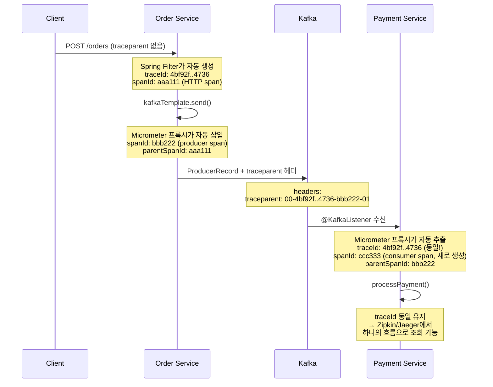
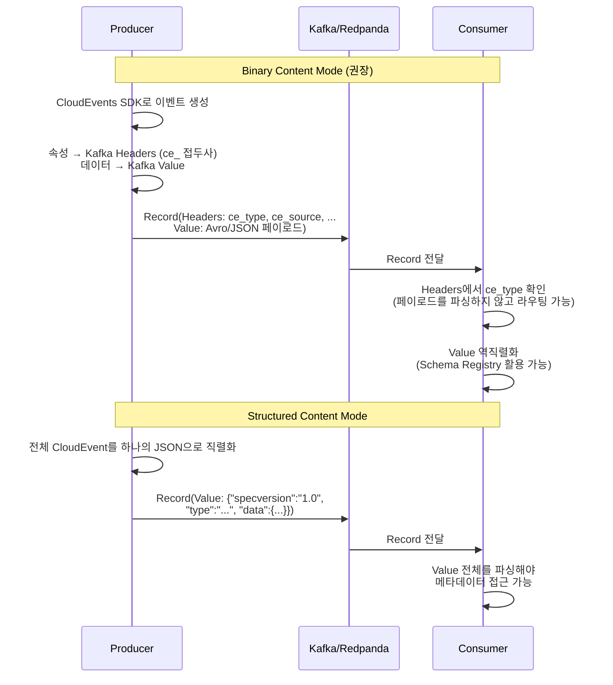

# Event Envelope

---

> Event Envelope은 이벤트를 메타데이터(헤더) + 페이로드의 2개 층으로 감싸는 패턴입니다. 편지(Letter)를 봉투(Envelope)에 넣는것과 동일한 개념입니다.

```json
메시지 구조
├── 엔벨로프 (Envelope / Metadata)
│   ├── 이벤트 ID          (이 메시지를 고유하게 식별)
│   ├── 이벤트 타입         (무슨 일이 발생했는가)
│   ├── 소스              (어디서 발생했는가)
│   ├── 발생 시각           (언제 발생했는가)
│   ├── 스키마 참조         (페이로드 구조를 어디서 확인하는가)
│   └── 상관관계 ID         (관련된 다른 메시지와의 연결)
└── 페이로드 (Payload / Data)
    └── 비즈니스 데이터      (주문 정보, 결제 정보 등)
```

- Envelope은 메시지를 라우팅하고 추적하는 데 필요한 메타데이터 입니다.
- 미들웨어와 인프라 도구가 페이로드를 열어보지 않고도 메시지를 처리할 수 있게 해주며, 페이로드는 비즈니스 데이터 그 자체이며, Producer/Consumer간의 계약입니다.

## API 설계와 비교

REST API에서는 OpenAPI(Swagger)로 API 규격을 정의하는 것처럼 비동기 메시징 또한 표준이 있습니다.

| **REST API 세계**      | **비동기 메시징 세계**        | **역할**        |
| ---------------------- | ----------------------------- | --------------- |
| HTTP 요청/응답         | 메시지 (이벤트/커맨드)        | 통신 단위       |
| OpenAPI (Swagger)      | **AsyncAPI**                  | API 명세 표준   |
| HTTP 헤더              | **CloudEvents** 속성          | 엔벨로프 표준   |
| JSON Schema / Protobuf | Avro / Protobuf / JSON Schema | 페이로드 스키마 |
| Swagger UI             | AsyncAPI Studio               | 문서 자동화     |
| Swagger Codegen        | AsyncAPI Generator            | 코드 자동 생성  |

- 핵심 차이점은 REST API는 동기이며 요청 응답이 명확한 반면, 메시징은 비동기이고 Producer와 Consumer가 서로를 모른다는 점입니다.

# CloudEvents

---

> CloudEvents는 CNCF가 정의한 이벤트 메타데이터 표준입니다. 벤더 종속성 없이 이벤트 메타데이터를 표현하기 위한 공통 언어를 제공하는 것이 목표입니다.

CloudEvent는 이벤트 메타데이터의 HTTP 헤더 표준이라고 생각하면 좋습니다. 

**도입 효과**:

- **상호운용성**: 서로 다른 팀, 서로 다른 언어, 서로 다른 미들웨어가 같은 메타데이터 형식을 사용
- **도구 생태계**: CloudEvents를 이해하는 모니터링, 트레이싱, 라우팅 도구 활용 가능
- **SDK 지원**: Java, Go, Python, JavaScript, C#, Ruby, Rust 등 공식 SDK 제공
- **벤더 중립**: CNCF Graduated 프로젝트로, 특정 벤더에 종속되지 않음

**도입하지 않아도 되는 경우**:

- 단일 팀이 단일 미들웨어로 소수의 이벤트만 처리하는 경우
- 이미 팀 내부 표준이 확립되어 있고 외부 시스템과 연동이 없는 경우

## CloudEvents 표준

```json
{
  "specversion": "1.0",
  "id": "evt-20260211-001",
  "source": "/orders/order-service",
  "type": "com.example.order.created",
  "time": "2026-02-11T09:30:00Z",
  "datacontenttype": "application/json",
  "dataschema": "<https://schema.example.com/order/v1>",
  "subject": "order-12345",
  
  // payload
  "data": {
    "orderId": "order-12345",
    "customerId": "cust-789",
    "amount": 45000,
    "currency": "KRW"
  }
}
```

**필수 속성**

| **속성**      | **타입**      | **설명**                                             | **예시**                      |
| ------------- | ------------- | ---------------------------------------------------- | ----------------------------- |
| `id`          | String        | 이벤트 고유 식별자. `source + id` 조합이 유일해야 함 | `"A234-1234-1234"`            |
| `source`      | URI-reference | 이벤트가 발생한 컨텍스트 식별                        | `"/orders/order-service"`     |
| `specversion` | String        | CloudEvents 스펙 버전                                | `"1.0"`                       |
| `type`        | String        | 이벤트 타입. 라우팅과 정책 적용에 사용               | `"com.example.order.created"` |

**선택 속성**

| **속성**          | **타입**             | **설명**                        | **예시**                                  |
| ----------------- | -------------------- | ------------------------------- | ----------------------------------------- |
| `datacontenttype` | String (RFC 2046)    | 페이로드의 미디어 타입          | `"application/json"`                      |
| `dataschema`      | URI                  | 페이로드가 따르는 스키마 위치   | `"<https://schema.example.com/order/v1>"` |
| `subject`         | String               | 이벤트 주체(구독 필터링에 활용) | `"order-12345"`                           |
| `time`            | Timestamp (RFC 3339) | 이벤트 발생 시각                | `"2026-02-11T09:30:00Z"`                  |

## 메타데이터 위치 선택(Kafka 헤더 vs Avro 페이로드)

### Kafka Record Headers만 사용

메타데이터 전부를 Kafka 헤더에 넣고, Avro 페이로드에는 순수 비즈니스 로직만 담습니다.

```java
// 헤더: ce-type, ce-source, ce-id, trace-id
record.headers()
    .add("ce-type", "com.example.order.created".getBytes(UTF_8))
    .add("ce-source", "/order-service".getBytes(UTF_8));

// Avro 페이로드: OrderCreated — orderId, customerId, totalAmount만 포함
```

프로듀서마다 수동으로 헤더를 추가하면 누락이 발생합니다. 자동 부착 방법은 크게 2가지가 있습니다.

| 방법                | Spring DI | 코드 변경   | 적합한 경우                |
| ------------------- | --------- | ----------- | -------------------------- |
| ProducerInterceptor | 불가      | 설정만      | 정적 헤더 (서비스명, 환경) |
| KafkaTemplate 래퍼  | 가능      | 래퍼 클래스 | 동적 헤더 (조건부 로직)    |

1. **KafkaTemplate Wrapper bean(권장)**

   스프링에서 가장 권장되는 방법이며, KafkaTemplate를 감싸는 전용 빈을 만들어 모든 발행에 공통 헤더를 부착합니다. Spring DI를 자유롭게 활용할 수 있고, 테스트에서 목킹이 쉽습니다.

   ```java
   @Component
   @RequiredArgsConstructor
   public class EnvelopedKafkaTemplate<V> {
   
       private final KafkaTemplate<String, V> delegate;
   
       @Value("${spring.application.name}")
       private String serviceName;
   
       public CompletableFuture<SendResult<String, V>> send(String topic, String key, V value) {
           return send(topic, key, value, null);
       }
   
       public CompletableFuture<SendResult<String, V>> send(
               String topic, String key, V value, @Nullable String eventType) {
   
           ProducerRecord<String, V> record = new ProducerRecord<>(topic, key, value);
           Headers headers = record.headers();
   
           // 공통 헤더 자동 부착
           headers.add("ce-id", UUID.randomUUID().toString().getBytes(UTF_8));
           headers.add("ce-source", serviceName.getBytes(UTF_8));
           headers.add("ce-time", Instant.now().toString().getBytes(UTF_8));
   
           // 이벤트별 헤더 (호출자가 지정)
           if (eventType != null) {
               headers.add("ce-type", eventType.getBytes(UTF_8));
           }
   
           // 분산 추적: MDC에서 trace-id 전파
           String traceId = MDC.get("traceId");
           if (traceId != null) {
               headers.add("trace-id", traceId.getBytes(UTF_8));
           }
   
           return delegate.send(record);
       }
   }
   ```

   ```java
   // 사용측: 래퍼만 주입받아 사용
   @Service
   @RequiredArgsConstructor
   public class OrderProducer {
   
       private final EnvelopedKafkaTemplate<OrderCreated> kafkaTemplate;
   
       public void publish(OrderCreated event) {
           kafkaTemplate.send(
               "orders",
               event.getOrderId(),
               event,
               "com.example.order.created"  // ce-type만 이벤트별로 지정
           );
           // ce-id, ce-source, ce-time, trace-id는 자동 부착
       }
   }
   ```

2. **KafkaTemplate.setProducerInterceptor()**

   KafkaTemplate에 직접 ProducerInterceptor를 설정할 수 있습니다. 

   ```java
   @Configuration
   public class KafkaProducerConfig {
   
       @Bean
       public KafkaTemplate<String, Object> kafkaTemplate(
               ProducerFactory<String, Object> pf,
               CommonHeaderInterceptor interceptor) {
   
           KafkaTemplate<String, Object> template = new KafkaTemplate<>(pf);
           template.setProducerInterceptor(interceptor);  // Spring 빈으로 등록된 인터셉터
           return template;
       }
   }
   ```

   ```java
   @Component
   public class CommonHeaderInterceptor implements ProducerInterceptor<String, Object> {
   
       @Value("${spring.application.name}")
       private String serviceName;
   
       /**
        * 메시지가 브로커로 전송되기 직전에 호출된다.
        * ProducerRecord를 수정하거나 새로 만들어 반환할 수 있다.
        * 여기서 공통 헤더를 부착한다.
        */
       @Override
       public ProducerRecord<String, Object> onSend(ProducerRecord<String, Object> record) {
           Headers headers = record.headers();
           addIfAbsent(headers, "ce-source", serviceName);
           addIfAbsent(headers, "ce-id", UUID.randomUUID().toString());
           addIfAbsent(headers, "ce-time", Instant.now().toString());
   
           String traceId = MDC.get("traceId");
           if (traceId != null) {
               addIfAbsent(headers, "trace-id", traceId);
           }
           return record;
       }
   
       /** 이미 같은 키가 있으면 덮어쓰지 않는다. Producer가 명시 설정한 헤더가 우선. */
       private void addIfAbsent(Headers headers, String key, String value) {
           if (headers.lastHeader(key) == null) {
               headers.add(key, value.getBytes(StandardCharsets.UTF_8));
           }
       }
   
       /**
        * 브로커가 ack를 반환하거나 전송이 실패했을 때 호출된다.
        * 전송 결과 메트릭 수집 등에 사용할 수 있다.
        */
       @Override public void onAcknowledgement(RecordMetadata m, Exception e) {}
   
       /**
        * Producer가 close()될 때 호출된다.
        * 인터셉터가 보유한 리소스를 정리하는 용도.
        */
       @Override public void close() {}
   
       /**
        * interceptor.classes로 등록 시 Kafka가 호출하는 초기화 메서드.
        * Producer 설정값(Map)을 받는다.
        * setProducerInterceptor()로 등록하면 Spring DI가 대신하므로 비워둬도 된다.
        */
       @Override public void configure(Map<String, ?> configs) {}
   }
   ```

   - MDC(Mapped Diagnostic Context)는 SLF4J/Logback이 제공하는 스레드 로컬 키-값 저장소 입니다. 

### Avro 스키마에 Envelope 필드 포함

메타데이터를 Avro 스키마 자체에 포함시키는 방식입니다. Schema Registry가 메타데이터 필드까지 관리하므로 타입 안전성이 보장되고, 스키마 진화도 적용된다. 하지만 라우터가 메타데이터를 읽기 위해서는 Avro 역직렬화가 필수적으로 요구됩니다.

```json
{
  "type": "record",
  "name": "OrderEnvelope",
  "fields": [
    {"name": "eventId",   "type": "string"},
    {"name": "eventType", "type": "string"},
    {"name": "source",    "type": "string"},
    {"name": "timestamp", "type": {"type": "long", "logicalType": "timestamp-millis"}},
    {"name": "payload",   "type": "OrderCreated"}
  ]
}
```

### 하이브리드(실무 표준)

대부분의 실무 환경에서 채택하는 방식입니다. 라우팅/인프라 메타데이터는 Kafka 헤더에, 비즈니스 메타데이터는 Avro 페이로드에 분리합니다.

```bash
Kafka Record
├── Headers (라우팅/인프라 — 역직렬화 없이 접근 가능)
│   ├── ce-type: "com.example.order.created"     ← 라우터가 사용
│   ├── ce-source: "/order-service"              ← 모니터링이 사용
│   ├── ce-id: "550e8400-e29b-..."               ← 멱등성 검사
│   └── trace-id: "abc-def-ghi"                  ← 분산 추적
│
└── Value (Avro — Schema Registry 관리, 타입 안전)
    ├── orderId: "ORD-9001"
    ├── customerId: "CUST-123"
    ├── totalAmount: 49900
    └── createdAt: 1705312800000
```

Kafka는 메시지마다 헤더를 첨부할 수 있습니다. CloudEvents 메타데이터를 헤더에 넣으면 페이로드와 분리하여 검사할 수 있습니다.

```java
// Producer: CloudEvents 헤더 추가
ProducerRecord<String, OrderCreated> record = new ProducerRecord<>(
    "orders", orderId, orderCreatedEvent
);

record.headers()
    .add("ce-specversion", "1.0".getBytes())
    .add("ce-type", "com.example.order.created".getBytes())
    .add("ce-source", "https://order-service/orders".getBytes())
    .add("ce-id", UUID.randomUUID().toString().getBytes())
    .add("ce-time", Instant.now().toString().getBytes());

producer.send(record);
```

```java
// Consumer: 헤더만 검사하여 처리 여부 결정
ConsumerRecord<String, byte[]> record = ...; // 역직렬화 전

String eventType = new String(
    record.headers().lastHeader("ce-type").value()
);

if ("com.example.order.created".equals(eventType)) {
    // 페이로드를 이제 역직렬화하여 처리
    OrderCreated event = deserialize(record.value());
    processOrder(event);
} else {
    // 관심 없는 이벤트 타입은 역직렬화 비용 없이 스킵
    log.debug("Skipping event type: {}", eventType);
}
```

## Micrometer Tracing(모니터링 - 제로코드)

Spring Boot 3.x 및 Micrometer Tracing 의존성만 추가하면 traceId와 spanId가 모든 Kafka 메시지 헤더에 자동 주입됩니다.

```groovy
// build.gradle
implementation 'io.micrometer:micrometer-tracing-bridge-brave'
implementation 'org.springframework.kafka:spring-kafka'  // 자동 계측 포함
```

- Spring Boot 자동설정이 KafkaTemplate와 @KafkaListener에 Tracing 프록시를 감싼다. 
- Producer가 send()를 호출하면 프록시가 traceId/spanId를 추출하여 traceparent에 넣는다.
- Consumer에서는 @KafkaListener 진입 시 traceparent 헤더를 읽어 같은 trace context를 복원한다.



## Kafka/Redpanda Protocol Binding

> 앞 섹션에서는 일반적 관례인 `ce-` 접두사(하이픈)를 사용했지만, 공식 Kafka 바인딩 스펙에서는 `ce_` 접두사(언더스코어)를 사용합니다. Kafka 헤더 키에 하이픈이 허용되긴 하지만, CloudEvents Kafka Protocol Binding 명세는 `ce_`를 표준으로 정의합니다.

CloudEvents를 Kafka에서 전송할 때 2가지 모드가 있습니다.

### Binary Content Mode(권장)

CloudEvents 속성을 Kafka 헤더에, 페이로드를 Kafka 메시지 value에 배치합니다. 속성명 앞에 ce_ 접두사를 붙입니다.

```json
Kafka Record
├── Headers
│   ├── ce_specversion: "1.0"
│   ├── ce_id: "evt-20260211-001"
│   ├── ce_source: "/orders/order-service"
│   ├── ce_type: "com.example.order.created"
│   ├── ce_time: "2026-02-11T09:30:00Z"
│   └── content-type: "application/json"
└── Value
    └── {"orderId": "order-12345", "amount": 45000, ...}
```

### Structured Content Mode

전체 CloudEvent(속성 + 데이터)를 하나의 JSON으로 직렬화하여 Kafka 메시지 value에 배치합니다.

- Content-Type 헤더가 application/cloudevents+json으로 설정됩니다.
- 수신 측은 content-type 헤더를 보고 모드를 판별하며, application/cloudevents로 시작하면 Structured, 아니면 Binary입니다.


Binary를 권장하는 이유는 Kafka 도구가 메시지 value를 그대로 처리할 수 있고, 엔벨로프 오버헤드가 value에 포함되지 않아 페이로드 크기가 더 작습니다. 또한 Schema Registry와의 통합이 자연스럽습니다.




---

> **TPS 적용 사례** — `okestro/tps-gitlab2`
>
> - **모듈/위치**: `message-lib/src/main/java/org/okestro/tps/messaging/application/outbox/EventPublisher.java`, `tracing/CorrelationIdRecordInterceptor.java`
> - **요점**: `EventPublisher.publish(aggregateId, SpecificRecord, topic)` 시그니처가 envelope 직렬화 책임을 캡슐화한다. correlation ID·trace 헤더는 `CorrelationIdRecordInterceptor`가 발행 직전에 자동 부착해 envelope 메타데이터를 일관되게 채운다.
> - **상세**: [`spring/01-01.CloudEventsHeaderInterceptor`](spring/01-01.CloudEventsHeaderInterceptor.md), [`spring/01-06.trace-id와 traceparent`](spring/01-06.trace-id와%20traceparent.md).
