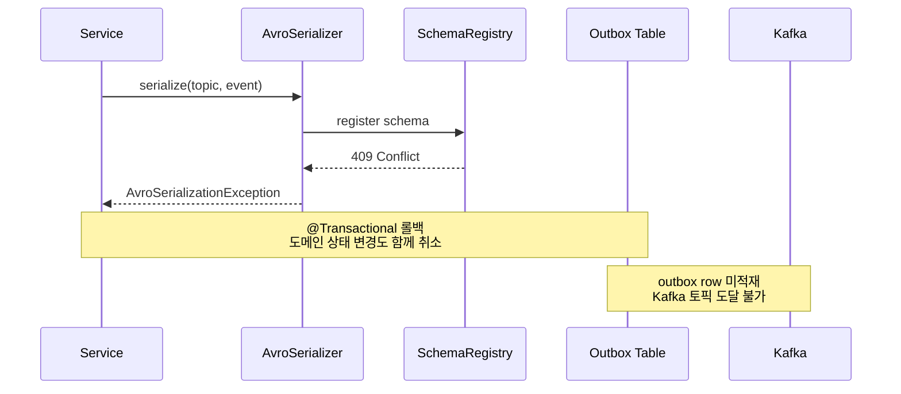

# Avro 직렬화 예외처리 전략

---

> Avro 정합성이 깨지면 어디서 터지고, 트랜잭션과 어떻게 얽히며, 재시도해야 하는지 안 해야 하는지를 정리한다. 핵심은 *Producer 측은 동기 롤백, Consumer 측은 즉시 DLQ*라는 비대칭 전략이다.

Avro는 스키마가 강제되는 포맷이므로 정합성 위반은 반드시 예외로 드러난다. 문제는 *어느 시점에, 누구에게* 드러나느냐다. Producer가 먼저 알게 만들지 Consumer까지 흘려보낼지에 따라 장애 영향 범위가 달라지므로, 직렬화/역직렬화 양쪽에서 예외처리 전략을 분리해서 세운다.


## 학습 목표

> Avro 직렬화/역직렬화 예외를 *어느 시점에 어떤 트랜잭션 경계에서 처리할지*로 이해한다.

이 장을 다 읽고 다음 다섯 가지에 자신 있게 답할 수 있으면 학습이 완료된다.

1. Producer 측 직렬화 실패와 Consumer 측 역직렬화 실패가 왜 정반대 처리 전략을 요구하는지 설명할 수 있다.
2. Outbox 패턴이 직렬화 실패와 결합되어 부분 실패 상태를 어떻게 차단하는지 설명할 수 있다.
3. `addNotRetryableExceptions`로 즉시 DLQ 격리를 만드는 이유를 설명할 수 있다.
4. `ErrorHandlingDeserializer` 위임 패턴이 무엇을 추가로 보호하는지 설명할 수 있다.
5. 단일 DLT, 토픽별 DLT, Retry Topic 패턴 중 어느 쪽을 골라야 하는지 판단 기준을 말할 수 있다.


## 1. 정합성이 깨지는 두 시점

> 직렬화는 Producer가 메시지를 만드는 순간, 역직렬화는 Consumer가 메시지를 읽는 순간에 일어난다. 같은 "스키마 불일치"라도 두 시점이 요구하는 처리 방식은 정반대다.

직렬화 단계에서는 `KafkaAvroSerializer`가 Schema Registry에 스키마를 등록하면서 호환성 체크를 받는다. 호환성 모드(BACKWARD, FORWARD, FULL)에 위배되면 Registry가 HTTP 409 Conflict로 등록을 거절하고, 그 결과 직렬화 자체가 실패한다. 같은 자리에서 네트워크 단절, 인증 실패, 직렬화 가능한 타입이 아닌 경우(`SpecificRecord` 미상속) 같은 다른 원인도 함께 터질 수 있다.

역직렬화 단계는 정반대다. Producer가 보낸 바이트의 첫 5바이트(magic byte + Schema ID)로 Registry에서 Writer 스키마를 받아오는데, 이 스키마와 Reader 스키마가 호환되지 않으면 `KafkaAvroDeserializer`가 예외를 던진다. 이미 토픽에 적재된 메시지이므로 "다시 보내달라"는 선택지가 없다.

이 비대칭이 전략을 가른다. Producer는 *발행 자체를 막아* 잘못된 메시지가 토픽에 들어가지 않게 해야 하고, Consumer는 *재시도해도 결과가 같은* 실패이므로 즉시 격리해야 한다.


## 2. Producer 측: 직렬화 실패는 동기 롤백

> Producer 경로에서 직렬화 예외는 `RuntimeException`으로 래핑되어 호출 트랜잭션 전체를 롤백시킨다. outbox 테이블에 row가 적재되기 전에 차단되므로, 잘못된 메시지가 Kafka로 흘러갈 가능성이 0이 된다.

### 2.1 래퍼 클래스 한 겹

직렬화 호출은 한 곳으로 좁혀 둔다. 모든 발행 경로가 이 클래스를 거치도록 강제하면, 예외 정책을 한 곳에서 바꿀 수 있다.

```java
// AvroSerializer.java
public class AvroSerializer {
    private final KafkaAvroSerializer serializer;

    public byte[] serialize(String topic, SpecificRecord record) {
        try {
            return serializer.serialize(topic, record);
        } catch (Exception e) {
            throw new AvroSerializationException(
                    "Failed to serialize Avro record: " + record.getClass().getSimpleName()
                    , e
            );
        }
    }
}
```

`AvroSerializationException`은 `RuntimeException`을 상속한다. 이 선택은 의도적이다. checked exception으로 만들면 호출하는 모든 Service가 `throws`를 달거나 try/catch로 감싸야 하는데, 직렬화 실패는 *비즈니스 로직이 처리할 수 있는 예외가 아니므로* 그렇게 흩뿌릴 이유가 없다. unchecked로 두면 호출자는 트랜잭션 롤백만 책임지면 된다.

### 2.2 outbox와 트랜잭션 경계

발행 경로는 outbox 패턴을 통과한다. Service 메서드 안에서 도메인 상태 변경과 이벤트 적재가 같은 트랜잭션에 들어가고, Kafka로의 실제 발행은 비동기 폴러가 담당한다.

```java
// JobResultPublish.java — 도메인 → outbox 어댑터
public void publishResult(ExecutionJob job, JobResultEventType eventType, ...) {
    String topic = Topics.EXECUTOR_EVT_JOB_RESULT.getValue();
    JobResultEventAvro event = jobResultMapper.toEvent(job, eventType, failReason);

    eventPublisher.publish(
            job.getJobExcnId()
            , eventType.name()
            , event
            , topic
            , correlationId
    );
}

// EventPublisher.java — 직렬화 후 outbox row 적재
public void publish(..., SpecificRecord record, ...) {
    byte[] payload = avroSerializer.serialize(topic, record);  // ← 여기서 터짐
    // 아래 줄은 예외 시 실행되지 않음
    OutboxEvent event = OutboxEvent.of(aggregateId, eventType, payload, ...);
    outboxEventRepository.save(event);
}
```

직렬화가 실패하면 `outboxEventRepository.save()`는 호출조차 되지 않는다. 호출자 Service에 붙은 `@Transactional`이 예외를 감지해 도메인 상태 변경(예: job 상태를 SUCCEEDED로 바꾼 부분)까지 함께 롤백시킨다.

### 2.3 실패 시 시스템에 남는 흔적



흔적은 *애플리케이션 로그와 호출자 응답*에만 남는다. outbox 테이블에는 row가 없고, Kafka 토픽에도 메시지가 없으며, OutboxPoller가 재시도할 대상도 없다. 이것이 outbox 패턴이 직렬화 실패에 대해 가지는 가장 큰 미덕이다 — *부분 실패 상태를 만들지 않는다*.


## 3. Consumer 측: 역직렬화 실패는 즉시 DLQ

> 이미 토픽에 들어간 메시지이므로 재시도해도 같은 결과만 반복한다. 지수 백오프로 시간을 끌 이유가 없으며, 다른 정상 메시지의 처리를 막지 않도록 즉시 격리한다.

### 3.1 재시도 분류 정책

Spring Kafka의 `DefaultErrorHandler`는 두 가지를 결정한다. 어떤 예외에 대해 재시도할지, 재시도가 끝났을 때 어디로 보낼지다. 역직렬화 실패는 "재시도 안 함 + DLQ로 즉시 발행"으로 묶어 둔다.

```java
// KafkaErrorConfig.java
@Bean
public CommonErrorHandler kafkaErrorHandler(KafkaTemplate<String, byte[]> kafkaTemplate) {
    DeadLetterPublishingRecoverer recoverer = new DeadLetterPublishingRecoverer(
            kafkaTemplate,
            (record, ex) -> new TopicPartition(Topics.DLQ.getValue(), 0)
    );

    ExponentialBackOff backOff = new ExponentialBackOff(1000L, 2.0);
    backOff.setMaxElapsedTime(7000L);  // 1s → 2s → 4s, 약 3회

    DefaultErrorHandler errorHandler = new DefaultErrorHandler(recoverer, backOff);

    errorHandler.addNotRetryableExceptions(
            IllegalArgumentException.class
            , AvroSerializationException.class
    );
    return errorHandler;
}
```

`addNotRetryableExceptions`에 등록한 예외는 백오프를 건너뛰고 곧바로 recoverer로 간다. recoverer는 메시지를 `tps.dlq` 토픽으로 발행하고, 컨슈머는 다음 오프셋으로 진행한다. 결과적으로 "역직렬화 실패 메시지 한 건"이 같은 파티션의 *그 뒤 정상 메시지들*을 막지 않는다.

### 3.2 왜 즉시 DLQ인가

재시도가 의미 있으려면 시간이 지나거나 외부 상태가 변하면 결과가 달라질 가능성이 있어야 한다. 네트워크 일시 단절, 데이터베이스 deadlock, 외부 API rate limit 같은 경우다. 반면 역직렬화 실패는 *바이트 그대로 다시 시도해도 결과가 동일*하다. Schema Registry가 일시적으로 응답하지 않는 것이라면 그건 다른 종류의 예외(`RestClientException`)이고, 그건 재시도 대상에 들어간다.

### 3.3 DLQ 이후의 운영

DLQ에 쌓인 메시지는 자동 재처리하지 않는다. 사람이 보고 결정해야 한다. 운영 흐름은 다음과 같다.

1. DLQ 토픽 lag 알람을 임계치 1로 잡는다(한 건만 들어와도 알림).
2. 메시지 헤더에 추가된 `kafka_dlt-original-topic`, `kafka_dlt-exception-fqcn`, `kafka_dlt-exception-message`로 원인을 식별한다.
3. 호환되지 않는 스키마 변경을 되돌릴 수 있으면 Producer 쪽 스키마를 수정하고, 메시지 자체가 폐기 가능하면 그대로 둔다.
4. 재처리가 필요하면 DLQ에서 원본 토픽으로 옮기는 별도 워커를 임시로 돌린다.

### 3.4 ErrorHandlingDeserializer로 한 겹 더 안전하게

여기까지 설명한 흐름은 *역직렬화 예외가 listener까지 전파*되는 것을 전제한다. Spring Kafka는 이보다 한 단계 앞선 안전망을 제공하는데, `ErrorHandlingDeserializer`가 그것이다. listener 진입 *이전에* 역직렬화를 시도하고, 실패하면 raw bytes를 헤더에 담아 listener에게 정상 흐름으로 전달한다.

```yaml
# application.yml
spring:
  kafka:
    consumer:
      key-deserializer: org.springframework.kafka.support.serializer.ErrorHandlingDeserializer
      value-deserializer: org.springframework.kafka.support.serializer.ErrorHandlingDeserializer
    properties:
      spring.deserializer.key.delegate.class: org.apache.kafka.common.serialization.StringDeserializer
      spring.deserializer.value.delegate.class: io.confluent.kafka.serializers.KafkaAvroDeserializer
      schema.registry.url: ${SCHEMA_REGISTRY_URL}
```

위임(delegate) 패턴이다. 실제 역직렬화는 `KafkaAvroDeserializer`가 수행하지만, 그 호출을 `ErrorHandlingDeserializer`가 try/catch로 감싼다. 실패 시 `null` payload + `ErrorHandlingDeserializer.VALUE_DESERIALIZER_EXCEPTION_HEADER` 헤더에 `DeserializationException` 직렬화본을 넣어 listener에 전달한다.

이 한 겹을 두는 이유는 두 가지다. 첫째, *컨슈머 쓰레드가 예외로 죽지 않는다*. 역직렬화 예외가 그대로 던져지면 Spring Kafka의 retry/recover 흐름은 작동하지만, 일부 환경에서 컨슈머 thread가 멈출 수 있다. 둘째, *listener에서 raw bytes에 직접 접근*해 진단 로직을 짤 수 있다 — payload 첫 5바이트의 magic byte와 Schema ID를 직접 확인해 "어느 버전의 Producer가 보낸 것인가"를 즉시 판별할 수 있다.

`DefaultErrorHandler`와의 결합도 자연스럽다. listener가 헤더의 예외를 throw 하지 않으면 정상 메시지로 간주되지만, Spring Kafka는 이 헤더가 있으면 자동으로 예외를 재발생시켜 `DefaultErrorHandler`로 보낸다. 결과적으로 `addNotRetryableExceptions`에 등록된 정책이 그대로 적용되고, 메시지는 즉시 DLQ로 간다.

주의할 점은 *트랜잭션 listener와 함께 쓸 때*다. `@KafkaListener`가 트랜잭션 안에서 실행되면 역직렬화 실패로 인한 DLQ 발행도 같은 트랜잭션에 묶일 수 있는데, 이때 `transactional.id` 격리와 producer fencing이 의도대로 작동하는지 검증해야 한다. 가장 안전한 패턴은 *DLQ 발행 전용 KafkaTemplate을 별도 트랜잭션으로 분리*하는 것이다.

### 3.5 공통 DLT 설계 패턴

DLT(Dead Letter Topic)는 단순히 "실패한 메시지를 모아 두는 곳"이 아니다. *어떤 메시지가 어디서 어떻게 실패했는지*를 진단하고 *재처리 여부를 결정*하는 운영 흔적이 함께 있어야 한다. 설계 패턴은 몇 가지가 있고, 시스템 규모와 도메인 특성에 따라 선택한다.

#### 단일 DLT vs 토픽별 DLT

작은 시스템은 모든 실패 메시지를 하나의 `tps.dlq` 토픽으로 모은다. 알람 룰이 단순해지고 운영자가 한 곳만 보면 된다. 토픽 수가 늘어나면(보통 20개 이상) *원본 토픽별로 DLT를 분리*하는 것이 진단에 유리하다 — `orders.evt`의 DLT는 `orders.evt.dlt`처럼 같은 prefix를 유지하면 자연스럽게 페어링된다.

분리 여부는 한 가지 기준으로 결정된다. *실패가 발생했을 때 원본 토픽 단위로 운영 대응이 다른가*. 결제 토픽 실패는 즉시 알람, 분석 토픽 실패는 일일 배치로 본다면 분리가 옳다.

#### Retry Topic 패턴

Spring Kafka의 `@RetryableTopic` 어노테이션은 백오프 단계마다 별도 토픽을 만드는 패턴이다. `orders.evt.retry-5s`, `orders.evt.retry-30s`, `orders.evt.retry-5m`처럼 단계별 토픽으로 메시지를 옮기고 마지막에 `orders.evt.dlt`로 보낸다.

이 패턴의 장점은 *재시도 중인 메시지가 원본 토픽의 처리를 막지 않는다*는 점이다. 컨슈머는 원본 토픽에서 즉시 다음 메시지로 진행하고, 실패 메시지는 retry 토픽에서 백오프 시간만큼 대기 후 다른 컨슈머가 재시도한다. 트래픽이 많은 토픽에서 head-of-line blocking을 피하는 데 유용하다.

단점은 *토픽 수가 4~5배로 증가*하고, 같은 메시지가 여러 토픽을 거치는 동안 *순서 보장이 깨진다*는 점이다. 순서가 중요한 도메인(예: 결제 상태 변경)에서는 retry topic을 쓰지 않고, 즉시 DLT 격리 + 수동 재처리를 택한다.

#### 표준 DLT 헤더로 진단

Spring Kafka의 `DeadLetterPublishingRecoverer`는 다음 헤더를 자동으로 붙인다.

| 헤더 | 의미 |
|------|------|
| `kafka_dlt-original-topic` | 원본 토픽 이름 |
| `kafka_dlt-original-partition` | 원본 파티션 번호 |
| `kafka_dlt-original-offset` | 원본 오프셋 (재처리 시 멱등성 키로 사용 가능) |
| `kafka_dlt-original-timestamp` | 원본 메시지 타임스탬프 |
| `kafka_dlt-exception-fqcn` | 발생 예외 클래스 (FQCN) |
| `kafka_dlt-exception-message` | 예외 메시지 |
| `kafka_dlt-exception-stacktrace` | 스택트레이스 |

가장 유용한 것은 `kafka_dlt-exception-fqcn`이다. 이 값 하나로 *역직렬화 실패 / 도메인 예외 / 외부 API 실패*를 구분할 수 있다. 알람 라벨로 그대로 쓰면 실패 원인별 통계가 자동으로 잡힌다.

#### traceparent 보존

DLT 발행 시 *분산 추적 컨텍스트가 끊기지 않도록* 원본 메시지의 `traceparent` 헤더를 그대로 복사한다. `DeadLetterPublishingRecoverer`는 기본적으로 메시지 헤더 전체를 복사하므로, OpenTelemetry로 추적하는 환경이라면 *DLT 메시지를 클릭하면 원본 발행 시점부터의 trace*를 그대로 따라갈 수 있다. 이 한 가지가 운영 트러블슈팅 시간을 가장 크게 줄여준다.

#### Replay 워커 설계

DLT 메시지를 다시 원본 토픽으로 흘려보내는 워커는 *반드시 별도 애플리케이션으로 분리*한다. 메인 컨슈머에 섞으면 무한 루프 위험이 있다 — 원본에서 또 실패해서 DLT로, 다시 replay로 들어가는 식이다.

워커 구현 시 의사결정은 세 갈래다.

1. **그대로 복원**: 원인이 일시적이었을 때(예: 외부 API 다운). `kafka_dlt-original-topic`으로 그대로 발행.
2. **변환 후 복원**: 스키마가 수정되어 옛 메시지를 새 형식으로 바꿔야 할 때. 변환 로직 + dry-run 모드 필수.
3. **폐기**: 비즈니스 검토 결과 재처리 불필요. DLT에서 명시적으로 archived 토픽으로 옮겨 흔적만 남김.

#### 보존 정책과 알람

DLT 토픽은 원본보다 *보존 기간을 길게* 둔다. 원본이 7일이라도 DLT는 30~90일이 일반적이다. 장애 분석은 며칠 후에야 시작되는 경우가 많기 때문이다.

알람은 *건수 기준 + 즉시*가 정답이다. lag 기반은 부적절하다 — 컨슈머가 DLT를 읽지 않으면 lag이 영원히 쌓이는데, 그게 정상 상태다. 발행 메트릭(`kafka_dlt_messages_total`)에 임계치 1을 잡고 한 건이라도 들어오면 즉시 알림이 가게 한다.


## 4. 두 전략을 한 표로

| 시점 | 위치 | 예외 | 트랜잭션 | 재시도 | 최종 처리 |
|------|------|------|----------|--------|-----------|
| 직렬화 실패 (Producer) | `AvroSerializer.serialize()` | `AvroSerializationException` | Service `@Transactional` 롤백 | 없음 — outbox에 적재되지 않음 | 호출자에 동기 전파, 사용자/상위 시스템이 결정 |
| 역직렬화 실패 (Consumer) | Spring Kafka listener | `AvroSerializationException` 또는 라이브러리 예외 | 컨슈머 트랜잭션은 정상 커밋(오프셋 진행) | 없음 — `addNotRetryableExceptions` | `tps.dlq` 토픽으로 격리, 운영자 수동 처리 |

표로 보면 같은 예외 타입이라도 *역할이 정반대*임이 드러난다. Producer 측에서는 "발행 차단" 신호이고, Consumer 측에서는 "이 메시지 격리" 신호다. 한 개의 예외 클래스로 양쪽을 표현하는 이유는 *언제든 양쪽에서 같은 진단 도구로 추적 가능*하게 하기 위함이다.


## 5. 왜 outbox와 결합해야 하는가

> 직렬화 실패를 동기 롤백으로 처리하려면, 발행 자체가 도메인 트랜잭션에 묶여 있어야 한다. outbox 패턴은 그 묶음을 만들어 주는 구조이고, Avro의 엄격함과 가장 잘 맞물린다.

outbox 없이 KafkaTemplate을 직접 호출하면 직렬화 실패 시점에 도메인 상태는 이미 커밋되어 있을 수도 있다. 그 상태로 메시지가 안 나가면 *데이터는 바뀌었는데 다른 시스템은 모르는 상태*가 만들어진다. 흔히 말하는 dual-write 문제다.

outbox에 byte[] payload를 적재하는 시점이 직렬화 시점과 같다는 점이 결정적이다. 직렬화가 실패하면 outbox 적재도 실패하고, outbox 적재가 실패하면 도메인 상태 변경도 같이 롤백된다. *세 가지가 한 트랜잭션에 묶여 있어 부분 실패가 불가능*하다.

OutboxPoller가 나중에 Kafka로 보낼 때는 이미 직렬화된 byte[]를 그대로 발행하므로 다시 직렬화하지 않는다. 즉 *발행 시점에 새로운 직렬화 실패가 일어날 자리가 없다*. 폴러 단계에서 발생할 수 있는 실패는 Kafka 브로커 장애, 네트워크 단절 같은 다른 종류이고, 이 경우는 OutboxPoller 자체의 재시도/DEAD 마킹 정책으로 처리한다.


## 6. 실무 체크리스트

스키마 변경을 머지하기 전에 다음을 확인한다.

1. Schema Registry의 호환성 모드가 토픽 특성에 맞는지 점검한다 — 새 필드 추가 위주면 BACKWARD, 기존 필드 의미 변경이 잦으면 FULL을 고려한다.
2. 변경한 .avsc를 로컬 Registry에 등록해 보고 409 Conflict가 안 나는지 확인한다 — CI에 같은 검사를 자동화로 넣어 둔다.
3. Producer/Consumer 양쪽 모두 새 Avro 클래스를 다시 생성·빌드한 뒤에야 배포한다 — Producer만 먼저 배포하면 BACKWARD 호환이어도 Consumer가 모르는 필드 인덱스를 만나 실패할 수 있다.
4. 배포 직후 DLQ lag을 확인한다 — 0이어야 정상이며, 1건이라도 쌓이면 헤더의 원인 정보부터 본다.

운영 중에 자주 마주치는 함정도 정리해 둔다.

- **`auto.register.schemas: true`의 양면성**: 개발 편의성은 높지만, 운영에서는 잘못된 변경이 자동 등록되어 호환성을 깨뜨릴 수 있다. 운영 환경에서는 `false`로 두고 CI 파이프라인에서만 등록하는 패턴이 안전하다.
- **`RecordNameStrategy` 선택의 영향**: subject 이름이 토픽이 아닌 레코드 이름으로 결정되므로, 한 토픽에 여러 이벤트 타입을 섞을 때 충돌이 줄어든다. 반대로 같은 레코드를 여러 토픽에서 쓰면 한 곳의 스키마 변경이 다른 토픽에도 영향을 준다.
- **`SpecificRecord` 빌드 산출물 캐싱**: Avro 클래스가 stale 상태인 채로 배포되면 직렬화는 성공해도 의미가 어긋난다. 빌드 산출물에 스키마 해시를 포함시키거나, 매 빌드마다 클래스 재생성을 강제하는 것이 안전하다.


## 7. 정리

Producer 측은 *직렬화 실패를 트랜잭션 롤백으로 동기 차단*해 잘못된 메시지가 토픽에 들어가지 않게 한다. Consumer 측은 *역직렬화 실패를 즉시 DLQ로 격리*해 정상 메시지의 처리를 막지 않게 한다. 두 전략 모두 "재시도해도 결과가 같다"는 판단을 공유하지만, 결과가 *동기 응답으로 드러나느냐 / 비동기로 격리되느냐*가 다를 뿐이다.

이 비대칭이 가능한 이유는 Avro의 엄격함과 outbox 패턴의 트랜잭션 묶음, Spring Kafka의 `addNotRetryableExceptions`라는 세 도구가 같은 방향으로 정렬되기 때문이다. 도구 한 가지만 빠져도 부분 실패 상태가 새어 나온다 — outbox가 없으면 dual-write, not-retryable 분류가 없으면 DLQ가 늦거나 정상 처리가 막히고, 직렬화 래퍼가 없으면 예외 정책을 한 곳에서 바꿀 수 없다.


## 8. 면접 대비 Q&A

> 면접에서 자주 나오는 형태로 5개. 답을 보지 않고 먼저 입으로 답해 본 뒤 비교한다.

### Q1. Producer 직렬화 실패와 Consumer 역직렬화 실패를 왜 다르게 처리하는가?

Producer 측은 *발행 자체를 막을 수 있는 시점*이고, Consumer 측은 *이미 토픽에 적재된 메시지를 만나는 시점*이다. 전자는 동기 롤백으로 outbox 적재까지 같이 막아서 잘못된 메시지가 토픽에 들어가지 않게 한다. 후자는 재시도해도 결과가 같으므로 즉시 DLQ로 격리해 같은 파티션의 정상 메시지가 막히는 head-of-line blocking을 피한다. 같은 `AvroSerializationException`이라도 "발행 차단 신호"와 "메시지 격리 신호"로 의미가 갈린다.

### Q2. Outbox 없이 KafkaTemplate을 직접 호출하면 무엇이 문제인가?

직렬화 실패 시 도메인 상태가 이미 커밋된 채로 메시지만 안 나가는 dual-write 상태가 만들어진다. outbox는 *직렬화·outbox 적재·도메인 상태 변경*을 한 트랜잭션에 묶어 이 부분 실패를 차단한다. 폴러가 Kafka로 보낼 때는 이미 직렬화된 byte[]를 그대로 쓰므로 발행 시점에 새 직렬화 실패가 일어날 자리가 없고, 폴러 단계의 실패는 브로커 장애·네트워크 단절 같은 다른 종류만 남는다.

### Q3. `addNotRetryableExceptions`에 등록할 후보를 어떻게 고르나?

기준은 "재시도해도 결과가 달라질 가능성이 있는가"다. `AvroSerializationException`, `IllegalArgumentException` 같은 *형식·계약 위반*은 시간이 지나도 같은 결과라서 등록한다. `RestClientException`(Schema Registry 일시 응답 없음), `KafkaException`(브로커 일시 단절), DB deadlock은 *시간이 지나면 회복 가능*하므로 등록하지 않고 백오프 재시도로 둔다. 잘못 등록하면 실제로는 회복 가능한 실패까지 DLQ로 쏟아 운영자가 수동 재처리해야 한다.

### Q4. `ErrorHandlingDeserializer`가 추가로 보호하는 것은?

세 가지다. 첫째, 역직렬화 예외가 listener 진입 *이전에* 잡혀 컨슈머 스레드가 죽지 않는다. 둘째, 실패 시 raw bytes를 헤더에 담아 listener가 정상 흐름으로 받게 해서 진단 로직을 짤 수 있다(예: magic byte 검증). 셋째, Spring Kafka가 헤더의 예외를 자동 재발생시켜 `DefaultErrorHandler`로 흘리므로, 기존의 `addNotRetryableExceptions` 정책이 그대로 적용된다. 결과적으로 정책 변경 없이 안전망만 추가된다.

### Q5. 단일 DLT, 토픽별 DLT, Retry Topic 중 무엇을 골라야 하나?

토픽 수가 20개 미만이고 운영 대응이 동일하면 단일 DLT가 단순해서 좋다. 토픽 수가 많거나 도메인별로 알람·SLA가 다르면 토픽별 DLT(`<원본>.dlt`)로 분리한다. Retry Topic 패턴은 head-of-line blocking을 피해야 하는 *고트래픽 토픽*에서만 가치가 있고, 토픽 수가 4~5배로 늘고 순서 보장이 깨지는 비용을 감수해야 한다. 결제 같이 순서가 중요한 도메인에서는 Retry Topic을 쓰지 않고 즉시 DLT + 수동 재처리를 택한다.


## 9. 관련 문서

- [02-02.Schema Registry](02-02.Schema%20Registry.md) — 호환성 모드와 409 Conflict의 의미
- [02-03.Avro](02-03.Avro.md) — Confluent wire format과 `KafkaAvroSerializer`의 동작
- [02-04.EventEnvelope 적용](02-04.EventEnvelope%20%EC%A0%81%EC%9A%A9.md) — DLT 헤더가 traceparent를 보존하는 방식
- [02-06.Avro 스키마 진화 패턴](02-06.Avro%20%EC%8A%A4%ED%82%A4%EB%A7%88%20%EC%A7%84%ED%99%94%20%ED%8C%A8%ED%84%B4.md) — 직렬화 실패를 빌드 단계로 끌어오는 자동화
- [05-03.Outbox](05-03.Outbox.md) — 트랜잭션 묶음의 본격적 다룸


---

> **TPS 적용 사례** — `okestro/tps-gitlab2`
>
> - **모듈/위치**: `message-lib/src/main/java/org/okestro/tps/messaging/serialization/AvroSerializationException.java`, `messaging/config/KafkaErrorConfig.java`
> - **요점**: 직렬화 실패는 `AvroSerializationException`으로 분류되어 outbox 트랜잭션에서 즉시 롤백, 역직렬화 실패는 `KafkaErrorConfig`의 `DefaultErrorHandler + DeadLetterPublishingRecoverer`가 `Topics.DLQ`(`tps.v305p.dlq`)로 격리한다.
> - **상세**: [`spring/03-01.Spring Kafka DLT와 Producer Config`](spring/03-01.Spring%20Kafka%20DLT와%20Producer%20Config.md), [`spring/03-02.DlqConsumer`](spring/03-02.DlqConsumer.md).
