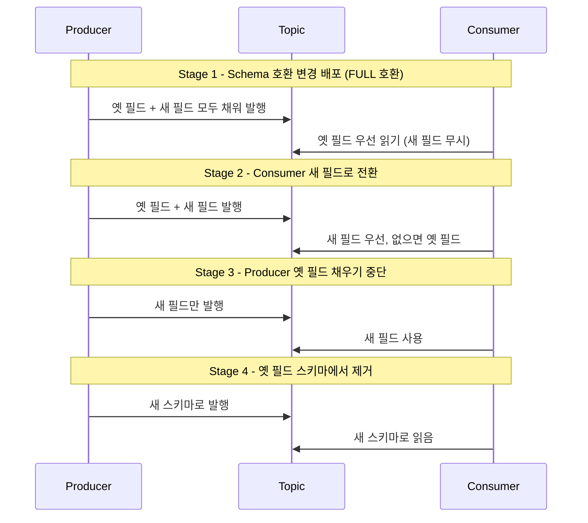

# Avro 스키마 진화 패턴

---

> 필드를 어떻게 바꾸면 깨지지 않는가, 그 보장이 어디에서 오는가를 정리합니다. 호환성 모드의 의미를 *배포 순서*와 *필드 변경 패턴*으로 풀어내, 스키마 PR을 볼 때 즉시 안전 여부를 가늠할 수 있게 합니다.

운영 중인 Kafka 시스템에서 스키마 변경은 단순히 .avsc 파일을 수정하는 작업이 아닙니다. Producer와 Consumer는 다른 시점에 배포되고, 메시지는 토픽에 며칠씩 머물 수 있으며, 한 번 적재된 메시지는 *읽는 쪽에서 어떤 스키마로 읽어도 동작*해야 합니다. 이 비대칭이 Avro 진화 규칙의 출발점입니다.


## 1. 호환성 모드의 진짜 의미

> BACKWARD/FORWARD/FULL은 단순히 "어디까지 호환되나"가 아니라 *어느 쪽을 먼저 배포해야 하는가*를 결정합니다.

| 모드 | 정의 | 배포 순서 | 안전한 변경 |
|------|------|----------|------------|
| BACKWARD | 새 reader가 옛 writer 메시지를 읽을 수 있음 | Consumer 먼저 | default 있는 필드 추가, 필드 삭제 |
| FORWARD | 옛 reader가 새 writer 메시지를 읽을 수 있음 | Producer 먼저 | default 있는 필드 삭제, 필드 추가 |
| FULL | 양쪽 다 만족 | 어느 쪽 먼저든 | default 있는 필드 추가/삭제 |
| NONE | 검증 없음 | (검증 안 됨) | 어떤 변경도 위험 |

BACKWARD가 운영에서 가장 많이 쓰이는데, 이유는 *Consumer를 먼저 배포하는 것이 자연스러운 운영 흐름*이기 때문입니다. 새 기능을 만들 때 Consumer 쪽 처리 로직을 먼저 코드 리뷰·테스트하고, 그 후 Producer가 새 필드를 채워 보내기 시작합니다.

FORWARD는 반대 방향입니다. 새 데이터를 빨리 만들기 시작해야 하는데 Consumer 업그레이드는 늦게 해도 되는 시나리오에 맞습니다. 데이터 분석 파이프라인처럼 *Producer가 항상 앞서가는 환경*에서 자연스럽습니다.

FULL은 "어느 쪽이든 먼저 배포돼도 안전하다"는 보장입니다. 변경 가능 범위가 가장 좁다는 것이 단점이지만, 마이크로서비스 환경에서 *어느 서비스가 먼저 배포될지 예측하기 어려울 때* 안전한 기본값입니다.

NONE은 사실상 검증을 끄는 옵션입니다. PoC 환경 외에는 쓰지 않습니다.

각 모드에는 `_TRANSITIVE` 변종이 있습니다. 기본 모드는 *직전 버전*과의 호환만 검증하지만, transitive 모드는 *모든 이전 버전*과의 호환을 검증합니다. 토픽에 오래된 메시지가 남아 있는 환경(예: compacted topic, 긴 retention)에서는 transitive를 켜야 합니다.


## 2. 필드 추가: default vs nullable union

> 새 필드를 추가하는 두 가지 방법이 있고, 둘 다 호환성 검증을 통과하지만 *의미*가 다릅니다.

```json
// 패턴 A: default 값
{"name": "discount", "type": "int", "default": 0}

// 패턴 B: nullable union
{"name": "discount", "type": ["null", "int"], "default": null}
```

패턴 A는 "값이 항상 있다, 미지정이면 0"을 의미합니다. discount = 0과 discount 미지정이 같은 의미일 때 적합합니다.

패턴 B는 "값이 *없을 수 있다*"를 명시적으로 표현합니다. discount가 적용되지 않은 주문과 0% 할인이 적용된 주문을 구분해야 한다면 nullable union이 정답입니다.

도메인 의미를 먼저 정한 후 스키마를 정합니다 — *호환성 만족만 보고 패턴을 선택하면 의미가 흐려집니다*. 6개월 후 코드를 보는 사람이 "이 0이 미지정인지 진짜 0인지" 묻게 됩니다.


## 3. 필드 삭제: 단계적 제거

필드를 직접 삭제하는 것은 BACKWARD에서만 안전하고, FORWARD에서는 깨집니다(옛 reader가 그 필드를 기대). 운영에서는 단계적 제거 패턴을 씁니다.

1. **알림 단계**: `doc` 필드에 deprecation 표시. 모든 컨슈머에게 "이 필드는 곧 사라진다" 공지.
2. **모니터링 단계**: 어느 컨슈머가 이 필드를 읽는지 로깅으로 추적. 사용량이 0이 될 때까지 대기.
3. **default 부여 단계**: 필드에 default 값을 부여(아직 없다면). 이 단계 후 FORWARD 호환을 만족합니다.
4. **삭제 단계**: 모든 Reader가 새 스키마로 업그레이드된 후 필드 제거.

각 단계 사이는 보통 며칠에서 몇 주 간격을 둡니다. 빠른 삭제가 필요하면 단계를 압축할 수 있지만, *모니터링 단계는 절대 건너뛰지 않습니다* — 사용 중인 컨슈머가 있는데 삭제하면 운영 장애로 직결됩니다.


## 4. 필드 이름 변경: alias 활용

Avro에서 필드명 변경은 자동으로 "삭제 + 추가"로 해석됩니다. 그대로 하면 BACKWARD든 FORWARD든 깨집니다 — 옛 이름 또는 새 이름 중 하나가 사라진 것으로 보이기 때문입니다.

해결책은 `aliases` 필드입니다:

```json
{
  "name": "totalAmount",
  "type": "double",
  "aliases": ["amount"]
}
```

새 이름은 `totalAmount`이지만, Reader가 옛 메시지의 `amount` 필드를 만나면 자동으로 매핑합니다. 호환성을 유지하면서 점진적으로 전환할 수 있습니다.

주의할 점은 *코드 생성기가 alias를 어떻게 다루는가*입니다. Avro Java 코드 생성기는 새 이름을 가진 필드만 클래스에 만들고, 옛 이름은 deserialization 시점의 매핑으로만 처리합니다. 빌더 API에서는 옛 이름을 못 쓰므로 *Producer 코드는 항상 새 이름으로 마이그레이션*해야 합니다.

alias는 누적됩니다. 한 번 이름을 바꾼 필드를 또 바꾸면 alias 배열에 옛 이름들이 모두 남습니다. 너무 자주 바꾸면 스키마가 복잡해지므로, *이름 변경 자체를 신중하게 결정*합니다.


## 5. 타입 변경: 거의 항상 새 필드 도입

타입 promotion이 가능한 경우는 좁습니다:

- `int` → `long`
- `int` → `float` → `double`
- `long` → `float` → `double`
- `string` ↔ `bytes`

이 외의 변경(예: `string` → `int`, struct 변경)은 호환되지 않습니다. 호환되는 promotion이라도 *모든 Reader가 새 스키마를 인식한 후*에야 안전합니다.

호환되지 않는 타입 변경이 필요하면 **새 필드 도입 패턴**을 씁니다:

1. 새 타입의 새 필드 추가 (`amountV2`)
2. Producer가 두 필드 모두 채움 (한동안)
3. 모든 Consumer가 새 필드 우선 읽기
4. Producer가 옛 필드 채우기 중단
5. 옛 필드 제거 (§3 삭제 절차)

이 패턴은 마이그레이션 기간이 길지만 무중단입니다. 도메인이 안정적이고 *바꾸지 않으면 안 되는* 상황에만 씁니다 — 그렇지 않으면 새 토픽을 만드는 것이 보통 더 깔끔합니다.


## 6. enum 변경: 비대칭에 주의

> enum 값 변경은 *추가와 삭제가 비대칭*입니다. 같은 변경처럼 보여도 호환성 영향이 정반대입니다.

값 추가는 BACKWARD를 깨뜨릴 수 있습니다. 옛 reader가 모르는 새 enum 값을 만나면 직렬화 실패합니다. Avro의 `default` symbol을 지정하면 이 문제를 피할 수 있습니다:

```json
{
  "type": "enum",
  "name": "OrderStatus",
  "symbols": ["PENDING", "SHIPPED", "DELIVERED", "CANCELLED"],
  "default": "PENDING"
}
```

옛 reader가 모르는 값(예: 새로 추가된 `RETURNED`)을 만나면 default symbol(`PENDING`)로 폴백합니다. 단, *의미가 흐려진다*는 단점이 있어 도메인이 허용하는지 검토해야 합니다 — 반품 상태가 PENDING으로 보이는 것이 맞는지부터 확인합니다.

값 삭제는 FORWARD를 깨뜨립니다. 옛 reader가 사라진 값으로 메시지를 만들면 새 reader가 못 읽습니다. 삭제 전 *해당 값을 사용하는 Producer 흔적이 0*임을 확인해야 합니다. 코드 검색만으로는 부족할 수 있으니, 토픽에 적재된 최근 메시지를 샘플링해 해당 값이 등장하는지 확인하는 것이 안전합니다.


## 7. 실전 마이그레이션 패턴

> 호환성 규칙은 "한 번에 한 변경"을 가정합니다. 실제로는 여러 변경을 묶어 배포하는 경우가 많은데, 이때 *변경을 단계로 쪼개는 것*이 핵심입니다.

전형적인 4단계 마이그레이션입니다:



각 단계 사이에 *최소 며칠 간격*을 둡니다. 토픽 retention 기간만큼은 옛 메시지가 남아 있을 수 있으므로, retention이 지나기 전에 다음 단계로 넘어가면 옛 메시지를 못 읽는 시점이 생깁니다.

이 패턴이 길고 번거로워 보이지만, 실제로는 *변경 리스크를 시간으로 분산*하는 거의 유일한 방법입니다. 한 번에 모든 것을 바꾸려다 실패하면 롤백 비용이 폭발적으로 커집니다 — Schema Registry는 등록된 버전을 영구 삭제하기 어려우므로(`compatibility: NONE`으로 잠시 풀고 재등록 필요), 잘못된 등록 자체가 쉽게 되돌릴 수 없는 흔적을 남깁니다.


## 8. 체크리스트

스키마 변경 PR 리뷰 시 점검 항목:

1. 변경 종류를 명시했는가? — 추가/삭제/이름변경/타입변경/enum변경 중 어느 것인지 PR 본문에 적었는가
2. 호환성 모드와 일치하는가? — Registry에 등록 시뮬레이션을 CI에서 돌렸는가
3. 배포 순서가 정의되어 있는가? — Producer/Consumer 중 어느 쪽을 먼저 배포할지 결정했는가
4. 마이그레이션이 필요하면 단계별 PR이 분리되어 있는가? — 한 PR에 여러 단계 묶지 않기
5. alias나 default symbol을 검토했는가? — 이름 변경/enum 변경 시 누락되지 않았는가
6. doc 필드에 변경 사유를 기록했는가? — 미래 자신이 읽을 때 도움이 됨

CI 자동화에서 강제할 수 있는 항목:

- Registry compatibility check (Confluent Maven plugin 또는 gradle plugin)
- 스키마 diff 출력을 PR 코멘트로 자동 첨부
- ephemeral Registry를 띄워 등록 시뮬레이션 후 결과 게이트


## 9. 정리

호환성 모드는 *"무엇이 안전한가"*가 아니라 *"어느 쪽을 먼저 배포해야 하는가"*를 정의합니다. BACKWARD는 Consumer 선행, FORWARD는 Producer 선행, FULL은 양쪽 자유 — 이 매핑을 머리에 담아 두면 변경 PR을 볼 때 즉시 안전 여부를 가늠할 수 있습니다.

대부분의 변경은 *직접 수정이 아닌 단계적 도입*으로 풀립니다. 새 필드 도입 → 양쪽 채우기 → 한쪽 전환 → 옛 필드 제거. 이 패턴이 어색해 보여도, 운영 중인 시스템에서 변경 리스크를 줄이는 거의 유일한 방법입니다.

스키마 변경이 실제로 깨졌을 때 어떤 예외가 어디서 잡히는지는 [02-05.Avro 직렬화 예외처리 전략](02-05.Avro%20직렬화%20예외처리%20전략.md)에서 확인합니다. 호환성 모드 자체에 대한 깊이 있는 설명은 [02-02.Schema Registry](02-02.Schema%20Registry.md)를 참조합니다.


---

> **TPS 적용 사례** — `okestro/tps-gitlab2` (현재 강제 안 됨)
>
> - **상태**: 호환성 모드를 빌드 단계에서 자동 검증하지는 않는다. `.avdl` 변경은 PR 리뷰로만 검토되며, Schema Registry 호환성 모드는 운영 환경 기본값(BACKWARD)에 의존한다.
> - **적용 시 설계**: Gradle 빌드에 `schema-registry-maven-plugin`(또는 Gradle 등가) 추가 → `./gradlew testCompatibility`로 PR 단계에서 호환성 위반 차단. 신규 필드는 `default` 또는 `["null", T]` 둘 중 의미에 맞는 쪽을 선택(02-06 §2 참고).
> - **이득/비용**: `.avdl` 변경 시 운영 사고 가능성 차단. 검증 시간 +30초/PR.
