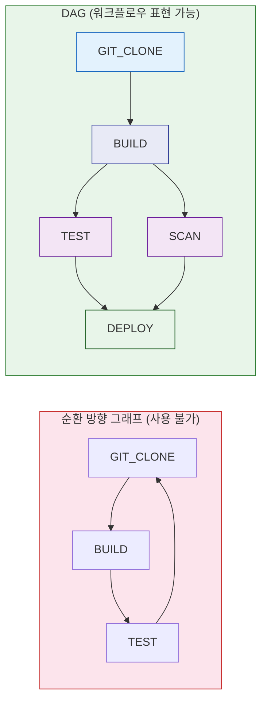
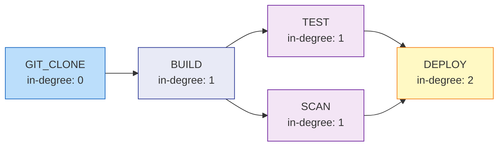
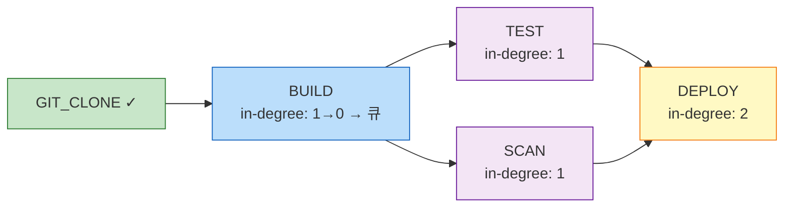
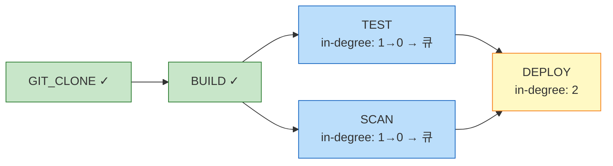
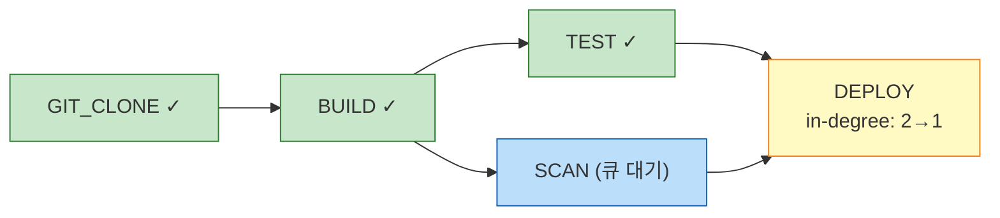
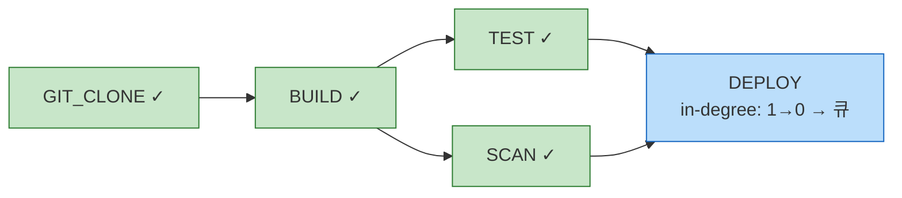
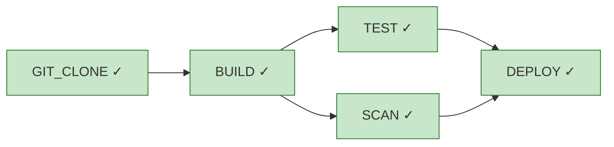
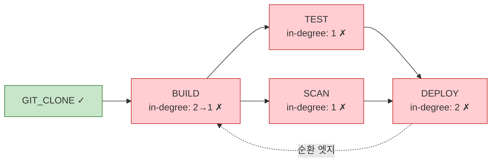

# DAG 자료구조와 그래프 알고리즘

---

> DAG 엔진 시리즈의 기초. 그래프 표현, 위상 정렬, 순환 탐지 알고리즘을 Java 코드로 다룬다.

## 1. 그래프 기초

그래프는 정점(vertex)과 정점 사이의 관계를 나타내는 엣지(edge)로 구성된 자료구조다. 소셜 네트워크의 팔로우 관계, 도로 지도의 교차로와 도로, 소프트웨어 빌드 시스템의 의존성 등 다양한 현실 문제를 그래프로 모델링할 수 있다. 워크플로우 엔진에서 Job 간 의존성을 표현할 때도 그래프를 사용하는데, 이때 DAG(Directed Acyclic Graph)라는 특수한 형태가 핵심 역할을 한다.

### 1-1. 방향 그래프와 비순환 조건

그래프의 두 가지 핵심 분류 기준은 방향성과 순환 여부다:

- **방향 그래프(Directed Graph)**: 엣지에 방향이 있어 (u, v)와 (v, u)가 다른 관계를 나타낸다. 워크플로우에서 "A가 완료되어야 B를 시작할 수 있다"는 단방향 의존성을 표현한다.
- **무방향 그래프(Undirected Graph)**: 엣지에 방향이 없어 (u, v)와 (v, u)가 동일한 관계다. 친구 관계, 도로망처럼 대칭적인 연결에 사용한다.
- **순환 그래프(Cyclic Graph)**: 특정 정점에서 출발하여 동일한 정점으로 돌아오는 경로(사이클)가 존재한다.
- **비순환 그래프(Acyclic Graph)**: 어떤 정점에서 출발하더라도 동일한 정점으로 돌아오는 경로가 없다.

**DAG(Directed Acyclic Graph)**는 방향 그래프이면서 동시에 비순환 그래프다. **"방향이 있고 사이클이 없다"**는 두 조건이 핵심이며, 이 조건이 **위상 순서(topological order)** 의 존재를 보장한다.

### 1-2. DAG의 성질

DAG가 워크플로우 표현에 적합한 이유는 수학적으로 보장되는 성질 덕분이다:

- **위상 순서 존재 ↔ 비순환 (동치)**: 그래프에 위상 순서가 존재한다는 것과 사이클이 없다는 것은 동치다. 위상 순서가 있으면 작업 실행 순서를 결정할 수 있다.
- **소스(source)와 싱크(sink) 존재 보장**: DAG에는 반드시 최소 1개의 소스(in-degree=0, 들어오는 엣지가 없는 노드)와 싱크(out-degree=0, 나가는 엣지가 없는 노드)가 존재한다.
- **워크플로우 매핑**: 소스 = 선행 의존성이 없는 시작 Job, 싱크 = 후속 Job이 없는 종료 Job으로 자연스럽게 대응된다.

아래 다이어그램은 순환 방향 그래프와 DAG의 차이를 보여준다:



순환 그래프에서 C1 → A1 엣지는 "TEST가 완료되어야 GIT_CLONE을 시작할 수 있다"는 모순을 만들어 실행이 영원히 시작되지 않는다. DAG는 이 엣지를 제거하여 실행 가능한 구조를 만든다.


## 2. DAG 표현 방식

그래프를 메모리에 표현하는 세 가지 방식이 있다. 워크플로우 DAG는 Job 수에 비해 의존성 엣지 수가 적은 희소(sparse) 그래프이므로 인접 리스트가 기본 선택이다.

### 2-1. 인접 리스트

인접 리스트는 각 노드가 가리키는 이웃 노드 목록을 저장하는 방식이다. Java에서는 `Map<String, List<String>>`으로 표현하며, 삽입 순서를 보존하려면 `LinkedHashMap`을 사용한다:

```java
Map<String, List<String>> adjacency = new LinkedHashMap<>();
adjacency.put("GIT_CLONE", List.of("BUILD"));
adjacency.put("BUILD", List.of("TEST", "SCAN"));
adjacency.put("TEST", List.of("DEPLOY"));
adjacency.put("SCAN", List.of("DEPLOY"));
adjacency.put("DEPLOY", List.of());
```

- 공간 복잡도는 O(V+E)이고 이웃 순회는 O(degree)다. 노드 수(V)에 비해 엣지 수(E)가 적은 워크플로우 DAG에서 공간 효율이 가장 좋다.

### 2-2. 인접 행렬

인접 행렬은 V×V 크기의 2차원 배열로 모든 노드 쌍의 엣지 존재 여부를 저장한다. 

- `boolean[][]` 또는 `int[][]`로 구현하며, 엣지 존재 확인은 O(1)이지만 공간은 O(V²)를 차지한다. 
- 노드 수가 적고 엣지가 많은 밀집 그래프나 행렬 연산이 필요한 경우에 적합하며, 워크플로우 DAG처럼 희소한 그래프에는 낭비가 크다.

### 2-3. 엣지 리스트

엣지 리스트는 `List<Edge>` 형태로 모든 엣지를 나열하는 방식이다. `Edge`는 `(from, to)` 쌍이며 공간은 O(E)만 차지한다. 직렬화(JSON, DB 저장)에 적합하여 DAG 정의를 저장하는 포맷으로 자주 사용된다. 실행 중에는 인접 리스트로 변환하여 사용하는 것이 일반적이다.

### 2-4. 비교

세 방식을 속성별로 정리하면 다음과 같다:

| 표현 방식 | 공간 | 엣지 존재 확인 | 이웃 순회 | 적합 상황 |
|-----------|------|--------------|----------|----------|
| 인접 리스트 | O(V+E) | O(degree) | O(degree) | 희소 그래프, 워크플로우 DAG |
| 인접 행렬 | O(V²) | O(1) | O(V) | 밀집 그래프, 행렬 연산 |
| 엣지 리스트 | O(E) | O(E) | O(E) | 직렬화, DB 저장 |


## 3. 위상 정렬

위상 정렬은 DAG의 모든 엣지 (u, v)에 대해 u가 v보다 앞에 오도록 노드를 나열하는 것이다. 결과가 유일하지 않을 수 있으며, 이 자유도가 병렬 실행 기회를 만든다. 위상 순서 상의 여러 노드가 동시에 "실행 가능" 상태가 되면 그것들을 병렬로 실행할 수 있다.

### 3-1. Kahn's Algorithm (BFS)

Kahn's Algorithm은 in-degree(들어오는 엣지 수)를 활용한 BFS 방식이다. 시간 복잡도는 O(V+E)이며, 순환 탐지가 부산물로 포함된다는 것이 큰 장점이다:

- in-degree가 0인 노드를 큐에 넣고 시작한다
- 큐에서 꺼낸 노드를 결과 리스트에 추가하고 그 노드의 후속 노드 in-degree를 각 1씩 감소시킨다
- in-degree가 0이 된 노드를 큐에 추가한다
- 모든 노드를 처리하지 못하면 순환이 존재한다는 의미다

Java 구현은 다음과 같다:

```java
public static List<String> kahnSort(Map<String, List<String>> graph) {
    // 1. in-degree 계산
    Map<String, Integer> inDegree = new LinkedHashMap<>();
    graph.keySet().forEach(node -> inDegree.put(node, 0));
    graph.forEach((node, neighbors) ->
        neighbors.forEach(n -> inDegree.merge(n, 1, Integer::sum))
    );

    // 2. in-degree 0인 노드로 큐 초기화
    Queue<String> queue = new ArrayDeque<>();
    inDegree.forEach((node, degree) -> {
        if (degree == 0) queue.add(node);
    });

    // 3. BFS
    List<String> sorted = new ArrayList<>();
    while (!queue.isEmpty()) {
        String current = queue.poll();
        sorted.add(current);
        for (String neighbor : graph.getOrDefault(current, List.of())) {
            int newDegree = inDegree.merge(neighbor, -1, Integer::sum);
            if (newDegree == 0) queue.add(neighbor);
        }
    }

    // 4. 순환 검사
    if (sorted.size() != graph.size()) {
        throw new IllegalArgumentException("그래프에 순환이 존재한다");
    }
    return sorted;
}
```

아래 다이어그램은 5개 노드 DAG에 Kahn's Algorithm을 단계별로 적용하는 과정이다. 알고리즘의 핵심 원리는 **"선행 의존성이 모두 해소된 노드부터 처리한다"**는 것이며, 이것이 DAG 엔진의 `findReadyJobs()`와 정확히 같은 원리다.

#### 초기 상태: in-degree 계산

알고리즘의 첫 단계는 모든 노드의 in-degree(들어오는 엣지 수)를 계산하는 것이다. in-degree가 0인 노드는 선행 의존성이 없으므로 즉시 실행 가능하다:



초기 큐에는 in-degree가 0인 `GIT_CLONE` 하나만 들어간다.

#### Step ① GIT_CLONE 처리

큐에서 `GIT_CLONE`을 꺼내 결과 리스트에 추가한다. `GIT_CLONE`의 후속 노드 `BUILD`의 in-degree를 1 감소시키면 0이 되므로 큐에 추가한다:



> 큐: [`BUILD`] / 결과: [`GIT_CLONE`]

#### Step ② BUILD 처리

`BUILD`를 꺼내 처리한다. 후속 노드가 `TEST`와 `SCAN` 두 개이므로 각각 in-degree를 감소시킨다. 둘 다 0이 되어 **동시에 큐에 추가**된다. 이것이 병렬 실행의 근거가 되는 핵심 지점이다:



> 큐: [`TEST`, `SCAN`] / 결과: [`GIT_CLONE`, `BUILD`]

`TEST`와 `SCAN`이 같은 BFS 레벨에서 큐에 들어갔다는 것은 서로 의존성이 없다는 뜻이다. DAG 엔진에서는 이 두 Job을 동시에 디스패치하여 병렬 실행할 수 있다.

#### Step ③ TEST 처리

`TEST`를 꺼내 처리한다. 후속 노드 `DEPLOY`의 in-degree를 감소시키면 2→1이 된다. 아직 1이므로 큐에 들어가지 않는다. `SCAN`이 아직 완료되지 않았기 때문이다:



> 큐: [`SCAN`] / 결과: [`GIT_CLONE`, `BUILD`, `TEST`]

#### Step ④ SCAN 처리

`SCAN`을 꺼내 처리한다. `DEPLOY`의 in-degree가 1→0이 되어 마침내 큐에 추가된다. 모든 선행 노드(`TEST`, `SCAN`)가 완료된 셈이다:



> 큐: [`DEPLOY`] / 결과: [`GIT_CLONE`, `BUILD`, `TEST`, `SCAN`]

#### Step ⑤ DEPLOY 처리 → 완료

`DEPLOY`를 꺼내 처리한다. 후속 노드가 없으므로 큐가 비고, 결과 리스트에 모든 노드(5개)가 포함되었으므로 순환 없이 위상 정렬이 완료된다:



> 큐: `[]` (비어 있음) / 최종 결과: [`GIT_CLONE`, `BUILD`, `TEST`, `SCAN`, `DEPLOY`]

`sorted.size()`(5) == `graph.size()`(5)이므로 순환이 없음이 확인된다.

#### 순환이 있을 때의 동작

만약 `DEPLOY → BUILD` 엣지가 추가되어 순환이 생기면, `BUILD`의 in-degree가 절대 0이 되지 않는다. `GIT_CLONE` 처리 후 `BUILD`의 in-degree가 1→0이 아니라 2→1로 남기 때문이다. 결국 큐가 비었는데 `sorted.size() < graph.size()`인 상황이 발생하여 순환을 탐지한다:



> 큐가 비었는데 sorted=[`GIT_CLONE`] (1개) ≠ graph.size() (5개) → **순환 존재**

`sorted`에 포함되지 않은 노드(`BUILD`, `TEST`, `SCAN`, `DEPLOY`)가 순환에 관여한 노드 집합이다.

#### 실행 추적: 실제 값으로 보는 Kahn's Algorithm

아래 테이블은 위 5개 노드 DAG에 대해 알고리즘이 실행되는 동안 모든 변수의 실제 값을 추적한 것이다. 코드의 `while` 루프 한 바퀴가 한 행에 대응한다:

| 반복 | `current` | 후속 노드 | in-degree 변화 | 큐에 추가 | 큐 상태 | `sorted` |
|------|-----------|----------|---------------|----------|---------|----------|
| 초기 | - | - | GIT=0, BUILD=1, TEST=1, SCAN=1, DEPLOY=2 | GIT_CLONE | [`GIT_CLONE`] | `[]` |
| 1 | `GIT_CLONE` | BUILD | BUILD: 1→**0** | BUILD | [`BUILD`] | [`GIT_CLONE`] |
| 2 | `BUILD` | TEST, SCAN | TEST: 1→**0**, SCAN: 1→**0** | TEST, SCAN | [`TEST`, `SCAN`] | [`GIT_CLONE`, `BUILD`] |
| 3 | `TEST` | DEPLOY | DEPLOY: 2→**1** | - | [`SCAN`] | [`GIT_CLONE`, `BUILD`, `TEST`] |
| 4 | `SCAN` | DEPLOY | DEPLOY: 1→**0** | DEPLOY | [`DEPLOY`] | [`..`, `TEST`, `SCAN`] |
| 5 | `DEPLOY` | - | - | - | `[]` | [`GIT_CLONE`, `BUILD`, `TEST`, `SCAN`, `DEPLOY`] |

핵심 관찰 포인트는 다음과 같다:

- **반복 2에서 TEST와 SCAN이 동시에 큐 진입**: `BUILD`의 후속 노드 두 개가 같은 반복에서 in-degree 0이 되었다. 이것이 병렬 실행의 근거다. DAG 엔진에서는 이 두 Job을 동시에 디스패치한다.
- **반복 3에서 DEPLOY가 큐에 들어가지 않음**: in-degree가 2→1로 감소했지만 아직 0이 아니다. `SCAN`이 완료되지 않았기 때문이다. 이 메커니즘이 "모든 선행 노드 완료 후 실행"이라는 의존성 보장을 만든다.
- **반복 5 후 검증**: `sorted.size()`(5) == `graph.size()`(5)이므로 순환이 없다. 만약 순환이 있었다면 큐가 먼저 비어서 `sorted.size() < graph.size()`가 된다.

`inDegree.merge(neighbor, -1, Integer::sum)` 한 줄이 "in-degree 감소 → 0이면 큐 추가"를 처리한다. `merge`의 반환값이 새 in-degree이므로 별도의 `get` + `put` 없이 한 번의 호출로 감소와 비교를 동시에 수행한다.

### 3-2. DFS 기반 위상 정렬

DFS 기반 위상 정렬은 각 노드에서 재귀 DFS를 수행하여 모든 후속 노드를 방문한 뒤(post-order) 스택에 push하는 방식이다. 스택을 뒤집으면 위상 순서가 나온다:

```java
public static List<String> dfsSort(Map<String, List<String>> graph) {
    Set<String> visited = new HashSet<>();
    Deque<String> stack = new ArrayDeque<>();

    for (String node : graph.keySet()) {
        if (!visited.contains(node)) {
            dfs(node, graph, visited, stack);
        }
    }
    return new ArrayList<>(stack);  // stack은 역순으로 쌓임
}

private static void dfs(String node, Map<String, List<String>> graph,
                         Set<String> visited, Deque<String> stack) {
    visited.add(node);
    for (String neighbor : graph.getOrDefault(node, List.of())) {
        if (!visited.contains(neighbor)) {
            dfs(neighbor, graph, visited, stack);
        }
    }
    stack.push(node);  // post-order
}
```

이 구현은 순환 탐지를 포함하지 않는다. 순환이 있을 경우 무한 재귀가 발생할 수 있으므로 §4-2의 3-색 알고리즘을 별도로 적용해야 한다.

### 3-3. Kahn's vs DFS 비교

두 알고리즘을 워크플로우 DAG 엔진 관점에서 비교하면 다음과 같다:

| 속성 | Kahn's (BFS) | DFS |
|------|-------------|-----|
| 순환 탐지 | 부산물로 포함 | 별도 로직 필요 (3-색) |
| 병렬 실행 후보 | 같은 BFS 레벨 = 동시 실행 가능 | 레벨 정보 없음 |
| 구현 복잡도 | 낮음 | 중간 |
| DAG 엔진 적합성 | 높음 (ready-node 탐지와 동일 원리) | 낮음 |

워크플로우 DAG 엔진에서는 Kahn's Algorithm이 더 적합하다. "in-degree가 0인 노드 = 실행 가능한 노드"라는 원리가 DAG 엔진의 `findReadyJobs()` 로직과 정확히 일치하기 때문이다. 상세: 04-02 §2


## 4. 순환 탐지

DAG 엔진이 순환을 허용하면 실행이 무한 루프에 빠진다. DAG 정의를 검증할 때 순환 탐지는 필수이며, 단순히 순환 존재 여부만이 아니라 어떤 노드들이 순환에 관여하는지도 알려주어야 디버깅이 가능하다.

### 4-1. Kahn's 알고리즘 활용

Kahn's Algorithm에서 위상 정렬이 완료된 후 `sorted.size() != graph.size()`이면 순환이 존재한다. 이 방식은 위상 정렬과 순환 탐지를 한 번의 순회로 처리한다는 장점이 있다. 단, 어떤 노드가 순환에 관여하는지 직접적으로 알려주지 않으며, 순환 노드 식별이 필요하면 `sorted`에 포함되지 않은 노드를 찾으면 된다.

### 4-2. DFS 3-색 알고리즘

3-색 알고리즘은 각 노드를 WHITE(미방문), GRAY(방문 중), BLACK(완료) 세 가지 상태로 분류하여 순환을 탐지한다. GRAY 노드에서 다른 GRAY 노드로 향하는 엣지가 발견되면 그것이 순환(back edge)임을 의미하며, 순환 경로를 직접 추적할 수 있다는 것이 Kahn's 방식과의 핵심 차이다:

```java
public static boolean hasCycle(Map<String, List<String>> graph) {
    Map<String, Color> color = new HashMap<>();
    graph.keySet().forEach(n -> color.put(n, Color.WHITE));

    for (String node : graph.keySet()) {
        if (color.get(node) == Color.WHITE) {
            if (dfsDetect(node, graph, color)) return true;
        }
    }
    return false;
}

private static boolean dfsDetect(String node, Map<String, List<String>> graph,
                                  Map<String, Color> color) {
    color.put(node, Color.GRAY);
    for (String neighbor : graph.getOrDefault(node, List.of())) {
        if (color.get(neighbor) == Color.GRAY) return true;   // back edge → 순환
        if (color.get(neighbor) == Color.WHITE && dfsDetect(neighbor, graph, color)) {
            return true;
        }
    }
    color.put(node, Color.BLACK);
    return false;
}

enum Color { WHITE, GRAY, BLACK }
```

### 4-3. 실용: 순환 경로 보고

단순히 "순환이 존재한다"는 boolean 값만으로는 사용자가 DAG 정의의 어느 부분을 수정해야 하는지 알 수 없다. `A → B → C → A` 형태로 순환 경로를 구체적으로 알려주어야 디버깅이 가능하다. DFS에서 GRAY→GRAY 엣지를 발견하는 순간 재귀 호출 스택을 역추적하면 순환에 관여한 노드 목록을 복원할 수 있다. `DagValidator`가 이 패턴을 사용한다. 상세: 04-02 §2


## 5. 선행/후속 그래프 사전구축

DAG 엔진의 핵심 연산은 "이 노드의 선행 노드가 모두 완료되었는가?"다. 이 질문에 O(1)로 답하려면 선행/후속 그래프를 사전에 구축해야 한다. 매번 전체 그래프를 순회하는 대신, 실행 시작 전에 선행 관계를 반전시킨 역방향 그래프를 만들어 두면 런타임 판단을 빠르게 처리할 수 있다.

### 5-1. 역방향 그래프 구축

원본 그래프(후속 그래프)의 엣지를 뒤집으면 선행 그래프(predecessor graph)가 된다. 예를 들어 `BUILD → TEST` 엣지를 뒤집으면 `TEST`의 선행 노드가 `BUILD`라는 정보가 된다:

```java
public static Map<String, Set<String>> buildPredecessorGraph(
        Map<String, List<String>> successorGraph) {
    Map<String, Set<String>> predecessors = new LinkedHashMap<>();
    successorGraph.keySet().forEach(n -> predecessors.put(n, new HashSet<>()));
    successorGraph.forEach((node, successors) ->
        successors.forEach(s -> predecessors.get(s).add(node))
    );
    return predecessors;
}
```

엔진은 `completedJobs.containsAll(predecessors.get(node))`로 ready 여부를 O(선행노드 수)에 판단한다.

### 5-2. ready-node 탐지와 Kahn's 알고리즘의 관계

Kahn's Algorithm과 DAG 엔진의 실행 루프는 동일한 구조를 가진다:

- **Kahn's**: in-degree 0인 노드를 큐에 추가 → 처리 후 후속 노드 in-degree 감소 → in-degree 0이 된 노드를 큐에 추가
- **DAG 엔진**: 선행 노드 모두 완료된 노드를 READY로 전환 → 실행 후 후속 노드 선행 완료 여부 재평가

DAG 엔진의 실행 루프는 Kahn's Algorithm의 온라인(incremental) 버전이다. 차이점은 Kahn's가 한 번에 전체 순서를 계산하는 반면, DAG 엔진은 각 Job의 완료 이벤트가 도착할 때마다 점진적으로 ready 노드를 갱신한다는 것이다.

### 5-3. DagExecutionState의 활용

`DagExecutionState`는 `dependencyGraph`(선행)와 `successorGraph`(후속)를 모두 불변 필드로 사전구축한다. 이를 기반으로 두 가지 핵심 연산을 제공한다:

- `findReadyJobIds()`: `completedJobIds.containsAll(dependencies)` 기반으로 실행 가능한 Job을 판정한다
- `allDownstream()`: successorGraph를 BFS 순회하여 특정 노드 하위의 전체 노드를 수집한다. SKIP_DOWNSTREAM 정책(한 Job이 실패했을 때 하위 Job을 모두 건너뛰는 정책)에 사용된다

불변 사전구축 덕분에 동시 접근 시 별도의 동기화 없이 안전하게 읽을 수 있다. 상세: 04-02 §2


## 6. Sources

- Cormen, Leiserson, Rivest, Stein. *Introduction to Algorithms* (CLRS), 4th ed. Chapter 20: Elementary Graph Algorithms, Chapter 20.4: Topological Sort
- Sedgewick, Wayne. *Algorithms*, 4th ed. Section 4.2: Directed Graphs
- Kahn, A.B. "Topological sorting of large networks." *Communications of the ACM*, 1962
