# DAG 기반 워크플로우 순서 보장
---
> 메시지큐에서 단순한 선형 파이프라인을 넘어, DAG(Directed Acyclic Graph) 구조의 의존성을 유지하면서 순서를 보장하는 세 가지 패턴과 DAG 확장 전략을 다룹니다.


## 1. 왜 DAG인가

> 실무 시스템의 작업 흐름은 선형으로 나타나는 경우가 드뭅니다. 결제 처리를 예로 들면, 사기 탐지와 재고 확인은 서로 독립적으로 병렬 실행할 수 있지만, 두 검사가 모두 완료되어야 출고 지시를 내릴 수 있습니다. 이처럼 단계 간에 복잡한 의존 관계가 형성될 때 선형 파이프라인은 한계에 부딪힙니다.

### 1-1. 선형 파이프라인의 한계

선형 파이프라인은 A → B → C처럼 각 단계가 엄격히 순차적으로 실행됩니다. 

- 구조가 단순하고 이해하기 쉽다는 장점이 있지만, 병렬 처리가 가능한 단계도 순차적으로 실행해야 합니다. CI/CD 파이프라인에서 단위 테스트와 보안 스캔은 서로 무관한데도 선형 구조에서는 하나가 끝나야 다음을 시작할 수 있습니다. 
- 처리 시간이 병목 단계 하나에 의해 결정되므로 전체 지연이 누적됩니다.

선형 구조의 근본적 문제는 의존성 정보가 숨겨져 있다는 점입니다. 

- "B는 A 다음에 실행한다"고 정의되어 있지만, 그 이유가 진짜 의존성 때문인지 단순히 순서를 정한 것인지 코드만 봐서는 알 수 없습니다. 
- 의존성이 명시적으로 표현되지 않으면 병렬화 가능한 구간을 파악하기 어렵고, 파이프라인 구조를 변경할 때 숨겨진 의존성을 깨뜨릴 위험이 있습니다.

### 1-2. DAG 개념

DAG는 **방향이 있는 비순환 그래프(Directed Acyclic Graph)**입니다. 노드(Node)는 실행할 작업을 나타내고, 엣지(Edge)는 의존 관계를 나타냅니다. "A → B"라는 엣지는 "B는 A가 완료된 후에 실행할 수 있다"는 의미입니다. 비순환(Acyclic)이라는 조건이 중요한데, 순환이 없어야 실행 순서를 결정할 수 있기 때문입니다.

**위상 정렬(Topological Sort)**은 DAG의 노드를 실행 가능한 순서로 나열하는 알고리즘입니다. 위상 정렬의 결과는 하나가 아닐 수 있습니다. 서로 의존하지 않는 노드들은 어떤 순서로 배치해도 유효하며, 이 자유도가 병렬 실행의 기회를 만듭니다. 메시지큐 기반 워크플로우에서는 위상 정렬 결과를 활용해 어떤 작업을 동시에 실행할 수 있는지 판단합니다. 위상 정렬 알고리즘의 상세한 구현과 비교는 01-01 §3을 참조한다.

### 1-3. 실무 시나리오

DAG 구조가 자연스럽게 등장하는 실무 시나리오는 다음과 같습니다:

- **CI/CD 파이프라인**: 단위 테스트, 보안 스캔, 정적 분석은 병렬 실행 가능하고, 세 단계 모두 완료되어야 통합 테스트를 시작할 수 있습니다.
- **ETL 배치**: 여러 원본 테이블에서 데이터를 추출하는 작업은 병렬로 진행하고, 모든 추출이 완료된 후 변환 및 적재 단계가 시작됩니다.
- **정산 처리**: 일일 거래 집계와 수수료 계산은 독립적으로 병렬 실행하고, 두 결과가 모두 나와야 최종 정산서를 생성할 수 있습니다.

### 1-4. 선형 파이프라인 vs DAG 비교

다음 다이어그램은 선형과 DAG 구조가 동일한 작업 집합을 어떻게 다르게 표현하는지를 보여줍니다:

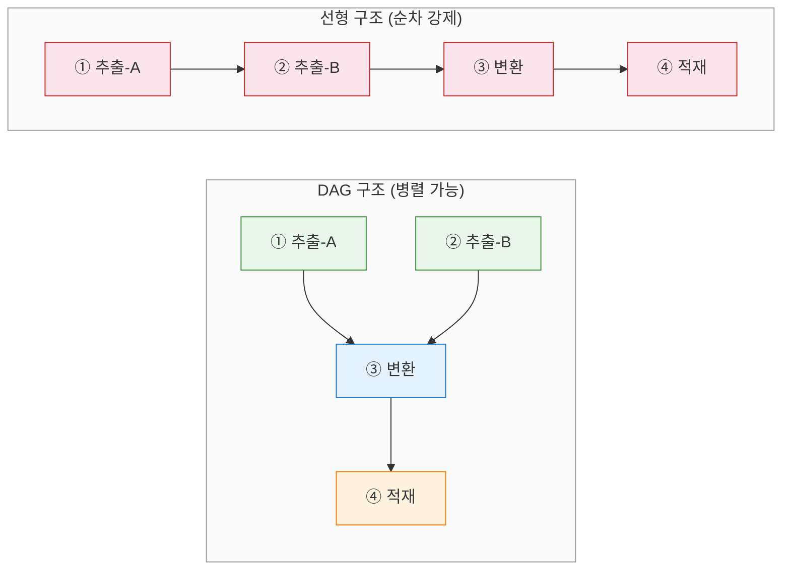

- DAG 구조에서는 추출-A와 추출-B가 동시에 실행됩니다.
- 선형 구조에서 4단계를 모두 순차 실행하면 `T(A) + T(B) + T(변환) + T(적재)` 시간이 걸리지만, DAG 구조에서는 `max(T(A), T(B)) + T(변환) + T(적재)`로 단축됩니다.

### 1-5. 워크플로우 오케스트레이터 유형

워크플로우 오케스트레이션 접근법은 크게 세 가지 유형으로 나뉜다:

- **배치 스케줄링형 (Airflow)**: DAG와 태스크 의존성을 정의하면 스케줄러가 실행 가능한 태스크를 순서대로 트리거한다. 정적 배치 워크플로우에 강하며, 매일·매시간 반복되는 ETL 파이프라인이 대표적인 적용 대상이다.
- **Durable Execution형 (Temporal)**: 워크플로우 실행 이력을 영속적으로 기록하여, 장애가 발생해도 정확한 지점부터 재개한다. 수일에서 수주까지 이어지는 장기 실행 워크플로우에 적합하다.
- **도메인 맞춤 오케스트레이터**: 특정 도메인(Jenkins 빌드, 주문 처리 등)에 밀착한 얇은 엔진을 직접 구축한다. 외부 장기 작업 실행, 상태 추적, UI 진행률 표시가 핵심 요구사항일 때 적합하다.

"Jenkins 같은 외부 장기 작업을 오케스트레이션하면서 UI에서 진행률을 보여주는" 문제는 Airflow식 정적 배치보다 도메인 맞춤 오케스트레이터나 Temporal류에 더 가까운 문제다. Airflow의 스케줄러는 "정해진 시각에 DAG를 실행"하는 모델이므로, 외부 이벤트에 반응하여 즉시 트리거하고 실시간으로 상태를 추적하는 패턴과는 거리가 있다.

본 시리즈는 이 세 유형 중 **도메인 맞춤 오케스트레이터를 메시지큐 기반으로 설계하는 방법**에 집중한다. 범용 엔진의 기능을 재구현하는 것이 아니라, 특정 도메인의 제약과 요구사항에 맞춘 최소한의 오케스트레이션 레이어를 구축하는 접근이다.


## 2. 메시지큐에서의 순서 보장 레벨

> 메시지큐 기반 시스템에서 순서 보장은 요구 수준에 따라 세 단계로 나뉩니다. 각 레벨은 이전 레벨을 포함하며, 위로 올라갈수록 구현 복잡도가 높아집니다.

### 2-1. Level 1 — 파티션 키 순서

Kafka와 Redpanda가 기본으로 제공하는 순서 보장입니다. 같은 파티션 키를 가진 메시지는 같은 파티션으로 라우팅되고, 파티션 내에서 오프셋 순으로 소비됩니다.

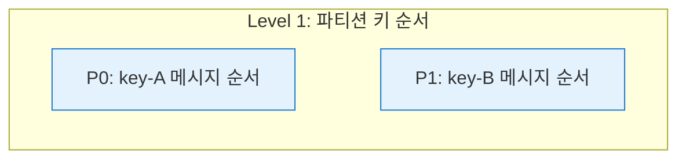

- 주문 시스템에서 `orderId`를 파티션 키로 사용하면 한 주문의 이벤트(생성 → 결제 → 배송)가 항상 같은 파티션에 들어가므로 순서가 자연스럽게 보장됩니다.
- Level 1만으로도 대부분의 이벤트 기반 시스템 요구사항을 충족합니다. **핵심은 파티션 키 설계**에 있습니다. 키의 카디널리티(고유 값의 수)가 파티션 수보다 충분히 커야 데이터가 균등하게 분배됩니다.

### 2-2. Level 2 — 묶음 간 배리어(Barrier)

"묶음 A의 모든 메시지가 완료된 후에야 묶음 B를 시작한다"는 배리어가 필요한 수준입니다. 배치 처리나 규제 환경에서 요구되는 제약입니다. 

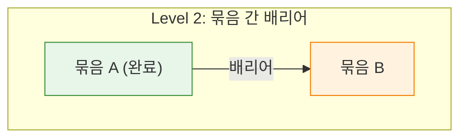

- Level 1 파티션 키 순서 위에 추가되는 개념이며, **Kafka/Redpanda의 기본 기능으로는 제공되지 않습니다.**
-  브로커는 메시지를 저장하고 전달할 뿐, 메시지 그룹의 완료 상태를 추적하거나 다음 그룹의 소비를 차단하는 기능을 갖고 있지 않습니다.

Level 2 배리어는 애플리케이션 레이어에서 구현해야 합니다. 이 문서에서 다루는 세 가지 패턴(Batch Coordinator, 2-토픽 파이프라인, 단일 파티션 + 인프로세스 병렬)이 모두 Level 2 배리어를 구현하는 방법입니다.

### 2-3. Level 3 — DAG 의존성

Level 2의 선형 묶음 배리어를 일반화한 것이 Level 3입니다. 

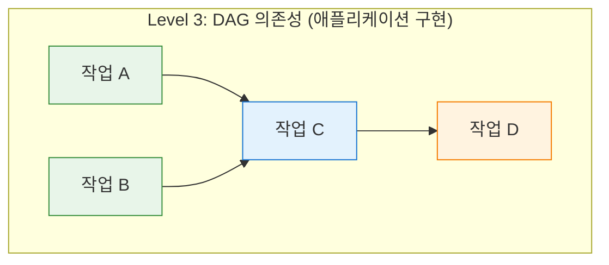

- "묶음 A와 묶음 B가 모두 완료된 후에야 묶음 C를 시작한다"처럼 복수의 선행 조건이 존재할 수 있습니다. 
- 각 노드가 여러 선행 노드의 완료를 기다리는 그래프 구조입니다. Airflow, Argo Workflows, Temporal 같은 워크플로우 엔진이 이 레벨을 전담합니다.

### 2-4. Kafka/Redpanda가 제공하는 것 vs 제공하지 않는 것

Kafka와 Redpanda의 순서 보장 능력을 정확히 파악하는 것이 설계의 출발점입니다:

| Kafka/Redpanda 기능 | 제공 여부 | 비고 |
|---------------------|:---------:|------|
| 파티션 내 메시지 순서 | 제공 | 오프셋 기반, 보장 |
| 그룹 키 기반 동일 파티션 라우팅 | 제공 | 파티션 키 해싱 |
| 묶음 간 배리어 | 미제공 | 애플리케이션 구현 필요 |
| DAG 의존성 추적 | 미제공 | 별도 워크플로우 엔진 필요 |
| Consumer 소비 일시정지/재개 | 제공 | `pause()`/`resume()` API |
| 원자적 produce + offset commit | 제공 | Kafka Transactions |


## 3. 패턴 1 — Batch Coordinator

### 3-1. 구조

Batch Coordinator는 묶음의 생명주기를 관리하는 전용 컴포넌트입니다. Coordinator는 현재 활성화된 묶음을 추적하고, 해당 묶음에 속한 모든 메시지의 처리 완료 ACK를 수집합니다. 모든 ACK가 도착해야 다음 묶음을 활성화합니다. 상태는 데이터베이스 또는 Redis에 저장해 Coordinator 재시작에도 복구할 수 있습니다.

- Worker는 메시지큐에서 메시지를 꺼낸 뒤 Coordinator에게 "이 `batchId`가 지금 처리 가능한가?"를 확인합니다. 
- 현재 묶음이 아니라면 Worker는 메시지를 처리하지 않고 대기하거나 재큐잉합니다. 
- 처리 완료 후 Worker가 Coordinator에게 ACK를 보내고, Coordinator는 해당 묶음의 완료 카운트를 원자적으로 감소시킵니다. 카운트가 0에 도달하면 다음 묶음을 활성화합니다.

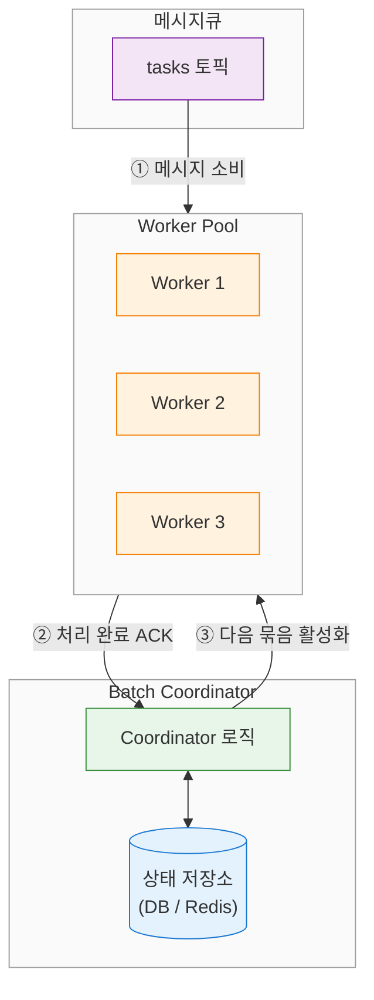

### 3-2. 처리 흐름

Producer가 묶음 A의 메시지를 발행할 때 각 메시지 헤더에 `batch-id=A`를 포함시킵니다. Coordinator는 묶음 A를 등록하고 총 메시지 수를 기록합니다. Worker 풀이 묶음 A의 메시지들을 병렬로 처리하면서 완료마다 ACK를 전송하고, Coordinator는 카운트를 감소시킵니다. 카운트가 0에 도달하면 묶음 A를 완료 상태로 표시하고 묶음 B 처리 가능 신호를 발송합니다.

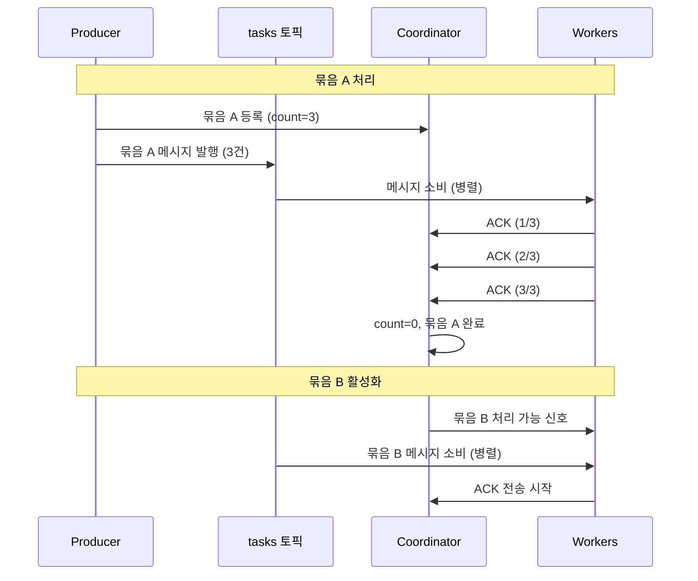

### 3-3. 예시 데이터 흐름

다음은 주문 5건을 두 묶음으로 나누어 Batch Coordinator가 처리하는 과정이다:

```
입력: 묶음 A [ORD-001, ORD-002, ORD-003]
      묶음 B [ORD-004, ORD-005]

묶음 A 처리:
  Producer → Coordinator 등록 (batch-id=A, count=3)
  Producer → tasks 토픽에 3건 발행
  Worker 1: ORD-001 처리 → ACK → Coordinator (remaining=2)
  Worker 2: ORD-002 처리 → ACK → Coordinator (remaining=1)
  Worker 3: ORD-003 처리 → ACK → Coordinator (remaining=0)
  Coordinator: count=0 → 묶음 A 완료 표시

  ── 배리어: Coordinator가 묶음 B 활성화 ──

묶음 B 처리:
  Producer → Coordinator 등록 (batch-id=B, count=2)
  Worker 1: ORD-004 처리 → ACK → Coordinator (remaining=1)
  Worker 2: ORD-005 처리 → ACK → Coordinator (remaining=0)
  Coordinator: count=0 → 묶음 B 완료 표시
```

핵심은 Coordinator가 원자적 카운트 감소로 묶음 완료를 판정한다는 점이다. Worker는 Coordinator에게 "현재 묶음이 활성 상태인가?"를 확인한 후에만 작업을 시작하므로, 묶음 B의 메시지가 토픽에 먼저 도착하더라도 묶음 A 완료 전에는 처리되지 않는다.

### 3-4. 시나리오 — 보험 청구 일괄 처리

보험사에서 매일 접수된 청구 건을 일괄 처리하는 상황입니다. 하루치 청구가 하나의 묶음이고, 청구 건마다 담당 보험사가 다릅니다. 같은 보험사의 청구는 순서대로 처리해야 하지만(Level 1), 서로 다른 보험사의 청구는 병렬로 처리할 수 있습니다.

- 핵심 제약은 "3월 15일 묶음이 전부 완료되어야 3월 16일 묶음을 시작할 수 있다"는 것입니다. 3월 16일 청구 중 일부가 3월 15일 청구 결과(보험금 한도 소진 여부 등)에 의존하기 때문입니다. 
- Coordinator가 일자별 묶음의 완료를 추적하고, 전날 묶음이 끝나야 다음 날 묶음을 활성화합니다. 
- 이 시나리오에서 Coordinator는 Redis의 원자적 DECR 연산으로 완료 카운트를 관리하고, Pub/Sub으로 Worker에게 활성화 신호를 전달합니다.

### 3-5. 장단점

이 패턴의 장점은 다음과 같습니다:

- 기존 메시지큐 인프라를 그대로 사용하면서 배리어를 추가할 수 있어 인프라 변경이 최소화됩니다.
- Worker 수를 유연하게 조절할 수 있어 묶음 내 병렬성 확장이 자유롭습니다.
- 묶음 상태를 상태 저장소에 명시적으로 기록하므로 모니터링과 디버깅이 용이합니다.

단점도 존재합니다:

- Coordinator가 단일 장애점(SPOF, Single Point of Failure)이 됩니다. 고가용성을 위해 리더 선출이나 인스턴스 이중화가 필요합니다.
- Coordinator와 Worker 간의 통신 오버헤드가 전체 처리량에 직접 영향을 줍니다.
- 상태 저장소에서의 동시성 제어가 복잡해질 수 있습니다. ACK 카운트 감소가 원자적이지 않으면 묶음이 조기 완료되거나 영원히 완료되지 않는 버그가 발생합니다.


## 4. 패턴 2 — 2-토픽 파이프라인(채택)

### 4-1. 구조

이 패턴은 메시지의 역할에 따라 토픽을 두 개로 분리합니다. 

- `control` 토픽은 단일 파티션으로 구성되어 묶음 단위 메타데이터, 즉 `BATCH_START`와 `BATCH_COMPLETE` 이벤트를 순서대로 전달합니다. 
- `tasks` 토픽은 N개 파티션으로 구성되어 실제 작업 메시지를 병렬로 처리합니다. 
- **Dispatcher**가 `control` 토픽을 소비하면서 두 토픽 사이의 흐름을 조율합니다.

`control` 토픽을 단일 파티션으로 구성하는 이유는 묶음 순서를 전역적으로 보장하기 위해서입니다. `BATCH_START(A) → BATCH_COMPLETE(A) → BATCH_START(B)`의 순서가 깨지면 묶음 간 배리어가 무의미해집니다. Kafka의 단일 파티션 순서 보장을 활용해 이 제약을 구조적으로 강제합니다.

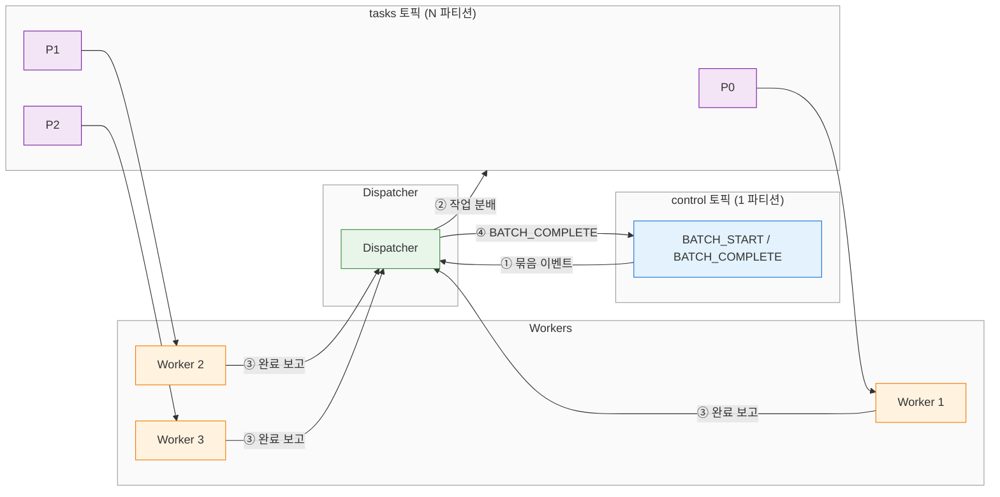

### 4-2. Dispatcher 역할

Dispatcher는 이 패턴의 핵심 컴포넌트입니다. 

- `control` 토픽에서 `BATCH_START(A)` 이벤트를 소비하면 묶음 A에 해당하는 작업 메시지를 `tasks` 토픽으로 발행합니다. 
- Worker들이 `tasks` 토픽에서 작업을 소비하고 완료를 Dispatcher에게 보고합니다. 
- Dispatcher는 묶음 A의 모든 작업이 완료되었음을 확인하면 `control` 토픽에 `BATCH_COMPLETE(A)`를 발행합니다.

중요한 점은 Dispatcher가 현재 묶음이 완료되기 전에 `control` 토픽의 다음 메시지를 소비하지 않는다는 것입니다. `BATCH_COMPLETE(A)` 발행 후에야 `BATCH_START(B)`를 처리합니다. Dispatcher의 이 순차적 소비 패턴이 묶음 간 배리어를 만들어냅니다.

### 4-3. 처리 흐름

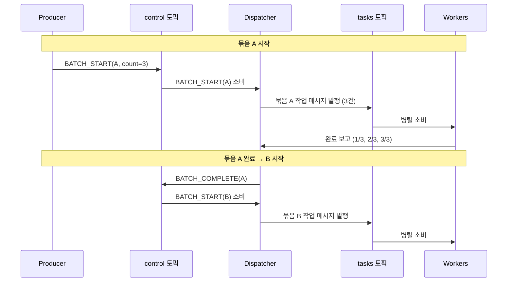

### 4-4. 예시 데이터 흐름

동일한 주문 5건이 2-토픽 파이프라인에서 처리되는 과정이다:

```
입력: 묶음 A [ORD-001, ORD-002, ORD-003]
      묶음 B [ORD-004, ORD-005]

묶음 A 처리:
  control 토픽 ← BATCH_START(A, count=3)
  Dispatcher: control 소비 → tasks 토픽에 ORD-001, ORD-002, ORD-003 분배
  Worker 1: ORD-001 처리 → Dispatcher에 완료 보고 (1/3)
  Worker 2: ORD-002 처리 → Dispatcher에 완료 보고 (2/3)
  Worker 3: ORD-003 처리 → Dispatcher에 완료 보고 (3/3)
  Dispatcher: control 토픽에 BATCH_COMPLETE(A) 발행

  ── 배리어: Dispatcher가 다음 control 메시지 소비 ──

묶음 B 처리:
  control 토픽 ← BATCH_START(B, count=2)
  Dispatcher: tasks 토픽에 ORD-004, ORD-005 분배
  Workers: 처리 → 완료 보고 (2/2)
  Dispatcher: BATCH_COMPLETE(B) 발행
```

패턴 1과의 차이점은 배리어 메커니즘이다. Coordinator가 상태 저장소에서 카운트를 관리하는 대신, Dispatcher가 control 토픽의 순차 소비를 통해 구조적으로 배리어를 형성한다. control 토픽의 이벤트 로그(`BATCH_START(A) → BATCH_COMPLETE(A) → BATCH_START(B)`)가 처리 이력으로 자동 보존된다.

### 4-5. 외부 작업 연동 (비동기 완료)

2-토픽 패턴에서 Worker가 외부 시스템을 호출하고, 외부 시스템이 비동기로 완료를 보고하는 구조도 자연스럽게 지원된다. Worker가 HTTP 요청을 보내고 즉시 반환하는 대신, 외부 시스템의 콜백이나 완료 이벤트를 수신한 후에 Dispatcher에게 완료를 보고하는 방식이다.

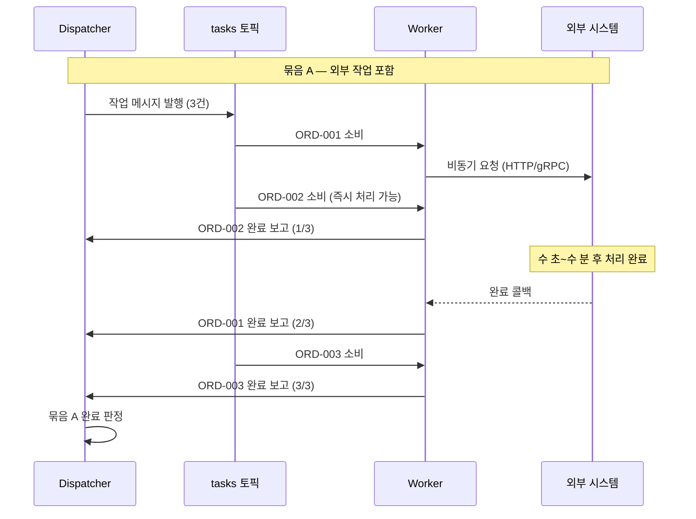

- 핵심은 **Dispatcher가 "완료 보고 N건을 모두 수신했는가"만 확인**한다는 점이다. 각 작업의 소요 시간이 비균일해도 문제없다. ORD-001이 외부 시스템 호출로 30초가 걸리고 ORD-002가 100밀리초에 끝나더라도, Dispatcher는 3건의 완료 보고가 모두 도착한 시점에 `BATCH_COMPLETE`를 발행한다.

- 이 방식을 사용할 때 주의할 점은 타임아웃 처리다. 외부 시스템이 응답하지 않으면 묶음이 영원히 완료되지 않으므로, Worker에 타임아웃을 설정하고 타임아웃 발생 시 실패 보고를 Dispatcher에게 전달해야 한다.

### 4-6. 시나리오 — ETL 배치 파이프라인

데이터 웨어하우스의 ETL 처리에서 이 패턴이 자연스럽게 적합합니다. 매시간 원본 데이터베이스에서 변경 데이터를 추출하고 변환한 후 적재하는데, 한 시간치 데이터가 하나의 묶음입니다. `users` 테이블과 `orders` 테이블의 변환은 서로 독립적이므로 `tasks` 토픽에서 병렬로 처리합니다.

묶음 간 순서가 필수인 이유는 13시 데이터가 아직 적재 중인데 14시 데이터가 먼저 도착하면 데이터 정합성이 깨지기 때문입니다. `control` 토픽이 `13시_START → 13시_COMPLETE → 14시_START` 순서를 구조적으로 강제하고, 시간별 데이터 정합성을 보장합니다. 이 경우 `control` 토픽의 이벤트 로그가 자연스럽게 ETL 처리 이력의 감사 추적(Audit Trail) 역할을 합니다.

### 4-7. 장단점

이 패턴의 장점은 다음과 같습니다:

- 순서 제어 로직(`control` 토픽)과 병렬 처리 로직(`tasks` 토픽)이 물리적으로 분리되어 관심사가 명확합니다.
- `control` 토픽의 이벤트 로그가 묶음 처리 이력을 자동으로 기록하므로 감사 추적에 유리합니다.
- Dispatcher 장애 시 `control` 토픽의 마지막 커밋 오프셋부터 재개할 수 있어 복구가 단순합니다.

단점도 있습니다:

- 토픽이 두 개로 늘어나므로 인프라 관리 비용이 증가하고 파티션 설계도 두 토픽에 대해 각각 고려해야 합니다.
- Dispatcher가 모든 완료 보고를 집중 수신하므로, 묶음 내 메시지 수가 매우 많으면 Dispatcher가 병목이 될 수 있습니다.
- 작업 분배 자체가 오래 걸릴 수 있습니다. 묶음당 수만 건의 메시지를 `tasks` 토픽에 순차 발행하면 분배 시간 자체가 지연 요인이 됩니다.


## 5. 패턴 3 — 단일 파티션 + 인프로세스 병렬

### 5-1. 구조

세 패턴 중 가장 단순한 접근법입니다. 토픽을 단일 파티션으로 구성하고 Consumer 하나가 모든 메시지를 순서대로 읽습니다. 

- Consumer 내부에서 스레드풀을 사용해 그룹별 병렬 처리를 수행합니다. 메시지큐 레벨에서는 단일 파티션의 순서 보장으로 묶음 간 순서가 자명하게 유지되고, 병렬성은 JVM 내부에서 확보합니다.
- Consumer는 묶음 경계를 감지하면(메시지의 `batch-id` 헤더가 이전과 달라지면) 현재 스레드풀의 모든 작업이 끝날 때까지 기다린 후 다음 묶음을 처리합니다. `CompletableFuture.allOf()`가 이 배리어 역할을 합니다. 오프셋 커밋은 묶음 단위로 수행하여 재처리 단위를 명확히 합니다.

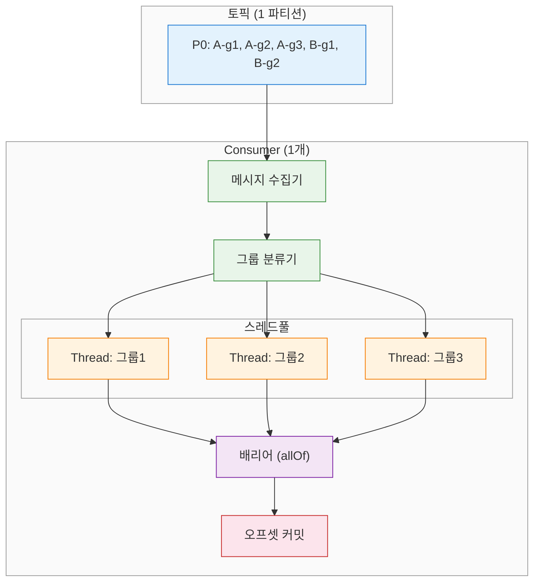

### 5-2. pause/resume과 배리어의 관계

`pause()`/`resume()` API는 원래 **배압(Backpressure)** 제어를 위해 설계된 기능입니다. Jenkins 큐가 포화 상태일 때 새 메시지 소비를 멈추는 식입니다. 그런데 이 동일한 API를 **묶음 배리어**에도 활용할 수 있습니다. 두 패턴은 같은 API를 사용하지만 `pause`/`resume`의 조건이 다릅니다.

| 요소 | 배압 패턴 | 묶음 배리어 패턴 |
|------|----------|----------------|
| pause 조건 | 외부 시스템(Jenkins 큐) 포화 | 현재 묶음과 다른 `batch-id` 감지 |
| resume 조건 | 외부 시스템 여유 발생 | 현재 묶음의 모든 작업 완료 |
| 상태 판단 | `queueMonitor.hasCapacity()` | `CompletableFuture.allOf()` 완료 |
| 확인 방식 | `@Scheduled` 폴링 | `allOf()` 완료 콜백 또는 동기 `join()` |

- 배압은 외부 시스템의 상태 변화를 기다려야 하므로 주기적 폴링이 자연스럽습니다. 
- 반면 묶음 배리어는 자체 스레드풀의 완료를 기다리는 것이므로 `CompletableFuture.allOf().join()`으로 동기 대기하는 것이 적합합니다. 
- 두 패턴은 구조가 동일하므로, 배압 제어와 묶음 배리어를 동시에 적용하는 것도 가능합니다. `pause` 조건이 `batch-id 변경 OR 외부 시스템 포화`가 되고, `resume` 조건이 `현재 묶음 완료 AND 외부 시스템 여유`가 됩니다.

### 5-3. 처리 흐름

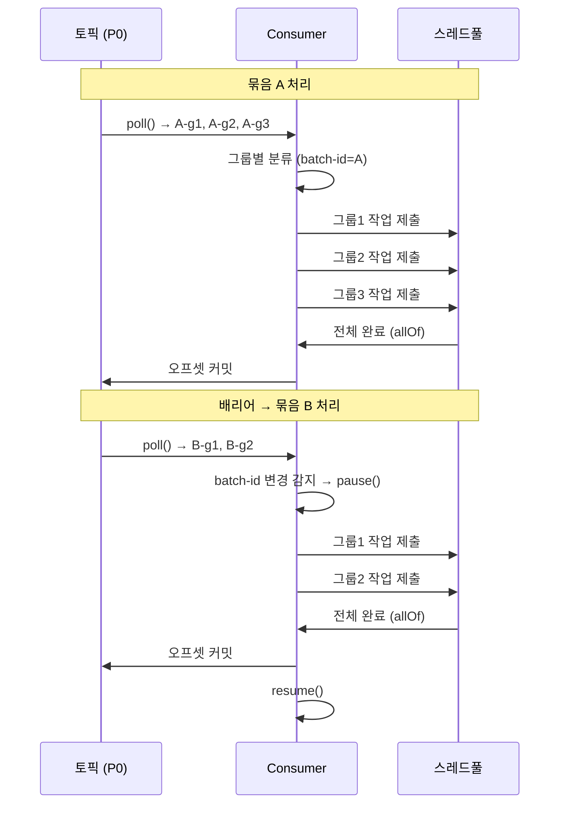

### 5-4. 예시 데이터 흐름

동일한 주문 5건이 단일 파티션 + 인프로세스 병렬로 처리되는 과정이다:

```
입력: 묶음 A [ORD-001, ORD-002, ORD-003]
      묶음 B [ORD-004, ORD-005]

묶음 A 처리:
  Consumer poll() → [ORD-001, ORD-002, ORD-003] (batch-id=A)
  스레드풀 제출: ORD-001 → Thread-1, ORD-002 → Thread-2, ORD-003 → Thread-3
  Thread-1 완료 ✓, Thread-3 완료 ✓, Thread-2 완료 ✓ (순서 무관)
  CompletableFuture.allOf() 완료 → 오프셋 커밋

  ── 배리어: batch-id 변경 감지 (A→B) ──

묶음 B 처리:
  Consumer poll() → [ORD-004, ORD-005] (batch-id=B)
  스레드풀 제출: ORD-004 → Thread-1, ORD-005 → Thread-2
  allOf() 완료 → 오프셋 커밋
```

패턴 1, 2와의 차이는 외부 컴포넌트가 전혀 없다는 점이다. Coordinator도 Dispatcher도 없이 Consumer 하나가 `poll()` → 분류 → 스레드풀 제출 → `allOf()` 대기 → 커밋을 반복한다. 묶음 간 배리어는 `batch-id` 변경 시 `pause()`를 호출하고, 현재 묶음의 `allOf()`가 완료된 후 `resume()`하는 것으로 구현된다.

### 5-5. 시나리오 — 결제 정산 배치

결제 대행사(PG)에서 매일 가맹점별 정산을 수행하는 경우입니다. 하루치 거래 내역이 하나의 묶음이고, 가맹점별로 정산 계산이 독립적입니다. 가맹점 A의 정산과 가맹점 B의 정산은 병렬로 처리할 수 있지만, 3월 15일 정산이 완료되어야 3월 16일 정산을 시작할 수 있습니다. 15일 미정산 건이 16일 집계에 영향을 주기 때문입니다.

이 시나리오에서 단일 파티션 + 인프로세스 병렬이 적합한 이유는 가맹점 수가 수백 개 수준으로 제한적이고, 개별 정산 처리 시간이 짧기 때문입니다. Consumer 하나가 스레드풀로 가맹점별 정산을 동시에 실행하면 충분한 처리량이 나옵니다. Coordinator나 Dispatcher 같은 외부 컴포넌트 없이 단일 JVM 안에서 모든 것을 해결할 수 있어 운영 부담이 최소화됩니다.

### 5-6. 장단점

이 패턴의 장점은 다음과 같습니다:

- 아키텍처가 가장 단순합니다. 추가 컴포넌트 없이 Consumer 하나로 모든 로직이 동작합니다.
- 묶음 간 순서 보장이 구조적으로 자명합니다. 단일 파티션의 순서 보장과 인프로세스 배리어가 결합되어 순서 위반이 설계 상 불가능합니다.
- 장애 복구가 단순합니다. Consumer가 재시작하면 마지막 커밋 오프셋부터 다시 처리하면 되고, 별도의 상태 저장소가 필요 없습니다.

단점은 명확합니다:

- 수평 확장이 불가능합니다. 단일 파티션에는 하나의 Consumer만 할당되므로 Consumer를 늘려도 처리량이 증가하지 않습니다.
- 처리량 상한이 단일 머신의 CPU와 메모리에 의해 결정됩니다. 묶음 크기가 수만 건 이상으로 커지면 한계에 부딪힙니다.
- Consumer 장애 시 전체 파이프라인이 중단됩니다. Standby Consumer로 페일오버(failover)할 수 있지만, 전환 시간만큼 처리 지연이 발생합니다.


## 6. DAG 확장 — 위상 정렬 기반 실행

### 6-1. 선형 묶음에서 DAG로

지금까지 다룬 세 패턴은 묶음 A → 묶음 B → 묶음 C라는 선형 구조를 가정했습니다. 

- 선행 묶음이 하나이고, 하나의 후행 묶음이 이어지는 1:1 의존 관계입니다. 
- 그런데 실무에서는 하나의 작업이 여러 선행 작업의 완료를 기다려야 하는 상황이 빈번합니다. CI/CD에서 단위 테스트, 통합 테스트, 보안 스캔이 모두 완료되어야 배포를 시작할 수 있는 경우가 그 예입니다.

이 **일반화된 의존성 구조를 표현하는 것이 DAG**입니다. 

- 선형 배리어에서 DAG로의 개념 전환은 간단합니다. 선형 배리어에서 "선행 묶음 1개의 완료"를 기다리던 것을, DAG에서는 "선행 노드 N개의 완료"를 기다리는 것으로 확장합니다. 
- 각 노드는 **in-degree(진입 차수)**를 가지며, 이는 해당 노드를 실행하기 위해 완료되어야 하는 선행 노드의 수를 나타냅니다.

### 6-2. Kahn의 알고리즘

**카한 알고리즘(Kahn's Algorithm)**은 DAG의 위상 정렬을 구하는 대표적인 방법입니다. 핵심 아이디어는 in-degree가 0인 노드부터 실행하고, 완료된 노드의 후행 노드들의 in-degree를 감소시키는 것입니다. in-degree가 0이 된 노드는 즉시 실행 가능 상태가 됩니다. 알고리즘은 다음과 같습니다:

```
알고리즘 Kahn의 위상 정렬:

1. 각 노드의 in-degree를 계산한다.
2. in-degree = 0인 모든 노드를 실행 큐에 추가한다.
3. 실행 큐가 비어있지 않은 동안 반복한다:
   a. 큐에서 노드 N을 꺼낸다.
   b. 노드 N을 실행한다.
   c. N의 각 후행 노드 M에 대해:
      - M의 in-degree를 1 감소한다.
      - M의 in-degree가 0이 되면 M을 실행 큐에 추가한다.
4. 처리된 노드 수 != 전체 노드 수 이면 순환(Cycle)이 존재한다.
```

이 알고리즘에서 "실행 큐"에 동시에 여러 노드가 존재할 수 있습니다. 이 노드들은 서로 의존 관계가 없으므로 병렬로 실행할 수 있습니다. 위상 정렬의 순차 실행과 병렬 실행의 차이가 바로 여기서 발생합니다.

### 6-3. DAG 노드별 병렬/순차 실행 전략

DAG에서 병렬 실행 가능한 노드들을 식별하는 전략은 다음과 같습니다. in-degree가 동시에 0인 노드들의 집합을 **실행 계층(Execution Layer)**이라고 부릅니다. 같은 계층에 속한 노드들은 병렬로 실행하고, 한 계층이 완전히 완료된 후에야 다음 계층을 실행합니다.

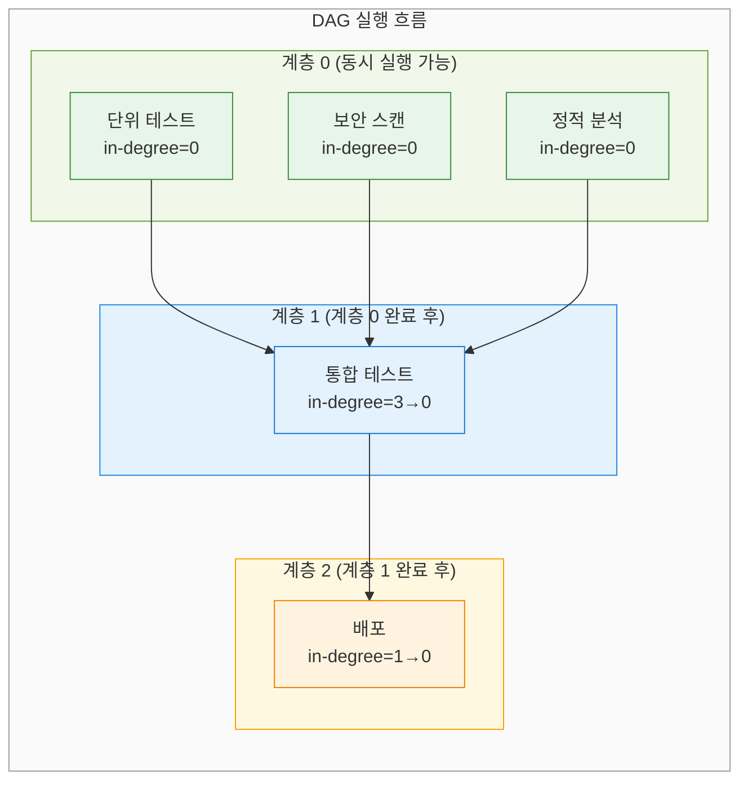

### 6-4. 실시간 의존성 해소 방식

메시지큐 기반 DAG 실행에서 in-degree 카운터 감소는 노드 완료 이벤트를 수신할 때 발생합니다. Consumer가 작업 완료 메시지를 받으면 해당 노드의 후행 노드들의 in-degree를 원자적으로 감소시킵니다. in-degree가 0이 된 노드는 즉시 메시지큐에 새 작업으로 발행됩니다.

이 과정을 Java의 `CompletableFuture`로 표현하면 다음과 같습니다. 각 노드의 완료가 후행 노드의 실행을 트리거하는 리액티브 체인이 됩니다.

### 6-5. Java CompletableFuture 기반 DAG 실행기

실제 구현에서는 각 노드를 `CompletableFuture`로 표현하고, 의존 관계를 `thenCompose`/`thenCombine`으로 연결합니다. 다음은 DAG 실행기의 핵심 로직입니다:

```java
public class DagExecutor {

    private final ExecutorService threadPool;

    public DagExecutor(ExecutorService threadPool) {
        this.threadPool = threadPool;
    }

    /**
     * DAG를 위상 정렬하여 병렬 실행한다.
     * @param nodes  전체 노드 목록
     * @param edges  의존 관계 (edge[i] = (from, to): from 완료 후 to 실행 가능)
     */
    public CompletableFuture<Void> execute(
        List<DagNode> nodes
        , List<DagEdge> edges
    ) {
        // in-degree 초기화
        Map<String, Integer> inDegree = new HashMap<>();
        Map<String, List<String>> successors = new HashMap<>();

        for (DagNode node : nodes) {
            inDegree.put(node.getId(), 0);
            successors.put(node.getId(), new ArrayList<>());
        }
        for (DagEdge edge : edges) {
            inDegree.merge(edge.getTo(), 1, Integer::sum);
            successors.get(edge.getFrom()).add(edge.getTo());
        }

        // 노드별 CompletableFuture 저장소
        Map<String, CompletableFuture<Void>> futures = new ConcurrentHashMap<>();

        // in-degree = 0인 노드를 즉시 실행
        for (DagNode node : nodes) {
            if (inDegree.get(node.getId()) == 0) {
                futures.put(node.getId(), submitNode(node));
            }
        }

        // 완료 콜백: 후행 노드의 in-degree 감소 → 0이 되면 실행
        for (DagNode node : nodes) {
            futures.computeIfAbsent(node.getId(), id -> new CompletableFuture<>())
                .thenRun(() -> {
                    for (String successorId : successors.get(node.getId())) {
                        int remaining = inDegree.merge(successorId, -1, Integer::sum);
                        if (remaining == 0) {
                            DagNode successor = findNode(nodes, successorId);
                            futures.put(successorId, submitNode(successor));
                        }
                    }
                });
        }

        // 모든 노드 완료를 기다린다
        return CompletableFuture.allOf(
            futures.values().toArray(new CompletableFuture[0])
        );
    }

    private CompletableFuture<Void> submitNode(DagNode node) {
        return CompletableFuture.runAsync(node::execute, threadPool);
    }

    private DagNode findNode(List<DagNode> nodes, String id) {
        return nodes.stream()
            .filter(n -> n.getId().equals(id))
            .findFirst()
            .orElseThrow();
    }
}
```

이 구현에서 주목할 점은 `inDegree.merge(successorId, -1, Integer::sum)`입니다. `ConcurrentHashMap.merge()`는 원자적으로 동작하므로 여러 선행 노드가 동시에 완료되어 같은 후행 노드의 in-degree를 감소시켜도 정확하게 동작합니다. in-degree가 정확히 0이 될 때 한 번만 `submitNode()`를 호출합니다.

메시지큐와 통합하는 경우, `submitNode()`가 로컬 스레드풀 대신 메시지를 토픽에 발행하고, Worker Consumer가 작업을 실행한 후 완료 이벤트를 발행합니다. DAG 실행기는 완료 이벤트를 소비하면서 in-degree를 감소시키는 방식으로 분산 환경에서도 동일한 패턴을 적용할 수 있습니다.


## 7. 패턴 비교와 선택 기준

### 7-1. 비교 테이블

세 패턴은 복잡도와 확장성의 트레이드오프 위에 놓여 있습니다. 적절한 패턴 선택을 위해 주요 속성을 비교합니다:

| 속성 | Batch Coordinator | 2-토픽 파이프라인 | 단일 파티션 + 인프로세스 |
|------|:-----------------:|:-----------------:|:------------------------:|
| 아키텍처 복잡도 | 높음 | 중간 | 낮음 |
| 수평 확장성 | 높음 (Worker 추가) | 높음 (파티션 + Worker) | 없음 (단일 Consumer) |
| 순서 보장 강도 | Coordinator 구현 의존 | 구조적 보장 (control 토픽) | 구조적으로 자명 |
| 장애 복구 복잡도 | 높음 (Coordinator HA 필요) | 중간 (오프셋 기반 재개) | 낮음 (오프셋 기반 재시작) |
| 감사 추적 | 별도 구현 필요 | control 토픽이 이력 제공 | 오프셋 외 이력 없음 |
| 적합 처리량 | 높음 (수만 건/초) | 높음 (수만 건/초) | 중간 (수천 건/초) |
| 상태 저장소 필요 | 필요 (DB/Redis) | 불필요 (토픽이 상태) | 불필요 |

### 7-2. 의사결정 플로우차트

어떤 패턴을 선택할지 결정하는 기준을 순서도로 정리합니다. 묶음 간 순서 보장이 필요한지 여부가 첫 번째 갈림길이고, 처리량 요구사항과 감사 추적 필요성이 그다음 기준이 됩니다.

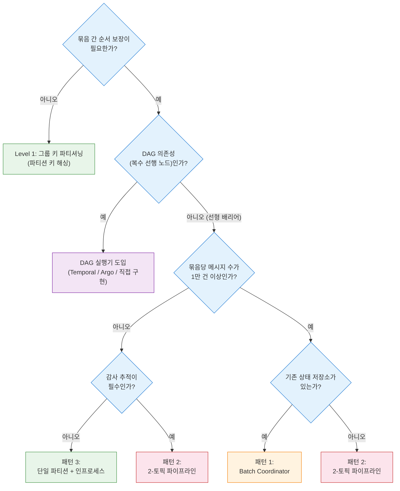

### 7-3. 선택 기준 정리

패턴 선택의 핵심은 "현재 시스템이 실제로 필요로 하는 복잡도 수준"을 파악하는 것입니다. 순서 보장이 필요 없다면 Kafka의 기본 파티셔닝만으로 충분하고, 복잡한 패턴은 불필요한 운영 부담을 가져옵니다.

**패턴 3 (단일 파티션 + 인프로세스)**는 묶음당 수천 건 이하이고 수평 확장이 필요 없으며 운영 단순성이 최우선인 경우에 선택합니다. 결제 정산, 일일 보고서 생성, 소규모 ETL이 해당합니다.

**패턴 2 (2-토픽 파이프라인)**는 감사 추적이 중요하거나 처리량이 패턴 3의 한계를 넘거나 기존 인프라에 상태 저장소가 없는 경우에 선택합니다. `control` 토픽의 이벤트 로그가 자동 감사 추적이 되므로 규제 환경에 유리합니다.

**패턴 1 (Batch Coordinator)**는 이미 Redis나 데이터베이스를 중앙 상태 저장소로 운영 중이고, 수만 건 이상의 대규모 묶음을 처리해야 하며, Worker 풀을 독립적으로 확장해야 하는 경우에 선택합니다.

**DAG 실행기**는 세 패턴 모두 선형 배리어 구조를 전제하고 있습니다. 복수의 선행 노드를 기다려야 하거나 의존 관계가 코드가 아닌 데이터(설정 파일, DB)로 정의되어야 하는 경우, Temporal이나 Argo Workflows 같은 전용 워크플로우 엔진 도입을 검토하거나 6절의 접근법으로 직접 구현합니다.


## Sources

- Martin Fowler, *Patterns of Enterprise Application Architecture* (Addison-Wesley, 2002): 배리어 패턴 및 배치 처리 개념의 원천
- Neha Narkhede, Gwen Shapira, Todd Palino, *Kafka: The Definitive Guide* (O'Reilly, 2nd ed.): 파티션 내 순서 보장 및 Consumer API 공식 해설
- Confluent, "Multi-Threaded Message Consumption with the Apache Kafka Consumer" — https://www.confluent.io/blog/kafka-consumer-multi-threaded-messaging/
- Confluent, "Exactly-Once Semantics Are Possible: Here's How Kafka Does It" — https://www.confluent.io/blog/exactly-once-semantics-are-possible-heres-how-apache-kafka-does-it/
- Uber Engineering Blog, "Cadence: The Fault-Tolerant Stateful Code Platform": 분산 워크플로우 엔진(Temporal 전신)에서 DAG 의존성 관리 방식
- Apache Kafka Documentation, "Consumer API" — https://kafka.apache.org/documentation/#consumerapi
- Kahn, A. B. (1962), "Topological sorting of large networks", *Communications of the ACM*, 5(11), 558–562 — https://doi.org/10.1145/368996.369025
