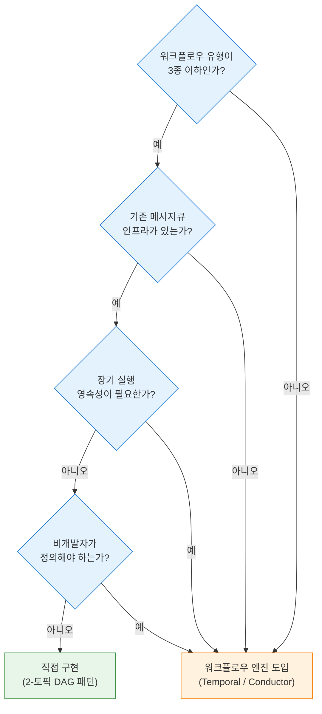

# DAG 워크플로우 엔진: 사례와 구현
---
> 실제 대규모 워크플로우 엔진의 접근법을 비교하고, Spring Boot + Redpanda로 2-토픽 DAG 패턴과 인프로세스 DAG 실행기를 구현하는 방법을 다룹니다.

## 1. 워크플로우 엔진 비교

대규모 분산 시스템에서 DAG(Directed Acyclic Graph, 방향 비순환 그래프) 기반 워크플로우 오케스트레이션은 공통적으로 해결해야 할 문제입니다. 업계 주요 플랫폼들이 이 문제를 어떻게 접근하는지 살펴보면, 직접 구현 시 무엇을 고려해야 하는지 명확해집니다.

### 1-1. 주요 엔진 개요

**Uber Cadence**는 Uber가 내부 마이크로서비스 오케스트레이션을 위해 개발하여 오픈소스로 공개한 워크플로우 엔진입니다. 

- 월 120억 건 이상의 워크플로우를 처리하는 것으로 알려져 있으며, 워크플로우 정의를 코드(Go/Java)로 작성하는 방식을 채택합니다. 
- Kafka를 내부 이벤트 버스로 통합하여 워크플로우 상태 변화를 토픽에 기록하고, 이를 통해 장애 복구 시 정확한 지점부터 재개할 수 있습니다.

**Netflix Conductor**는 Netflix가 마이크로서비스 워크플로우 오케스트레이션을 위해 개발한 엔진으로, DSL(Domain Specific Language) 기반의 JSON/YAML 워크플로우 정의가 특징입니다. 

- REST API를 통해 워크플로우를 정의하고 실행하며, Worker는 폴링 방식으로 태스크를 가져가 처리합니다. 
- 코드 기반 엔진에 비해 비개발자도 워크플로우를 정의할 수 있다는 장점이 있습니다.

**Temporal**은 Cadence 핵심 개발자들이 분리해 만든 후속 엔진으로, Cadence의 API를 개선하고 다중 언어(Go, Java, TypeScript, Python, .NET)를 지원합니다. 

- 워크플로우를 일반 코드처럼 작성하지만 자동으로 영속성(durability)이 보장되며, `workflow.Sleep(30 * 24 * time.Hour)` 같이 수십 일간의 대기도 단순 함수 호출로 표현할 수 있습니다. 
- Temporal의 DAG 지원 방식은 Go 채널과 코루틴 패턴으로 의존 관계를 표현하며, 포럼(Temporal Community Forum) 기준 가장 활발한 커뮤니티를 보유합니다.

**Apache Airflow**는 Python 코드로 DAG를 정의하는 데이터 파이프라인 오케스트레이터입니다. 

- 스케줄 기반 실행이 강점이며, Kafka Provider를 통해 Redpanda/Kafka와 직접 연동이 가능합니다. 
- Platformatory의 연구에 따르면 Airflow + Kafka 조합은 배치 데이터 파이프라인에서 광범위하게 사용되지만, 실시간 이벤트 기반 오케스트레이션에는 Temporal이나 Conductor가 더 적합합니다.

### 1-2. 비교 테이블

다음 표는 네 엔진을 주요 속성 기준으로 비교합니다:

| 엔진 | 정의 언어 | DAG 지원 | 메시지큐 통합 | 확장성 | 학습 곡선 |
|------|----------|---------|------------|-------|---------|
| Uber Cadence | Go / Java | 코드 기반 의존성 | Kafka 내장 | 매우 높음 | 높음 |
| Netflix Conductor | JSON / YAML DSL | DSL 선언형 | 폴링 기반 | 높음 | 중간 |
| Temporal | Go / Java / TS / Python | 코드 기반 의존성 | 플러그인 | 매우 높음 | 높음 |
| Apache Airflow | Python | Python DAG 객체 | Kafka Provider | 중간 | 낮음 |

### 1-3. 선택 기준

엔진 선택은 주로 세 가지 축에서 결정됩니다. 

1. 워크플로우 정의 주체가 개발자인지 비개발자인지 여부입니다. 개발자가 정의한다면 코드 기반 엔진(Temporal, Cadence)이 타입 안전성과 IDE 지원 면에서 유리합니다. 
2. 실시간 이벤트 트리거가 필요한지 스케줄 기반인지 여부입니다.
3. 팀의 인프라 운영 역량입니다. Temporal과 Cadence는 자체 클러스터를 운영해야 하므로 운영 부담이 상당합니다.

소규모 팀에서 Jenkins 파이프라인 오케스트레이션처럼 특정 도메인에 국한된 워크플로우라면, 외부 엔진 도입 대신 이 문서에서 다루는 직접 구현이 더 현실적인 선택이 됩니다.

## 2. 자체 구현 vs 워크플로우 엔진 도입

### 2-1. 분기점

워크플로우 엔진 도입을 검토할 때 가장 먼저 물어야 할 질문은 **"이 워크플로우가 도메인에 특화되어 있는가, 아니면 범용적인가?"**입니다. 

- 도메인에 특화된 워크플로우(예: Jenkins 파이프라인 오케스트레이션, 주문 처리 흐름)는 직접 구현이 외부 엔진 학습·운영 비용을 상쇄합니다. 
- 반면 조직 전체에서 수십 종류의 워크플로우를 공통 플랫폼으로 관리해야 한다면 범용 엔진이 합리적입니다.

### 2-2. 직접 구현이 적합한 조건

직접 구현을 선택할 때는 다음 조건이 충족되는지 확인합니다:

- 워크플로우 유형이 3종 이하이고, 각각의 DAG 구조가 안정적으로 고정되어 있을 때
- 기존 메시지큐 인프라(Redpanda, Kafka)가 이미 존재하여 추가 인프라 도입 없이 구현 가능할 때
- 팀 규모가 소규모여서 외부 엔진의 운영(HA 구성, 업그레이드, 모니터링) 부담을 감당하기 어려울 때
- 실시간 Jenkins 파이프라인 트리거처럼 특정 외부 시스템과의 밀결합이 필요하여 범용 Worker 인터페이스로 맞추기 어려울 때

### 2-3. 워크플로우 엔진 도입이 적합한 조건

반대로 외부 엔진이 적합한 조건은 다음과 같습니다:

- 워크플로우 종류가 지속적으로 늘어나고 비개발자가 정의해야 하는 경우(Conductor의 DSL 방식 유효)
- 장기 실행(수일 ~ 수주) 워크플로우에서 영속성과 재개(resume) 기능이 필수적인 경우
- 여러 팀이 동일 플랫폼에서 워크플로우를 관리해야 하는 경우(거버넌스와 가시성 요구)
- 워크플로우 디버깅, 재실행, 버전 관리 기능을 직접 구현할 리소스가 없는 경우

### 2-4. SmartLunch Redpanda 사례

SmartLunch는 기업 점심 서비스 플랫폼으로, 주문 처리 워크플로우를 Kafka 기반으로 운영하다 Redpanda로 무중단 전환한 사례를 공개했습니다. 전환의 핵심은 **Redpanda가 Kafka API와 완전 호환**되어 애플리케이션 코드를 한 줄도 수정하지 않았다는 점입니다. 브로커 설정만 변경한 후 순차적으로 파티션을 마이그레이션했으며, 처리 지연은 평균 10분의 1로 감소했습니다. 이 사례는 "Kafka로 구현한 워크플로우 로직은 Redpanda에서 그대로 작동한다"는 것을 보여주며, 본 문서에서 다루는 Spring Boot + Redpanda 구현이 Kafka 환경에서도 동일하게 동작함을 의미합니다.

### 2-5. 의사결정 플로우차트

### 2-6. MQ 선택 가이드

자체 구현을 결정했다면 다음 질문은 "어떤 메시지큐를 쓸 것인가"이다. DAG 워크플로우에서 메시지큐는 태스크 디스패치와 상태 이벤트 전달이라는 두 가지 역할을 맡는데, RabbitMQ와 Kafka/Redpanda는 이 두 역할에 대한 접근 방식이 근본적으로 다르다.

**RabbitMQ가 자연스러운 경우:**

- 하나의 태스크를 하나의 Worker가 가져가서 ACK하고 완료하는 "작업 큐" 모델이 핵심일 때
- 실패 시 NACK → 재큐잉 또는 DLQ 전환이 직관적이어야 할 때
- Jenkins 같은 외부 시스템에 작업을 트리거하고 완료를 기다리는 패턴이 많을 때

RabbitMQ는 메시지 단위 ACK/NACK과 delivery acknowledgement timeout을 운영상 중요한 특성으로 가진다. quorum queue는 ACK 기반 복제에 크게 의존하므로, 메시지 단위 완료 확인이 자연스럽게 내장되어 있다.

**Kafka/Redpanda가 자연스러운 경우:**

- 태스크 명령보다 이벤트 스트림이 중심일 때
- 완료 이벤트, 상태 변경 이벤트, 감사 로그를 기록하고 필요 시 replay해야 할 때
- 여러 소비자가 같은 이벤트를 각자의 목적으로 독립 소비해야 할 때

Kafka는 같은 키를 같은 파티션에 기록하여 키 단위 순서를 보장한다. consumer group 모델 덕분에 여러 소비자 그룹이 동일 토픽을 독립적으로 읽을 수 있고, offset reset으로 과거 이벤트를 재처리할 수 있다.

**비교 테이블:**

| 속성 | RabbitMQ | Kafka/Redpanda |
|------|----------|----------------|
| 핵심 모델 | 작업 큐 (Consumer 경쟁) | 이벤트 로그 (파티션 순서) |
| 완료 확인 | ACK/NACK per message | Consumer offset commit |
| 재처리 | NACK → 재큐잉/DLQ | Offset reset → replay |
| 다중 소비 | Exchange routing | Consumer Group 독립 소비 |
| 순서 보장 | 큐 단위 | 파티션 단위 |

**추천 조합과 단일 선택 기준:**

두 시스템을 함께 운영할 수 있다면 역할 분리가 가장 깔끔하다. 작업 디스패치(태스크 지시)에는 RabbitMQ를, 상태 이벤트·감사 로그·분석 용도에는 Kafka 또는 Redpanda를 사용하는 조합이다.

하나만 써야 한다면 워크플로우의 성격으로 결정한다. 단순한 작업 실행기에 가깝다면 RabbitMQ가 운영 부담이 적다. 이벤트 플랫폼까지 함께 구축하려면 Kafka/Redpanda가 확장성 면에서 유리하다. 본 시리즈에서 Redpanda를 선택한 이유는 후자에 해당하기 때문이다. 파이프라인 실행 이벤트를 감사 로그로 남기고, 모니터링 시스템이 같은 토픽을 독립 소비하며, 장애 시 offset replay로 상태를 복구하는 구조가 필요했다.

## Sources

- Uber Engineering Blog, "Cadence 1.0" (2023): Cadence가 처리하는 월 120억 건 워크플로우 규모와 Kafka 통합 상세
- Netflix Conductor vs Temporal vs Cadence 비교 분석 (Medium, Distributed Systems Engineering): 세 엔진의 DSL vs 코드 기반 설계 철학 차이
- Platformatory, "Kafka + Airflow Integration" (2024): Airflow Kafka Provider를 통한 데이터 파이프라인 연동 패턴
- Redpanda Blog, "SmartLunch Redpanda 전환 사례": Kafka → Redpanda 무중단 마이그레이션, 코드 무수정 10x 지연 감소
- Temporal Community Forum, "DAG Workflow Orchestration with Kafka" — https://community.temporal.io/t/dag-workflow-with-kafka/
- Confluent, "Multi-Threaded Message Consumption with the Apache Kafka Consumer" — https://www.confluent.io/blog/kafka-consumer-multi-threaded-messaging/
- 내부 문서: `write/99_ETC/분석/jenkins-pipeline-batch-ordering.md` — 2-토픽 패턴 매핑 및 시나리오 정의
- 내부 문서: `write/99_ETC/분석/jenkins-pipeline-batch-ordering-impl.md` — Avro 스키마, 패키지 구성, 핵심 컴포넌트 구현 설계
- 내부 문서: `write/99_ETC/분석/kafka-api-batch-ordering-primitives.md` — pause/resume 배리어 의사 코드 및 접근법 비교
