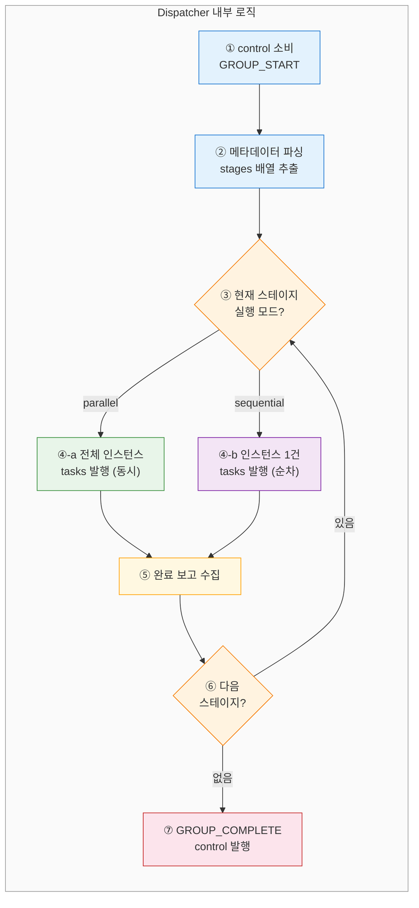
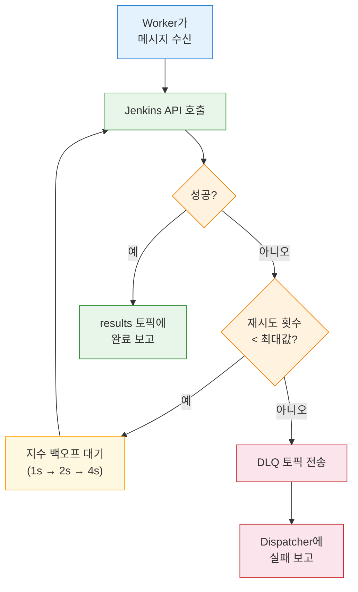
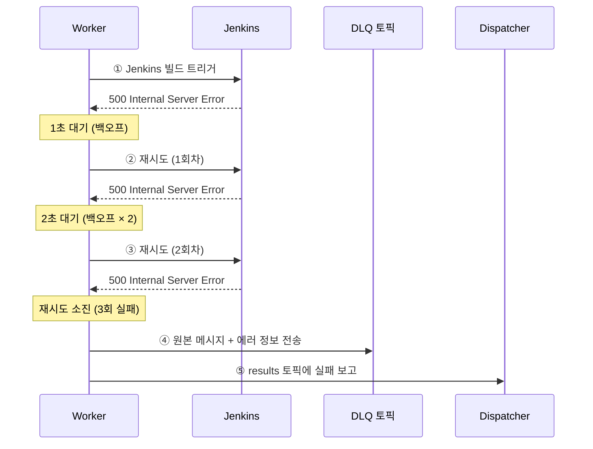
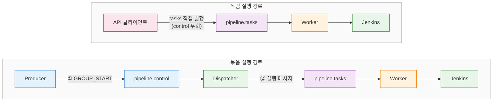

# Spring Boot + Redpanda 구현: 2-토픽 DAG 패턴

---

> 2-토픽 DAG 패턴의 핵심 아이디어는 **제어 흐름과 작업 실행을 분리**하는 것입니다. 
>
> - `pipeline.control` 토픽(1파티션)이 DAG의 묶음 경계와 순서를 보장
> - `pipeline.tasks` 토픽(N파티션)이 실제 작업을 병렬 처리합니다. 이 분리 덕분에 전역 순서 보장과 높은 처리량을 동시에 달성할 수 있습니다.

## 토픽 설계

토픽 네이밍은 `{도메인}.{역할}` 패턴을 따른다. 파이프라인 오케스트레이션 도메인에 네 가지 토픽을 구성한다:

- `pipeline.control`: 1파티션. 묶음 생명주기 이벤트(`GROUP_START`, `GROUP_COMPLETE`)를 순서대로 전달합니다. 1파티션으로 제한하는 이유는 묶음 간 전역 순서를 보장하기 위해서입니다.
- `pipeline.tasks`: 3파티션 이상. 개별 파이프라인 실행 메시지를 전달합니다. 파티션 키는 `{groupId}-{stageType}`으로, 같은 스테이지 타입의 메시지가 동일 파티션에 들어갑니다.
- `pipeline.results`: 3파티션 이상. Worker의 완료 보고를 전달한다. 파티션 키는 `groupId`로, Dispatcher가 묶음별로 결과를 수집한다.
- `pipeline.tasks.dlq`: 1파티션. 재시도를 소진한 실패 메시지를 격리한다. 운영자가 원인을 분석한 뒤 수동으로 `pipeline.tasks`에 재발행하여 재처리할 수 있다.

`results`를 별도 토픽으로 분리하는 이유는 방향성 때문이다. `tasks`는 Dispatcher → Worker 방향이고 `results`는 Worker → Dispatcher 방향입니다. 양방향 메시지를 같은 토픽에 섞으면 Consumer Group 설계가 불필요하게 복잡해집니다.

### 토픽명 상수

```java
/** 파이프라인 토픽명 상수 — 매직 스트링 방지를 위해 한 곳에서 관리한다. */
@UtilityClass
public class PipelineTopics {

    public static final String CONTROL   = "pipeline.control";    // 묶음 생명주기 이벤트 (1파티션, 전역 순서 보장)
    public static final String TASKS     = "pipeline.tasks";      // 개별 파이프라인 실행 메시지 (N파티션, 병렬 처리)
    public static final String RESULTS   = "pipeline.results";    // Worker → Dispatcher 완료 보고
    public static final String TASKS_DLQ = "pipeline.tasks.dlq";  // 재시도 소진 후 실패 메시지 격리
}
```

### 토픽 생성

```java
/** 파이프라인 토픽 자동 생성 설정 — Spring Boot 기동 시 존재하지 않는 토픽을 생성한다. */
@Configuration
public class PipelineTopicConfig {

    // control: 1파티션으로 제한하여 묶음 간 전역 순서를 보장한다.
    @Bean
    public NewTopic pipelineControl() {
        return TopicBuilder.name(PipelineTopics.CONTROL)
                .partitions(1)
                .replicas(1)
                .build();
    }

    // tasks: 3파티션 이상으로 Worker 병렬 소비를 허용한다.
    @Bean
    public NewTopic pipelineTasks() {
        return TopicBuilder.name(PipelineTopics.TASKS)
                .partitions(3)
                .replicas(1)
                .build();
    }

    // results: groupId를 파티션 키로 사용하여 묶음별 결과가 같은 파티션에 모인다.
    @Bean
    public NewTopic pipelineResults() {
        return TopicBuilder.name(PipelineTopics.RESULTS)
                .partitions(3)
                .replicas(1)
                .build();
    }

    // DLQ: 재시도 소진 후 실패한 메시지를 격리한다. 1파티션이면 충분하다.
    @Bean
    public NewTopic pipelineTasksDlq() {
        return TopicBuilder.name(PipelineTopics.TASKS_DLQ)
                .partitions(1)
                .replicas(1)
                .build();
    }
}
```


## Avro 스키마 설계

`PipelineGroupStart.avsc`는 묶음 메타데이터를 담으며, `stages` 배열 안에 중첩 레코드를 사용하여 스테이지 구성을 표현합니다:

```json
{
  "type": "record",
  "name": "PipelineGroupStart",
  "namespace": "com.study.redpanda.avro",
  "doc": "파이프라인 묶음 시작 이벤트 (control 토픽)",
  "fields": [
    {"name": "eventId",   "type": "string", "default": ""},
    {"name": "eventType", "type": "string", "default": "PIPELINE_GROUP_START"},
    {"name": "timestamp", "type": "long",   "default": 0, "logicalType": "timestamp-millis"},
    {"name": "groupId",   "type": "string", "doc": "묶음 고유 ID"},
    {"name": "stages",    "type": {"type": "array", "items": {
      "type": "record",
      "name": "StageDefinition",
      "fields": [
        {"name": "stageType", "type": "string", "doc": "build | test | deploy"},
        {"name": "mode",      "type": "string", "doc": "parallel | sequential"},
        {"name": "onFailure", "type": "string", "doc": "fail-fast | continue", "default": "fail-fast"},
        {"name": "instances", "type": {"type": "array", "items": {
          "type": "record",
          "name": "PipelineInstance",
          "fields": [
            {"name": "pipelineId",   "type": "string"},
            {"name": "pipelineName", "type": "string"},
            {"name": "parameters",   "type": ["null", "string"], "default": null}
          ]
        }}}
      ]
    }}}
  ]
}
```

`PipelineGroupComplete.avsc`는 묶음 완료 이벤트로, 전체 결과 요약을 포함합니다:

```json
{
  "type": "record",
  "name": "PipelineGroupComplete",
  "namespace": "com.study.redpanda.avro",
  "doc": "파이프라인 묶음 완료 이벤트 (control 토픽)",
  "fields": [
    {"name": "eventId",        "type": "string",  "default": ""},
    {"name": "eventType",      "type": "string",  "default": "PIPELINE_GROUP_COMPLETE"},
    {"name": "timestamp",      "type": "long",    "default": 0, "logicalType": "timestamp-millis"},
    {"name": "groupId",        "type": "string",  "doc": "묶음 고유 ID"},
    {"name": "success",        "type": "boolean", "doc": "전체 성공 여부"},
    {"name": "totalPipelines", "type": "int",     "doc": "전체 파이프라인 수"},
    {"name": "failedCount",    "type": "int",     "doc": "실패 파이프라인 수", "default": 0},
    {"name": "durationMs",     "type": "long",    "doc": "묶음 전체 소요 시간 (ms)"}
  ]
}
```

`eventId`와 `timestamp`에 `default`를 설정한 이유는 기존 `CqrsEventPublisher` 패턴과 동일합니다. Publisher가 `send()` 직전에 UUID v7과 현재 시각을 자동 주입하므로, 빌더에서 이 필드를 생략해도 됩니다.


## PipelineDispatcher

`PipelineDispatcher`는 두 개의 `@KafkaListener`를 갖는 오케스트레이션 컴포넌트입니다. 

`control` 토픽에서 묶음 이벤트를 소비하고, `results` 토픽에서 완료 보고를 수집합니다. `concurrency = "1"` 설정이 필수입니다. 1파티션 토픽에 Consumer가 2개 이상 존재하면 하나는 유휴 상태가 되며, 더 중요하게는 `onGroupStart` 핸들러가 동시에 두 묶음을 처리하는 상황을 방지해야 합니다.

```java
/**
 * 파이프라인 오케스트레이터 — control 토픽에서 묶음 이벤트를 소비하고,
 * results 토픽에서 완료 보고를 수집하여 스테이지를 순차 진행한다.
 */
@Component
@RequiredArgsConstructor
public class PipelineDispatcher {

    private final StageExecutor stageExecutor;
    private final GroupStateTracker stateTracker;
    private final PipelineEventPublisher publisher;

    // concurrency = "1": 1파티션 토픽이므로 Consumer 1개만 유지한다.
    @KafkaListener(
            topics = PipelineTopics.CONTROL,
            groupId = "pipeline-dispatcher",
            concurrency = "1"
    )
    public void onGroupStart(PipelineGroupStart event) {
      	// 진행확인
        String groupId = event.getGroupId();
        stateTracker.register(groupId, event.getStages());  // 묶음 상태 초기화

        // 스테이지를 순차 실행: 이전 스테이지 완료 후 다음 스테이지로 진행
        for (StageDefinition stage : event.getStages()) {
            stageExecutor.execute(groupId, stage);
            stateTracker.awaitStageCompletion(groupId, stage.getStageType());
        }

        // 모든 스테이지 완료 → GROUP_COMPLETE 이벤트 발행
        publisher.publish(
                PipelineTopics.CONTROL
          			, groupId
                , buildGroupComplete(groupId)
        );
    }

    // Worker의 완료 보고를 수집하여 GroupStateTracker에 기록한다.
    @KafkaListener(
            topics = PipelineTopics.RESULTS,
            groupId = "pipeline-dispatcher"
    )
    public void onResult(PipelineExecuteResponse response) {
        stateTracker.recordCompletion(
                response.getDemandId()
                , response.getEventId()
                , response.getSuccess()
        );
    }
}
```


Dispatcher 내부 흐름을 시각화하면 다음과 같습니다:



## StageExecutor

`StageExecutor`는 스테이지 실행 모드에 따라 `tasks` 발행 전략을 결정합니다. `parallel` 모드에서는 모든 인스턴스를 한꺼번에 발행하고, `sequential` 모드에서는 `GroupStateTracker`와 연동하여 1건 발행 후 완료를 대기합니다:

```java
/** 스테이지 실행 모드(parallel/sequential)에 따라 tasks 발행 전략을 결정한다. */
@Component
@RequiredArgsConstructor
public class StageExecutor {

    private final PipelineEventPublisher publisher;

    public void execute(String groupId, StageDefinition stage) {
        if ("parallel".equals(stage.getMode())) {
            executeParallel(groupId, stage);
        } else {
            executeSequential(groupId, stage);
        }
    }

    // parallel: 모든 인스턴스를 한꺼번에 발행 → Worker가 동시에 소비
    private void executeParallel(String groupId, StageDefinition stage) {
        // 파티션 키 = groupId-stageType → 같은 스테이지 메시지가 동일 파티션에 모인다
        String partitionKey = groupId + "-" + stage.getStageType();
        for (PipelineInstance instance : stage.getInstances()) {
            publisher.publish(
                    PipelineTopics.TASKS
              			, partitionKey
                    , toExecuteRequest(groupId, instance)
            );
        }
    }

    // sequential: 1건 발행 → 완료 대기 → 다음 1건 발행 (순차 보장)
    private void executeSequential(String groupId, StageDefinition stage) {
        String partitionKey = groupId + "-" + stage.getStageType();
        for (PipelineInstance instance : stage.getInstances()) {
            publisher.publish(
                    PipelineTopics.TASKS
              			, partitionKey
                    , toExecuteRequest(groupId, instance)
            );
            // GroupStateTracker.awaitInstanceCompletion() 호출
        }
    }
}
```


## PipelineWorker

`PipelineWorker`는 `tasks` 토픽을 소비하여 Jenkins API를 호출하고, 완료 결과를 `results` 토픽에 발행합니다. `concurrency = "3"`은 3개 파티션을 각각 1개 스레드가 소비하도록 합니다:

```java
/**
 * tasks 토픽을 소비하여 Jenkins API를 호출하고, 완료 결과를 results 토픽에 발행한다.
 * 재시도 소진 시 DLQ로 전송하고 Dispatcher에 실패를 보고한다.
 */
@Component
@RequiredArgsConstructor
public class PipelineWorker {

    private final JenkinsApiClient jenkinsClient;
    private final PipelineEventPublisher publisher;

    // concurrency = "3": 3개 파티션을 각각 1개 스레드가 소비한다.
    @KafkaListener(
            topics = PipelineTopics.TASKS,
            groupId = "pipeline-worker",
            concurrency = "3"
    )
    public void onTask(PipelineExecuteRequest request) {
        boolean standalone = "STANDALONE".equals(request.getDemandId());

        // Jenkins API 호출 — triggerAndWait 내부에서 빌드 완료까지 폴링한다
        JenkinsBuildResult result = jenkinsClient.triggerAndWait(
                request.getPipelineId()
                , request.getParameters()
                , request.getMaxRetryCount()
        );

        // 독립 실행(STANDALONE)은 results 발행을 건너뛴다
        if (!standalone) {
            PipelineExecuteResponse response = PipelineExecuteResponse.newBuilder()
                    .setDemandId(request.getDemandId())
                    .setSuccess(result.isSuccess())
                    .setBuildNumber(result.getBuildNumber())
                    .setDurationMs(result.getDurationMs())
                    .setStatusDetail(result.getStatusDetail())
                    .build();

            publisher.publish(
                    PipelineTopics.RESULTS, request.getDemandId()
                    , response
            );
        }
    }
}
```


## 재시도와 DLQ 정책

2-토픽 패턴에서 Worker가 Jenkins API 호출에 실패하면, 메시지를 즉시 버리거나 무한 재시도하는 것이 아니라 **제한된 횟수만큼 지수 백오프로 재시도한 뒤 DLQ로 격리**하는 전략을 사용한다. Spring Kafka의 `DefaultErrorHandler`와 `DeadLetterPublishingRecoverer`를 조합하면 이 패턴을 선언적으로 구성할 수 있다:

```java
/**
 * Worker Consumer의 에러 핸들링 설정 — 재시도 소진 시 DLQ로 전송한다.
 * DefaultErrorHandler가 레코드 단위 재시도를 수행하고,
 * DeadLetterPublishingRecoverer가 DLQ 토픽에 원본 메시지를 발행한다.
 */
@Configuration
public class WorkerErrorHandlerConfig {

    @Bean
    public DefaultErrorHandler workerErrorHandler(KafkaTemplate<String, byte[]> template) {
        // DLQ 전송기: 원본 레코드를 pipeline.tasks.dlq 토픽으로 발행한다
        DeadLetterPublishingRecoverer recoverer = new DeadLetterPublishingRecoverer(
                template
                , (record, ex) -> new TopicPartition(PipelineTopics.TASKS_DLQ, -1)
        );

        // 지수 백오프: 1초 → 2초 → 4초, 최대 3회 재시도
        ExponentialBackOff backOff = new ExponentialBackOff(1000L, 2.0);
        backOff.setMaxElapsedTime(7000L);  // 1 + 2 + 4 = 7초 내 3회

        return new DefaultErrorHandler(recoverer, backOff);
    }
}
```

재시도와 DLQ의 전체 흐름은 다음과 같다:



시간 축으로 보면 재시도 간격이 지수적으로 증가하는 과정을 확인할 수 있다:



`DeadLetterPublishingRecoverer`는 원본 레코드의 헤더에 `kafka_dlt-exception-fqcn`, `kafka_dlt-exception-message` 등을 자동으로 첨부한다. 운영자는 DLQ 메시지를 조회할 때 이 헤더를 통해 실패 원인을 즉시 파악할 수 있다.


## 독립 실행 경로

독립 실행(Standalone)은 `control` 토픽을 거치지 않고 `tasks` 토픽에 직접 메시지를 발행합니다. `demandId`를 `"STANDALONE"`으로 설정하면 Worker가 `results` 발행을 건너뜁니다. 묶음 실행과 독립 실행이 동일한 `tasks` 토픽과 Worker 풀을 공유하므로, 인프라를 이중으로 관리할 필요가 없습니다.

두 실행 경로를 비교하면 다음과 같습니다:




## 두 구현의 비교

2-토픽 패턴과 인프로세스 DAG 실행기는 같은 문제를 다른 레벨에서 해결합니다. 둘 중 어느 것을 선택할지는 처리량, 확장성, 운영 복잡도를 종합적으로 고려해야 합니다:

| 속성          | 2-토픽 DAG 패턴                 | 인프로세스 DAG 실행기     |
| ------------- | ------------------------------- | ------------------------- |
| 구현 복잡도   | 높음 (Dispatcher + Worker 분리) | 낮음 (단일 Consumer)      |
| 수평 확장     | 가능 (Worker 인스턴스 추가)     | 제한적 (단일 파티션 필요) |
| 장애 복구     | 브로커 오프셋 기반 재개         | 인메모리 상태 유실 위험   |
| 적합 시나리오 | 고처리량 다단계 오케스트레이션  | 소규모 배치, 단순 DAG     |
| 외부 의존성   | Redpanda (3개 토픽)             | Redpanda (1개 토픽)       |
