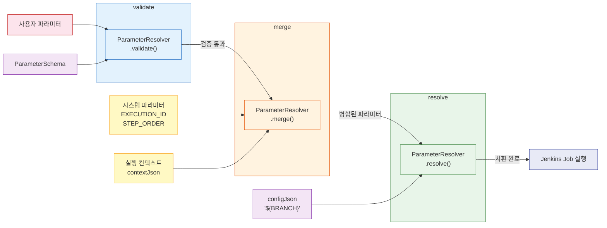
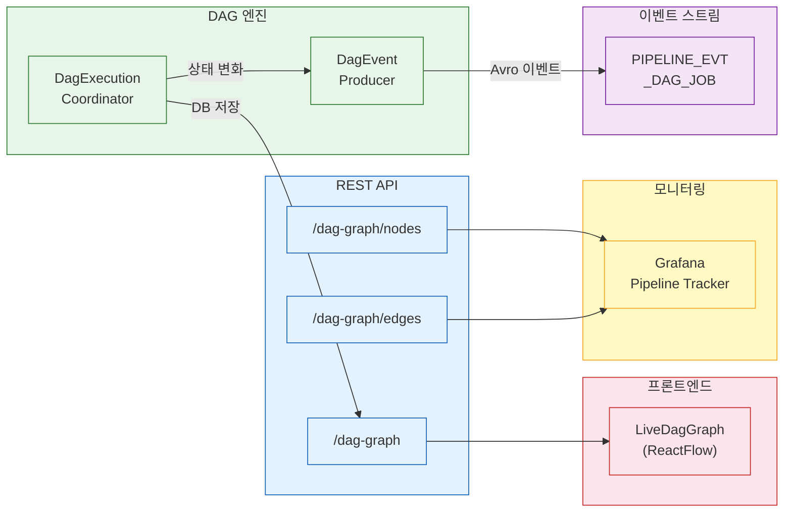
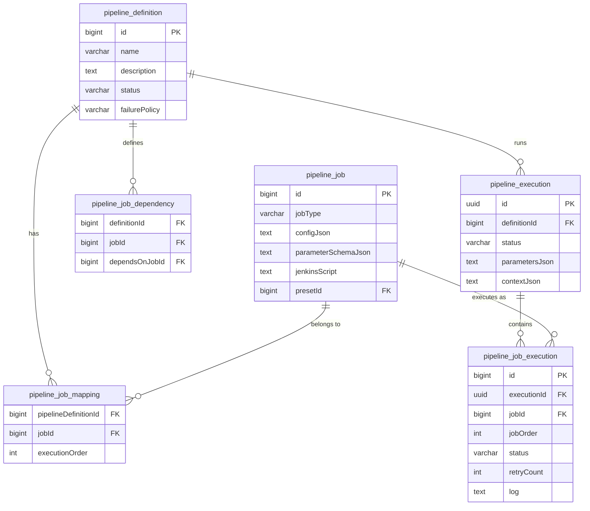

# DAG 엔진 파라미터와 운영 인프라
---
> 파라미터 주입, 실행 컨텍스트, 시각화, DB 모델, 패키지 결합 분석을 설계와 코드를 한 흐름으로 다룬다. 핵심 설계(2-토픽 DAG 패턴 아키텍처)는 04-01에서, 운영 심화(크래시 복구, 재시도/DLQ 체계)는 04-03에서 다룬다.


## 1. 파라미터 시스템

같은 파이프라인 정의를 develop 브랜치와 release 브랜치에 각각 실행하려면 정의 자체를 복제할 것이 아니라, 가변 부분만 파라미터로 주입해야 한다. 파라미터 시스템은 configJson 내부의 `${PARAM_NAME}` 플레이스홀더를 실제 값으로 치환하는 메커니즘이다.

### 1-1. ParameterSchema -- 선언

각 PipelineJob은 자신이 기대하는 파라미터를 `ParameterSchema` record로 선언한다. `PipelineJob.parameterSchemaJson` 필드에 JSON 배열로 저장되며, `parameterSchemas()` 메서드가 역직렬화를 수행한다:

```java
record ParameterSchema(
    String name,           // [A-Za-z0-9_]만 허용
    String type,           // STRING, NUMBER, BOOLEAN (UI 힌트용)
    String defaultValue,   // 미입력 시 적용할 기본값
    boolean required       // true면 반드시 제공해야 함
)
```

`type` 필드는 런타임 검증에 사용되지 않는다. 프론트엔드에서 입력 필드 종류를 결정하는 힌트 역할이고, 실제 값은 모두 문자열로 처리한다. 런타임 타입 검증이 필요해지면 validate() 단계에서 추가하면 되므로, 현 시점에서는 의도적으로 생략했다.

### 1-2. 3단계 처리 파이프라인

파라미터 처리는 validate, merge, resolve 세 단계를 순서대로 거친다. 검증을 먼저 통과해야 시스템 파라미터와 안전하게 병합할 수 있고, 병합된 전체 맵이 있어야 치환이 완전하기 때문이다.

**validate** -- `ParameterResolver.validate()`는 사용자 파라미터 맵을 스키마와 대조한다. `required=true`인 스키마에 해당 키가 없으면 `IllegalArgumentException`을 던진다. 사용자가 값을 생략했지만 `defaultValue`가 정의된 경우에는 기본값을 자동 적용한다. 실행 전에 검증하는 이유는 Jenkins Job이 시작된 뒤 파라미터 오류를 발견하면 되돌리기 어렵기 때문이다.

**merge** -- `ParameterResolver.merge()`는 시스템 파라미터(`EXECUTION_ID`, `STEP_ORDER`)와 사용자 파라미터를 병합한다. 시스템 파라미터가 항상 우선하므로, 사용자가 `EXECUTION_ID`를 임의 값으로 덮어쓰는 것을 방지한다. 실행 컨텍스트(`contextJson`)의 값도 이 단계에서 함께 병합된다.

**resolve** -- `ParameterResolver.resolve()`는 configJson이나 jenkinsScript 문자열에서 `${PARAM_NAME}` 패턴을 실제 값으로 교체한다. 정규식은 `\$\{([A-Za-z0-9_]+)\}`이며, 파라미터 이름을 영숫자와 밑줄로 제한하여 `${../../etc/passwd}` 같은 경로 순회를 차단한다. 매칭된 키가 파라미터 맵에 없으면 원본 `${...}`을 그대로 남긴다.

다음은 ParameterResolver의 세 메서드를 요약한 코드다. validate가 스키마를 대조하고, merge가 시스템 파라미터를 우선 병합하며, resolve가 정규식으로 플레이스홀더를 치환하는 흐름을 보여준다:

`ParameterResolver.java`

```java
// validate: 스키마 대조 → 기본값 적용 → 필수 파라미터 누락 검사
public static Map<String, String> validate(
        List<ParameterSchema> schemas, Map<String, String> userParams) {
    var result = new HashMap<>(userParams);
    for (var schema : schemas) {
        if (!result.containsKey(schema.name())) {
            if (schema.defaultValue() != null) result.put(schema.name(), schema.defaultValue());
            else if (schema.required())
                throw new IllegalArgumentException("Required parameter missing: " + schema.name());
        }
    }
    return result;
}

// merge: 시스템 파라미터가 사용자 파라미터를 덮어쓴다
public static Map<String, String> merge(
        Map<String, String> systemParams, Map<String, String> userParams) {
    var merged = new HashMap<>(userParams);
    merged.putAll(systemParams);  // 시스템 우선
    return merged;
}

// resolve: ${PARAM_NAME} 패턴을 실제 값으로 치환
public static String resolve(String template, Map<String, String> params) {
    return Pattern.compile("\\$\\{([A-Za-z0-9_]+)}")
            .matcher(template)
            .replaceAll(m -> params.getOrDefault(m.group(1), m.group(0)));
}
```

**설계 결정.** validate에서 기본값을 적용한 결과 맵을 반환하므로, merge 단계에서는 이미 기본값이 채워진 상태로 병합이 진행된다. resolve의 정규식이 `[A-Za-z0-9_]`만 허용하기 때문에, `${../../etc/passwd}` 같은 패턴은 정규식 자체에 매칭되지 않아 원본으로 남는다.

### 1-3. E2E 흐름

다음 다이어그램은 사용자 파라미터가 최종적으로 Jenkins Job에 도달하기까지의 전체 경로를 보여준다:



### 1-4. 대안 비교

| 방식 | 특징 | 한계 | 적합 시나리오 |
|------|------|------|-------------|
| 환경변수 주입 | OS 레벨 주입, 컨테이너 친화적 | Job별 스키마 검증 불가, 누락 시 런타임 에러 | 단일 컨테이너 실행 |
| 직접 설정 오버라이드 | configJson 자체를 실행마다 교체 | 정의 재사용 불가, 공통/가변 경계 모호 | 일회성 실행 |
| 템플릿 치환 (`${PARAM}`) | 정의는 고정, 가변 부분만 플레이스홀더 | 단순 문자열 치환이라 조건 분기 불가 | CI/CD 파이프라인 |

CI/CD에서 가변 요소는 대부분 단순 값(브랜치명, 버전, 저장소 URL)이다. 템플릿 치환은 configJson의 구조를 유지하면서 가변 부분만 교체하므로, 조건 분기가 필요 없는 환경에서 가장 직관적이다.


## 2. 실행 컨텍스트

`PipelineExecution.contextJson`은 하나의 파이프라인 실행 내에서 Job 간 데이터를 전달하는 공유 저장소다. 선행 Job이 `putContext(key, value)`로 결과를 기록하면, 후속 Job이 파라미터 치환 시 `${KEY}`로 해당 값을 참조할 수 있다.

### 2-1. 대표 사례 -- BUILD에서 DEPLOY로

BUILD Job이 Nexus에 아티팩트를 업로드한 뒤 `putContext("ARTIFACT_URL", "http://nexus:8081/repo/app-1.0.0.jar")`를 호출한다. DEPLOY Job의 configJson에는 `"artifactUrl": "${ARTIFACT_URL}"`이 선언되어 있으므로, resolve 단계에서 실제 URL로 치환된다. 이 흐름 덕분에 BUILD가 생성한 아티팩트 경로를 DEPLOY가 별도 설정 없이 자동으로 전달받는다.

키 충돌을 방지하기 위해 `ARTIFACT_URL_{jobId}` 네이밍 컨벤션을 사용한다. 같은 파이프라인에 BUILD Job이 두 개 존재하더라도 각자의 jobId가 접미사로 붙으므로 값이 덮어쓰이지 않는다.

### 2-2. executeJob() 내 컨텍스트 병합

`executeJob()` 메서드에서 파라미터와 컨텍스트가 실제로 병합되는 지점을 발췌한다. 시스템 파라미터, 사용자 파라미터, 실행 컨텍스트 세 소스가 하나의 `mergedParams` 맵으로 합쳐진 뒤, configJson과 jenkinsScript 양쪽에 resolve가 적용된다:

`DagExecutionCoordinator.java:438-507` (발췌)

```java
private void executeJob(PipelineExecution execution, PipelineJob job, Integer jobOrder) {
    // ... JobExecution 조회, RUNNING 전환 ...
    var systemParams = Map.of(
            "EXECUTION_ID", execution.getId().toString()
            , "STEP_ORDER", String.valueOf(jobOrder));

    var userParams = ParameterResolver.validate(
            job.parameterSchemas(), execution.parametersMap());
    var mergedParams = ParameterResolver.merge(systemParams, userParams);

    // 실행 컨텍스트(contextJson)도 병합
    mergedParams.putAll(execution.contextMap());

    String resolvedConfig = ParameterResolver.resolve(job.getConfigJson(), mergedParams);
    String resolvedScript = ParameterResolver.resolve(job.getJenkinsScript(), mergedParams);
    // ... executor.execute() 호출 ...
}
```

**설계 결정.** 컨텍스트를 userParams 이후에 병합하는 이유는, 선행 Job이 생성한 값이 사용자 기본값보다 우선해야 하기 때문이다. 시스템 파라미터는 merge() 내부에서 이미 최우선으로 처리되므로, contextMap이 시스템 값을 덮어쓸 수는 없다.

### 2-3. 왜 key-value 맵인가

| 방식 | 장점 | 단점 |
|------|------|------|
| 파일 시스템 공유 | 대용량 전달 가능 | 분산 환경에서 파일 접근 어려움, 정리 부담 |
| 메시지 큐 전달 | 비동기, 느슨한 결합 | Job 간 순서 보장 별도 구현, 인프라 의존 과다 |
| 구조화 DTO | 타입 안전, 컴파일 타임 검증 | Job 타입 추가마다 DTO 수정 필요 |
| key-value 맵 | 스키마 없이 자유로운 전달 | 타입 안전성 없음, 키 충돌 가능 |

DAG 파이프라인에서 Job 간 전달 데이터는 대부분 단순 문자열(URL, 경로, 버전)이고, Job 타입 조합이 유동적이다. 구조화 DTO는 새 Job 타입을 추가할 때마다 수정이 필요하지만, key-value 맵은 네이밍 컨벤션만으로 충돌을 회피할 수 있다. DB에 JSON으로 직렬화되므로 크래시 복구 시에도 컨텍스트가 유실되지 않는다.


## 3. 미들웨어 프리셋

`presetId`로 인프라 접속 정보를 추상화하는 구조다. Jenkins URL, Nexus URL, GitLab URL 등을 프리셋 한 곳에서 관리하면, 사용자는 "Jenkins-Dev"같은 프리셋 이름만 선택하여 파이프라인을 구성할 수 있다.

하나의 파이프라인에 Jenkins(빌드), Nexus(아티팩트), GitLab(소스) 등 여러 미들웨어가 관여한다. 각 Job에 직접 URL을 입력하면 인프라 이전 시 모든 Job을 개별 수정해야 한다. 프리셋으로 한 단계 간접 참조를 두면 인프라 변경이 프리셋 한 곳에서 해결되고, 전체 파이프라인에 즉시 반영된다.

### 3-1. 대안 비교

| 방식 | 장점 | 단점 | 인프라 이전 비용 |
|------|------|------|----------------|
| 직접 설정 | 설정이 명시적, 추가 개발 없음 | 중복, 오타 위험 | 모든 Job 수정 |
| 환경변수 | 코드와 분리, 서버 레벨 관리 | Job별 다른 인프라 사용 어려움 | 서버 환경변수 변경 |
| 프리셋 참조 | 이름으로 선택, 상세는 프리셋이 관리 | 프리셋 관리 UI/API 추가 개발 필요 | 프리셋 1건 수정 |

환경변수는 서버 전체에 적용되기 때문에 "개발용 Jenkins"와 "스테이징용 Jenkins"를 하나의 파이프라인에서 동시에 사용하기 어렵다. 프리셋은 Job마다 다른 인프라를 참조할 수 있으므로, 멀티 환경 파이프라인 구성에 유연하다.


## 4. 크래시 복구

서버가 비정상 종료되면 메모리에 있던 `DagExecutionState`가 사라진다. DB에는 `RUNNING` 상태로 남아 있지만 실제로는 아무도 관리하지 않는 고아 실행이 된다. 크래시 복구 메커니즘은 이 간극을 메운다.

2-토픽 패턴에서는 **Kafka offset이 추가 안전망** 역할을 한다. Control Consumer가 `completionFuture.get()`으로 블로킹 중에 크래시하면 offset이 커밋되지 않으므로, 재시작 시 해당 파이프라인 메시지가 자동 재소비된다. 크래시 복구의 상세 시나리오와 @RetryableTopic/DLQ 재시도 체계는 04-03에서 다룬다.

### 4-1. 시작 시 복구 -- recoverRunningExecutions()

`@PostConstruct`로 애플리케이션 시작 시 실행된다. DB에서 `RUNNING` 또는 `WAITING_WEBHOOK` 상태인 실행을 조회한 뒤 메모리 상태를 재구성한다. 이때 크래시 시점에 `RUNNING`이나 `WAITING_WEBHOOK`이었던 Job은 `FAILED`로 전환하는 **보수적 접근**을 취한다. 외부 시스템(Jenkins)에서 실제로 성공했는지 확인할 방법이 없기 때문이다.

`DagExecutionCoordinator.java:78-168` (발췌)

```java
@PostConstruct
public void recoverRunningExecutions() {
    var runningExecutions = executionMapper.findByStatus(PipelineStatus.RUNNING.name());
    for (var execution : runningExecutions) {
        if (execution.getPipelineDefinitionId() == null) continue;
        // ... Job, 의존성, failurePolicy 로드 ...
        lock.lock();
        try {
            var state = DagExecutionState.initialize(jobs, jobIdToJobOrder, policy);
            for (var je : jobExecutions) {
                if (je.getJobId() == null) continue;
                switch (je.getStatus()) {
                    case SUCCESS -> state.markCompleted(je.getJobId());
                    case FAILED, COMPENSATED -> state.markFailed(je.getJobId());
                    case SKIPPED -> state.markSkipped(je.getJobId());
                    case RUNNING, WAITING_WEBHOOK -> {
                        jobExecutionMapper.updateStatus(je.getId()
                                , JobExecutionStatus.FAILED.name()
                                , "Failed during crash recovery (interrupted)"
                                , LocalDateTime.now());
                        state.markFailed(je.getJobId());
                    }
                    case PENDING -> { /* 그대로 둠 */ }
                }
            }
            if (state.isAllDone()) finalizeExecution(executionId, state);
            else if (state.hasFailure()) handleFailure(executionId, state, execution);
            else dispatchReadyJobs(execution);
        } finally { lock.unlock(); }
    }
}
```

**핵심 로직.** 각 JobExecution의 상태를 switch문으로 분류하되, RUNNING과 WAITING_WEBHOOK은 webhook 유실을 가정하여 FAILED로 전환한다. 재구성 후 allDone/hasFailure/정상의 3분기 판정을 적용한다.

**설계 결정.** RUNNING을 FAILED로 전환하는 보수적 접근을 택한 이유는 크래시 시점에 실행 중이던 Job의 실제 결과를 알 수 없기 때문이다. 성공을 가정하고 하류를 실행하면 중복 실행이나 데이터 부정합이 발생할 수 있으므로, 필요 시 부분 재시작 API로 수동 재개하는 편이 안전하다.

**주의할 점.** 복구 중 예외가 발생하면 해당 실행만 FAILED로 마킹하고 다음으로 넘어간다. 전체 복구 실패로 앱 시작이 블로킹되는 것을 방지하기 위함이다. `pipelineDefinitionId`가 null인 실행은 기존 순차 모드이므로 건너뛴다.

### 4-2. 주기적 정리 -- cleanupStaleExecutions()

`@Scheduled`로 주기적으로 실행되며, `staleExecutionTimeoutMinutes`를 초과한 실행을 `FAILED`로 마킹한다. 웹훅 유실이나 네트워크 장애로 완료 신호를 받지 못한 실행을 자동 정리하는 안전망 역할이다. 이미 완료된 실행의 메모리 상태도 이 시점에 제거하여 메모리 누수를 방지한다.

### 4-3. 부분 재시작

`POST /api/pipelines/{id}/executions/{executionId}/restart` API로 실패한 실행을 재시작할 수 있다. 이전 실행에서 `SUCCESS`였던 Job을 사전 등록(pre-populate)하고, `FAILED`였던 Job부터 재실행한다. 전체를 처음부터 다시 돌리지 않으므로, 이미 성공한 빌드를 중복 실행하는 낭비를 방지한다. 상세: 04-01 S6


## 5. 시각화와 모니터링

파이프라인 실행 상태를 실시간으로 확인할 수 있어야 디버깅이 가능하다. 이 엔진은 REST API, Kafka 이벤트, 프론트엔드 세 채널로 시각화를 제공한다.

### 5-1. DagGraphResponse -- 공통 포맷

`DagGraphResponse` record는 Node와 Edge 두 배열로 구성된다. Grafana Node Graph 패널과 ReactFlow 양쪽에서 소비할 수 있도록 공통 필드를 설계했다:

```java
record DagGraphResponse(List<Node> nodes, List<Edge> edges)

record Node(
    String id,        // Job ID (문자열)
    String title,     // Job 이름
    String subTitle,  // Job 타입 (BUILD, DEPLOY 등)
    String mainStat,  // 실행 상태
    String color      // 상태별 색상 코드
)

record Edge(
    String id,        // 엣지 식별자
    String source,    // 선행 Job ID
    String target     // 후속 Job ID
)
```

색상은 `PipelineDefinitionService.getDagGraph()`에서 `PipelineJobExecution` 상태를 기준으로 결정한다. 실행 전이면 PENDING, Job이 디스패치되면 RUNNING으로 전환되며, 각 상태에 대응하는 색상이 프론트엔드와 Grafana에 그대로 전달된다:

| 상태 | 색상 | 의미 |
|------|------|------|
| SUCCESS | green | 정상 완료 |
| FAILED | red | 실패 |
| RUNNING | blue | 실행 중 |
| WAITING_WEBHOOK | purple | Jenkins 웹훅 대기 |
| PENDING | orange | 의존성 충족 대기 |
| SKIPPED | gray | 실패 정책에 의해 건너뜀 |
| COMPENSATED | gray | SAGA 보상 완료 |

### 5-2. DagEventProducer -- Kafka 이벤트 발행

상태 변화를 실시간으로 외부에 알리기 위해 두 종류의 Avro 이벤트를 발행한다. 토픽은 `PIPELINE_EVT_DAG_JOB`이고, 파티션 키로 `executionId`를 사용하여 동일 실행의 모든 이벤트가 같은 파티션에 적재되므로 dispatch-completed 순서가 보장된다.

`DagEventProducer.java` (요약)

```java
// Job이 RUNNING으로 전환될 때 발행
public void publishDagJobDispatched(UUID executionId, Long jobId
        , String jobName, String jobType, int jobOrder) {
    var event = DagJobDispatchedEvent.newBuilder()
            .setExecutionId(executionId.toString())
            .setJobId(jobId).setJobName(jobName)
            .setJobType(jobType).setJobOrder(jobOrder)
            .setDispatchedAt(Instant.now().toString())
            .build();
    eventPublisher.publish(AGGREGATE_TYPE, executionId.toString()
            , DAG_JOB_DISPATCHED_TYPE
            , avroSerializer.serialize(event)
            , Topics.PIPELINE_EVT_DAG_JOB, executionId.toString());
}

// Job 실행 완료(성공/실패) 시 발행 -- logSnippet은 마지막 500자
public void publishDagJobCompleted(UUID executionId, Long jobId
        , String status, long durationMs, int retryCount, String logSnippet) {
    var event = DagJobCompletedEvent.newBuilder()
            .setExecutionId(executionId.toString())
            .setJobId(jobId).setStatus(status)
            .setDurationMs(durationMs).setRetryCount(retryCount)
            .setLogSnippet(logSnippet)
            .build();
    eventPublisher.publish(AGGREGATE_TYPE, executionId.toString()
            , DAG_JOB_COMPLETED_TYPE
            , avroSerializer.serialize(event)
            , Topics.PIPELINE_EVT_DAG_JOB, executionId.toString());
}
```

**설계 결정.** `logSnippet`을 마지막 500자로 제한하는 이유는 이벤트 크기를 관리하면서도 실패 원인 파악에 필요한 최소 정보를 담기 위해서다. 전체 로그는 `PipelineJobExecution.log`에 별도 저장된다.

### 5-3. REST API와 소비 채널

| Method | Path | 용도 |
|--------|------|------|
| GET | `/api/pipelines/executions/{executionId}/dag-graph` | 전체 그래프 (프론트엔드용) |
| GET | `.../dag-graph/nodes` | 노드 배열 (Grafana용) |
| GET | `.../dag-graph/edges` | 엣지 배열 (Grafana용) |

nodes와 edges를 분리한 이유는 Grafana Node Graph 패널이 노드 데이터와 엣지 데이터를 별도 쿼리로 요구하기 때문이다. Grafana Infinity 플러그인은 JSON API를 직접 호출할 수 있으므로, 별도 데이터 변환 없이 이 엔드포인트를 데이터소스로 사용한다.



LiveDagGraph는 ReactFlow 기반 컴포넌트로, `/dag-graph` 엔드포인트를 주기적으로 폴링하여 노드 색상을 실시간 갱신한다. Grafana Pipeline Tracker 대시보드는 Infinity 플러그인으로 `/dag-graph/nodes`와 `/dag-graph/edges`를 별도 호출하여 Node Graph 패널에 렌더링한다.


## 6. DB 모델

DAG 파이프라인의 영속성은 6개 테이블로 구성된다. 정의(Definition)와 실행(Execution)을 분리하여, 같은 정의를 여러 번 실행할 수 있는 구조다.



핵심 설계 결정 몇 가지를 짚는다:

- **pipeline_job_mapping**: Definition과 Job 사이의 N:M 관계를 풀어내는 중간 테이블이다. `executionOrder`를 이 테이블에 둔 이유는 같은 Job이 서로 다른 Definition에서 다른 순서로 실행될 수 있기 때문이다.
- **pipeline_job_dependency**: Job 간 의존 관계를 저장한다. `dependsOnJobId`가 가리키는 Job이 완료되어야 `jobId`가 실행 가능해진다. 이 테이블의 레코드를 기반으로 `DagValidator`가 Kahn's Algorithm으로 순환을 검증한다.
- **pipeline_execution.parametersJson / contextJson**: 파라미터와 실행 컨텍스트를 JSON 문자열로 저장한다. 정규화된 별도 테이블 대신 JSON을 선택한 이유는, 파라미터의 키가 파이프라인마다 다르고 스키마가 유동적이기 때문이다.
- **pipeline_job_execution.retryCount**: 지수 백오프 재시도 횟수를 추적한다. 최대 재시도 횟수(`maxRetries`)와 비교하여 재시도 가능 여부를 결정한다.


## 7. 패키지 구조와 결합 분석

현재 DAG 엔진은 두 패키지 그룹에 걸쳐 있다. `dag.engine`, `dag.domain`, `dag.mapper`, `dag.event`가 DAG 고유 코드이고, `pipeline.domain`, `pipeline.mapper`, `pipeline.engine`, `pipeline.event`가 파이프라인 공용 코드다. `DagExecutionCoordinator`가 양쪽 모두를 직접 참조하면서 5가지 결합 지점이 발생한다.

### 7-1. 5가지 결합 지점

**Domain 결합** -- Coordinator의 핵심 메서드(`startExecution`, `dispatchReadyJobs`, `executeJob`)가 모두 `PipelineExecution`을 파라미터로 받는다. DAG 엔진을 독립 모듈로 추출하면 `pipeline.domain` 전체가 따라온다. 반면 `DagValidator`와 `DagExecutionState`는 `dag.domain`만 참조하므로 즉시 분리 가능하다.

**Mapper 결합** -- Coordinator는 네 종류의 MyBatis Mapper를 주입받는다. `dag.mapper` 2개와 `pipeline.mapper` 2개가 하나의 클래스에 섞여 있어, DAG 엔진이 "실행 상태를 어떤 테이블에 어떻게 저장하는지"까지 알고 있는 셈이다.

**Event 결합** -- `PipelineEventProducer`(공용)와 `DagEventProducer`(전용)를 모두 사용한다. `finalizeExecution()`에서 공용 이벤트까지 발행하므로, DAG 엔진이 파이프라인의 이벤트 발행 책임까지 떠안고 있다.

**Executor 결합** -- `JobExecutorRegistry`가 `pipeline.engine`에 위치한다. Coordinator는 이 레지스트리로 Job 타입에 맞는 executor를 조회하고, SAGA 보상 시에도 executor를 가져온다.

**SAGA 결합** -- `SagaCompensator`를 필드로 주입받지만, 실제 DAG SAGA 보상은 `compensateDag()` 메서드에서 자체 구현한다. 순차 실행용 `SagaCompensator.compensate()`가 DAG의 역방향 위상 순서 보상에 맞지 않기 때문이다.

### 7-2. 분리 가능성

| 컴포넌트 | 분리 용이성 | 근거 |
|----------|:-----------:|------|
| `DagValidator` | 높음 | `dag.domain.PipelineJob`만 참조, 순수 알고리즘 |
| `DagExecutionState` | 높음 | `dag.domain`만 참조, 외부 의존성 없음 |
| `DagEventProducer` | 높음 | dag 패키지 내부 완결 |
| `JobExecutorRegistry` | 중간 | 인터페이스 추출로 위치 중립화 가능 |
| `DagExecutionCoordinator` | 낮음 | 4개 패키지에 걸친 12개 외부 의존성 |

### 7-3. 인터페이스 추출 전략

핵심 아이디어는 Coordinator가 `pipeline` 패키지의 구체 클래스 대신, `dag.engine` 패키지에 정의된 인터페이스에 의존하도록 바꾸는 것이다. 세 가지 인터페이스를 제안한다:

- **DagExecutionRepository** -- 실행 상태 영속성을 추상화한다. `findById`, `findByStatus`, `updateStatus` 등을 정의하고, `MyBatisExecutionAdapter`가 실제 Mapper를 래핑한다.
- **DagJobExecutionRepository** -- Job 실행 레코드 접근을 추상화한다. `findByExecutionId`, `updateStatus`, `incrementRetryCount` 등을 제공한다.
- **DagJobDispatcher** -- Job 실행과 보상을 추상화한다. `dispatch`와 `compensate` 두 메서드만 정의하여, Coordinator가 executor 레지스트리의 존재를 알 필요가 없게 만든다.

```mermaid
graph TB
    subgraph proposed["제안 구조"]
        direction TB
        C2["DagExecution<br/>Coordinator"]
        I1["DagExecution<br/>Repository"]
        I2["DagJobExecution<br/>Repository"]
        I3["DagJob<br/>Dispatcher"]
        A1["MyBatis<br/>ExecutionAdapter"]
        A2["MyBatis<br/>JobExecAdapter"]
        A3["Pipeline<br/>DispatcherAdapter"]
        PM2["pipeline.mapper"]
        PE2["pipeline.engine"]

        C2 --> I1
        C2 --> I2
        C2 --> I3
        A1 -.-> I1
        A2 -.-> I2
        A3 -.-> I3
        A1 --> PM2
        A2 --> PM2
        A3 --> PE2
    end

    subgraph current["현재 구조"]
        direction TB
        C1["DagExecution<br/>Coordinator"]
        PM1["pipeline.mapper"]
        PD1["pipeline.domain"]
        PE1["pipeline.engine"]
        PEV1["pipeline.event"]

        C1 --> PM1
        C1 --> PD1
        C1 --> PE1
        C1 --> PEV1
    end

    style current fill:#fce4ec,stroke:#c62828,color:#333
    style proposed fill:#e8f5e9,stroke:#2e7d32,color:#333
    style C1 fill:#fff3e0,stroke:#e65100,color:#333
    style C2 fill:#fff3e0,stroke:#e65100,color:#333
    style I1 fill:#e3f2fd,stroke:#1565c0,color:#333
    style I2 fill:#e3f2fd,stroke:#1565c0,color:#333
    style I3 fill:#e3f2fd,stroke:#1565c0,color:#333
    style A1 fill:#fff9c4,stroke:#f9a825,color:#333
    style A2 fill:#fff9c4,stroke:#f9a825,color:#333
    style A3 fill:#fff9c4,stroke:#f9a825,color:#333
    style PM1 fill:#f3e5f5,stroke:#7b1fa2,color:#333
    style PD1 fill:#f3e5f5,stroke:#7b1fa2,color:#333
    style PE1 fill:#f3e5f5,stroke:#7b1fa2,color:#333
    style PEV1 fill:#f3e5f5,stroke:#7b1fa2,color:#333
    style PM2 fill:#f3e5f5,stroke:#7b1fa2,color:#333
    style PE2 fill:#f3e5f5,stroke:#7b1fa2,color:#333
```



현재 구조에서 Coordinator는 4개 pipeline 패키지에 직접 화살표를 갖는다. 제안 구조에서는 Coordinator가 인터페이스에만 의존하고, 어댑터(점선)가 인터페이스를 구현하면서 pipeline 패키지를 참조한다. 의존성 방향이 역전되어 `dag.engine` 패키지를 독립적으로 테스트할 수 있게 된다. 이 분리 분석은 Phase 2 시점에 작성되었으며, 인터페이스 추출은 아직 구현되지 않았다. 상세: `docs/pipeline/dag/03-separation-analysis.md`
