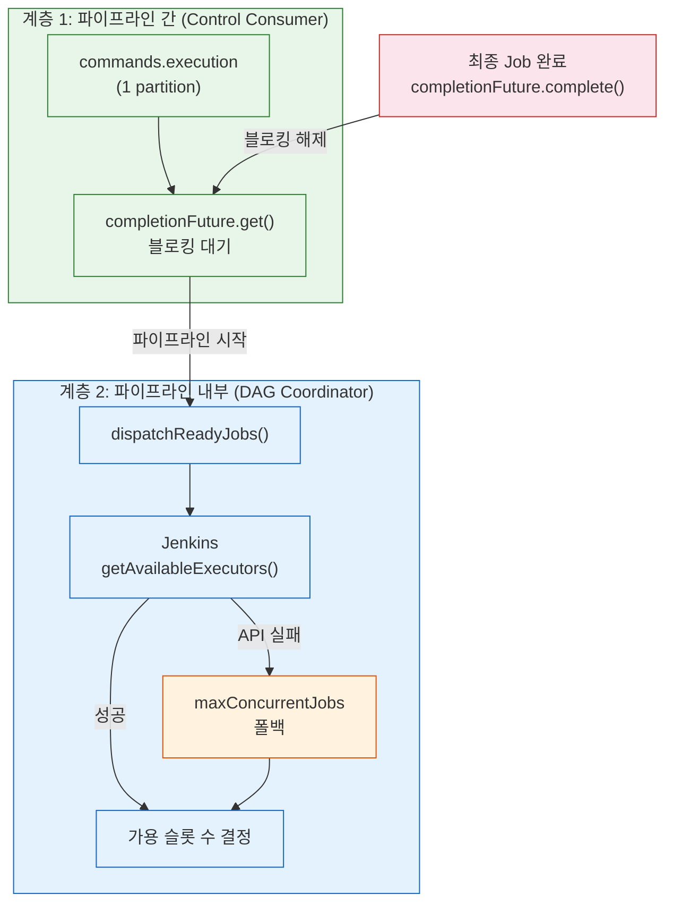
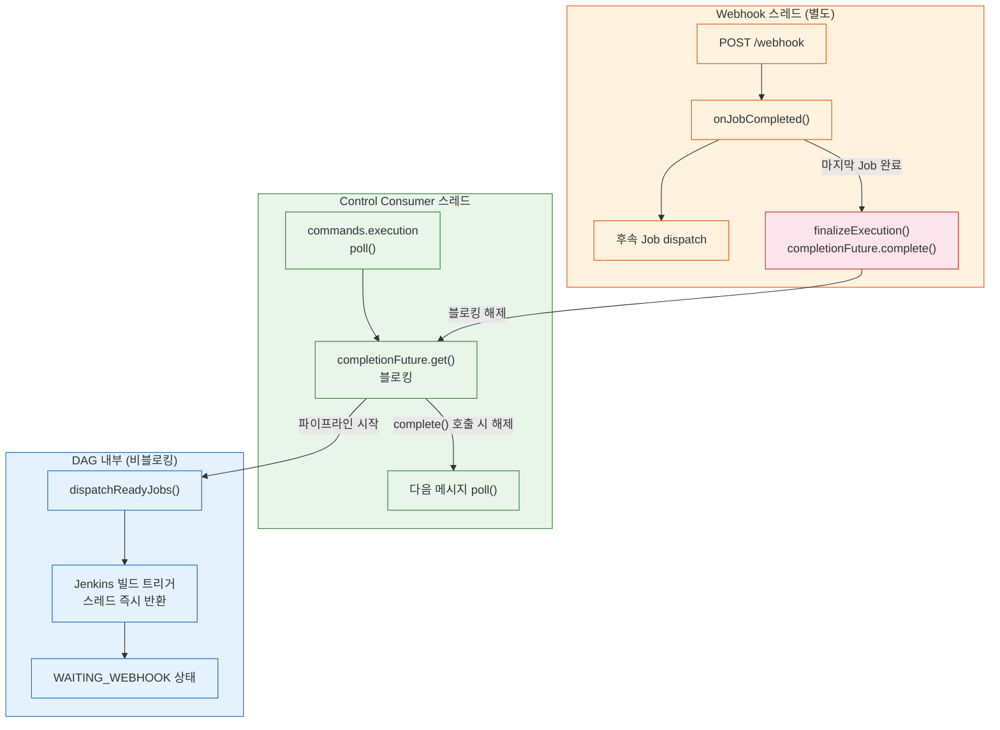
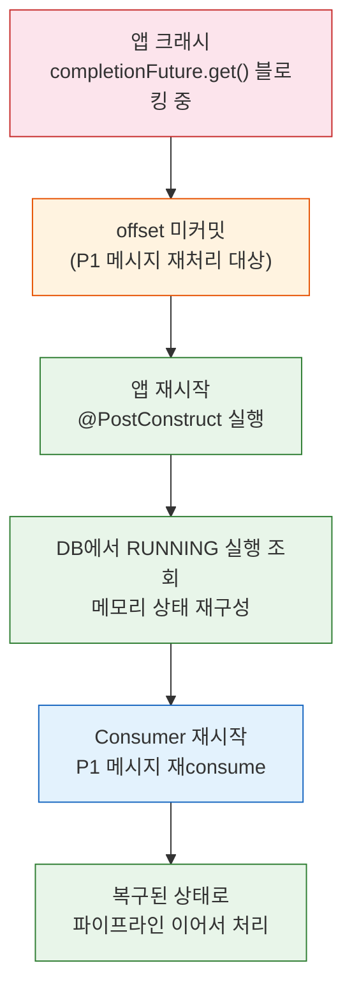
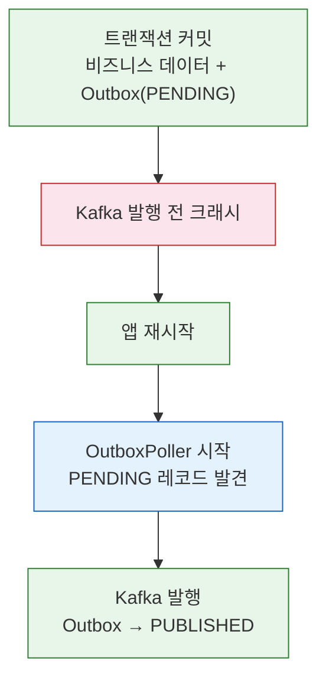
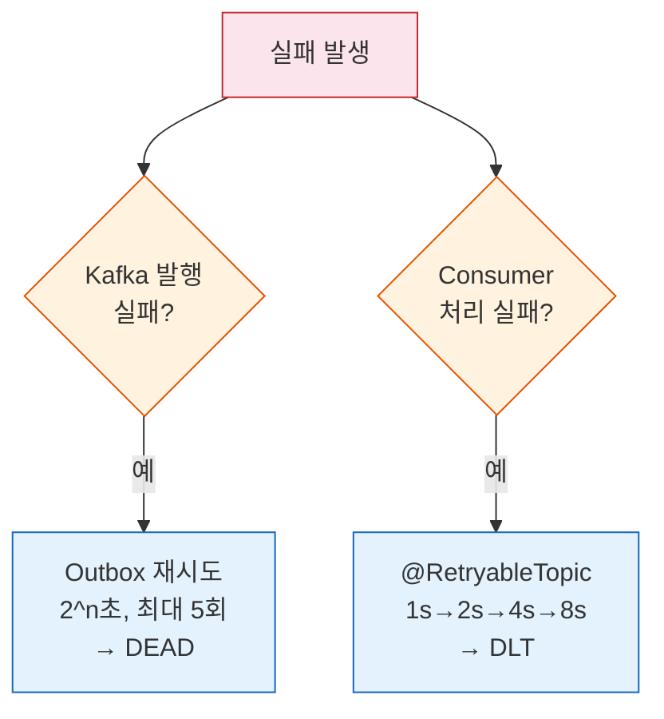
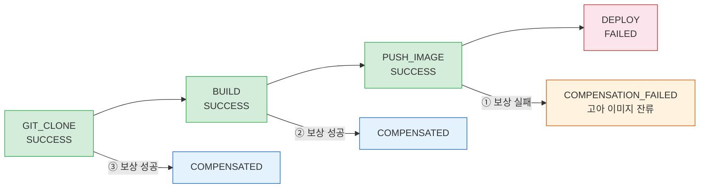
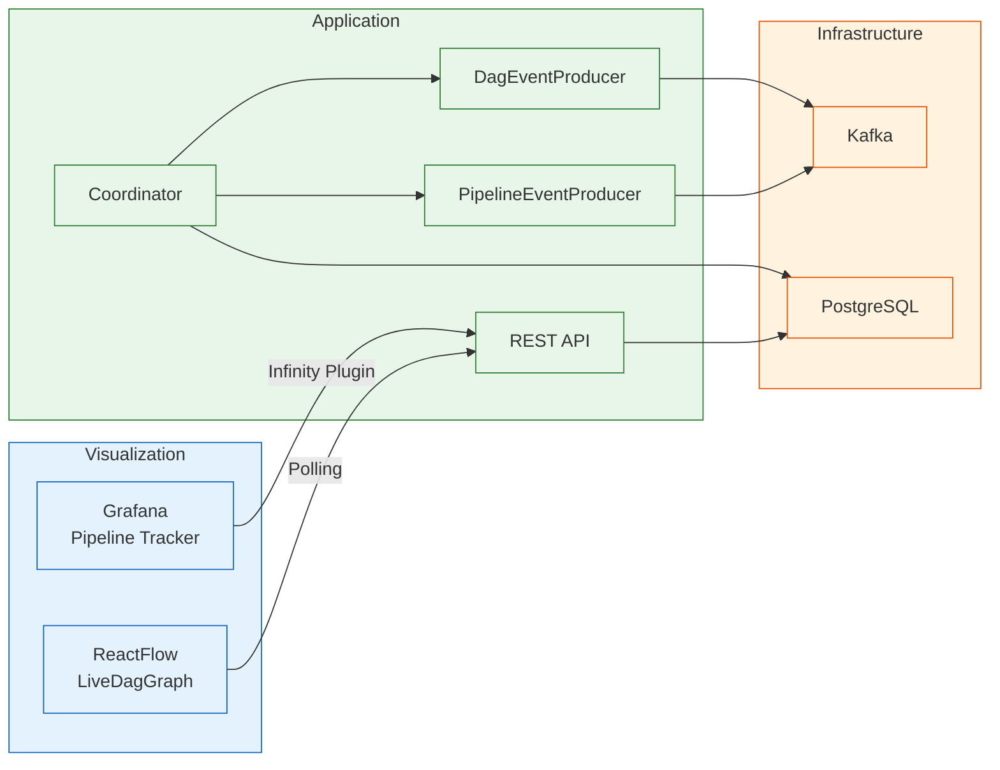

# DAG 엔진 운영 분석과 개선 방향
---
> 현재 구현의 운영 측면을 분석하고, 향후 개선 방향을 정리한다.
> 설계 배경과 코드는 04-01~04-02를 참조한다.

이 문서는 Redpanda Playground의 DAG 엔진을 운영 관점에서 해부한다. 각 섹션은 "지금 코드가 어떻게 돌아가는가", "그 동작의 의미는 무엇인가", "어디를 개선할 수 있는가"의 세 단계로 진행한다. 기존 05-01이 업계 사례 중심이었다면, 이 문서는 현재 구현에 발을 딛고 개선 여지를 도출하는 데 집중한다.

## 1. 동시성과 자원 관리
---

### 1-1. 현재 구현: 2-topic 기반 2계층 동시성 제어

2-topic DAG 패턴으로 전환한 이후, 동시성 제어는 파이프라인 간(inter-pipeline)과 파이프라인 내부(intra-pipeline) 두 계층으로 분리된다. 각 계층이 서로 다른 메커니즘으로 동시성을 다루기 때문에, 어느 계층에서 어떤 문제가 생기는지 구분해서 이해해야 한다.

**계층 1 — 파이프라인 간 순차 실행 (Control topic 블로킹)**

`commands.execution` 토픽은 파티션이 1개이므로, Consumer는 한 번에 하나의 파이프라인 실행 메시지만 처리한다. Consumer는 파이프라인을 시작하고 `completionFuture.get()`으로 블로킹한다. 파이프라인이 완전히 끝나야 다음 메시지를 poll하므로, 파이프라인 P1이 실행 중이면 P2는 토픽 안에서 대기한다.

```
[commands.execution]:  P1 ──블로킹──── P1완료 ── P2 ──블로킹──── P2완료 ── P3
[commands.jenkins]:    P1-J1,J2 ···· P1-J3 ····│···· P2-J1,J2 ···· P2-J3
[webhook.inbound]:     ········ P1-J1✓ · P1-J2✓ · P1-J3✓ │ P2-J1✓ ···
```

이 구조 덕분에 전역 동시 실행 수를 별도로 관리할 필요가 없다. 파티션 1개라는 Kafka 토폴로지 자체가 파이프라인 간 직렬화를 보장한다.

**계층 2 — 파이프라인 내부 병렬 실행 (Jenkins executor 확인)**

하나의 파이프라인 안에서 의존성 없는 Job들은 동시에 dispatch된다. `dispatchReadyJobs()`는 Jenkins 실행기 가용 수(`getAvailableExecutors()`)를 먼저 조회하고, 그 수만큼 Job을 제출한다. Jenkins API 호출에 실패하면 per-execution `maxConcurrentJobs` 설정값(기본 3)으로 폴백한다.

```java
int available = jenkinsClient.getAvailableExecutors()
        .orElse(props.maxConcurrentJobs()) - state.runningCount();
if (available <= 0) return;

var toDispatch = readyJobIds.subList(0, Math.min(readyJobIds.size(), available));
for (Long jobId : toDispatch) {
    state.markRunning(jobId);
    jobExecutorPool.submit(() -> executeJob(execution, job, jobOrder));
}
```

두 계층의 관계를 그림으로 정리하면 다음과 같다.



### 1-2. 동작 분석

Control topic 블로킹 덕분에 "파이프라인이 몇 개 동시에 실행되는가"라는 걱정 자체가 사라진다. 이전 in-memory executor 방식에서는 두 파이프라인이 각각 최대 3개씩 총 6개 Job을 스레드 풀에 쏟아낼 수 있었고, 전역 상한이 없었다. 2-topic 패턴은 1-partition 토픽으로 이 문제를 구조적으로 차단한다.

Jenkins executor 확인이 동시 실행 상한의 실질적 근거가 된다는 점도 중요하다. `maxConcurrentJobs`가 임의의 숫자였다면, Jenkins executor 수 기반 제어는 실제 CI 자원 가용량에 맞게 dispatch 속도를 자연스럽게 조절한다.

다만 per-execution `ReentrantLock`이 실행별 상태 전이를 직렬화하는 역할은 여전히 유효하다. `removeRunning` → `markCompleted` → `findReadyJobIds` → `markRunning` 시퀀스가 원자적으로 수행되어야 하므로, 동일 실행 내의 여러 webhook 콜백이 경쟁할 때 이 lock이 안전하게 직렬화한다.

`findReadyJobIds()`가 반환하는 순서는 `dependencyGraph`의 insertion order(LinkedHashMap)에 의존한다. 이는 우선순위와 무관하며, 긴급 Job이 먼저 dispatch된다는 보장이 없다.

### 1-3. 개선 여지

**멀티테넌시 전환 시 Control topic 분리**가 가장 자연스러운 확장 경로다. 현재는 단일 `commands.execution` 토픽이 모든 파이프라인을 직렬화하는데, 팀이 여럿이 되면 팀 A의 긴 파이프라인이 팀 B를 지연시키는 noisy neighbor 문제가 생긴다. 이 시점에 `commands.execution.{tenantId}` 형태로 토픽을 분리하고, 파티션 수를 늘리면 테넌트 간 격리와 병렬성을 동시에 확보할 수 있다.

**우선순위 큐**는 파이프라인 내부 계층에 적용한다. `PipelineExecution`에 `priority` 필드를 추가하고, `findReadyJobIds()` 결과를 priority 기준으로 정렬하면 긴급 Job이 먼저 슬롯을 확보한다. Temporal의 Task Queue Priority와 동일한 개념이며, 파이프라인 간 순차 실행이 보장된 상태에서 내부 순서만 조정하므로 구현 범위가 명확하다.

## 2. 외부 이벤트 대기와 자원 효율
---

### 2-1. 현재 구현: Control Consumer 블로킹과 DAG 내부 비블로킹의 공존

Control Consumer 스레드는 `completionFuture.get()`으로 블로킹되어 있다. 반면 DAG 내부에서는 Break-and-Resume 패턴으로 외부 이벤트를 기다린다. 이 두 패턴이 어떻게 충돌 없이 공존하는지 이해하는 것이 핵심이다.

```
Control Consumer 스레드:  [completionFuture.get() — 블로킹 중 ···················]
JobExecutor 스레드:        [J1 dispatch] [J1 반환] [J2 dispatch] [J2 반환]
WebhookHandler 스레드:                         [J1 완료] → onJobCompleted()
```

`executeJob()`에서 Jenkins executor가 빌드를 트리거하면, `je.isWaitingForWebhook()`이 true를 반환한다. 이때 `WAITING_WEBHOOK` 상태로 전환하고 스레드를 즉시 반환한다. Jenkins 빌드가 완료되면 별도 스레드에서 webhook POST가 도착하고, `onJobCompleted()`가 DAG를 재개한다. 마지막 Job이 완료되면 `finalizeExecution()`이 `completionFuture.complete()`를 호출하여 Control Consumer 블로킹을 해제한다.

```java
// Break-and-Resume: webhook 대기
if (je.isWaitingForWebhook()) {
    jobExecutionMapper.updateStatus(je.getId()
            , JobExecutionStatus.WAITING_WEBHOOK.name()
            , "Waiting for Jenkins webhook callback..."
            , LocalDateTime.now());
    return; // 스레드 반환 — webhook 도착 시 onJobCompleted()에서 재개
}
```

전체 흐름을 그림으로 정리하면 다음과 같다.



`WebhookTimeoutChecker`가 안전망 역할을 한다. 30초 주기로 `WAITING_WEBHOOK` 상태의 오래된 Job을 감지하여, webhook이 유실되더라도 파이프라인이 영원히 멈추지 않도록 보장한다.

### 2-2. 동작 분석

Control Consumer 스레드가 블로킹 중이어도 시스템이 정상 작동하는 이유는, DAG 내부 이벤트 처리가 전혀 다른 스레드(JobExecutor 풀, Webhook 핸들러)에서 이루어지기 때문이다. Consumer 블로킹은 "다음 파이프라인을 시작하지 않겠다"는 의미일 뿐, 현재 파이프라인의 Job 처리를 막지 않는다.

Break-and-Resume 덕분에 5~30분짜리 Jenkins 빌드가 여러 개 동시에 진행되어도 JobExecutor 스레드가 고갈되지 않는다. `maxConcurrentJobs = 3`인 환경에서 3개 Job이 모두 `WAITING_WEBHOOK`이면, JobExecutor 스레드 점유는 0이다.

그러나 `WAITING_WEBHOOK` 상태의 Job이 `runningCount()`에 포함되어 슬롯을 점유한다는 제약은 여전하다. `executeJob()`에서 `state.markRunning(jobId)` 후 스레드를 반환하므로, 대기 중인 Job도 running으로 카운트된다. 실제로는 Jenkins 빌드를 기다리는 중인데 슬롯을 점유하여, 다른 ready Job이 병렬로 실행될 기회를 막는다.

`WAITING_WEBHOOK`이 Jenkins 전용 상태라는 점도 제약이다. 승인 대기, 수동 확인 같은 다른 유형의 외부 이벤트에는 대응하지 못하며, 새로운 대기 유형이 필요할 때마다 전용 상태를 추가해야 한다.

### 2-3. 개선 여지

**슬롯 해제**가 가장 실용적인 개선이다. `DagExecutionState`에 `waitingJobIds` 집합을 추가하고 `markWaiting(jobId)` 메서드로 running에서 빼면, 대기 중에도 다른 ready Job이 슬롯을 사용할 수 있다. `runningCount()`는 `runningJobIds.size()`만 세므로 waiting으로 옮기면 자동으로 슬롯이 해제된다.

**WAITING 상태 일반화**는 `WAITING_WEBHOOK`을 `WAITING_EVENT`로 확장하고 이벤트 타입을 메타데이터로 구분하는 것이다. `PipelineJobExecution`에 `waitEventType`(WEBHOOK, APPROVAL, TIMER) 필드를 추가하면 다양한 대기 시나리오를 하나의 메커니즘으로 처리할 수 있다. Airflow의 deferrable operator가 이 패턴의 정교한 구현이다.

**개별 Job 타임아웃**은 Job 설정(configJson)에 `timeoutSeconds` 필드를 추가하고, WAITING 진입 시 `retryScheduler`에 타이머를 등록하는 방식으로 구현할 수 있다. 타임아웃 만료 시 `onJobCompleted(executionId, jobOrder, jobId, false)`를 호출하면 기존 실패 처리 흐름을 그대로 재활용할 수 있어 추가 구현이 최소화된다.

## 3. 크래시 복구와 안정성
---

### 3-1. 현재 구현: Kafka offset 기반 복구

2-topic 패턴에서 크래시 복구는 Kafka offset 미커밋이라는 핵심 속성에 의존한다. `commands.execution` Consumer가 파이프라인을 처리 중에 앱이 크래시하면, offset이 커밋되지 않은 상태로 남는다. 앱이 재시작하면 Consumer가 동일 메시지를 다시 consume하여 파이프라인을 재실행한다. 세 가지 크래시 시나리오를 구체적으로 살펴본다.

**시나리오 1: 파이프라인 실행 도중 앱 크래시**

`completionFuture.get()`으로 블로킹 중이었으므로 offset이 커밋되지 않았다. 앱 재시작 시 `@PostConstruct`의 `recoverRunningExecutions()`가 DB에서 RUNNING 상태 실행을 조회하여 메모리 상태를 재구성한다. Control Consumer가 재시작되면 미커밋 offset 덕분에 P1 메시지를 다시 consume하고, 복구된 실행을 이어서 처리한다.



`recoverRunningExecutions()`에서 각 `PipelineJobExecution` 상태에 따라 분기 처리한다.

- SUCCESS → `state.markCompleted(jobId)` (완료 사전 등록)
- FAILED, COMPENSATED → `state.markFailed(jobId)`
- SKIPPED → `state.markSkipped(jobId)`
- RUNNING, WAITING_WEBHOOK → FAILED로 전환 (webhook 유실 가정)
- PENDING → 그대로 유지

```java
case RUNNING, WAITING_WEBHOOK -> {
    jobExecutionMapper.updateStatus(je.getId()
            , JobExecutionStatus.FAILED.name()
            , "Failed during crash recovery (interrupted)"
            , LocalDateTime.now());
    state.markFailed(je.getJobId());
}
```

**시나리오 2: Outbox 발행 전 크래시**

비즈니스 데이터와 Outbox 레코드는 동일 트랜잭션에서 커밋된다. 앱이 Kafka 발행 전에 크래시해도, DB에는 PENDING 상태의 Outbox 레코드가 남는다. 앱 재시작 후 OutboxPoller가 PENDING 레코드를 발견하고 Kafka에 발행한다.



**시나리오 3: Jenkins 빌드 진행 중 크래시**

`WAITING_WEBHOOK` 상태의 Job이 있을 때 크래시하면, `@PostConstruct`가 해당 Job을 FAILED로 전환한다. 별도로 `WebhookTimeoutChecker`(30초 폴링)가 stale Job을 감지하는 역할도 한다. Jenkins 빌드는 실제로 계속 진행 중이지만, 시스템은 보수적으로 FAILED 처리하고 수동 재시작 API 호출을 유도한다.

in-memory queue 방식과 Kafka offset 방식의 복구 차이를 정리하면 다음과 같다.

| 항목 | in-memory queue | Kafka offset 기반 |
|------|-----------------|-------------------|
| 크래시 후 진행 중 파이프라인 | 상태 유실, 재시작 불가 | offset 미커밋으로 자동 재처리 |
| 복구 트리거 | 별도 감시 필요 | Consumer 재시작 시 자동 |
| 발행 전 크래시 | 이벤트 유실 | Outbox 패턴으로 DB 보장 |
| WAITING_WEBHOOK 크래시 | webhook 영원히 대기 | @PostConstruct FAILED 전환 |

### 3-2. 동작 분석

보수적 복구 전략의 트레이드오프가 존재한다. RUNNING이었던 Job이 실제로는 크래시 직전에 성공했더라도 FAILED로 처리된다. 이 보수적 접근이 합리적인 이유는 반대 경우가 더 위험하기 때문이다. 성공을 가정하고 하류 Job을 실행하면, 실제로는 실패한 빌드 위에서 배포가 진행되는 치명적 상황이 발생할 수 있다. FAILED 처리 후 부분 재시작 API로 수동 재개하는 편이 안전하다.

복구 후 3분기 판정도 주목할 만하다. 상태를 재구성한 뒤 `isAllDone()`이면 `finalizeExecution()`으로, `hasFailure()`이면 `handleFailure()`로, 나머지는 `dispatchReadyJobs()`로 진행한다. 이 분기 구조는 정상 실행 시의 `onJobCompleted()` 분기와 동일하여, 복구가 정상 흐름에 자연스럽게 합류한다.

복구 중 특정 실행에서 예외가 발생하면 해당 실행만 FAILED로 마킹하고 다른 실행의 복구를 계속 진행한다. 한 실행의 복구 실패가 전체 앱 시작을 블로킹하지 않도록 설계된 것이다.

두 계층 복구의 역할 분담을 정리하면 다음과 같다.

| 메커니즘 | 트리거 | 대상 | 동작 |
|----------|--------|------|------|
| `recoverRunningExecutions()` | 앱 시작 (`@PostConstruct`) | RUNNING 상태 실행 | 메모리 상태 재구성 + RUNNING Job FAILED 전환 |
| `WebhookTimeoutChecker` | 주기적 (`@Scheduled` 30s) | WAITING_WEBHOOK 오래된 Job | Job FAILED 전환 |
| `cleanupStaleExecutions()` | 주기적 (`@Scheduled`) | 오래된 전체 실행 | 메모리 state/lock 제거 + DB 상태 정리 |

### 3-3. 개선 여지

**리스/하트비트 기반 정밀 복구**가 보수적 복구의 한계를 극복할 수 있다. Job이 실행 중 주기적으로 heartbeat를 전송하고, heartbeat TTL이 만료된 Job만 FAILED로 전환하는 것이다. 구현 골격은 `PipelineJobExecution`에 `leaseExpiresAt` 컬럼을 추가하고, `recoverRunningExecutions()`에서 `leaseExpiresAt < now()`인 Job만 FAILED 전환하는 방식이다. 리스가 아직 유효한 Job은 "아직 실행 중"으로 판단하여 그대로 유지한다.

**외부 시스템 상태 확인**도 정밀도를 높인다. 복구 시 Jenkins API(`/job/{name}/{buildNumber}/api/json`)로 빌드 상태를 조회하여 실제 성공/실패를 확인한 뒤 판정하면 불필요한 FAILED 전환을 줄일 수 있다. 다만 Jenkins API 호출 실패에 대한 폴백(기본 FAILED)이 필요하므로 구현 복잡도가 올라간다.

## 4. 재시도와 실패 분류
---

### 4-1. 현재 구현: 2계층 재시도 시스템

재시도는 Outbox 계층과 Consumer 계층 두 곳에서 독립적으로 작동한다. 어느 계층에서 실패가 발생했는지에 따라 재시도 주체가 다르기 때문에, 두 계층을 구분해서 이해해야 한다.

**계층 1 — Outbox 재시도 (Kafka 발행 실패)**

`OutboxPoller`가 PENDING 레코드를 발행하다가 Kafka 연결에 실패하면, 지수 백오프(`2^n` 초)로 재시도한다. 최대 5회 재시도 후에도 실패하면 상태를 `DEAD`로 전환하여 자동 재시도 대상에서 제외한다.

**계층 2 — @RetryableTopic (Consumer 처리 실패)**

`PipelineEventConsumer`와 `WebhookEventConsumer`에 `@RetryableTopic`을 적용하여, Consumer 처리 중 예외가 발생하면 retry 토픽 체인을 통해 자동 재시도한다.

```
원본 토픽 → retry-0 (1초 대기) → retry-1 (2초 대기) → retry-2 (4초 대기) → retry-3 (8초 대기) → DLT
```



```mermaid
flowchart LR
    ORG["commands.execution\n(원본)"]
    R0["commands.execution\n-retry-0\n(1s)"]
    R1["commands.execution\n-retry-1\n(2s)"]
    R2["commands.execution\n-retry-2\n(4s)"]
    R3["commands.execution\n-retry-3\n(8s)"]
    DLT["commands.execution\n-dlt\n(Dead Letter)"]

    ORG -- "예외" --> R0
    R0 -- "재시도 실패" --> R1
    R1 -- "재시도 실패" --> R2
    R2 -- "재시도 실패" --> R3
    R3 -- "재시도 실패" --> DLT

    style ORG fill:#e8f5e9,stroke:#2e7d32,color:#333
    style R0 fill:#fff3e0,stroke:#e65100,color:#333
    style R1 fill:#fff3e0,stroke:#e65100,color:#333
    style R2 fill:#fff3e0,stroke:#e65100,color:#333
    style R3 fill:#fff3e0,stroke:#e65100,color:#333
    style DLT fill:#fce4ec,stroke:#c62828,color:#333
```

`WebhookEventConsumer`도 동일하게 4회 재시도(1s → 2s → 4s → 8s) 후 DLT로 이동한다.

DLT 적재 후 수동 재처리 절차는 다음과 같다.

```bash
# DLT 메시지 확인
rpk topic consume commands.execution-dlt --num 1

# 에러 헤더 분석 (kafka_dlt-exception-message, kafka_dlt-original-topic 등)
# 원인 수정 후 원본 토픽으로 재발행
rpk topic produce commands.execution --key {executionId}
```

**계층 간 역할 분담**을 정리하면 다음과 같다.



DAG 내부 Job 실행 실패는 `executeJob()`의 catch 블록에서 별도로 처리된다. `1L << currentRetry`로 지연 시간을 계산(1초, 2초, 4초)하며, `jobMaxRetries` 상한에 도달하면 `onJobCompleted(success=false)`를 호출하여 실패 처리 흐름으로 넘어간다.

### 4-2. 실패 분류와 재시도 효과

모든 예외를 동일하게 취급하는 것이 현재 구현의 주요 제약이다.

| 실패 유형 | 예시 | 재시도 효과 | 적절한 정책 |
|----------|------|-----------|------------|
| 애플리케이션 실패 | `IllegalArgumentException`, 파라미터 오류 | 무의미 (같은 결과) | 즉시 실패 처리 |
| 인프라 실패 | 네트워크 순단, DB 커넥션 고갈 | 유효 (복구 가능) | 지수 백오프 제한 재시도 |
| 일시적 실패 | HTTP 429 Rate Limit, 타임아웃 | 유효 (시간 경과 후) | 고정 간격 적극 재시도 |
| 보상 대상 실패 | 다단계 실행 중간 실패 | 재시도보다 SAGA 보상 우선 | 즉시 보상 트리거 |

`@RetryableTopic`과 Outbox 재시도는 인프라 실패와 일시적 실패에 효과적이다. 그러나 애플리케이션 버그처럼 재시도해도 동일하게 실패하는 케이스가 DLT로 가기 전까지 불필요한 지연(최대 15초)을 만든다.

백오프 상한도 없다. `executeJob()` 내부 재시도에서 `maxRetries=10`이면 마지막 재시도 전 대기가 512초에 달한다. `Math.min(1L << currentRetry, maxDelaySeconds)`로 상한을 두는 것이 필요하다.

### 4-3. 개선 여지

**실패 분류(failure taxonomy)**가 재시도 효율을 근본적으로 개선한다. `RetryClassifier` 인터페이스를 두고 예외를 받아 `RetryDecision(RETRY, FAIL_IMMEDIATELY, COMPENSATE)`을 반환하면 된다. `IOException`과 `TimeoutException`은 RETRY, `IllegalArgumentException`과 `IllegalStateException`은 FAIL_IMMEDIATELY로 매핑하면 불필요한 재시도를 제거할 수 있다.

**@RetryableTopic `classify` 필터**를 적용하면 Consumer 계층에서도 동일하게 적용된다. `@RetryableTopic(include = {TransientException.class, InfraException.class})`처럼 재시도 대상 예외를 명시하면, 애플리케이션 버그는 바로 DLT로 라우팅되어 불필요한 retry 토픽 순환을 방지한다.

**webhook 실패 재시도**는 `onJobCompleted(success=false)` 시점에 `je.getRetryCount()`를 확인하고 상한 이내이면 Jenkins API로 빌드를 재트리거하는 방식이다. 이때 Jenkins API로 실제 빌드 상태를 먼저 조회하여 진짜 실패인지 확인하는 것이 안전하다.

## 5. SAGA 보상의 한계
---

### 5-1. 현재 구현

`compensateDag()`가 역위상순으로 보상을 실행한다. `completedJobIdsInReverseTopologicalOrder()`가 성공한 Job만으로 서브그래프를 구성하고, Kahn's algorithm으로 위상 정렬한 뒤 뒤집어 leaf → root 순서를 반환한다. 04-01에서 상세히 분석한 메서드이다.

보상 대상은 SUCCESS 상태 Job만이다. executor가 null이면 보상을 건너뛰되 COMPENSATED로 마킹한다. 이는 알림 전송처럼 보상이 불필요한 Job 타입을 허용하기 위한 의도적 설계다.

보상 실패 시 전체 보상 체인을 중단하지 않고 다음 Job의 보상을 계속 시도한다. 실패한 보상에 대해서는 "MANUAL INTERVENTION REQUIRED" 로그를 남기고 `COMPENSATION_FAILED` 상태로 기록한다.

```java
} catch (Exception e) {
    log.error("[DAG-SAGA] Compensation FAILED for job: {} - MANUAL INTERVENTION REQUIRED"
            , je.getJobName(), e);
    jobExecutionMapper.updateStatus(je.getId()
            , JobExecutionStatus.FAILED.name()
            , "COMPENSATION_FAILED: " + e.getMessage()
            , LocalDateTime.now());
}
```

### 5-2. 동작 분석

보상 실패가 누적되면 시스템 상태가 불확실해진다. 다음 시나리오로 문제를 구체화할 수 있다.



PUSH_IMAGE 보상이 실패하면 Registry에 고아 이미지가 남는다. BUILD와 GIT_CLONE 보상은 정상 수행되므로 아티팩트와 워크스페이스는 정리되지만, 이미지만 고아로 남아 저장소 용량을 차지한다. 현재는 로그만으로 이 상황을 인지해야 하며, 알림 채널 연동이 없어 운영자가 로그를 모니터링하지 않으면 놓칠 수 있다.

`SagaCompensator` 필드가 주입되지만 사용되지 않는 점도 기술 부채다. 03-separation-analysis에서 분석한 대로, 순차 실행 전용 보상이 DAG의 역위상순 보상과 맞지 않아 `compensateDag()`를 별도로 구현한 결과다. 미사용 필드가 코드에 남아 있으면 의존성 구조에 혼란을 준다.

executor가 null일 때 보상을 건너뛰되 COMPENSATED로 마킹하는 동작에도 위험이 있다. 보상이 필요한 Job에서 executor 등록을 빠뜨리면, 보상이 실제로는 수행되지 않았는데 수행된 것으로 기록된다.

### 5-3. 개선 여지

**보상 재시도**를 도입하면 일시적 장애로 인한 보상 실패를 자동 복구할 수 있다. `compensate()` 실패 시 지수 백오프로 N회(기본 3회) 재시도하고, 그래도 실패하면 현재처럼 MANUAL INTERVENTION으로 넘기는 2단계 구조가 적절하다. 보상은 멱등해야 하므로, executor의 `compensate()` 구현이 재호출에 안전한지 확인이 선행되어야 한다.

**Dead letter queue**는 보상 실패 이벤트를 별도 Kafka 토픽(`pipeline.compensation.dlq`)에 발행하는 것이다. 모니터링 시스템이 이 토픽을 구독하면 보상 실패를 실시간으로 감지할 수 있고, 나중에 배치 Consumer로 재시도할 수도 있다.

**알림 통합**은 가장 비용 대비 효과가 좋은 개선이다. 보상 실패 시 Slack/이메일 알림을 보내면 로그 모니터링 없이도 즉시 인지할 수 있다. 기존 `DagEventProducer`에 `publishCompensationFailed()` 메서드를 추가하고, Consumer에서 알림 채널로 전달하면 된다.

**미사용 `SagaCompensator` 필드 정리**는 코드 위생 차원에서 필요하다. DAG 보상이 `compensateDag()`로 완전히 독립했으므로, Coordinator에서 `SagaCompensator` 의존성을 제거하면 의존성 구조가 명확해진다.

## 6. 모니터링과 관측성
---

### 6-1. 현재 구현

모니터링은 세 계층으로 구성된다.

**이벤트 계층**: `DagEventProducer`가 `DagJobDispatchedEvent`와 `DagJobCompletedEvent`를 Kafka에 발행한다. Job이 dispatch될 때와 완료될 때 각각 이벤트가 생성되어 실시간 상태 추적이 가능하다. `PipelineEventProducer`도 실행 전체의 상태 변경 이벤트를 발행한다.

**대시보드 계층**: Grafana Pipeline Tracker 대시보드가 Infinity 플러그인으로 REST API를 직접 호출하여 Node Graph 패널에 DAG를 시각화한다. 노드 색상으로 Job 상태(SUCCESS/RUNNING/FAILED/PENDING)를 표현한다.

**프론트엔드 계층**: ReactFlow `LiveDagGraph` 컴포넌트가 실시간 그래프를 렌더링한다. 폴링으로 상태 변경을 반영하여 사용자에게 시각적 피드백을 제공한다.

세 계층의 데이터 흐름을 정리하면 다음과 같다.



Kafka로는 이벤트가 발행되지만, 시각화 계층(Grafana, ReactFlow)은 Kafka를 직접 구독하지 않고 REST API를 통해 DB를 조회한다. Kafka 이벤트는 현재 프론트엔드 알림이나 외부 시스템 연동보다는 감사 로그 용도에 가깝다.

### 6-2. 동작 분석

이벤트 기반 상태 추적은 실시간성이 좋지만, 집계 메트릭이 부재하다. "지난 7일간 평균 실행 시간", "Job 타입별 실패율", "가장 오래 걸리는 병목 Job" 같은 분석이 현재 구조로는 어렵다. 매번 Kafka 이벤트 로그를 수동으로 집계해야 한다.

Infinity 플러그인이 REST API를 직접 호출하는 구조는 대시보드 조회가 애플리케이션 서버에 부하를 준다. 동시 사용자가 늘거나 대시보드 새로고침 주기가 짧아지면 API 서버의 응답 시간에 영향을 줄 수 있다.

알림 규칙도 미구성 상태다. 파이프라인이 실패하거나 실행 시간이 비정상적으로 길어져도 Grafana가 자동으로 통지하지 않으며, 야간이나 주말에 발생하는 실패는 다음 출근 시까지 인지되지 않을 수 있다.

### 6-3. 개선 여지

**Prometheus 메트릭 노출**이 집계 분석의 기반이 된다. Spring Boot Actuator + Micrometer로 다음 메트릭을 `/actuator/prometheus` 엔드포인트에 노출할 수 있다.

- `dag_job_duration_seconds` (히스토그램): Job 타입별 실행 시간 분포. 병목 Job 식별에 핵심.
- `dag_job_completed_total` (카운터): `{status="success|failed", job_type="BUILD|DEPLOY|..."}` 레이블로 분류. 실패율 추이 파악.
- `dag_executions_active` (게이지): 현재 진행 중인 실행 수. 자원 사용량 모니터링.
- `dag_compensation_failures_total` (카운터): 보상 실패 횟수. 5장의 보상 실패 감지와 연계.

**알림 규칙**은 Grafana Alerting으로 설정한다. 세 가지 규칙이 가장 효과적이다.

- 실패율 알림: `rate(dag_job_completed_total{status="failed"}[1h])` > 임계치
- 실행 시간 알림: `dag_job_duration_seconds{quantile="0.99"}` > Y분
- 보상 실패 알림: `increase(dag_compensation_failures_total[1h])` > 0

**로그 집계**는 Loki로 Job 로그를 중앙 수집하는 것이다. 현재 Job 실행 로그가 `PipelineJobExecution.log` 컬럼에 저장되는데, Loki에도 전송하면 Grafana에서 메트릭과 로그를 상관 분석할 수 있다. GCP 클러스터에 Loki가 구성되어 있으므로 연동 비용이 낮다.

## 7. 확장 시나리오
---

### 7-1. 멀티테넌시와 격리

현재 모든 파이프라인이 동일 자원 풀을 공유한다. 멀티테넌시는 의도적으로 포기한 상태인데, 단일 팀이 단일 도메인에서 사용하는 현재 규모에서는 합리적 판단이다.

플랫폼화되면 세 가지 격리가 필요해진다.

- **리소스 격리**: 팀 A의 대량 빌드가 팀 B의 긴급 배포를 밀어내면 안 된다. per-tenant parallelism 제한으로 대응한다.
- **가시성 격리**: 팀 A가 팀 B의 파이프라인을 보거나 취소할 수 없어야 한다. API 레벨 ACL로 구현한다.
- **설정 격리**: 팀별 재시도 정책, 동시 실행 수가 달라야 한다. 테넌트별 설정 오버라이드로 대응한다.

Control topic 측면에서 보면, `commands.execution.{tenantId}` 형태로 토픽을 분리하면 테넌트 간 순차 실행 독립성을 동시에 확보할 수 있다. 현재 단일 파티션 토픽이 전역 직렬화를 담당하는 것처럼, 테넌트별 토픽이 각자의 실행 순서를 독립적으로 관리한다. noisy neighbor 문제가 실제로 발생한 뒤에 분리를 검토해도 늦지 않으며, 최소 격리 시작점은 `PipelineExecution`에 `tenantId` 컬럼을 추가하는 것이다.

### 7-2. 버전 관리와 배포 안전성

Definition 변경 시 실행 중 파이프라인과의 호환성이 문제가 된다. 현재 `PipelineDefinition`은 실행 시작 시점에 DB에서 로드되므로, 실행 도중 Definition이 변경되어도 진행 중인 실행에는 영향이 없다. 그러나 메모리에 로드된 상태와 DB의 최신 상태가 달라질 수 있으므로, 실행 시작 시점의 Definition 스냅샷을 `PipelineExecution.definitionSnapshot` 컬럼에 JSON으로 저장하면 더 안전하다.

블루-그린 배포 시 `WAITING_WEBHOOK` 상태의 Job이 있으면, 새 버전의 앱이 webhook을 수신하게 된다. 콜백 처리 로직이 하위 호환을 유지하지 않으면 오동작할 수 있다. 세 가지 대응 원칙이 필요하다.

- 콜백 처리 로직은 backward compatible로 유지한다.
- 호환성이 깨지는 변경은 새 Job 타입을 추가하는 방식으로 대응한다.
- deprecation 기간을 두고 기존 Job 타입을 점진적으로 제거한다.

### 7-3. 대형 DAG 상태 오프로딩

`ConcurrentHashMap`(`executionStates`, `executionLocks`)에 모든 실행 상태를 보관하는 현재 구조는 메모리 한계가 있다. `finalizeExecution()`에서 완료된 실행의 state와 lock을 제거하지만, 동시에 수십 개 실행이 진행되면 메모리 압력이 발생할 수 있다. 각 `DagExecutionState`가 보유하는 데이터를 추산하면 다음과 같다.

- `dependencyGraph`: Job 수 N개의 `LinkedHashMap<Long, PipelineJob>` + 의존성 Set
- `successorGraph`: N개의 `HashMap<Long, Set<Long>>`
- `completedJobIds`, `runningJobIds`, `failedJobIds`, `skippedJobIds`: 최대 N개씩 4개의 Set
- `jobIdToJobOrder`: N개의 `Map<Long, Integer>`

Active/Archive 분리가 실용적 해결책이다. 단계적 접근이 현실적이다.

1. **즉시**: `finalizeExecution()`에서 state/lock 제거 확인 (현재 동작)
2. **주간 배치**: 완료 후 7일 지난 `pipeline_execution`을 archive 테이블로 이동
3. **월간**: archive에서 TTL(90일) 초과분 삭제
4. **선택**: `PipelineJobExecution.log`의 대형 값을 오브젝트 스토리지로 이관

### 7-4. 백필과 선택 재실행

현재 부분 재시작만 지원한다. `startExecution()`에서 이미 SUCCESS인 Job을 `markCompleted()`로 사전 등록하는 방식이다. FAILED 지점부터 자동으로 재실행되므로, "가장 최근 실패 지점부터 이어서"라는 기본 시나리오는 커버한다.

세 가지 확장 시나리오가 미지원 상태다.

- **선택 재실행**: "BUILD는 성공했지만 DEPLOY 설정을 바꿔서 DEPLOY만 다시 돌리고 싶다." 재실행 시작점을 지정하는 API가 필요하다.
- **절단면 재실행**: "변환 로직을 수정했으니 변환+적재를 다시 실행하되, 추출은 건너뛰고 싶다." 성공한 노드 중 특정 집합만 유지하는 기능이 필요하다.
- **백필**: "지난 주 빌드를 새 설정으로 다시 돌리고 싶다." Definition 스냅샷 + 과거 파라미터로 새 실행을 생성하는 기능이 필요하다.
